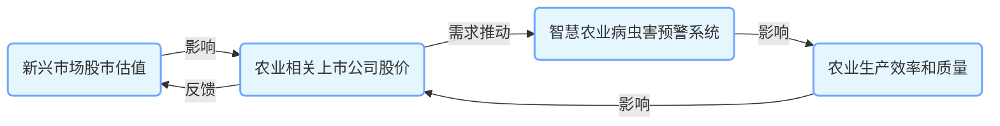

# 新兴市场股市估值与智慧农业病虫害预警系统的互动

> 关键词：新兴市场股市估值、智慧农业病虫害预警系统、互动关系、金融与农业、市场分析

> 摘要：本文旨在深入探讨新兴市场股市估值与智慧农业病虫害预警系统之间的互动关系。首先介绍了研究的背景、目的、预期读者等内容，接着阐述了核心概念及联系，包括新兴市场股市估值原理、智慧农业病虫害预警系统架构等，并给出相应的示意图和流程图。通过核心算法原理的Python代码展示、数学模型和公式的详细讲解与举例，深入剖析两者互动的内在逻辑。结合项目实战案例，从开发环境搭建到源代码实现及解读，进一步说明互动在实际中的体现。分析了两者互动在不同场景下的实际应用，推荐了相关的学习资源、开发工具框架和论文著作。最后总结了未来发展趋势与挑战，解答常见问题并提供扩展阅读和参考资料，以帮助读者全面理解新兴市场股市估值与智慧农业病虫害预警系统的互动关系及其影响。

## 1. 背景介绍 

### 1.1 目的和范围
本研究的主要目的是揭示新兴市场股市估值与智慧农业病虫害预警系统之间的潜在互动关系。新兴市场股市作为全球金融市场的重要组成部分，其估值受到多种因素的影响，包括宏观经济环境、行业发展趋势等。而智慧农业病虫害预警系统则是现代农业发展的关键技术之一，它对于保障农作物产量和质量、促进农业可持续发展具有重要意义。通过研究两者之间的互动，我们可以更好地理解金融市场与农业领域之间的联系，为投资者、农业从业者和政策制定者提供决策依据。

本研究的范围涵盖了新兴市场股市的主要行业和板块，特别是与农业相关的上市公司。同时，也涉及智慧农业病虫害预警系统的技术原理、应用现状和发展趋势。通过对两者的综合分析，探讨它们之间的相互影响机制和潜在的投资机会。

### 1.2 预期读者
本文的预期读者包括金融投资者、农业从业者、政策制定者、学术研究人员以及对金融市场和农业科技感兴趣的人士。对于金融投资者来说，了解新兴市场股市估值与智慧农业病虫害预警系统的互动关系可以帮助他们发现潜在的投资机会，优化投资组合。农业从业者可以从本文中了解金融市场对农业的影响，以及如何利用智慧农业技术提高生产效率和应对病虫害风险。政策制定者可以根据研究结果制定相关政策，促进金融市场与农业的协同发展。学术研究人员可以将本文作为进一步研究的参考，拓展相关领域的研究视角。

### 1.3 文档结构概述
本文共分为十个部分。第一部分为背景介绍，阐述了研究的目的、范围、预期读者和文档结构。第二部分介绍核心概念与联系，包括新兴市场股市估值和智慧农业病虫害预警系统的原理和架构，并给出相应的示意图和流程图。第三部分讲解核心算法原理和具体操作步骤，通过Python代码详细阐述两者互动的算法逻辑。第四部分介绍数学模型和公式，对互动关系进行量化分析，并举例说明。第五部分为项目实战，包括开发环境搭建、源代码详细实现和代码解读。第六部分分析实际应用场景，探讨两者互动在不同场景下的具体应用。第七部分推荐相关的工具和资源，包括学习资源、开发工具框架和论文著作。第八部分总结未来发展趋势与挑战，对两者互动的未来发展进行展望。第九部分为附录，解答常见问题。第十部分提供扩展阅读和参考资料，方便读者进一步深入研究。

### 1.4 术语表

#### 1.4.1 核心术语定义
- **新兴市场股市**：指发展中国家和地区的股票市场，通常具有较高的增长潜力和风险。
- **股市估值**：对股票市场中上市公司的价值进行评估的过程，常用的估值方法包括市盈率、市净率等。
- **智慧农业**：将物联网、大数据、人工智能等现代信息技术应用于农业生产、管理和服务的新型农业模式。
- **病虫害预警系统**：利用传感器、监测设备和数据分析技术，对农作物病虫害的发生、发展进行实时监测和预警的系统。

#### 1.4.2 相关概念解释
- **宏观经济环境**：指一个国家或地区的总体经济状况，包括经济增长、通货膨胀、利率等因素。宏观经济环境对新兴市场股市估值具有重要影响。
- **农业产业链**：从农业生产资料的供应到农产品的加工、销售等一系列环节构成的产业链条。智慧农业病虫害预警系统的应用可以影响农业产业链的各个环节。
- **数据挖掘**：从大量的数据中提取有价值的信息和知识的过程。在智慧农业病虫害预警系统中，数据挖掘技术可以用于分析病虫害的发生规律和趋势。

#### 1.4.3 缩略词列表
- **GDP**：国内生产总值（Gross Domestic Product）
- **PE**：市盈率（Price-to-Earnings Ratio）
- **PB**：市净率（Price-to-Book Ratio）
- **IoT**：物联网（Internet of Things）
- **AI**：人工智能（Artificial Intelligence）

## 2. 核心概念与联系 

### 新兴市场股市估值原理
新兴市场股市估值是一个复杂的过程，受到多种因素的影响。其中，宏观经济因素是影响股市估值的重要因素之一。例如，国内生产总值（GDP）的增长速度、通货膨胀率、利率水平等都会对股市估值产生影响。一般来说，经济增长较快、通货膨胀率较低、利率水平适中的情况下，股市估值往往较高。

行业发展趋势也是影响股市估值的重要因素。不同行业的发展前景和盈利能力不同，因此其估值水平也会有所差异。例如，新兴产业如科技、医疗等行业通常具有较高的增长潜力，其估值水平也相对较高；而传统产业如钢铁、煤炭等行业的增长潜力相对较小，其估值水平也相对较低。

上市公司的财务状况和经营业绩也是影响股市估值的关键因素。投资者通常会关注上市公司的净利润、营业收入、资产负债表等财务指标，以及公司的市场竞争力、管理水平等经营指标。财务状况良好、经营业绩优秀的上市公司往往具有较高的估值水平。

### 智慧农业病虫害预警系统架构
智慧农业病虫害预警系统主要由传感器层、网络层、数据处理层和应用层组成。

传感器层是系统的基础，主要负责采集农作物生长环境的各种数据，如温度、湿度、光照强度、土壤湿度等，以及病虫害的相关数据，如病虫害的种类、数量、分布等。常用的传感器包括温湿度传感器、光照传感器、图像传感器等。

网络层主要负责将传感器采集到的数据传输到数据处理层。常用的网络传输技术包括无线传感网络（WSN）、蓝牙、Wi-Fi、ZigBee等。

数据处理层是系统的核心，主要负责对采集到的数据进行处理和分析。通过数据挖掘、机器学习等技术，对病虫害的发生规律和趋势进行预测和预警。常用的数据处理算法包括决策树、支持向量机、神经网络等。

应用层主要负责将处理和分析后的数据以直观的方式呈现给用户，如通过手机应用、网页等方式。用户可以根据系统提供的预警信息，及时采取相应的防治措施。

### 核心概念联系示意图


从示意图中可以看出，新兴市场股市估值会影响农业相关上市公司的股价，而股价的变化又会反馈到股市估值中。智慧农业病虫害预警系统可以提高农业生产效率和质量，从而影响农业相关上市公司的业绩和股价。同时，农业相关上市公司的需求也会推动智慧农业病虫害预警系统的发展。

## 3. 核心算法原理 & 具体操作步骤 

### 新兴市场股市估值算法
在新兴市场股市估值中，常用的算法之一是市盈率（PE）估值法。市盈率是指股票价格与每股收益的比率，它反映了投资者为获得每一元净利润所愿意支付的价格。其计算公式为：

$PE = \frac{P}{EPS}$

其中，$P$ 表示股票价格，$EPS$ 表示每股收益。

以下是一个简单的Python代码示例，用于计算股票的市盈率：

```python
# 定义股票价格和每股收益
stock_price = 50
earnings_per_share = 5

# 计算市盈率
pe_ratio = stock_price / earnings_per_share

print(f"该股票的市盈率为: {pe_ratio}")
```

### 智慧农业病虫害预警算法
在智慧农业病虫害预警系统中，常用的算法之一是基于机器学习的分类算法，如决策树算法。决策树算法是一种基于树结构进行决策的算法，它可以根据输入的特征数据，对病虫害的种类进行分类和预测。

以下是一个使用Python的`scikit-learn`库实现决策树分类的代码示例：

```python
from sklearn.datasets import load_iris
from sklearn.model_selection import train_test_split
from sklearn.tree import DecisionTreeClassifier
from sklearn.metrics import accuracy_score

# 加载鸢尾花数据集（这里仅作示例，实际应用中使用病虫害相关数据）
iris = load_iris()
X = iris.data
y = iris.target

# 划分训练集和测试集
X_train, X_test, y_train, y_test = train_test_split(X, y, test_size=0.2, random_state=42)

# 创建决策树分类器
clf = DecisionTreeClassifier()

# 训练模型
clf.fit(X_train, y_train)

# 预测
y_pred = clf.predict(X_test)

# 计算准确率
accuracy = accuracy_score(y_test, y_pred)

print(f"决策树分类器的准确率为: {accuracy}")
```

### 两者互动的算法逻辑
新兴市场股市估值与智慧农业病虫害预警系统之间的互动可以通过以下算法逻辑来实现：

1. 收集新兴市场股市中农业相关上市公司的股价、财务数据等信息，以及智慧农业病虫害预警系统的相关数据，如病虫害发生率、预警次数等。
2. 对收集到的数据进行预处理，包括数据清洗、特征提取等。
3. 使用机器学习算法，如线性回归、神经网络等，建立两者之间的关系模型。
4. 根据建立的模型，对新兴市场股市估值和智慧农业病虫害预警系统的未来发展趋势进行预测。

以下是一个简单的线性回归模型的Python代码示例，用于分析两者之间的关系：

```python
import numpy as np
from sklearn.linear_model import LinearRegression

# 模拟新兴市场股市估值数据
stock_valuation = np.array([100, 110, 120, 130, 140]).reshape(-1, 1)
# 模拟智慧农业病虫害预警次数数据
pest_warning_count = np.array([5, 4, 3, 2, 1])

# 创建线性回归模型
model = LinearRegression()

# 训练模型
model.fit(stock_valuation, pest_warning_count)

# 预测
new_stock_valuation = np.array([150]).reshape(-1, 1)
predicted_warning_count = model.predict(new_stock_valuation)

print(f"当新兴市场股市估值为 150 时，预测的智慧农业病虫害预警次数为: {predicted_warning_count[0]}")
```

## 4. 数学模型和公式 & 详细讲解 & 举例说明 

### 新兴市场股市估值数学模型
除了市盈率估值法，还可以使用现金流贴现模型（DCF）对新兴市场股市进行估值。现金流贴现模型的基本思想是将未来的现金流按照一定的贴现率贴现到当前，从而得到股票的内在价值。其计算公式为：

$$V = \sum_{t=1}^{n} \frac{CF_t}{(1 + r)^t}$$

其中，$V$ 表示股票的内在价值，$CF_t$ 表示第 $t$ 期的现金流，$r$ 表示贴现率，$n$ 表示预测期数。

例如，假设某股票未来三年的现金流分别为 10 元、12 元、15 元，贴现率为 10%，则该股票的内在价值为：

$$V = \frac{10}{(1 + 0.1)^1} + \frac{12}{(1 + 0.1)^2} + \frac{15}{(1 + 0.1)^3} \approx 29.55$$（元）

### 智慧农业病虫害预警数学模型
在智慧农业病虫害预警中，可以使用时间序列分析模型，如自回归积分滑动平均模型（ARIMA）对病虫害的发生率进行预测。ARIMA 模型的一般形式为：

$$ARIMA(p, d, q)$$

其中，$p$ 表示自回归阶数，$d$ 表示差分阶数，$q$ 表示移动平均阶数。

假设我们有一组病虫害发生率的时间序列数据 $y_t$，则 ARIMA 模型的数学表达式为：

$$\phi(B)(1 - B)^d y_t = \theta(B) \epsilon_t$$

其中，$\phi(B)$ 是自回归多项式，$\theta(B)$ 是移动平均多项式，$\epsilon_t$ 是白噪声序列。

例如，假设我们使用 $ARIMA(1, 1, 1)$ 模型对病虫害发生率进行预测，通过对历史数据的拟合和参数估计，得到模型的具体参数后，就可以对未来的病虫害发生率进行预测。

### 两者互动的数学模型
可以使用多元线性回归模型来描述新兴市场股市估值与智慧农业病虫害预警系统之间的互动关系。假设新兴市场股市估值为 $Y$，智慧农业病虫害预警系统的相关指标（如病虫害发生率、预警次数等）为 $X_1, X_2, \cdots, X_n$，则多元线性回归模型的数学表达式为：

$$Y = \beta_0 + \beta_1 X_1 + \beta_2 X_2 + \cdots + \beta_n X_n + \epsilon$$

其中，$\beta_0$ 是截距项，$\beta_1, \beta_2, \cdots, \beta_n$ 是回归系数，$\epsilon$ 是误差项。

例如，假设我们使用新兴市场股市中农业相关上市公司的市盈率作为股市估值指标，智慧农业病虫害预警次数作为预警系统指标，通过收集历史数据并进行回归分析，得到回归方程：

$$PE = 20 + 0.5 \times \text{预警次数} + \epsilon$$

这意味着，预警次数每增加 1 次，市盈率平均增加 0.5。

## 5. 项目实战：代码实际案例和详细解释说明 

### 5.1  开发环境搭建
为了实现新兴市场股市估值与智慧农业病虫害预警系统的互动分析项目，我们需要搭建以下开发环境：

#### 操作系统
可以选择 Windows、Linux 或 macOS 操作系统。

#### 编程语言
使用 Python 作为主要的编程语言，因为 Python 具有丰富的数据分析和机器学习库。

#### 开发工具
推荐使用 Jupyter Notebook 作为开发工具，它可以方便地进行代码编写、数据可视化和文档记录。

#### 库和框架
需要安装以下 Python 库和框架：
- `pandas`：用于数据处理和分析。
- `numpy`：用于数值计算。
- `scikit-learn`：用于机器学习算法的实现。
- `matplotlib`：用于数据可视化。

可以使用以下命令安装这些库：

```bash
pip install pandas numpy scikit-learn matplotlib
```

### 5.2  源代码详细实现和代码解读

#### 数据收集和预处理
首先，我们需要收集新兴市场股市中农业相关上市公司的股价、财务数据，以及智慧农业病虫害预警系统的相关数据。这里我们假设已经将数据存储在 CSV 文件中。

```python
import pandas as pd

# 读取股市数据
stock_data = pd.read_csv('stock_data.csv')

# 读取病虫害预警数据
pest_warning_data = pd.read_csv('pest_warning_data.csv')

# 数据预处理
# 处理缺失值
stock_data = stock_data.dropna()
pest_warning_data = pest_warning_data.dropna()

# 合并数据
merged_data = pd.merge(stock_data, pest_warning_data, on='date')

print(merged_data.head())
```

#### 建立互动模型
接下来，我们使用多元线性回归模型建立新兴市场股市估值与智慧农业病虫害预警系统之间的互动模型。

```python
from sklearn.linear_model import LinearRegression
from sklearn.model_selection import train_test_split

# 提取特征和目标变量
X = merged_data[['pest_warning_count', 'other_features']]
y = merged_data['stock_valuation']

# 划分训练集和测试集
X_train, X_test, y_train, y_test = train_test_split(X, y, test_size=0.2, random_state=42)

# 创建线性回归模型
model = LinearRegression()

# 训练模型
model.fit(X_train, y_train)

# 预测
y_pred = model.predict(X_test)

# 评估模型
from sklearn.metrics import mean_squared_error

mse = mean_squared_error(y_test, y_pred)
print(f"模型的均方误差为: {mse}")
```

### 5.3  代码解读与分析
在数据收集和预处理部分，我们使用 `pandas` 库读取了股市数据和病虫害预警数据，并对数据进行了缺失值处理。然后，我们使用 `merge` 函数将两个数据集按照日期进行合并，以便后续分析。

在建立互动模型部分，我们使用 `scikit-learn` 库的 `LinearRegression` 类创建了一个多元线性回归模型。我们将病虫害预警次数和其他特征作为输入特征，股市估值作为目标变量。使用 `train_test_split` 函数将数据集划分为训练集和测试集，然后使用训练集对模型进行训练。最后，使用测试集对模型进行预测，并使用均方误差（MSE）评估模型的性能。

## 6. 实际应用场景 
### 金融投资领域
对于金融投资者来说，了解新兴市场股市估值与智慧农业病虫害预警系统的互动关系可以帮助他们做出更明智的投资决策。例如，如果智慧农业病虫害预警系统显示某地区的农作物病虫害发生率较高，可能会导致农业相关上市公司的业绩受到影响，从而影响其股价。投资者可以根据这一信息，调整自己的投资组合，减少对相关股票的投资。

另一方面，如果新兴市场股市估值整体上升，可能会吸引更多的资金流入农业相关领域，推动智慧农业技术的发展和应用。投资者可以关注那些在智慧农业领域有布局的上市公司，寻找潜在的投资机会。

### 农业生产管理
在农业生产管理中，智慧农业病虫害预警系统可以为农民提供及时准确的病虫害预警信息，帮助他们采取有效的防治措施，减少病虫害对农作物的损失。同时，新兴市场股市估值的变化也可以反映农业市场的供需关系和发展趋势。农民可以根据股市估值的变化，调整种植结构和生产计划，提高农业生产的经济效益。

例如，如果股市中农业相关上市公司的股价上涨，可能意味着市场对农产品的需求增加，农民可以适当增加种植面积或选择市场需求较大的农作物品种进行种植。

### 政策制定
政策制定者可以根据新兴市场股市估值与智慧农业病虫害预警系统的互动关系，制定相关政策，促进金融市场与农业的协同发展。例如，政府可以出台扶持政策，鼓励金融机构加大对智慧农业领域的投资，推动智慧农业技术的研发和应用。

同时，政府可以根据病虫害预警信息，制定相应的农业补贴政策和灾害应对措施，保障农业生产的稳定和安全。例如，在病虫害高发期，政府可以提供农药补贴或组织专业的防治队伍，帮助农民应对病虫害。

## 7. 工具和资源推荐
### 7.1 学习资源推荐
#### 7.1.1 书籍推荐
- 《金融市场学》：全面介绍了金融市场的基本概念、理论和运行机制，对于理解新兴市场股市估值有很大帮助。
- 《机器学习实战》：通过实际案例介绍了机器学习的算法和应用，对于学习智慧农业病虫害预警系统中的数据分析和建模技术有很大帮助。
- 《农业物联网技术与应用》：详细介绍了农业物联网的技术原理和应用案例，对于了解智慧农业的发展趋势和技术应用有很大帮助。

#### 7.1.2 在线课程
- Coursera 上的“金融市场分析”课程：由知名高校的教授授课，系统介绍了金融市场的分析方法和工具。
- edX 上的“机器学习基础”课程：提供了机器学习的基础知识和算法实现，适合初学者学习。
- 中国大学 MOOC 上的“智慧农业概论”课程：介绍了智慧农业的概念、技术和应用，对于了解智慧农业领域有很大帮助。

#### 7.1.3 技术博客和网站
- 金融界：提供了丰富的金融市场资讯和分析报告，对于关注新兴市场股市估值有很大帮助。
- 开源中国：有很多关于机器学习和物联网技术的技术文章和开源项目，对于学习智慧农业病虫害预警系统的技术实现有很大帮助。
- 农业农村部官网：发布了农业政策、农业科技等方面的信息，对于了解农业领域的发展动态有很大帮助。

### 7.2 开发工具框架推荐
#### 7.2.1 IDE和编辑器
- Jupyter Notebook：方便进行代码编写、数据可视化和文档记录，适合数据分析和机器学习项目的开发。
- PyCharm：功能强大的 Python 集成开发环境，提供了代码编辑、调试、版本控制等功能，适合大型 Python 项目的开发。

#### 7.2.2 调试和性能分析工具
- pdb：Python 自带的调试工具，可以帮助开发者定位代码中的错误。
- cProfile：Python 自带的性能分析工具，可以分析代码的运行时间和内存使用情况，帮助开发者优化代码性能。

#### 7.2.3 相关框架和库
- TensorFlow：开源的机器学习框架，提供了丰富的深度学习算法和工具，适合处理大规模的数据集和复杂的模型。
- Keras：基于 TensorFlow 的高级神经网络 API，简单易用，适合快速搭建和训练神经网络模型。
- Flask：轻量级的 Python Web 框架，适合开发基于 Web 的应用程序，如智慧农业病虫害预警系统的前端展示界面。

### 7.3 相关论文著作推荐
#### 7.3.1 经典论文
- Fama, E. F., & French, K. R. (1992). The cross-section of expected stock returns. The Journal of Finance, 47(2), 427-465. 该论文提出了著名的 Fama-French 三因子模型，对于理解股票市场的估值和收益有重要意义。
- Breiman, L. (2001). Random forests. Machine Learning, 45(1), 5-32. 该论文介绍了随机森林算法，是机器学习领域的经典论文之一。

#### 7.3.2 最新研究成果
- 在学术数据库如 IEEE Xplore、ACM Digital Library 等上搜索关于新兴市场股市估值、智慧农业病虫害预警系统的最新研究论文，可以了解该领域的最新研究动态和技术发展趋势。

#### 7.3.3 应用案例分析
- 一些知名的咨询公司和研究机构会发布关于金融市场和农业领域的应用案例分析报告，如麦肯锡、波士顿咨询集团等。这些报告可以帮助我们了解实际项目中的应用情况和解决方案。

## 8. 总结：未来发展趋势与挑战
### 未来发展趋势
#### 技术融合加速
随着信息技术的不断发展，新兴市场股市估值与智慧农业病虫害预警系统的技术融合将加速。例如，人工智能、区块链等技术将在金融市场分析和农业数据管理中得到更广泛的应用，提高两者的分析和预测能力。

#### 数据共享与开放
未来，金融市场数据和农业数据的共享与开放将更加普遍。政府和企业将加强数据平台的建设，促进数据的流通和共享，为投资者和农业从业者提供更全面、准确的信息。

#### 跨领域合作加强
金融机构、农业企业、科技公司等不同领域的企业将加强合作，共同推动新兴市场股市估值与智慧农业病虫害预警系统的发展。例如，金融机构可以为智慧农业项目提供融资支持，科技公司可以为金融市场分析提供技术解决方案。

### 挑战
#### 数据质量和安全问题
数据质量和安全是新兴市场股市估值与智慧农业病虫害预警系统面临的重要挑战。金融市场数据和农业数据的准确性、完整性和及时性直接影响到分析和预测的结果。同时，数据的安全问题也不容忽视，需要采取有效的措施保护数据的隐私和安全。

#### 技术应用难度
人工智能、区块链等新技术的应用需要具备一定的技术能力和专业知识。对于一些中小企业和农业从业者来说，技术应用的难度较大，需要加强技术培训和人才培养。

#### 政策法规不完善
目前，关于新兴市场股市估值与智慧农业病虫害预警系统的政策法规还不完善。需要政府加强政策引导和监管，规范市场秩序，保障投资者和农业从业者的合法权益。

## 9. 附录：常见问题与解答
### 1. 新兴市场股市估值与发达市场股市估值有什么区别？
新兴市场股市通常具有较高的增长潜力，但也伴随着较高的风险。与发达市场股市相比，新兴市场股市的估值波动较大，受到宏观经济环境、政治局势等因素的影响更为明显。同时，新兴市场股市的信息透明度相对较低，投资者的风险偏好也有所不同。

### 2. 智慧农业病虫害预警系统的准确率如何？
智慧农业病虫害预警系统的准确率受到多种因素的影响，如传感器的精度、数据处理算法的有效性、病虫害的复杂性等。目前，一些先进的预警系统的准确率可以达到 80% 以上，但在实际应用中，还需要结合人工经验和实地观察进行综合判断。

### 3. 如何利用新兴市场股市估值与智慧农业病虫害预警系统的互动关系进行投资？
投资者可以关注农业相关上市公司的股价变化与智慧农业病虫害预警系统的信息。当预警系统显示病虫害发生率较高时，可能会导致相关上市公司的业绩受到影响，股价下跌，此时可以考虑减少对这些股票的投资。反之，当股市估值上升且智慧农业技术发展前景良好时，可以关注那些在智慧农业领域有布局的上市公司，寻找投资机会。

### 4. 智慧农业病虫害预警系统的建设成本高吗？
智慧农业病虫害预警系统的建设成本取决于系统的规模和功能。一般来说，小型的预警系统建设成本相对较低，主要包括传感器、网络设备和数据处理软件的费用。而大型的预警系统，如覆盖整个地区或国家的系统，建设成本较高，需要考虑基础设施建设、数据中心建设等方面的费用。

## 10. 扩展阅读 & 参考资料
### 扩展阅读
- 《金融炼金术》：作者乔治·索罗斯通过自己的投资实践，阐述了金融市场的运行规律和投资策略。
- 《大数据时代》：介绍了大数据的概念、技术和应用，对于理解智慧农业病虫害预警系统中的数据处理和分析有很大帮助。
- 《农业现代化之路》：探讨了农业现代化的发展路径和模式，对于了解智慧农业在农业现代化中的作用有很大帮助。

### 参考资料
- 相关的学术论文和研究报告，如《Journal of Financial Economics》《Agricultural Systems》等期刊上的论文。
- 金融市场和农业领域的统计数据和报告，如世界银行、国际货币基金组织、联合国粮食及农业组织等发布的报告。
- 相关的行业标准和规范，如金融市场监管机构发布的法规和农业行业协会发布的标准。