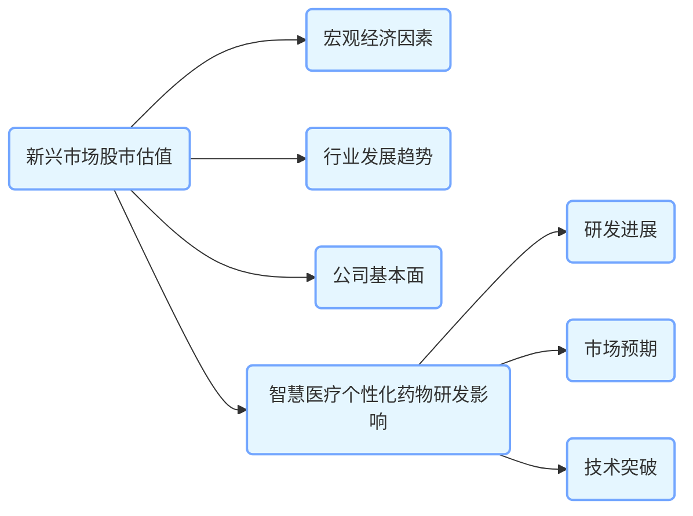

# 新兴市场股市估值与智慧医疗个性化药物研发的互动

> 关键词：新兴市场股市估值、智慧医疗、个性化药物研发、互动关系、金融与医疗融合

> 摘要：本文深入探讨了新兴市场股市估值与智慧医疗个性化药物研发之间的互动关系。首先介绍了研究的背景、目的、预期读者和文档结构等内容。接着阐述了核心概念，包括新兴市场股市估值、智慧医疗和个性化药物研发的原理和架构。详细讲解了相关核心算法原理，并给出具体操作步骤和 Python 代码示例。通过数学模型和公式进一步剖析两者的关系，并举例说明。结合项目实战，展示代码实际案例并进行详细解释。分析了两者在实际中的应用场景，推荐了学习、开发和研究的相关工具和资源。最后总结了未来发展趋势与挑战，解答常见问题并提供扩展阅读和参考资料，旨在为金融和医疗领域的从业者及研究者提供全面的参考。

## 1. 背景介绍 
### 1.1 目的和范围
本研究旨在深入探究新兴市场股市估值与智慧医疗个性化药物研发之间的互动机制。新兴市场股市作为全球金融市场的重要组成部分，其估值波动反映了市场对相关行业的预期和信心。而智慧医疗个性化药物研发作为医疗领域的前沿方向，具有巨大的发展潜力和商业价值。研究两者之间的互动关系，有助于投资者更好地理解新兴市场医疗板块的投资价值，为医疗企业制定合理的研发和融资策略提供参考，同时也为监管部门制定相关政策提供依据。研究范围涵盖了新兴市场股市的整体估值情况、智慧医疗个性化药物研发的技术发展、市场需求以及两者之间的相互影响因素。

### 1.2 预期读者
本文的预期读者包括金融领域的投资者、分析师、基金经理，医疗行业的科研人员、企业管理者，以及关注金融与医疗交叉领域的学者和政策制定者。对于金融从业者来说，了解新兴市场股市估值与智慧医疗个性化药物研发的互动关系，可以帮助他们挖掘潜在的投资机会，优化投资组合。医疗科研人员和企业管理者可以从金融市场的角度审视研发项目的价值和可行性，合理规划研发资源。学者和政策制定者则可以通过本文的研究成果，深入了解金融与医疗产业的融合发展趋势，为相关政策的制定提供理论支持。

### 1.3 文档结构概述
本文共分为十个部分。第一部分为背景介绍，阐述研究的目的、范围、预期读者和文档结构，并给出相关术语的定义和解释。第二部分介绍核心概念与联系，包括新兴市场股市估值、智慧医疗和个性化药物研发的原理和架构，并通过文本示意图和 Mermaid 流程图展示它们之间的关系。第三部分讲解核心算法原理，通过 Python 源代码详细阐述如何分析两者之间的互动关系。第四部分给出数学模型和公式，对两者的关系进行量化分析，并举例说明。第五部分进行项目实战，介绍开发环境搭建、源代码实现和代码解读。第六部分分析实际应用场景，探讨两者在不同场景下的互动表现。第七部分推荐学习、开发和研究的相关工具和资源。第八部分总结未来发展趋势与挑战。第九部分解答常见问题。第十部分提供扩展阅读和参考资料。

### 1.4 术语表
#### 1.4.1 核心术语定义
- **新兴市场股市估值**：指对新兴市场中上市公司股票价值的评估，通常通过市盈率、市净率等指标来衡量。新兴市场是指那些经济发展较快、金融市场逐步开放的国家和地区的市场。
- **智慧医疗**：利用信息技术和人工智能等手段，实现医疗信息的数字化、智能化管理，提高医疗服务的效率和质量。包括电子病历系统、远程医疗、医疗大数据分析等应用。
- **个性化药物研发**：根据患者的个体基因信息、生理特征和疾病状况，研发针对性更强、疗效更好的药物。与传统药物研发相比，个性化药物研发更加注重个体差异。

#### 1.4.2 相关概念解释
- **金融市场传导机制**：指金融市场中的各种信息和因素如何通过一定的渠道和方式影响资产价格和市场参与者的行为。在本文中，主要探讨新兴市场股市估值如何受到智慧医疗个性化药物研发相关信息的影响，以及这种影响如何在市场中传导。
- **医疗技术创新周期**：指从医疗技术的研发到临床应用和市场推广的整个过程所经历的时间周期。个性化药物研发通常需要较长的时间周期，涉及多个阶段的临床试验和审批程序。

#### 1.4.3 缩略词列表
- **AI**：Artificial Intelligence，人工智能
- **EHR**：Electronic Health Record，电子病历
- **PBPK**：Physiologically Based Pharmacokinetic，基于生理的药代动力学
- **PE**：Price-to-Earnings Ratio，市盈率
- **PB**：Price-to-Book Ratio，市净率

## 2. 核心概念与联系 

### 核心概念原理
#### 新兴市场股市估值
新兴市场股市估值是基于市场对上市公司未来盈利能力和风险的预期。常用的估值方法包括相对估值法和绝对估值法。相对估值法通过比较同行业或类似公司的市盈率、市净率等指标来评估股票的价值。例如，如果一家新兴市场医疗公司的市盈率低于同行业平均水平，可能被认为是被低估的股票。绝对估值法主要基于公司的现金流折现模型，通过预测公司未来的现金流并将其折现到当前来计算股票的内在价值。

#### 智慧医疗
智慧医疗的核心原理是利用信息技术和人工智能等手段，实现医疗数据的采集、存储、分析和应用。电子病历系统可以收集患者的基本信息、病史、检查报告等数据，为医生提供全面的患者信息。远程医疗技术可以实现患者与医生的远程沟通和诊断，提高医疗服务的可及性。医疗大数据分析可以挖掘海量医疗数据中的潜在信息，为疾病的诊断、治疗和预防提供决策支持。

#### 个性化药物研发
个性化药物研发的原理是根据患者的个体基因信息、生理特征和疾病状况，设计和开发针对性更强的药物。通过基因检测技术，可以了解患者的基因变异情况，筛选出适合特定患者群体的药物靶点。基于生理的药代动力学（PBPK）模型可以预测药物在不同个体中的代谢和疗效，为药物剂量的调整提供依据。

### 架构的文本示意图
```plaintext
新兴市场股市估值
|
|-- 宏观经济因素（GDP 增长、利率、汇率等）
|-- 行业发展趋势（医疗行业政策、技术创新等）
|-- 公司基本面（盈利能力、资产质量、研发投入等）
|
|-- 智慧医疗个性化药物研发影响
|   |-- 研发进展（临床试验结果、新药获批情况等）
|   |-- 市场预期（潜在市场规模、竞争格局等）
|   |-- 技术突破（新的研发技术、算法等）
```

### Mermaid 流程图


从流程图可以看出，新兴市场股市估值受到宏观经济因素、行业发展趋势和公司基本面等多种因素的影响。而智慧医疗个性化药物研发的进展、市场预期和技术突破等因素又会对新兴市场股市估值产生重要影响。

## 3. 核心算法原理 & 具体操作步骤 

### 核心算法原理
为了分析新兴市场股市估值与智慧医疗个性化药物研发之间的互动关系，我们可以采用时间序列分析和回归分析的方法。时间序列分析可以用于研究股票价格和研发指标（如研发投入、临床试验进展等）随时间的变化趋势，以及它们之间的相关性。回归分析可以建立股票估值指标（如市盈率、市净率）与研发指标之间的数学模型，以量化两者之间的关系。

### 具体操作步骤
#### 数据收集
收集新兴市场股市中医疗板块的股票价格、市盈率、市净率等估值数据，以及智慧医疗个性化药物研发相关的数据，如研发投入、临床试验结果、新药获批情况等。数据来源可以包括金融数据库、医疗行业报告、公司年报等。

#### 数据预处理
对收集到的数据进行清洗和预处理，包括去除缺失值、异常值，对数据进行标准化处理等。确保数据的质量和一致性，以便后续的分析。

#### 时间序列分析
使用 Python 中的`pandas`和`statsmodels`库进行时间序列分析。计算股票价格和研发指标的相关性系数，绘制时间序列图，观察它们的变化趋势和相关性。

#### 回归分析
建立回归模型，以股票估值指标为因变量，研发指标为自变量。使用最小二乘法估计模型的参数，评估模型的拟合优度和显著性。

### Python 源代码示例
```python
import pandas as pd
import numpy as np
import statsmodels.api as sm
import matplotlib.pyplot as plt

# 模拟数据
np.random.seed(0)
n = 100
time = pd.date_range(start='2020-01-01', periods=n, freq='D')
stock_price = np.random.randn(n).cumsum() + 100
r_d_investment = np.random.randn(n).cumsum() + 10

# 创建 DataFrame
data = pd.DataFrame({'time': time, 'stock_price': stock_price, 'r_d_investment': r_d_investment})

# 时间序列分析
correlation = data['stock_price'].corr(data['r_d_investment'])
print(f"股票价格与研发投入的相关性系数: {correlation}")

# 绘制时间序列图
plt.figure(figsize=(12, 6))
plt.plot(data['time'], data['stock_price'], label='Stock Price')
plt.plot(data['time'], data['r_d_investment'], label='R&D Investment')
plt.xlabel('Time')
plt.ylabel('Value')
plt.title('Stock Price and R&D Investment Time Series')
plt.legend()
plt.show()

# 回归分析
X = sm.add_constant(data['r_d_investment'])
y = data['stock_price']
model = sm.OLS(y, X).fit()
print(model.summary())
```

### 代码解释
- 首先，我们使用`numpy`生成模拟的股票价格和研发投入数据，并使用`pandas`创建 DataFrame 来存储数据。
- 然后，计算股票价格和研发投入的相关性系数，并绘制时间序列图，直观地观察它们的变化趋势。
- 最后，使用`statsmodels`库进行回归分析，建立股票价格与研发投入之间的线性回归模型，并输出模型的摘要信息，包括参数估计值、拟合优度、显著性检验等。

## 4. 数学模型和公式 & 详细讲解 & 举例说明 

### 数学模型
我们可以建立一个简单的线性回归模型来描述新兴市场股市估值与智慧医疗个性化药物研发之间的关系：

$$Y = \beta_0 + \beta_1X_1 + \beta_2X_2 + \cdots + \beta_nX_n + \epsilon$$

其中，$Y$ 表示股票估值指标（如市盈率、市净率），$X_1, X_2, \cdots, X_n$ 表示智慧医疗个性化药物研发相关的自变量（如研发投入、临床试验进展等），$\beta_0$ 是截距项，$\beta_1, \beta_2, \cdots, \beta_n$ 是回归系数，$\epsilon$ 是误差项。

### 详细讲解
- **截距项 $\beta_0$**：表示当所有自变量都为 0 时，股票估值指标的预期值。在实际应用中，它可能没有实际的经济意义，但在数学模型中是必要的。
- **回归系数 $\beta_i$**：表示自变量 $X_i$ 对因变量 $Y$ 的影响程度。例如，如果 $\beta_1$ 为正，说明研发投入的增加会导致股票估值的上升；如果 $\beta_1$ 为负，则说明研发投入的增加会导致股票估值的下降。
- **误差项 $\epsilon$**：表示模型无法解释的随机误差。它反映了除自变量以外的其他因素对股票估值的影响。

### 举例说明
假设我们要研究新兴市场医疗公司的市盈率（$Y$）与研发投入（$X_1$）和临床试验进展（$X_2$）之间的关系。我们收集了 100 家医疗公司的数据，并建立了如下回归模型：

$$Y = 10 + 0.5X_1 + 2X_2 + \epsilon$$

- **截距项 $\beta_0 = 10$**：表示当研发投入和临床试验进展都为 0 时，医疗公司的市盈率预期值为 10。
- **回归系数 $\beta_1 = 0.5$**：表示研发投入每增加 1 个单位，市盈率将增加 0.5 个单位。这说明研发投入的增加对股票估值有积极的影响。
- **回归系数 $\beta_2 = 2$**：表示临床试验进展每增加 1 个单位，市盈率将增加 2 个单位。这表明临床试验进展对股票估值的影响比研发投入更大。

通过这个例子，我们可以看到如何使用数学模型来量化新兴市场股市估值与智慧医疗个性化药物研发之间的关系。

## 5. 项目实战：代码实际案例和详细解释说明 

### 5.1  开发环境搭建
#### 操作系统
可以选择 Windows、Linux 或 macOS 操作系统。这里以 Windows 10 为例进行说明。

#### 编程语言和版本
使用 Python 3.8 及以上版本。可以从 Python 官方网站（https://www.python.org/downloads/）下载并安装。

#### 开发工具
推荐使用 PyCharm 作为集成开发环境（IDE），它提供了丰富的代码编辑、调试和项目管理功能。可以从 JetBrains 官方网站（https://www.jetbrains.com/pycharm/download/）下载并安装。

#### 必要的库和依赖
在命令行中使用`pip`安装以下必要的库：
```bash
pip install pandas numpy statsmodels matplotlib
```

### 5.2  源代码详细实现和代码解读
```python
import pandas as pd
import numpy as np
import statsmodels.api as sm
import matplotlib.pyplot as plt

# 读取实际数据
data = pd.read_csv('medical_stock_data.csv')

# 数据预处理
data = data.dropna()  # 去除缺失值
data['stock_pe_ratio'] = data['stock_price'] / data['earnings_per_share']  # 计算市盈率

# 时间序列分析
correlation = data['stock_pe_ratio'].corr(data['r_d_investment'])
print(f"市盈率与研发投入的相关性系数: {correlation}")

# 绘制时间序列图
plt.figure(figsize=(12, 6))
plt.plot(data['date'], data['stock_pe_ratio'], label='Stock PE Ratio')
plt.plot(data['date'], data['r_d_investment'], label='R&D Investment')
plt.xlabel('Date')
plt.ylabel('Value')
plt.title('Stock PE Ratio and R&D Investment Time Series')
plt.legend()
plt.show()

# 回归分析
X = sm.add_constant(data['r_d_investment'])
y = data['stock_pe_ratio']
model = sm.OLS(y, X).fit()
print(model.summary())
```

### 代码解读
- **数据读取**：使用`pandas`的`read_csv`函数读取存储在`medical_stock_data.csv`文件中的实际数据。
- **数据预处理**：使用`dropna`方法去除数据中的缺失值，并计算市盈率（`stock_pe_ratio`）。
- **时间序列分析**：计算市盈率与研发投入的相关性系数，并使用`matplotlib`绘制时间序列图，直观地展示两者的变化趋势。
- **回归分析**：使用`statsmodels`库建立线性回归模型，以市盈率为因变量，研发投入为自变量，并输出模型的摘要信息。

### 5.3  代码解读与分析
- **相关性分析**：通过计算相关性系数，我们可以了解市盈率与研发投入之间的线性关系。如果相关性系数接近 1，则说明两者呈正相关；如果接近 -1，则说明两者呈负相关；如果接近 0，则说明两者之间的线性关系较弱。
- **时间序列图**：时间序列图可以帮助我们观察市盈率和研发投入随时间的变化趋势。如果两者的变化趋势相似，则说明它们之间可能存在较强的相关性。
- **回归分析**：回归分析的结果可以提供更多的信息，如回归系数的显著性、模型的拟合优度等。如果回归系数显著不为 0，则说明研发投入对市盈率有显著的影响；拟合优度越高，则说明模型对数据的拟合效果越好。

## 6. 实际应用场景 

### 投资决策
投资者可以通过分析新兴市场股市估值与智慧医疗个性化药物研发之间的互动关系，做出更明智的投资决策。例如，如果一家医疗公司在个性化药物研发方面取得了重大突破，如临床试验结果良好或新药获批，可能会导致市场对该公司的预期提高，从而推动其股票价格上涨。投资者可以根据这些信息，提前布局相关股票，获取投资收益。

### 企业战略规划
医疗企业可以根据股市估值的变化来调整自身的研发战略。如果股市对个性化药物研发项目给予较高的估值，企业可以加大研发投入，加快研发进度，以获取更多的市场份额和利润。反之，如果股市对研发项目的估值较低，企业可以重新评估研发项目的可行性，优化研发资源的配置。

### 政策制定
监管部门可以通过观察新兴市场股市估值与智慧医疗个性化药物研发的互动关系，制定相关的政策。例如，如果发现股市对个性化药物研发的支持不足，监管部门可以出台鼓励政策，如税收优惠、资金补贴等，以促进研发活动的开展。同时，监管部门也可以加强对研发项目的监管，确保研发活动的合规性和安全性。

### 风险管理
金融机构和投资者可以利用两者之间的互动关系进行风险管理。例如，通过建立风险模型，预测股市估值的波动对个性化药物研发项目的影响，提前采取措施降低风险。医疗企业也可以通过合理的融资策略，降低研发过程中的财务风险。

## 7. 工具和资源推荐
### 7.1 学习资源推荐
#### 7.1.1 书籍推荐
- 《金融市场学》：介绍了金融市场的基本概念、运行机制和投资分析方法，有助于读者了解新兴市场股市的特点和估值方法。
- 《人工智能医疗》：探讨了人工智能在医疗领域的应用，包括智慧医疗和个性化药物研发的技术原理和实践案例。
- 《药物研发过程与管理》：详细介绍了药物研发的各个阶段和管理方法，对理解个性化药物研发的流程和挑战有很大帮助。

#### 7.1.2 在线课程
- Coursera 上的“金融市场分析”课程：由知名高校的教授授课，系统地讲解了金融市场的分析方法和工具。
- edX 上的“人工智能与医疗健康”课程：介绍了人工智能在医疗领域的应用和发展趋势，包括智慧医疗和个性化药物研发的前沿技术。
- Udemy 上的“药物研发基础”课程：适合初学者了解药物研发的基本概念和流程。

#### 7.1.3 技术博客和网站
- Seeking Alpha：提供了丰富的金融市场分析和投资建议，包括新兴市场股市的研究报告和分析文章。
- Medscape：专注于医疗行业的新闻和资讯，涵盖了智慧医疗和个性化药物研发的最新动态。
- Nature Medicine：发表了许多关于医疗技术创新和药物研发的高质量研究论文，是了解前沿研究成果的重要渠道。

### 7.2 开发工具框架推荐
#### 7.2.1 IDE和编辑器
- PyCharm：功能强大的 Python 集成开发环境，提供了代码编辑、调试、版本控制等一系列功能，适合开发数据分析和机器学习项目。
- Jupyter Notebook：交互式的开发环境，支持 Python、R 等多种编程语言，方便进行数据探索和可视化分析。
- Visual Studio Code：轻量级的代码编辑器，支持多种编程语言和插件扩展，具有良好的用户体验。

#### 7.2.2 调试和性能分析工具
- Py-Spy：用于分析 Python 程序的性能瓶颈，找出耗时较长的代码段，帮助优化程序性能。
- pdb：Python 自带的调试器，可以在代码中设置断点，逐步执行代码，查看变量的值和程序的执行流程。
- Memory Profiler：用于分析 Python 程序的内存使用情况，找出内存泄漏和高内存占用的代码段。

#### 7.2.3 相关框架和库
- Pandas：用于数据处理和分析的 Python 库，提供了高效的数据结构和数据操作方法，适合处理金融和医疗数据。
- NumPy：Python 的数值计算库，提供了多维数组和各种数学函数，是数据分析和机器学习的基础库。
- Scikit-learn：用于机器学习的 Python 库，提供了各种机器学习算法和工具，如分类、回归、聚类等。
- TensorFlow 和 PyTorch：深度学习框架，可用于构建和训练神经网络模型，在智慧医疗和个性化药物研发中有着广泛的应用。

### 7.3 相关论文著作推荐
#### 7.3.1 经典论文
- “The Pricing of Options and Corporate Liabilities” by Fischer Black and Myron Scholes：提出了著名的 Black-Scholes 期权定价模型，为金融市场的估值和风险管理提供了重要的理论基础。
- “Deep Learning” by Yann LeCun, Yoshua Bengio, and Geoffrey Hinton：介绍了深度学习的基本概念、算法和应用，对人工智能在医疗领域的发展产生了深远的影响。
- “Pharmacogenomics: Translating Functional Genomics into Rational Therapeutics” by Francis S. Collins, et al.：阐述了药物基因组学的概念和应用，为个性化药物研发提供了理论依据。

#### 7.3.2 最新研究成果
- 定期关注《Nature》《Science》《New England Journal of Medicine》等顶级学术期刊，这些期刊发表了许多关于新兴市场金融、智慧医疗和个性化药物研发的最新研究成果。
- 参加相关的学术会议，如国际金融学会年会、国际医学人工智能会议等，与国内外的专家学者交流最新的研究进展。

#### 7.3.3 应用案例分析
- 研究一些成功的医疗企业的案例，如基因泰克（Genentech）在个性化药物研发方面的经验和成果，了解它们如何通过技术创新和市场策略实现了商业成功。
- 分析金融机构在投资智慧医疗和个性化药物研发项目时的决策过程和风险管理方法，为实际应用提供参考。

## 8. 总结：未来发展趋势与挑战

### 未来发展趋势
#### 金融与医疗深度融合
随着新兴市场金融市场的不断发展和智慧医疗个性化药物研发的深入推进，金融与医疗的融合将更加紧密。金融机构将更加关注医疗行业的创新项目，为其提供更多的融资支持。同时，医疗企业也将更加重视金融市场的反馈，合理规划研发和融资策略。

#### 人工智能和大数据的广泛应用
人工智能和大数据技术将在新兴市场股市估值和智慧医疗个性化药物研发中发挥越来越重要的作用。通过对海量金融和医疗数据的分析，人工智能可以更准确地预测股市估值的变化和药物研发的成功率，为投资者和企业提供更有价值的决策支持。

#### 国际化合作加强
新兴市场国家和地区将加强在智慧医疗和个性化药物研发领域的国际化合作。通过共享技术、资源和数据，提高研发效率，降低研发成本。同时，国际金融市场也将更加关注新兴市场的医疗创新项目，促进资金的跨境流动。

### 挑战
#### 数据隐私和安全问题
在智慧医疗个性化药物研发过程中，涉及大量患者的个人隐私数据。如何保护这些数据的安全和隐私，是一个亟待解决的问题。同时，金融市场的数据也面临着被泄露和滥用的风险，需要加强数据安全管理。

#### 技术创新的不确定性
智慧医疗个性化药物研发是一个高度创新的领域，技术创新的不确定性较大。研发项目可能面临技术难题、临床试验失败等风险，这将对股市估值产生负面影响。投资者和企业需要具备较强的风险承受能力和应对能力。

#### 监管政策的不完善
新兴市场的金融和医疗监管政策可能不够完善，无法及时适应快速发展的技术和市场变化。监管政策的滞后可能导致市场秩序混乱，影响投资者和企业的信心。因此，需要加强监管政策的制定和完善，保障市场的健康发展。

## 9. 附录：常见问题与解答

### 问题 1：新兴市场股市估值与智慧医疗个性化药物研发之间的互动关系是如何形成的？
答：这种互动关系主要是通过市场预期和信息传导机制形成的。当智慧医疗个性化药物研发取得进展时，如临床试验结果良好、新药获批等，市场会对相关企业的未来盈利能力产生积极预期，从而推动其股票价格上涨，提高股市估值。反之，研发失败或进展缓慢可能会导致市场预期下降，股市估值降低。同时，股市估值的变化也会影响企业的融资能力和研发投入，进而影响个性化药物研发的进程。

### 问题 2：如何衡量智慧医疗个性化药物研发对新兴市场股市估值的影响程度？
答：可以通过多种方法来衡量这种影响程度。一种方法是使用回归分析，建立股票估值指标（如市盈率、市净率）与研发指标（如研发投入、临床试验进展等）之间的数学模型，通过回归系数来评估影响程度。另一种方法是进行事件研究，分析研发事件（如新药获批、临床试验结果公布等）对股票价格的短期和长期影响。

### 问题 3：在投资新兴市场医疗股票时，应该关注哪些与个性化药物研发相关的因素？
答：应该关注以下因素：研发项目的进展情况，包括临床试验的阶段、结果等；研发团队的实力和经验；公司的研发投入和资金状况；市场对研发项目的预期和竞争格局；相关的政策法规和监管环境等。

### 问题 4：智慧医疗个性化药物研发面临哪些风险？这些风险如何影响股市估值？
答：智慧医疗个性化药物研发面临技术风险、临床试验风险、市场风险和政策风险等。技术风险可能导致研发项目无法达到预期目标；临床试验风险可能导致药物无法通过审批；市场风险可能导致药物的市场需求不足；政策风险可能导致研发项目受到限制或监管加强。这些风险一旦发生，会降低市场对相关企业的预期，导致股市估值下降。

### 问题 5：新兴市场的金融和医疗监管政策对两者的互动关系有何影响？
答：监管政策对两者的互动关系有着重要的影响。合理的监管政策可以规范市场秩序，保护投资者和患者的利益，促进金融与医疗的健康融合。例如，鼓励创新的政策可以提高企业的研发积极性，推动个性化药物研发的发展，从而提升股市估值。相反，过于严格或不完善的监管政策可能会限制创新，影响市场的活力，对股市估值产生负面影响。

## 10. 扩展阅读 & 参考资料

### 扩展阅读
- 《金融科技前沿：创新与监管》：深入探讨了金融科技在金融市场中的应用和发展趋势，包括人工智能、区块链等技术在股市估值和医疗融资中的应用。
- 《精准医学：未来医学的发展方向》：详细介绍了精准医学的概念、技术和应用，对理解个性化药物研发的原理和实践有很大帮助。
- 《新兴市场金融发展与风险防范》：分析了新兴市场金融市场的特点和发展趋势，以及如何防范金融风险，对研究新兴市场股市估值具有重要的参考价值。

### 参考资料
- Bloomberg：全球知名的金融信息服务提供商，提供了丰富的金融市场数据和分析报告。
- ClinicalTrials.gov：美国国立卫生研究院维护的临床试验注册平台，提供了全球范围内的临床试验信息。
- World Health Organization (WHO)：世界卫生组织的官方网站，提供了关于医疗政策、技术和疾病防控等方面的权威信息。

以上文章从多个角度深入探讨了新兴市场股市估值与智慧医疗个性化药物研发的互动关系，希望能为读者提供有价值的参考。