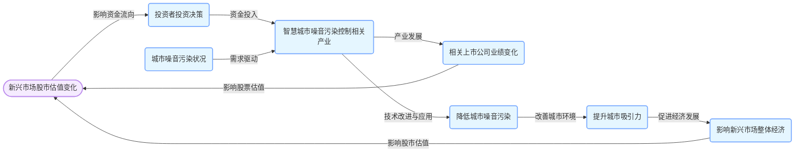

# 新兴市场股市估值与智慧城市噪音污染控制系统的互动

> 关键词：新兴市场股市估值、智慧城市、噪音污染控制系统、互动关系、经济影响、技术应用、可持续发展

> 摘要：本文深入探讨了新兴市场股市估值与智慧城市噪音污染控制系统之间的互动关系。首先介绍了研究的背景、目的、预期读者和文档结构等内容。接着阐述了新兴市场股市估值和智慧城市噪音污染控制系统的核心概念及其联系，通过示意图和流程图进行了清晰展示。详细讲解了相关的核心算法原理和具体操作步骤，并给出了Python源代码。同时，运用数学模型和公式对两者的关系进行了分析和举例说明。通过项目实战，给出了开发环境搭建、源代码实现及解读。探讨了实际应用场景，推荐了学习资源、开发工具框架和相关论文著作。最后总结了未来发展趋势与挑战，解答了常见问题并提供了扩展阅读和参考资料，旨在为理解两者之间复杂的互动关系提供全面且深入的视角。

## 1. 背景介绍 
### 1.1 目的和范围
本研究的目的在于深入剖析新兴市场股市估值与智慧城市噪音污染控制系统之间的互动关系。新兴市场股市作为全球金融市场的重要组成部分，其估值受到多种因素的影响，包括宏观经济环境、政策导向、行业发展趋势等。而智慧城市噪音污染控制系统是随着城市化进程和科技发展而兴起的重要基础设施，对于提升城市居民的生活质量、促进城市的可持续发展具有重要意义。本研究的范围涵盖了新兴市场股市估值的主要影响因素、智慧城市噪音污染控制系统的技术原理和应用场景，以及两者之间相互作用的机制和影响。

### 1.2 预期读者
本文的预期读者包括金融分析师、城市规划师、科技行业从业者、学术研究人员以及对新兴市场和智慧城市发展感兴趣的普通读者。金融分析师可以从本文中了解到新兴市场股市估值的新影响因素，为投资决策提供参考；城市规划师可以借鉴智慧城市噪音污染控制系统的发展经验，优化城市规划和建设；科技行业从业者可以关注两者之间的互动关系，开拓新的业务领域和技术应用；学术研究人员可以将本文作为研究基础，开展更深入的学术探讨；普通读者可以通过本文了解新兴市场和智慧城市发展的前沿动态，增强对相关领域的认知。

### 1.3 文档结构概述
本文共分为十个部分。第一部分为背景介绍，阐述了研究的目的、范围、预期读者和文档结构。第二部分介绍了新兴市场股市估值和智慧城市噪音污染控制系统的核心概念及其联系，通过示意图和流程图进行了可视化展示。第三部分详细讲解了相关的核心算法原理和具体操作步骤，并给出了Python源代码。第四部分运用数学模型和公式对两者的关系进行了分析和举例说明。第五部分通过项目实战，给出了开发环境搭建、源代码实现及解读。第六部分探讨了实际应用场景。第七部分推荐了学习资源、开发工具框架和相关论文著作。第八部分总结了未来发展趋势与挑战。第九部分解答了常见问题。第十部分提供了扩展阅读和参考资料。

### 1.4 术语表
#### 1.4.1 核心术语定义
- **新兴市场股市**：指发展中国家或地区的股票市场，这些市场通常具有较高的增长潜力，但也伴随着较高的风险。
- **股市估值**：是对股票市场中上市公司价值的评估，常用的估值方法包括市盈率、市净率等。
- **智慧城市**：是运用信息和通信技术手段感测、分析、整合城市运行核心系统的各项关键信息，从而对包括民生、环保、公共安全、城市服务、工商业活动在内的各种需求做出智能响应的城市发展模式。
- **噪音污染控制系统**：是指通过技术手段对城市中的噪音进行监测、分析和控制的系统，旨在减少噪音对居民生活和环境的影响。

#### 1.4.2 相关概念解释
- **新兴市场**：除了股票市场外，新兴市场还包括债券市场、外汇市场等金融市场，以及新兴的产业和经济领域。新兴市场的发展通常受到政府政策、外资流入、技术创新等因素的影响。
- **智慧城市建设**：涉及到多个领域的技术和应用，如物联网、大数据、人工智能等。智慧城市建设的目标是提高城市的运行效率、提升居民的生活质量、促进城市的可持续发展。
- **噪音污染**：是指超过国家规定的环境噪声排放标准，并干扰他人正常生活、工作和学习的声音。噪音污染会对人体健康、心理健康和社会生活产生负面影响。

#### 1.4.3 缩略词列表
- **GDP**：国内生产总值（Gross Domestic Product）
- **PE**：市盈率（Price - Earnings Ratio）
- **PB**：市净率（Price - Book Ratio）
- **IoT**：物联网（Internet of Things）
- **AI**：人工智能（Artificial Intelligence）

## 2. 核心概念与联系 

### 新兴市场股市估值核心概念
新兴市场股市估值是对新兴市场中上市公司股票价值的评估。其核心在于通过各种财务指标和分析方法，判断股票价格是否合理，是否具有投资价值。常见的估值方法包括绝对估值法和相对估值法。绝对估值法如现金流折现法（DCF），它基于公司未来的现金流预测，通过一定的折现率将未来现金流折算为现值，以此来确定公司的内在价值。相对估值法如市盈率（PE）、市净率（PB）等，是将公司的相关指标与同行业或市场平均水平进行比较，从而评估公司的估值水平。

### 智慧城市噪音污染控制系统核心概念
智慧城市噪音污染控制系统是利用现代信息技术对城市噪音进行监测、分析和控制的系统。该系统主要由噪音传感器、数据传输网络、数据分析平台和控制设备组成。噪音传感器分布在城市的各个角落，实时采集噪音数据；数据传输网络将采集到的数据传输到数据分析平台；数据分析平台对数据进行处理和分析，判断噪音是否超标，并生成相应的控制指令；控制设备根据控制指令采取相应的措施，如调整交通流量、关闭噪音源等，以降低噪音污染。

### 两者联系的文本示意图
新兴市场股市估值与智慧城市噪音污染控制系统之间存在着间接的联系。一方面，智慧城市噪音污染控制系统的发展会带动相关产业的发展，如传感器制造、数据分析、智能控制等产业。这些产业的发展会影响新兴市场中相关上市公司的业绩和前景，进而影响其股票估值。例如，随着智慧城市噪音污染控制系统的需求增加，传感器制造企业的订单会增多，利润可能会提高，其股票估值也可能会上升。另一方面，新兴市场股市估值的变化会影响投资者的资金流向和投资决策。如果新兴市场股市估值整体上升，投资者可能会更愿意投资相关产业的股票，从而为智慧城市噪音污染控制系统相关产业的发展提供资金支持，促进其技术创新和市场拓展。

### Mermaid 流程图


## 3. 核心算法原理 & 具体操作步骤 

### 新兴市场股市估值算法原理
#### 现金流折现法（DCF）
现金流折现法的核心思想是将公司未来的现金流折现到当前时刻，以确定公司的内在价值。其基本公式为：
$$V = \sum_{t = 1}^{n}\frac{CF_t}{(1 + r)^t}$$
其中，$V$ 表示公司的内在价值，$CF_t$ 表示第 $t$ 期的现金流，$r$ 表示折现率，$n$ 表示预测期数。

#### Python 代码实现
```python
def dcf_valuation(cash_flows, discount_rate):
    value = 0
    for i, cf in enumerate(cash_flows):
        value += cf / ((1 + discount_rate) ** (i + 1))
    return value

# 示例数据
cash_flows = [100, 120, 150, 180, 200]
discount_rate = 0.1

valuation = dcf_valuation(cash_flows, discount_rate)
print(f"公司的内在价值为: {valuation}")
```

### 智慧城市噪音污染控制系统数据分析算法原理
#### 基于机器学习的噪音预测算法
在智慧城市噪音污染控制系统中，需要对未来的噪音水平进行预测，以便提前采取控制措施。可以使用机器学习算法，如线性回归算法。线性回归算法的基本原理是通过对历史噪音数据和相关影响因素（如时间、交通流量等）进行分析，建立线性模型来预测未来的噪音水平。其基本公式为：
$$y = \beta_0 + \beta_1x_1 + \beta_2x_2 + \cdots + \beta_nx_n$$
其中，$y$ 表示噪音水平，$x_1, x_2, \cdots, x_n$ 表示影响因素，$\beta_0, \beta_1, \cdots, \beta_n$ 表示模型的参数。

#### Python 代码实现
```python
import numpy as np
from sklearn.linear_model import LinearRegression

# 示例数据
X = np.array([[1, 10], [2, 20], [3, 30], [4, 40], [5, 50]])  # 影响因素（时间和交通流量）
y = np.array([50, 60, 70, 80, 90])  # 噪音水平

# 创建线性回归模型
model = LinearRegression()

# 拟合模型
model.fit(X, y)

# 预测未来噪音水平
new_X = np.array([[6, 60]])
predicted_noise = model.predict(new_X)
print(f"预测的噪音水平为: {predicted_noise[0]}")
```

### 具体操作步骤
#### 新兴市场股市估值操作步骤
1. **数据收集**：收集上市公司的财务报表、行业数据、宏观经济数据等。
2. **现金流预测**：根据历史数据和市场趋势，预测公司未来的现金流。
3. **折现率确定**：根据公司的风险水平和市场利率，确定合适的折现率。
4. **计算内在价值**：使用现金流折现法公式计算公司的内在价值。
5. **估值比较**：将计算得到的内在价值与当前股票价格进行比较，判断股票是否被低估或高估。

#### 智慧城市噪音污染控制系统操作步骤
1. **数据采集**：通过噪音传感器实时采集城市各个区域的噪音数据。
2. **数据传输**：将采集到的噪音数据通过数据传输网络传输到数据分析平台。
3. **数据预处理**：对采集到的数据进行清洗、滤波等预处理操作，去除噪声和异常值。
4. **模型训练**：使用历史数据训练机器学习模型，如线性回归模型。
5. **噪音预测**：使用训练好的模型对未来的噪音水平进行预测。
6. **控制决策**：根据预测结果，制定相应的噪音控制决策，如调整交通流量、关闭噪音源等。
7. **执行控制**：通过控制设备执行噪音控制决策。

## 4. 数学模型和公式 & 详细讲解 & 举例说明 

### 新兴市场股市估值数学模型和公式
#### 市盈率（PE）模型
市盈率是指股票价格与每股收益的比率，其计算公式为：
$$PE = \frac{P}{EPS}$$
其中，$PE$ 表示市盈率，$P$ 表示股票价格，$EPS$ 表示每股收益。

市盈率模型的基本思想是通过比较不同公司的市盈率，判断股票的估值水平。一般来说，市盈率越高，说明市场对该股票的预期越高，但也可能意味着股票被高估；市盈率越低，说明市场对该股票的预期越低，但也可能意味着股票被低估。

例如，某公司的股票价格为 $50$ 元，每股收益为 $5$ 元，则该公司的市盈率为：
$$PE = \frac{50}{5} = 10$$

如果同行业的平均市盈率为 $15$，则说明该公司的股票可能被低估。

#### 市净率（PB）模型
市净率是指股票价格与每股净资产的比率，其计算公式为：
$$PB = \frac{P}{BVPS}$$
其中，$PB$ 表示市净率，$P$ 表示股票价格，$BVPS$ 表示每股净资产。

市净率模型的基本思想是通过比较不同公司的市净率，判断股票的估值水平。一般来说，市净率越高，说明市场对该公司的资产质量和盈利能力越看好，但也可能意味着股票被高估；市净率越低，说明市场对该公司的资产质量和盈利能力越不看好，但也可能意味着股票被低估。

例如，某公司的股票价格为 $30$ 元，每股净资产为 $10$ 元，则该公司的市净率为：
$$PB = \frac{30}{10} = 3$$

如果同行业的平均市净率为 $4$，则说明该公司的股票可能被低估。

### 智慧城市噪音污染控制系统数学模型和公式
#### 噪音传播模型
噪音在空气中的传播可以用点声源的传播模型来描述。点声源在自由空间中的声强随距离的变化规律可以用以下公式表示：
$$I_2 = I_1\frac{r_1^2}{r_2^2}$$
其中，$I_1$ 和 $I_2$ 分别表示距离点声源 $r_1$ 和 $r_2$ 处的声强。

声压级 $L_p$ 与声强 $I$ 的关系为：
$$L_p = 10\log_{10}\frac{I}{I_0}$$
其中，$I_0$ 是参考声强，通常取 $I_0 = 10^{-12} \ W/m^2$。

例如，已知距离点声源 $r_1 = 10 \ m$ 处的声压级 $L_{p1} = 80 \ dB$，求距离点声源 $r_2 = 20 \ m$ 处的声压级 $L_{p2}$。

首先，根据声压级与声强的关系，求出 $r_1$ 处的声强 $I_1$：
$$80 = 10\log_{10}\frac{I_1}{10^{-12}}$$
$$\frac{I_1}{10^{-12}} = 10^8$$
$$I_1 = 10^{-4} \ W/m^2$$

然后，根据噪音传播模型，求出 $r_2$ 处的声强 $I_2$：
$$I_2 = I_1\frac{r_1^2}{r_2^2} = 10^{-4} \times \frac{10^2}{20^2} = 2.5 \times 10^{-5} \ W/m^2$$

最后，根据声压级与声强的关系，求出 $r_2$ 处的声压级 $L_{p2}$：
$$L_{p2} = 10\log_{10}\frac{I_2}{10^{-12}} = 10\log_{10}\frac{2.5 \times 10^{-5}}{10^{-12}} = 74 \ dB$$

#### 噪音控制效果评估模型
噪音控制效果可以用噪音降低率来评估，其计算公式为：
$$\eta = \frac{L_{p1} - L_{p2}}{L_{p1}} \times 100\%$$
其中，$\eta$ 表示噪音降低率，$L_{p1}$ 表示噪音控制前的声压级，$L_{p2}$ 表示噪音控制后的声压级。

例如，噪音控制前的声压级为 $80 \ dB$，噪音控制后的声压级为 $70 \ dB$，则噪音降低率为：
$$\eta = \frac{80 - 70}{80} \times 100\% = 12.5\%$$

## 5. 项目实战：代码实际案例和详细解释说明 

### 5.1  开发环境搭建
#### 新兴市场股市估值项目开发环境
- **操作系统**：可以选择 Windows、Linux 或 macOS 操作系统。
- **编程语言**：Python 是首选的编程语言，因为它具有丰富的金融数据分析库。
- **开发工具**：推荐使用 Jupyter Notebook 或 PyCharm 作为开发工具。
- **所需库**：需要安装 pandas、numpy、scipy 等库用于数据处理和分析，以及 matplotlib、seaborn 等库用于数据可视化。

#### 智慧城市噪音污染控制系统项目开发环境
- **操作系统**：同样可以选择 Windows、Linux 或 macOS 操作系统。
- **编程语言**：Python 也是合适的选择，因为它在机器学习和数据分析领域有广泛的应用。
- **开发工具**：可以使用 Jupyter Notebook 或 Visual Studio Code 作为开发工具。
- **所需库**：需要安装 pandas、numpy、scikit - learn 等库用于数据处理和机器学习，以及 Flask 等库用于搭建 Web 服务。

### 5.2  源代码详细实现和代码解读
#### 新兴市场股市估值项目源代码实现
```python
import pandas as pd
import numpy as np
import matplotlib.pyplot as plt

# 读取上市公司财务数据
data = pd.read_csv('financial_data.csv')

# 计算市盈率和市净率
data['PE'] = data['Stock_Price'] / data['EPS']
data['PB'] = data['Stock_Price'] / data['BVPS']

# 筛选出被低估的股票
undervalued_stocks = data[(data['PE'] < data['PE'].mean()) & (data['PB'] < data['PB'].mean())]

# 可视化市盈率和市净率分布
plt.figure(figsize=(12, 6))
plt.subplot(1, 2, 1)
plt.hist(data['PE'], bins=20, color='blue', alpha=0.7)
plt.title('PE Distribution')
plt.xlabel('PE')
plt.ylabel('Frequency')

plt.subplot(1, 2, 2)
plt.hist(data['PB'], bins=20, color='green', alpha=0.7)
plt.title('PB Distribution')
plt.xlabel('PB')
plt.ylabel('Frequency')

plt.show()

print("被低估的股票:")
print(undervalued_stocks)
```
代码解读：
1. **数据读取**：使用 pandas 库的 `read_csv` 函数读取上市公司的财务数据。
2. **指标计算**：计算市盈率和市净率，并将结果添加到数据框中。
3. **股票筛选**：筛选出市盈率和市净率低于平均值的股票，认为这些股票可能被低估。
4. **数据可视化**：使用 matplotlib 库绘制市盈率和市净率的直方图，直观展示其分布情况。
5. **结果输出**：打印出被低估的股票信息。

#### 智慧城市噪音污染控制系统项目源代码实现
```python
from flask import Flask, jsonify
import pandas as pd
from sklearn.linear_model import LinearRegression

# 加载历史噪音数据
data = pd.read_csv('noise_data.csv')

# 准备训练数据
X = data[['Time', 'Traffic_Flow']]
y = data['Noise_Level']

# 创建线性回归模型
model = LinearRegression()

# 拟合模型
model.fit(X, y)

# 创建 Flask 应用
app = Flask(__name__)

# 定义预测接口
@app.route('/predict/<int:time>/<int:traffic_flow>', methods=['GET'])
def predict(time, traffic_flow):
    new_X = [[time, traffic_flow]]
    predicted_noise = model.predict(new_X)
    return jsonify({'predicted_noise': predicted_noise[0]})

if __name__ == '__main__':
    app.run(debug=True)
```
代码解读：
1. **数据加载**：使用 pandas 库的 `read_csv` 函数加载历史噪音数据。
2. **数据准备**：提取影响因素（时间和交通流量）作为特征矩阵 $X$，噪音水平作为目标向量 $y$。
3. **模型训练**：创建线性回归模型，并使用历史数据进行训练。
4. **Flask 应用创建**：使用 Flask 库创建一个 Web 应用。
5. **预测接口定义**：定义一个预测接口，接收时间和交通流量作为输入，使用训练好的模型进行噪音预测，并返回预测结果。
6. **应用运行**：启动 Flask 应用，开启调试模式。

### 5.3  代码解读与分析
#### 新兴市场股市估值项目代码分析
- **优点**：代码简洁明了，使用了常见的 Python 库，易于理解和维护。通过计算市盈率和市净率，可以快速筛选出可能被低估的股票，为投资决策提供参考。数据可视化部分可以直观展示指标的分布情况，帮助分析人员更好地理解数据。
- **局限性**：该代码仅使用了市盈率和市净率作为估值指标，可能存在一定的局限性。实际的股市估值需要考虑更多的因素，如公司的盈利能力、成长潜力、行业竞争等。此外，代码没有考虑数据的时效性和准确性，可能会影响估值结果的可靠性。

#### 智慧城市噪音污染控制系统项目代码分析
- **优点**：代码实现了一个简单的噪音预测 Web 服务，使用了 Flask 框架，易于部署和扩展。通过线性回归模型进行噪音预测，具有一定的实用性。
- **局限性**：该代码仅使用了线性回归模型，可能无法准确捕捉噪音数据的复杂关系。实际的噪音预测需要考虑更多的因素，如天气条件、地理位置等。此外，代码没有对模型进行评估和优化，可能会影响预测结果的准确性。

## 6. 实际应用场景 
### 新兴市场股市投资决策
投资者可以通过分析新兴市场股市估值与智慧城市噪音污染控制系统相关产业的关系，做出更明智的投资决策。例如，如果智慧城市噪音污染控制系统市场需求旺盛，相关产业的上市公司业绩有望提升，其股票估值可能会上升，投资者可以考虑增加对这些股票的投资。相反，如果市场对智慧城市噪音污染控制系统的需求下降，相关产业的上市公司业绩可能会受到影响，其股票估值可能会下降，投资者可以考虑减少对这些股票的投资。

### 智慧城市规划与建设
城市规划师可以根据新兴市场股市估值的变化，调整智慧城市噪音污染控制系统的规划和建设。例如，如果新兴市场股市估值整体上升，说明市场对智慧城市相关产业的发展前景看好，城市规划师可以加大对智慧城市噪音污染控制系统的投入，加快建设进度，提高系统的智能化水平。相反，如果新兴市场股市估值整体下降，城市规划师可以适当调整建设计划，控制成本，确保项目的可行性和可持续性。

### 企业战略决策
智慧城市噪音污染控制系统相关企业可以根据新兴市场股市估值的变化，制定相应的企业战略。如果新兴市场股市估值上升，企业可以考虑扩大生产规模、加大研发投入、拓展市场份额等。如果新兴市场股市估值下降，企业可以采取收缩战略，降低成本、优化产品结构、提高运营效率等。

### 政府政策制定
政府可以根据新兴市场股市估值与智慧城市噪音污染控制系统的互动关系，制定相关的政策。例如，政府可以出台鼓励政策，支持智慧城市噪音污染控制系统相关产业的发展，促进新兴市场股市的繁荣。政府也可以加强监管，规范市场秩序，防范金融风险，保障新兴市场股市和智慧城市建设的健康发展。

## 7. 工具和资源推荐
### 7.1 学习资源推荐
#### 7.1.1 书籍推荐
- 《金融市场学》：全面介绍了金融市场的基本概念、运行机制和投资策略，对于理解新兴市场股市估值具有重要的参考价值。
- 《智慧城市：大数据、物联网和云计算重塑城市》：深入探讨了智慧城市的发展理念、技术应用和实践案例，有助于了解智慧城市噪音污染控制系统的相关知识。
- 《Python 数据分析实战》：详细介绍了 Python 在数据分析领域的应用，包括数据处理、可视化、机器学习等方面的内容，对于项目实战具有很强的指导作用。

#### 7.1.2 在线课程
- Coursera 上的“Financial Markets”课程：由耶鲁大学教授罗伯特·席勒（Robert Shiller）主讲，系统讲解了金融市场的理论和实践。
- edX 上的“Smart Cities: Technology, Policy and the Future of Urban Living”课程：介绍了智慧城市的技术架构、政策制定和未来发展趋势。
- 慕课网上的“Python 数据分析与挖掘实战”课程：通过实际案例，讲解了 Python 在数据分析和挖掘领域的应用。

#### 7.1.3 技术博客和网站
- 金融界：提供了丰富的金融市场资讯和数据分析工具，对于新兴市场股市估值的研究具有重要的参考价值。
- 智慧城市网：专注于智慧城市领域的新闻、技术和案例分享，有助于了解智慧城市噪音污染控制系统的最新动态。
- Medium 上的 Python 相关博客：有很多关于 Python 数据分析、机器学习等方面的优秀文章，可以帮助开发者提升技术水平。

### 7.2 开发工具框架推荐
#### 7.2.1 IDE和编辑器
- PyCharm：是一款专业的 Python 集成开发环境，具有代码自动补全、调试、版本控制等功能，适合大型项目的开发。
- Jupyter Notebook：是一种交互式的开发环境，支持代码、文本、图表等多种形式的展示，适合数据分析和模型实验。
- Visual Studio Code：是一款轻量级的代码编辑器，支持多种编程语言和插件扩展，具有良好的用户体验。

#### 7.2.2 调试和性能分析工具
- Py-Spy：是一个用于分析 Python 程序性能的工具，可以帮助开发者找出程序中的性能瓶颈。
- PDB：是 Python 自带的调试器，可以帮助开发者调试代码，找出程序中的错误。
- Flask-DebugToolbar：是一个 Flask 扩展，用于调试 Flask 应用，提供了详细的请求信息和性能分析。

#### 7.2.3 相关框架和库
- Pandas：是一个强大的数据处理和分析库，提供了高效的数据结构和数据操作方法。
- Numpy：是一个用于科学计算的基础库，提供了多维数组和矩阵运算的功能。
- Scikit-learn：是一个常用的机器学习库，提供了丰富的机器学习算法和工具。
- Flask：是一个轻量级的 Web 框架，适合快速开发 Web 应用。

### 7.3 相关论文著作推荐
#### 7.3.1 经典论文
- “Efficient Capital Markets: A Review of Theory and Empirical Work”：由尤金·法玛（Eugene F. Fama）撰写，提出了有效市场假说，对金融市场的研究产生了深远的影响。
- “The City as a Complex System: Model - Based Approaches toward Understanding Urban Dynamics”：探讨了城市作为复杂系统的特点和运行机制，为智慧城市的研究提供了理论基础。

#### 7.3.2 最新研究成果
- 近年来，关于新兴市场股市估值和智慧城市发展的研究不断涌现。可以通过学术数据库（如 IEEE Xplore、ACM Digital Library、ScienceDirect 等）搜索相关的最新研究论文，了解该领域的前沿动态。

#### 7.3.3 应用案例分析
- 一些知名的咨询公司和研究机构会发布关于新兴市场和智慧城市的应用案例分析报告。例如，麦肯锡公司的相关报告对新兴市场的投资机会和智慧城市的实践案例进行了深入分析，具有很高的参考价值。

## 8. 总结：未来发展趋势与挑战
### 未来发展趋势
#### 新兴市场股市与智慧城市融合发展
随着科技的不断进步和城市化进程的加速，新兴市场股市与智慧城市的融合将更加紧密。智慧城市建设需要大量的资金投入，新兴市场股市可以为相关企业提供融资渠道，促进智慧城市技术的研发和应用。同时，智慧城市的发展也会带动相关产业的繁荣，提升新兴市场股市的估值水平。

#### 数据驱动的决策支持
在新兴市场股市估值和智慧城市噪音污染控制系统中，数据的作用将越来越重要。通过收集和分析大量的数据，可以建立更准确的模型，为投资决策、城市规划和管理提供更科学的依据。例如，利用大数据分析技术可以预测股市走势和噪音污染变化趋势，帮助决策者提前采取措施。

#### 技术创新推动发展
人工智能、物联网、区块链等新兴技术将不断推动新兴市场股市估值和智慧城市噪音污染控制系统的发展。例如，人工智能技术可以用于股市预测和噪音分析，物联网技术可以实现噪音传感器的实时数据采集和传输，区块链技术可以保障数据的安全和可信。

### 挑战
#### 数据质量和安全问题
数据是新兴市场股市估值和智慧城市噪音污染控制系统的基础，但数据质量和安全问题仍然是面临的挑战之一。数据可能存在不准确、不完整、不一致等问题，影响模型的准确性和决策的可靠性。同时，数据的安全和隐私保护也至关重要，防止数据泄露和滥用。

#### 技术应用和人才短缺
虽然新兴技术为新兴市场股市估值和智慧城市噪音污染控制系统带来了机遇，但技术应用和人才短缺也是需要解决的问题。企业和政府需要加大对技术研发和应用的投入，培养和吸引相关领域的专业人才，以推动技术的落地和应用。

#### 市场波动和不确定性
新兴市场股市具有较高的波动性和不确定性，受到宏观经济环境、政策变化、国际形势等多种因素的影响。智慧城市噪音污染控制系统的发展也面临着技术更新换代快、市场需求不稳定等问题。如何应对市场波动和不确定性，是新兴市场股市估值和智慧城市噪音污染控制系统发展面临的重要挑战。

## 9. 附录：常见问题与解答
### 新兴市场股市估值方面
#### 问：新兴市场股市估值受哪些因素影响？
答：新兴市场股市估值受多种因素影响，包括宏观经济环境（如 GDP 增长率、通货膨胀率、利率等）、政策导向（如财政政策、货币政策、产业政策等）、行业发展趋势（如新兴产业的兴起和传统产业的转型）、公司基本面（如盈利能力、成长潜力、资产质量等）以及国际资本流动等。

#### 问：如何判断新兴市场股市是否被高估或低估？
答：可以通过多种方法判断新兴市场股市是否被高估或低估。常见的方法包括比较市盈率、市净率等估值指标与历史平均水平或同行业水平；分析公司的基本面和未来发展前景；考虑宏观经济环境和政策因素等。此外，还可以结合技术分析和市场情绪等因素进行综合判断。

### 智慧城市噪音污染控制系统方面
#### 问：智慧城市噪音污染控制系统的主要技术有哪些？
答：智慧城市噪音污染控制系统主要涉及物联网技术、传感器技术、数据分析技术、人工智能技术和智能控制技术等。物联网技术用于实现噪音传感器的联网和数据传输；传感器技术用于实时采集噪音数据；数据分析技术用于对采集到的数据进行处理和分析；人工智能技术用于建立噪音预测模型和进行智能决策；智能控制技术用于根据分析结果采取相应的噪音控制措施。

#### 问：如何评估智慧城市噪音污染控制系统的效果？
答：可以从多个方面评估智慧城市噪音污染控制系统的效果。主要指标包括噪音降低率、噪音达标率等。噪音降低率是指噪音控制前后声压级的差值与控制前声压级的比值；噪音达标率是指噪音监测点的声压级符合国家标准的比例。此外，还可以考虑系统的稳定性、可靠性、智能化水平以及对城市居民生活质量的改善程度等因素。

### 两者互动关系方面
#### 问：新兴市场股市估值与智慧城市噪音污染控制系统之间的互动关系是如何形成的？
答：新兴市场股市估值与智慧城市噪音污染控制系统之间的互动关系是通过产业发展和资金流动形成的。智慧城市噪音污染控制系统的发展会带动相关产业的繁荣，如传感器制造、数据分析、智能控制等产业。这些产业的发展会影响新兴市场中相关上市公司的业绩和前景，进而影响其股票估值。同时，新兴市场股市估值的变化会影响投资者的资金流向和投资决策。如果新兴市场股市估值整体上升，投资者可能会更愿意投资相关产业的股票，从而为智慧城市噪音污染控制系统相关产业的发展提供资金支持，促进其技术创新和市场拓展。

#### 问：如何利用两者的互动关系进行投资和城市建设决策？
答：对于投资者来说，可以关注智慧城市噪音污染控制系统相关产业的发展动态和新兴市场股市估值的变化，选择具有发展潜力的上市公司进行投资。例如，当智慧城市噪音污染控制系统市场需求旺盛，相关产业的上市公司业绩有望提升时，可以考虑增加对这些股票的投资。对于城市建设者来说，可以根据新兴市场股市估值的变化，调整智慧城市噪音污染控制系统的规划和建设。例如，当新兴市场股市估值整体上升，市场对智慧城市相关产业的发展前景看好时，可以加大对智慧城市噪音污染控制系统的投入，加快建设进度。

## 10. 扩展阅读 & 参考资料
### 扩展阅读
- 《金融炼金术》：乔治·索罗斯（George Soros）的著作，探讨了金融市场的反身性原理，对于理解新兴市场股市的波动具有启发意义。
- 《数字化转型：智慧城市的未来之路》：深入分析了数字化技术在智慧城市建设中的应用和挑战，有助于进一步了解智慧城市噪音污染控制系统的发展趋势。
- 《机器学习实战》：通过实际案例介绍了机器学习算法的应用，对于提升数据分析和模型构建能力有很大帮助。

### 参考资料
- 世界银行发布的《世界发展报告》：提供了关于新兴市场国家经济发展的详细数据和分析。
- 国际电信联盟（ITU）发布的《智慧城市报告》：对全球智慧城市的发展现状和趋势进行了研究和总结。
- 相关学术期刊，如《金融研究》《城市规划学刊》《传感器与执行器》等，发表了大量关于新兴市场股市估值和智慧城市噪音污染控制系统的研究论文。