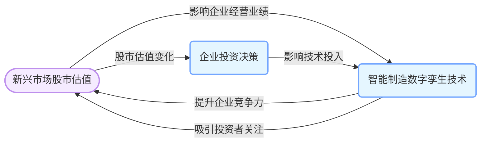

# 新兴市场股市估值与智能制造数字孪生技术的互动

> 关键词：新兴市场股市估值、智能制造、数字孪生技术、互动关系、金融科技融合

> 摘要：本文深入探讨了新兴市场股市估值与智能制造数字孪生技术之间的互动关系。首先介绍了研究的背景、目的、预期读者等基本信息，接着阐述了新兴市场股市估值和数字孪生技术的核心概念及联系。通过详细讲解核心算法原理、数学模型和公式，为理解两者互动提供理论基础。以实际项目案例展示了如何在实践中体现这种互动，并分析了其在不同场景下的应用。最后推荐了相关的学习资源、开发工具和论文著作，总结了未来发展趋势与挑战，还对常见问题进行了解答并提供扩展阅读和参考资料，旨在全面剖析新兴市场股市估值与智能制造数字孪生技术的内在联系，为相关领域的研究和实践提供有价值的参考。

## 1. 背景介绍 
### 1.1 目的和范围
本研究的主要目的是全面探究新兴市场股市估值与智能制造数字孪生技术之间的互动关系。新兴市场在全球经济格局中扮演着日益重要的角色，其股市估值受到多种因素的影响。与此同时，智能制造数字孪生技术作为一种新兴的先进技术，正在深刻改变着制造业的生产模式和运营效率。通过研究两者之间的互动，我们可以更好地理解金融市场与实体经济之间的联系，为投资者、企业管理者和政策制定者提供决策依据。

研究范围涵盖了新兴市场股市的估值方法、数字孪生技术的原理和应用，以及两者在不同行业和经济环境下的相互作用。我们将分析数字孪生技术对新兴市场制造业企业的影响，进而探讨这种影响如何传导至股市估值。同时，也会研究股市估值的变化如何反馈到企业对数字孪生技术的投入和应用。

### 1.2 预期读者
本文的预期读者包括金融领域的投资者、分析师和基金经理，他们可以从本文中了解新兴市场股市估值受数字孪生技术影响的机制，从而优化投资策略。制造业企业的管理者和技术专家可以通过本文认识到数字孪生技术对企业价值和市场表现的重要性，为企业的技术创新和战略规划提供参考。学术界的研究人员可以将本文作为进一步深入研究金融与科技融合领域的基础资料。此外，政策制定者也可以从中获取有关新兴市场发展和产业升级的信息，为制定相关政策提供依据。

### 1.3 文档结构概述
本文共分为十个部分。第一部分为背景介绍，阐述了研究的目的、范围、预期读者和文档结构概述，并对相关术语进行了定义。第二部分介绍了新兴市场股市估值和智能制造数字孪生技术的核心概念，以及它们之间的联系，同时配有文本示意图和 Mermaid 流程图。第三部分详细讲解了核心算法原理和具体操作步骤，通过 Python 源代码进行说明。第四部分介绍了数学模型和公式，并通过举例进行详细讲解。第五部分为项目实战，包括开发环境搭建、源代码实现和代码解读。第六部分分析了新兴市场股市估值与数字孪生技术互动的实际应用场景。第七部分推荐了相关的学习资源、开发工具框架和论文著作。第八部分总结了未来发展趋势与挑战。第九部分为附录，解答了常见问题。最后一部分提供了扩展阅读和参考资料。

### 1.4 术语表
#### 1.4.1 核心术语定义
- **新兴市场股市估值**：指对新兴市场中上市公司股票价值的评估，通常通过各种估值方法，如市盈率（P/E）、市净率（P/B）等，结合公司的财务状况、行业前景和宏观经济环境等因素来确定股票的合理价格。
- **智能制造数字孪生技术**：是一种利用数字化模型对物理实体进行全面、实时映射的技术。通过传感器收集物理实体的各种数据，在虚拟空间中构建与之对应的数字模型，实现对物理实体的状态监测、性能预测和优化控制。
- **互动关系**：指新兴市场股市估值和智能制造数字孪生技术之间相互影响、相互作用的关系。数字孪生技术的应用可能会影响企业的经营业绩和市场竞争力，进而影响股市估值；而股市估值的变化也可能会影响企业对数字孪生技术的投入和发展。

#### 1.4.2 相关概念解释
- **新兴市场**：通常指发展中国家或地区的金融市场，具有较高的经济增长率和市场潜力，但也伴随着较高的风险。新兴市场的股市在全球金融市场中逐渐占据重要地位。
- **智能制造**：是基于新一代信息技术，贯穿于设计、生产、管理、服务等制造活动各个环节，具有信息深度自感知、智慧优化自决策、精准控制自执行等功能的先进制造过程、系统与模式的总称。
- **数字孪生模型**：是数字孪生技术的核心，它是物理实体在虚拟空间中的精确映射，能够反映物理实体的结构、状态和行为。通过对数字孪生模型的分析和优化，可以实现对物理实体的有效管理和控制。

#### 1.4.3 缩略词列表
- **P/E**：市盈率（Price-to-Earnings Ratio），是指股票价格除以每股收益的比率，用于衡量股票的估值水平。
- **P/B**：市净率（Price-to-Book Ratio），是指股票价格除以每股净资产的比率，反映了股票的市场价格与账面价值之间的关系。
- **IoT**：物联网（Internet of Things），是指通过各种信息传感器、射频识别技术、全球定位系统等技术和装置，实现物与物、物与人的泛在连接，实现对物品和过程的智能化感知、识别和管理。

## 2. 核心概念与联系 
### 2.1 新兴市场股市估值
新兴市场股市估值是金融领域的重要研究内容。其目的是确定上市公司股票的内在价值，为投资者提供投资决策的依据。常见的估值方法包括相对估值法和绝对估值法。

相对估值法是通过比较同行业或类似公司的估值指标来评估目标公司的价值。例如，市盈率（P/E）法是将目标公司的市盈率与同行业平均市盈率进行比较，如果目标公司的市盈率低于行业平均水平，则可能被认为是低估的。市净率（P/B）法是将目标公司的市净率与行业平均市净率进行比较，以判断公司的估值是否合理。

绝对估值法是通过预测公司未来的现金流，并将其折现到当前来计算公司的内在价值。常见的绝对估值模型有股息贴现模型（DDM）和自由现金流贴现模型（FCFF）。股息贴现模型假设股票的价值等于其未来股息的现值之和，而自由现金流贴现模型则认为公司的价值等于其未来自由现金流的现值之和。

### 2.2 智能制造数字孪生技术
智能制造数字孪生技术是智能制造领域的关键技术之一。它通过构建物理实体的数字孪生模型，实现对物理实体的实时监测、分析和优化。数字孪生模型可以反映物理实体的几何形状、物理特性、运行状态等信息，通过与物理实体的数据交互，实现对物理实体的精准控制和管理。

数字孪生技术的应用场景非常广泛，包括产品设计、生产制造、设备维护和供应链管理等。在产品设计阶段，数字孪生模型可以帮助设计师进行虚拟仿真和优化，减少产品的研发周期和成本。在生产制造阶段，数字孪生技术可以实现对生产过程的实时监控和优化，提高生产效率和质量。在设备维护阶段，数字孪生模型可以预测设备的故障和寿命，实现预防性维护。在供应链管理阶段，数字孪生技术可以实现对供应链的可视化和优化，提高供应链的效率和灵活性。

### 2.3 核心概念联系的文本示意图
```plaintext
新兴市场股市估值 <----> 智能制造数字孪生技术
|                        |
| 影响企业经营业绩      |  提升企业竞争力
| 进而影响股市估值      |  吸引投资者关注
|                        |
| 股市估值变化           |  影响企业投资决策
| 反馈到企业技术投入    |  促进数字孪生技术发展
```

### 2.4 核心概念联系的 Mermaid 流程图


## 3. 核心算法原理 & 具体操作步骤 
### 3.1 新兴市场股市估值算法原理
#### 3.1.1 市盈率（P/E）法
市盈率法是一种常用的相对估值方法，其基本原理是将目标公司的市盈率与同行业平均市盈率进行比较，以判断目标公司的估值是否合理。计算公式如下：
$$P/E = \frac{股价}{每股收益}$$
其中，股价是指股票的市场价格，每股收益是指公司的净利润除以总股本。

在实际应用中，首先需要确定同行业的平均市盈率。可以通过收集同行业上市公司的财务数据，计算它们的市盈率，并取平均值作为同行业平均市盈率。然后，将目标公司的市盈率与同行业平均市盈率进行比较，如果目标公司的市盈率低于同行业平均水平，则可能被认为是低估的；反之，则可能被认为是高估的。

#### 3.1.2 自由现金流贴现模型（FCFF）
自由现金流贴现模型是一种绝对估值方法，其基本原理是将公司未来的自由现金流折现到当前，以计算公司的内在价值。计算公式如下：
$$V = \sum_{t=1}^{n} \frac{FCFF_t}{(1 + r)^t} + \frac{TV}{(1 + r)^n}$$
其中，$V$ 是公司的内在价值，$FCFF_t$ 是第 $t$ 年的自由现金流，$r$ 是折现率，$n$ 是预测期，$TV$ 是终值。

自由现金流是指公司在满足了所有运营费用和资本支出后剩余的现金流量。终值是指预测期结束后公司的价值，可以通过永续增长模型或退出倍数法来计算。

### 3.2 数字孪生技术算法原理
#### 3.2.1 数据采集与预处理
数字孪生技术的第一步是数据采集，通过传感器收集物理实体的各种数据，如温度、压力、振动等。采集到的数据可能存在噪声和缺失值，需要进行预处理。常见的预处理方法包括滤波、插值和归一化等。

以下是一个使用 Python 进行数据滤波的示例代码：
```python
import numpy as np
import matplotlib.pyplot as plt
from scipy.signal import butter, filtfilt

# 生成模拟数据
t = np.linspace(0, 1, 1000, endpoint=False)
signal = np.sin(2 * np.pi * 10 * t) + 0.5 * np.sin(2 * np.pi * 50 * t)

# 设计低通滤波器
def butter_lowpass(cutoff, fs, order=5):
    nyquist = 0.5 * fs
    normal_cutoff = cutoff / nyquist
    b, a = butter(order, normal_cutoff, btype='low', analog=False)
    return b, a

def butter_lowpass_filter(data, cutoff, fs, order=5):
    b, a = butter_lowpass(cutoff, fs, order=order)
    y = filtfilt(b, a, data)
    return y

# 应用滤波器
filtered_signal = butter_lowpass_filter(signal, 20, 1000)

# 绘制原始信号和滤波后的信号
plt.figure(figsize=(10, 6))
plt.plot(t, signal, label='Original Signal')
plt.plot(t, filtered_signal, label='Filtered Signal')
plt.xlabel('Time [s]')
plt.ylabel('Amplitude')
plt.legend()
plt.show()
```

#### 3.2.2 模型构建与仿真
在数据预处理完成后，需要构建数字孪生模型。数字孪生模型可以基于物理模型、数据驱动模型或混合模型。物理模型是基于物理定律和原理构建的模型，数据驱动模型是基于机器学习和深度学习算法构建的模型，混合模型则结合了物理模型和数据驱动模型的优点。

以下是一个使用 Python 和 TensorFlow 构建简单神经网络模型的示例代码：
```python
import tensorflow as tf
from tensorflow.keras.models import Sequential
from tensorflow.keras.layers import Dense

# 生成模拟数据
x_train = np.random.rand(100, 1)
y_train = 2 * x_train + 1 + 0.1 * np.random.randn(100, 1)

# 构建神经网络模型
model = Sequential([
    Dense(10, activation='relu', input_shape=(1,)),
    Dense(1)
])

# 编译模型
model.compile(optimizer='adam', loss='mse')

# 训练模型
model.fit(x_train, y_train, epochs=100, batch_size=10)

# 预测
x_test = np.array([[0.5]])
y_pred = model.predict(x_test)
print(f"Predicted value: {y_pred[0][0]}")
```

### 3.3 具体操作步骤
#### 3.3.1 新兴市场股市估值操作步骤
1. **收集数据**：收集目标公司和同行业上市公司的财务数据，包括股价、每股收益、净利润、总股本等。
2. **计算估值指标**：根据收集到的数据，计算目标公司和同行业平均的市盈率、市净率等估值指标。
3. **比较估值指标**：将目标公司的估值指标与同行业平均水平进行比较，判断目标公司的估值是否合理。
4. **使用绝对估值模型**：如果需要，可以使用自由现金流贴现模型等绝对估值模型计算目标公司的内在价值。

#### 3.3.2 数字孪生技术操作步骤
1. **数据采集**：安装传感器，收集物理实体的各种数据。
2. **数据预处理**：对采集到的数据进行滤波、插值和归一化等预处理操作。
3. **模型构建**：根据物理实体的特点和需求，选择合适的模型构建方法，构建数字孪生模型。
4. **模型仿真**：使用构建好的数字孪生模型进行仿真，预测物理实体的状态和行为。
5. **模型优化**：根据仿真结果，对数字孪生模型进行优化，提高模型的准确性和可靠性。

## 4. 数学模型和公式 & 详细讲解 & 举例说明 
### 4.1 新兴市场股市估值数学模型
#### 4.1.1 市盈率（P/E）模型
如前所述，市盈率模型的计算公式为：
$$P/E = \frac{股价}{每股收益}$$
假设某新兴市场上市公司的股价为 20 元，每股收益为 2 元，则该公司的市盈率为：
$$P/E = \frac{20}{2} = 10$$
如果同行业平均市盈率为 15，则该公司的市盈率低于行业平均水平，可能被认为是低估的。

#### 4.1.2 自由现金流贴现模型（FCFF）
自由现金流贴现模型的计算公式为：
$$V = \sum_{t=1}^{n} \frac{FCFF_t}{(1 + r)^t} + \frac{TV}{(1 + r)^n}$$
假设某公司未来 5 年的自由现金流分别为 100 万元、120 万元、140 万元、160 万元和 180 万元，折现率为 10%，预测期结束后的终值为 2000 万元，则该公司的内在价值为：
$$V = \frac{100}{(1 + 0.1)^1} + \frac{120}{(1 + 0.1)^2} + \frac{140}{(1 + 0.1)^3} + \frac{160}{(1 + 0.1)^4} + \frac{180}{(1 + 0.1)^5} + \frac{2000}{(1 + 0.1)^5}$$
```python
import numpy as np

fcff = np.array([100, 120, 140, 160, 180])
r = 0.1
n = 5
tv = 2000

pv_fcff = np.sum(fcff / (1 + r) ** np.arange(1, n + 1))
pv_tv = tv / (1 + r) ** n
V = pv_fcff + pv_tv

print(f"公司内在价值: {V} 万元")
```

### 4.2 数字孪生技术数学模型
#### 4.2.1 状态空间模型
状态空间模型是一种常用的数字孪生模型，用于描述物理系统的动态行为。其一般形式为：
$$\begin{cases}
\mathbf{x}_{k+1} = \mathbf{A}\mathbf{x}_k + \mathbf{B}\mathbf{u}_k + \mathbf{w}_k \\
\mathbf{y}_k = \mathbf{C}\mathbf{x}_k + \mathbf{D}\mathbf{u}_k + \mathbf{v}_k
\end{cases}$$
其中，$\mathbf{x}_k$ 是系统的状态向量，$\mathbf{u}_k$ 是系统的输入向量，$\mathbf{y}_k$ 是系统的输出向量，$\mathbf{A}$、$\mathbf{B}$、$\mathbf{C}$ 和 $\mathbf{D}$ 是系统的系数矩阵，$\mathbf{w}_k$ 和 $\mathbf{v}_k$ 是噪声向量。

假设一个简单的一阶系统，其状态空间模型为：
$$\begin{cases}
x_{k+1} = 0.8x_k + 0.2u_k + w_k \\
y_k = x_k + v_k
\end{cases}$$
以下是一个使用 Python 实现该状态空间模型仿真的示例代码：
```python
import numpy as np
import matplotlib.pyplot as plt

# 系统参数
A = 0.8
B = 0.2
C = 1
D = 0

# 仿真参数
T = 100
x0 = 0
u = np.ones(T)
w = 0.1 * np.random.randn(T)
v = 0.1 * np.random.randn(T)

# 初始化状态和输出
x = np.zeros(T)
y = np.zeros(T)
x[0] = x0

# 仿真
for k in range(T - 1):
    x[k + 1] = A * x[k] + B * u[k] + w[k]
    y[k] = C * x[k] + D * u[k] + v[k]

# 绘制状态和输出
plt.figure(figsize=(10, 6))
plt.subplot(2, 1, 1)
plt.plot(x, label='State')
plt.xlabel('Time')
plt.ylabel('State')
plt.legend()
plt.subplot(2, 1, 2)
plt.plot(y, label='Output')
plt.xlabel('Time')
plt.ylabel('Output')
plt.legend()
plt.show()
```

#### 4.2.2 机器学习模型
在数字孪生技术中，机器学习模型也被广泛应用。例如，使用神经网络模型进行故障预测。假设一个简单的二分类问题，输入为设备的传感器数据，输出为设备是否发生故障。可以使用逻辑回归模型进行建模，其数学表达式为：
$$P(y = 1 | \mathbf{x}) = \frac{1}{1 + e^{-\mathbf{w}^T\mathbf{x} - b}}$$
其中，$P(y = 1 | \mathbf{x})$ 是给定输入 $\mathbf{x}$ 时输出为 1 的概率，$\mathbf{w}$ 是权重向量，$b$ 是偏置项。

以下是一个使用 Python 和 Scikit-learn 实现逻辑回归模型的示例代码：
```python
from sklearn.datasets import make_classification
from sklearn.model_selection import train_test_split
from sklearn.linear_model import LogisticRegression
from sklearn.metrics import accuracy_score

# 生成模拟数据
X, y = make_classification(n_samples=1000, n_features=10, n_informative=5, n_redundant=0, random_state=42)

# 划分训练集和测试集
X_train, X_test, y_train, y_test = train_test_split(X, y, test_size=0.2, random_state=42)

# 构建逻辑回归模型
model = LogisticRegression()

# 训练模型
model.fit(X_train, y_train)

# 预测
y_pred = model.predict(X_test)

# 计算准确率
accuracy = accuracy_score(y_test, y_pred)
print(f"Accuracy: {accuracy}")
```

## 5. 项目实战：代码实际案例和详细解释说明 
### 5.1  开发环境搭建
#### 5.1.1 安装 Python
首先，需要安装 Python 编程语言。可以从 Python 官方网站（https://www.python.org/downloads/）下载适合自己操作系统的 Python 安装包，并按照安装向导进行安装。

#### 5.1.2 安装必要的库
在安装完 Python 后，需要安装一些必要的库，如 NumPy、Pandas、Matplotlib、Scikit-learn 和 TensorFlow 等。可以使用以下命令进行安装：
```sh
pip install numpy pandas matplotlib scikit-learn tensorflow
```

### 5.2  源代码详细实现和代码解读
#### 5.2.1 新兴市场股市估值案例
假设我们要对某新兴市场上市公司进行估值，使用市盈率法和自由现金流贴现模型。以下是实现代码：
```python
import numpy as np

# 市盈率法
def pe_valuation(price, eps, industry_pe):
    pe = price / eps
    if pe < industry_pe:
        print("股票可能被低估")
    elif pe > industry_pe:
        print("股票可能被高估")
    else:
        print("股票估值合理")
    return pe

# 自由现金流贴现模型
def fcff_valuation(fcff, r, n, tv):
    pv_fcff = np.sum(fcff / (1 + r) ** np.arange(1, n + 1))
    pv_tv = tv / (1 + r) ** n
    V = pv_fcff + pv_tv
    return V

# 示例数据
price = 20
eps = 2
industry_pe = 15
fcff = np.array([100, 120, 140, 160, 180])
r = 0.1
n = 5
tv = 2000

# 市盈率法估值
pe = pe_valuation(price, eps, industry_pe)
print(f"市盈率: {pe}")

# 自由现金流贴现模型估值
V = fcff_valuation(fcff, r, n, tv)
print(f"公司内在价值: {V} 万元")
```
代码解读：
- `pe_valuation` 函数实现了市盈率法估值，通过比较目标公司的市盈率和行业平均市盈率，判断股票是否被低估、高估或估值合理。
- `fcff_valuation` 函数实现了自由现金流贴现模型估值，计算公司的内在价值。
- 示例数据中，我们设定了股票价格、每股收益、行业平均市盈率、自由现金流、折现率、预测期和终值等参数，调用相应的函数进行估值。

#### 5.2.2 数字孪生技术案例
假设我们要构建一个简单的数字孪生模型，对设备的温度进行预测。以下是实现代码：
```python
import numpy as np
import matplotlib.pyplot as plt
from sklearn.linear_model import LinearRegression

# 生成模拟数据
t = np.linspace(0, 10, 100)
temperature = 20 + 2 * t + 1 * np.random.randn(100)

# 划分训练集和测试集
train_size = int(0.8 * len(t))
t_train = t[:train_size].reshape(-1, 1)
temperature_train = temperature[:train_size]
t_test = t[train_size:].reshape(-1, 1)
temperature_test = temperature[train_size:]

# 构建线性回归模型
model = LinearRegression()

# 训练模型
model.fit(t_train, temperature_train)

# 预测
temperature_pred = model.predict(t_test)

# 绘制结果
plt.figure(figsize=(10, 6))
plt.scatter(t_train, temperature_train, label='Training Data')
plt.scatter(t_test, temperature_test, label='Test Data')
plt.plot(t_test, temperature_pred, color='red', label='Prediction')
plt.xlabel('Time')
plt.ylabel('Temperature')
plt.legend()
plt.show()
```
代码解读：
- 首先，生成模拟的设备温度数据，其中包含一定的噪声。
- 然后，将数据划分为训练集和测试集。
- 接着，构建线性回归模型，并使用训练集数据进行训练。
- 最后，使用训练好的模型对测试集数据进行预测，并绘制训练数据、测试数据和预测结果。

### 5.3  代码解读与分析
#### 5.3.1 新兴市场股市估值代码分析
市盈率法和自由现金流贴现模型是两种常用的股市估值方法。市盈率法简单直观，通过比较目标公司和行业平均市盈率来判断股票的估值情况。自由现金流贴现模型则更加复杂，需要预测公司未来的自由现金流和终值，并进行折现计算。在实际应用中，需要根据具体情况选择合适的估值方法。

#### 5.3.2 数字孪生技术代码分析
线性回归模型是一种简单的机器学习模型，用于预测设备的温度。在实际应用中，可能需要使用更复杂的模型，如神经网络模型，以提高预测的准确性。同时，还需要注意数据的质量和特征工程，以提高模型的性能。

## 6. 实际应用场景 
### 6.1 制造业企业投资决策
对于新兴市场的制造业企业来说，数字孪生技术可以帮助企业提高生产效率、降低成本和提高产品质量。通过构建数字孪生模型，企业可以对生产过程进行实时监测和优化，提前预测设备故障并进行预防性维护。这将提高企业的竞争力，进而影响企业的股市估值。企业管理者可以根据股市估值的变化，决定是否加大对数字孪生技术的投入。

例如，一家新兴市场的汽车制造企业，通过引入数字孪生技术，实现了对生产线的实时监控和优化，生产效率提高了 20%，产品质量也得到了显著提升。这使得企业的业绩大幅增长，股市估值也相应提高。企业管理者根据股市估值的变化，决定进一步加大对数字孪生技术的研发和应用投入，以保持企业的竞争优势。

### 6.2 投资者选股策略
投资者在选择新兴市场股票时，可以考虑企业对数字孪生技术的应用情况。如果一家企业积极采用数字孪生技术，并且取得了良好的效果，那么该企业的未来发展前景可能较好，股市估值也可能会上升。投资者可以将数字孪生技术的应用作为选股的一个重要指标。

例如，投资者在研究新兴市场的电子制造企业时，发现一家企业通过数字孪生技术实现了对产品设计和生产过程的优化，产品研发周期缩短了 30%，生产成本降低了 15%。投资者认为该企业具有较强的竞争力和发展潜力，于是选择买入该企业的股票。随着企业业绩的增长，股票价格也随之上涨，投资者获得了较好的投资回报。

### 6.3 政策制定与产业升级
政府在制定新兴市场发展政策时，可以考虑鼓励企业应用数字孪生技术，以促进产业升级和经济发展。通过提供政策支持和资金补贴，引导企业加大对数字孪生技术的研发和应用投入，提高企业的创新能力和竞争力。这将有助于提升整个新兴市场的产业水平，进而影响股市估值。

例如，某新兴市场国家政府出台了一系列政策，鼓励制造业企业应用数字孪生技术。政府设立了专项基金，对采用数字孪生技术的企业给予资金支持，并提供税收优惠政策。在政府政策的引导下，越来越多的企业开始应用数字孪生技术，产业升级步伐加快，股市估值也随之上升。

## 7. 工具和资源推荐
### 7.1 学习资源推荐
#### 7.1.1 书籍推荐
- 《金融市场学》：全面介绍了金融市场的基本概念、理论和实践，包括股票市场、债券市场、衍生品市场等。对于理解新兴市场股市估值的基本原理和方法有很大帮助。
- 《智能制造：数字化转型的新范式》：深入探讨了智能制造的概念、技术和应用，包括数字孪生技术、工业互联网、人工智能等。对于了解智能制造数字孪生技术的发展趋势和应用场景有重要参考价值。
- 《Python 数据分析实战》：详细介绍了 Python 在数据分析领域的应用，包括数据采集、数据处理、数据分析和数据可视化等。对于使用 Python 进行股市估值和数字孪生技术的研究和实践非常有帮助。

#### 7.1.2 在线课程
- Coursera 上的“金融市场与投资策略”课程：由知名大学教授授课，系统介绍了金融市场的基本理论和投资策略，包括股票估值、债券定价、投资组合管理等。
- edX 上的“智能制造与工业 4.0”课程：介绍了智能制造的核心技术和应用案例，包括数字孪生技术、工业互联网平台、智能工厂等。
- Udemy 上的“Python 数据分析与机器学习实战”课程：通过实际项目案例，讲解了 Python 在数据分析和机器学习领域的应用，包括数据处理、模型构建、模型评估等。

#### 7.1.3 技术博客和网站
- 金融界网站：提供了丰富的金融市场信息和分析报告，包括新兴市场股市的动态、估值分析等。
- 智能制造网：专注于智能制造领域的新闻、技术和应用案例，对于了解数字孪生技术的最新发展和应用有很大帮助。
- Medium 上的金融和科技相关博客：许多专业人士会在 Medium 上分享自己的研究成果和实践经验，对于学习新兴市场股市估值和数字孪生技术有一定的参考价值。

### 7.2 开发工具框架推荐
#### 7.2.1 IDE和编辑器
- PyCharm：是一款专门为 Python 开发设计的集成开发环境（IDE），具有强大的代码编辑、调试和项目管理功能。
- Jupyter Notebook：是一种交互式的开发环境，适合进行数据分析和模型实验。可以在浏览器中编写和运行代码，并实时查看结果。
- Visual Studio Code：是一款轻量级的代码编辑器，支持多种编程语言，包括 Python。具有丰富的插件和扩展功能，可以提高开发效率。

#### 7.2.2 调试和性能分析工具
- PDB：是 Python 自带的调试器，可以帮助开发者定位和解决代码中的问题。
- cProfile：是 Python 的性能分析工具，可以分析代码的运行时间和函数调用情况，帮助开发者优化代码性能。
- TensorBoard：是 TensorFlow 提供的可视化工具，可以帮助开发者监控和分析模型的训练过程和性能。

#### 7.2.3 相关框架和库
- NumPy：是 Python 中用于科学计算的基础库，提供了高效的数组操作和数学函数。
- Pandas：是 Python 中用于数据处理和分析的库，提供了丰富的数据结构和数据操作方法。
- Scikit-learn：是 Python 中用于机器学习的库，提供了各种机器学习算法和工具，包括分类、回归、聚类等。
- TensorFlow：是 Google 开发的深度学习框架，用于构建和训练深度学习模型，如神经网络模型。

### 7.3 相关论文著作推荐
#### 7.3.1 经典论文
- Fama, E. F., & French, K. R. (1992). The cross-section of expected stock returns. The Journal of Finance, 47(2), 427-465. 该论文提出了著名的 Fama-French 三因子模型，用于解释股票收益率的横截面差异，对股市估值研究具有重要影响。
- Grieves, M., & Vickers, J. (2017). Digital twin: Mitigating unpredictable, undesirable emergent behavior in complex systems. In System of systems engineering handbook (pp. 833-858). Springer, Cham. 该论文介绍了数字孪生的概念和应用，为数字孪生技术的发展奠定了基础。

#### 7.3.2 最新研究成果
- 近年来，许多学者对新兴市场股市估值和数字孪生技术进行了深入研究。可以通过学术数据库，如 IEEE Xplore、ACM Digital Library、ScienceDirect 等，搜索相关的最新研究论文。
- 一些知名学术会议，如国际金融会议（WFC）、国际智能制造会议（ICIM）等，也会发布关于新兴市场股市估值和数字孪生技术的最新研究成果。

#### 7.3.3 应用案例分析
- 一些咨询公司和行业研究机构会发布关于新兴市场股市估值和数字孪生技术的应用案例分析报告。例如，麦肯锡公司、波士顿咨询公司等会对新兴市场的企业进行研究和分析，提供相关的案例和建议。
- 企业自身也会分享一些数字孪生技术的应用案例，可以通过企业的官方网站、新闻稿等渠道获取相关信息。

## 8. 总结：未来发展趋势与挑战
### 8.1 未来发展趋势
#### 8.1.1 金融与科技深度融合
随着科技的不断发展，金融与科技的融合将越来越深入。新兴市场股市估值将更加依赖于数字技术和数据分析，投资者可以利用大数据、人工智能等技术对股市进行更精准的估值和预测。同时，数字孪生技术也将在金融领域得到更广泛的应用，例如通过构建金融机构的数字孪生模型，实现对金融风险的实时监测和管理。

#### 8.1.2 数字孪生技术普及应用
数字孪生技术将在新兴市场的制造业、能源、交通等领域得到更广泛的应用。企业将越来越重视数字孪生技术的投入和应用，以提高生产效率、降低成本和提高产品质量。随着数字孪生技术的普及，新兴市场的产业升级将加速，股市估值也将受到积极影响。

#### 8.1.3 国际化合作加强
新兴市场国家之间以及新兴市场国家与发达国家之间的国际化合作将加强。在股市估值方面，不同国家的投资者和分析师将加强交流与合作，分享经验和数据，提高新兴市场股市估值的准确性和公正性。在数字孪生技术方面，各国企业将加强技术合作和创新，共同推动数字孪生技术的发展和应用。

### 8.2 挑战
#### 8.2.1 数据质量和安全问题
在新兴市场股市估值和数字孪生技术应用中，数据质量和安全是重要的挑战。股市估值需要准确、及时的财务数据和市场信息，而数字孪生技术需要大量的传感器数据和物理实体数据。如果数据质量不高或存在安全隐患，将影响估值的准确性和技术的应用效果。

#### 8.2.2 技术人才短缺
新兴市场股市估值和数字孪生技术都需要具备专业知识和技能的人才。目前，新兴市场国家在金融科技和智能制造领域的技术人才相对短缺，这将制约技术的发展和应用。

#### 8.2.3 政策法规不完善
新兴市场国家的政策法规相对不完善，对于股市估值和数字孪生技术的应用可能存在一定的限制和不确定性。例如，在数据隐私保护、知识产权保护等方面，可能需要进一步完善相关政策法规。

## 9. 附录：常见问题与解答
### 9.1 新兴市场股市估值的准确性如何保证？
新兴市场股市估值的准确性受到多种因素的影响，如数据质量、估值方法的选择、宏观经济环境等。为了保证估值的准确性，需要收集准确、及时的财务数据和市场信息，选择合适的估值方法，并结合宏观经济环境进行综合分析。同时，还可以参考同行业其他公司的估值情况，进行比较和验证。

### 9.2 数字孪生技术的应用成本高吗？
数字孪生技术的应用成本因具体应用场景和规模而异。一般来说，数字孪生技术的应用需要投入一定的硬件设备、软件系统和人力资源。但是，随着技术的不断发展和普及，应用成本正在逐渐降低。同时，数字孪生技术的应用可以带来显著的效益，如提高生产效率、降低成本和提高产品质量等，从长远来看，其收益往往大于成本。

### 9.3 如何判断一家企业是否适合应用数字孪生技术？
判断一家企业是否适合应用数字孪生技术，可以从以下几个方面考虑：
- 企业的业务需求：如果企业的生产过程复杂、设备昂贵或对产品质量要求较高，那么应用数字孪生技术可能会带来较大的效益。
- 企业的数字化基础：数字孪生技术需要大量的传感器数据和物理实体数据，因此企业需要具备一定的数字化基础，如安装传感器、建立数据采集系统等。
- 企业的技术实力和人才储备：应用数字孪生技术需要具备一定的技术实力和人才储备，企业需要有专业的技术人员来进行模型构建、数据处理和系统维护等工作。

### 9.4 新兴市场股市估值与发达国家股市估值有什么区别？
新兴市场股市估值与发达国家股市估值存在一些区别：
- 经济环境不同：新兴市场国家的经济增长率通常较高，但也伴随着较高的风险。发达国家的经济相对稳定，但增长率较低。这会影响股市的估值水平。
- 市场成熟度不同：新兴市场股市的市场成熟度相对较低，市场机制和监管体系可能不够完善。发达国家股市的市场成熟度较高，市场机制和监管体系相对健全。
- 投资者结构不同：新兴市场股市的投资者结构可能以散户为主，投资者的投资理念和风险偏好可能较为多样化。发达国家股市的投资者结构可能以机构投资者为主，投资者的投资理念和风险偏好相对较为理性。

## 10. 扩展阅读 & 参考资料
### 10.1 扩展阅读
- 《投资学》：深入介绍了投资的基本理论和方法，包括资产定价、投资组合管理、金融衍生品等。对于进一步学习新兴市场股市估值有很大帮助。
- 《工业大数据：工业 4.0 时代的工业转型与价值创造》：详细介绍了工业大数据的概念、技术和应用，包括数据采集、数据处理、数据分析和数据应用等。对于了解数字孪生技术的数据驱动方法有重要参考价值。
- 《人工智能：现代方法》：全面介绍了人工智能的基本概念、理论和算法，包括机器学习、深度学习、自然语言处理等。对于学习数字孪生技术中的人工智能应用有很大帮助。

### 10.2 参考资料
- Fama, E. F., & French, K. R. (1992). The cross-section of expected stock returns. The Journal of Finance, 47(2), 427-465.
- Grieves, M., & Vickers, J. (2017). Digital twin: Mitigating unpredictable, undesirable emergent behavior in complex systems. In System of systems engineering handbook (pp. 833-858). Springer, Cham.
- 金融界网站：https://www.jrj.com.cn/
- 智能制造网：https://www.imchina.cn/
- Python 官方网站：https://www.python.org/
- Coursera 在线课程平台：https://www.coursera.org/
- edX 在线课程平台：https://www.edx.org/
- Udemy 在线课程平台：https://www.udemy.com/
- IEEE Xplore 学术数据库：https://ieeexplore.ieee.org/
- ACM Digital Library 学术数据库：https://dl.acm.org/
- ScienceDirect 学术数据库：https://www.sciencedirect.com/
- 麦肯锡公司官方网站：https://www.mckinsey.com/
- 波士顿咨询公司官方网站：https://www.bcg.com/