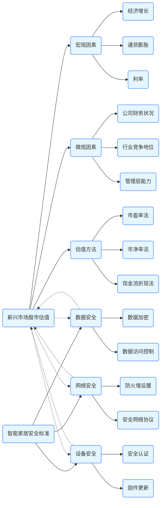

# 新兴市场股市估值与智能家居安全标准的互动

> 关键词：新兴市场股市估值、智能家居安全标准、互动关系、金融市场、科技行业

> 摘要：本文深入探讨了新兴市场股市估值与智能家居安全标准之间的互动关系。首先介绍了研究的背景、目的、预期读者和文档结构，明确了相关术语。接着阐述了新兴市场股市估值和智能家居安全标准的核心概念及其联系，并给出了相应的原理和架构示意图与流程图。详细讲解了涉及的核心算法原理和具体操作步骤，运用Python代码进行阐述，同时给出了相关的数学模型和公式并举例说明。通过项目实战，展示了如何在实际中分析两者的互动，包括开发环境搭建、源代码实现和解读。探讨了两者互动在金融投资、智能家居行业发展等方面的实际应用场景。推荐了学习、开发工具和相关论文著作。最后总结了未来发展趋势与挑战，解答了常见问题，并提供了扩展阅读和参考资料。

## 1. 背景介绍 
### 1.1 目的和范围
本研究旨在全面剖析新兴市场股市估值与智能家居安全标准之间的互动关系。新兴市场股市在全球金融体系中扮演着越来越重要的角色，其估值受到多种因素的影响。智能家居作为科技领域的新兴产业，安全标准的制定和实施对其发展至关重要。研究两者的互动关系，有助于投资者更好地理解新兴市场股市中智能家居相关企业的价值，也有助于智能家居行业根据市场反馈优化安全标准。研究范围涵盖了新兴市场的主要股市，以及智能家居行业的安全标准体系。

### 1.2 预期读者
本文的预期读者包括金融投资者、智能家居行业从业者、科技分析师、学术研究人员以及对新兴市场和智能家居领域感兴趣的人士。投资者可以通过了解两者的互动关系，做出更明智的投资决策；从业者可以根据市场动态调整安全标准和企业战略；分析师和研究人员可以将本文作为进一步研究的参考；而普通爱好者可以增加对这两个领域的认识。

### 1.3 文档结构概述
本文将按照以下结构展开：首先介绍核心概念，包括新兴市场股市估值和智能家居安全标准的定义和原理，并展示它们之间的联系；接着讲解核心算法原理和具体操作步骤，用Python代码进行详细说明；然后给出相关的数学模型和公式，并举例说明；通过项目实战展示如何在实际中应用这些理论；探讨两者互动的实际应用场景；推荐相关的学习资源、开发工具和论文著作；最后总结未来发展趋势与挑战，解答常见问题并提供扩展阅读和参考资料。

### 1.4 术语表
#### 1.4.1 核心术语定义
- **新兴市场股市估值**：指对新兴市场中上市公司股票价值的评估。新兴市场通常是指经济发展较快、市场潜力较大的发展中国家或地区的股票市场。股市估值方法有多种，如市盈率法、市净率法等。
- **智能家居安全标准**：是为了保障智能家居系统的安全性而制定的一系列规范和要求。包括数据安全、网络安全、设备安全等方面的标准，旨在防止智能家居设备被攻击、数据泄露等安全问题。

#### 1.4.2 相关概念解释
- **新兴市场**：一般指那些经济发展迅速、金融市场逐渐开放的发展中国家或地区。这些市场具有较高的增长潜力，但也伴随着较高的风险。
- **智能家居**：利用先进的计算机技术、网络通信技术、传感器技术等，将家居设备连接成一个智能系统，实现家居设备的自动化控制、远程监控等功能。

#### 1.4.3 缩略词列表
- **PE**：市盈率（Price Earnings Ratio），是指股票价格除以每股收益的比率，用于衡量股票的估值水平。
- **PB**：市净率（Price to Book Ratio），是指股票价格与每股净资产的比率，反映了股票的市场价值与账面价值的关系。

## 2. 核心概念与联系 

### 新兴市场股市估值原理
新兴市场股市估值是一个复杂的过程，它受到多种因素的影响。从宏观层面来看，经济增长、通货膨胀、利率等因素会影响整个市场的估值水平。例如，经济增长较快的新兴市场，企业的盈利预期通常较高，股市估值也会相应提高。从微观层面来看，公司的财务状况、行业竞争地位、管理层能力等因素会影响个别股票的估值。常见的估值方法包括市盈率法、市净率法、现金流折现法等。

### 智能家居安全标准原理
智能家居安全标准的制定是为了保障智能家居系统的安全性。随着智能家居设备的普及，安全问题日益突出，如黑客攻击、数据泄露等。安全标准主要涉及以下几个方面：
- **数据安全**：确保智能家居设备收集、存储和传输的数据不被泄露、篡改。例如，采用加密技术对数据进行加密处理。
- **网络安全**：保障智能家居设备与网络的连接安全，防止网络攻击。例如，设置防火墙、采用安全的网络协议等。
- **设备安全**：确保智能家居设备本身的安全性，防止设备被破解、控制。例如，对设备进行安全认证、定期更新固件等。

### 两者的联系
新兴市场股市估值与智能家居安全标准之间存在着密切的联系。一方面，智能家居安全标准的提高会影响相关企业的成本和市场竞争力，进而影响其股价和股市估值。例如，严格的安全标准可能会增加企业的研发和生产成本，但也会提高产品的质量和市场认可度，从而提升企业的价值。另一方面，新兴市场股市的估值变化也会影响智能家居行业的发展。如果股市估值较高，企业可以更容易地筹集资金，加大在安全标准研发和实施方面的投入。

### 核心概念原理和架构的文本示意图
```plaintext
新兴市场股市估值
├── 宏观因素
│   ├── 经济增长
│   ├── 通货膨胀
│   ├── 利率
├── 微观因素
│   ├── 公司财务状况
│   ├── 行业竞争地位
│   ├── 管理层能力
├── 估值方法
│   ├── 市盈率法
│   ├── 市净率法
│   ├── 现金流折现法

智能家居安全标准
├── 数据安全
│   ├── 数据加密
│   ├── 数据访问控制
├── 网络安全
│   ├── 防火墙设置
│   ├── 安全网络协议
├── 设备安全
│   ├── 安全认证
│   ├── 固件更新

两者联系
├── 安全标准影响股市估值
│   ├── 成本增加
│   ├── 市场竞争力提升
├── 股市估值影响安全标准
│   ├── 资金筹集
│   ├── 研发投入
```

### Mermaid 流程图


## 3. 核心算法原理 & 具体操作步骤 

### 新兴市场股市估值算法
#### 市盈率法
市盈率法是最常用的股市估值方法之一。其原理是通过比较股票的市盈率与行业平均市盈率或市场平均市盈率，来判断股票的估值是否合理。计算公式为：

$$PE = \frac{P}{EPS}$$

其中，$PE$ 为市盈率，$P$ 为股票价格，$EPS$ 为每股收益。

#### Python 代码实现
```python
def pe_ratio(stock_price, earnings_per_share):
    """
    计算市盈率
    :param stock_price: 股票价格
    :param earnings_per_share: 每股收益
    :return: 市盈率
    """
    return stock_price / earnings_per_share

# 示例
stock_price = 50
earnings_per_share = 5
pe = pe_ratio(stock_price, earnings_per_share)
print(f"市盈率: {pe}")
```

#### 市净率法
市净率法是通过比较股票的市净率与行业平均市净率或市场平均市净率，来评估股票的估值。计算公式为：

$$PB = \frac{P}{BVPS}$$

其中，$PB$ 为市净率，$P$ 为股票价格，$BVPS$ 为每股净资产。

#### Python 代码实现
```python
def pb_ratio(stock_price, book_value_per_share):
    """
    计算市净率
    :param stock_price: 股票价格
    :param book_value_per_share: 每股净资产
    :return: 市净率
    """
    return stock_price / book_value_per_share

# 示例
stock_price = 50
book_value_per_share = 10
pb = pb_ratio(stock_price, book_value_per_share)
print(f"市净率: {pb}")
```

### 智能家居安全标准评估算法
#### 安全得分法
可以通过对智能家居设备的各项安全指标进行评分，然后计算总分来评估设备的安全水平。例如，数据安全、网络安全、设备安全各占一定的权重，分别进行评分后加权求和。

#### Python 代码实现
```python
def security_score(data_security_score, network_security_score, device_security_score):
    """
    计算智能家居设备的安全得分
    :param data_security_score: 数据安全得分
    :param network_security_score: 网络安全得分
    :param device_security_score: 设备安全得分
    :return: 安全得分
    """
    data_weight = 0.4
    network_weight = 0.3
    device_weight = 0.3
    return data_security_score * data_weight + network_security_score * network_weight + device_security_score * device_weight

# 示例
data_security_score = 80
network_security_score = 70
device_security_score = 75
score = security_score(data_security_score, network_security_score, device_security_score)
print(f"安全得分: {score}")
```

### 两者互动分析算法
可以通过建立回归模型来分析新兴市场股市估值与智能家居安全标准之间的关系。例如，以股市估值为因变量，安全标准评分为自变量，进行线性回归分析。

#### Python 代码实现
```python
import numpy as np
from sklearn.linear_model import LinearRegression

# 示例数据
stock_valuations = np.array([100, 120, 130, 140, 150]).reshape(-1, 1)
security_scores = np.array([70, 75, 80, 85, 90])

# 创建线性回归模型
model = LinearRegression()
model.fit(security_scores.reshape(-1, 1), stock_valuations)

# 预测
new_security_score = np.array([82]).reshape(-1, 1)
predicted_stock_valuation = model.predict(new_security_score)
print(f"预测的股市估值: {predicted_stock_valuation[0][0]}")
```

## 4. 数学模型和公式 & 详细讲解 & 举例说明 

### 新兴市场股市估值数学模型
#### 市盈率模型
市盈率模型是基于股票价格与每股收益之间的关系。如前面所述，市盈率 $PE$ 的计算公式为：

$$PE = \frac{P}{EPS}$$

该公式表示股票价格是每股收益的 $PE$ 倍。例如，某股票的价格为 $50$ 元，每股收益为 $5$ 元，则市盈率为：

$$PE = \frac{50}{5} = 10$$

一般来说，市盈率越高，说明市场对该股票的预期越高，但也可能意味着股票被高估。

#### 市净率模型
市净率模型是基于股票价格与每股净资产之间的关系。市净率 $PB$ 的计算公式为：

$$PB = \frac{P}{BVPS}$$

例如，某股票的价格为 $50$ 元，每股净资产为 $10$ 元，则市净率为：

$$PB = \frac{50}{10} = 5$$

市净率较低的股票可能被低估，但也可能反映出公司的盈利能力较弱。

#### 现金流折现模型
现金流折现模型是通过预测公司未来的现金流，并将其折现到当前来评估公司的价值。公式为：

$$V = \sum_{t=1}^{n} \frac{CF_t}{(1 + r)^t}$$

其中，$V$ 为公司的价值，$CF_t$ 为第 $t$ 期的现金流，$r$ 为折现率，$n$ 为预测期数。

例如，假设某公司未来三年的现金流分别为 $100$ 万元、$120$ 万元、$150$ 万元，折现率为 $10\%$，则公司的价值为：

$$V = \frac{100}{(1 + 0.1)^1} + \frac{120}{(1 + 0.1)^2} + \frac{150}{(1 + 0.1)^3} \approx 295.06 \text{万元}$$

### 智能家居安全标准评估数学模型
#### 安全得分模型
安全得分模型是通过对各项安全指标进行加权求和来评估智能家居设备的安全水平。公式为：

$$S = w_1S_1 + w_2S_2 + w_3S_3$$

其中，$S$ 为安全得分，$S_1$、$S_2$、$S_3$ 分别为数据安全、网络安全、设备安全的得分，$w_1$、$w_2$、$w_3$ 分别为相应的权重，且 $w_1 + w_2 + w_3 = 1$。

例如，数据安全得分 $S_1 = 80$，网络安全得分 $S_2 = 70$，设备安全得分 $S_3 = 75$，权重分别为 $w_1 = 0.4$，$w_2 = 0.3$，$w_3 = 0.3$，则安全得分为：

$$S = 0.4\times80 + 0.3\times70 + 0.3\times75 = 76.5$$

### 两者互动数学模型
#### 线性回归模型
线性回归模型可以用来分析新兴市场股市估值 $Y$ 与智能家居安全标准评分 $X$ 之间的关系。模型的一般形式为：

$$Y = \beta_0 + \beta_1X + \epsilon$$

其中，$\beta_0$ 为截距，$\beta_1$ 为斜率，$\epsilon$ 为误差项。

通过最小二乘法可以估计出 $\beta_0$ 和 $\beta_1$ 的值。例如，根据前面的 Python 代码示例，得到的线性回归模型可以用来预测不同安全标准评分下的股市估值。

## 5. 项目实战：代码实际案例和详细解释说明 

### 5.1  开发环境搭建
#### 安装 Python
首先，需要安装 Python 环境。可以从 Python 官方网站（https://www.python.org/downloads/）下载适合自己操作系统的 Python 版本，并按照安装向导进行安装。

#### 安装必要的库
本项目需要使用到一些 Python 库，如 `numpy`、`pandas`、`scikit-learn` 等。可以使用 `pip` 命令进行安装：
```sh
pip install numpy pandas scikit-learn
```

### 5.2  源代码详细实现和代码解读
#### 数据准备
假设我们已经收集到了新兴市场股市中智能家居相关企业的股票价格、每股收益、每股净资产等数据，以及这些企业智能家居产品的安全标准评分数据。我们可以使用 `pandas` 库来读取和处理这些数据。

```python
import pandas as pd

# 读取数据
data = pd.read_csv('smart_home_stock_data.csv')

# 提取所需列
stock_prices = data['stock_price']
earnings_per_share = data['earnings_per_share']
book_value_per_share = data['book_value_per_share']
security_scores = data['security_score']
```

#### 计算股市估值指标
使用前面介绍的市盈率法和市净率法计算股市估值指标。

```python
# 计算市盈率
pe_ratios = stock_prices / earnings_per_share

# 计算市净率
pb_ratios = stock_prices / book_value_per_share
```

#### 分析两者互动关系
使用线性回归模型分析股市估值与安全标准评分之间的关系。

```python
from sklearn.linear_model import LinearRegression
import numpy as np

# 准备数据
X = security_scores.values.reshape(-1, 1)
y_pe = pe_ratios.values.reshape(-1, 1)
y_pb = pb_ratios.values.reshape(-1, 1)

# 建立线性回归模型
model_pe = LinearRegression()
model_pb = LinearRegression()

# 拟合模型
model_pe.fit(X, y_pe)
model_pb.fit(X, y_pb)

# 输出模型参数
print(f"市盈率模型: 截距 = {model_pe.intercept_[0]}, 斜率 = {model_pe.coef_[0][0]}")
print(f"市净率模型: 截距 = {model_pb.intercept_[0]}, 斜率 = {model_pb.coef_[0][0]}")
```

### 5.3  代码解读与分析
#### 数据准备部分
使用 `pandas` 库的 `read_csv` 函数读取存储在 CSV 文件中的数据。然后提取所需的列，包括股票价格、每股收益、每股净资产和安全标准评分。

#### 计算股市估值指标部分
通过简单的数学运算，计算出市盈率和市净率。这两个指标可以帮助我们评估股票的估值水平。

#### 分析两者互动关系部分
使用 `scikit-learn` 库的 `LinearRegression` 类建立线性回归模型。将安全标准评分作为自变量，市盈率和市净率分别作为因变量进行拟合。最后输出模型的截距和斜率，这些参数可以反映出两者之间的关系。例如，斜率为正表示安全标准评分越高，股市估值越高。

## 6. 实际应用场景 
### 金融投资领域
对于金融投资者来说，了解新兴市场股市估值与智能家居安全标准的互动关系可以帮助他们做出更明智的投资决策。如果智能家居安全标准不断提高，相关企业的市场竞争力可能会增强，股市估值也可能会上升。投资者可以关注那些在安全标准方面表现出色的企业，适时买入其股票。反之，如果安全标准下降，可能意味着企业面临较大的安全风险，投资者可以考虑卖出相关股票。

### 智能家居行业发展
智能家居企业可以根据新兴市场股市估值的变化来调整自身的发展战略。当股市估值较高时，企业可以更容易地筹集资金，加大在安全标准研发和实施方面的投入，提高产品的安全性和市场竞争力。同时，企业也可以通过提高安全标准来提升自身的市场形象，吸引更多的投资者和消费者。

### 政策制定方面
政府和监管机构可以根据新兴市场股市估值与智能家居安全标准的互动关系来制定相关政策。例如，如果发现股市估值与安全标准之间存在明显的正相关关系，政府可以加大对智能家居安全标准的监管力度，推动行业的健康发展。同时，政府也可以通过政策引导，鼓励企业提高安全标准，促进新兴市场股市中智能家居相关企业的发展。

## 7. 工具和资源推荐
### 7.1 学习资源推荐
#### 7.1.1 书籍推荐
- 《金融市场学》：介绍了金融市场的基本原理和运行机制，对于理解新兴市场股市估值有很大帮助。
- 《智能家居技术与应用》：详细讲解了智能家居的技术原理和应用场景，有助于了解智能家居安全标准。
- 《Python 数据分析实战》：通过实际案例介绍了如何使用 Python 进行数据分析，对于本项目的代码实现有指导作用。

#### 7.1.2 在线课程
- Coursera 上的“金融市场分析”课程：由知名教授授课，深入讲解了金融市场的分析方法和工具。
- edX 上的“智能家居系统设计与开发”课程：系统地介绍了智能家居系统的设计和开发流程，包括安全标准的制定。
- 网易云课堂上的“Python 数据分析入门”课程：适合初学者学习 Python 数据分析的基础知识和技能。

#### 7.1.3 技术博客和网站
- 雪球网：提供了丰富的金融市场资讯和分析，对于新兴市场股市估值的研究有很大帮助。
- 智能家居在线：专注于智能家居行业的新闻和技术分享，是了解智能家居安全标准的重要渠道。
- 博客园：有很多程序员分享的 Python 代码和数据分析经验，对于项目实战有参考价值。

### 7.2 开发工具框架推荐
#### 7.2.1 IDE和编辑器
- PyCharm：一款功能强大的 Python 集成开发环境，提供了代码编辑、调试、版本控制等功能。
- Jupyter Notebook：适合进行数据分析和代码演示，支持 Python、R 等多种编程语言。
- Visual Studio Code：轻量级的代码编辑器，支持多种编程语言和插件扩展。

#### 7.2.2 调试和性能分析工具
- PDB：Python 自带的调试工具，可以帮助开发者定位代码中的问题。
- cProfile：Python 的性能分析工具，可以分析代码的运行时间和函数调用情况。
- Py-Spy：一个简单易用的 Python 性能分析工具，可以实时监控 Python 程序的性能。

#### 7.2.3 相关框架和库
- Pandas：用于数据处理和分析的 Python 库，提供了高效的数据结构和数据操作方法。
- NumPy：Python 的科学计算库，提供了多维数组和矩阵运算的功能。
- Scikit-learn：用于机器学习的 Python 库，提供了各种机器学习算法和工具。

### 7.3 相关论文著作推荐
#### 7.3.1 经典论文
- 《新兴市场股市估值的影响因素分析》：深入研究了新兴市场股市估值的影响因素，为本文的研究提供了理论基础。
- 《智能家居安全标准的制定与实施》：详细阐述了智能家居安全标准的制定原则和实施方法。
- 《金融市场与科技行业的互动关系研究》：探讨了金融市场与科技行业之间的相互影响，对于理解新兴市场股市估值与智能家居安全标准的互动有启示作用。

#### 7.3.2 最新研究成果
- 关注学术数据库如 IEEE Xplore、ACM Digital Library 等，搜索关于新兴市场股市估值和智能家居安全标准的最新研究论文。
- 参加相关的学术会议和研讨会，了解最新的研究动态和成果。

#### 7.3.3 应用案例分析
- 一些知名的咨询公司和研究机构会发布关于新兴市场股市和智能家居行业的应用案例分析报告，可以从中了解实际应用中的经验和教训。

## 8. 总结：未来发展趋势与挑战
### 未来发展趋势
#### 新兴市场股市估值
随着新兴市场国家经济的不断发展，新兴市场股市的规模和影响力将不断扩大。智能家居作为科技领域的新兴产业，相关企业在新兴市场股市中的比重将逐渐增加。未来，新兴市场股市估值将更加关注企业的创新能力和安全标准，智能家居安全标准较高的企业将更受投资者青睐。

#### 智能家居安全标准
随着智能家居设备的不断普及，安全问题将越来越受到重视。未来，智能家居安全标准将不断提高和完善，涵盖更多的安全领域，如人工智能安全、物联网安全等。同时，安全标准的国际化趋势也将加强，不同国家和地区的安全标准将逐渐趋同。

#### 两者互动关系
新兴市场股市估值与智能家居安全标准的互动关系将更加紧密。安全标准的提高将直接影响企业的市场竞争力和股市估值，而股市估值的变化也将为企业提供更多的资金支持，促进安全标准的进一步提升。

### 挑战
#### 数据获取和分析
获取准确、全面的新兴市场股市数据和智能家居安全标准数据是一个挑战。不同国家和地区的股市数据和安全标准可能存在差异，需要进行有效的整合和分析。同时，数据的质量和时效性也会影响研究结果的准确性。

#### 技术创新和安全挑战
智能家居行业的技术创新日新月异，新的安全威胁也不断出现。如何及时制定和更新安全标准，以应对不断变化的安全挑战，是智能家居行业面临的重要问题。同时，新兴市场股市也需要适应技术创新的变化，准确评估相关企业的价值。

#### 政策和监管差异
不同国家和地区的政策和监管环境存在差异，这可能会影响新兴市场股市估值与智能家居安全标准的互动关系。例如，一些国家可能对智能家居安全标准有更严格的要求，而另一些国家则相对宽松。如何协调不同国家和地区的政策和监管，促进新兴市场和智能家居行业的健康发展，是一个亟待解决的问题。

## 9. 附录：常见问题与解答
### 问题 1：新兴市场股市估值与发达市场股市估值有什么区别？
答：新兴市场股市估值与发达市场股市估值存在一些区别。新兴市场通常经济发展较快，但也伴随着较高的风险，因此股市估值的波动可能较大。发达市场经济相对稳定，股市估值相对较为合理和稳定。此外，新兴市场的信息披露和监管机制可能不如发达市场完善，这也会影响股市估值的准确性。

### 问题 2：智能家居安全标准的提高会对企业成本产生多大影响？
答：智能家居安全标准的提高会增加企业的成本。企业需要投入更多的资金用于研发和实施安全措施，如数据加密技术、网络安全防护等。同时，企业还需要对员工进行安全培训，以确保安全标准的有效执行。具体的成本增加幅度取决于企业的规模、产品类型和安全标准的严格程度等因素。

### 问题 3：如何评估新兴市场股市中智能家居相关企业的投资价值？
答：评估新兴市场股市中智能家居相关企业的投资价值需要综合考虑多个因素。首先，要关注企业的财务状况，如盈利能力、资产负债情况等。其次，要考察企业的技术实力和创新能力，特别是在智能家居安全标准方面的表现。此外，还要考虑行业的发展趋势和市场竞争状况。可以使用市盈率、市净率等估值指标进行初步评估，但不能仅仅依赖这些指标，还需要结合企业的实际情况进行综合分析。

### 问题 4：智能家居安全标准的国际化趋势对企业有什么影响？
答：智能家居安全标准的国际化趋势对企业既有机遇也有挑战。机遇方面，统一的安全标准可以降低企业的研发和生产成本，提高产品的市场认可度，促进企业的国际化发展。挑战方面，企业需要满足不同国家和地区的安全标准要求，这可能需要投入更多的资源和精力。同时，企业还需要关注国际安全标准的变化，及时调整产品和服务。

## 10. 扩展阅读 & 参考资料
### 扩展阅读
- 《金融科技前沿》：介绍了金融科技领域的最新发展动态和研究成果，对于理解新兴市场股市和智能家居行业的融合有帮助。
- 《物联网安全技术》：深入探讨了物联网安全的技术原理和解决方案，对于智能家居安全标准的研究有参考价值。

### 参考资料
- 相关的财经报纸和杂志，如《金融时报》、《财经》等，提供了丰富的金融市场资讯和分析。
- 智能家居行业的官方网站和行业报告，如中国智能家居产业联盟的网站，了解智能家居行业的发展现状和趋势。
- 学术数据库中的相关研究论文，如中国知网、万方数据等，为本文的研究提供了理论支持和实证依据。