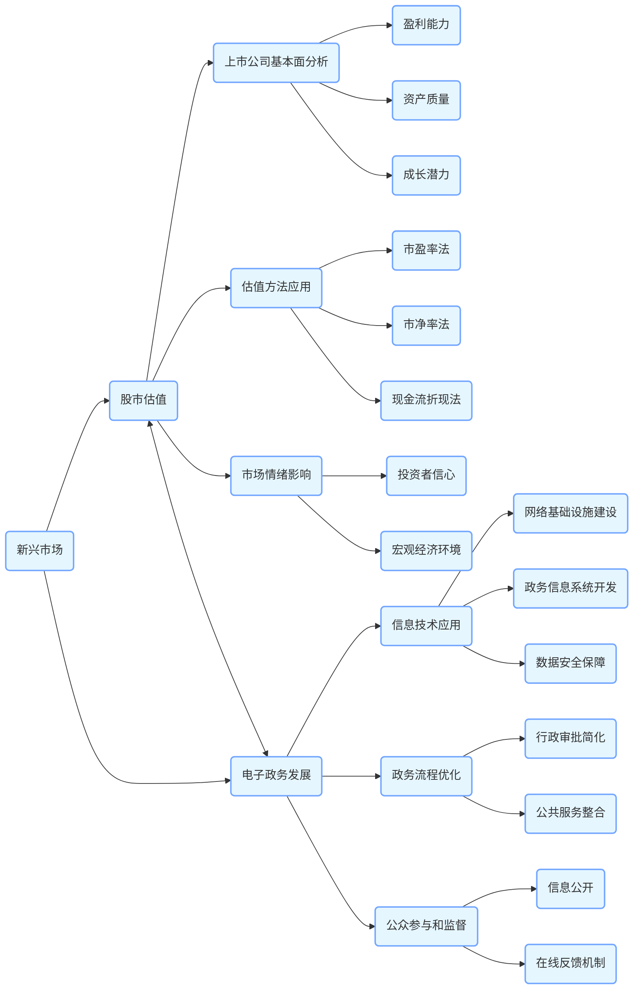

# 新兴市场股市估值与电子政务发展的互动

> 关键词：新兴市场、股市估值、电子政务发展、互动关系、经济影响

> 摘要：本文聚焦于新兴市场中股市估值与电子政务发展之间的互动关系。首先阐述了研究的背景、目的、预期读者等内容。接着对核心概念进行深入剖析，展示其原理和架构，并通过Mermaid流程图呈现逻辑关系。详细讲解了相关核心算法原理及操作步骤，给出Python源代码示例。引入数学模型和公式，结合实际例子进行说明。通过项目实战案例，从开发环境搭建到源代码实现与解读进行全面分析。探讨了该互动关系在实际中的应用场景，推荐了学习资源、开发工具框架以及相关论文著作。最后总结了未来发展趋势与挑战，还设置了常见问题解答和扩展阅读参考资料，旨在为深入理解新兴市场股市估值与电子政务发展的互动提供全面且专业的视角。

## 1. 背景介绍 
### 1.1 目的和范围
本研究旨在深入探究新兴市场中股市估值与电子政务发展之间的互动关系。新兴市场在全球经济格局中扮演着越来越重要的角色，其股市表现和政府治理模式的数字化转型都备受关注。股市估值反映了市场对企业未来盈利能力和发展前景的预期，而电子政务发展则体现了政府利用信息技术提升公共服务效率、透明度和决策科学性的程度。通过研究两者的互动，我们可以更好地理解新兴市场的经济运行机制，为投资者、政策制定者和相关研究人员提供有价值的参考。

研究范围涵盖了多个具有代表性的新兴市场国家和地区，分析它们在不同阶段的股市估值变化和电子政务发展水平，以及两者之间的相互影响和作用机制。

### 1.2 预期读者
本文的预期读者包括金融领域的投资者、分析师，政府政策制定者和相关部门工作人员，以及对新兴市场经济和信息技术应用感兴趣的研究人员和学者。投资者可以从本文中获取关于新兴市场股市投资的新视角和决策依据；政策制定者可以了解电子政务发展对股市和整体经济的影响，从而制定更有效的政策；研究人员则可以在现有研究的基础上进一步深入探讨相关课题。

### 1.3 文档结构概述
本文将按照以下结构进行阐述：首先介绍核心概念与联系，明确股市估值和电子政务发展的定义、原理和相互关系，并通过示意图和流程图进行直观展示；接着讲解核心算法原理和具体操作步骤，利用Python代码实现相关算法；然后引入数学模型和公式，详细解释其含义并举例说明；通过项目实战案例，展示如何在实际中分析两者的互动关系；探讨该互动关系在不同领域的实际应用场景；推荐学习资源、开发工具框架和相关论文著作；最后总结未来发展趋势与挑战，解答常见问题，并提供扩展阅读和参考资料。

### 1.4 术语表
#### 1.4.1 核心术语定义
- **新兴市场**：指的是发展中国家或地区的金融市场，这些市场通常具有较高的经济增长率，但也伴随着较高的风险和不确定性。其股票市场、债券市场等金融领域处于快速发展阶段，吸引了全球投资者的关注。
- **股市估值**：是对股票市场中上市公司价值的评估，常用的估值方法包括市盈率（P/E）、市净率（P/B）、现金流折现法（DCF）等。股市估值反映了市场参与者对上市公司未来盈利和发展前景的预期，是投资者进行投资决策的重要依据。
- **电子政务**：是政府机构运用现代信息技术，将管理和服务通过网络技术进行集成，在互联网上实现政府组织结构和工作流程的优化重组，超越时间、空间与部门分隔的限制，全方位地向社会提供优质、规范、透明、符合国际水准的管理和服务。

#### 1.4.2 相关概念解释
- **市盈率（P/E）**：是指股票价格除以每股收益（EPS）的比率，反映了投资者为获取公司每一元盈利所愿意支付的价格。较高的市盈率通常表示市场对公司未来盈利增长的预期较高，但也可能意味着股票被高估。
- **市净率（P/B）**：是指股票价格与每股净资产的比率，反映了市场对公司净资产的估值。市净率较低可能表示股票被低估，但也可能反映公司的盈利能力较弱或存在其他问题。
- **现金流折现法（DCF）**：是一种通过预测公司未来的现金流，并将其折现到当前价值的估值方法。该方法考虑了货币的时间价值和公司未来的盈利能力，是一种较为全面和精确的估值方法，但也需要对公司的未来发展进行较为准确的预测。

#### 1.4.3 缩略词列表
- **P/E**：市盈率（Price-to-Earnings Ratio）
- **P/B**：市净率（Price-to-Book Ratio）
- **DCF**：现金流折现法（Discounted Cash Flow）

## 2. 核心概念与联系 
### 核心概念原理
#### 股市估值原理
股市估值是基于对上市公司未来盈利能力和资产价值的评估。不同的估值方法基于不同的假设和数据来源。例如，市盈率法假设公司的盈利水平将保持相对稳定或按照一定的增长率增长，通过将当前股票价格与每股收益进行比较，来判断股票是否被高估或低估。市净率法则侧重于公司的净资产价值，认为股票价格应该与公司的净资产有一定的比例关系。现金流折现法更为复杂，它需要对公司未来的现金流量进行详细的预测，并根据适当的折现率将其折现到当前价值，从而得到公司的内在价值。

#### 电子政务发展原理
电子政务的发展基于信息技术的应用，旨在提高政府的管理效率和服务质量。其原理包括以下几个方面：一是利用信息技术实现政府业务流程的自动化和优化，减少人工干预和繁琐的手续，提高办事效率；二是通过网络平台实现信息的公开和共享，增强政府工作的透明度，促进公众参与和监督；三是利用数据分析和决策支持系统，为政府决策提供科学依据，提高决策的准确性和科学性。

### 架构的文本示意图
```plaintext
新兴市场
├── 股市估值
│   ├── 上市公司基本面分析
│   │   ├── 盈利能力
│   │   ├── 资产质量
│   │   ├── 成长潜力
│   ├── 估值方法应用
│   │   ├── 市盈率法
│   │   ├── 市净率法
│   │   ├── 现金流折现法
│   ├── 市场情绪影响
│   │   ├── 投资者信心
│   │   ├── 宏观经济环境
├── 电子政务发展
│   ├── 信息技术应用
│   │   ├── 网络基础设施建设
│   │   ├── 政务信息系统开发
│   │   ├── 数据安全保障
│   ├── 政务流程优化
│   │   ├── 行政审批简化
│   │   ├── 公共服务整合
│   ├── 公众参与和监督
│   │   ├── 信息公开
│   │   ├── 在线反馈机制
```

### Mermaid流程图


从流程图可以看出，新兴市场中的股市估值和电子政务发展相互影响。股市估值受到上市公司基本面、估值方法和市场情绪的影响，而电子政务发展则依赖于信息技术应用、政务流程优化和公众参与监督。两者之间的双向箭头表示它们之间存在着互动关系，电子政务的发展可能会影响股市估值，而股市的表现也可能对电子政务的发展产生反馈作用。

## 3. 核心算法原理 & 具体操作步骤 
### 股市估值算法原理及Python实现
#### 市盈率法
市盈率法是一种简单常用的估值方法，其公式为：

$P = EPS \times P/E$

其中，$P$ 为股票价格，$EPS$ 为每股收益，$P/E$ 为市盈率。

以下是使用Python实现市盈率法估值的代码示例：
```python
def pe_valuation(eps, pe_ratio):
    """
    使用市盈率法计算股票估值
    :param eps: 每股收益
    :param pe_ratio: 市盈率
    :return: 股票估值
    """
    return eps * pe_ratio

# 示例数据
eps = 2.0  # 每股收益为2元
pe_ratio = 15  # 市盈率为15倍

valuation = pe_valuation(eps, pe_ratio)
print(f"使用市盈率法计算的股票估值为: {valuation} 元")
```
#### 操作步骤
1. 收集上市公司的财务报表，获取每股收益（EPS）数据。
2. 参考同行业或市场平均市盈率，确定合适的市盈率（P/E）倍数。
3. 将每股收益和市盈率代入公式计算股票估值。

#### 市净率法
市净率法的公式为：

$P = BVPS \times P/B$

其中，$P$ 为股票价格，$BVPS$ 为每股净资产，$P/B$ 为市净率。

以下是使用Python实现市净率法估值的代码示例：
```python
def pb_valuation(bvps, pb_ratio):
    """
    使用市净率法计算股票估值
    :param bvps: 每股净资产
    :param pb_ratio: 市净率
    :return: 股票估值
    """
    return bvps * pb_ratio

# 示例数据
bvps = 10.0  # 每股净资产为10元
pb_ratio = 1.5  # 市净率为1.5倍

valuation = pb_valuation(bvps, pb_ratio)
print(f"使用市净率法计算的股票估值为: {valuation} 元")
```
#### 操作步骤
1. 从上市公司的财务报表中获取每股净资产（BVPS）数据。
2. 分析同行业或市场平均市净率，确定合适的市净率（P/B）倍数。
3. 将每股净资产和市净率代入公式计算股票估值。

#### 现金流折现法
现金流折现法的基本原理是将公司未来的现金流量折现到当前价值。其公式为：

$V = \sum_{t=1}^{n} \frac{CF_t}{(1 + r)^t}$

其中，$V$ 为公司的内在价值，$CF_t$ 为第 $t$ 期的现金流量，$r$ 为折现率，$n$ 为预测期数。

以下是使用Python实现现金流折现法估值的代码示例：
```python
def dcf_valuation(cash_flows, discount_rate):
    """
    使用现金流折现法计算公司估值
    :param cash_flows: 未来各期的现金流量列表
    :param discount_rate: 折现率
    :return: 公司估值
    """
    total_value = 0
    for t, cf in enumerate(cash_flows, start=1):
        present_value = cf / ((1 + discount_rate) ** t)
        total_value += present_value
    return total_value

# 示例数据
cash_flows = [100, 120, 150, 180, 200]  # 未来5年的现金流量
discount_rate = 0.1  # 折现率为10%

valuation = dcf_valuation(cash_flows, discount_rate)
print(f"使用现金流折现法计算的公司估值为: {valuation} 元")
```
#### 操作步骤
1. 对公司未来的现金流量进行预测，确定预测期数和各期的现金流量。
2. 确定合适的折现率，通常可以参考市场利率、公司的风险水平等因素。
3. 将各期的现金流量按照折现率折现到当前价值，并求和得到公司的内在价值。

### 电子政务发展评估算法原理及Python实现
#### 综合指标评估法
电子政务发展水平可以通过多个指标进行综合评估，例如信息基础设施建设水平、政务服务在线化程度、公众参与度等。假设我们使用三个指标 $x_1$、$x_2$、$x_3$ 来评估电子政务发展水平，每个指标的权重分别为 $w_1$、$w_2$、$w_3$，则综合评估得分 $S$ 的计算公式为：

$S = w_1x_1 + w_2x_2 + w_3x_3$

以下是使用Python实现综合指标评估法的代码示例：
```python
def e_gov_evaluation(indicators, weights):
    """
    使用综合指标评估法评估电子政务发展水平
    :param indicators: 各指标得分列表
    :param weights: 各指标权重列表
    :return: 综合评估得分
    """
    if len(indicators)!= len(weights):
        raise ValueError("指标数量和权重数量必须一致")
    total_score = 0
    for i in range(len(indicators)):
        total_score += indicators[i] * weights[i]
    return total_score

# 示例数据
indicators = [0.8, 0.7, 0.9]  # 三个指标的得分
weights = [0.3, 0.3, 0.4]  # 三个指标的权重

score = e_gov_evaluation(indicators, weights)
print(f"电子政务发展水平的综合评估得分为: {score}")
```
#### 操作步骤
1. 确定评估电子政务发展水平的指标体系，例如信息基础设施建设水平可以用网络带宽、服务器数量等指标来衡量；政务服务在线化程度可以用在线办理事项的比例、服务响应时间等指标来衡量；公众参与度可以用公众在线反馈的数量、参与政务活动的人数等指标来衡量。
2. 收集各指标的数据，并进行标准化处理，使其取值范围在 $[0, 1]$ 之间。
3. 确定各指标的权重，可以通过专家打分法、层次分析法等方法来确定。
4. 将各指标的得分和权重代入公式计算综合评估得分。

## 4. 数学模型和公式 & 详细讲解 & 举例说明 
### 股市估值数学模型
#### 市盈率模型
市盈率模型的基本公式为 $P = EPS \times P/E$，其中 $P$ 表示股票价格，$EPS$ 表示每股收益，$P/E$ 表示市盈率。

**详细讲解**：市盈率反映了市场对公司盈利的预期和投资者愿意为每一元盈利支付的价格。如果一家公司的市盈率较高，说明市场对其未来盈利增长的预期较高，投资者愿意以较高的价格购买该公司的股票；反之，如果市盈率较低，则可能表示市场对该公司的前景不太乐观，或者股票被低估。

**举例说明**：假设公司A的每股收益为 $EPS = 2$ 元，同行业平均市盈率为 $P/E = 15$ 倍。根据市盈率模型，公司A的股票估值为 $P = 2 \times 15 = 30$ 元。如果公司A的当前股票价格为 25 元，则可能被认为是低估的，具有投资价值；如果当前股票价格为 35 元，则可能被认为是高估的。

#### 市净率模型
市净率模型的公式为 $P = BVPS \times P/B$，其中 $P$ 表示股票价格，$BVPS$ 表示每股净资产，$P/B$ 表示市净率。

**详细讲解**：市净率反映了市场对公司净资产的估值。一般来说，市净率较低的股票可能具有一定的投资价值，因为投资者可以以较低的价格购买到公司的净资产。但市净率也受到公司盈利能力、行业特点等因素的影响。例如，一些高科技公司可能具有较高的市净率，因为它们的价值更多地体现在无形资产和未来盈利潜力上，而不是净资产上。

**举例说明**：假设公司B的每股净资产为 $BVPS = 10$ 元，同行业平均市净率为 $P/B = 1.5$ 倍。根据市净率模型，公司B的股票估值为 $P = 10 \times 1.5 = 15$ 元。如果公司B的当前股票价格为 12 元，则可能被认为是低估的；如果当前股票价格为 18 元，则可能被认为是高估的。

#### 现金流折现模型
现金流折现模型的公式为 $V = \sum_{t=1}^{n} \frac{CF_t}{(1 + r)^t}$，其中 $V$ 表示公司的内在价值，$CF_t$ 表示第 $t$ 期的现金流量，$r$ 表示折现率，$n$ 表示预测期数。

**详细讲解**：现金流折现模型考虑了货币的时间价值和公司未来的盈利能力。通过预测公司未来各期的现金流量，并将其折现到当前价值，可以得到公司的内在价值。折现率 $r$ 反映了投资的风险程度，风险越高，折现率越高。预测期数 $n$ 通常根据公司的发展阶段和行业特点来确定。

**举例说明**：假设公司C未来 5 年的现金流量分别为 $CF_1 = 100$ 万元，$CF_2 = 120$ 万元，$CF_3 = 150$ 万元，$CF_4 = 180$ 万元，$CF_5 = 200$ 万元，折现率 $r = 0.1$。根据现金流折现模型，公司C的内在价值为：

\[
\begin{align*}
V &= \frac{100}{(1 + 0.1)^1} + \frac{120}{(1 + 0.1)^2} + \frac{150}{(1 + 0.1)^3} + \frac{180}{(1 + 0.1)^4} + \frac{200}{(1 + 0.1)^5}\\
&= \frac{100}{1.1} + \frac{120}{1.21} + \frac{150}{1.331} + \frac{180}{1.4641} + \frac{200}{1.61051}\\
&\approx 90.91 + 99.17 + 112.69 + 122.94 + 124.18\\
&= 549.89 \text{（万元）}
\end{align*}
\]

如果公司C的当前市场价值低于 549.89 万元，则可能被认为是低估的；如果高于 549.89 万元，则可能被认为是高估的。

### 电子政务发展评估数学模型
#### 综合指标评估模型
综合指标评估模型的公式为 $S = w_1x_1 + w_2x_2 + w_3x_3$，其中 $S$ 表示综合评估得分，$x_1$、$x_2$、$x_3$ 表示各指标得分，$w_1$、$w_2$、$w_3$ 表示各指标权重。

**详细讲解**：综合指标评估模型通过对多个指标进行加权求和，来评估电子政务的发展水平。各指标的权重反映了其在整体评估中的重要程度。通过合理选择指标和确定权重，可以更全面、客观地评估电子政务的发展状况。

**举例说明**：假设我们使用三个指标来评估电子政务发展水平，分别是信息基础设施建设水平 $x_1$、政务服务在线化程度 $x_2$、公众参与度 $x_3$，其权重分别为 $w_1 = 0.3$，$w_2 = 0.3$，$w_3 = 0.4$。某地区在这三个指标上的得分分别为 $x_1 = 0.8$，$x_2 = 0.7$，$x_3 = 0.9$。根据综合指标评估模型，该地区电子政务发展水平的综合评估得分为：

$S = 0.3 \times 0.8 + 0.3 \times 0.7 + 0.4 \times 0.9 = 0.24 + 0.21 + 0.36 = 0.81$

综合评估得分越高，说明该地区的电子政务发展水平越高。

### 股市估值与电子政务发展互动的数学模型
假设股市估值用 $V_s$ 表示，电子政务发展水平用 $V_e$ 表示，两者之间的互动关系可以用以下线性回归模型来表示：

$V_s = \alpha + \beta V_e + \epsilon$

其中，$\alpha$ 是截距项，$\beta$ 是斜率系数，表示电子政务发展水平对股市估值的影响程度，$\epsilon$ 是误差项。

**详细讲解**：该模型表示股市估值 $V_s$ 受到电子政务发展水平 $V_e$ 的影响，同时还受到其他未考虑到的因素（用误差项 $\epsilon$ 表示）的影响。斜率系数 $\beta$ 的正负和大小反映了电子政务发展水平与股市估值之间的关系。如果 $\beta > 0$，说明电子政务发展水平的提高会促进股市估值的上升；如果 $\beta < 0$，则说明电子政务发展水平的提高会导致股市估值的下降；如果 $\beta = 0$，则说明两者之间没有线性关系。

**举例说明**：通过对某新兴市场国家多年的数据进行回归分析，得到回归方程为 $V_s = 100 + 20V_e + \epsilon$。这意味着当电子政务发展水平每提高 1 个单位时，股市估值平均会增加 20 个单位。如果该国家当前的电子政务发展水平 $V_e = 0.8$，则预测股市估值为 $V_s = 100 + 20 \times 0.8 = 116$。

## 5. 项目实战：代码实际案例和详细解释说明 
### 5.1  开发环境搭建
#### 操作系统
可以选择 Windows、Linux 或 macOS 操作系统，本项目以 Windows 10 为例进行说明。

#### Python 环境
首先需要安装 Python 环境，建议使用 Python 3.7 及以上版本。可以从 Python 官方网站（https://www.python.org/downloads/） 下载安装包，按照安装向导进行安装。安装完成后，在命令行中输入 `python --version` 验证 Python 是否安装成功。

#### 第三方库安装
本项目需要使用一些第三方库，如 `pandas` 用于数据处理，`numpy` 用于数值计算，`matplotlib` 用于数据可视化。可以使用 `pip` 命令进行安装：
```sh
pip install pandas numpy matplotlib
```

### 5.2  源代码详细实现和代码解读
#### 数据收集与预处理
假设我们已经收集到了某新兴市场国家的股市估值数据（市盈率、市净率等）和电子政务发展水平评估数据。以下是使用 Python 读取和预处理数据的代码示例：
```python
import pandas as pd

# 读取数据
data = pd.read_csv('data.csv')

# 查看数据基本信息
print(data.info())

# 处理缺失值
data = data.dropna()

# 提取股市估值和电子政务发展水平数据
stock_valuation = data['stock_valuation']
e_gov_development = data['e_gov_development']
```
**代码解读**：
- `pd.read_csv('data.csv')`：使用 `pandas` 库的 `read_csv` 函数读取存储在 `data.csv` 文件中的数据。
- `data.info()`：查看数据的基本信息，包括列名、数据类型、缺失值情况等。
- `data.dropna()`：删除包含缺失值的行，以确保数据的完整性。
- `data['stock_valuation']` 和 `data['e_gov_development']`：分别提取股市估值和电子政务发展水平的数据列。

#### 数据分析与可视化
以下是使用 Python 对数据进行分析和可视化的代码示例：
```python
import numpy as np
import matplotlib.pyplot as plt

# 计算两者的相关性
correlation = np.corrcoef(stock_valuation, e_gov_development)[0, 1]
print(f"股市估值与电子政务发展水平的相关性为: {correlation}")

# 绘制散点图
plt.scatter(e_gov_development, stock_valuation)
plt.xlabel('电子政务发展水平')
plt.ylabel('股市估值')
plt.title('股市估值与电子政务发展水平的关系')
plt.show()
```
**代码解读**：
- `np.corrcoef(stock_valuation, e_gov_development)[0, 1]`：使用 `numpy` 库的 `corrcoef` 函数计算股市估值和电子政务发展水平之间的相关系数。相关系数的取值范围在 $[-1, 1]$ 之间，绝对值越接近 1 表示两者之间的相关性越强，正相关表示两者变化趋势相同，负相关表示两者变化趋势相反。
- `plt.scatter(e_gov_development, stock_valuation)`：使用 `matplotlib` 库的 `scatter` 函数绘制散点图，直观展示股市估值和电子政务发展水平之间的关系。
- `plt.xlabel`、`plt.ylabel` 和 `plt.title`：分别设置 x 轴、y 轴的标签和图表的标题。
- `plt.show()`：显示绘制的图表。

#### 建立回归模型
以下是使用 Python 建立线性回归模型，分析电子政务发展水平对股市估值影响的代码示例：
```python
from sklearn.linear_model import LinearRegression

# 准备数据
X = e_gov_development.values.reshape(-1, 1)
y = stock_valuation.values

# 创建线性回归模型
model = LinearRegression()

# 拟合模型
model.fit(X, y)

# 获取模型参数
intercept = model.intercept_
coefficient = model.coef_[0]

print(f"截距项: {intercept}")
print(f"斜率系数: {coefficient}")

# 预测
new_e_gov_development = np.array([[0.9]])
predicted_stock_valuation = model.predict(new_e_gov_development)
print(f"当电子政务发展水平为 0.9 时，预测的股市估值为: {predicted_stock_valuation[0]}")
```
**代码解读**：
- `e_gov_development.values.reshape(-1, 1)`：将电子政务发展水平数据转换为二维数组，以满足 `sklearn` 库中线性回归模型的输入要求。
- `LinearRegression()`：创建一个线性回归模型对象。
- `model.fit(X, y)`：使用训练数据对模型进行拟合，找到最优的截距项和斜率系数。
- `model.intercept_` 和 `model.coef_`：分别获取模型的截距项和斜率系数。
- `model.predict(new_e_gov_development)`：使用训练好的模型对新的电子政务发展水平数据进行预测，得到预测的股市估值。

### 5.3  代码解读与分析
#### 数据预处理的重要性
在实际数据分析中，数据往往存在缺失值、异常值等问题。通过数据预处理，可以提高数据的质量，减少误差对分析结果的影响。例如，删除包含缺失值的行可以避免在后续计算中出现错误；对数据进行标准化处理可以使不同指标的数据具有可比性。

#### 相关性分析的意义
相关性分析可以帮助我们了解股市估值和电子政务发展水平之间的线性关系强弱。如果两者之间存在较强的正相关关系，说明电子政务的发展可能会促进股市估值的上升；如果存在较强的负相关关系，则说明电子政务的发展可能会对股市估值产生负面影响。相关性分析可以为进一步的研究提供方向。

#### 线性回归模型的应用
线性回归模型可以定量地分析电子政务发展水平对股市估值的影响程度。通过模型的截距项和斜率系数，我们可以了解两者之间的具体关系。例如，斜率系数为正且较大，说明电子政务发展水平的提高会显著促进股市估值的上升。同时，线性回归模型还可以用于预测，根据已知的电子政务发展水平数据，预测未来的股市估值。

## 6. 实际应用场景 
### 投资者决策
对于投资者来说，了解新兴市场股市估值与电子政务发展的互动关系可以为投资决策提供重要参考。如果电子政务发展水平较高的新兴市场国家，其股市估值往往也具有一定的上升潜力。投资者可以关注这些国家的相关行业和上市公司，寻找投资机会。例如，电子政务的发展会带动信息技术、软件服务等行业的发展，投资者可以考虑投资这些行业的优质企业。

### 政府政策制定
政府可以根据电子政务发展对股市估值的影响，制定相应的政策。一方面，政府可以加大对电子政务的投入，提高政务服务的效率和透明度，促进经济的发展，从而提升股市的整体估值。另一方面，政府可以通过政策引导，鼓励企业参与电子政务项目，推动相关产业的发展，为股市注入新的活力。例如，政府可以出台税收优惠政策、财政补贴政策等，支持电子政务相关企业的发展。

### 学术研究
学术界可以深入研究新兴市场股市估值与电子政务发展的互动关系，为经济理论的发展提供实证支持。通过对不同新兴市场国家的案例分析和比较研究，可以揭示两者之间的内在机制和影响因素，丰富相关领域的研究成果。例如，研究不同政治体制、经济发展水平下，电子政务发展对股市估值的影响差异，为政策制定和投资决策提供更具针对性的建议。

### 国际合作与交流
在全球化的背景下，新兴市场国家之间以及与发达国家之间可以就电子政务发展和股市估值等问题进行合作与交流。通过分享经验和技术，新兴市场国家可以借鉴其他国家的成功做法，加快电子政务的发展，提升股市的吸引力。同时，国际合作也有助于促进资本的流动和资源的优化配置，推动新兴市场的经济发展。例如，一些国际组织可以组织研讨会、培训课程等活动，促进各国之间的交流与合作。

## 7. 工具和资源推荐
### 7.1 学习资源推荐
#### 7.1.1 书籍推荐
- 《金融市场学》：全面介绍了金融市场的基本概念、原理和运行机制，包括股票市场、债券市场等，对于理解股市估值有很大帮助。
- 《电子政务概论》：系统阐述了电子政务的基本理论、技术和应用，涵盖了电子政务的发展历程、建设模式、管理方法等内容。
- 《计量经济学》：介绍了计量经济学的基本方法和模型，可用于分析股市估值与电子政务发展之间的关系，进行实证研究。

#### 7.1.2 在线课程
- Coursera 平台上的“Financial Markets”课程：由知名教授授课，深入讲解金融市场的理论和实践，包括股市估值的方法和应用。
- edX 平台上的“Introduction to E-Government”课程：提供了电子政务的全面介绍，包括电子政务的发展趋势、技术应用和政策制定等方面的内容。
- 中国大学 MOOC 上的“计量经济学”课程：结合实际案例，详细讲解计量经济学的原理和方法，帮助学习者掌握数据分析和建模的技能。

#### 7.1.3 技术博客和网站
- 雪球网：是国内知名的财经社区，提供股票市场的实时行情、分析报告和投资者交流平台，有助于了解股市动态和估值情况。
- 中国电子政务网：专注于电子政务领域的信息发布和交流，提供最新的政策法规、技术应用和案例分析等内容。
- Towards Data Science：是一个专注于数据科学和机器学习的技术博客，上面有很多关于数据分析、建模和可视化的优秀文章，对于处理和分析股市估值与电子政务发展的数据有很大帮助。

### 7.2 开发工具框架推荐
#### 7.2.1 IDE和编辑器
- PyCharm：是一款专业的 Python 集成开发环境，具有代码编辑、调试、版本控制等功能，适合开发数据分析和机器学习项目。
- Jupyter Notebook：是一个交互式的开发环境，支持 Python、R 等多种编程语言，方便进行数据探索、分析和可视化。
- Visual Studio Code：是一款轻量级的代码编辑器，支持多种编程语言和插件扩展，可用于快速开发和调试 Python 代码。

#### 7.2.2 调试和性能分析工具
- pdb：是 Python 内置的调试器，可以帮助开发者逐行调试代码，查找和解决问题。
- cProfile：是 Python 的性能分析工具，可以分析代码的运行时间和函数调用情况，帮助优化代码性能。
- Py-Spy：是一个用于分析 Python 程序性能的工具，可以实时监控程序的 CPU 使用率和函数调用情况，找出性能瓶颈。

#### 7.2.3 相关框架和库
- pandas：是一个强大的数据处理和分析库，提供了高效的数据结构和数据操作方法，可用于读取、清洗和分析股市估值和电子政务发展的数据。
- numpy：是 Python 的数值计算库，提供了高效的多维数组对象和数学函数，可用于进行数值计算和矩阵运算。
- scikit-learn：是一个常用的机器学习库，提供了丰富的机器学习算法和工具，可用于建立回归模型、分类模型等，分析股市估值与电子政务发展之间的关系。

### 7.3 相关论文著作推荐
#### 7.3.1 经典论文
- “The Efficient Market Hypothesis and Its Critics”：该论文对有效市场假说进行了深入探讨和批判，对于理解股市估值的理论基础有重要意义。
- “E-Government and the Transformation of Service Delivery and Citizen Attitudes”：研究了电子政务对公共服务交付和公民态度的影响，为电子政务发展的研究提供了重要的理论和实证支持。

#### 7.3.2 最新研究成果
- 近年来，一些学者通过实证研究分析了新兴市场股市估值与电子政务发展的关系，相关研究成果发表在《Journal of Financial Economics》、《Government Information Quarterly》等学术期刊上。这些研究采用了不同的方法和数据，从多个角度探讨了两者之间的互动机制和影响因素。

#### 7.3.3 应用案例分析
- 一些国际组织和研究机构发布了关于新兴市场国家电子政务发展和股市表现的案例分析报告，如世界银行的《World Development Report》、联合国经济和社会事务部的《E-Government Survey》等。这些报告通过具体案例，展示了电子政务发展对经济和股市的积极影响，为政策制定和实践提供了参考。

## 8. 总结：未来发展趋势与挑战
### 未来发展趋势
#### 电子政务推动股市估值提升
随着信息技术的不断发展和普及，电子政务将在新兴市场得到更广泛的应用和深入的发展。电子政务的发展将提高政府的管理效率和服务质量，促进经济的稳定增长，从而提升股市的整体估值。例如，电子政务的发展可以降低企业的运营成本，提高企业的竞争力，吸引更多的投资者进入股市。

#### 数据驱动的决策和分析
在未来，数据将成为分析新兴市场股市估值与电子政务发展互动关系的重要依据。通过收集和分析大量的股市数据、电子政务数据以及相关的经济社会数据，可以建立更加准确和复杂的模型，深入研究两者之间的内在机制和影响因素。同时，数据驱动的决策也将在投资者决策、政府政策制定等方面发挥越来越重要的作用。

#### 国际合作与交流加强
新兴市场国家之间以及与发达国家之间在电子政务发展和股市估值等领域的合作与交流将不断加强。通过分享经验和技术，新兴市场国家可以借鉴其他国家的成功做法，加快自身的发展。同时，国际合作也有助于促进资本的流动和资源的优化配置，推动新兴市场的经济发展和股市的繁荣。

### 挑战
#### 数据质量和安全问题
在分析新兴市场股市估值与电子政务发展的互动关系时，数据质量和安全是面临的重要挑战。一方面，由于新兴市场的统计体系和数据采集机制可能不够完善，数据的准确性和完整性可能存在问题。另一方面，随着信息技术的发展，数据安全问题日益突出，如何保护股市数据和电子政务数据的安全，防止数据泄露和滥用，是需要解决的重要问题。

#### 技术和人才短缺
电子政务的发展和数据分析需要先进的技术和专业的人才支持。然而，新兴市场国家在技术和人才方面可能存在短缺的问题。例如，一些新兴市场国家可能缺乏信息技术基础设施和专业的技术人员，难以开展大规模的电子政务项目和数据分析工作。因此，如何加强技术研发和人才培养，提高新兴市场国家的技术水平和人才素质，是促进电子政务发展和深入研究股市估值与电子政务互动关系的关键。

#### 政策协调和制度建设
新兴市场国家在电子政务发展和股市监管方面的政策协调和制度建设可能存在不足。例如，电子政务的发展需要相关的法律法规和政策支持，以保障数据的安全和隐私，促进政务信息的公开和共享。同时，股市监管也需要完善的制度和机制，以维护市场的公平、公正和透明。如何加强政策协调和制度建设，为电子政务发展和股市健康发展创造良好的环境，是新兴市场国家面临的重要挑战。

## 9. 附录：常见问题与解答
### 1. 如何衡量新兴市场的股市估值？
常见的衡量新兴市场股市估值的方法包括市盈率法、市净率法和现金流折现法等。市盈率法通过比较股票价格和每股收益来评估股票的估值；市净率法通过比较股票价格和每股净资产来评估股票的估值；现金流折现法通过预测公司未来的现金流量，并将其折现到当前价值来评估公司的内在价值。

### 2. 电子政务发展对股市估值有哪些具体影响？
电子政务发展可以通过多种方式影响股市估值。一方面，电子政务的发展可以提高政府的管理效率和服务质量，促进经济的稳定增长，从而提升企业的盈利能力和发展前景，进而推动股市估值的上升。另一方面，电子政务的发展可以增强政府工作的透明度，减少信息不对称，提高投资者的信心，也有利于股市估值的提升。

### 3. 如何分析股市估值与电子政务发展之间的关系？
可以通过收集股市估值数据和电子政务发展水平数据，运用统计分析方法和计量经济学模型进行分析。例如，可以计算两者之间的相关系数，建立线性回归模型等，以了解两者之间的线性关系和影响程度。同时，还可以结合定性分析方法，深入探讨两者之间的内在机制和影响因素。

### 4. 新兴市场在电子政务发展和股市估值方面面临哪些独特的挑战？
新兴市场在电子政务发展和股市估值方面面临着一些独特的挑战。例如，新兴市场的经济基础相对薄弱，信息技术基础设施建设可能不够完善，导致电子政务的发展受到限制。同时，新兴市场的股市可能存在市场机制不完善、投资者结构不合理等问题，影响股市估值的准确性和稳定性。此外，新兴市场还可能面临政治不稳定、法律法规不健全等问题，增加了电子政务发展和股市估值分析的难度。

## 10. 扩展阅读 & 参考资料
### 扩展阅读
- 《新兴市场金融发展与经济增长》：深入探讨了新兴市场金融发展的现状、问题和趋势，以及金融发展与经济增长之间的关系，对于理解新兴市场股市估值的宏观背景有很大帮助。
- 《数字政府：技术赋能与治理创新》：详细介绍了数字政府的概念、技术应用和治理模式，为电子政务发展的研究提供了新的视角和思路。
- 《行为金融学》：研究了投资者的心理和行为对金融市场的影响，有助于理解股市估值中的市场情绪因素。

### 参考资料
- 世界银行. 《世界发展报告》. 各年度版本.
- 联合国经济和社会事务部. 《E-Government Survey》. 各年度版本.
- Fama, E. F. “The Efficient Market Hypothesis and Its Critics.” The Journal of Economic Perspectives, Vol. 17, No. 1 (Winter 2003), pp. 19–30.
- West, D. M. “E-Government and the Transformation of Service Delivery and Citizen Attitudes.” Public Administration Review, Vol. 64, No. 1 (January/February 2004), pp. 15–27. 