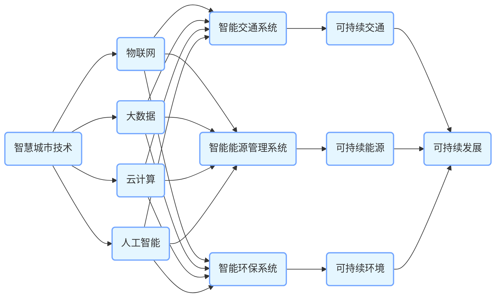

# 智慧城市技术在可持续发展中的应用与投资

> 关键词：智慧城市技术、可持续发展、应用领域、投资策略、城市治理

> 摘要：本文深入探讨了智慧城市技术在可持续发展中的应用与投资相关内容。首先介绍了智慧城市技术和可持续发展的背景，明确了研究的目的、范围、预期读者和文档结构。接着阐述了智慧城市技术的核心概念及其与可持续发展的联系，通过示意图和流程图展示其架构。详细讲解了相关核心算法原理及操作步骤，并给出Python源代码示例。同时，运用数学模型和公式对智慧城市技术的效果进行分析和举例说明。通过项目实战案例，展示了开发环境搭建、源代码实现及代码解读。探讨了智慧城市技术在多个实际场景中的应用，推荐了学习资源、开发工具框架和相关论文著作。最后总结了未来发展趋势与挑战，提供了常见问题解答和扩展阅读参考资料，旨在为推动智慧城市技术在可持续发展中的有效应用和合理投资提供全面的指导。

## 1. 背景介绍 

### 1.1 目的和范围
随着全球城市化进程的加速，城市面临着资源短缺、环境污染、交通拥堵等诸多挑战，可持续发展成为城市发展的必然要求。智慧城市技术作为解决这些问题的有效手段，通过集成信息技术、通信技术和物联网技术等，实现城市运行的智能化和高效化。本文的目的在于全面分析智慧城市技术在可持续发展中的应用领域和投资机会，为城市管理者、投资者和相关从业者提供决策参考。研究范围涵盖了智慧城市技术的各个方面，包括智能交通、智能能源、智能环保、智能建筑等领域的应用，以及相关的投资策略和市场趋势。

### 1.2 预期读者
本文的预期读者包括城市规划师、政府官员、城市管理者等，他们可以通过本文了解智慧城市技术在可持续发展中的应用，为城市规划和决策提供依据；投资者和金融机构人员可以从中获取投资机会和风险评估的信息；科研人员和技术开发者能够了解最新的技术趋势和应用案例，为技术创新提供灵感；此外，对智慧城市和可持续发展感兴趣的普通读者也可以通过本文增进对这一领域的认识。

### 1.3 文档结构概述
本文共分为十个部分。第一部分为背景介绍，阐述了研究的目的、范围、预期读者和文档结构；第二部分介绍智慧城市技术的核心概念及其与可持续发展的联系，并通过示意图和流程图展示其架构；第三部分详细讲解核心算法原理及具体操作步骤，给出Python源代码示例；第四部分运用数学模型和公式对智慧城市技术的效果进行分析和举例说明；第五部分通过项目实战案例，展示开发环境搭建、源代码实现及代码解读；第六部分探讨智慧城市技术在实际场景中的应用；第七部分推荐学习资源、开发工具框架和相关论文著作；第八部分总结未来发展趋势与挑战；第九部分为附录，提供常见问题解答；第十部分列出扩展阅读和参考资料。

### 1.4 术语表

#### 1.4.1 核心术语定义
- **智慧城市技术**：指利用信息技术、通信技术、物联网技术等，对城市的各种资源进行整合和管理，实现城市运行的智能化、高效化和可持续发展的一系列技术手段。
- **可持续发展**：指既满足当代人的需求，又不损害后代人满足其需求的能力的发展模式，强调经济、社会和环境的协调发展。
- **物联网（IoT）**：通过各种信息传感器、射频识别技术、全球定位系统等技术和装置，实时采集任何需要监控、连接、互动的物体或过程的信息，与互联网结合形成的一个巨大网络。
- **大数据**：指无法在一定时间范围内用常规软件工具进行捕捉、管理和处理的数据集合，是需要新处理模式才能具有更强的决策力、洞察发现力和流程优化能力的海量、高增长率和多样化的信息资产。

#### 1.4.2 相关概念解释
- **智能交通系统（ITS）**：将先进的信息技术、数据通信传输技术、电子传感技术、控制技术及计算机技术等有效地集成运用于整个地面交通管理系统而建立的一种在大范围内、全方位发挥作用的，实时、准确、高效的综合交通运输管理系统。
- **智能能源管理系统**：利用现代信息技术和自动化技术，对能源的生产、传输、分配和使用进行实时监测、控制和优化，以提高能源利用效率、降低能源消耗和减少环境污染的系统。
- **智能环保系统**：通过物联网、传感器、大数据等技术，对环境质量、污染源等进行实时监测和预警，实现环境管理的智能化和精准化的系统。

#### 1.4.3 缩略词列表
- **ITS**：Intelligent Transportation System（智能交通系统）
- **IoT**：Internet of Things（物联网）
- **GIS**：Geographic Information System（地理信息系统）
- **AI**：Artificial Intelligence（人工智能）

## 2. 核心概念与联系 

### 核心概念原理
智慧城市技术的核心在于通过信息技术的集成和应用，实现城市各种资源的优化配置和高效利用。其原理主要基于物联网、大数据、云计算和人工智能等技术。物联网技术实现了城市中各种设备和物体的互联互通，使得数据能够实时采集和传输；大数据技术对海量的城市数据进行存储、处理和分析，挖掘其中的有价值信息；云计算技术提供了强大的计算能力和存储空间，支持大数据的处理和应用；人工智能技术则通过机器学习、深度学习等算法，对城市数据进行智能分析和决策，实现城市运行的自动化和智能化。

可持续发展强调经济、社会和环境的协调发展，追求长期的稳定和繁荣。智慧城市技术通过提高城市的运行效率、优化资源配置、减少环境污染等方式，为可持续发展提供了技术支持。例如，智能交通系统可以减少交通拥堵，降低能源消耗和尾气排放；智能能源管理系统可以提高能源利用效率，促进可再生能源的开发和利用；智能环保系统可以实时监测环境质量，及时采取措施进行污染治理。

### 架构示意图
以下是智慧城市技术与可持续发展的架构示意图：



该示意图展示了智慧城市技术的核心组成部分（物联网、大数据、云计算和人工智能）与各个应用系统（智能交通系统、智能能源管理系统、智能环保系统）之间的关系，以及这些应用系统如何促进可持续发展的各个方面（可持续交通、可持续能源、可持续环境），最终实现城市的可持续发展。

## 3. 核心算法原理 & 具体操作步骤 

### 核心算法原理
在智慧城市技术中，许多应用都涉及到数据分析和决策，其中机器学习算法是常用的工具。以智能交通系统中的交通流量预测为例，我们可以使用时间序列分析算法，如ARIMA（Autoregressive Integrated Moving Average）模型。

ARIMA模型是一种广泛应用于时间序列预测的统计模型，它结合了自回归（AR）、差分（I）和移动平均（MA）三个部分。其基本思想是通过对历史数据的分析，建立一个数学模型来描述时间序列的变化规律，并利用该模型对未来的数值进行预测。

### Python源代码示例
以下是使用Python的`statsmodels`库实现ARIMA模型进行交通流量预测的示例代码：

```python
import pandas as pd
import numpy as np
from statsmodels.tsa.arima.model import ARIMA
import matplotlib.pyplot as plt

# 生成示例数据
np.random.seed(0)
date_rng = pd.date_range(start='2023-01-01', end='2023-12-31', freq='D')
traffic_data = np.random.randint(100, 1000, size=len(date_rng))
df = pd.DataFrame({'date': date_rng, 'traffic': traffic_data})
df.set_index('date', inplace=True)

# 划分训练集和测试集
train_size = int(len(df) * 0.8)
train_data = df[:train_size]
test_data = df[train_size:]

# 拟合ARIMA模型
p, d, q = 1, 1, 1  # ARIMA模型的参数
model = ARIMA(train_data, order=(p, d, q))
model_fit = model.fit()

# 进行预测
predictions = model_fit.predict(start=len(train_data), end=len(train_data)+len(test_data)-1, typ='levels')

# 绘制结果
plt.figure(figsize=(12, 6))
plt.plot(train_data, label='Training Data')
plt.plot(test_data, label='Actual Data')
plt.plot(predictions, label='Predicted Data')
plt.title('Traffic Flow Prediction using ARIMA')
plt.xlabel('Date')
plt.ylabel('Traffic Volume')
plt.legend()
plt.show()
```

### 具体操作步骤
1. **数据准备**：收集交通流量的历史数据，并将其整理成时间序列数据。可以使用Pandas库来处理和管理数据。
2. **数据划分**：将数据集划分为训练集和测试集，通常可以按照80:20的比例进行划分。
3. **模型选择和参数确定**：选择合适的ARIMA模型，并确定模型的参数$p$、$d$、$q$。可以使用网格搜索等方法来选择最优的参数。
4. **模型训练**：使用训练集数据对ARIMA模型进行训练，得到模型的参数估计值。
5. **模型预测**：使用训练好的模型对测试集数据进行预测，并得到预测结果。
6. **结果评估**：使用合适的评估指标（如均方误差、平均绝对误差等）对预测结果进行评估，判断模型的性能。
7. **可视化展示**：使用Matplotlib库将训练数据、实际数据和预测数据进行可视化展示，直观地观察模型的预测效果。

## 4. 数学模型和公式 & 详细讲解 & 举例说明 

### ARIMA模型的数学公式
ARIMA模型的一般形式可以表示为：

$$
(1 - \sum_{i=1}^{p} \phi_i L^i)(1 - L)^d Y_t = c + (1 + \sum_{j=1}^{q} \theta_j L^j) \epsilon_t
$$

其中：
- $Y_t$ 是时间序列在时刻 $t$ 的观测值；
- $L$ 是滞后算子，$L^i Y_t = Y_{t - i}$；
- $p$ 是自回归（AR）部分的阶数；
- $d$ 是差分的阶数；
- $q$ 是移动平均（MA）部分的阶数；
- $\phi_i$ 是自回归系数；
- $\theta_j$ 是移动平均系数；
- $c$ 是常数项；
- $\epsilon_t$ 是白噪声序列。

### 详细讲解
- **自回归（AR）部分**：表示当前时刻的观测值与过去若干时刻的观测值之间的线性关系。$p$ 阶自回归模型可以表示为：

$$
Y_t = c + \sum_{i=1}^{p} \phi_i Y_{t - i} + \epsilon_t
$$

- **差分（I）部分**：用于处理非平稳时间序列。通过对时间序列进行差分操作，将其转化为平稳时间序列。$d$ 阶差分可以表示为：

$$
\nabla^d Y_t = (1 - L)^d Y_t
$$

- **移动平均（MA）部分**：表示当前时刻的观测值与过去若干时刻的白噪声之间的线性关系。$q$ 阶移动平均模型可以表示为：

$$
Y_t = c + \epsilon_t + \sum_{j=1}^{q} \theta_j \epsilon_{t - j}
$$

### 举例说明
假设我们有一个交通流量的时间序列数据，经过分析发现该序列是非平稳的，需要进行一阶差分使其平稳。同时，通过自相关函数（ACF）和偏自相关函数（PACF）的分析，确定$p = 1$，$q = 1$。则对应的ARIMA(1, 1, 1)模型可以表示为：

$$
(1 - \phi_1 L)(1 - L) Y_t = c + (1 + \theta_1 L) \epsilon_t
$$

展开后得到：

$$
Y_t - Y_{t - 1} - \phi_1 (Y_{t - 1} - Y_{t - 2}) = c + \epsilon_t + \theta_1 \epsilon_{t - 1}
$$

通过对历史数据进行拟合，估计出模型的参数 $\phi_1$、$\theta_1$ 和 $c$，就可以使用该模型对未来的交通流量进行预测。

## 5. 项目实战：代码实际案例和详细解释说明 

### 5.1 开发环境搭建
#### 操作系统
可以选择Windows、Linux或macOS等主流操作系统。这里以Ubuntu 20.04为例进行说明。

#### Python环境
安装Python 3.8或更高版本。可以使用以下命令进行安装：

```bash
sudo apt update
sudo apt install python3 python3-pip
```

#### 相关库的安装
安装项目所需的Python库，包括`pandas`、`numpy`、`statsmodels`、`matplotlib`等。可以使用以下命令进行安装：

```bash
pip install pandas numpy statsmodels matplotlib
```

### 5.2 源代码详细实现和代码解读
以下是一个完整的智能能源管理系统的项目实战代码示例，用于预测能源消耗：

```python
import pandas as pd
import numpy as np
from sklearn.model_selection import train_test_split
from sklearn.linear_model import LinearRegression
import matplotlib.pyplot as plt

# 生成示例数据
np.random.seed(0)
date_rng = pd.date_range(start='2023-01-01', end='2023-12-31', freq='D')
temperature = np.random.uniform(10, 30, size=len(date_rng))
humidity = np.random.uniform(30, 80, size=len(date_rng))
energy_consumption = 20 + 0.5 * temperature + 0.2 * humidity + np.random.normal(0, 5, size=len(date_rng))
df = pd.DataFrame({'date': date_rng, 'temperature': temperature, 'humidity': humidity, 'energy_consumption': energy_consumption})
df.set_index('date', inplace=True)

# 划分特征和目标变量
X = df[['temperature', 'humidity']]
y = df['energy_consumption']

# 划分训练集和测试集
X_train, X_test, y_train, y_test = train_test_split(X, y, test_size=0.2, random_state=42)

# 创建线性回归模型
model = LinearRegression()

# 训练模型
model.fit(X_train, y_train)

# 进行预测
y_pred = model.predict(X_test)

# 评估模型
from sklearn.metrics import mean_squared_error, r2_score
mse = mean_squared_error(y_test, y_pred)
r2 = r2_score(y_test, y_pred)
print(f"Mean Squared Error: {mse}")
print(f"R-squared: {r2}")

# 绘制结果
plt.figure(figsize=(12, 6))
plt.scatter(y_test, y_pred)
plt.xlabel('Actual Energy Consumption')
plt.ylabel('Predicted Energy Consumption')
plt.title('Energy Consumption Prediction using Linear Regression')
plt.show()
```

### 代码解读与分析
1. **数据生成**：使用`numpy`和`pandas`库生成示例数据，包括日期、温度、湿度和能源消耗。假设能源消耗与温度和湿度之间存在线性关系，并添加了一定的随机噪声。
2. **数据预处理**：将日期作为索引，提取特征变量（温度和湿度）和目标变量（能源消耗）。使用`train_test_split`函数将数据集划分为训练集和测试集。
3. **模型创建和训练**：创建一个线性回归模型，并使用训练集数据对模型进行训练。
4. **模型预测和评估**：使用训练好的模型对测试集数据进行预测，并计算均方误差（MSE）和决定系数（$R^2$）来评估模型的性能。
5. **结果可视化**：使用`matplotlib`库绘制实际能源消耗和预测能源消耗的散点图，直观地观察模型的预测效果。

通过这个项目实战，我们可以看到如何使用线性回归模型对能源消耗进行预测，为智能能源管理系统提供决策支持。

## 6. 实际应用场景 
### 智能交通
- **交通流量监测与优化**：通过在道路上安装传感器和摄像头，实时监测交通流量、车速等信息。利用这些数据，智能交通系统可以对交通信号灯进行实时调整，优化交通信号配时，减少交通拥堵。例如，在高峰时段，根据实时交通流量动态调整信号灯的时长，使车辆能够更顺畅地通过路口。
- **智能停车管理**：利用物联网技术，在停车场安装车位传感器，实时监测车位的占用情况。通过手机应用或电子显示屏，向驾驶员提供停车场的位置、空余车位数量等信息，引导驾驶员快速找到停车位，减少寻找车位的时间和交通拥堵。
- **公共交通优化**：通过实时监测公交车、地铁等公共交通工具的位置和运行状态，为乘客提供准确的实时公交信息。同时，根据客流量的变化，动态调整公交线路和班次，提高公共交通的运营效率。

### 智能能源
- **能源生产与分配优化**：在能源生产方面，利用智能传感器和控制系统，实时监测太阳能板、风力发电机等可再生能源设备的运行状态和发电效率，根据天气条件和能源需求，优化能源生产计划。在能源分配方面，通过智能电网技术，实现对电力的实时监测和调配，提高能源传输和分配的效率。
- **建筑能源管理**：在建筑物中安装智能能源管理系统，实时监测建筑物的能源消耗情况，包括电力、水、天然气等。通过对空调、照明等设备的智能控制，根据室内外环境条件和人员活动情况，自动调节设备的运行状态，降低能源消耗。
- **分布式能源系统**：鼓励用户安装分布式能源设备，如太阳能热水器、小型风力发电机等。通过智能能源管理系统，将分布式能源设备与电网进行连接，实现能源的双向流动和优化配置。当分布式能源设备产生的能源过剩时，可以将多余的能源出售给电网；当能源不足时，可以从电网购买能源。

### 智能环保
- **环境质量监测**：在城市中部署大量的环境监测传感器，实时监测空气质量、水质、噪声等环境指标。通过物联网技术，将监测数据实时传输到环保部门的监测中心，环保部门可以及时掌握环境质量状况，采取相应的措施进行污染治理。
- **污染源监控**：对工业企业、污水处理厂等污染源进行实时监控，通过安装传感器和监控设备，实时监测污染物的排放情况。一旦发现污染物排放超标，系统会自动发出警报，并通知相关部门进行处理。
- **垃圾分类与回收**：利用智能垃圾桶和物联网技术，实现对垃圾分类和回收的智能化管理。智能垃圾桶可以实时监测垃圾桶的装满程度，当垃圾桶快满时，自动通知垃圾清运车进行清理。同时，通过对垃圾分类的识别和记录，鼓励居民进行正确的垃圾分类，提高垃圾回收利用率。

### 智能建筑
- **建筑自动化控制**：在建筑物中安装智能控制系统，实现对建筑物的照明、空调、电梯等设备的自动化控制。通过传感器和编程逻辑，根据室内外环境条件和人员活动情况，自动调节设备的运行状态，提高建筑物的能源利用效率和舒适度。
- **建筑安全管理**：利用视频监控、门禁系统、火灾报警等技术，实现对建筑物的安全管理。通过智能分析算法，对监控视频进行实时分析，及时发现异常行为和安全隐患，并发出警报。
- **建筑设施管理**：通过物联网技术，对建筑物的设施设备进行实时监测和管理。例如，对电梯的运行状态、维护记录等进行实时监控，及时发现设备故障并进行维修，提高建筑物的设施管理效率。

## 7. 工具和资源推荐

### 7.1 学习资源推荐

#### 7.1.1 书籍推荐
- 《智慧城市：大数据、互联网时代的城市治理新理念》：本书介绍了智慧城市的概念、技术和应用，探讨了大数据、互联网等技术在城市治理中的应用和挑战。
- 《物联网：技术、应用与创新》：全面介绍了物联网的技术原理、应用场景和发展趋势，对于理解智慧城市中的物联网技术有很大帮助。
- 《人工智能：一种现代方法》：经典的人工智能教材，涵盖了人工智能的各个领域，包括机器学习、深度学习等，对于学习智慧城市中的智能算法有重要参考价值。

#### 7.1.2 在线课程
- Coursera上的“智慧城市技术与应用”课程：由知名高校的教授授课，系统介绍了智慧城市的技术体系和应用案例。
- edX上的“物联网基础”课程：讲解了物联网的基本概念、技术原理和应用开发，适合初学者学习。
- Udemy上的“Python数据分析实战”课程：通过实际案例，教授如何使用Python进行数据分析和处理，对于智慧城市中的数据处理和分析非常有用。

#### 7.1.3 技术博客和网站
- 开源中国（oschina.net）：提供了丰富的开源技术资源和技术文章，包括智慧城市、物联网、大数据等领域的最新动态和技术分享。
- InfoQ（infoq.cn）：关注软件开发和技术创新，有很多关于智慧城市技术的深度报道和分析文章。
- 物联网智库（iot101.com）：专注于物联网领域的资讯和研究，提供了大量的物联网应用案例和技术分析。

### 7.2 开发工具框架推荐

#### 7.2.1 IDE和编辑器
- PyCharm：专业的Python集成开发环境，具有代码编辑、调试、版本控制等功能，适合开发智慧城市相关的Python项目。
- Visual Studio Code：轻量级的代码编辑器，支持多种编程语言和插件扩展，可用于开发各种类型的智慧城市应用。
- Eclipse：开源的集成开发环境，广泛应用于Java开发，对于开发基于Java的智慧城市系统非常方便。

#### 7.2.2 调试和性能分析工具
- Py-Spy：用于Python代码的性能分析工具，可以实时监测Python程序的CPU使用情况和函数调用时间，帮助开发者找出性能瓶颈。
- VisualVM：Java虚拟机的性能分析工具，可用于分析Java应用程序的内存使用、线程状态等，对于优化智慧城市中的Java系统性能非常有用。
- Wireshark：网络协议分析工具，可以捕获和分析网络数据包，帮助开发者调试和优化智慧城市中的网络通信。

#### 7.2.3 相关框架和库
- Django：Python的Web开发框架，具有高效、安全、易用等特点，适合开发智慧城市中的Web应用系统。
- Spring Boot：Java的开发框架，简化了Java应用的开发过程，可用于构建智慧城市中的后端服务。
- TensorFlow：开源的机器学习框架，提供了丰富的机器学习算法和工具，可用于智慧城市中的智能分析和决策。

### 7.3 相关论文著作推荐

#### 7.3.1 经典论文
- 《The Digital City: A New Urban Development Paradigm》：提出了数字城市的概念和发展模式，对智慧城市的发展产生了重要影响。
- 《Smart Cities: A Systematic Literature Review》：对智慧城市的相关研究进行了系统的综述，分析了智慧城市的定义、特征和发展趋势。
- 《Internet of Things: A Survey》：全面介绍了物联网的概念、技术和应用，是物联网领域的经典论文之一。

#### 7.3.2 最新研究成果
- 可以通过IEEE Xplore、ACM Digital Library等学术数据库，搜索关于智慧城市技术、可持续发展等方面的最新研究论文，了解该领域的前沿动态和研究成果。

#### 7.3.3 应用案例分析
- 《Smart City Case Studies: Best Practices from Around the World》：收集了全球各地的智慧城市应用案例，分析了不同城市在智慧城市建设中的成功经验和挑战。
- 《Sustainable Urban Development through Smart City Initiatives》：探讨了智慧城市技术在可持续城市发展中的应用案例和实践经验。

## 8. 总结：未来发展趋势与挑战 

### 未来发展趋势
- **技术融合与创新**：未来，智慧城市技术将不断融合物联网、大数据、云计算、人工智能、区块链等新兴技术，实现更高效、更智能的城市管理和服务。例如，区块链技术可以用于保障智慧城市数据的安全和可信，人工智能技术可以进一步提升城市的智能决策能力。
- **绿色可持续发展**：随着全球对可持续发展的关注度不断提高，智慧城市将更加注重绿色环保和能源效率。未来的智慧城市将广泛应用可再生能源，推广绿色建筑和低碳交通，实现城市的可持续发展目标。
- **以人为本的城市建设**：智慧城市的发展将更加注重人的需求和体验，提供更加便捷、高效、个性化的城市服务。例如，通过智能医疗系统，实现远程医疗和健康管理；通过智能教育系统，提供个性化的学习服务。
- **城市间的协同发展**：未来的智慧城市将不再是孤立的个体，而是通过互联网和通信技术实现城市间的协同发展。城市之间可以共享数据和资源，共同应对城市发展中的挑战，实现区域的一体化发展。

### 挑战
- **数据安全与隐私保护**：智慧城市中涉及大量的个人数据和敏感信息，如居民的健康数据、出行数据等。如何保障数据的安全和隐私，防止数据泄露和滥用，是智慧城市发展面临的重要挑战。
- **技术标准和规范不统一**：目前，智慧城市技术的标准和规范还不够统一，不同厂商的产品和系统之间存在兼容性问题。这给智慧城市的建设和集成带来了困难，需要加强技术标准和规范的制定和推广。
- **投资成本和经济效益**：智慧城市的建设需要大量的投资，包括硬件设备的采购、软件系统的开发、网络基础设施的建设等。如何在保证智慧城市建设质量的前提下，降低投资成本，提高经济效益，是需要解决的问题。
- **公众参与和接受度**：智慧城市的发展需要公众的积极参与和支持。然而，部分公众对智慧城市技术的了解和认识不足，存在对新技术的担忧和抵触情绪。如何提高公众的参与度和接受度，是智慧城市建设面临的挑战之一。

## 9. 附录：常见问题与解答 

### 1. 智慧城市技术的实施对城市的经济发展有哪些影响？
智慧城市技术的实施可以促进城市的经济发展。一方面，通过提高城市的运行效率和管理水平，降低企业的运营成本，吸引更多的企业入驻城市，促进产业升级和创新发展。另一方面，智慧城市技术的发展也会带动相关产业的兴起，如物联网、大数据、人工智能等产业，创造更多的就业机会和经济增长点。

### 2. 如何保障智慧城市中的数据安全和隐私？
保障智慧城市中的数据安全和隐私需要从多个方面入手。首先，要建立完善的数据安全管理制度，加强对数据的访问控制和加密处理。其次，要采用先进的技术手段，如区块链技术、数据脱敏技术等，保障数据的安全和可信。此外，还要加强对数据使用的监管，明确数据使用的目的和范围，防止数据的滥用和泄露。

### 3. 智慧城市建设需要哪些方面的人才？
智慧城市建设需要多方面的人才，包括信息技术人才、城市规划人才、管理人才等。信息技术人才负责智慧城市技术的研发和应用，如物联网工程师、大数据分析师、人工智能专家等；城市规划人才负责城市的整体规划和设计，确保智慧城市的建设符合城市的发展需求；管理人才负责智慧城市的运营和管理，协调各部门之间的工作，推动智慧城市的建设和发展。

### 4. 智慧城市技术在农村地区是否也有应用前景？
智慧城市技术在农村地区也有广阔的应用前景。例如，通过智能农业技术，实现农业生产的自动化和智能化，提高农业生产效率和质量；通过智能医疗系统，为农村居民提供远程医疗服务，解决农村医疗资源不足的问题；通过智能交通系统，改善农村的交通状况，促进农村经济的发展。

## 10. 扩展阅读 & 参考资料 
### 扩展阅读
- 《数字孪生城市：理论、技术与应用》：介绍了数字孪生城市的概念、技术和应用，为智慧城市的建设提供了新的思路和方法。
- 《智能交通系统：原理、技术与应用》：深入讲解了智能交通系统的原理、技术和应用案例，对于理解智慧城市中的智能交通技术有很大帮助。
- 《能源互联网：概念、技术与应用》：探讨了能源互联网的概念、技术和发展趋势，对于了解智慧城市中的智能能源管理系统有重要参考价值。

### 参考资料
- 中华人民共和国住房和城乡建设部. 智慧城市建设指南. [R]. 2014.
- 国际电信联盟（ITU）. 智慧城市发展报告. [R]. 2020.
- IEEE. IEEE Standards for Smart Cities. [S]. 2021.

通过以上的文章，我们全面探讨了智慧城市技术在可持续发展中的应用与投资，从技术原理、实际应用到未来趋势和挑战，为相关领域的从业者和研究者提供了有价值的参考。希望本文能够促进智慧城市技术的发展和应用，推动城市的可持续发展。 