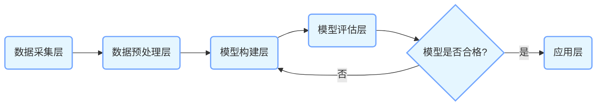

# 智能个人信贷评分卡优化

> 关键词：智能信贷、评分卡优化、信用评估、机器学习、风险预测

> 摘要：本文聚焦于智能个人信贷评分卡的优化问题。在金融信贷领域，个人信贷评分卡是评估借款人信用风险的重要工具。随着大数据、人工智能等技术的发展，传统评分卡面临着诸多挑战，也迎来了优化升级的机遇。文章将深入探讨智能个人信贷评分卡的核心概念、算法原理、数学模型，通过项目实战展示优化的具体实现过程，分析其实际应用场景，推荐相关工具和资源，并对未来发展趋势与挑战进行总结，旨在为金融机构和相关从业者提供全面、深入的技术指导，以提升信贷风险评估的准确性和效率。

## 1. 背景介绍 
### 1.1 目的和范围
个人信贷业务在金融市场中占据着重要地位，准确评估借款人的信用风险对于金融机构的稳健运营至关重要。传统的信贷评分卡模型虽然在一定程度上能够评估风险，但随着金融环境的变化和数据量的爆炸式增长，其局限性逐渐显现。本文章的目的在于探讨如何利用先进的技术手段对智能个人信贷评分卡进行优化，提高信用评估的准确性和效率，降低信贷风险。

本文的范围涵盖了智能个人信贷评分卡的核心概念、算法原理、数学模型、项目实战、实际应用场景等方面，旨在为读者提供全面、系统的知识体系，帮助其深入理解和掌握智能个人信贷评分卡优化的技术和方法。

### 1.2 预期读者
本文预期读者包括金融机构的信贷风险管理人员、数据分析师、算法工程师，以及对金融科技、人工智能等领域感兴趣的研究人员和学生。希望通过本文的介绍，能够为不同层次的读者提供有价值的参考和指导。

### 1.3 文档结构概述
本文将按照以下结构进行阐述：首先介绍智能个人信贷评分卡的背景知识，包括目的、范围、预期读者等；接着深入探讨其核心概念与联系，通过文本示意图和 Mermaid 流程图进行清晰展示；然后详细讲解核心算法原理和具体操作步骤，并使用 Python 源代码进行阐述；随后介绍相关的数学模型和公式，并举例说明；通过项目实战展示优化的具体实现过程，包括开发环境搭建、源代码实现和代码解读；分析智能个人信贷评分卡的实际应用场景；推荐相关的工具和资源；最后对未来发展趋势与挑战进行总结，并提供常见问题与解答和扩展阅读参考资料。

### 1.4 术语表
#### 1.4.1 核心术语定义
- **信贷评分卡**：一种用于评估借款人信用风险的工具，通过对借款人的各种信息进行量化分析，得出一个信用评分，以此来判断借款人的信用状况和违约可能性。
- **智能信贷**：利用大数据、人工智能等技术，对信贷业务进行智能化处理，包括风险评估、贷款审批、贷后管理等环节，提高信贷业务的效率和准确性。
- **信用评估**：对借款人的信用状况进行综合评价，包括借款人的还款能力、还款意愿、信用历史等方面，以确定其信用风险水平。
- **风险预测**：根据借款人的相关信息和历史数据，预测其未来发生违约的可能性，为金融机构的信贷决策提供依据。

#### 1.4.2 相关概念解释
- **大数据**：指海量、高增长率和多样化的信息资产，在信贷领域，大数据可以包括借款人的基本信息、交易记录、社交网络数据等，为信用评估提供更全面的信息。
- **机器学习**：一门多领域交叉学科，涉及概率论、统计学、逼近论、凸分析、算法复杂度理论等多门学科。它专门研究计算机怎样模拟或实现人类的学习行为，以获取新的知识或技能，重新组织已有的知识结构使之不断改善自身的性能。在信贷评分卡优化中，机器学习算法可以用于挖掘数据中的潜在规律，提高风险预测的准确性。
- **人工智能**：它是研究、开发用于模拟、延伸和扩展人的智能的理论、方法、技术及应用系统的一门新的技术科学。智能信贷评分卡是人工智能在金融领域的重要应用之一。

#### 1.4.3 缩略词列表
- **API**：Application Programming Interface，应用程序编程接口
- **ML**：Machine Learning，机器学习
- **AI**：Artificial Intelligence，人工智能
- **KPI**：Key Performance Indicator，关键绩效指标

## 2. 核心概念与联系 

### 核心概念原理
智能个人信贷评分卡的核心原理是通过对借款人的各种信息进行收集、整理和分析，构建一个数学模型，将借款人的信用状况量化为一个具体的分数。这个分数可以直观地反映借款人的信用风险水平，金融机构可以根据这个分数来决定是否给予贷款以及贷款的额度和利率等。

传统的信贷评分卡主要基于借款人的基本信息、信用历史等有限的数据进行评估，而智能个人信贷评分卡则充分利用大数据和人工智能技术，整合更多维度的数据，如社交网络数据、消费行为数据等，以更全面、准确地评估借款人的信用风险。

### 架构的文本示意图
智能个人信贷评分卡的架构主要包括数据采集层、数据预处理层、模型构建层、模型评估层和应用层。

- **数据采集层**：负责收集借款人的各种信息，包括基本信息、信用历史、交易记录、社交网络数据等。这些数据来源广泛，可以是金融机构内部的数据库，也可以是外部的数据提供商。
- **数据预处理层**：对采集到的数据进行清洗、转换和特征工程等处理，去除噪声数据，将数据转换为适合模型训练的格式，并提取有价值的特征。
- **模型构建层**：选择合适的机器学习算法，如逻辑回归、决策树、随机森林等，对预处理后的数据进行训练，构建信用评分模型。
- **模型评估层**：使用评估指标，如准确率、召回率、F1 值等，对构建的模型进行评估，以确定模型的性能和可靠性。
- **应用层**：将训练好的模型应用到实际的信贷业务中，为金融机构的信贷决策提供支持。

### Mermaid 流程图


## 3. 核心算法原理 & 具体操作步骤 

### 核心算法原理
在智能个人信贷评分卡优化中，常用的机器学习算法包括逻辑回归、决策树、随机森林等。下面以逻辑回归算法为例进行详细讲解。

逻辑回归是一种广泛应用于分类问题的统计学习方法，它通过对输入特征进行线性组合，然后使用逻辑函数将其转换为概率值，以此来进行分类预测。逻辑函数的表达式为：

$$
\sigma(z)=\frac{1}{1 + e^{-z}}
$$

其中，$z$ 是输入特征的线性组合，即：

$$
z = w_0 + w_1x_1 + w_2x_2 + \cdots + w_nx_n
$$

$w_i$ 是模型的权重参数，$x_i$ 是输入特征。

逻辑回归的目标是找到一组最优的权重参数 $w$，使得模型对训练数据的预测结果与真实标签之间的误差最小。通常使用最大似然估计来求解这个优化问题，即最大化似然函数：

$$
L(w)=\prod_{i=1}^{N}P(y_i|x_i;w)
$$

其中，$N$ 是训练数据的样本数，$y_i$ 是第 $i$ 个样本的真实标签，$x_i$ 是第 $i$ 个样本的输入特征。

为了方便计算，通常对似然函数取对数，得到对数似然函数：

$$
\ell(w)=\log L(w)=\sum_{i=1}^{N}\log P(y_i|x_i;w)
$$

然后使用梯度下降等优化算法来求解对数似然函数的最大值，得到最优的权重参数 $w$。

### 具体操作步骤

#### 步骤 1：数据准备
首先需要收集和整理借款人的相关数据，包括基本信息、信用历史、交易记录等。然后将数据划分为训练集和测试集，通常按照 70%:30% 或 80%:20% 的比例进行划分。

#### 步骤 2：数据预处理
对数据进行清洗，去除缺失值、异常值等噪声数据。然后进行特征工程，包括特征选择、特征编码、特征缩放等操作，以提高模型的性能。

#### 步骤 3：模型训练
使用训练集数据对逻辑回归模型进行训练，通过不断调整模型的权重参数，使得对数似然函数的值最大。

#### 步骤 4：模型评估
使用测试集数据对训练好的模型进行评估，计算准确率、召回率、F1 值等评估指标，以确定模型的性能和可靠性。

#### 步骤 5：模型优化
根据模型评估的结果，对模型进行优化，如调整模型的参数、选择更合适的特征等，以提高模型的性能。

### Python 源代码实现
```python
import pandas as pd
from sklearn.model_selection import train_test_split
from sklearn.linear_model import LogisticRegression
from sklearn.preprocessing import StandardScaler
from sklearn.metrics import accuracy_score, recall_score, f1_score

# 步骤 1：数据准备
# 假设数据存储在 CSV 文件中
data = pd.read_csv('credit_data.csv')
# 分离特征和标签
X = data.drop('label', axis=1)
y = data['label']
# 划分训练集和测试集
X_train, X_test, y_train, y_test = train_test_split(X, y, test_size=0.3, random_state=42)

# 步骤 2：数据预处理
# 特征缩放
scaler = StandardScaler()
X_train_scaled = scaler.fit_transform(X_train)
X_test_scaled = scaler.transform(X_test)

# 步骤 3：模型训练
model = LogisticRegression()
model.fit(X_train_scaled, y_train)

# 步骤 4：模型评估
y_pred = model.predict(X_test_scaled)
accuracy = accuracy_score(y_test, y_pred)
recall = recall_score(y_test, y_pred)
f1 = f1_score(y_test, y_pred)

print(f'Accuracy: {accuracy}')
print(f'Recall: {recall}')
print(f'F1 Score: {f1}')

# 步骤 5：模型优化
# 可以尝试调整模型的参数，如 C 值
model = LogisticRegression(C=0.1)
model.fit(X_train_scaled, y_train)
y_pred = model.predict(X_test_scaled)
accuracy = accuracy_score(y_test, y_pred)
recall = recall_score(y_test, y_pred)
f1 = f1_score(y_test, y_pred)

print(f'Optimized Accuracy: {accuracy}')
print(f'Optimized Recall: {recall}')
print(f'Optimized F1 Score: {f1}')
```

## 4. 数学模型和公式 & 详细讲解 & 举例说明 

### 逻辑回归的数学模型和公式
如前面所述，逻辑回归的核心是逻辑函数和对数似然函数。下面对这些公式进行详细讲解。

#### 逻辑函数
逻辑函数 $\sigma(z)=\frac{1}{1 + e^{-z}}$ 是一个 S 形曲线，其取值范围在 $(0, 1)$ 之间。当 $z$ 趋近于正无穷时，$\sigma(z)$ 趋近于 1；当 $z$ 趋近于负无穷时，$\sigma(z)$ 趋近于 0。逻辑函数的作用是将输入特征的线性组合 $z$ 转换为一个概率值，表示样本属于正类的概率。

#### 对数似然函数
对数似然函数 $\ell(w)=\sum_{i=1}^{N}\log P(y_i|x_i;w)$ 是逻辑回归的目标函数，其目的是最大化训练数据的似然概率。对于二分类问题，$P(y_i|x_i;w)$ 可以表示为：

$$
P(y_i|x_i;w)=\begin{cases}
\sigma(z_i) & \text{if } y_i = 1 \\
1 - \sigma(z_i) & \text{if } y_i = 0
\end{cases}
$$

将其代入对数似然函数中，得到：

$$
\ell(w)=\sum_{i=1}^{N}[y_i\log\sigma(z_i)+(1 - y_i)\log(1 - \sigma(z_i))]
$$

### 详细讲解
逻辑回归的目标是找到一组最优的权重参数 $w$，使得对数似然函数 $\ell(w)$ 取得最大值。通常使用梯度下降算法来求解这个优化问题。梯度下降算法的基本思想是沿着对数似然函数的负梯度方向不断更新权重参数 $w$，直到达到局部最优解。

对数似然函数的梯度可以表示为：

$$
\nabla\ell(w)=\sum_{i=1}^{N}(y_i - \sigma(z_i))x_i
$$

梯度下降算法的更新公式为：

$$
w_{t+1}=w_t+\alpha\nabla\ell(w_t)
$$

其中，$w_t$ 是第 $t$ 次迭代的权重参数，$\alpha$ 是学习率，控制每次更新的步长。

### 举例说明
假设我们有一个简单的二分类问题，输入特征 $x$ 是一个一维向量，标签 $y$ 是 0 或 1。训练数据如下：

| $x$ | $y$ |
| --- | --- |
| 1 | 1 |
| 2 | 1 |
| 3 | 0 |
| 4 | 0 |

我们可以使用逻辑回归模型来对这个问题进行分类预测。首先，我们需要初始化权重参数 $w_0$ 和 $w_1$，假设初始值为 $w_0 = 0$，$w_1 = 0$。然后，我们可以使用梯度下降算法来更新权重参数，直到对数似然函数收敛。

下面是使用 Python 实现的代码：

```python
import numpy as np

# 训练数据
X = np.array([[1], [2], [3], [4]])
y = np.array([1, 1, 0, 0])

# 初始化权重参数
w0 = 0
w1 = 0

# 学习率
alpha = 0.1

# 迭代次数
num_iterations = 1000

for i in range(num_iterations):
    # 计算线性组合
    z = w0 + w1 * X.flatten()
    # 计算逻辑函数值
    sigma_z = 1 / (1 + np.exp(-z))
    # 计算梯度
    dw0 = np.sum(y - sigma_z)
    dw1 = np.sum((y - sigma_z) * X.flatten())
    # 更新权重参数
    w0 += alpha * dw0
    w1 += alpha * dw1

print(f'w0: {w0}')
print(f'w1: {w1}')
```

运行上述代码后，我们可以得到最优的权重参数 $w_0$ 和 $w_1$，从而构建出逻辑回归模型。

## 5. 项目实战：代码实际案例和详细解释说明 

### 5.1  开发环境搭建
#### 操作系统
本项目可以在 Windows、Linux 或 macOS 等操作系统上进行开发。建议使用 Linux 或 macOS 系统，因为它们对 Python 开发环境的支持更好。

#### Python 环境
安装 Python 3.7 或以上版本。可以从 Python 官方网站（https://www.python.org/downloads/） 下载安装包进行安装。

#### 虚拟环境
为了避免不同项目之间的依赖冲突，建议使用虚拟环境。可以使用 `venv` 或 `conda` 来创建虚拟环境。以下是使用 `venv` 创建虚拟环境的示例：

```bash
python -m venv credit_score_venv
source credit_score_venv/bin/activate  # 在 Windows 上使用 `credit_score_venv\Scripts\activate`
```

#### 安装依赖库
在虚拟环境中安装所需的依赖库，包括 `pandas`、`numpy`、`scikit-learn` 等。可以使用 `pip` 进行安装：

```bash
pip install pandas numpy scikit-learn
```

### 5.2  源代码详细实现和代码解读
#### 数据加载和预处理
```python
import pandas as pd
from sklearn.model_selection import train_test_split
from sklearn.preprocessing import StandardScaler

# 加载数据
data = pd.read_csv('credit_data.csv')

# 分离特征和标签
X = data.drop('label', axis=1)
y = data['label']

# 划分训练集和测试集
X_train, X_test, y_train, y_test = train_test_split(X, y, test_size=0.3, random_state=42)

# 特征缩放
scaler = StandardScaler()
X_train_scaled = scaler.fit_transform(X_train)
X_test_scaled = scaler.transform(X_test)
```
代码解读：
- 使用 `pandas` 库的 `read_csv` 函数加载存储在 CSV 文件中的数据。
- 使用 `drop` 方法分离特征和标签。
- 使用 `train_test_split` 函数将数据划分为训练集和测试集，测试集占比为 30%。
- 使用 `StandardScaler` 对特征进行缩放，将特征值转换为均值为 0，标准差为 1 的标准正态分布。

#### 模型训练和评估
```python
from sklearn.linear_model import LogisticRegression
from sklearn.metrics import accuracy_score, recall_score, f1_score

# 模型训练
model = LogisticRegression()
model.fit(X_train_scaled, y_train)

# 模型预测
y_pred = model.predict(X_test_scaled)

# 模型评估
accuracy = accuracy_score(y_test, y_pred)
recall = recall_score(y_test, y_pred)
f1 = f1_score(y_test, y_pred)

print(f'Accuracy: {accuracy}')
print(f'Recall: {recall}')
print(f'F1 Score: {f1}')
```
代码解读：
- 使用 `LogisticRegression` 类创建逻辑回归模型。
- 使用 `fit` 方法对模型进行训练。
- 使用 `predict` 方法对测试集进行预测。
- 使用 `accuracy_score`、`recall_score` 和 `f1_score` 函数计算模型的准确率、召回率和 F1 值。

### 5.3  代码解读与分析
#### 特征缩放的作用
特征缩放可以将不同尺度的特征转换为相同的尺度，避免某些特征因为数值较大而对模型产生过大的影响。在逻辑回归中，特征缩放可以加快梯度下降算法的收敛速度，提高模型的训练效率。

#### 模型评估指标的选择
准确率、召回率和 F1 值是常用的分类模型评估指标。准确率表示模型预测正确的样本数占总样本数的比例；召回率表示模型正确预测的正类样本数占实际正类样本数的比例；F1 值是准确率和召回率的调和平均数，综合考虑了准确率和召回率。在实际应用中，需要根据具体的业务需求选择合适的评估指标。

#### 模型优化的方向
如果模型的性能不理想，可以从以下几个方面进行优化：
- **特征工程**：选择更有价值的特征，进行特征组合和变换，提高特征的质量。
- **模型选择**：尝试不同的机器学习算法，如决策树、随机森林、支持向量机等，选择最适合数据集的模型。
- **参数调优**：调整模型的参数，如逻辑回归的 C 值、决策树的最大深度等，以提高模型的性能。

## 6. 实际应用场景 
### 金融机构的信贷审批
金融机构在进行信贷审批时，可以使用智能个人信贷评分卡对借款人的信用风险进行评估。根据评分卡的分数，金融机构可以决定是否给予贷款以及贷款的额度和利率等。例如，对于信用评分较高的借款人，可以给予较高的贷款额度和较低的利率；对于信用评分较低的借款人，可以拒绝贷款申请或要求提供更多的担保措施。

### 风险预警和监控
智能个人信贷评分卡可以实时监控借款人的信用状况，当借款人的信用评分发生变化时，及时发出风险预警。金融机构可以根据风险预警信息，采取相应的措施，如调整贷款额度、加强贷后管理等，以降低信贷风险。

### 市场营销和客户细分
金融机构可以根据智能个人信贷评分卡的分数对客户进行细分，针对不同信用等级的客户制定不同的营销策略。例如，对于信用评分较高的客户，可以推出一些高端的金融产品和服务；对于信用评分较低的客户，可以提供一些信用修复和培训服务，帮助他们提高信用水平。

### 金融监管
金融监管机构可以使用智能个人信贷评分卡对金融机构的信贷业务进行监管，评估金融机构的信贷风险水平。通过对金融机构的信贷数据进行分析和监测，监管机构可以及时发现潜在的风险问题，采取相应的监管措施，维护金融市场的稳定。

## 7. 工具和资源推荐
### 7.1 学习资源推荐
#### 7.1.1 书籍推荐
- 《Python 机器学习》：本书详细介绍了 Python 在机器学习领域的应用，包括数据预处理、模型选择、模型评估等方面的知识，是学习机器学习的经典书籍之一。
- 《信用评分卡研究与应用》：本书系统地介绍了信用评分卡的原理、方法和应用，对于深入理解个人信贷评分卡具有重要的参考价值。
- 《统计学习方法》：本书全面介绍了统计学习的基本概念、理论和方法，是学习机器学习和数据挖掘的经典教材。

#### 7.1.2 在线课程
- Coursera 上的“Machine Learning”课程：由斯坦福大学的 Andrew Ng 教授授课，是全球最受欢迎的机器学习课程之一，课程内容全面，讲解详细。
- edX 上的“Data Science MicroMasters Program”课程：该课程涵盖了数据科学的各个方面，包括数据预处理、机器学习、深度学习等，对于提升数据科学能力具有很大的帮助。
- 中国大学 MOOC 上的“Python 数据分析与挖掘实战”课程：该课程结合实际案例，介绍了 Python 在数据分析和挖掘领域的应用，适合初学者学习。

#### 7.1.3 技术博客和网站
- Kaggle：全球最大的数据科学竞赛平台，上面有很多关于机器学习和数据分析的优秀案例和代码，可以学习到很多实用的技巧和方法。
- Medium：一个技术博客平台，上面有很多关于人工智能、机器学习等领域的优质文章，可以了解到最新的技术动态和研究成果。
- 博客园：国内知名的技术博客网站，上面有很多关于 Python 编程、机器学习等方面的技术文章，可以学习到很多实用的知识和经验。

### 7.2 开发工具框架推荐
#### 7.2.1 IDE和编辑器
- PyCharm：一款专业的 Python 集成开发环境，具有代码自动补全、调试、版本控制等功能，适合大型项目的开发。
- Jupyter Notebook：一种交互式的开发环境，可以实时运行代码、显示结果和可视化数据，适合数据分析和机器学习的实验和演示。
- Visual Studio Code：一款轻量级的代码编辑器，支持多种编程语言，具有丰富的插件和扩展功能，适合快速开发和调试。

#### 7.2.2 调试和性能分析工具
- pdb：Python 自带的调试工具，可以在代码中设置断点，逐步执行代码，查看变量的值和程序的执行流程。
- cProfile：Python 自带的性能分析工具，可以统计代码的运行时间和函数调用次数，帮助我们找出性能瓶颈。
- Py-Spy：一个用于分析 Python 程序性能的工具，可以实时查看 Python 程序的 CPU 使用率和函数调用情况，帮助我们优化代码性能。

#### 7.2.3 相关框架和库
- scikit-learn：一个简单易用的机器学习库，提供了丰富的机器学习算法和工具，包括分类、回归、聚类等，适合初学者学习和使用。
- TensorFlow：一个开源的深度学习框架，由 Google 开发，具有高效的计算性能和丰富的工具集，适合开发大规模的深度学习模型。
- PyTorch：一个开源的深度学习框架，由 Facebook 开发，具有动态图和易于调试的特点，适合快速迭代和实验。

### 7.3 相关论文著作推荐
#### 7.3.1 经典论文
- “Logistic Regression: A Self-learning Text”：该论文详细介绍了逻辑回归的原理、方法和应用，是学习逻辑回归的经典论文之一。
- “Random Forests”：该论文提出了随机森林算法，是机器学习领域的经典论文之一，随机森林算法在分类和回归问题中都有很好的表现。
- “Gradient Boosting Machines, a Tutorial”：该论文详细介绍了梯度提升机算法的原理、方法和应用，是学习梯度提升机算法的重要参考资料。

#### 7.3.2 最新研究成果
- 在顶级学术会议如 NeurIPS、ICML、KDD 等上发表的关于信用风险评估、机器学习优化等方面的最新研究论文，可以了解到该领域的最新技术和发展趋势。
- 在金融领域的顶级期刊如《Journal of Financial Economics》、《Review of Financial Studies》等上发表的关于个人信贷评分卡优化的研究论文，可以了解到该领域的最新理论和实践成果。

#### 7.3.3 应用案例分析
- 一些金融机构和科技公司发布的关于智能个人信贷评分卡应用案例的白皮书和报告，可以了解到实际应用中的经验和教训，为自己的项目提供参考。

## 8. 总结：未来发展趋势与挑战
### 未来发展趋势
#### 融合多源数据
未来的智能个人信贷评分卡将融合更多维度的多源数据，如社交媒体数据、物联网数据等。通过挖掘这些数据中的潜在信息，可以更全面、准确地评估借款人的信用风险。例如，社交媒体数据可以反映借款人的社交圈子、消费习惯和兴趣爱好等，物联网数据可以反映借款人的设备使用情况和行为模式等，这些信息都可以为信用评估提供有价值的参考。

#### 深度学习的应用
深度学习具有强大的特征学习能力，可以自动从大量数据中提取复杂的特征。未来，深度学习算法将在智能个人信贷评分卡中得到更广泛的应用，如使用卷积神经网络（CNN）处理图像数据、使用循环神经网络（RNN）处理序列数据等。通过深度学习算法，可以提高信用评估的准确性和效率。

#### 可解释性人工智能
随着人工智能技术在金融领域的广泛应用，可解释性成为了一个重要的问题。未来的智能个人信贷评分卡需要具备良好的可解释性，以便金融机构和监管机构能够理解模型的决策过程和依据。例如，使用局部可解释模型（LIME）、SHAP 值等方法来解释模型的预测结果，提高模型的透明度和可信度。

#### 实时动态评估
传统的信贷评分卡通常是基于历史数据进行评估，无法实时反映借款人的信用状况变化。未来的智能个人信贷评分卡将实现实时动态评估，根据借款人的实时行为数据和市场变化情况，及时调整信用评分，为金融机构提供更及时、准确的风险预警。

### 挑战
#### 数据质量和隐私保护
智能个人信贷评分卡需要大量的高质量数据来进行训练和评估。然而，数据质量问题，如数据缺失、数据错误、数据不一致等，会影响模型的性能和可靠性。同时，数据隐私保护也是一个重要的问题，金融机构需要在保证数据安全和隐私的前提下，合理利用数据。

#### 模型的复杂性和可解释性
随着深度学习等复杂模型的应用，模型的复杂性不断增加，这给模型的解释和理解带来了很大的挑战。金融机构需要在提高模型性能的同时，保证模型的可解释性，以便监管机构和客户能够理解模型的决策过程和依据。

#### 技术更新换代快
人工智能技术发展迅速，新的算法和模型不断涌现。金融机构需要不断学习和掌握新的技术，及时更新和优化智能个人信贷评分卡，以适应市场的变化和需求。

#### 法律法规和监管要求
金融行业受到严格的法律法规和监管要求的约束。智能个人信贷评分卡的开发和应用需要符合相关的法律法规和监管要求，如反洗钱、消费者保护等。金融机构需要在合规的前提下，开展相关的业务。

## 9. 附录：常见问题与解答
### 问题 1：如何选择合适的特征用于智能个人信贷评分卡？
答：选择合适的特征需要考虑多个因素。首先，特征应该与借款人的信用风险有较强的相关性，如借款人的收入、负债情况、信用历史等。其次，特征应该具有稳定性和可解释性，避免选择过于复杂或难以理解的特征。此外，还可以使用特征选择算法，如相关性分析、方差分析、递归特征消除等，来筛选出最有价值的特征。

### 问题 2：如何处理数据中的缺失值和异常值？
答：处理缺失值的方法有很多种，如删除含有缺失值的样本、使用均值、中位数或众数填充缺失值、使用机器学习算法预测缺失值等。处理异常值的方法包括删除异常值、将异常值替换为合理的值、使用鲁棒性算法等。具体选择哪种方法需要根据数据的特点和业务需求来决定。

### 问题 3：如何评估智能个人信贷评分卡的性能？
答：可以使用多种评估指标来评估智能个人信贷评分卡的性能，如准确率、召回率、F1 值、ROC 曲线、AUC 值等。不同的评估指标适用于不同的业务场景，需要根据具体的业务需求选择合适的评估指标。此外，还可以使用交叉验证等方法来评估模型的稳定性和泛化能力。

### 问题 4：如何优化智能个人信贷评分卡的性能？
答：可以从多个方面优化智能个人信贷评分卡的性能。首先，进行特征工程，选择更有价值的特征，进行特征组合和变换，提高特征的质量。其次，选择合适的机器学习算法，如逻辑回归、决策树、随机森林等，并对算法的参数进行调优。此外，还可以使用集成学习等方法来提高模型的性能。

### 问题 5：智能个人信贷评分卡是否可以完全替代人工审批？
答：虽然智能个人信贷评分卡可以提高信贷审批的效率和准确性，但目前还不能完全替代人工审批。智能个人信贷评分卡是基于历史数据和模型进行预测，对于一些特殊情况和复杂问题，可能无法做出准确的判断。因此，在实际应用中，通常需要将智能个人信贷评分卡与人工审批相结合，以提高信贷审批的质量和可靠性。

## 10. 扩展阅读 & 参考资料
### 扩展阅读
- 《人工智能：现代方法》：本书全面介绍了人工智能的基本概念、理论和方法，是学习人工智能的经典教材之一。
- 《大数据时代：生活、工作与思维的大变革》：本书介绍了大数据的概念、特点和应用，对于理解大数据在金融领域的应用具有重要的参考价值。
- 《金融科技：发展趋势与监管》：本书介绍了金融科技的发展现状和趋势，以及金融监管的相关政策和措施，对于了解金融科技在信贷领域的应用具有重要的参考价值。

### 参考资料
- 相关的学术论文和研究报告，如在 IEEE、ACM 等学术期刊和会议上发表的关于智能个人信贷评分卡的研究论文。
- 金融机构和科技公司发布的白皮书和技术文档，如蚂蚁金服、腾讯金融等公司发布的关于信用评估和风险管理的技术文档。
- 相关的行业标准和规范，如中国人民银行发布的《个人信用信息基础数据库管理暂行办法》等。