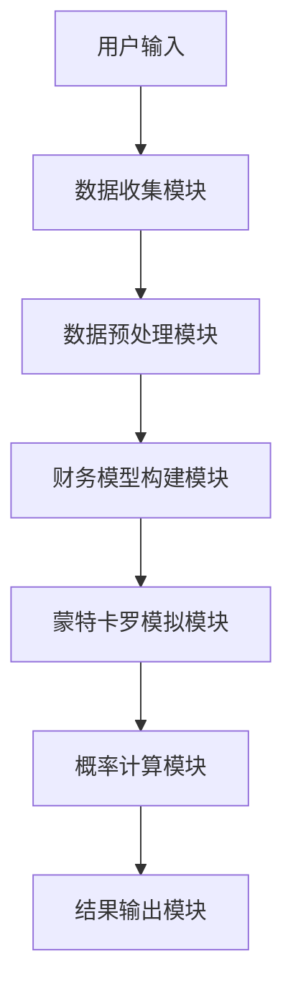

# 智能个人财务目标实现概率计算器

> 关键词：智能财务、目标实现概率、计算器、财务规划、数据分析、机器学习、个人理财

> 摘要：本文围绕智能个人财务目标实现概率计算器展开，详细阐述了其核心概念、算法原理、数学模型等内容。首先介绍了该计算器开发的背景、目的及适用读者等信息。接着深入剖析核心概念，通过文本示意图和 Mermaid 流程图呈现其架构。在算法原理部分，使用 Python 代码进行详细讲解。同时给出相关数学模型和公式，并举例说明。项目实战环节展示了开发环境搭建、源代码实现及代码解读。还探讨了实际应用场景，推荐了学习资源、开发工具框架以及相关论文著作。最后总结了未来发展趋势与挑战，并提供常见问题解答和扩展阅读参考资料，旨在帮助读者全面了解智能个人财务目标实现概率计算器，更好地进行个人财务规划。

## 1. 背景介绍 
### 1.1 目的和范围
在当今社会，个人财务规划变得越来越重要。人们有着各种各样的财务目标，如购买房产、储备教育金、实现养老无忧等。然而，要准确评估这些目标实现的可能性并非易事。智能个人财务目标实现概率计算器的目的就是为个人提供一个科学、便捷的工具，帮助他们基于自身的财务状况、收入支出模式、投资策略等多方面因素，精确计算出各个财务目标的实现概率。其范围涵盖了个人财务的各个方面，包括但不限于日常收支、储蓄、投资、债务等，适用于不同收入水平、不同财务状况的人群。

### 1.2 预期读者
- **普通个人投资者**：希望更好地规划个人财务，了解自己的财务目标实现可能性，以便调整投资策略和消费习惯。
- **财务顾问**：在为客户提供财务规划建议时，借助该计算器的结果，为客户制定更合理、更具针对性的财务方案。
- **金融机构从业者**：例如银行理财经理、保险代理人等，通过该工具深入了解客户的财务状况和目标，为客户提供更优质的金融产品和服务。

### 1.3 文档结构概述
本文将按照以下结构展开：首先介绍智能个人财务目标实现概率计算器的背景信息，包括目的、预期读者等。接着阐述其核心概念和联系，通过文本示意图和 Mermaid 流程图展示其架构。然后详细讲解核心算法原理，使用 Python 代码进行说明，并给出相关数学模型和公式及举例。项目实战部分会介绍开发环境搭建、源代码实现及代码解读。之后探讨实际应用场景，推荐相关学习资源、开发工具框架和论文著作。最后总结未来发展趋势与挑战，提供常见问题解答和扩展阅读参考资料。

### 1.4 术语表
#### 1.4.1 核心术语定义
- **财务目标**：个人在一定时间内希望达成的财务成果，如储蓄一定金额、还清债务、实现资产增值等。
- **实现概率**：基于个人当前的财务状况、收入支出模式、投资策略等因素，通过模型计算得出的财务目标能够实现的可能性，通常以百分比表示。
- **现金流**：个人在一定时期内的现金收入和支出情况，反映了资金的流动状态。
- **投资回报率**：投资获得的收益与投资成本的比率，用于衡量投资的盈利能力。

#### 1.4.2 相关概念解释
- **蒙特卡罗模拟**：一种通过随机抽样和统计试验来求解问题的数值计算方法。在财务目标实现概率计算中，蒙特卡罗模拟可以模拟不同的市场环境和投资结果，从而得到多个可能的财务状况，进而计算出目标实现的概率。
- **风险评估**：对个人财务面临的各种风险进行识别、分析和评估的过程，包括市场风险、信用风险、流动性风险等。风险评估结果将影响财务目标实现的概率。

#### 1.4.3 缩略词列表
- **ROI**：Return on Investment，投资回报率
- **NPV**：Net Present Value，净现值

## 2. 核心概念与联系 
### 核心概念原理
智能个人财务目标实现概率计算器的核心原理是综合考虑个人的财务状况、收入支出模式、投资策略等多方面因素，运用数学模型和数据分析方法，模拟不同的市场环境和投资结果，从而计算出财务目标实现的概率。具体来说，它首先收集个人的财务信息，包括资产、负债、收入、支出等。然后根据这些信息建立财务模型，模拟未来的现金流和资产变化情况。在模拟过程中，考虑到市场的不确定性，使用蒙特卡罗模拟方法生成多个可能的场景。最后，统计在这些场景中财务目标实现的次数，计算出实现概率。

### 架构的文本示意图
```plaintext
用户输入（财务信息、目标信息）
|
v
数据收集模块（收集用户输入数据）
|
v
数据预处理模块（清洗、整理数据）
|
v
财务模型构建模块（根据数据建立财务模型）
|
v
蒙特卡罗模拟模块（模拟不同市场环境和投资结果）
|
v
概率计算模块（统计目标实现次数，计算实现概率）
|
v
结果输出模块（向用户展示计算结果）
```

### Mermaid 流程图


## 3. 核心算法原理 & 具体操作步骤 
### 核心算法原理
智能个人财务目标实现概率计算器主要使用蒙特卡罗模拟算法。蒙特卡罗模拟的基本思想是通过随机抽样和统计试验来求解问题。在财务目标实现概率计算中，我们可以将市场环境和投资结果看作是随机变量，通过多次随机抽样来模拟不同的市场情况和投资回报。具体步骤如下：
1. **定义随机变量**：确定影响财务目标实现的随机变量，如投资回报率、通货膨胀率等。
2. **确定随机变量的概率分布**：根据历史数据或经验，确定每个随机变量的概率分布，如正态分布、均匀分布等。
3. **进行随机抽样**：从每个随机变量的概率分布中随机抽取一个值，作为该随机变量在本次模拟中的取值。
4. **计算财务状况**：根据随机抽样得到的随机变量取值，计算在该市场环境和投资结果下的个人财务状况，包括现金流、资产价值等。
5. **判断目标是否实现**：根据计算得到的财务状况，判断财务目标是否实现。
6. **重复步骤 3 - 5**：进行多次模拟，记录每次模拟中财务目标实现的情况。
7. **计算实现概率**：统计财务目标实现的次数，除以模拟总次数，得到财务目标实现的概率。

### 具体操作步骤及 Python 代码实现
```python
import numpy as np

# 定义输入参数
initial_asset = 100000  # 初始资产
monthly_income = 10000  # 月收入
monthly_expense = 5000  # 月支出
investment_return_mean = 0.08  # 投资回报率均值
investment_return_std = 0.1  # 投资回报率标准差
target_amount = 500000  # 财务目标金额
simulation_years = 10  # 模拟年限
num_simulations = 1000  # 模拟次数

# 进行蒙特卡罗模拟
success_count = 0
for _ in range(num_simulations):
    current_asset = initial_asset
    for year in range(simulation_years):
        # 生成随机投资回报率
        investment_return = np.random.normal(investment_return_mean, investment_return_std)
        # 计算年度现金流
        annual_cashflow = (monthly_income - monthly_expense) * 12
        # 更新资产价值
        current_asset = current_asset * (1 + investment_return) + annual_cashflow
    # 判断目标是否实现
    if current_asset >= target_amount:
        success_count += 1

# 计算实现概率
probability = success_count / num_simulations

print(f"财务目标实现的概率为: {probability * 100:.2f}%")
```
### 代码解释
1. **输入参数定义**：定义了初始资产、月收入、月支出、投资回报率均值和标准差、财务目标金额、模拟年限和模拟次数等参数。
2. **蒙特卡罗模拟**：使用 `for` 循环进行多次模拟，每次模拟中生成随机的投资回报率，计算年度现金流，更新资产价值。
3. **目标判断**：在每次模拟结束后，判断当前资产是否达到财务目标金额，如果达到则成功次数加 1。
4. **概率计算**：将成功次数除以模拟总次数，得到财务目标实现的概率。

## 4. 数学模型和公式 & 详细讲解 & 举例说明 
### 数学模型和公式
#### 资产价值更新公式
在每次模拟中，资产价值的更新公式为：
$$A_{t+1} = A_t(1 + r_t) + C_t$$
其中，$A_t$ 表示第 $t$ 期的资产价值，$r_t$ 表示第 $t$ 期的投资回报率，$C_t$ 表示第 $t$ 期的现金流。

#### 实现概率计算公式
财务目标实现的概率 $P$ 计算公式为：
$$P = \frac{N_{success}}{N_{total}}$$
其中，$N_{success}$ 表示财务目标实现的次数，$N_{total}$ 表示模拟总次数。

### 详细讲解
- **资产价值更新公式**：该公式描述了资产价值在每期的变化情况。资产价值的增长主要来自两个方面，一是投资收益，即资产乘以投资回报率；二是现金流，即当期的收入减去支出。
- **实现概率计算公式**：通过多次模拟，统计财务目标实现的次数，然后除以模拟总次数，得到实现概率。模拟次数越多，计算结果越接近真实的实现概率。

### 举例说明
假设初始资产 $A_0 = 100000$ 元，月收入 $I = 10000$ 元，月支出 $E = 5000$ 元，投资回报率均值 $\mu = 0.08$，投资回报率标准差 $\sigma = 0.1$，财务目标金额 $T = 500000$ 元，模拟年限 $n = 10$ 年，模拟次数 $N = 1000$ 次。
在一次模拟中，第 1 期的投资回报率 $r_0 = 0.06$，则第 1 期的现金流 $C_0 = (I - E) \times 12 = (10000 - 5000) \times 12 = 60000$ 元，第 1 期的资产价值 $A_1 = A_0(1 + r_0) + C_0 = 100000(1 + 0.06) + 60000 = 166000$ 元。
经过 10 年的模拟后，判断当前资产价值是否达到 500000 元，如果达到则成功次数加 1。重复进行 1000 次模拟，最后统计成功次数，计算实现概率。

## 5. 项目实战：代码实际案例和详细解释说明 
### 5.1  开发环境搭建
#### 安装 Python
首先需要安装 Python 环境，建议使用 Python 3.7 及以上版本。可以从 Python 官方网站（https://www.python.org/downloads/）下载适合自己操作系统的安装包，按照安装向导进行安装。

#### 安装依赖库
本项目主要使用 `numpy` 库进行数值计算，使用以下命令安装：
```sh
pip install numpy
```

### 5.2  源代码详细实现和代码解读
```python
import numpy as np

# 定义输入参数类
class InputParameters:
    def __init__(self, initial_asset, monthly_income, monthly_expense, investment_return_mean, investment_return_std, target_amount, simulation_years, num_simulations):
        self.initial_asset = initial_asset
        self.monthly_income = monthly_income
        self.monthly_expense = monthly_expense
        self.investment_return_mean = investment_return_mean
        self.investment_return_std = investment_return_std
        self.target_amount = target_amount
        self.simulation_years = simulation_years
        self.num_simulations = num_simulations

# 定义蒙特卡罗模拟类
class MonteCarloSimulation:
    def __init__(self, params):
        self.params = params

    def run_simulation(self):
        success_count = 0
        for _ in range(self.params.num_simulations):
            current_asset = self.params.initial_asset
            for year in range(self.params.simulation_years):
                # 生成随机投资回报率
                investment_return = np.random.normal(self.params.investment_return_mean, self.params.investment_return_std)
                # 计算年度现金流
                annual_cashflow = (self.params.monthly_income - self.params.monthly_expense) * 12
                # 更新资产价值
                current_asset = current_asset * (1 + investment_return) + annual_cashflow
            # 判断目标是否实现
            if current_asset >= self.params.target_amount:
                success_count += 1
        # 计算实现概率
        probability = success_count / self.params.num_simulations
        return probability

# 主函数
def main():
    # 初始化输入参数
    params = InputParameters(
        initial_asset=100000,
        monthly_income=10000,
        monthly_expense=5000,
        investment_return_mean=0.08,
        investment_return_std=0.1,
        target_amount=500000,
        simulation_years=10,
        num_simulations=1000
    )
    # 创建蒙特卡罗模拟对象
    simulation = MonteCarloSimulation(params)
    # 运行模拟
    probability = simulation.run_simulation()
    print(f"财务目标实现的概率为: {probability * 100:.2f}%")

if __name__ == "__main__":
    main()
```
### 代码解读
1. **输入参数类 `InputParameters`**：用于封装输入参数，包括初始资产、月收入、月支出、投资回报率均值和标准差、财务目标金额、模拟年限和模拟次数等。
2. **蒙特卡罗模拟类 `MonteCarloSimulation`**：包含 `run_simulation` 方法，用于执行蒙特卡罗模拟。在模拟过程中，生成随机的投资回报率，计算年度现金流，更新资产价值，判断目标是否实现，并统计成功次数。最后计算实现概率并返回。
3. **主函数 `main`**：初始化输入参数，创建蒙特卡罗模拟对象，调用 `run_simulation` 方法运行模拟，并打印出财务目标实现的概率。

### 5.3  代码解读与分析
- **模块化设计**：将输入参数和模拟逻辑分别封装在不同的类中，提高了代码的可维护性和可扩展性。
- **随机数生成**：使用 `np.random.normal` 函数生成服从正态分布的随机投资回报率，模拟市场的不确定性。
- **模拟次数**：模拟次数越多，计算结果越接近真实的实现概率，但同时也会增加计算时间。可以根据实际情况调整模拟次数。

## 6. 实际应用场景 
### 个人理财规划
个人可以使用智能个人财务目标实现概率计算器来制定合理的理财计划。例如，一个年轻人希望在 10 年内购买一套价值 500 万元的房产，他可以输入自己的初始资产、月收入、月支出、投资回报率等信息，通过计算器计算出实现该目标的概率。如果概率较低，他可以考虑调整投资策略、增加收入或减少支出，以提高目标实现的概率。

### 财务顾问服务
财务顾问在为客户提供服务时，可以使用该计算器帮助客户了解自己的财务状况和目标实现的可能性。根据计算结果，财务顾问可以为客户制定更个性化、更合理的财务规划方案，如推荐适合的投资产品、制定储蓄计划等。

### 金融机构产品设计
金融机构可以利用该计算器来设计更符合客户需求的金融产品。例如，银行可以根据客户的财务目标和实现概率，推出定制化的理财产品，帮助客户更好地实现财务目标。

## 7. 工具和资源推荐
### 7.1 学习资源推荐
#### 7.1.1 书籍推荐
- 《财务自由之路》：介绍了个人理财的基本理念和方法，帮助读者树立正确的理财观念。
- 《聪明的投资者》：价值投资领域的经典著作，对投资策略和风险管理有深入的阐述。
- 《小狗钱钱》：以故事的形式讲述了理财的基本知识，适合初学者阅读。

#### 7.1.2 在线课程
- Coursera 上的“Personal Finance”课程：由知名教授授课，系统地介绍了个人理财的各个方面。
- edX 上的“Financial Markets”课程：深入讲解了金融市场的运作机制和投资策略。

#### 7.1.3 技术博客和网站
- 雪球网：提供股票、基金等投资领域的资讯和分析，还有很多投资者分享自己的经验和见解。
- 理财巴士：专注于个人理财知识的普及和分享，有很多实用的理财文章和工具。

### 7.2 开发工具框架推荐
#### 7.2.1 IDE和编辑器
- PyCharm：一款专业的 Python 集成开发环境，提供了丰富的代码编辑、调试和管理功能。
- Visual Studio Code：一款轻量级的代码编辑器，支持多种编程语言，通过安装相关插件可以方便地进行 Python 开发。

#### 7.2.2 调试和性能分析工具
- `pdb`：Python 内置的调试器，可以帮助开发者逐步执行代码，查找问题。
- `cProfile`：Python 标准库中的性能分析工具，可以分析代码的运行时间和函数调用情况。

#### 7.2.3 相关框架和库
- `pandas`：用于数据处理和分析的强大库，在财务数据处理中非常有用。
- `matplotlib`：用于数据可视化的库，可以将财务数据和模拟结果以图表的形式展示出来。

### 7.3 相关论文著作推荐
#### 7.3.1 经典论文
- “A Random Walk Down Wall Street”：阐述了有效市场假说和随机漫步理论，对投资领域产生了深远的影响。
- “Capital Asset Pricing Model (CAPM)”：提出了资本资产定价模型，用于计算资产的预期收益率和风险。

#### 7.3.2 最新研究成果
- 关注金融领域的顶级学术期刊，如《Journal of Finance》、《Review of Financial Studies》等，了解最新的研究成果和趋势。

#### 7.3.3 应用案例分析
- 一些金融机构和研究机构会发布个人财务规划的应用案例分析报告，可以从中学习到实际应用中的经验和方法。

## 8. 总结：未来发展趋势与挑战
### 未来发展趋势
- **智能化和个性化**：随着人工智能和机器学习技术的不断发展，智能个人财务目标实现概率计算器将变得更加智能化和个性化。它可以根据用户的历史数据和行为模式，自动调整计算模型和参数，为用户提供更精准的建议和方案。
- **与金融科技融合**：与金融科技的融合将是未来的发展方向。例如，与移动支付、智能投顾等技术结合，实现财务数据的实时更新和自动投资管理，提高用户的理财效率和体验。
- **多维度数据融合**：除了传统的财务数据，未来的计算器将融合更多维度的数据，如个人的健康状况、职业发展前景等，以更全面地评估个人的财务状况和目标实现的可能性。

### 挑战
- **数据质量和隐私问题**：计算结果的准确性依赖于高质量的数据，但数据的收集和处理可能会面临数据质量不高、数据隐私泄露等问题。如何保证数据的质量和安全是需要解决的重要问题。
- **模型的准确性和适应性**：市场环境和个人财务状况是不断变化的，如何保证模型的准确性和适应性，使其能够及时反映市场变化和个人情况的变化，是一个挑战。
- **用户教育和接受度**：智能个人财务目标实现概率计算器是一个相对较新的工具，用户对其原理和使用方法可能不太了解。如何进行有效的用户教育，提高用户的接受度和使用率，也是需要解决的问题。

## 9. 附录：常见问题与解答
### 1. 计算结果的准确性如何保证？
计算结果的准确性受到多种因素的影响，如数据的准确性、模型的合理性、模拟次数等。为了保证计算结果的准确性，需要尽量收集准确的财务数据，选择合适的模型和参数，并进行足够次数的模拟。

### 2. 投资回报率的概率分布是如何确定的？
投资回报率的概率分布可以根据历史数据或经验来确定。一般来说，可以使用正态分布来近似表示投资回报率的分布，但在实际应用中，可能需要根据不同的投资产品和市场情况进行调整。

### 3. 该计算器是否考虑了通货膨胀因素？
在上述代码示例中，没有考虑通货膨胀因素。在实际应用中，可以将通货膨胀率作为一个随机变量加入到模型中，在计算资产价值和现金流时进行相应的调整。

### 4. 如何根据计算结果调整理财计划？
如果计算结果显示财务目标实现的概率较低，可以考虑以下几种调整方法：增加收入、减少支出、调整投资策略以提高投资回报率、延长实现目标的时间等。

## 10. 扩展阅读 & 参考资料
### 扩展阅读
- 《穷爸爸富爸爸》：探讨了不同的财富观念和理财方法，对个人理财有很大的启发。
- 《邻家的百万富翁》：通过对百万富翁的研究，揭示了他们的成功秘诀和理财习惯。

### 参考资料
- Python 官方文档（https://docs.python.org/）
- NumPy 官方文档（https://numpy.org/doc/）
- 相关金融学术期刊和研究报告