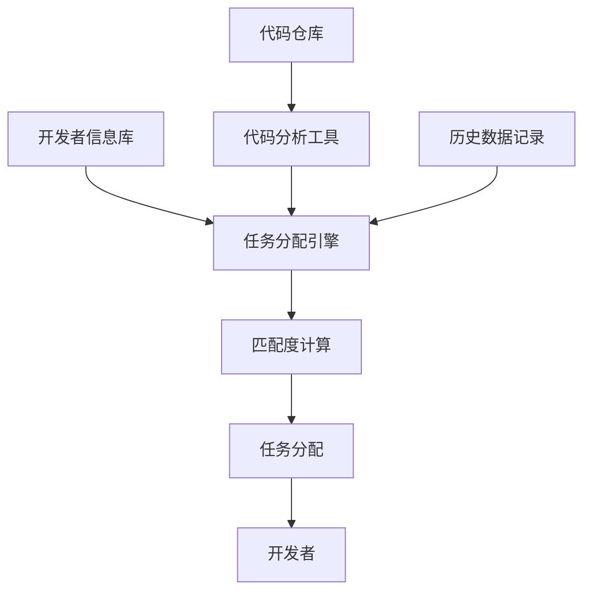

# 智能代码 review 分配:优化团队协作效率

> 关键词：智能代码 review 分配、团队协作效率、代码审查、自动化分配、协作优化
> 摘要：本文围绕智能代码 review 分配展开，旨在探讨如何通过该技术优化团队协作效率。首先介绍了智能代码 review 分配的背景，包括目的、预期读者等内容。接着阐述了核心概念、算法原理、数学模型等基础知识。通过项目实战展示了具体的代码实现和解读。分析了实际应用场景，推荐了相关的工具和资源。最后总结了未来发展趋势与挑战，并提供了常见问题解答和参考资料，帮助读者全面了解智能代码 review 分配技术及其对团队协作的重要性。

## 1. 背景介绍 
### 1.1 目的和范围
在软件开发过程中，代码审查（Code Review）是确保代码质量、促进知识共享和团队协作的重要环节。然而，传统的代码 review 分配方式往往依赖人工经验和主观判断，容易出现分配不合理、效率低下等问题。智能代码 review 分配旨在利用先进的算法和技术，根据代码的特征、开发者的技能和负载等因素，自动、合理地将代码 review 任务分配给最合适的开发者，从而提高代码审查的效率和质量，优化团队协作流程。

本文的范围涵盖了智能代码 review 分配的核心概念、算法原理、数学模型、实际应用场景等方面，同时通过项目实战展示了如何实现一个简单的智能代码 review 分配系统。

### 1.2 预期读者
本文的预期读者包括软件开发团队的管理者、开发者、测试人员以及对智能代码 review 分配技术感兴趣的研究人员。对于团队管理者来说，本文可以帮助他们了解如何通过智能分配提高团队协作效率；对于开发者和测试人员，能够掌握智能代码 review 分配的原理和实现方法，更好地参与代码审查工作；对于研究人员，本文提供了相关的理论基础和研究方向。

### 1.3 文档结构概述
本文将按照以下结构进行组织：
- 核心概念与联系：介绍智能代码 review 分配的核心概念、原理和架构，并通过文本示意图和 Mermaid 流程图进行可视化展示。
- 核心算法原理 & 具体操作步骤：详细讲解智能代码 review 分配所涉及的核心算法原理，并使用 Python 源代码进行阐述。
- 数学模型和公式 & 详细讲解 & 举例说明：给出智能代码 review 分配的数学模型和公式，并进行详细讲解和举例说明。
- 项目实战：代码实际案例和详细解释说明：通过一个实际的项目案例，展示智能代码 review 分配系统的开发环境搭建、源代码实现和代码解读。
- 实际应用场景：分析智能代码 review 分配在不同软件开发场景中的应用。
- 工具和资源推荐：推荐学习智能代码 review 分配相关的书籍、在线课程、技术博客和网站，以及开发工具框架和相关论文著作。
- 总结：未来发展趋势与挑战：总结智能代码 review 分配的未来发展趋势，并分析可能面临的挑战。
- 附录：常见问题与解答：解答读者在学习和实践智能代码 review 分配过程中可能遇到的常见问题。
- 扩展阅读 & 参考资料：提供相关的扩展阅读材料和参考资料。

### 1.4 术语表
#### 1.4.1 核心术语定义
- **代码审查（Code Review）**：指对软件开发过程中编写的代码进行系统性检查的过程，目的是发现代码中的缺陷、提高代码质量、促进知识共享和团队协作。
- **智能代码 review 分配**：利用算法和技术，根据代码的特征、开发者的技能和负载等因素，自动、合理地将代码 review 任务分配给最合适的开发者的过程。
- **代码特征**：包括代码的复杂度、功能模块、编程语言等属性，用于描述代码的特性。
- **开发者技能**：指开发者在不同编程语言、技术领域的熟练程度和经验。
- **开发者负载**：表示开发者当前承担的任务数量和工作量。

#### 1.4.2 相关概念解释
- **自动化分配**：通过计算机程序自动完成代码 review 任务的分配，避免人工分配的主观性和低效性。
- **协作优化**：通过合理的代码 review 分配，提高团队成员之间的协作效率和效果，减少沟通成本和冲突。

#### 1.4.3 缩略词列表
- **CR**：Code Review，代码审查
- **AI**：Artificial Intelligence，人工智能

## 2. 核心概念与联系 

### 核心概念原理
智能代码 review 分配的核心原理是根据代码的特征和开发者的技能、负载等因素，计算每个开发者对每个代码 review 任务的匹配度，然后将任务分配给匹配度最高的开发者。具体来说，主要涉及以下几个方面：

- **代码特征提取**：对代码进行分析，提取代码的复杂度、功能模块、编程语言等特征。例如，可以使用静态代码分析工具来计算代码的圈复杂度、代码行数等指标。
- **开发者技能评估**：评估开发者在不同编程语言、技术领域的熟练程度和经验。可以通过开发者的历史代码贡献、项目经验等数据来进行评估。
- **开发者负载计算**：计算开发者当前承担的任务数量和工作量，以确定开发者是否有足够的时间和精力来承担新的代码 review 任务。
- **匹配度计算**：根据代码特征和开发者技能、负载，计算每个开发者对每个代码 review 任务的匹配度。匹配度越高，说明该开发者越适合承担该任务。
- **任务分配**：将代码 review 任务分配给匹配度最高的开发者。

### 架构的文本示意图
```plaintext
+---------------------+       +---------------------+       +---------------------+
|     代码仓库        |       |     开发者信息库     |       |     任务分配引擎     |
+---------------------+       +---------------------+       +---------------------+
| - 代码文件          |       | - 开发者技能信息    |       | - 代码特征提取模块  |
| - 代码版本信息      |       | - 开发者负载信息    |       | - 开发者技能评估模块|
|                     |       |                     |       | - 开发者负载计算模块|
|                     |       |                     |       | - 匹配度计算模块    |
|                     |       |                     |       | - 任务分配模块      |
+---------------------+       +---------------------+       +---------------------+
                              |                     |
                              |                     |
                              v                     |
+---------------------+       +---------------------+
|     代码分析工具     |       |     历史数据记录    |
+---------------------+       +---------------------+
| - 静态代码分析工具  |       | - 代码 review 历史  |
| - 代码复杂度计算工具|       | - 开发者贡献历史    |
+---------------------+       +---------------------+
```

### Mermaid 流程图


## 3. 核心算法原理 & 具体操作步骤 

### 核心算法原理
智能代码 review 分配的核心算法主要包括代码特征提取、开发者技能评估、开发者负载计算和匹配度计算。下面分别介绍这些算法的原理。

#### 代码特征提取
代码特征提取的目的是从代码中提取有用的信息，用于后续的匹配度计算。常用的代码特征包括代码复杂度、功能模块、编程语言等。

- **代码复杂度**：可以使用圈复杂度（Cyclomatic Complexity）来衡量代码的复杂度。圈复杂度是一种衡量代码控制结构复杂度的指标，计算公式为：$V(G) = E - N + 2$，其中 $V(G)$ 表示圈复杂度，$E$ 表示代码中的边数，$N$ 表示代码中的节点数。

- **功能模块**：通过代码的目录结构、命名规范等信息，将代码划分为不同的功能模块。例如，一个 Web 应用程序可以划分为前端页面、后端接口、数据库操作等功能模块。

- **编程语言**：根据代码文件的扩展名或文件头部的声明，确定代码所使用的编程语言。

#### 开发者技能评估
开发者技能评估的目的是了解开发者在不同编程语言、技术领域的熟练程度和经验。可以通过开发者的历史代码贡献、项目经验等数据来进行评估。

- **历史代码贡献**：统计开发者在不同项目中提交的代码行数、修改的文件数量等指标，以评估开发者在不同编程语言和功能模块上的贡献度。

- **项目经验**：根据开发者参与的项目类型、项目规模等信息，评估开发者在不同技术领域的经验。

#### 开发者负载计算
开发者负载计算的目的是确定开发者当前承担的任务数量和工作量，以判断开发者是否有足够的时间和精力来承担新的代码 review 任务。

- **任务数量**：统计开发者当前正在处理的代码 review 任务数量。

- **工作量**：根据每个代码 review 任务的复杂度和预计所需时间，计算开发者当前承担的总工作量。

#### 匹配度计算
匹配度计算的目的是根据代码特征和开发者技能、负载，计算每个开发者对每个代码 review 任务的匹配度。匹配度的计算公式可以根据具体需求进行定义，一种简单的计算公式为：

$MatchScore = SkillScore \times (1 - LoadFactor)$

其中，$MatchScore$ 表示匹配度得分，$SkillScore$ 表示开发者在代码相关技能上的得分，$LoadFactor$ 表示开发者的负载因子，取值范围为 $[0, 1]$，负载因子越大，说明开发者的负载越重。

### 具体操作步骤
以下是实现智能代码 review 分配的具体操作步骤：

#### 步骤 1：代码特征提取
```python
import radon.complexity

def extract_code_features(code_file):
    # 计算代码复杂度
    with open(code_file, 'r') as f:
        code = f.read()
    cc = radon.complexity.cc_visit(code)
    complexity = sum([x.complexity for x in cc])
    
    # 确定编程语言
    if code_file.endswith('.py'):
        language = 'Python'
    elif code_file.endswith('.java'):
        language = 'Java'
    else:
        language = 'Unknown'
    
    # 假设简单的功能模块划分
    if 'api' in code_file:
        module = 'API'
    elif 'web' in code_file:
        module = 'Web'
    else:
        module = 'Unknown'
    
    return complexity, language, module
```

#### 步骤 2：开发者技能评估
```python
# 假设开发者技能数据存储在字典中
developer_skills = {
    'dev1': {
        'Python': 80,
        'API': 70
    },
    'dev2': {
        'Java': 90,
        'Web': 80
    }
}

def evaluate_developer_skills(developer, language, module):
    if developer in developer_skills:
        skill_score = developer_skills[developer].get(language, 0) + developer_skills[developer].get(module, 0)
        return skill_score
    return 0
```

#### 步骤 3：开发者负载计算
```python
# 假设开发者负载数据存储在字典中
developer_loads = {
    'dev1': 0.3,
    'dev2': 0.6
}

def calculate_developer_load(developer):
    return developer_loads.get(developer, 0)
```

#### 步骤 4：匹配度计算和任务分配
```python
def calculate_match_score(developer, code_file):
    complexity, language, module = extract_code_features(code_file)
    skill_score = evaluate_developer_skills(developer, language, module)
    load_factor = calculate_developer_load(developer)
    match_score = skill_score * (1 - load_factor)
    return match_score

def assign_review_task(code_file, developers):
    match_scores = {}
    for developer in developers:
        match_score = calculate_match_score(developer, code_file)
        match_scores[developer] = match_score
    best_developer = max(match_scores, key=match_scores.get)
    return best_developer
```

### 测试代码
```python
code_file = 'example.py'
developers = ['dev1', 'dev2']
best_developer = assign_review_task(code_file, developers)
print(f'The best developer for {code_file} is {best_developer}')
```

## 4. 数学模型和公式 & 详细讲解 & 举例说明 

### 数学模型
智能代码 review 分配的数学模型可以表示为一个优化问题，目标是最大化所有代码 review 任务的匹配度总和。

设 $T = \{t_1, t_2, \cdots, t_n\}$ 表示代码 review 任务集合，$D = \{d_1, d_2, \cdots, d_m\}$ 表示开发者集合。$MatchScore_{ij}$ 表示开发者 $d_i$ 对任务 $t_j$ 的匹配度得分。

我们的目标是找到一个分配方案 $A = \{a_{ij}\}$，其中 $a_{ij} \in \{0, 1\}$，表示开发者 $d_i$ 是否被分配到任务 $t_j$，满足以下约束条件：

- 每个任务只能分配给一个开发者：$\sum_{i=1}^{m} a_{ij} = 1, \forall j = 1, 2, \cdots, n$
- 每个开发者承担的任务数量不能超过其最大负载：$\sum_{j=1}^{n} a_{ij} \leq LoadLimit_i, \forall i = 1, 2, \cdots, m$

目标函数为：

$$\max \sum_{i=1}^{m} \sum_{j=1}^{n} a_{ij} \times MatchScore_{ij}$$

### 公式详细讲解
- **匹配度得分公式**：$MatchScore_{ij} = SkillScore_{ij} \times (1 - LoadFactor_i)$
    - $SkillScore_{ij}$ 表示开发者 $d_i$ 在任务 $t_j$ 相关技能上的得分，反映了开发者的技能与任务的匹配程度。
    - $LoadFactor_i$ 表示开发者 $d_i$ 的负载因子，取值范围为 $[0, 1]$，负载因子越大，说明开发者的负载越重。

- **目标函数公式**：$\max \sum_{i=1}^{m} \sum_{j=1}^{n} a_{ij} \times MatchScore_{ij}$
    - 该公式表示要最大化所有任务的匹配度得分总和，即让每个任务都尽可能分配给最适合的开发者。

### 举例说明
假设有 2 个代码 review 任务 $t_1$ 和 $t_2$，3 个开发者 $d_1$、$d_2$ 和 $d_3$。匹配度得分矩阵如下：

|  | $t_1$ | $t_2$ |
| --- | --- | --- |
| $d_1$ | 80 | 60 |
| $d_2$ | 70 | 90 |
| $d_3$ | 50 | 70 |

开发者的负载限制分别为 $LoadLimit_1 = 1$，$LoadLimit_2 = 1$，$LoadLimit_3 = 1$。

我们的目标是找到一个分配方案 $A = \{a_{ij}\}$，使得 $\sum_{i=1}^{3} \sum_{j=1}^{2} a_{ij} \times MatchScore_{ij}$ 最大，同时满足每个任务只能分配给一个开发者，每个开发者承担的任务数量不能超过其最大负载。

通过计算可以得到，最优分配方案为 $a_{11} = 1$，$a_{22} = 1$，$a_{12} = a_{21} = a_{31} = a_{32} = 0$，即任务 $t_1$ 分配给开发者 $d_1$，任务 $t_2$ 分配给开发者 $d_2$，此时匹配度得分总和为 $80 + 90 = 170$。

## 5. 项目实战：代码实际案例和详细解释说明 

### 5.1  开发环境搭建
#### 安装 Python
首先，确保你已经安装了 Python 3.x 版本。可以从 Python 官方网站（https://www.python.org/downloads/） 下载并安装。

#### 安装依赖库
我们需要安装一些 Python 库来实现智能代码 review 分配系统，主要包括 `radon` 用于代码复杂度分析。可以使用以下命令进行安装：

```sh
pip install radon
```

#### 代码仓库和开发者信息准备
创建一个代码仓库，用于存储需要进行 review 的代码文件。同时，准备一个开发者信息文件，记录开发者的技能和负载信息。例如，可以使用 JSON 文件来存储这些信息：

```json
{
    "developers": [
        {
            "name": "dev1",
            "skills": {
                "Python": 80,
                "API": 70
            },
            "load": 0.3
        },
        {
            "name": "dev2",
            "skills": {
                "Java": 90,
                "Web": 80
            },
            "load": 0.6
        }
    ]
}
```

### 5.2  源代码详细实现和代码解读
```python
import radon.complexity
import json

# 代码特征提取函数
def extract_code_features(code_file):
    # 计算代码复杂度
    try:
        with open(code_file, 'r') as f:
            code = f.read()
        cc = radon.complexity.cc_visit(code)
        complexity = sum([x.complexity for x in cc])
    except Exception as e:
        print(f"Error calculating complexity for {code_file}: {e}")
        complexity = 0
    
    # 确定编程语言
    if code_file.endswith('.py'):
        language = 'Python'
    elif code_file.endswith('.java'):
        language = 'Java'
    else:
        language = 'Unknown'
    
    # 假设简单的功能模块划分
    if 'api' in code_file:
        module = 'API'
    elif 'web' in code_file:
        module = 'Web'
    else:
        module = 'Unknown'
    
    return complexity, language, module

# 开发者技能评估函数
def evaluate_developer_skills(developer, language, module, developers_info):
    for dev in developers_info['developers']:
        if dev['name'] == developer:
            skill_score = dev['skills'].get(language, 0) + dev['skills'].get(module, 0)
            return skill_score
    return 0

# 开发者负载计算函数
def calculate_developer_load(developer, developers_info):
    for dev in developers_info['developers']:
        if dev['name'] == developer:
            return dev['load']
    return 0

# 匹配度计算函数
def calculate_match_score(developer, code_file, developers_info):
    complexity, language, module = extract_code_features(code_file)
    skill_score = evaluate_developer_skills(developer, language, module, developers_info)
    load_factor = calculate_developer_load(developer, developers_info)
    match_score = skill_score * (1 - load_factor)
    return match_score

# 任务分配函数
def assign_review_task(code_file, developers, developers_info):
    match_scores = {}
    for developer in developers:
        match_score = calculate_match_score(developer, code_file, developers_info)
        match_scores[developer] = match_score
    best_developer = max(match_scores, key=match_scores.get)
    return best_developer

# 主函数
def main():
    # 读取开发者信息文件
    with open('developers.json', 'r') as f:
        developers_info = json.load(f)
    
    # 假设代码文件列表
    code_files = ['example.py', 'example.java']
    developers = [dev['name'] for dev in developers_info['developers']]
    
    for code_file in code_files:
        best_developer = assign_review_task(code_file, developers, developers_info)
        print(f'The best developer for {code_file} is {best_developer}')

if __name__ == "__main__":
    main()
```

### 5.3  代码解读与分析
- **代码特征提取函数 `extract_code_features`**：该函数用于从代码文件中提取代码复杂度、编程语言和功能模块等特征。使用 `radon` 库计算代码的圈复杂度，根据文件扩展名确定编程语言，通过文件名中的关键字进行简单的功能模块划分。
- **开发者技能评估函数 `evaluate_developer_skills`**：该函数根据开发者的技能信息和代码特征，计算开发者在代码相关技能上的得分。
- **开发者负载计算函数 `calculate_developer_load`**：该函数根据开发者的负载信息，返回开发者的负载因子。
- **匹配度计算函数 `calculate_match_score`**：该函数根据代码特征、开发者技能和负载，计算开发者对代码 review 任务的匹配度得分。
- **任务分配函数 `assign_review_task`**：该函数遍历所有开发者，计算每个开发者对代码 review 任务的匹配度得分，然后选择匹配度得分最高的开发者作为最佳分配对象。
- **主函数 `main`**：该函数读取开发者信息文件，定义代码文件列表和开发者列表，然后对每个代码文件进行任务分配，并输出最佳分配结果。

## 6. 实际应用场景 
### 大型软件开发项目
在大型软件开发项目中，代码量巨大，涉及多个功能模块和不同的编程语言。传统的代码 review 分配方式容易导致任务分配不合理，一些开发者承担过多的任务，而另一些开发者则任务不足。智能代码 review 分配可以根据代码的特征和开发者的技能、负载，自动将代码 review 任务分配给最合适的开发者，提高代码审查的效率和质量，确保每个开发者都能发挥其最大优势。

### 开源项目开发
开源项目通常有大量的开发者参与，开发者的技能和经验水平参差不齐。智能代码 review 分配可以帮助项目管理者更好地管理代码审查流程，将代码 review 任务分配给对相关技术领域有丰富经验的开发者，从而提高开源项目的代码质量和开发效率。

### 敏捷开发团队
敏捷开发强调快速迭代和团队协作，代码 review 是敏捷开发过程中的重要环节。智能代码 review 分配可以在短时间内完成任务分配，减少人工分配的时间成本，使团队能够更快地进行代码审查和迭代开发，提高团队的响应速度和协作效率。

## 7. 工具和资源推荐
### 7.1 学习资源推荐
#### 7.1.1 书籍推荐
- 《代码大全（第 2 版）》：这本书涵盖了软件开发的各个方面，包括代码审查、代码质量保证等内容，是软件开发领域的经典著作。
- 《Python 数据分析实战》：如果你想深入学习 Python 编程和数据分析，这本书是一个不错的选择，它可以帮助你更好地理解和实现智能代码 review 分配系统。

#### 7.1.2 在线课程
- Coursera 上的“人工智能基础”课程：该课程介绍了人工智能的基本概念、算法和应用，对于理解智能代码 review 分配的原理有很大帮助。
- edX 上的“Python 编程基础”课程：该课程适合初学者学习 Python 编程，掌握 Python 的基本语法和常用库的使用。

#### 7.1.3 技术博客和网站
- 开源中国（https://www.oschina.net/）：提供了丰富的开源项目信息和技术文章，你可以在上面找到关于代码审查和智能分配的相关资源。
- 博客园（https://www.cnblogs.com/）：有很多开发者分享自己的技术经验和实践案例，对于学习智能代码 review 分配有一定的参考价值。

### 7.2 开发工具框架推荐
#### 7.2.1 IDE和编辑器
- PyCharm：是一款专门为 Python 开发设计的集成开发环境，提供了丰富的代码编辑、调试和分析功能，适合开发智能代码 review 分配系统。
- Visual Studio Code：是一款轻量级的代码编辑器，支持多种编程语言和插件扩展，具有强大的代码编辑和调试功能。

#### 7.2.2 调试和性能分析工具
- PDB：Python 自带的调试器，可以帮助你调试 Python 代码，查找代码中的错误和问题。
- cProfile：Python 标准库中的性能分析工具，可以分析代码的运行时间和性能瓶颈，帮助你优化代码性能。

#### 7.2.3 相关框架和库
- Radon：用于代码复杂度分析的 Python 库，可以帮助你提取代码的复杂度特征。
- Pandas：是一个强大的数据分析库，可以用于处理和分析开发者信息和代码特征数据。

### 7.3 相关论文著作推荐
#### 7.3.1 经典论文
- "Automated Code Review: A Systematic Literature Review"：该论文对自动化代码审查的相关研究进行了系统的综述，介绍了自动化代码审查的方法、技术和应用。
- "Code Review in Open Source Software: A Case Study"：通过对开源软件项目的代码审查进行案例研究，分析了代码审查的过程、效果和影响因素。

#### 7.3.2 最新研究成果
- 可以关注顶级计算机科学会议（如 ACM SIGSOFT FSE、IEEE ICSE 等）上的相关研究论文，了解智能代码 review 分配领域的最新研究动态和成果。

#### 7.3.3 应用案例分析
- 一些知名科技公司（如 Google、Microsoft 等）会在其技术博客上分享代码审查和团队协作的实践经验和应用案例，可以从中学习到他们的最佳实践和成功经验。

## 8. 总结：未来发展趋势与挑战
### 未来发展趋势
- **智能化程度不断提高**：随着人工智能技术的不断发展，智能代码 review 分配系统将更加智能化。例如，系统可以通过机器学习算法自动学习开发者的技能和偏好，不断优化任务分配策略，提高分配的准确性和合理性。
- **与开发工具深度集成**：智能代码 review 分配系统将与现有的开发工具（如 IDE、版本控制系统等）深度集成，实现无缝对接。开发者可以在开发工具中直接完成代码 review 任务的分配和管理，提高开发效率。
- **支持多团队协作**：未来的智能代码 review 分配系统将支持多团队协作，能够处理跨团队、跨项目的代码审查任务分配。系统可以根据不同团队的需求和特点，制定个性化的分配策略，提高团队间的协作效率。

### 挑战
- **数据质量和获取难度**：智能代码 review 分配系统需要大量的代码特征数据、开发者技能数据和历史审查数据等。然而，这些数据的质量和获取难度是一个挑战。例如，代码特征数据的提取可能存在误差，开发者技能数据的评估可能不够准确。
- **算法复杂度和性能问题**：随着代码规模和开发者数量的增加，智能代码 review 分配的算法复杂度也会相应增加。如何设计高效的算法，在保证分配准确性的前提下，提高系统的性能和响应速度，是一个需要解决的问题。
- **团队文化和接受度**：智能代码 review 分配系统的实施需要团队成员的支持和配合。一些开发者可能对自动化分配方式存在疑虑，担心失去对任务的控制权。如何培养团队成员的接受度，建立良好的团队文化，是推广智能代码 review 分配系统的关键。

## 9. 附录：常见问题与解答
### 问题 1：智能代码 review 分配系统是否会完全取代人工分配？
答：目前来看，智能代码 review 分配系统不会完全取代人工分配。虽然智能系统可以根据代码特征和开发者信息进行任务分配，但在一些特殊情况下，如紧急任务、复杂的业务需求等，仍然需要人工干预。此外，人工分配可以考虑到一些难以量化的因素，如开发者之间的协作关系、个人偏好等。因此，智能代码 review 分配系统更像是人工分配的辅助工具，可以提高分配的效率和合理性。

### 问题 2：如何评估开发者的技能和负载信息？
答：开发者的技能信息可以通过多种方式进行评估，如历史代码贡献、项目经验、技术认证等。可以统计开发者在不同项目中提交的代码行数、修改的文件数量、解决的问题数量等指标，以评估开发者在不同编程语言和功能模块上的贡献度。开发者的负载信息可以通过统计开发者当前正在处理的任务数量、每个任务的预计完成时间等方式进行计算。

### 问题 3：智能代码 review 分配系统的准确性如何保证？
答：要保证智能代码 review 分配系统的准确性，需要从以下几个方面入手：
- **数据质量**：确保代码特征数据、开发者技能数据和历史审查数据的准确性和完整性。可以通过数据清洗、验证等方式提高数据质量。
- **算法优化**：不断优化匹配度计算算法和任务分配算法，根据实际情况调整算法参数，提高分配的准确性。
- **反馈机制**：建立反馈机制，收集开发者对任务分配结果的反馈意见，根据反馈信息对系统进行调整和优化。

## 10. 扩展阅读 & 参考资料
### 扩展阅读
- 《重构：改善既有代码的设计》：这本书介绍了代码重构的方法和技巧，可以帮助开发者提高代码质量，减少代码审查过程中的问题。
- 《软件测试的艺术》：了解软件测试的基本概念和方法，对于代码审查和质量保证有很大帮助。

### 参考资料
- Radon 官方文档：https://radon.readthedocs.io/
- Pandas 官方文档：https://pandas.pydata.org/docs/
- ACM SIGSOFT FSE 会议官网：https://conf.researchr.org/home/fse
- IEEE ICSE 会议官网：https://conf.researchr.org/home/icse