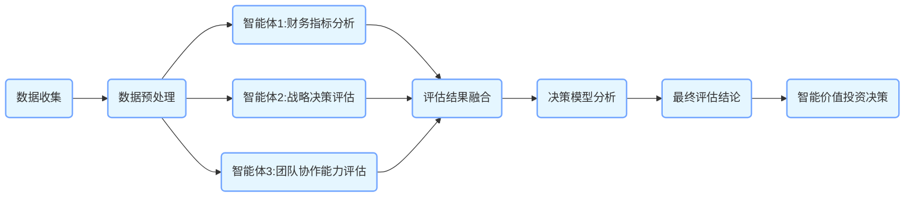

# 智能价值投资：多智能体AI系统的管理层评估

> 关键词：智能价值投资、多智能体AI系统、管理层评估、金融分析、人工智能应用

> 摘要：本文聚焦于智能价值投资领域，深入探讨如何运用多智能体AI系统进行管理层评估。首先介绍了研究的背景、目的和范围，明确预期读者与文档结构。接着阐述了核心概念及联系，包括多智能体AI系统和管理层评估的原理与架构，并通过示意图和流程图展示。详细讲解了核心算法原理，结合Python代码示例进行说明。引入数学模型和公式，辅以具体例子加深理解。通过项目实战，展示了开发环境搭建、源代码实现与解读。探讨了实际应用场景，推荐了相关工具和资源，最后总结了未来发展趋势与挑战，解答常见问题并提供扩展阅读与参考资料，旨在为智能价值投资中的管理层评估提供全面且深入的技术指导。

## 1. 背景介绍 
### 1.1 目的和范围
在当今复杂多变的金融市场中，价值投资一直是投资者追求长期稳定回报的重要策略。而管理层作为企业的核心决策团队，其能力、素质和决策水平对企业的发展和价值创造起着至关重要的作用。传统的管理层评估方法往往依赖于人工分析和经验判断，存在主观性强、效率低下、难以全面综合评估等问题。

本研究的目的在于引入多智能体AI系统，利用其分布式、自主协作和智能决策的特点，对企业管理层进行客观、全面、高效的评估，为智能价值投资提供更科学的决策依据。研究范围涵盖了多智能体AI系统的原理、架构、算法设计，以及如何将其应用于管理层评估的各个环节，包括数据收集、特征提取、模型训练和评估结果输出等。

### 1.2 预期读者
本文预期读者主要包括金融投资领域的专业人士，如基金经理、投资分析师、风险评估师等，他们希望借助先进的人工智能技术提升投资决策的准确性和效率；人工智能和计算机科学领域的研究人员和开发者，对多智能体系统在金融领域的应用感兴趣；以及对智能价值投资和管理层评估有深入研究需求的学者和学生。

### 1.3 文档结构概述
本文将按照以下结构展开：首先介绍相关的核心概念，包括多智能体AI系统和管理层评估的基本原理和架构，并通过示意图和流程图进行直观展示；接着详细阐述核心算法原理，结合Python代码进行具体说明；引入数学模型和公式，解释其在管理层评估中的应用，并通过实例加深理解；通过项目实战，展示如何搭建开发环境、实现源代码并进行代码解读；探讨多智能体AI系统在管理层评估中的实际应用场景；推荐相关的学习资源、开发工具框架和论文著作；最后总结未来发展趋势与挑战，解答常见问题并提供扩展阅读和参考资料。

### 1.4 术语表
#### 1.4.1 核心术语定义
- **智能价值投资**：基于对企业内在价值的分析，运用先进的技术和方法，寻找被低估的投资标的，以实现长期稳定的投资回报。
- **多智能体AI系统**：由多个自主智能体组成的系统，这些智能体可以通过交互和协作来完成复杂的任务。每个智能体具有一定的感知、决策和行动能力，能够根据环境变化和其他智能体的状态进行自主调整。
- **管理层评估**：对企业管理层的能力、素质、决策水平等方面进行全面、客观的评价，以判断其对企业发展的影响和价值。

#### 1.4.2 相关概念解释
- **智能体**：在人工智能领域，智能体是指能够感知环境、做出决策并采取行动的实体。它可以是软件程序、机器人或其他具有智能行为的系统。
- **分布式系统**：由多个独立的计算节点组成的系统，这些节点通过网络进行通信和协作，共同完成一个或多个任务。多智能体AI系统通常采用分布式架构，以提高系统的灵活性和可扩展性。
- **价值评估模型**：用于评估企业内在价值的数学模型，常见的有现金流折现模型、市盈率模型等。在管理层评估中，价值评估模型可以作为参考，以判断管理层的决策对企业价值的影响。

#### 1.4.3 缩略词列表
- **AI**：Artificial Intelligence，人工智能
- **MAS**：Multi - Agent System，多智能体系统
- **ROE**：Return on Equity，净资产收益率
- **EPS**：Earnings Per Share，每股收益

## 2. 核心概念与联系 
### 核心概念原理
#### 多智能体AI系统原理
多智能体AI系统的核心思想是将复杂的任务分解为多个子任务，并由多个智能体分别承担这些子任务。每个智能体具有自己的知识、目标和行为规则，能够根据局部信息做出决策，并与其他智能体进行交互和协作。智能体之间的交互可以通过消息传递、共享内存等方式实现，以达到全局最优的目标。

在管理层评估中，不同的智能体可以负责不同的评估指标，如财务指标分析智能体、战略决策评估智能体、团队协作能力评估智能体等。这些智能体通过收集和分析相关数据，得出各自的评估结果，并将其汇总和融合，最终形成对管理层的综合评估。

#### 管理层评估原理
管理层评估主要基于对管理层的多个方面进行考察，包括领导能力、决策能力、战略眼光、团队协作能力、风险管理能力等。评估过程通常需要收集大量的数据，如企业财务报表、管理层言论和决策记录、市场反馈等，并运用合适的方法和模型对这些数据进行分析和处理。

评估结果可以用定量和定性的指标来表示，如财务指标（ROE、EPS等）、绩效评分、评价等级等。通过对管理层的评估，可以帮助投资者了解企业的管理水平和发展潜力，为投资决策提供重要参考。

### 架构的文本示意图
以下是多智能体AI系统用于管理层评估的架构示意图：

- **数据层**：负责收集和存储与管理层评估相关的数据，包括企业内部数据（如财务报表、员工评价等）和外部数据（如行业报告、市场数据等）。
- **智能体层**：由多个不同类型的智能体组成，每个智能体负责特定的评估任务。智能体之间通过通信机制进行信息交换和协作。
- **决策层**：对智能体层输出的评估结果进行汇总、融合和分析，运用合适的决策模型得出最终的管理层评估结论。
- **应用层**：将评估结果应用于智能价值投资决策，如投资组合优化、风险评估等。

### Mermaid流程图


## 3. 核心算法原理 & 具体操作步骤 
### 核心算法原理
#### 智能体协作算法
在多智能体AI系统中，智能体协作算法是实现多个智能体有效协作的关键。常见的协作算法有合同网协议、拍卖算法等。以合同网协议为例，其基本原理如下：

- **任务发布**：当有评估任务需要完成时，一个智能体（管理者智能体）将任务信息（如任务描述、截止时间、奖励等）广播给其他智能体。
- **投标**：其他智能体（投标智能体）根据自身的能力和资源情况，决定是否参与投标。如果参与投标，投标智能体将向管理者智能体发送投标信息，包括自己的报价、完成时间等。
- **中标选择**：管理者智能体根据投标信息，选择最合适的投标智能体作为中标者，并向其发送中标通知。
- **任务执行**：中标智能体负责执行任务，并将执行结果反馈给管理者智能体。

#### 评估指标融合算法
为了得到对管理层的综合评估结果，需要将各个智能体输出的评估指标进行融合。常见的融合算法有加权平均法、层次分析法（AHP）等。以加权平均法为例，假设共有 $n$ 个评估指标，每个指标的评估值为 $x_i$，对应的权重为 $w_i$，则综合评估值 $S$ 可以表示为：

$S=\sum_{i = 1}^{n}w_ix_i$

### 具体操作步骤及Python代码示例
#### 数据收集与预处理
```python
import pandas as pd
import numpy as np

# 模拟数据收集
data = {
    '财务指标': [0.2, 0.3, 0.4],
    '战略决策评分': [0.6, 0.7, 0.8],
    '团队协作能力评分': [0.5, 0.6, 0.7]
}
df = pd.DataFrame(data)

# 数据预处理，如归一化
from sklearn.preprocessing import MinMaxScaler
scaler = MinMaxScaler()
df_scaled = scaler.fit_transform(df)
df_scaled = pd.DataFrame(df_scaled, columns=df.columns)
```

#### 智能体模拟
```python
# 定义财务指标分析智能体
class FinancialAgent:
    def __init__(self):
        pass

    def evaluate(self, data):
        return data['财务指标'].mean()

# 定义战略决策评估智能体
class StrategyAgent:
    def __init__(self):
        pass

    def evaluate(self, data):
        return data['战略决策评分'].mean()

# 定义团队协作能力评估智能体
class TeamworkAgent:
    def __init__(self):
        pass

    def evaluate(self, data):
        return data['团队协作能力评分'].mean()

# 创建智能体实例
financial_agent = FinancialAgent()
strategy_agent = StrategyAgent()
teamwork_agent = TeamworkAgent()

# 智能体评估
financial_result = financial_agent.evaluate(df_scaled)
strategy_result = strategy_agent.evaluate(df_scaled)
teamwork_result = teamwork_agent.evaluate(df_scaled)
```

#### 评估指标融合
```python
# 定义指标权重
weights = {
    '财务指标': 0.3,
    '战略决策评分': 0.4,
    '团队协作能力评分': 0.3
}

# 融合评估结果
final_result = weights['财务指标'] * financial_result + weights['战略决策评分'] * strategy_result + weights['团队协作能力评分'] * teamwork_result
print("最终评估结果:", final_result)
```

## 4. 数学模型和公式 & 详细讲解 & 举例说明 
### 数学模型和公式
#### 加权平均模型
如前文所述，加权平均模型用于将多个评估指标融合为一个综合评估值。公式为：

$S=\sum_{i = 1}^{n}w_ix_i$

其中，$S$ 表示综合评估值，$x_i$ 表示第 $i$ 个评估指标的评估值，$w_i$ 表示第 $i$ 个评估指标的权重，且 $\sum_{i = 1}^{n}w_i = 1$。

#### 层次分析法（AHP）模型
层次分析法是一种将定性和定量分析相结合的多准则决策方法。其基本步骤如下：

1. **构建层次结构模型**：将问题分解为不同的层次，如目标层、准则层和方案层。在管理层评估中，目标层可以是对管理层的综合评估，准则层可以包括财务指标、战略决策能力、团队协作能力等，方案层可以是不同的管理层候选人或团队。
2. **构造判断矩阵**：对同一层次的元素进行两两比较，确定它们之间的相对重要性，并构造判断矩阵。判断矩阵 $A=(a_{ij})_{n\times n}$ 满足 $a_{ij}>0$，$a_{ji}=\frac{1}{a_{ij}}$，$a_{ii}=1$。
3. **计算权重向量**：通过求解判断矩阵的特征值和特征向量，得到各元素的权重向量。
4. **一致性检验**：检验判断矩阵的一致性，确保判断的合理性。一致性指标 $CI=\frac{\lambda_{max}-n}{n - 1}$，其中 $\lambda_{max}$ 是判断矩阵的最大特征值，$n$ 是判断矩阵的阶数。随机一致性指标 $RI$ 可以通过查表得到。一致性比率 $CR=\frac{CI}{RI}$，当 $CR<0.1$ 时，认为判断矩阵具有满意的一致性。

### 详细讲解
#### 加权平均模型讲解
加权平均模型的核心思想是根据各个评估指标的重要程度，对其评估值进行加权求和。权重的确定可以根据专家经验、历史数据或其他方法进行。该模型简单易懂，计算方便，但权重的主观性较强。

#### 层次分析法（AHP）模型讲解
层次分析法通过将复杂的问题分解为多个层次和元素，并进行两两比较，能够更客观地确定各元素的权重。判断矩阵的构造是关键步骤，需要根据实际情况进行合理的比较和判断。一致性检验可以保证判断矩阵的合理性，避免出现矛盾的判断。

### 举例说明
#### 加权平均模型举例
假设对管理层的评估指标包括财务指标、战略决策能力和团队协作能力，其评估值分别为 $0.8$、$0.7$ 和 $0.6$，对应的权重分别为 $0.4$、$0.3$ 和 $0.3$。则综合评估值为：

$S = 0.4\times0.8 + 0.3\times0.7 + 0.3\times0.6 = 0.71$

#### 层次分析法（AHP）模型举例
假设在评估管理层时，准则层包括财务指标（$C_1$）、战略决策能力（$C_2$）和团队协作能力（$C_3$）。通过两两比较，得到判断矩阵 $A$ 如下：

$A=\begin{bmatrix}
1 & 2 & 3 \\
\frac{1}{2} & 1 & 2 \\
\frac{1}{3} & \frac{1}{2} & 1
\end{bmatrix}$

计算判断矩阵的最大特征值 $\lambda_{max}=3.0385$，一致性指标 $CI=\frac{3.0385 - 3}{3 - 1}=0.01925$。对于 $n = 3$，随机一致性指标 $RI = 0.58$，一致性比率 $CR=\frac{0.01925}{0.58}\approx0.0332<0.1$，判断矩阵具有满意的一致性。

求解判断矩阵的特征向量，得到权重向量 $W=(0.5396, 0.2970, 0.1634)^T$。即财务指标、战略决策能力和团队协作能力的权重分别为 $0.5396$、$0.2970$ 和 $0.1634$。

## 5. 项目实战：代码实际案例和详细解释说明 
### 5.1  开发环境搭建
#### 操作系统
可以选择 Windows、Linux 或 macOS 操作系统，推荐使用 Linux 系统，如 Ubuntu 18.04 及以上版本，因为其对开发环境的支持较好，且具有较高的稳定性和安全性。

#### 编程语言和库
- **Python**：作为主要的编程语言，Python 具有丰富的科学计算和机器学习库，非常适合用于数据分析和模型开发。建议使用 Python 3.7 及以上版本。
- **NumPy**：用于进行高效的数值计算，提供了多维数组对象和各种数学函数。
- **Pandas**：用于数据处理和分析，提供了 DataFrame 等数据结构，方便数据的读取、清洗和转换。
- **Scikit - learn**：用于机器学习模型的开发和评估，提供了各种分类、回归、聚类等算法。
- **Matplotlib**：用于数据可视化，能够绘制各种图表，如折线图、柱状图、散点图等。

#### 安装步骤
```bash
# 创建虚拟环境
python3 -m venv investment_env
source investment_env/bin/activate

# 安装所需库
pip install numpy pandas scikit-learn matplotlib
```

### 5.2  源代码详细实现和代码解读
#### 完整代码示例
```python
import pandas as pd
import numpy as np
from sklearn.preprocessing import MinMaxScaler
import matplotlib.pyplot as plt

# 数据收集与预处理
def data_preprocessing():
    # 模拟数据收集
    data = {
        '财务指标': [0.2, 0.3, 0.4, 0.5, 0.6],
        '战略决策评分': [0.6, 0.7, 0.8, 0.9, 0.7],
        '团队协作能力评分': [0.5, 0.6, 0.7, 0.8, 0.6]
    }
    df = pd.DataFrame(data)

    # 数据预处理，如归一化
    scaler = MinMaxScaler()
    df_scaled = scaler.fit_transform(df)
    df_scaled = pd.DataFrame(df_scaled, columns=df.columns)
    return df_scaled

# 定义智能体类
class FinancialAgent:
    def __init__(self):
        pass

    def evaluate(self, data):
        return data['财务指标'].mean()

class StrategyAgent:
    def __init__(self):
        pass

    def evaluate(self, data):
        return data['战略决策评分'].mean()

class TeamworkAgent:
    def __init__(self):
        pass

    def evaluate(self, data):
        return data['团队协作能力评分'].mean()

# 智能体评估
def agent_evaluation(data):
    financial_agent = FinancialAgent()
    strategy_agent = StrategyAgent()
    teamwork_agent = TeamworkAgent()

    financial_result = financial_agent.evaluate(data)
    strategy_result = strategy_agent.evaluate(data)
    teamwork_result = teamwork_agent.evaluate(data)
    return financial_result, strategy_result, teamwork_result

# 评估指标融合
def result_fusion(financial_result, strategy_result, teamwork_result):
    # 定义指标权重
    weights = {
        '财务指标': 0.3,
        '战略决策评分': 0.4,
        '团队协作能力评分': 0.3
    }

    # 融合评估结果
    final_result = weights['财务指标'] * financial_result + weights['战略决策评分'] * strategy_result + weights['团队协作能力评分'] * teamwork_result
    return final_result

# 主函数
def main():
    # 数据预处理
    df_scaled = data_preprocessing()

    # 智能体评估
    financial_result, strategy_result, teamwork_result = agent_evaluation(df_scaled)

    # 评估指标融合
    final_result = result_fusion(financial_result, strategy_result, teamwork_result)

    # 打印结果
    print("财务指标评估结果:", financial_result)
    print("战略决策评估结果:", strategy_result)
    print("团队协作能力评估结果:", teamwork_result)
    print("最终评估结果:", final_result)

    # 数据可视化
    labels = ['财务指标', '战略决策', '团队协作能力']
    scores = [financial_result, strategy_result, teamwork_result]
    plt.bar(labels, scores)
    plt.title('管理层各方面评估得分')
    plt.ylabel('得分')
    plt.show()

if __name__ == "__main__":
    main()
```

#### 代码解读
1. **数据收集与预处理**：`data_preprocessing` 函数模拟了数据收集过程，并使用 `MinMaxScaler` 对数据进行归一化处理，将数据缩放到 $[0, 1]$ 区间。
2. **智能体类定义**：定义了三个智能体类 `FinancialAgent`、`StrategyAgent` 和 `TeamworkAgent`，分别负责财务指标分析、战略决策评估和团队协作能力评估。每个智能体类都有一个 `evaluate` 方法，用于计算相应的评估结果。
3. **智能体评估**：`agent_evaluation` 函数创建了三个智能体实例，并调用它们的 `evaluate` 方法，得到各个智能体的评估结果。
4. **评估指标融合**：`result_fusion` 函数根据预先定义的权重，使用加权平均法将各个智能体的评估结果融合为一个综合评估结果。
5. **主函数**：`main` 函数依次调用上述函数，完成数据预处理、智能体评估和评估指标融合，并打印出最终评估结果。同时，使用 `matplotlib` 库绘制了柱状图，直观展示了管理层各方面的评估得分。

### 5.3  代码解读与分析
#### 代码优点
- **模块化设计**：代码采用了模块化设计，将不同的功能封装在不同的函数和类中，提高了代码的可读性和可维护性。
- **数据预处理**：对数据进行了归一化处理，避免了不同指标之间量纲的影响，提高了评估结果的准确性。
- **可视化展示**：使用 `matplotlib` 库对评估结果进行可视化展示，使结果更加直观易懂。

#### 代码改进方向
- **数据来源**：当前代码使用的是模拟数据，实际应用中需要从真实的数据源（如数据库、API等）获取数据。
- **智能体协作算法**：代码中没有实现智能体之间的协作算法，如合同网协议、拍卖算法等，可以进一步扩展代码，实现更复杂的智能体协作。
- **评估指标和权重**：评估指标和权重的选择可以根据实际情况进行调整和优化，例如可以引入更多的评估指标，或者使用层次分析法等方法确定更合理的权重。

## 6. 实际应用场景 
### 金融投资机构
金融投资机构，如基金公司、证券公司等，可以利用多智能体AI系统的管理层评估结果，进行投资决策。在选择投资标的时，除了考虑企业的财务状况和市场前景外，还可以将管理层的能力和素质作为重要的参考因素。通过对管理层的评估，可以筛选出具有优秀管理团队的企业，提高投资组合的质量和回报率。

### 企业并购与重组
在企业并购与重组过程中，对目标企业管理层的评估至关重要。通过多智能体AI系统的评估，可以了解目标企业管理层的能力和风格，判断其与并购方管理层的兼容性。评估结果可以为并购决策提供依据，帮助企业制定合理的整合策略，降低并购风险。

### 企业内部管理
企业内部也可以运用多智能体AI系统进行管理层评估，为管理层的绩效评估、晋升和培训提供参考。通过客观、全面的评估，可以发现管理层的优势和不足，有针对性地进行培训和提升，提高企业的管理水平和竞争力。

### 风险投资
风险投资机构在选择投资项目时，通常会关注创业团队的管理能力。多智能体AI系统可以对创业团队的管理层进行评估，帮助风险投资机构判断项目的潜在价值和风险。评估结果可以作为投资决策的重要依据，提高投资的成功率。

## 7. 工具和资源推荐
### 7.1 学习资源推荐
#### 7.1.1 书籍推荐
- 《人工智能：一种现代的方法》（Artificial Intelligence: A Modern Approach）：这本书是人工智能领域的经典教材，涵盖了人工智能的各个方面，包括搜索算法、知识表示、机器学习、自然语言处理等。
- 《多智能体系统导论》（An Introduction to Multi - Agent Systems）：详细介绍了多智能体系统的基本概念、理论和方法，包括智能体的建模、通信、协作和学习等。
- 《价值投资：从格雷厄姆到巴菲特》（Value Investing: From Graham to Buffett and Beyond）：深入探讨了价值投资的理念和方法，包括企业估值、财务分析、管理层评估等。

#### 7.1.2 在线课程
- Coursera 上的“人工智能基础”（Fundamentals of Artificial Intelligence）课程：由知名高校的教授授课，系统地介绍了人工智能的基本概念和方法。
- edX 上的“多智能体系统”（Multi - Agent Systems）课程：详细讲解了多智能体系统的理论和应用，包括智能体的设计、协作和学习等。
- Udemy 上的“价值投资实战课程”（Value Investing Practical Course）：结合实际案例，介绍了价值投资的具体方法和技巧，包括管理层评估在投资决策中的应用。

#### 7.1.3 技术博客和网站
- Towards Data Science：一个专注于数据科学和人工智能的技术博客，上面有很多关于机器学习、深度学习、多智能体系统等方面的文章。
- Medium：一个综合性的博客平台，有很多技术专家分享关于金融科技、人工智能应用等方面的经验和见解。
- AI Time：一个专注于人工智能领域的网站，提供了大量的学术报告、技术文章和行业动态。

### 7.2 开发工具框架推荐
#### 7.2.1 IDE和编辑器
- PyCharm：一款专业的 Python 集成开发环境，提供了代码编辑、调试、版本控制等功能，非常适合 Python 项目的开发。
- Visual Studio Code：一款轻量级的代码编辑器，支持多种编程语言，具有丰富的插件生态系统，可以方便地进行 Python 开发。
- Jupyter Notebook：一个交互式的开发环境，适合进行数据探索、模型开发和可视化展示。

#### 7.2.2 调试和性能分析工具
- PDB：Python 自带的调试器，可以帮助开发者定位和解决代码中的问题。
- cProfile：Python 标准库中的性能分析工具，可以分析代码的运行时间和函数调用情况，帮助开发者优化代码性能。
- Py-Spy：一个轻量级的 Python 性能分析工具，可以实时监控 Python 程序的运行情况，找出性能瓶颈。

#### 7.2.3 相关框架和库
- Mesa：一个用于构建多智能体系统的 Python 框架，提供了智能体建模、仿真和可视化等功能。
- OpenAI Gym：一个用于开发和比较强化学习算法的工具包，也可以用于多智能体系统的开发和测试。
- Scikit - learn：一个强大的机器学习库，提供了各种分类、回归、聚类等算法，可用于管理层评估中的数据建模和分析。

### 7.3 相关论文著作推荐
#### 7.3.1 经典论文
- “Multi - Agent Systems: A Modern Approach to Distributed Artificial Intelligence”：该论文系统地介绍了多智能体系统的基本概念、理论和方法，是多智能体系统领域的经典之作。
- “Value Investing: The Use of Historical Financial Statement Information to Separate Winners from Losers”：探讨了价值投资中如何利用历史财务报表信息筛选出有价值的投资标的，对管理层评估和投资决策具有重要的参考意义。
- “The Role of Management in Corporate Performance”：研究了管理层在企业绩效中的作用，分析了管理层的决策、领导能力等因素对企业发展的影响。

#### 7.3.2 最新研究成果
- 近年来，关于多智能体系统在金融领域的应用研究不断涌现，如“Multi - Agent Reinforcement Learning for Portfolio Optimization” 提出了一种基于多智能体强化学习的投资组合优化方法。
- 在管理层评估方面，一些研究结合了自然语言处理和机器学习技术，如“Evaluating Management Quality using Textual Analysis of Annual Reports” 利用年报文本分析评估管理层质量。

#### 7.3.3 应用案例分析
- 《金融科技前沿应用案例集》：收录了金融科技在各个领域的应用案例，包括多智能体系统在投资决策、风险管理等方面的应用。
- 一些知名金融机构的研究报告，如高盛、摩根大通等发布的关于智能投资和管理层评估的报告，也提供了很多实际应用案例和经验分享。

## 8. 总结：未来发展趋势与挑战
### 未来发展趋势
#### 智能化程度不断提高
随着人工智能技术的不断发展，多智能体AI系统的智能化程度将不断提高。智能体将具备更强的学习能力和推理能力，能够更好地适应复杂多变的金融市场环境。例如，智能体可以通过强化学习不断优化自己的决策策略，提高管理层评估的准确性和效率。

#### 与其他技术深度融合
多智能体AI系统将与区块链、物联网、大数据等技术深度融合。区块链技术可以提供安全、可信的分布式数据存储和共享平台，保证评估数据的真实性和完整性；物联网技术可以实时获取企业的生产、运营等数据，为管理层评估提供更丰富的信息；大数据技术可以对海量的评估数据进行挖掘和分析，发现潜在的规律和趋势。

#### 应用场景不断拓展
除了金融投资领域，多智能体AI系统的管理层评估还将应用于更多的领域，如政府监管、医疗管理、教育管理等。在这些领域中，对管理层的评估同样重要，多智能体AI系统可以为其提供客观、科学的评估方法和决策依据。

### 挑战
#### 数据质量和安全问题
多智能体AI系统的管理层评估依赖于大量的数据，数据的质量和安全直接影响评估结果的准确性和可靠性。在实际应用中，可能会面临数据缺失、数据错误、数据泄露等问题。因此，需要建立完善的数据质量管理和安全保障体系，确保数据的质量和安全。

#### 智能体协作与协调问题
在多智能体AI系统中，智能体之间的协作和协调是一个关键问题。由于智能体具有自主性和独立性，它们的决策和行为可能会相互影响，导致系统出现冲突和不一致。因此，需要设计有效的协作算法和协调机制，确保智能体之间能够高效、有序地协作。

#### 法律法规和伦理问题
随着人工智能技术的广泛应用，法律法规和伦理问题也日益凸显。在多智能体AI系统的管理层评估中，可能会涉及到个人隐私、数据使用、算法偏见等问题。因此，需要制定相应的法律法规和伦理准则，规范人工智能技术的应用，保障用户的合法权益。

## 9. 附录：常见问题与解答
### 问题1：多智能体AI系统的管理层评估与传统评估方法有什么区别？
传统的管理层评估方法往往依赖于人工分析和经验判断，存在主观性强、效率低下、难以全面综合评估等问题。而多智能体AI系统的管理层评估利用人工智能技术，能够自动收集和分析大量的数据，从多个维度对管理层进行评估，具有客观性强、效率高、评估结果准确等优点。

### 问题2：如何确定评估指标的权重？
评估指标的权重可以根据专家经验、历史数据或其他方法进行确定。常见的方法有加权平均法、层次分析法（AHP）等。加权平均法简单易懂，但权重的主观性较强；层次分析法通过将复杂的问题分解为多个层次和元素，并进行两两比较，能够更客观地确定各元素的权重。

### 问题3：多智能体AI系统的管理层评估需要哪些数据？
多智能体AI系统的管理层评估需要收集多方面的数据，包括企业内部数据（如财务报表、员工评价、管理层决策记录等）和外部数据（如行业报告、市场数据、媒体报道等）。这些数据可以从不同的数据源获取，如数据库、API、网络爬虫等。

### 问题4：多智能体AI系统的管理层评估结果的可靠性如何保证？
为了保证评估结果的可靠性，需要从多个方面入手。首先，要确保数据的质量和准确性，对数据进行清洗和预处理；其次，要选择合适的评估方法和模型，并进行充分的验证和优化；最后，要建立有效的评估结果验证机制，如与实际情况进行对比、进行敏感性分析等。

## 10. 扩展阅读 & 参考资料
### 扩展阅读
- 《人工智能简史》：了解人工智能的发展历程和重要里程碑，有助于更好地理解多智能体AI系统的技术背景。
- 《金融科技：变革的力量》：探讨了金融科技在金融领域的应用和发展趋势，对智能价值投资和管理层评估有更深入的认识。
- 《机器学习实战》：通过实际案例学习机器学习的算法和应用，提升在管理层评估中运用机器学习技术的能力。

### 参考资料
- 相关学术论文：在学术数据库（如IEEE Xplore、ACM Digital Library等）中搜索关于多智能体系统、价值投资、管理层评估等方面的论文，获取最新的研究成果和技术方法。
- 行业报告：关注金融机构、咨询公司等发布的行业报告，了解智能价值投资和管理层评估在实际应用中的案例和经验。
- 开源项目：在GitHub等开源平台上搜索相关的开源项目，学习和借鉴他人的代码和实现思路。