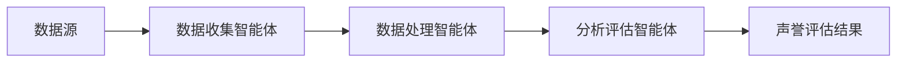

# 智能体协作实现全面的公司声誉分析

> 关键词：智能体协作、公司声誉分析、多源数据融合、自然语言处理、机器学习

> 摘要：本文聚焦于如何利用智能体协作来实现全面的公司声誉分析。随着市场竞争的加剧，公司声誉的重要性日益凸显，全面准确的声誉分析能够为公司决策提供有力支持。通过智能体协作，可以整合多源数据，利用自然语言处理和机器学习等技术，实现对公司声誉的多角度、深层次分析。文章详细介绍了核心概念、算法原理、数学模型，结合项目实战案例进行代码解读，探讨了实际应用场景，推荐了相关工具和资源，最后对未来发展趋势与挑战进行了总结。

## 1. 背景介绍 
### 1.1 目的和范围
公司声誉是企业在市场中生存和发展的重要资产，它直接影响着公司的品牌形象、客户忠诚度和市场竞争力。本文章的目的在于探讨如何运用智能体协作的方式，实现对公司声誉的全面、准确分析。范围涵盖了从多源数据的收集与整合，到数据的处理与分析，再到最终的声誉评估与呈现等整个流程。

### 1.2 预期读者
本文预期读者包括企业管理人员、市场营销人员、数据分析师、人工智能研究者以及对公司声誉分析感兴趣的技术爱好者。企业管理人员可以通过本文了解如何利用智能体协作提升公司声誉管理水平；市场营销人员能从中获取声誉分析的新思路和方法；数据分析师和人工智能研究者可以借鉴其中的技术实现和算法原理；技术爱好者则可以拓展对智能体和声誉分析领域的认知。

### 1.3 文档结构概述
本文将按照以下结构进行阐述：首先介绍智能体协作和公司声誉分析的核心概念及它们之间的联系；接着详细讲解实现全面公司声誉分析所涉及的核心算法原理和具体操作步骤，并给出Python源代码示例；然后介绍相关的数学模型和公式，并举例说明其应用；通过项目实战案例，展示代码的实际实现和详细解读；探讨智能体协作在公司声誉分析中的实际应用场景；推荐相关的工具和资源；最后总结未来发展趋势与挑战，并提供常见问题解答和扩展阅读参考资料。

### 1.4 术语表
#### 1.4.1 核心术语定义
- **智能体（Agent）**：是一种能够感知环境、自主决策并采取行动以实现特定目标的实体。在公司声誉分析中，智能体可以是软件程序，负责完成数据收集、处理、分析等任务。
- **公司声誉（Corporate Reputation）**：是社会公众对公司的综合评价和印象，包括公司的产品质量、服务水平、社会责任、财务状况等多个方面。
- **多源数据融合（Multi - source Data Fusion）**：将来自不同数据源的数据进行整合和处理，以获取更全面、准确的信息。在公司声誉分析中，数据源可以包括社交媒体、新闻报道、客户评价等。

#### 1.4.2 相关概念解释
- **自然语言处理（Natural Language Processing，NLP）**：是人工智能的一个重要分支，主要研究如何让计算机理解和处理人类语言。在公司声誉分析中，NLP技术可以用于对文本数据进行情感分析、主题提取等。
- **机器学习（Machine Learning）**：是一门多领域交叉学科，涉及概率论、统计学、逼近论、凸分析、算法复杂度理论等多门学科。它专门研究计算机怎样模拟或实现人类的学习行为，以获取新的知识或技能，重新组织已有的知识结构使之不断改善自身的性能。在公司声誉分析中，机器学习算法可以用于构建声誉评估模型。

#### 1.4.3 缩略词列表
- **NLP**：Natural Language Processing（自然语言处理）
- **ML**：Machine Learning（机器学习）
- **API**：Application Programming Interface（应用程序编程接口）

## 2. 核心概念与联系 

### 核心概念原理
#### 智能体
智能体是具有自主性、反应性、社会性和主动性的实体。在公司声誉分析中，智能体可以分为不同的类型，如数据收集智能体、数据处理智能体和分析评估智能体。
- 数据收集智能体负责从各种数据源（如社交媒体平台、新闻网站、行业论坛等）收集与公司相关的数据。它可以通过网络爬虫技术、API接口等方式获取数据。
- 数据处理智能体对收集到的原始数据进行清洗、预处理和特征提取。例如，去除重复数据、处理缺失值、进行文本分词等操作。
- 分析评估智能体利用机器学习和自然语言处理技术对处理后的数据进行分析和评估，得出公司的声誉得分和相关分析报告。

#### 公司声誉分析
公司声誉分析是一个综合性的过程，需要考虑多个方面的因素。它主要基于多源数据，包括定性数据（如文本评论、新闻报道）和定量数据（如财务指标、市场份额）。通过对这些数据的分析，可以了解公司在不同利益相关者心目中的形象和评价，发现公司的优势和不足，为公司的战略决策提供依据。

### 架构的文本示意图
```plaintext
+-------------------+
| 数据源            |
| （社交媒体、新闻  |
|  网站、行业论坛等）|
+-------------------+
         |
         v
+-------------------+
| 数据收集智能体    |
+-------------------+
         |
         v
+-------------------+
| 数据处理智能体    |
+-------------------+
         |
         v
+-------------------+
| 分析评估智能体    |
+-------------------+
         |
         v
+-------------------+
| 声誉评估结果      |
| （得分、报告等）  |
+-------------------+
```

### Mermaid流程图


## 3. 核心算法原理 & 具体操作步骤 

### 核心算法原理
#### 情感分析算法
情感分析是公司声誉分析中的重要环节，它可以判断文本数据中表达的情感倾向（积极、消极或中性）。常见的情感分析算法有基于词典的方法和基于机器学习的方法。
- 基于词典的方法：通过构建情感词典，将文本中的词语与词典中的情感极性进行匹配，计算文本的情感得分。例如，“好”“棒”等词语为积极情感，“坏”“差”等词语为消极情感。
- 基于机器学习的方法：使用训练好的分类模型对文本进行分类。常见的分类算法有朴素贝叶斯、支持向量机、深度学习模型（如卷积神经网络、循环神经网络）等。

#### 主题提取算法
主题提取可以帮助我们了解文本数据所涉及的主要主题。常用的主题提取算法有潜在狄利克雷分配（LDA）和非负矩阵分解（NMF）。
- LDA：是一种生成式概率模型，它假设文档是由多个主题混合而成，每个主题又由多个单词组成。通过对文档集合进行训练，可以得到每个文档的主题分布和每个主题的单词分布。
- NMF：是一种线性代数方法，它将文档 - 单词矩阵分解为两个非负矩阵的乘积，其中一个矩阵表示文档的主题分布，另一个矩阵表示主题的单词分布。

### 具体操作步骤
#### 数据收集
使用Python的`requests`库和`BeautifulSoup`库进行网络爬虫，获取社交媒体和新闻网站上的公司相关数据。示例代码如下：
```python
import requests
from bs4 import BeautifulSoup

def get_news_data(url):
    response = requests.get(url)
    if response.status_code == 200:
        soup = BeautifulSoup(response.text, 'html.parser')
        # 这里需要根据具体的网页结构提取新闻内容
        news_content = soup.find_all('p')
        return [p.text for p in news_content]
    else:
        return []

url = 'https://example.com/news'
news_data = get_news_data(url)
print(news_data)
```

#### 数据预处理
对收集到的数据进行清洗和预处理，包括去除停用词、标点符号，进行分词等操作。示例代码如下：
```python
import re
import jieba
from sklearn.feature_extraction.text import ENGLISH_STOP_WORDS

def preprocess_text(text):
    # 去除标点符号
    text = re.sub(r'[^\w\s]', '', text)
    # 分词
    words = jieba.lcut(text)
    # 去除停用词
    stop_words = set(ENGLISH_STOP_WORDS)
    filtered_words = [word for word in words if word not in stop_words]
    return ' '.join(filtered_words)

preprocessed_news = [preprocess_text(text) for text in news_data]
print(preprocessed_news)
```

#### 情感分析
使用`TextBlob`库进行简单的情感分析。示例代码如下：
```python
from textblob import TextBlob

def sentiment_analysis(text):
    blob = TextBlob(text)
    sentiment = blob.sentiment.polarity
    if sentiment > 0:
        return '积极'
    elif sentiment < 0:
        return '消极'
    else:
        return '中性'

sentiments = [sentiment_analysis(text) for text in preprocessed_news]
print(sentiments)
```

#### 主题提取
使用`sklearn`库中的`LatentDirichletAllocation`进行主题提取。示例代码如下：
```python
from sklearn.feature_extraction.text import CountVectorizer
from sklearn.decomposition import LatentDirichletAllocation

# 构建词袋模型
vectorizer = CountVectorizer()
X = vectorizer.fit_transform(preprocessed_news)

# 训练LDA模型
lda = LatentDirichletAllocation(n_components=3, random_state=42)
lda.fit(X)

# 输出每个主题的前10个关键词
feature_names = vectorizer.get_feature_names_out()
for topic_idx, topic in enumerate(lda.components_):
    print(f"主题 {topic_idx}:")
    top_words = [feature_names[i] for i in topic.argsort()[:-10 - 1:-1]]
    print(top_words)
```

## 4. 数学模型和公式 & 详细讲解 & 举例说明 

### 情感分析数学模型
#### 基于词典的情感分析
假设我们有一个情感词典 $D$，其中每个词语 $w$ 都有一个对应的情感极性值 $p(w)$。对于一个文本 $T$，它由 $n$ 个词语 $w_1, w_2, \cdots, w_n$ 组成，文本的情感得分 $S(T)$ 可以通过以下公式计算：
$$S(T)=\sum_{i = 1}^{n}p(w_i)$$

例如，文本 “这家公司的产品很好，服务也很棒”，假设 “好” 的情感极性值为 $1$，“棒” 的情感极性值为 $1$，其他词语的情感极性值为 $0$，则该文本的情感得分 $S(T)=1 + 1=2$，表示积极情感。

#### 基于机器学习的情感分析
以朴素贝叶斯分类器为例，假设我们有一个文本分类问题，类别集合为 $C=\{c_1, c_2, \cdots, c_k\}$，文本特征向量为 $x=(x_1, x_2, \cdots, x_n)$。根据贝叶斯定理，文本 $x$ 属于类别 $c_j$ 的概率为：
$$P(c_j|x)=\frac{P(x|c_j)P(c_j)}{P(x)}$$
由于 $P(x)$ 对于所有类别都是相同的，因此我们只需要比较 $P(x|c_j)P(c_j)$ 的大小来确定文本的类别。在朴素贝叶斯分类器中，假设特征之间相互独立，则有：
$$P(x|c_j)=\prod_{i = 1}^{n}P(x_i|c_j)$$

例如，在情感分析中，类别 $C=\{积极, 消极, 中性\}$，特征向量 $x$ 可以是文本中词语的出现频率。通过训练数据集计算出 $P(c_j)$ 和 $P(x_i|c_j)$，对于一个新的文本，计算 $P(c_j|x)$ 并选择概率最大的类别作为文本的情感类别。

### 主题提取数学模型
#### 潜在狄利克雷分配（LDA）
LDA模型的核心假设是文档是由多个主题混合而成，每个主题又由多个单词组成。设文档集合为 $D=\{d_1, d_2, \cdots, d_M\}$，单词集合为 $V=\{v_1, v_2, \cdots, v_N\}$，主题集合为 $K=\{k_1, k_2, \cdots, k_T\}$。
- 文档 - 主题分布：每个文档 $d$ 都有一个主题分布 $\theta_d$，其中 $\theta_{d,k}$ 表示文档 $d$ 中主题 $k$ 的概率。
- 主题 - 单词分布：每个主题 $k$ 都有一个单词分布 $\phi_k$，其中 $\phi_{k,v}$ 表示主题 $k$ 中单词 $v$ 的概率。

LDA模型的生成过程如下：
1. 对于每个文档 $d$，从狄利克雷分布 $\text{Dir}(\alpha)$ 中采样一个主题分布 $\theta_d$。
2. 对于文档 $d$ 中的每个单词 $w$：
    - 从主题分布 $\theta_d$ 中采样一个主题 $z$。
    - 从主题 $z$ 的单词分布 $\phi_z$ 中采样一个单词 $w$。

通过最大似然估计或变分推断等方法，可以估计出 $\theta$ 和 $\phi$ 的值。

例如，假设有一个文档集合包含3个文档，主题数为2，单词数为4。通过LDA模型训练后，得到文档 - 主题分布 $\theta$ 和主题 - 单词分布 $\phi$ 如下：
$$\theta=\begin{bmatrix}
0.6 & 0.4\\
0.3 & 0.7\\
0.8 & 0.2
\end{bmatrix}$$
$$\phi=\begin{bmatrix}
0.2 & 0.3 & 0.4 & 0.1\\
0.1 & 0.2 & 0.1 & 0.6
\end{bmatrix}$$
对于第一个文档，它更倾向于主题1（概率为0.6）；对于主题1，单词3的概率最大（为0.4）。

## 5. 项目实战：代码实际案例和详细解释说明 

### 5.1  开发环境搭建
#### 安装Python
首先需要安装Python 3.x版本，可以从Python官方网站（https://www.python.org/downloads/）下载并安装。

#### 安装必要的库
使用`pip`命令安装项目所需的库，包括`requests`、`beautifulsoup4`、`jieba`、`textblob`、`sklearn`等。示例命令如下：
```sh
pip install requests beautifulsoup4 jieba textblob scikit-learn
```

### 5.2  源代码详细实现和代码解读
以下是一个完整的公司声誉分析项目的代码示例：
```python
import requests
from bs4 import BeautifulSoup
import re
import jieba
from sklearn.feature_extraction.text import ENGLISH_STOP_WORDS
from textblob import TextBlob
from sklearn.feature_extraction.text import CountVectorizer
from sklearn.decomposition import LatentDirichletAllocation

# 数据收集函数
def get_news_data(url):
    response = requests.get(url)
    if response.status_code == 200:
        soup = BeautifulSoup(response.text, 'html.parser')
        news_content = soup.find_all('p')
        return [p.text for p in news_content]
    else:
        return []

# 数据预处理函数
def preprocess_text(text):
    text = re.sub(r'[^\w\s]', '', text)
    words = jieba.lcut(text)
    stop_words = set(ENGLISH_STOP_WORDS)
    filtered_words = [word for word in words if word not in stop_words]
    return ' '.join(filtered_words)

# 情感分析函数
def sentiment_analysis(text):
    blob = TextBlob(text)
    sentiment = blob.sentiment.polarity
    if sentiment > 0:
        return '积极'
    elif sentiment < 0:
        return '消极'
    else:
        return '中性'

# 主题提取函数
def topic_extraction(texts, n_topics=3):
    vectorizer = CountVectorizer()
    X = vectorizer.fit_transform(texts)
    lda = LatentDirichletAllocation(n_components=n_topics, random_state=42)
    lda.fit(X)
    feature_names = vectorizer.get_feature_names_out()
    topics = []
    for topic_idx, topic in enumerate(lda.components_):
        top_words = [feature_names[i] for i in topic.argsort()[:-10 - 1:-1]]
        topics.append(top_words)
    return topics

# 主函数
def main():
    url = 'https://example.com/news'
    # 数据收集
    news_data = get_news_data(url)
    # 数据预处理
    preprocessed_news = [preprocess_text(text) for text in news_data]
    # 情感分析
    sentiments = [sentiment_analysis(text) for text in preprocessed_news]
    # 主题提取
    topics = topic_extraction(preprocessed_news)

    print("新闻内容：", news_data)
    print("预处理后的新闻内容：", preprocessed_news)
    print("情感分析结果：", sentiments)
    print("主题提取结果：", topics)

if __name__ == "__main__":
    main()
```

### 5.3  代码解读与分析
- **数据收集部分**：`get_news_data`函数使用`requests`库发送HTTP请求获取网页内容，然后使用`BeautifulSoup`库解析HTML文档，提取新闻内容。
- **数据预处理部分**：`preprocess_text`函数对文本进行清洗和预处理，包括去除标点符号、分词和去除停用词。
- **情感分析部分**：`sentiment_analysis`函数使用`TextBlob`库计算文本的情感极性，并判断情感类别。
- **主题提取部分**：`topic_extraction`函数使用`sklearn`库中的`CountVectorizer`构建词袋模型，然后使用`LatentDirichletAllocation`进行主题提取。
- **主函数**：`main`函数调用上述各个函数，完成数据收集、预处理、情感分析和主题提取的整个流程，并输出结果。

## 6. 实际应用场景 
### 企业战略决策
企业管理人员可以根据公司声誉分析结果制定战略决策。例如，如果分析结果显示公司在某个产品领域的声誉不佳，企业可以考虑调整产品策略，加大研发投入，提升产品质量。如果在社会责任方面的声誉较好，可以继续加强这方面的工作，提升企业的社会形象。

### 市场营销活动
市场营销人员可以利用声誉分析结果制定更有效的市场营销策略。例如，根据不同地区、不同客户群体对公司的评价，制定个性化的营销方案。如果在社交媒体上发现某个话题引起了广泛的关注和好评，可以针对这个话题开展营销活动，扩大品牌影响力。

### 危机管理
当公司面临负面事件时，声誉分析可以帮助企业及时发现问题，采取有效的措施进行危机管理。通过实时监测社交媒体和新闻报道，了解公众的反应和态度，及时发布澄清声明，纠正错误信息，降低负面事件对公司声誉的影响。

### 投资者关系管理
投资者会关注公司的声誉情况，因为良好的声誉意味着公司具有更高的稳定性和发展潜力。公司可以通过定期发布声誉分析报告，向投资者展示公司的良好形象，增强投资者的信心，吸引更多的投资。

## 7. 工具和资源推荐
### 7.1 学习资源推荐
#### 7.1.1 书籍推荐
- 《Python自然语言处理实战：核心技术与算法》：详细介绍了Python在自然语言处理领域的应用，包括文本分类、情感分析、主题建模等内容。
- 《机器学习》（周志华著）：全面介绍了机器学习的基本概念、算法和应用，是机器学习领域的经典教材。
- 《智能体系统：原理、技术与应用》：深入讲解了智能体的基本原理、体系结构和应用场景，对理解智能体协作有很大帮助。

#### 7.1.2 在线课程
- Coursera上的“Natural Language Processing Specialization”：由斯坦福大学教授授课，系统介绍了自然语言处理的理论和实践。
- edX上的“Artificial Intelligence”：涵盖了人工智能的各个方面，包括智能体技术和机器学习算法。
- 中国大学MOOC上的“Python数据分析与应用”：讲解了Python在数据分析领域的应用，对公司声誉分析中的数据处理和分析有很大帮助。

#### 7.1.3 技术博客和网站
- 博客园：有很多技术开发者分享关于自然语言处理、机器学习和智能体技术的经验和心得。
- 开源中国：提供了丰富的开源项目和技术文章，对学习和实践有很大的参考价值。
- 机器之心：专注于人工智能领域的新闻和技术解读，及时报道最新的研究成果和应用案例。

### 7.2 开发工具框架推荐
#### 7.2.1 IDE和编辑器
- PyCharm：是一款专门为Python开发设计的集成开发环境，具有强大的代码编辑、调试和项目管理功能。
- Visual Studio Code：是一款轻量级的代码编辑器，支持多种编程语言和插件扩展，非常适合快速开发和调试。

#### 7.2.2 调试和性能分析工具
- PDB：Python自带的调试器，可以帮助开发者定位和解决代码中的问题。
- cProfile：Python的性能分析工具，可以分析代码的运行时间和函数调用情况，帮助优化代码性能。

#### 7.2.3 相关框架和库
- NLTK：自然语言处理工具包，提供了丰富的语料库和工具，可用于文本处理、词性标注、情感分析等任务。
- TensorFlow：开源的机器学习框架，可用于构建和训练深度学习模型，在情感分析和主题提取等任务中具有广泛应用。
- Gensim：用于主题建模、文档索引和相似性检索的Python库，提供了高效的LDA和Word2Vec等算法实现。

### 7.3 相关论文著作推荐
#### 7.3.1 经典论文
- “Latent Dirichlet Allocation”：LDA模型的经典论文，详细介绍了LDA的原理和算法。
- “A Sentiment Lexicon for Twitter”：提出了一种用于Twitter文本情感分析的情感词典构建方法。
- “Intelligent Agents: Theory and Practice”：对智能体的理论和实践进行了系统的阐述。

#### 7.3.2 最新研究成果
- 可以通过IEEE Xplore、ACM Digital Library等学术数据库搜索关于智能体协作和公司声誉分析的最新研究论文。这些论文通常会介绍新的算法、模型和应用案例。

#### 7.3.3 应用案例分析
- 一些知名企业的年度报告中可能会包含公司声誉分析的应用案例，可以从中学习到实际应用中的经验和方法。此外，一些咨询公司和研究机构也会发布相关的研究报告和案例分析。

## 8. 总结：未来发展趋势与挑战
### 未来发展趋势
#### 多智能体协作的深度融合
未来，智能体之间的协作将更加紧密和深入。不同类型的智能体可以在不同的层次和阶段进行协作，实现数据的高效共享和处理。例如，数据收集智能体可以与分析评估智能体实时交互，根据分析结果动态调整数据收集策略。

#### 与其他技术的融合
智能体协作将与区块链、物联网等技术进行深度融合。区块链技术可以保证数据的安全性和不可篡改，物联网技术可以提供更丰富的数据源。例如，通过物联网设备收集公司产品的使用数据，结合智能体协作进行声誉分析。

#### 实时性和智能化程度的提升
随着技术的发展，公司声誉分析将实现更高的实时性和智能化程度。智能体可以实时监测和分析多源数据，及时发现声誉风险，并自动采取相应的措施。例如，当发现社交媒体上出现负面舆情时，智能体可以自动生成应对方案。

### 挑战
#### 数据质量和隐私问题
多源数据的质量参差不齐，存在噪声和错误数据，这会影响声誉分析的准确性。同时，数据隐私问题也日益突出，如何在保护用户隐私的前提下进行数据收集和分析是一个亟待解决的问题。

#### 智能体的协调和管理
多个智能体之间的协调和管理是一个挑战。不同智能体可能具有不同的目标和行为模式，如何保证它们之间的协作顺畅，避免冲突和重复工作是需要研究的问题。

#### 模型的可解释性
一些复杂的机器学习模型（如深度学习模型）具有较高的预测准确率，但缺乏可解释性。在公司声誉分析中，需要能够解释模型的决策过程，以便企业管理人员理解和应用分析结果。

## 9. 附录：常见问题与解答
### 问题1：如何选择合适的数据源进行公司声誉分析？
答：选择数据源时需要考虑数据源的相关性、权威性和多样性。相关性是指数据源与公司声誉相关，如社交媒体、新闻报道、客户评价等。权威性是指数据源的可信度高，如知名新闻网站、行业权威机构发布的数据。多样性是指涵盖不同类型的数据源，以获取更全面的信息。

### 问题2：如何提高情感分析的准确性？
答：可以从以下几个方面提高情感分析的准确性：
- 使用更准确的情感词典：可以根据具体的应用场景构建自定义的情感词典。
- 结合上下文信息：考虑文本的上下文信息，避免孤立地分析词语的情感极性。
- 使用更复杂的机器学习模型：如深度学习模型，通过大量的训练数据来提高模型的性能。

### 问题3：如何评估主题提取的效果？
答：可以使用以下方法评估主题提取的效果：
- 主题的连贯性：检查每个主题中的关键词是否具有相关性和连贯性。
- 主题的可解释性：判断主题是否能够清晰地表达文本的主要内容。
- 与人工标注的一致性：可以邀请人工对文本进行主题标注，然后比较自动提取的主题与人工标注的一致性。

## 10. 扩展阅读 & 参考资料
### 扩展阅读
- 《大数据时代：生活、工作与思维的大变革》：介绍了大数据的概念、特点和应用，对理解公司声誉分析中的多源数据有帮助。
- 《人工智能时代：人机共生下财富、工作与思维的大未来》：探讨了人工智能对社会和经济的影响，以及未来的发展趋势。

### 参考资料
- 相关学术论文和研究报告，如在IEEE Xplore、ACM Digital Library等学术数据库中搜索到的关于智能体协作和公司声誉分析的论文。
- 开源项目的文档和代码，如NLTK、TensorFlow等开源库的官方文档。
- 行业新闻和资讯，如36氪、虎嗅网等网站上关于公司声誉管理和人工智能应用的新闻报道。