# 智能体协作评估公司的创新文化：长期价值创造的源泉

> 关键词：智能体协作、创新文化评估、长期价值创造、公司文化、评估方法

> 摘要：本文聚焦于利用智能体协作来评估公司的创新文化，深入探讨创新文化作为长期价值创造源泉的重要性。首先介绍了研究的背景、目的、预期读者等内容，接着阐述了智能体协作和创新文化的核心概念及联系，详细讲解了用于评估的核心算法原理与操作步骤，给出了相关数学模型和公式。通过项目实战展示了具体代码案例和解读，分析了实际应用场景。同时推荐了学习资源、开发工具框架以及相关论文著作。最后总结了未来发展趋势与挑战，提供了常见问题解答和扩展阅读参考资料，旨在为企业通过智能体协作评估创新文化以实现长期价值创造提供全面的理论和实践指导。

## 1. 背景介绍 
### 1.1 目的和范围
在当今竞争激烈的商业环境中，公司的创新文化对于其长期发展和价值创造起着至关重要的作用。本研究的目的是探索如何利用智能体协作来评估公司的创新文化，为企业提供一种科学、有效的评估方法，以识别公司创新文化的优势和不足，进而采取针对性的措施来加强创新文化建设，实现长期价值创造。

研究范围涵盖了智能体协作的原理、创新文化的内涵和评估方法，以及如何将智能体协作应用于创新文化评估的具体过程。同时，通过实际案例分析，验证该评估方法的有效性和实用性。

### 1.2 预期读者
本文的预期读者包括企业管理者、创新研究者、技术开发者以及对公司创新文化和智能体技术感兴趣的人士。企业管理者可以通过本文了解如何利用智能体协作评估公司创新文化，为企业的战略决策提供依据；创新研究者可以从理论和方法上获得新的启示；技术开发者可以借鉴本文的算法和代码实现，开展相关的技术研发；对该领域感兴趣的人士可以通过本文了解智能体协作和创新文化评估的基本概念和方法。

### 1.3 文档结构概述
本文共分为十个部分。第一部分为背景介绍，阐述了研究的目的、范围、预期读者和文档结构概述；第二部分介绍了智能体协作和创新文化的核心概念与联系，并给出了相应的文本示意图和 Mermaid 流程图；第三部分详细讲解了用于评估的核心算法原理和具体操作步骤，并使用 Python 源代码进行了阐述；第四部分给出了相关的数学模型和公式，并进行了详细讲解和举例说明；第五部分通过项目实战展示了具体的代码案例和详细解释说明；第六部分分析了智能体协作评估公司创新文化的实际应用场景；第七部分推荐了学习资源、开发工具框架以及相关论文著作；第八部分总结了未来发展趋势与挑战；第九部分为附录，提供了常见问题与解答；第十部分列出了扩展阅读和参考资料。

### 1.4 术语表
#### 1.4.1 核心术语定义
- **智能体（Agent）**：是一种具有自主决策能力的实体，能够感知环境、处理信息并根据自身的目标和规则采取行动。
- **智能体协作（Agent Collaboration）**：多个智能体通过交互和合作，共同完成一个或多个任务的过程。
- **创新文化（Innovation Culture）**：公司内部形成的一种鼓励创新、支持冒险、包容失败的文化氛围，它影响着员工的创新行为和公司的创新绩效。
- **创新文化评估（Innovation Culture Assessment）**：对公司创新文化的现状进行全面、系统的评价，以了解公司创新文化的优势和不足。

#### 1.4.2 相关概念解释
- **多智能体系统（Multi - Agent System，MAS）**：由多个智能体组成的系统，这些智能体之间可以进行通信、协作和竞争，以实现共同的目标。
- **文化维度（Cultural Dimensions）**：用于描述和衡量文化差异的多个方面，如个人主义与集体主义、权力距离、不确定性规避等。在创新文化评估中，文化维度可以帮助我们从不同的角度理解公司的创新文化。

#### 1.4.3 缩略词列表
- MAS：Multi - Agent System（多智能体系统）
- AI：Artificial Intelligence（人工智能）

## 2. 核心概念与联系 

### 2.1 智能体协作的原理
智能体协作是基于多智能体系统的一种技术，其核心原理是多个智能体通过通信和交互，共享信息、协调行动，以实现共同的目标。每个智能体具有一定的自主性和决策能力，它们可以根据自身的感知和规则做出决策，并与其他智能体进行协作。

智能体协作的过程通常包括以下几个步骤：
1. **感知环境**：智能体通过传感器等设备感知周围的环境信息。
2. **信息处理**：智能体对感知到的信息进行处理和分析，以形成决策依据。
3. **决策制定**：智能体根据自身的目标和规则，结合处理后的信息，做出决策。
4. **通信与协作**：智能体与其他智能体进行通信，共享信息和协调行动，以实现共同的目标。

### 2.2 创新文化的内涵
创新文化是公司内部形成的一种鼓励创新、支持冒险、包容失败的文化氛围。它包括以下几个方面的内涵：
- **价值观**：公司的价值观是创新文化的核心，它体现了公司对创新的重视程度和追求目标。例如，一些公司将创新视为核心价值观，鼓励员工勇于尝试新的想法和方法。
- **行为规范**：创新文化需要有相应的行为规范来引导员工的行为。例如，公司可以制定鼓励员工提出创新想法的制度，对创新行为给予奖励等。
- **组织氛围**：公司的组织氛围对创新文化的形成和发展起着重要的作用。一个开放、包容、合作的组织氛围有利于激发员工的创新活力。

### 2.3 智能体协作与创新文化评估的联系
智能体协作可以为创新文化评估提供一种新的方法和手段。通过智能体协作，可以实现对公司创新文化的多维度、动态评估。具体来说，智能体可以通过以下方式参与创新文化评估：
- **数据收集**：智能体可以通过多种渠道收集公司内部的各种数据，如员工的行为数据、沟通数据等，为创新文化评估提供丰富的数据支持。
- **数据分析**：智能体可以利用数据分析技术对收集到的数据进行处理和分析，挖掘数据中蕴含的信息，从而评估公司的创新文化现状。
- **评估报告生成**：智能体可以根据分析结果生成详细的评估报告，为公司管理者提供决策依据。

### 2.4 核心概念原理和架构的文本示意图
```plaintext
智能体协作评估公司创新文化架构

             智能体协作系统
           /                \
数据收集智能体         数据分析智能体
     |                      |
收集员工行为数据  处理和分析数据
     |                      |
    \|/                    \|/
      数据存储与管理
             |
             |
      评估报告生成智能体
             |
             |
        创新文化评估报告
```

### 2.5 Mermaid 流程图

```mermaid
graph LR
    classDef startend fill:#F5EBFF,stroke:#BE8FED,stroke-width:2px
    classDef process fill:#E5F6FF,stroke:#73A6FF,stroke-width:2px
    classDef decision fill:#FFF6CC,stroke:#FFBC52,stroke-width:2px
    
    A([开始]):::startend --> B(数据收集智能体):::process
    B --> C(收集员工行为数据):::process
    C --> D(数据存储与管理):::process
    D --> E(数据分析智能体):::process
    E --> F(处理和分析数据):::process
    F --> G(评估报告生成智能体):::process
    G --> H(生成创新文化评估报告):::process
    H --> I([结束]):::startend
```


## 3. 核心算法原理 & 具体操作步骤 

### 3.1 核心算法原理
我们采用基于机器学习的算法来进行创新文化评估，具体使用的是支持向量机（Support Vector Machine，SVM）算法。支持向量机是一种有监督的机器学习算法，它通过寻找一个最优的超平面来对数据进行分类。

在创新文化评估中，我们将公司的各种数据（如员工的行为数据、沟通数据等）作为输入，将创新文化的评估结果（如创新水平高、中、低）作为输出。通过训练支持向量机模型，我们可以得到一个能够对公司创新文化进行准确评估的模型。

### 3.2 具体操作步骤

#### 3.2.1 数据收集
使用数据收集智能体通过多种渠道收集公司内部的各种数据，包括员工的行为数据（如工作时间、工作效率等）、沟通数据（如邮件往来、会议记录等）。

#### 3.2.2 数据预处理
对收集到的数据进行预处理，包括数据清洗、数据归一化等操作。数据清洗是指去除数据中的噪声和异常值；数据归一化是指将数据转换到一个统一的尺度上，以便于后续的分析。

#### 3.2.3 特征提取
从预处理后的数据中提取特征，这些特征将作为支持向量机模型的输入。例如，我们可以提取员工的工作效率、沟通频率等特征。

#### 3.2.4 模型训练
使用训练数据集对支持向量机模型进行训练。训练数据集包括输入特征和对应的输出标签（创新文化评估结果）。通过不断调整模型的参数，使得模型的预测结果与实际结果尽可能接近。

#### 3.2.5 模型评估
使用测试数据集对训练好的模型进行评估，计算模型的准确率、召回率等指标，以评估模型的性能。

#### 3.2.6 评估报告生成
根据模型的评估结果，生成详细的创新文化评估报告，为公司管理者提供决策依据。

### 3.3 Python 源代码详细阐述

```python
import numpy as np
from sklearn import svm
from sklearn.model_selection import train_test_split
from sklearn.preprocessing import StandardScaler
from sklearn.metrics import accuracy_score

# 模拟数据收集
# 假设我们有 100 个样本，每个样本有 5 个特征
X = np.random.rand(100, 5)
# 模拟创新文化评估结果，0 表示创新水平低，1 表示创新水平高
y = np.random.randint(0, 2, 100)

# 数据预处理：数据归一化
scaler = StandardScaler()
X = scaler.fit_transform(X)

# 划分训练集和测试集
X_train, X_test, y_train, y_test = train_test_split(X, y, test_size=0.2, random_state=42)

# 模型训练
clf = svm.SVC(kernel='linear')
clf.fit(X_train, y_train)

# 模型预测
y_pred = clf.predict(X_test)

# 模型评估
accuracy = accuracy_score(y_test, y_pred)
print(f"模型准确率: {accuracy}")

# 模拟评估报告生成
if accuracy > 0.8:
    print("创新文化评估结果：创新水平较高，建议继续保持和加强创新文化建设。")
else:
    print("创新文化评估结果：创新水平有待提高，建议采取措施加强创新文化建设。")
```

## 4. 数学模型和公式 & 详细讲解 & 举例说明 

### 4.1 支持向量机的数学模型
支持向量机的目标是寻找一个最优的超平面，使得不同类别的数据点能够被最大程度地分开。对于线性可分的数据集，支持向量机的数学模型可以表示为：

$$
\min_{w,b} \frac{1}{2} \| w \|^2
$$

subject to

$$
y_i (w^T x_i + b) \geq 1, i = 1,2,\cdots,n
$$

其中，$w$ 是超平面的法向量，$b$ 是超平面的偏移量，$x_i$ 是第 $i$ 个数据点，$y_i$ 是第 $i$ 个数据点的标签（$y_i \in \{ - 1,1\}$），$n$ 是数据点的数量。

### 4.2 详细讲解
上述数学模型的目标是最小化 $\frac{1}{2} \| w \|^2$，这等价于最大化不同类别数据点到超平面的间隔。约束条件 $y_i (w^T x_i + b) \geq 1$ 表示所有的数据点都必须位于超平面的正确一侧，并且到超平面的距离至少为 1。

通过求解上述优化问题，我们可以得到最优的 $w$ 和 $b$，从而确定最优的超平面。

### 4.3 举例说明
假设我们有一个二维数据集，包含两个类别的数据点：正类（$y = 1$）和负类（$y=-1$）。我们的目标是找到一个最优的直线（二维空间中的超平面）来将这两个类别的数据点分开。

例如，给定以下数据点：
- 正类数据点：$(1,2)$，$(2,3)$
- 负类数据点：$(-1,-2)$，$(-2,-3)$

我们可以使用支持向量机算法来寻找最优的直线。通过求解上述优化问题，我们可以得到最优的 $w$ 和 $b$，从而确定最优的直线方程 $w_1 x_1 + w_2 x_2 + b = 0$。

## 5. 项目实战：代码实际案例和详细解释说明 

### 5.1 开发环境搭建
#### 5.1.1 安装 Python
首先，需要安装 Python 编程语言。建议安装 Python 3.7 及以上版本，可以从 Python 官方网站（https://www.python.org/downloads/）下载并安装。

#### 5.1.2 安装必要的库
使用以下命令安装必要的 Python 库：
```bash
pip install numpy scikit-learn
```

### 5.2 源代码详细实现和代码解读

```python
import numpy as np
from sklearn import svm
from sklearn.model_selection import train_test_split
from sklearn.preprocessing import StandardScaler
from sklearn.metrics import accuracy_score

# 模拟数据收集
# 假设我们有 100 个样本，每个样本有 5 个特征
X = np.random.rand(100, 5)
# 模拟创新文化评估结果，0 表示创新水平低，1 表示创新水平高
y = np.random.randint(0, 2, 100)

# 数据预处理：数据归一化
scaler = StandardScaler()
X = scaler.fit_transform(X)

# 划分训练集和测试集
X_train, X_test, y_train, y_test = train_test_split(X, y, test_size=0.2, random_state=42)

# 模型训练
clf = svm.SVC(kernel='linear')
clf.fit(X_train, y_train)

# 模型预测
y_pred = clf.predict(X_test)

# 模型评估
accuracy = accuracy_score(y_test, y_pred)
print(f"模型准确率: {accuracy}")

# 模拟评估报告生成
if accuracy > 0.8:
    print("创新文化评估结果：创新水平较高，建议继续保持和加强创新文化建设。")
else:
    print("创新文化评估结果：创新水平有待提高，建议采取措施加强创新文化建设。")
```

#### 代码解读：
1. **数据收集**：使用 `np.random.rand` 函数生成 100 个样本，每个样本有 5 个特征；使用 `np.random.randint` 函数生成对应的创新文化评估结果。
2. **数据预处理**：使用 `StandardScaler` 类对数据进行归一化处理，使得数据具有零均值和单位方差。
3. **划分训练集和测试集**：使用 `train_test_split` 函数将数据集划分为训练集和测试集，测试集占总数据集的 20%。
4. **模型训练**：使用 `svm.SVC` 类创建一个支持向量机分类器，指定核函数为线性核；使用 `fit` 方法对模型进行训练。
5. **模型预测**：使用 `predict` 方法对测试集进行预测，得到预测结果。
6. **模型评估**：使用 `accuracy_score` 函数计算模型的准确率。
7. **评估报告生成**：根据模型的准确率生成相应的评估报告。

### 5.3 代码解读与分析
通过上述代码，我们实现了一个简单的创新文化评估系统。代码的核心是使用支持向量机算法对公司的创新文化进行评估。

在实际应用中，我们需要根据具体的业务需求对代码进行改进和扩展。例如，我们可以使用更复杂的特征工程方法来提取更有价值的特征，使用更先进的机器学习算法来提高模型的性能，使用更真实的数据集来训练模型等。

## 6. 实际应用场景 
### 6.1 企业战略决策
企业管理者可以通过智能体协作评估公司的创新文化，了解公司的创新能力和潜力，从而制定更加科学、合理的战略决策。例如，如果评估结果显示公司的创新文化水平较高，企业可以加大对创新项目的投入，进一步提升公司的创新能力；如果评估结果显示公司的创新文化水平较低，企业可以采取措施加强创新文化建设，如制定创新激励政策、开展创新培训等。

### 6.2 创新项目评估
在企业开展创新项目时，可以使用智能体协作评估创新项目的可行性和潜力。通过评估项目团队的创新文化氛围、成员的创新能力等因素，可以提前发现项目可能存在的问题，及时调整项目方案，提高项目的成功率。

### 6.3 人才招聘与培养
在人才招聘过程中，企业可以使用智能体协作评估候选人的创新能力和与公司创新文化的匹配度。选择具有创新精神和创新能力的人才加入公司，有利于提升公司的整体创新水平。同时，企业可以根据评估结果为员工制定个性化的培训计划，培养员工的创新能力，促进员工与公司创新文化的融合。

### 6.4 企业文化建设
智能体协作评估公司创新文化可以为企业文化建设提供重要的参考依据。企业可以根据评估结果了解员工对创新文化的认知和需求，针对性地开展文化建设活动，营造良好的创新文化氛围。例如，企业可以组织创新主题的文化活动，鼓励员工分享创新经验和想法，增强员工的创新意识和团队凝聚力。

## 7. 工具和资源推荐
### 7.1 学习资源推荐
#### 7.1.1 书籍推荐
- 《人工智能：一种现代方法》（Artificial Intelligence: A Modern Approach）：这本书是人工智能领域的经典教材，全面介绍了人工智能的各个方面，包括智能体、机器学习、自然语言处理等。
- 《机器学习》（Machine Learning）：由周志华教授编写，系统地介绍了机器学习的基本概念、算法和应用，是学习机器学习的优秀教材。
- 《创新的艺术》（The Art of Innovation）：这本书介绍了创新的方法和技巧，以及如何在企业中营造创新文化，对于理解创新文化的内涵和建设具有重要的参考价值。

#### 7.1.2 在线课程
- Coursera 平台上的“机器学习”课程：由斯坦福大学教授 Andrew Ng 主讲，是学习机器学习的经典课程，课程内容丰富，讲解详细。
- edX 平台上的“人工智能基础”课程：介绍了人工智能的基本概念、算法和应用，适合初学者学习。
- Udemy 平台上的“创新管理与创业”课程：该课程介绍了创新管理的方法和技巧，以及如何在创业过程中实现创新。

#### 7.1.3 技术博客和网站
- Medium：这是一个技术博客平台，上面有很多关于人工智能、机器学习、创新文化等方面的文章，内容丰富，质量较高。
- Towards Data Science：专注于数据科学和机器学习领域的技术博客，提供了很多实用的技术文章和案例分析。
- Harvard Business Review：哈佛商业评论网站上有很多关于企业管理、创新文化等方面的文章，对于企业管理者和创新研究者具有重要的参考价值。

### 7.2 开发工具框架推荐
#### 7.2.1 IDE和编辑器
- PyCharm：是一款专门为 Python 开发设计的集成开发环境（IDE），具有代码编辑、调试、代码分析等功能，非常适合 Python 开发者使用。
- Jupyter Notebook：是一个基于 Web 的交互式计算环境，支持多种编程语言，特别适合进行数据分析和模型训练。
- Visual Studio Code：是一款轻量级的代码编辑器，支持多种编程语言和插件扩展，具有丰富的功能和良好的用户体验。

#### 7.2.2 调试和性能分析工具
- pdb：Python 自带的调试器，可以帮助开发者调试 Python 代码，查找代码中的错误。
- cProfile：Python 自带的性能分析工具，可以帮助开发者分析代码的性能瓶颈，优化代码性能。
- TensorBoard：是 TensorFlow 提供的可视化工具，可以帮助开发者可视化模型的训练过程和性能指标。

#### 7.2.3 相关框架和库
- Scikit-learn：是一个简单易用的机器学习库，提供了多种机器学习算法和工具，如分类、回归、聚类等。
- TensorFlow：是一个开源的深度学习框架，广泛应用于图像识别、自然语言处理等领域。
- PyTorch：是另一个流行的深度学习框架，具有简洁易用、动态图等特点，受到很多研究者和开发者的喜爱。

### 7.3 相关论文著作推荐
#### 7.3.1 经典论文
- “Support - Vector Networks”：这篇论文是支持向量机算法的经典论文，详细介绍了支持向量机的原理和算法实现。
- “A Mathematical Theory of Communication”：香农的这篇论文奠定了信息论的基础，对于理解数据处理和信息传输具有重要的意义。
- “The Innovator's Dilemma: When New Technologies Cause Great Firms to Fail”：这篇论文提出了“创新者的困境”理论，对于理解企业创新和发展具有重要的启示作用。

#### 7.3.2 最新研究成果
- 关注顶级学术会议（如 NeurIPS、ICML、AAAI 等）上的相关研究论文，了解智能体协作和创新文化评估领域的最新研究成果。
- 阅读顶级学术期刊（如 Journal of Artificial Intelligence Research、Artificial Intelligence 等）上的相关研究论文，掌握该领域的前沿动态。

#### 7.3.3 应用案例分析
- 分析一些知名企业（如谷歌、苹果、特斯拉等）的创新文化建设案例，了解它们在创新文化评估和建设方面的经验和做法。
- 参考一些研究机构发布的创新文化评估报告，如波士顿咨询公司（BCG）的全球创新 50 强报告，了解不同行业和企业的创新文化现状和发展趋势。

## 8. 总结：未来发展趋势与挑战
### 8.1 未来发展趋势
#### 8.1.1 智能化程度不断提高
随着人工智能技术的不断发展，智能体协作评估公司创新文化的智能化程度将不断提高。智能体将能够更加自主地收集数据、分析数据和生成评估报告，减少人工干预，提高评估的效率和准确性。

#### 8.1.2 与其他技术的融合
智能体协作将与其他技术（如大数据、物联网、区块链等）进行深度融合，为创新文化评估提供更加丰富的数据来源和更加先进的技术手段。例如，通过物联网技术可以实时收集员工的工作行为数据，为创新文化评估提供更加准确的依据。

#### 8.1.3 应用场景不断拓展
智能体协作评估公司创新文化的应用场景将不断拓展，不仅可以应用于企业的战略决策、创新项目评估等方面，还可以应用于政府部门、社会组织等领域，为不同组织的创新发展提供支持。

### 8.2 挑战
#### 8.2.1 数据隐私和安全问题
在智能体协作评估公司创新文化的过程中，需要收集和处理大量的员工数据，这涉及到数据隐私和安全问题。如何保护员工的数据隐私和安全，防止数据泄露和滥用，是一个亟待解决的问题。

#### 8.2.2 模型的可解释性问题
目前，一些机器学习模型（如深度学习模型）的可解释性较差，难以理解模型的决策过程和依据。在创新文化评估中，模型的可解释性非常重要，因为企业管理者需要了解评估结果的来源和依据，以便做出科学、合理的决策。

#### 8.2.3 文化差异问题
不同国家和地区的文化差异较大，创新文化的内涵和评估标准也可能存在差异。如何在智能体协作评估公司创新文化的过程中考虑文化差异，制定适合不同文化背景的评估方法和标准，是一个需要解决的挑战。

## 9. 附录：常见问题与解答
### 9.1 智能体协作评估公司创新文化的准确性如何保证？
智能体协作评估公司创新文化的准确性可以通过以下几个方面来保证：
- **数据质量**：确保收集到的数据准确、完整、可靠。可以通过多种渠道收集数据，并进行数据清洗和预处理，去除噪声和异常值。
- **模型选择和训练**：选择合适的机器学习模型，并使用大量的训练数据对模型进行训练。可以通过交叉验证等方法对模型进行评估和优化，提高模型的准确性。
- **多维度评估**：从多个维度对公司的创新文化进行评估，综合考虑员工的行为、价值观、组织氛围等因素，避免单一维度评估带来的偏差。

### 9.2 智能体协作评估公司创新文化需要多长时间？
智能体协作评估公司创新文化的时间取决于多个因素，如数据收集的难度、数据量的大小、模型的复杂度等。一般来说，如果数据收集比较顺利，数据量适中，使用简单的模型进行评估，整个评估过程可能需要几天到几周的时间。如果数据收集困难，数据量较大，使用复杂的模型进行评估，评估时间可能会更长。

### 9.3 智能体协作评估公司创新文化的成本高吗？
智能体协作评估公司创新文化的成本主要包括数据收集成本、计算资源成本、人力成本等。具体成本取决于数据收集的方式、计算资源的需求、模型的复杂度等因素。一般来说，如果使用现有的数据和开源的机器学习库，成本相对较低；如果需要收集大量的新数据，使用高性能的计算资源和复杂的模型，成本可能会较高。

## 10. 扩展阅读 & 参考资料
### 10.1 扩展阅读
- 《智能时代》：介绍了人工智能技术对社会和经济的影响，以及如何在智能时代中进行创新和发展。
- 《创新者的基因》：探讨了创新者的特质和行为模式，以及如何培养创新能力。
- 《从 0 到 1》：讲述了创业和创新的方法和经验，对于创业者和创新者具有重要的启示作用。

### 10.2 参考资料
- Russell, S. J., & Norvig, P. (2009). Artificial Intelligence: A Modern Approach. Pearson Education.
- Zhou, Z. H. (2016). Machine Learning. Tsinghua University Press.
- Kelley, T., & Littman, J. (2001). The Art of Innovation: Lessons in Creativity from IDEO, America's Leading Design Firm. Currency.
- Cortes, C., & Vapnik, V. (1995). Support - vector networks. Machine learning, 20(3), 273 - 297.
- Shannon, C. E. (1948). A mathematical theory of communication. The Bell system technical journal, 27(3), 379 - 423.
- Christensen, C. M. (1997). The Innovator's Dilemma: When New Technologies Cause Great Firms to Fail. Harvard Business School Press.