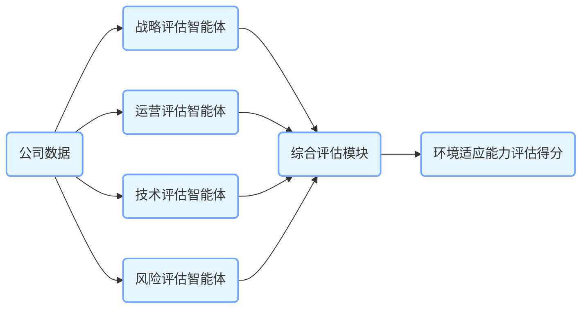

# 智能体协作评估公司的环境适应能力：应对气候变化风险

> 关键词：智能体协作、环境适应能力评估、气候变化风险、公司评估、风险应对

> 摘要：本文聚焦于利用智能体协作的方式来评估公司的环境适应能力，以有效应对气候变化风险。首先介绍了研究的背景、目的、预期读者和文档结构等内容。详细阐述了智能体协作、环境适应能力等核心概念及其联系，给出了原理和架构的文本示意图与 Mermaid 流程图。深入讲解了核心算法原理，并结合 Python 代码进行说明。同时，给出了相关的数学模型和公式，并举例说明。通过项目实战，展示了如何搭建开发环境、实现源代码并进行解读分析。探讨了该评估方法在实际中的应用场景，推荐了学习资源、开发工具框架和相关论文著作。最后总结了未来发展趋势与挑战，提供了常见问题解答和扩展阅读参考资料，旨在为企业和相关研究人员提供全面且深入的关于利用智能体协作评估环境适应能力以应对气候变化风险的知识和方法。

## 1. 背景介绍 
### 1.1 目的和范围
随着全球气候变化问题日益严峻，公司面临着越来越多与气候变化相关的风险，如极端天气事件、能源成本上升、法规政策变化等。准确评估公司的环境适应能力对于公司自身的可持续发展以及整个社会的低碳转型至关重要。本研究的目的是利用智能体协作的方法，开发一套全面、科学的评估体系，以准确衡量公司在应对气候变化风险方面的环境适应能力。

本研究的范围涵盖了不同行业的各类公司，包括制造业、服务业、能源业等。研究将综合考虑公司的战略规划、运营管理、技术创新、风险管理等多个方面，以全面评估公司的环境适应能力。

### 1.2 预期读者
本文的预期读者包括企业管理人员、环境评估专家、政策制定者、研究学者以及对气候变化风险和公司环境适应能力感兴趣的人士。企业管理人员可以通过本文了解如何利用智能体协作评估公司的环境适应能力，从而制定相应的战略和措施；环境评估专家可以获取新的评估方法和技术；政策制定者可以根据评估结果制定更有效的政策和法规；研究学者可以在此基础上开展进一步的研究；普通读者可以增加对气候变化风险和公司应对策略的认识。

### 1.3 文档结构概述
本文将按照以下结构进行组织：
1. **背景介绍**：介绍研究的目的、范围、预期读者和文档结构，以及相关术语的定义和解释。
2. **核心概念与联系**：阐述智能体协作、环境适应能力等核心概念的原理和架构，并给出文本示意图和 Mermaid 流程图。
3. **核心算法原理 & 具体操作步骤**：详细讲解核心算法原理，并结合 Python 代码进行说明。
4. **数学模型和公式 & 详细讲解 & 举例说明**：给出相关的数学模型和公式，并进行详细讲解和举例说明。
5. **项目实战：代码实际案例和详细解释说明**：通过项目实战，展示如何搭建开发环境、实现源代码并进行解读分析。
6. **实际应用场景**：探讨该评估方法在实际中的应用场景。
7. **工具和资源推荐**：推荐学习资源、开发工具框架和相关论文著作。
8. **总结：未来发展趋势与挑战**：总结未来发展趋势和面临的挑战。
9. **附录：常见问题与解答**：提供常见问题的解答。
10. **扩展阅读 & 参考资料**：提供扩展阅读和参考资料。

### 1.4 术语表
#### 1.4.1 核心术语定义
- **智能体协作**：指多个智能体通过相互通信和协调，共同完成特定任务的过程。在本研究中，智能体可以是不同类型的评估模型或算法，它们通过协作来完成公司环境适应能力的评估。
- **环境适应能力**：指公司在面对气候变化等环境因素时，能够调整自身的战略、运营和管理，以减少风险、抓住机遇的能力。
- **气候变化风险**：指由于气候变化导致的各种风险，如极端天气事件、海平面上升、气温变化等，这些风险可能对公司的生产、运营和财务状况产生负面影响。

#### 1.4.2 相关概念解释
- **多智能体系统**：由多个智能体组成的系统，这些智能体可以自主地感知环境、做出决策并采取行动。多智能体系统可以用于解决复杂的问题，如环境评估、资源分配等。
- **评估指标体系**：用于衡量公司环境适应能力的一系列指标，包括战略规划、运营管理、技术创新、风险管理等方面的指标。

#### 1.4.3 缩略词列表
- **MAS**：Multi - Agent System（多智能体系统）
- **ESG**：Environmental, Social and Governance（环境、社会和治理）

## 2. 核心概念与联系 
### 核心概念原理
#### 智能体协作原理
智能体协作基于多智能体系统的思想。每个智能体都有自己的感知能力、决策能力和行动能力。在评估公司环境适应能力的过程中，不同的智能体可以负责不同的评估任务，例如，一个智能体可以负责评估公司的战略规划，另一个智能体可以负责评估公司的运营管理。智能体之间通过通信机制进行信息交换和协调，以共同完成评估任务。

智能体的决策过程通常基于一定的规则或算法。例如，一个智能体可以根据预设的评估指标体系，对公司的相关数据进行分析和判断，然后给出相应的评估结果。多个智能体的评估结果可以进行综合，以得到更准确、全面的评估结论。

#### 环境适应能力原理
公司的环境适应能力可以从多个维度进行理解。从战略层面来看，公司需要制定明确的环境战略，将应对气候变化风险纳入公司的长期发展规划。在运营管理方面，公司需要优化生产流程、提高资源利用效率，以减少对环境的影响。技术创新也是提高环境适应能力的重要手段，公司可以通过研发和应用新技术，降低碳排放、提高能源效率。风险管理则要求公司识别、评估和应对气候变化相关的风险，制定相应的风险应对策略。

### 核心概念架构
#### 文本示意图
智能体协作评估公司环境适应能力的架构可以描述如下：

首先，有多个智能体组成一个多智能体系统。这些智能体可以分为不同的类型，如战略评估智能体、运营评估智能体、技术评估智能体和风险评估智能体等。每个智能体都有自己的输入和输出。输入包括公司的相关数据，如战略规划文档、运营数据、技术研发报告、风险评估报告等。智能体对这些输入数据进行分析和处理，然后输出评估结果。

多个智能体的评估结果会被发送到一个综合评估模块。该模块根据一定的权重和算法，对各个智能体的评估结果进行综合，最终得到公司的环境适应能力评估得分。这个评估得分可以用于公司的自我评估、投资者决策、政策制定等方面。

#### Mermaid 流程图


在这个流程图中，公司数据作为输入被传递给各个智能体。各个智能体对数据进行评估后，将结果发送到综合评估模块。综合评估模块对这些结果进行综合处理，最终输出公司的环境适应能力评估得分。

## 3. 核心算法原理 & 具体操作步骤 
### 核心算法原理
本研究采用的核心算法主要包括智能体评估算法和综合评估算法。

#### 智能体评估算法
每个智能体的评估算法可以采用基于规则的评估方法。例如，对于战略评估智能体，我们可以设定以下规则：
- 如果公司的战略规划中明确提到应对气候变化的目标和措施，并且有具体的实施计划，则给予较高的评估得分。
- 如果公司的战略规划中只是简单提及环境问题，但没有具体的应对措施，则给予中等的评估得分。
- 如果公司的战略规划中没有涉及环境问题，则给予较低的评估得分。

在 Python 中，可以用以下代码实现战略评估智能体的评估算法：

```python
def strategic_evaluation(strategy_document):
    if "应对气候变化" in strategy_document and "实施计划" in strategy_document:
        return 80
    elif "环境问题" in strategy_document:
        return 50
    else:
        return 20

# 示例使用
strategy_doc = "本公司战略规划中提出应对气候变化的目标，并有详细的实施计划。"
score = strategic_evaluation(strategy_doc)
print(f"战略评估得分: {score}")
```

#### 综合评估算法
综合评估算法用于将各个智能体的评估结果进行综合。一种常用的方法是加权平均法。假设我们有 $n$ 个智能体，每个智能体的评估得分分别为 $s_1, s_2, \cdots, s_n$，对应的权重分别为 $w_1, w_2, \cdots, w_n$，则综合评估得分 $S$ 可以通过以下公式计算：

$$S=\sum_{i = 1}^{n}w_is_i$$

其中，$\sum_{i = 1}^{n}w_i = 1$。

在 Python 中，可以用以下代码实现综合评估算法：

```python
def comprehensive_evaluation(agent_scores, weights):
    total_score = 0
    for score, weight in zip(agent_scores, weights):
        total_score += score * weight
    return total_score

# 示例使用
agent_scores = [80, 70, 60, 50]
weights = [0.3, 0.25, 0.2, 0.25]
composite_score = comprehensive_evaluation(agent_scores, weights)
print(f"综合评估得分: {composite_score}")
```

### 具体操作步骤
1. **数据收集**：收集公司的相关数据，包括战略规划文档、运营数据、技术研发报告、风险评估报告等。
2. **智能体评估**：将收集到的数据分别输入到各个智能体中，利用智能体评估算法进行评估，得到各个智能体的评估得分。
3. **权重确定**：根据各个评估维度的重要性，确定每个智能体评估结果的权重。
4. **综合评估**：利用综合评估算法，将各个智能体的评估得分进行综合，得到公司的环境适应能力评估得分。
5. **结果分析**：对评估结果进行分析，找出公司在环境适应方面的优势和不足，为公司制定改进措施提供依据。

## 4. 数学模型和公式 & 详细讲解 & 举例说明 
### 数学模型
本研究的数学模型主要基于智能体评估和综合评估的过程。

#### 智能体评估模型
每个智能体的评估过程可以看作是一个从输入数据 $x$ 到评估得分 $s$ 的映射函数 $f(x)$。不同的智能体有不同的映射函数。例如，战略评估智能体的映射函数可以表示为：

$$s_{strategy}=f_{strategy}(x_{strategy})$$

其中，$x_{strategy}$ 是公司的战略规划文档，$s_{strategy}$ 是战略评估得分。

#### 综合评估模型
综合评估模型基于加权平均法，如前面所述，综合评估得分 $S$ 可以表示为：

$$S=\sum_{i = 1}^{n}w_is_i$$

其中，$s_i$ 是第 $i$ 个智能体的评估得分，$w_i$ 是第 $i$ 个智能体评估得分的权重，$n$ 是智能体的数量。

### 详细讲解
#### 智能体评估模型讲解
智能体评估模型的核心是确定映射函数 $f(x)$。这个映射函数可以根据不同的评估指标和规则来定义。例如，对于运营评估智能体，评估指标可以包括能源消耗、废弃物排放等。映射函数可以根据这些指标的实际值与预设的标准值进行比较，然后根据比较结果给出评估得分。

#### 综合评估模型讲解
综合评估模型的关键是确定权重 $w_i$。权重的确定需要考虑各个评估维度的重要性。例如，在应对气候变化风险的过程中，战略规划和风险管理可能更为重要，因此可以给予较高的权重；而运营管理和技术创新的权重可以相对较低。权重的确定可以采用专家评估法、层次分析法等方法。

### 举例说明
假设我们有三个智能体：战略评估智能体、运营评估智能体和风险评估智能体。它们的评估得分分别为 $s_1 = 80$，$s_2 = 70$，$s_3 = 60$。根据专家评估，确定它们的权重分别为 $w_1 = 0.4$，$w_2 = 0.3$，$w_3 = 0.3$。

则综合评估得分 $S$ 可以计算如下：

$$S=w_1s_1 + w_2s_2+w_3s_3$$
$$S = 0.4\times80+0.3\times70 + 0.3\times60$$
$$S=32 + 21+18$$
$$S = 71$$

这意味着该公司的环境适应能力综合评估得分为 71 分。

## 5. 项目实战：代码实际案例和详细解释说明 
### 5.1  开发环境搭建
#### 操作系统
可以选择 Windows、Linux 或 macOS 操作系统。本示例以 Windows 10 为例。

#### Python 安装
从 Python 官方网站（https://www.python.org/downloads/）下载 Python 3.8 或更高版本，并按照安装向导进行安装。安装完成后，在命令行中输入 `python --version` 检查 Python 是否安装成功。

#### 开发工具
推荐使用 PyCharm 作为开发工具。可以从 JetBrains 官方网站（https://www.jetbrains.com/pycharm/download/）下载 PyCharm Community Edition 免费版，并按照安装向导进行安装。

#### 依赖库安装
在命令行中使用以下命令安装所需的依赖库：
```sh
pip install pandas numpy
```

### 5.2  源代码详细实现和代码解读
以下是一个完整的项目实战代码示例：

```python
import pandas as pd
import numpy as np

# 战略评估智能体
def strategic_evaluation(strategy_document):
    if "应对气候变化" in strategy_document and "实施计划" in strategy_document:
        return 80
    elif "环境问题" in strategy_document:
        return 50
    else:
        return 20

# 运营评估智能体
def operational_evaluation(energy_consumption, waste_emission):
    # 假设能源消耗和废弃物排放的标准值
    energy_standard = 100
    waste_standard = 50
    energy_score = 100 - (energy_consumption / energy_standard) * 100
    waste_score = 100 - (waste_emission / waste_standard) * 100
    return (energy_score + waste_score) / 2

# 技术评估智能体
def technology_evaluation(tech_investment):
    if tech_investment > 100000:
        return 80
    elif tech_investment > 50000:
        return 60
    else:
        return 30

# 风险评估智能体
def risk_evaluation(risk_report):
    if "风险应对措施" in risk_report:
        return 70
    else:
        return 40

# 综合评估函数
def comprehensive_evaluation(agent_scores, weights):
    total_score = 0
    for score, weight in zip(agent_scores, weights):
        total_score += score * weight
    return total_score

# 主函数
def main():
    # 模拟公司数据
    strategy_doc = "本公司战略规划中提出应对气候变化的目标，并有详细的实施计划。"
    energy_consumption = 80
    waste_emission = 40
    tech_investment = 120000
    risk_report = "本公司风险报告中包含详细的风险应对措施。"

    # 智能体评估
    strategic_score = strategic_evaluation(strategy_doc)
    operational_score = operational_evaluation(energy_consumption, waste_emission)
    technology_score = technology_evaluation(tech_investment)
    risk_score = risk_evaluation(risk_report)

    agent_scores = [strategic_score, operational_score, technology_score, risk_score]
    weights = [0.3, 0.25, 0.2, 0.25]

    # 综合评估
    composite_score = comprehensive_evaluation(agent_scores, weights)

    print(f"战略评估得分: {strategic_score}")
    print(f"运营评估得分: {operational_score}")
    print(f"技术评估得分: {technology_score}")
    print(f"风险评估得分: {risk_score}")
    print(f"综合评估得分: {composite_score}")

if __name__ == "__main__":
    main()
```

### 5.3  代码解读与分析
#### 智能体评估函数
- `strategic_evaluation`：根据公司的战略规划文档，判断是否包含应对气候变化的目标和实施计划，然后给出相应的评估得分。
- `operational_evaluation`：根据公司的能源消耗和废弃物排放数据，与预设的标准值进行比较，计算评估得分。
- `technology_evaluation`：根据公司的技术研发投资金额，判断投资水平，然后给出相应的评估得分。
- `risk_evaluation`：根据公司的风险评估报告，判断是否包含风险应对措施，然后给出相应的评估得分。

#### 综合评估函数
`comprehensive_evaluation`：根据各个智能体的评估得分和相应的权重，采用加权平均法计算综合评估得分。

#### 主函数
`main`：模拟公司的相关数据，调用各个智能体评估函数进行评估，得到各个智能体的评估得分。然后调用综合评估函数，计算公司的环境适应能力综合评估得分，并输出结果。

## 6. 实际应用场景 
### 企业自我评估
企业可以利用智能体协作评估方法，定期对自身的环境适应能力进行评估。通过评估结果，企业可以了解自己在应对气候变化风险方面的优势和不足，从而有针对性地制定改进措施。例如，如果评估结果显示企业在战略规划方面得分较低，企业可以重新审视自己的战略，制定更明确的应对气候变化的目标和措施。

### 投资者决策
投资者在进行投资决策时，越来越关注企业的环境适应能力。智能体协作评估方法可以为投资者提供客观、准确的评估结果，帮助投资者筛选出环境适应能力较强的企业进行投资。例如，投资者可以根据企业的环境适应能力评估得分，优先选择得分较高的企业进行投资，以降低投资风险。

### 政策制定
政府和相关部门可以利用智能体协作评估方法，对不同企业的环境适应能力进行评估。根据评估结果，政府可以制定更有针对性的政策和法规，鼓励企业提高环境适应能力。例如，对于环境适应能力较强的企业，可以给予税收优惠、财政补贴等政策支持；对于环境适应能力较弱的企业，可以加强监管，要求其限期整改。

### 行业比较
通过对同一行业内不同企业的环境适应能力进行评估，可以进行行业比较。企业可以了解自己在行业中的地位，找出与行业领先企业的差距，从而学习借鉴先进经验，提高自身的环境适应能力。行业协会也可以根据评估结果，制定行业标准和规范，促进行业的可持续发展。

## 7. 工具和资源推荐
### 7.1 学习资源推荐
#### 7.1.1 书籍推荐
- 《多智能体系统导论》：这本书系统地介绍了多智能体系统的基本概念、理论和方法，对于理解智能体协作的原理和技术有很大帮助。
- 《气候变化经济学》：深入探讨了气候变化对经济的影响以及应对策略，有助于了解气候变化风险和企业环境适应能力的相关经济背景。
- 《企业可持续发展战略》：介绍了企业如何制定和实施可持续发展战略，包括应对气候变化风险的策略，为企业提高环境适应能力提供了实践指导。

#### 7.1.2 在线课程
- Coursera 上的“多智能体系统”课程：由知名高校的教授授课，内容涵盖多智能体系统的各个方面，包括智能体建模、协作算法等。
- edX 上的“气候变化与可持续发展”课程：提供了关于气候变化的科学知识、政策框架和企业应对策略等方面的学习内容。
- Udemy 上的“企业环境管理与评估”课程：专门针对企业环境管理和评估进行讲解，包括环境适应能力评估的方法和工具。

#### 7.1.3 技术博客和网站
- Medium 上的 AI 和多智能体系统相关博客：有很多技术专家分享关于智能体协作、多智能体系统应用等方面的文章。
- 国际能源署（IEA）官网：提供了大量关于气候变化、能源政策和企业环境适应等方面的研究报告和数据。
- 世界资源研究所（WRI）官网：专注于可持续发展领域的研究和实践，有很多关于企业环境适应能力评估的案例和方法介绍。

### 7.2 开发工具框架推荐
#### 7.2.1 IDE和编辑器
- PyCharm：是一款功能强大的 Python 集成开发环境，提供了代码编辑、调试、版本控制等一系列功能，非常适合开发基于 Python 的智能体协作评估系统。
- Visual Studio Code：是一款轻量级的代码编辑器，支持多种编程语言，具有丰富的插件生态系统，可以方便地进行 Python 开发。

#### 7.2.2 调试和性能分析工具
- Py-Spy：可以对 Python 程序进行性能分析，帮助开发者找出程序中的性能瓶颈。
- PDB：Python 自带的调试器，可以用于调试 Python 代码，定位和解决程序中的问题。

#### 7.2.3 相关框架和库
- Mesa：是一个用于构建基于智能体的模型的 Python 框架，提供了丰富的智能体建模和模拟功能，适合开发智能体协作评估系统。
- NetworkX：是一个用于创建、操作和研究复杂网络的 Python 库，可以用于构建智能体之间的通信网络。

### 7.3 相关论文著作推荐
#### 7.3.1 经典论文
- “Multi - Agent Systems: A Modern Approach to Distributed Artificial Intelligence”：这篇论文是多智能体系统领域的经典之作，介绍了多智能体系统的基本概念、理论和应用。
- “The Economics of Climate Change: The Stern Review”：该论文对气候变化的经济影响进行了全面分析，提出了应对气候变化的政策建议。

#### 7.3.2 最新研究成果
- 可以在 IEEE Xplore、ACM Digital Library 等学术数据库中搜索关于智能体协作评估企业环境适应能力、气候变化风险评估等方面的最新研究论文。

#### 7.3.3 应用案例分析
- 可以参考一些国际知名企业的可持续发展报告，了解它们在应对气候变化风险、提高环境适应能力方面的实践经验和案例分析。

## 8. 总结：未来发展趋势与挑战
### 未来发展趋势
#### 智能化和自动化程度提高
随着人工智能技术的不断发展，智能体协作评估系统的智能化和自动化程度将不断提高。智能体可以更加自主地感知环境、收集数据、进行分析和决策，减少人工干预，提高评估效率和准确性。

#### 与大数据和物联网的融合
大数据和物联网技术的发展为智能体协作评估提供了更丰富的数据来源。智能体可以通过物联网设备实时收集企业的环境数据，结合大数据分析技术，更全面、深入地评估企业的环境适应能力。

#### 跨行业和跨领域应用
智能体协作评估方法不仅可以应用于企业的环境适应能力评估，还可以拓展到其他领域，如城市环境适应能力评估、供应链环境风险评估等。跨行业和跨领域的应用将促进不同领域之间的知识共享和协同发展。

### 面临的挑战
#### 数据质量和隐私问题
智能体协作评估需要大量的企业数据，数据的质量直接影响评估结果的准确性。同时，企业数据涉及商业机密和隐私问题，如何保证数据的安全和隐私是一个重要挑战。

#### 智能体协作的复杂性
随着智能体数量的增加和协作任务的复杂化，智能体之间的通信和协调变得更加困难。如何设计高效的协作算法，解决智能体之间的冲突和竞争，是需要解决的问题。

#### 评估标准的统一
目前，不同行业和不同机构对于企业环境适应能力的评估标准存在差异。如何制定统一的评估标准，使评估结果具有可比性和权威性，是未来需要解决的问题。

## 9. 附录：常见问题与解答
### 问题 1：智能体协作评估方法的准确性如何保证？
解答：为了保证智能体协作评估方法的准确性，需要从多个方面入手。首先，要确保数据的准确性和完整性，通过合理的数据收集和预处理方法，减少数据误差。其次，设计科学合理的评估指标体系和评估算法，根据不同的评估维度和目标，确定合适的权重和规则。此外，还可以通过多次评估和验证，对评估结果进行修正和优化。

### 问题 2：智能体协作评估系统的开发难度大吗？
解答：智能体协作评估系统的开发难度取决于系统的规模和复杂度。对于简单的评估系统，开发难度相对较低，只需要掌握基本的 Python 编程和智能体建模知识即可。但对于复杂的系统，如涉及大规模智能体协作、实时数据处理和复杂算法的系统，开发难度会相应增加，需要具备较高的编程技能和人工智能知识。

### 问题 3：如何确定各个智能体评估结果的权重？
解答：确定各个智能体评估结果的权重可以采用多种方法。常见的方法包括专家评估法、层次分析法、主成分分析法等。专家评估法是邀请相关领域的专家根据经验和知识，对各个评估维度的重要性进行评估，然后确定权重。层次分析法是通过构建层次结构模型，对各个评估维度进行两两比较，确定相对重要性，从而计算出权重。主成分分析法是通过对数据进行分析，找出主要的影响因素，根据各因素的贡献率确定权重。

### 问题 4：智能体协作评估方法适用于所有行业的企业吗？
解答：智能体协作评估方法具有一定的通用性，适用于大多数行业的企业。但不同行业的企业在环境适应能力方面的特点和重点可能不同，因此在应用该方法时，需要根据行业特点对评估指标体系和评估算法进行适当调整。例如，制造业企业可能更关注能源消耗和废弃物排放等方面的评估；服务业企业可能更关注环境管理和社会责任等方面的评估。

## 10. 扩展阅读 & 参考资料
### 扩展阅读
- 《人工智能：一种现代方法》：全面介绍了人工智能的基本概念、技术和应用，对于深入理解智能体协作的技术基础有很大帮助。
- 《可持续发展报告指南》：提供了企业编制可持续发展报告的指导原则和方法，有助于企业更好地展示自己的环境适应能力。
- 《气候变化与企业战略转型》：探讨了气候变化对企业战略的影响以及企业如何进行战略转型以应对气候变化风险。

### 参考资料
- IEEE Transactions on Intelligent Systems：该期刊发表了大量关于智能体系统、人工智能等方面的研究论文，是了解智能体协作技术最新进展的重要参考。
- 《中国应对气候变化国家方案》：提供了中国在应对气候变化方面的政策和措施，对于了解中国企业面临的气候变化风险和政策环境有重要参考价值。
- 企业可持续发展报告数据库：可以查询不同企业的可持续发展报告，获取企业在环境适应能力方面的实际案例和数据。