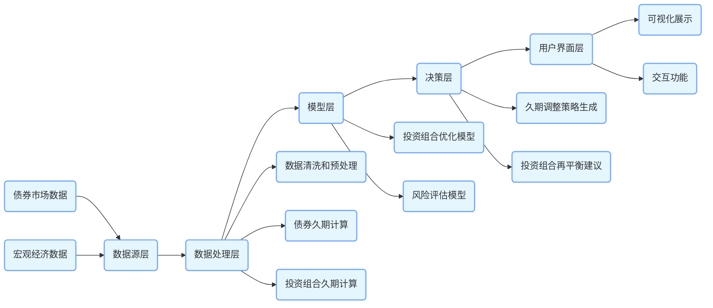

# 智能债券投资组合久期管理系统

> 关键词：智能债券投资组合、久期管理、风险管理、量化分析、系统设计

> 摘要：本文围绕智能债券投资组合久期管理系统展开，详细介绍了该系统的背景、核心概念、算法原理、数学模型、项目实战、实际应用场景、工具资源等内容。通过深入分析久期管理在债券投资组合中的重要性，阐述了系统如何利用先进的技术和算法实现对债券投资组合久期的有效管理，以降低风险、提高收益。同时，结合实际案例展示了系统的具体应用和效果，并对未来发展趋势与挑战进行了探讨。

## 1. 背景介绍 
### 1.1 目的和范围
在债券投资领域，久期是衡量债券价格对利率变动敏感性的重要指标。合理管理债券投资组合的久期可以帮助投资者有效控制利率风险，提高投资收益。智能债券投资组合久期管理系统的目的在于利用先进的信息技术和量化分析方法，实现对债券投资组合久期的实时监控、动态调整和优化管理。本系统的范围涵盖了从债券数据的收集、处理到久期计算、组合优化等一系列流程，旨在为投资者提供全面、高效、智能的久期管理解决方案。

### 1.2 预期读者
本文的预期读者包括债券投资者、投资经理、金融分析师、量化研究员以及对债券投资和风险管理感兴趣的技术人员。这些读者希望通过了解智能债券投资组合久期管理系统的原理、方法和应用，提升自己在债券投资领域的决策能力和风险管理水平。

### 1.3 文档结构概述
本文将按照以下结构进行阐述：首先介绍系统的背景知识，包括目的、预期读者和文档结构；接着阐述核心概念与联系，通过文本示意图和 Mermaid 流程图展示系统的原理和架构；然后详细讲解核心算法原理和具体操作步骤，使用 Python 源代码进行说明；再介绍数学模型和公式，并通过举例进行详细讲解；之后通过项目实战展示系统的实际应用，包括开发环境搭建、源代码实现和代码解读；接着探讨系统的实际应用场景；随后推荐相关的工具和资源；最后总结系统的未来发展趋势与挑战，并提供常见问题与解答和扩展阅读参考资料。

### 1.4 术语表
#### 1.4.1 核心术语定义
- **债券投资组合**：由多种债券组成的投资集合，投资者通过分散投资降低风险。
- **久期**：衡量债券价格对利率变动敏感性的指标，通常用麦考利久期或修正久期表示。
- **利率风险**：由于市场利率波动导致债券价格变动而带来的风险。
- **量化分析**：运用数学和统计方法对金融数据进行分析和建模的过程。
- **投资组合优化**：在一定的约束条件下，寻找最优的投资组合配置，以实现风险和收益的平衡。

#### 1.4.2 相关概念解释
- **麦考利久期**：是债券各期现金流支付时间的加权平均值，权重为各期现金流的现值占债券总现值的比例。它反映了债券现金流的平均回收时间。
- **修正久期**：是对麦考利久期的修正，考虑了债券价格与利率之间的非线性关系。修正久期可以更准确地衡量债券价格对利率变动的敏感性。
- **凸性**：描述债券价格与利率之间非线性关系的指标，它可以补充久期在衡量利率风险时的不足。

#### 1.4.3 缩略词列表
- **PV**：现值（Present Value）
- **CF**：现金流（Cash Flow）
- **YTM**：到期收益率（Yield to Maturity）
- **DV01**：基点价值（Dollar Value of an 01）

## 2. 核心概念与联系 
### 核心概念原理
智能债券投资组合久期管理系统的核心原理是基于久期的概念，通过对债券投资组合中各债券的久期进行计算和分析，实现对整个投资组合久期的有效管理。久期可以帮助投资者预测债券价格对利率变动的反应，从而采取相应的投资策略来降低利率风险。

系统首先收集债券的基本信息，如票面利率、到期时间、面值等，然后根据这些信息计算债券的久期。对于投资组合，系统将各债券的久期按照其在组合中的权重进行加权平均，得到投资组合的久期。通过实时监控投资组合的久期，系统可以根据市场情况和投资者的风险偏好，动态调整投资组合中债券的配置，以实现久期的目标值。

### 架构的文本示意图
```plaintext
智能债券投资组合久期管理系统架构

数据源层
|-- 债券市场数据（价格、利率、到期时间等）
|-- 宏观经济数据（通货膨胀率、GDP 增长率等）

数据处理层
|-- 数据清洗和预处理
|-- 债券久期计算
|-- 投资组合久期计算

模型层
|-- 投资组合优化模型
|-- 风险评估模型

决策层
|-- 久期调整策略生成
|-- 投资组合再平衡建议

用户界面层
|-- 可视化展示（久期曲线、风险指标等）
|-- 交互功能（参数设置、策略调整等）
```

### Mermaid 流程图


## 3. 核心算法原理 & 具体操作步骤 
### 核心算法原理
#### 债券久期计算
债券久期的计算通常基于麦考利久期公式。麦考利久期 $D$ 的计算公式为：
$$D = \frac{\sum_{t=1}^{n} t \times \frac{CF_t}{(1 + YTM)^t}}{\sum_{t=1}^{n} \frac{CF_t}{(1 + YTM)^t}}$$
其中，$CF_t$ 是第 $t$ 期的现金流，$YTM$ 是债券的到期收益率，$n$ 是债券的期数。

#### 投资组合久期计算
投资组合的久期 $D_p$ 是各债券久期的加权平均值，计算公式为：
$$D_p = \sum_{i=1}^{m} w_i \times D_i$$
其中，$w_i$ 是第 $i$ 种债券在投资组合中的权重，$D_i$ 是第 $i$ 种债券的久期，$m$ 是投资组合中债券的种类数。

#### 投资组合优化算法
投资组合优化的目标是在一定的约束条件下，寻找最优的投资组合配置，以实现风险和收益的平衡。常用的投资组合优化算法有均值 - 方差模型（Markowitz 模型）和线性规划模型等。

### 具体操作步骤
#### 数据收集
从债券市场数据源收集债券的基本信息，包括票面利率、到期时间、面值、价格等，同时收集宏观经济数据，如通货膨胀率、GDP 增长率等。

#### 数据预处理
对收集到的数据进行清洗和预处理，去除异常值和缺失值，统一数据格式。

#### 债券久期计算
根据债券的基本信息和到期收益率，使用麦考利久期公式计算各债券的久期。

#### 投资组合久期计算
根据各债券在投资组合中的权重，计算投资组合的久期。

#### 投资组合优化
根据投资者的风险偏好和投资目标，使用投资组合优化算法寻找最优的投资组合配置。

#### 久期调整和再平衡
根据市场情况和投资组合的久期目标，动态调整投资组合中债券的配置，实现投资组合的再平衡。

### Python 源代码实现
```python
import numpy as np

def macaulay_duration(cash_flows, ytm, periods):
    """
    计算麦考利久期
    :param cash_flows: 各期现金流
    :param ytm: 到期收益率
    :param periods: 期数
    :return: 麦考利久期
    """
    pv_cash_flows = np.array([cf / (1 + ytm) ** t for t, cf in enumerate(cash_flows, start=1)])
    total_pv = np.sum(pv_cash_flows)
    weighted_pv = np.array([t * cf / (1 + ytm) ** t for t, cf in enumerate(cash_flows, start=1)])
    duration = np.sum(weighted_pv) / total_pv
    return duration

def portfolio_duration(durations, weights):
    """
    计算投资组合久期
    :param durations: 各债券久期
    :param weights: 各债券权重
    :return: 投资组合久期
    """
    return np.dot(durations, weights)

# 示例数据
cash_flows = [50, 50, 1050]  # 各期现金流
ytm = 0.05  # 到期收益率
periods = 3  # 期数
bond_duration = macaulay_duration(cash_flows, ytm, periods)
print(f"债券久期: {bond_duration}")

durations = [2.5, 3.0, 3.5]  # 各债券久期
weights = [0.3, 0.4, 0.3]  # 各债券权重
portfolio_dur = portfolio_duration(durations, weights)
print(f"投资组合久期: {portfolio_dur}")
```

## 4. 数学模型和公式 & 详细讲解 & 举例说明 
### 麦考利久期公式
麦考利久期 $D$ 的计算公式为：
$$D = \frac{\sum_{t=1}^{n} t \times \frac{CF_t}{(1 + YTM)^t}}{\sum_{t=1}^{n} \frac{CF_t}{(1 + YTM)^t}}$$
详细讲解：
- 分子 $\sum_{t=1}^{n} t \times \frac{CF_t}{(1 + YTM)^t}$ 是各期现金流的时间加权现值之和，其中 $t$ 表示期数，$CF_t$ 是第 $t$ 期的现金流，$(1 + YTM)^t$ 是将第 $t$ 期现金流折现到当前的折现因子。
- 分母 $\sum_{t=1}^{n} \frac{CF_t}{(1 + YTM)^t}$ 是债券所有现金流的现值之和，即债券的当前价格。

举例说明：
假设一个债券的票面利率为 5%，面值为 1000 元，期限为 3 年，每年付息一次，到期收益率为 5%。则各期现金流分别为 $CF_1 = 50$，$CF_2 = 50$，$CF_3 = 1050$。

首先计算各期现金流的现值：
$PV_1 = \frac{50}{(1 + 0.05)^1} = 47.62$
$PV_2 = \frac{50}{(1 + 0.05)^2} = 45.35$
$PV_3 = \frac{1050}{(1 + 0.05)^3} = 907.03$

债券的当前价格 $P = PV_1 + PV_2 + PV_3 = 47.62 + 45.35 + 907.03 = 1000$

然后计算时间加权现值：
$t_1 \times PV_1 = 1 \times 47.62 = 47.62$
$t_2 \times PV_2 = 2 \times 45.35 = 90.70$
$t_3 \times PV_3 = 3 \times 907.03 = 2721.09$

时间加权现值之和为 $47.62 + 90.70 + 2721.09 = 2859.41$

最后计算麦考利久期：
$D = \frac{2859.41}{1000} = 2.86$

### 投资组合久期公式
投资组合的久期 $D_p$ 是各债券久期的加权平均值，计算公式为：
$$D_p = \sum_{i=1}^{m} w_i \times D_i$$
详细讲解：
- $w_i$ 是第 $i$ 种债券在投资组合中的权重，$\sum_{i=1}^{m} w_i = 1$。
- $D_i$ 是第 $i$ 种债券的久期。

举例说明：
假设一个投资组合由三种债券组成，各债券的久期分别为 $D_1 = 2.5$，$D_2 = 3.0$，$D_3 = 3.5$，权重分别为 $w_1 = 0.3$，$w_2 = 0.4$，$w_3 = 0.3$。

则投资组合的久期为：
$D_p = 0.3 \times 2.5 + 0.4 \times 3.0 + 0.3 \times 3.5 = 0.75 + 1.2 + 1.05 = 3.0$

### 投资组合优化模型
#### 均值 - 方差模型（Markowitz 模型）
均值 - 方差模型的目标是在给定预期收益率的情况下，最小化投资组合的方差；或者在给定方差的情况下，最大化投资组合的预期收益率。

目标函数：
$$\min \sigma_p^2 = \sum_{i=1}^{m} \sum_{j=1}^{m} w_i w_j \sigma_{ij}$$
约束条件：
$$\sum_{i=1}^{m} w_i = 1$$
$$E(R_p) = \sum_{i=1}^{m} w_i E(R_i) \geq R_{target}$$
其中，$\sigma_p^2$ 是投资组合的方差，$\sigma_{ij}$ 是第 $i$ 种和第 $j$ 种资产的协方差，$E(R_p)$ 是投资组合的预期收益率，$E(R_i)$ 是第 $i$ 种资产的预期收益率，$R_{target}$ 是目标收益率。

详细讲解：
- 目标函数 $\min \sigma_p^2$ 表示最小化投资组合的方差，即降低投资组合的风险。
- 约束条件 $\sum_{i=1}^{m} w_i = 1$ 表示投资组合中各资产的权重之和为 1。
- 约束条件 $E(R_p) \geq R_{target}$ 表示投资组合的预期收益率要大于等于目标收益率。

举例说明：
假设一个投资组合由两种资产组成，资产 1 的预期收益率为 $E(R_1) = 0.1$，方差为 $\sigma_1^2 = 0.04$，资产 2 的预期收益率为 $E(R_2) = 0.15$，方差为 $\sigma_2^2 = 0.09$，两种资产的协方差为 $\sigma_{12} = 0.02$。目标收益率为 $R_{target} = 0.12$。

设资产 1 的权重为 $w_1$，则资产 2 的权重为 $w_2 = 1 - w_1$。

投资组合的预期收益率为：
$E(R_p) = w_1 E(R_1) + w_2 E(R_2) = w_1 \times 0.1 + (1 - w_1) \times 0.15 = 0.15 - 0.05 w_1$

投资组合的方差为：
$\sigma_p^2 = w_1^2 \sigma_1^2 + w_2^2 \sigma_2^2 + 2 w_1 w_2 \sigma_{12} = w_1^2 \times 0.04 + (1 - w_1)^2 \times 0.09 + 2 w_1 (1 - w_1) \times 0.02$

根据目标收益率约束条件 $E(R_p) \geq 0.12$，可得：
$0.15 - 0.05 w_1 \geq 0.12$
$0.05 w_1 \leq 0.03$
$w_1 \leq 0.6$

在 $w_1 \leq 0.6$ 的约束下，最小化 $\sigma_p^2$，可以通过求解二次函数的最小值来得到最优的 $w_1$ 和 $w_2$。

## 5. 项目实战：代码实际案例和详细解释说明 
### 5.1  开发环境搭建
#### 操作系统
可以选择 Windows、Linux 或 macOS 操作系统。建议使用 Linux 系统，因为它在数据处理和开发方面具有更好的稳定性和性能。

#### 编程语言
使用 Python 作为主要的编程语言，因为 Python 具有丰富的数据分析和机器学习库，非常适合开发智能债券投资组合久期管理系统。

#### 开发工具
推荐使用 Anaconda 作为 Python 环境管理工具，它可以方便地安装和管理各种 Python 库。同时，可以使用 PyCharm 或 Jupyter Notebook 作为开发 IDE，PyCharm 适合大型项目的开发，Jupyter Notebook 适合交互式开发和数据分析。

#### 数据库
使用 MySQL 或 PostgreSQL 作为数据库，用于存储债券市场数据和投资组合信息。

### 5.2  源代码详细实现和代码解读
#### 数据收集和预处理模块
```python
import pandas as pd
import numpy as np

def collect_bond_data():
    """
    收集债券数据
    :return: 债券数据 DataFrame
    """
    # 这里可以从数据库或 API 中获取债券数据
    data = {
        'bond_id': [1, 2, 3],
        'coupon_rate': [0.05, 0.06, 0.07],
        'maturity': [3, 5, 10],
        'face_value': [1000, 1000, 1000],
        'price': [950, 1020, 1050]
    }
    df = pd.DataFrame(data)
    return df

def preprocess_data(df):
    """
    数据预处理
    :param df: 债券数据 DataFrame
    :return: 预处理后的债券数据 DataFrame
    """
    # 去除缺失值
    df = df.dropna()
    # 处理异常值
    # 这里可以根据实际情况进行异常值处理，例如去除价格过高或过低的数据
    return df

# 收集债券数据
bond_data = collect_bond_data()
# 数据预处理
processed_data = preprocess_data(bond_data)
print(processed_data)
```
代码解读：
- `collect_bond_data` 函数用于收集债券数据，这里使用了一个简单的字典来模拟数据，实际应用中可以从数据库或 API 中获取数据。
- `preprocess_data` 函数用于数据预处理，包括去除缺失值和处理异常值。

#### 债券久期计算模块
```python
def calculate_bond_duration(coupon_rate, maturity, face_value, price, ytm):
    """
    计算债券久期
    :param coupon_rate: 票面利率
    :param maturity: 到期时间（年）
    :param face_value: 面值
    :param price: 价格
    :param ytm: 到期收益率
    :return: 债券久期
    """
    cash_flows = [coupon_rate * face_value] * (maturity - 1) + [coupon_rate * face_value + face_value]
    periods = maturity
    duration = macaulay_duration(cash_flows, ytm, periods)
    return duration

# 示例计算
coupon_rate = 0.05
maturity = 3
face_value = 1000
price = 950
ytm = 0.06
bond_dur = calculate_bond_duration(coupon_rate, maturity, face_value, price, ytm)
print(f"债券久期: {bond_dur}")
```
代码解读：
- `calculate_bond_duration` 函数用于计算债券久期，它调用了之前定义的 `macaulay_duration` 函数。

#### 投资组合久期计算模块
```python
def calculate_portfolio_duration(bond_durations, weights):
    """
    计算投资组合久期
    :param bond_durations: 各债券久期
    :param weights: 各债券权重
    :return: 投资组合久期
    """
    return portfolio_duration(bond_durations, weights)

# 示例计算
bond_durations = [2.5, 3.0, 3.5]
weights = [0.3, 0.4, 0.3]
portfolio_dur = calculate_portfolio_duration(bond_durations, weights)
print(f"投资组合久期: {portfolio_dur}")
```
代码解读：
- `calculate_portfolio_duration` 函数用于计算投资组合久期，它调用了之前定义的 `portfolio_duration` 函数。

#### 投资组合优化模块
```python
from scipy.optimize import minimize

def portfolio_variance(weights, cov_matrix):
    """
    计算投资组合方差
    :param weights: 各资产权重
    :param cov_matrix: 协方差矩阵
    :return: 投资组合方差
    """
    return np.dot(weights.T, np.dot(cov_matrix, weights))

def portfolio_expected_return(weights, expected_returns):
    """
    计算投资组合预期收益率
    :param weights: 各资产权重
    :param expected_returns: 各资产预期收益率
    :return: 投资组合预期收益率
    """
    return np.dot(weights, expected_returns)

def optimize_portfolio(expected_returns, cov_matrix, target_return):
    """
    投资组合优化
    :param expected_returns: 各资产预期收益率
    :param cov_matrix: 协方差矩阵
    :param target_return: 目标收益率
    :return: 最优投资组合权重
    """
    num_assets = len(expected_returns)
    # 初始权重
    initial_weights = np.ones(num_assets) / num_assets
    # 约束条件
    constraints = [
        {'type': 'eq', 'fun': lambda x: np.sum(x) - 1},  # 权重之和为 1
        {'type': 'ineq', 'fun': lambda x: portfolio_expected_return(x, expected_returns) - target_return}  # 预期收益率大于等于目标收益率
    ]
    # 边界条件
    bounds = [(0, 1) for _ in range(num_assets)]
    # 最小化方差
    result = minimize(portfolio_variance, initial_weights, args=(cov_matrix,), constraints=constraints, bounds=bounds)
    optimal_weights = result.x
    return optimal_weights

# 示例数据
expected_returns = np.array([0.1, 0.15])
cov_matrix = np.array([[0.04, 0.02], [0.02, 0.09]])
target_return = 0.12
optimal_weights = optimize_portfolio(expected_returns, cov_matrix, target_return)
print(f"最优投资组合权重: {optimal_weights}")
```
代码解读：
- `portfolio_variance` 函数用于计算投资组合的方差。
- `portfolio_expected_return` 函数用于计算投资组合的预期收益率。
- `optimize_portfolio` 函数使用 `scipy.optimize.minimize` 函数来求解最优投资组合权重，通过最小化投资组合的方差，同时满足权重之和为 1 和预期收益率大于等于目标收益率的约束条件。

### 5.3  代码解读与分析
#### 数据处理部分
数据处理部分的代码主要负责收集和预处理债券数据。通过 `collect_bond_data` 函数收集数据，使用 `preprocess_data` 函数对数据进行清洗和处理，确保数据的质量。

#### 久期计算部分
久期计算部分的代码实现了债券久期和投资组合久期的计算。通过 `calculate_bond_duration` 函数计算单个债券的久期，使用 `calculate_portfolio_duration` 函数计算投资组合的久期。

#### 投资组合优化部分
投资组合优化部分的代码使用均值 - 方差模型对投资组合进行优化。通过 `portfolio_variance` 函数计算投资组合的方差，`portfolio_expected_return` 函数计算投资组合的预期收益率，`optimize_portfolio` 函数求解最优投资组合权重。

## 6. 实际应用场景 
### 银行和金融机构
银行和金融机构在进行债券投资时，需要有效管理投资组合的久期，以降低利率风险。智能债券投资组合久期管理系统可以帮助银行和金融机构实时监控投资组合的久期，根据市场情况动态调整投资组合的配置，提高投资收益。

### 保险公司
保险公司的资产负债管理对利率风险非常敏感。通过使用智能债券投资组合久期管理系统，保险公司可以更好地匹配资产和负债的久期，降低利率波动对公司财务状况的影响，确保公司的稳健运营。

### 基金管理公司
基金管理公司在管理债券基金时，需要根据基金的投资目标和风险偏好，合理管理投资组合的久期。智能债券投资组合久期管理系统可以为基金管理公司提供科学的决策依据，帮助他们优化投资组合，提高基金的业绩表现。

### 个人投资者
个人投资者在进行债券投资时，也可以借助智能债券投资组合久期管理系统来管理自己的投资组合。系统可以帮助个人投资者了解债券投资的风险和收益特征，根据自己的风险承受能力和投资目标，合理配置债券资产，实现资产的保值增值。

## 7. 工具和资源推荐
### 7.1 学习资源推荐
#### 7.1.1 书籍推荐
- 《债券市场分析与策略》（Analysis and Strategies for the Bond Market）：这本书详细介绍了债券市场的基本概念、分析方法和投资策略，是学习债券投资的经典教材。
- 《投资组合管理：理论与应用》（Portfolio Management: Theory and Application）：该书系统阐述了投资组合管理的理论和方法，包括资产配置、风险评估和投资组合优化等内容。
- 《金融数学：金融工程引论》（Financial Mathematics: An Introduction to Financial Engineering）：这本书介绍了金融数学的基本概念和方法，对于理解债券久期和投资组合优化的数学原理有很大帮助。

#### 7.1.2 在线课程
- Coursera 上的“金融市场”（Financial Markets）课程：由耶鲁大学教授罗伯特·席勒（Robert Shiller）讲授，课程涵盖了金融市场的各个方面，包括债券市场和投资组合管理。
- edX 上的“量化投资分析”（Quantitative Investment Analysis）课程：该课程介绍了量化投资的基本方法和技术，包括债券久期计算、风险评估和投资组合优化等内容。

#### 7.1.3 技术博客和网站
- 金融界网站（jrj.com.cn）：提供了丰富的金融市场资讯和债券投资分析报告。
- 东方财富网（eastmoney.com）：除了金融资讯外，还提供了债券行情数据和分析工具。
- 优矿（uqer.io）：一个专业的量化投资平台，提供了大量的金融数据和量化分析工具，适合学习和实践量化投资。

### 7.2 开发工具框架推荐
#### 7.2.1 IDE和编辑器
- PyCharm：一款专业的 Python 集成开发环境，具有强大的代码编辑、调试和自动补全功能，适合开发大型 Python 项目。
- Jupyter Notebook：一个交互式的开发环境，支持代码、文本、图表等多种元素的混合编写，非常适合数据分析和模型验证。

#### 7.2.2 调试和性能分析工具
- Py-Spy：一个用于分析 Python 代码性能的工具，可以帮助开发者找出代码中的性能瓶颈。
- pdb：Python 自带的调试器，可以在代码中设置断点，逐步调试代码，帮助开发者排查问题。

#### 7.2.3 相关框架和库
- Pandas：一个强大的数据分析库，提供了高效的数据结构和数据处理工具，适合处理金融数据。
- NumPy：一个用于科学计算的库，提供了高效的数组和矩阵运算功能，是许多金融分析和建模的基础。
- Scipy：一个用于科学计算和优化的库，提供了丰富的数学算法和优化工具，可用于投资组合优化等问题。

### 7.3 相关论文著作推荐
#### 7.3.1 经典论文
- Markowitz, H. M. (1952). Portfolio Selection. The Journal of Finance, 7(1), 77-91. 这篇论文提出了均值 - 方差模型，奠定了现代投资组合理论的基础。
- Macaulay, F. R. (1938). Some Theoretical Problems Suggested by the Movements of Interest Rates, Bond Yields, and Stock Prices in the United States since 1856. National Bureau of Economic Research. 这篇论文首次提出了麦考利久期的概念。

#### 7.3.2 最新研究成果
- 近年来，关于债券投资组合久期管理和风险管理的研究不断涌现。可以通过学术数据库，如 IEEE Xplore、ACM Digital Library、ScienceDirect 等，查找相关的最新研究论文。

#### 7.3.3 应用案例分析
- 一些金融机构和研究机构会发布关于债券投资组合管理的应用案例分析报告。可以关注这些报告，了解实际应用中的经验和教训。

## 8. 总结：未来发展趋势与挑战
### 未来发展趋势
#### 智能化和自动化
随着人工智能和机器学习技术的不断发展，智能债券投资组合久期管理系统将越来越智能化和自动化。系统可以通过深度学习算法自动识别市场趋势和风险特征，实时调整投资组合的配置，提高投资决策的效率和准确性。

#### 多资产融合
未来的债券投资组合管理将不再局限于单一的债券资产，而是会与其他资产，如股票、基金、衍生品等进行融合。智能债券投资组合久期管理系统需要能够处理多资产的复杂情况，实现跨资产的风险和收益管理。

#### 大数据和云计算应用
大数据和云计算技术的应用将为智能债券投资组合久期管理系统提供更强大的数据处理和计算能力。系统可以收集和分析更广泛的市场数据和宏观经济数据，提高对市场的洞察力和预测能力。

### 挑战
#### 数据质量和安全性
智能债券投资组合久期管理系统依赖于大量的金融数据，数据的质量和安全性至关重要。如何确保数据的准确性、完整性和及时性，以及保护数据的安全，是系统面临的重要挑战。

#### 模型的有效性和适应性
投资组合优化模型和风险评估模型的有效性和适应性直接影响系统的性能。市场环境和投资者需求不断变化，模型需要不断更新和优化，以适应新的情况。

#### 监管合规
金融行业受到严格的监管，智能债券投资组合久期管理系统需要遵守相关的监管规定。如何确保系统的开发和运营符合监管要求，是系统开发者和使用者需要面对的挑战。

## 9. 附录：常见问题与解答
### 什么是久期？
久期是衡量债券价格对利率变动敏感性的指标，通常用麦考利久期或修正久期表示。它反映了债券现金流的平均回收时间，久期越长，债券价格对利率变动的敏感性越高。

### 为什么要管理债券投资组合的久期？
管理债券投资组合的久期可以帮助投资者有效控制利率风险。当市场利率上升时，久期较长的债券价格下跌幅度较大，通过调整投资组合的久期，可以降低利率上升对投资组合价值的影响；当市场利率下降时，久期较长的债券价格上涨幅度较大，可以提高投资组合的收益。

### 如何计算债券投资组合的久期？
债券投资组合的久期是各债券久期的加权平均值，计算公式为 $D_p = \sum_{i=1}^{m} w_i \times D_i$，其中 $w_i$ 是第 $i$ 种债券在投资组合中的权重，$D_i$ 是第 $i$ 种债券的久期，$m$ 是投资组合中债券的种类数。

### 智能债券投资组合久期管理系统有哪些优势？
智能债券投资组合久期管理系统具有实时监控、动态调整、量化分析和智能决策等优势。它可以帮助投资者更高效地管理投资组合的久期，降低利率风险，提高投资收益。

### 系统的开发和维护需要哪些技术和资源？
系统的开发和维护需要掌握 Python 编程、数据库管理、数据分析和机器学习等技术。同时，需要使用到一些开发工具和框架，如 PyCharm、Jupyter Notebook、Pandas、NumPy 等。此外，还需要获取准确的金融数据和宏观经济数据。

## 10. 扩展阅读 & 参考资料
### 扩展阅读
- 《固定收益证券手册》（Handbook of Fixed Income Securities）：该书详细介绍了固定收益证券的各种产品和投资策略，是固定收益投资领域的权威著作。
- 《金融风险管理》（Financial Risk Management）：这本书系统阐述了金融风险管理的理论和方法，对于理解债券投资组合的风险控制有很大帮助。

### 参考资料
- 相关金融数据提供商的官方网站，如 Wind 资讯、Bloomberg 等。
- 金融行业的监管文件和政策法规，如中国人民银行、中国证券监督管理委员会发布的相关文件。
- 学术期刊和会议论文，如《Journal of Finance》、《Journal of Financial Economics》等。