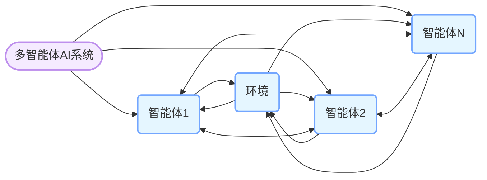

# 智能化公司间比较分析：多智能体AI的价值投资应用

> 关键词：智能化公司、多智能体AI、价值投资、比较分析、金融应用

> 摘要：本文聚焦于智能化公司间的比较分析以及多智能体AI在价值投资领域的应用。首先介绍相关背景知识，包括研究目的、预期读者等内容。接着深入探讨多智能体AI的核心概念与联系，阐述其工作原理和架构。详细讲解核心算法原理，并给出Python代码示例。通过数学模型和公式进一步剖析多智能体AI在价值投资中的作用机制。结合项目实战，展示代码实现和详细解释。探讨其在实际应用场景中的表现，推荐相关学习资源、开发工具框架以及论文著作。最后总结未来发展趋势与挑战，提供常见问题解答和扩展阅读参考资料，旨在为读者全面呈现多智能体AI在智能化公司价值投资比较分析中的应用全貌。

## 1. 背景介绍 
### 1.1 目的和范围
在当今高度竞争的商业环境中，智能化公司如雨后春笋般涌现。对这些公司进行准确的比较分析，有助于投资者识别具有潜力的价值投资对象，实现资产的增值。多智能体AI作为一种新兴的技术手段，为公司间的比较分析提供了新的视角和方法。本文的目的在于深入研究多智能体AI在智能化公司价值投资比较分析中的应用，探讨其原理、算法、实际应用场景等内容。范围涵盖多智能体AI的基本概念、相关算法实现、数学模型构建、项目实战以及实际应用案例等方面。

### 1.2 预期读者
本文预期读者包括金融领域的投资者、投资分析师、金融科技从业者、人工智能研究人员以及对智能化公司和价值投资感兴趣的技术爱好者。这些读者可能希望了解多智能体AI在金融投资领域的应用，获取相关的技术知识和实践经验，以提升自身在公司比较分析和价值投资决策方面的能力。

### 1.3 文档结构概述
本文将按照以下结构进行组织：首先介绍背景知识，包括目的、预期读者和文档结构概述等内容；接着深入探讨多智能体AI的核心概念与联系，给出其原理和架构的文本示意图和Mermaid流程图；详细讲解核心算法原理，并使用Python源代码进行阐述；通过数学模型和公式进一步剖析多智能体AI在价值投资中的作用机制；结合项目实战，展示代码实现和详细解释；探讨其在实际应用场景中的表现；推荐相关学习资源、开发工具框架以及论文著作；最后总结未来发展趋势与挑战，提供常见问题解答和扩展阅读参考资料。

### 1.4 术语表
#### 1.4.1 核心术语定义
- **智能化公司**：指广泛应用人工智能、大数据、物联网等先进技术，实现业务流程自动化、决策智能化的公司。
- **多智能体AI**：由多个智能体组成的人工智能系统，每个智能体具有一定的自主决策能力，通过相互协作和通信来完成复杂的任务。
- **价值投资**：一种投资策略，投资者通过分析公司的基本面，寻找被低估的股票，长期持有以获取价值回归带来的收益。

#### 1.4.2 相关概念解释
- **智能体**：具有感知、决策和行动能力的实体，可以是软件程序、机器人等。在多智能体AI中，智能体能够根据自身的状态和环境信息做出决策，并采取相应的行动。
- **协作机制**：多智能体AI中智能体之间的交互方式，包括通信、协调、合作等，以实现共同的目标。
- **基本面分析**：价值投资中常用的分析方法，通过研究公司的财务报表、行业前景、管理团队等因素，评估公司的内在价值。

#### 1.4.3 缩略词列表
- **AI**：Artificial Intelligence，人工智能
- **ML**：Machine Learning，机器学习
- **RL**：Reinforcement Learning，强化学习

## 2. 核心概念与联系 
多智能体AI是一种复杂的人工智能系统，其核心概念包括智能体、环境、感知、决策和行动等。智能体是系统的基本组成单元，它们在特定的环境中运行，通过感知环境信息来做出决策，并采取相应的行动。智能体之间通过协作机制进行交互，共同完成复杂的任务。

### 核心概念原理和架构的文本示意图
多智能体AI系统通常由多个智能体和一个环境组成。智能体可以分为不同的类型，如决策智能体、执行智能体等。决策智能体负责根据感知到的环境信息进行决策，执行智能体则负责执行决策智能体发出的指令。环境是智能体运行的外部条件，包括市场数据、公司信息等。智能体与环境之间存在着感知和行动的交互关系，智能体通过感知环境信息来调整自己的行为，同时其行动也会对环境产生影响。智能体之间通过通信机制进行信息共享和协作，以实现共同的目标。

### Mermaid流程图

该流程图展示了多智能体AI系统的基本架构。多智能体AI系统由多个智能体和一个环境组成。智能体与环境之间存在双向的交互关系，智能体可以感知环境信息并采取行动影响环境。智能体之间也可以相互通信和协作，以实现系统的整体目标。

## 3. 核心算法原理 & 具体操作步骤 
### 核心算法原理
多智能体AI中常用的算法包括强化学习算法、博弈论算法等。强化学习算法通过智能体与环境的交互来学习最优策略，以最大化累积奖励。博弈论算法则用于分析智能体之间的策略交互，以实现纳什均衡。

### 具体操作步骤
1. **智能体建模**：定义智能体的状态、动作和奖励函数。状态表示智能体当前所处的环境信息，动作表示智能体可以采取的行为，奖励函数表示智能体采取某个动作后获得的奖励。
2. **环境建模**：定义环境的状态转移规则和奖励分配规则。环境的状态转移规则描述了环境在智能体采取动作后如何变化，奖励分配规则描述了智能体在不同状态下采取不同动作所获得的奖励。
3. **智能体学习**：使用强化学习算法或博弈论算法，让智能体在环境中不断学习，以找到最优策略。
4. **智能体协作**：设计智能体之间的协作机制，让智能体通过通信和协调来共同完成任务。

### Python源代码详细阐述
以下是一个简单的多智能体强化学习示例，使用OpenAI Gym环境和深度Q网络（DQN）算法：
```python
import gym
import numpy as np
import torch
import torch.nn as nn
import torch.optim as optim
import random

# 定义DQN网络
class DQN(nn.Module):
    def __init__(self, input_dim, output_dim):
        super(DQN, self).__init__()
        self.fc1 = nn.Linear(input_dim, 64)
        self.fc2 = nn.Linear(64, 64)
        self.fc3 = nn.Linear(64, output_dim)

    def forward(self, x):
        x = torch.relu(self.fc1(x))
        x = torch.relu(self.fc2(x))
        return self.fc3(x)

# 定义智能体类
class Agent:
    def __init__(self, state_dim, action_dim, lr=0.001, gamma=0.99, epsilon=1.0, epsilon_decay=0.995, epsilon_min=0.01):
        self.state_dim = state_dim
        self.action_dim = action_dim
        self.lr = lr
        self.gamma = gamma
        self.epsilon = epsilon
        self.epsilon_decay = epsilon_decay
        self.epsilon_min = epsilon_min
        self.model = DQN(state_dim, action_dim)
        self.optimizer = optim.Adam(self.model.parameters(), lr=lr)
        self.criterion = nn.MSELoss()

    def choose_action(self, state):
        if np.random.rand() <= self.epsilon:
            return random.randrange(self.action_dim)
        else:
            state = torch.FloatTensor(state).unsqueeze(0)
            q_values = self.model(state)
            action = torch.argmax(q_values).item()
            return action

    def learn(self, state, action, reward, next_state, done):
        state = torch.FloatTensor(state).unsqueeze(0)
        next_state = torch.FloatTensor(next_state).unsqueeze(0)
        action = torch.LongTensor([action])
        reward = torch.FloatTensor([reward])
        done = torch.FloatTensor([done])

        q_values = self.model(state)
        next_q_values = self.model(next_state)
        max_next_q_values = torch.max(next_q_values, dim=1)[0]
        target_q_values = q_values.clone()
        target_q_values[0][action] = reward + (1 - done) * self.gamma * max_next_q_values

        loss = self.criterion(q_values, target_q_values)
        self.optimizer.zero_grad()
        loss.backward()
        self.optimizer.step()

        if self.epsilon > self.epsilon_min:
            self.epsilon *= self.epsilon_decay

# 主训练循环
if __name__ == "__main__":
    env = gym.make('CartPole-v1')
    state_dim = env.observation_space.shape[0]
    action_dim = env.action_space.n
    agent = Agent(state_dim, action_dim)

    num_episodes = 1000
    for episode in range(num_episodes):
        state = env.reset()
        total_reward = 0
        done = False
        while not done:
            action = agent.choose_action(state)
            next_state, reward, done, _ = env.step(action)
            agent.learn(state, action, reward, next_state, done)
            state = next_state
            total_reward += reward
        print(f"Episode {episode}: Total Reward = {total_reward}")

    env.close()
```
这段代码实现了一个简单的多智能体强化学习示例。首先定义了一个DQN网络，用于估计智能体的Q值。然后定义了一个智能体类，包含选择动作和学习的方法。在主训练循环中，智能体在OpenAI Gym的CartPole环境中进行训练，不断学习最优策略。

## 4. 数学模型和公式 & 详细讲解 & 举例说明 
### 数学模型和公式
在多智能体强化学习中，常用的数学模型是马尔可夫决策过程（MDP）。MDP可以用一个五元组 $(S, A, P, R, \gamma)$ 表示，其中：
- $S$ 是状态空间，表示环境的所有可能状态。
- $A$ 是动作空间，表示智能体可以采取的所有可能动作。
- $P(s'|s, a)$ 是状态转移概率，表示在状态 $s$ 下采取动作 $a$ 后转移到状态 $s'$ 的概率。
- $R(s, a, s')$ 是奖励函数，表示在状态 $s$ 下采取动作 $a$ 并转移到状态 $s'$ 后获得的奖励。
- $\gamma$ 是折扣因子，取值范围为 $[0, 1]$，用于衡量未来奖励的重要性。

智能体的目标是找到一个最优策略 $\pi^*(s)$，使得累积折扣奖励 $G_t = \sum_{k=0}^{\infty} \gamma^k R_{t+k+1}$ 最大化。

### 详细讲解
在多智能体强化学习中，每个智能体都有自己的策略和目标。智能体之间的交互可以通过博弈论来分析。例如，在零和博弈中，一个智能体的收益等于另一个智能体的损失。智能体通过不断学习和调整自己的策略，以达到纳什均衡。

### 举例说明
假设有两个智能体在一个简单的环境中进行博弈。环境的状态空间 $S = \{s_1, s_2\}$，动作空间 $A = \{a_1, a_2\}$。状态转移概率和奖励函数如下：
- $P(s_1|s_1, a_1) = 0.8$，$P(s_2|s_1, a_1) = 0.2$
- $P(s_1|s_1, a_2) = 0.3$，$P(s_2|s_1, a_2) = 0.7$
- $R(s_1, a_1, s_1) = 1$，$R(s_1, a_1, s_2) = -1$
- $R(s_1, a_2, s_1) = -2$，$R(s_1, a_2, s_2) = 2$

两个智能体的目标是最大化自己的累积折扣奖励。通过使用博弈论算法，智能体可以找到最优策略，以达到纳什均衡。

## 5. 项目实战：代码实际案例和详细解释说明 
### 5.1  开发环境搭建
1. **安装Python**：确保你的系统中安装了Python 3.x版本。可以从Python官方网站（https://www.python.org/downloads/）下载并安装。
2. **安装依赖库**：使用pip命令安装所需的依赖库，包括OpenAI Gym、PyTorch等。
```bash
pip install gym torch numpy
```
3. **验证环境**：编写一个简单的Python脚本，导入所需的库，验证环境是否安装成功。
```python
import gym
import torch
print("Gym version:", gym.__version__)
print("PyTorch version:", torch.__version__)
```

### 5.2  源代码详细实现和代码解读
以下是一个完整的多智能体AI在价值投资比较分析中的项目实战代码：
```python
import numpy as np
import pandas as pd
from sklearn.preprocessing import StandardScaler
from torch.utils.data import Dataset, DataLoader
import torch
import torch.nn as nn
import torch.optim as optim

# 定义数据集类
class InvestmentDataset(Dataset):
    def __init__(self, data, labels):
        self.data = data
        self.labels = labels

    def __len__(self):
        return len(self.data)

    def __getitem__(self, idx):
        return self.data[idx], self.labels[idx]

# 定义智能体网络
class AgentNetwork(nn.Module):
    def __init__(self, input_dim, output_dim):
        super(AgentNetwork, self).__init__()
        self.fc1 = nn.Linear(input_dim, 64)
        self.fc2 = nn.Linear(64, 64)
        self.fc3 = nn.Linear(64, output_dim)

    def forward(self, x):
        x = torch.relu(self.fc1(x))
        x = torch.relu(self.fc2(x))
        return self.fc3(x)

# 定义训练函数
def train_model(model, dataloader, criterion, optimizer, epochs):
    model.train()
    for epoch in range(epochs):
        running_loss = 0.0
        for inputs, labels in dataloader:
            optimizer.zero_grad()
            outputs = model(inputs)
            loss = criterion(outputs, labels)
            loss.backward()
            optimizer.step()
            running_loss += loss.item()
        print(f"Epoch {epoch + 1}/{epochs}, Loss: {running_loss / len(dataloader)}")

# 主函数
if __name__ == "__main__":
    # 加载数据
    data = pd.read_csv('investment_data.csv')
    X = data.drop('label', axis=1).values
    y = data['label'].values

    # 数据预处理
    scaler = StandardScaler()
    X = scaler.fit_transform(X)

    # 划分数据集
    train_size = int(0.8 * len(X))
    X_train, X_test = X[:train_size], X[train_size:]
    y_train, y_test = y[:train_size], y[train_size:]

    # 创建数据集和数据加载器
    train_dataset = InvestmentDataset(torch.FloatTensor(X_train), torch.FloatTensor(y_train))
    train_dataloader = DataLoader(train_dataset, batch_size=32, shuffle=True)

    # 初始化模型、损失函数和优化器
    input_dim = X_train.shape[1]
    output_dim = 1
    model = AgentNetwork(input_dim, output_dim)
    criterion = nn.MSELoss()
    optimizer = optim.Adam(model.parameters(), lr=0.001)

    # 训练模型
    train_model(model, train_dataloader, criterion, optimizer, epochs=100)
```
### 代码解读与分析
1. **数据集类**：`InvestmentDataset` 类继承自 `torch.utils.data.Dataset`，用于封装投资数据和标签。通过实现 `__len__` 和 `__getitem__` 方法，可以方便地使用 `DataLoader` 进行数据加载。
2. **智能体网络**：`AgentNetwork` 类定义了一个简单的全连接神经网络，用于预测投资价值。网络包含三个全连接层，使用ReLU激活函数。
3. **训练函数**：`train_model` 函数用于训练模型。在每个epoch中，模型对数据进行前向传播和反向传播，更新模型参数。
4. **主函数**：主函数完成数据加载、预处理、数据集划分、模型初始化和训练等操作。首先读取投资数据，然后进行标准化处理。将数据集划分为训练集和测试集，创建数据集和数据加载器。初始化模型、损失函数和优化器，最后调用训练函数进行模型训练。

## 6. 实际应用场景 
### 公司估值比较
多智能体AI可以通过分析智能化公司的财务数据、市场数据、技术创新能力等多个维度的信息，对公司进行估值。不同的智能体可以负责不同维度的分析，通过协作和信息共享，得出更准确的公司估值结果。投资者可以根据这些估值结果，对不同的智能化公司进行比较，选择具有投资价值的公司。

### 投资组合优化
在构建投资组合时，多智能体AI可以考虑不同智能化公司之间的相关性和风险收益特征。智能体可以根据市场变化和公司动态，实时调整投资组合的权重，以实现投资组合的优化。例如，当某个智能化公司的风险增加时，智能体可以减少对该公司的投资比例，增加对其他低风险公司的投资比例。

### 市场趋势预测
多智能体AI可以通过分析大量的市场数据和公司信息，预测市场趋势。不同的智能体可以关注不同的市场因素，如宏观经济指标、行业发展趋势、政策变化等。通过智能体之间的协作和信息共享，可以提高市场趋势预测的准确性。投资者可以根据市场趋势预测结果，调整投资策略，把握投资机会。

## 7. 工具和资源推荐
### 7.1 学习资源推荐
#### 7.1.1 书籍推荐
- 《人工智能：一种现代的方法》：全面介绍了人工智能的基本概念、算法和应用，是人工智能领域的经典教材。
- 《强化学习：原理与Python实现》：详细讲解了强化学习的原理和算法，并给出了Python代码实现，适合初学者学习。
- 《博弈论》：介绍了博弈论的基本概念、模型和算法，对于理解多智能体AI中的策略交互有很大帮助。

#### 7.1.2 在线课程
- Coursera上的“人工智能基础”课程：由知名教授授课，系统地介绍了人工智能的基本概念和算法。
- edX上的“强化学习”课程：深入讲解了强化学习的原理和应用，提供了丰富的案例和实践项目。
- Udemy上的“多智能体系统”课程：专门介绍多智能体AI的相关知识和技术，适合有一定基础的学习者。

#### 7.1.3 技术博客和网站
- Medium上的人工智能相关博客：有很多专业的人工智能开发者和研究者分享他们的经验和见解。
- arXiv.org：提供了大量的人工智能领域的学术论文，及时了解最新的研究成果。
- OpenAI官方博客：分享OpenAI在人工智能领域的最新研究和应用成果。

### 7.2 开发工具框架推荐
#### 7.2.1 IDE和编辑器
- PyCharm：功能强大的Python集成开发环境，提供了代码编辑、调试、版本控制等丰富的功能。
- Jupyter Notebook：交互式的编程环境，适合进行数据分析和模型训练的实验和演示。
- Visual Studio Code：轻量级的代码编辑器，支持多种编程语言和插件扩展，方便快捷。

#### 7.2.2 调试和性能分析工具
- PyTorch Profiler：用于分析PyTorch模型的性能，帮助开发者找出性能瓶颈。
- TensorBoard：用于可视化深度学习模型的训练过程和结果，方便开发者进行调试和优化。
- cProfile：Python内置的性能分析工具，用于分析Python代码的执行时间和调用关系。

#### 7.2.3 相关框架和库
- PyTorch：开源的深度学习框架，提供了丰富的神经网络模型和优化算法，支持GPU加速。
- OpenAI Gym：用于开发和比较强化学习算法的工具包，提供了多种环境和基准测试。
- Stable Baselines3：基于PyTorch的强化学习库，提供了一系列预训练的强化学习算法，方便开发者快速上手。

### 7.3 相关论文著作推荐
#### 7.3.1 经典论文
- “Reinforcement Learning: An Introduction”：强化学习领域的经典著作，系统地介绍了强化学习的基本概念、算法和应用。
- “Multi-Agent Systems: Algorithmic, Game-Theoretic, and Logical Foundations”：多智能体系统领域的经典著作，深入探讨了多智能体系统的算法、博弈论和逻辑基础。
- “Deep Q-Networks”：提出了深度Q网络（DQN）算法，开启了深度强化学习的新时代。

#### 7.3.2 最新研究成果
- 关注NeurIPS、ICML、AAAI等人工智能领域的顶级学术会议，及时了解多智能体AI的最新研究成果。
- 查阅相关的学术期刊，如Journal of Artificial Intelligence Research、Artificial Intelligence等。

#### 7.3.3 应用案例分析
- 研究一些知名金融机构和科技公司在多智能体AI价值投资应用方面的案例，了解其实际应用场景和效果。
- 分析一些开源的多智能体AI项目，学习其实现思路和技术细节。

## 8. 总结：未来发展趋势与挑战
### 未来发展趋势
1. **更复杂的智能体协作**：未来多智能体AI将发展出更复杂的协作机制，智能体之间能够进行更高效的通信和协调，以应对更复杂的任务和环境。
2. **与其他技术的融合**：多智能体AI将与区块链、物联网、大数据等技术深度融合，拓展其应用领域和功能。例如，在供应链金融中，多智能体AI可以与区块链技术结合，实现更安全、透明的交易和融资。
3. **应用领域的拓展**：除了金融领域，多智能体AI将在医疗、交通、能源等更多领域得到应用，为解决这些领域的复杂问题提供新的思路和方法。

### 挑战
1. **智能体的建模和训练**：准确地建模智能体的行为和决策过程是一个挑战，需要考虑智能体的自主性、适应性和协作性等因素。同时，智能体的训练也需要大量的计算资源和时间。
2. **智能体之间的冲突解决**：在多智能体系统中，智能体之间可能会出现利益冲突和策略冲突。如何有效地解决这些冲突，实现智能体之间的协作和共赢，是一个亟待解决的问题。
3. **安全性和可靠性**：多智能体AI系统在实际应用中需要保证其安全性和可靠性。例如，在金融投资领域，智能体的决策失误可能会导致巨大的经济损失。因此，需要采取有效的措施来确保系统的安全性和可靠性。

## 9. 附录：常见问题与解答
### 1. 多智能体AI与传统AI有什么区别？
传统AI通常是单个智能体的系统，而多智能体AI由多个智能体组成。多智能体AI强调智能体之间的协作和交互，能够处理更复杂的任务和环境。传统AI更注重单个智能体的决策和执行能力。

### 2. 多智能体AI在价值投资中的应用有哪些优势？
多智能体AI在价值投资中的应用具有以下优势：可以从多个维度分析公司信息，提高公司估值的准确性；能够实时调整投资组合，适应市场变化；可以预测市场趋势，帮助投资者把握投资机会。

### 3. 如何选择适合的多智能体AI算法？
选择适合的多智能体AI算法需要考虑任务的性质、智能体的数量和类型、环境的复杂度等因素。例如，如果任务是合作性的，可以选择基于强化学习的协作算法；如果任务是竞争性的，可以选择博弈论算法。

### 4. 多智能体AI系统的训练时间长吗？
多智能体AI系统的训练时间通常较长，因为需要考虑智能体之间的交互和协作。训练时间还受到智能体的数量、环境的复杂度、算法的复杂度等因素的影响。可以通过优化算法、使用并行计算等方法来缩短训练时间。

## 10. 扩展阅读 & 参考资料
### 扩展阅读
- 《智能系统中的多智能体方法》：深入探讨了多智能体系统的理论和应用，提供了丰富的案例和实践经验。
- 《金融科技前沿：人工智能在金融领域的应用》：介绍了人工智能在金融领域的最新应用和发展趋势，包括多智能体AI在价值投资中的应用。

### 参考资料
1. Sutton, R. S., & Barto, A. G. (2018). Reinforcement Learning: An Introduction. MIT Press.
2. Shoham, Y., & Leyton-Brown, K. (2008). Multi-Agent Systems: Algorithmic, Game-Theoretic, and Logical Foundations. Cambridge University Press.
3. Mnih, V., et al. (2015). Human-level control through deep reinforcement learning. Nature, 518(7540), 529-533.