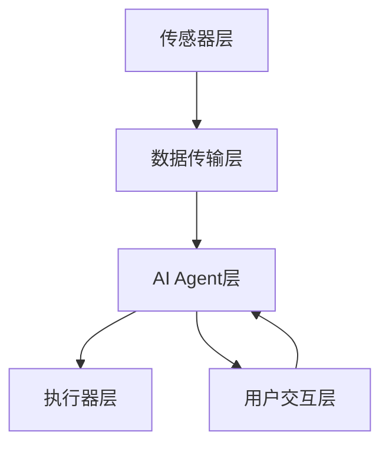

# 智能厨房吊柜：AI Agent的厨房效率提升建议

> 关键词：智能厨房吊柜、AI Agent、厨房效率、智能家居、自动化、用户体验、人机交互

> 摘要：本文围绕智能厨房吊柜与AI Agent展开，深入探讨如何利用AI Agent提升智能厨房吊柜的使用效率，从而优化整个厨房的工作流程。首先介绍相关背景知识，包括目的范围、预期读者等；接着阐述核心概念及联系，构建清晰的理论框架；然后详细讲解核心算法原理与具体操作步骤，辅以Python代码示例；再通过数学模型和公式进一步剖析其内在逻辑；结合项目实战给出实际案例及详细解释；探讨实际应用场景；推荐相关工具和资源；最后总结未来发展趋势与挑战，并对常见问题进行解答，为智能厨房吊柜的发展和应用提供全面且深入的技术参考。

## 1. 背景介绍 
### 1.1 目的和范围
本文章旨在探讨如何利用AI Agent提升智能厨房吊柜的效率，从而改善用户在厨房中的体验。随着智能家居的快速发展，智能厨房吊柜作为厨房空间的重要组成部分，其智能化程度的提升对于提高厨房整体效率具有重要意义。本文的范围涵盖了智能厨房吊柜的基本原理、AI Agent的应用方式、相关算法和技术，以及实际项目中的应用案例和未来发展趋势等方面。

### 1.2 预期读者
本文预期读者包括智能家居领域的研究人员、开发者、设计师，厨房设备制造商，以及对智能厨房感兴趣的消费者。对于研究人员和开发者，本文提供了深入的技术分析和算法实现细节；对于设计师和制造商，本文有助于了解智能厨房吊柜的发展趋势和创新方向；对于消费者，本文可以帮助他们更好地理解智能厨房吊柜的功能和优势。

### 1.3 文档结构概述
本文将按照以下结构进行组织：首先介绍相关背景知识，包括目的范围、预期读者等；接着阐述核心概念及联系，构建清晰的理论框架；然后详细讲解核心算法原理与具体操作步骤，辅以Python代码示例；再通过数学模型和公式进一步剖析其内在逻辑；结合项目实战给出实际案例及详细解释；探讨实际应用场景；推荐相关工具和资源；最后总结未来发展趋势与挑战，并对常见问题进行解答。

### 1.4 术语表
#### 1.4.1 核心术语定义
- **智能厨房吊柜**：集成了传感器、执行器和智能控制系统的厨房吊柜，能够实现自动化操作和与用户的交互。
- **AI Agent**：人工智能代理，是一种能够感知环境、做出决策并采取行动的智能实体，在本文中主要用于控制和优化智能厨房吊柜的运行。
- **人机交互**：指人与智能设备之间的信息交流和互动过程，在智能厨房吊柜中表现为用户与吊柜的操作界面或语音指令等方式的交互。
- **自动化**：指设备或系统能够自动完成预定的任务，无需人工干预，智能厨房吊柜的自动化包括自动开关门、物品识别和分类等功能。
- **用户体验**：用户在使用智能厨房吊柜过程中的感受和满意度，包括操作的便捷性、功能的实用性和个性化等方面。

#### 1.4.2 相关概念解释
- **智能家居**：利用先进的计算机技术、网络通信技术、传感器技术等，将家居设备连接成一个智能系统，实现家居设备的自动化控制和智能化管理。
- **物联网（IoT）**：通过各种信息传感设备，如传感器、射频识别技术、全球定位系统等，将物品与互联网连接起来，实现物品的智能化识别、定位、跟踪、监控和管理。智能厨房吊柜可以通过物联网技术与其他家居设备进行通信和协同工作。
- **机器学习**：一门多领域交叉学科，涉及概率论、统计学、逼近论、凸分析、算法复杂度理论等多门学科。它专门研究计算机怎样模拟或实现人类的学习行为，以获取新的知识或技能，重新组织已有的知识结构使之不断改善自身的性能。在智能厨房吊柜中，机器学习可以用于物品识别、用户行为分析等任务。

#### 1.4.3 缩略词列表
- **AI**：Artificial Intelligence，人工智能
- **IoT**：Internet of Things，物联网
- **RFID**：Radio Frequency Identification，射频识别
- **UI**：User Interface，用户界面
- **UX**：User Experience，用户体验

## 2. 核心概念与联系 
### 核心概念原理
智能厨房吊柜的核心在于其智能化的设计和AI Agent的应用。智能厨房吊柜通过集成各种传感器，如重量传感器、红外传感器、摄像头等，能够感知吊柜内物品的状态和用户的操作行为。AI Agent则基于这些传感器数据进行分析和决策，实现对吊柜的自动化控制和优化。

AI Agent的工作原理基于感知 - 决策 - 行动的循环。首先，它通过传感器感知厨房环境和用户的操作，获取相关数据；然后，对这些数据进行分析和处理，利用机器学习算法和规则引擎做出决策；最后，根据决策结果向执行器发送指令，控制吊柜的开关、物品的分类和存储等操作。

### 架构的文本示意图
智能厨房吊柜的架构主要包括以下几个部分：
1. **传感器层**：负责感知厨房环境和吊柜内物品的状态，包括重量传感器、红外传感器、摄像头、RFID阅读器等。
2. **数据传输层**：将传感器采集的数据传输到AI Agent所在的服务器或本地控制器，通常采用有线或无线通信协议，如Wi - Fi、蓝牙、ZigBee等。
3. **AI Agent层**：对传感器数据进行分析和处理，利用机器学习算法和规则引擎做出决策，并向执行器发送指令。
4. **执行器层**：根据AI Agent的指令执行相应的操作，如开关吊柜门、调整物品的位置等。
5. **用户交互层**：提供用户与智能厨房吊柜的交互界面，包括触摸屏、语音识别设备等，用户可以通过这些界面进行操作和查询信息。

### Mermaid流程图


## 3. 核心算法原理 & 具体操作步骤 
### 核心算法原理
#### 物品识别算法
物品识别是智能厨房吊柜的重要功能之一，其目的是准确识别吊柜内的物品。一种常用的物品识别算法是基于深度学习的目标检测算法，如YOLO（You Only Look Once）系列算法。YOLO算法通过将图像划分为多个网格，在每个网格中预测目标的类别和位置，具有速度快、准确率高的特点。

#### 用户行为分析算法
用户行为分析算法用于分析用户在厨房中的操作行为，以便更好地理解用户需求，优化吊柜的使用效率。可以采用基于机器学习的聚类算法，如K - Means算法，将用户的操作行为进行分类，找出不同用户的行为模式。

#### 决策优化算法
决策优化算法根据物品识别和用户行为分析的结果，做出最优的决策，如物品的存储位置、吊柜的开关时间等。可以采用基于强化学习的算法，如Q - Learning算法，通过不断尝试和学习，找到最优的决策策略。

### 具体操作步骤
#### 物品识别步骤
1. 摄像头采集吊柜内物品的图像。
2. 对采集的图像进行预处理，如灰度化、归一化等。
3. 将预处理后的图像输入到YOLO模型中，进行目标检测，得到物品的类别和位置信息。
4. 将物品的识别结果存储到数据库中。

#### 用户行为分析步骤
1. 收集用户在厨房中的操作数据，包括吊柜的开关时间、物品的取用记录等。
2. 对收集的数据进行清洗和预处理，去除噪声和异常值。
3. 使用K - Means算法对用户的操作数据进行聚类，得到不同的用户行为模式。
4. 根据用户行为模式，为用户提供个性化的服务和建议。

#### 决策优化步骤
1. 根据物品识别和用户行为分析的结果，确定当前的状态和目标。
2. 使用Q - Learning算法进行决策优化，计算每个动作的Q值。
3. 选择Q值最大的动作作为最优决策。
4. 执行最优决策，并更新环境状态。

### Python源代码示例
#### 物品识别（使用YOLOv5）
```python
import torch

# 加载预训练的YOLOv5模型
model = torch.hub.load('ultralytics/yolov5', 'yolov5s', pretrained=True)

# 读取图像
img = 'path/to/your/image.jpg'

# 进行目标检测
results = model(img)

# 打印检测结果
print(results.pandas().xyxy[0])
```

#### 用户行为分析（使用K - Means）
```python
import numpy as np
from sklearn.cluster import KMeans

# 示例用户操作数据
data = np.array([[1, 2], [2, 3], [3, 4], [4, 5], [5, 6], [6, 7], [7, 8], [8, 9]])

# 创建K - Means模型
kmeans = KMeans(n_clusters=2)

# 进行聚类
kmeans.fit(data)

# 打印聚类结果
print(kmeans.labels_)
```

#### 决策优化（使用Q - Learning）
```python
import numpy as np

# 定义环境
states = 5
actions = 2
Q = np.zeros((states, actions))

# 定义参数
alpha = 0.1
gamma = 0.9
epsilon = 0.1
episodes = 100

# 定义奖励函数
rewards = np.array([[1, 0], [0, 1], [1, 0], [0, 1], [1, 0]])

# Q - Learning算法
for episode in range(episodes):
    state = np.random.randint(0, states)
    done = False
    while not done:
        if np.random.uniform(0, 1) < epsilon:
            action = np.random.randint(0, actions)
        else:
            action = np.argmax(Q[state, :])
        next_state = np.random.randint(0, states)
        reward = rewards[state, action]
        Q[state, action] = Q[state, action] + alpha * (reward + gamma * np.max(Q[next_state, :]) - Q[state, action])
        state = next_state
        if state == states - 1:
            done = True

# 打印最终的Q表
print(Q)
```

## 4. 数学模型和公式 & 详细讲解 & 举例说明 
### 物品识别的数学模型
在基于YOLO的物品识别算法中，其核心是目标检测的损失函数。YOLOv5使用的损失函数主要包括分类损失、定位损失和置信度损失。

#### 分类损失
分类损失采用交叉熵损失函数，用于衡量预测的类别概率分布与真实类别标签之间的差异。对于一个样本 $i$，其分类损失 $L_{cls}$ 可以表示为：
$$L_{cls} = -\sum_{c=1}^{C}y_{i,c}\log(p_{i,c})$$
其中，$C$ 是类别数，$y_{i,c}$ 是样本 $i$ 属于类别 $c$ 的真实标签（0 或 1），$p_{i,c}$ 是样本 $i$ 属于类别 $c$ 的预测概率。

#### 定位损失
定位损失采用CIoU（Complete Intersection over Union）损失函数，用于衡量预测框与真实框之间的位置差异。CIoU损失函数考虑了预测框与真实框的重叠面积、中心点距离和宽高比等因素，其计算公式为：
$$L_{loc} = 1 - IoU + \frac{\rho^2(b, b^{gt})}{c^2} + \alpha v$$
其中，$IoU$ 是预测框与真实框的交并比，$\rho^2(b, b^{gt})$ 是预测框中心点与真实框中心点的欧几里得距离的平方，$c$ 是包含预测框和真实框的最小外接矩形的对角线长度，$\alpha$ 是一个权重系数，$v$ 是一个衡量宽高比一致性的参数。

#### 置信度损失
置信度损失采用二元交叉熵损失函数，用于衡量预测的置信度与真实置信度之间的差异。对于一个样本 $i$，其置信度损失 $L_{conf}$ 可以表示为：
$$L_{conf} = -\left[y_{i,conf}\log(p_{i,conf})+(1 - y_{i,conf})\log(1 - p_{i,conf})\right]$$
其中，$y_{i,conf}$ 是样本 $i$ 的真实置信度（0 或 1），$p_{i,conf}$ 是样本 $i$ 的预测置信度。

#### 总损失
总损失 $L$ 是分类损失、定位损失和置信度损失的加权和，即：
$$L = \lambda_{cls}L_{cls}+\lambda_{loc}L_{loc}+\lambda_{conf}L_{conf}$$
其中，$\lambda_{cls}$、$\lambda_{loc}$ 和 $\lambda_{conf}$ 分别是分类损失、定位损失和置信度损失的权重系数。

### 用户行为分析的数学模型
在基于K - Means的用户行为分析算法中，其核心是最小化样本到其所属聚类中心的距离之和。设数据集 $X = \{x_1,x_2,\cdots,x_n\}$，其中 $x_i\in\mathbb{R}^d$ 是第 $i$ 个样本，$d$ 是样本的维度。K - Means算法的目标是将数据集 $X$ 划分为 $K$ 个聚类 $C = \{C_1,C_2,\cdots,C_K\}$，使得以下目标函数最小化：
$$J = \sum_{k = 1}^{K}\sum_{x_i\in C_k}\left\lVert x_i - \mu_k\right\rVert^2$$
其中，$\mu_k$ 是第 $k$ 个聚类的中心。

### 决策优化的数学模型
在基于Q - Learning的决策优化算法中，其核心是Q值的更新公式。Q值表示在某个状态 $s$ 下采取某个动作 $a$ 的预期累计奖励。Q - Learning算法通过不断更新Q值，找到最优的决策策略。Q值的更新公式为：
$$Q(s,a)\leftarrow Q(s,a)+\alpha\left[r+\gamma\max_{a'}Q(s',a') - Q(s,a)\right]$$
其中，$s$ 是当前状态，$a$ 是当前动作，$r$ 是执行动作 $a$ 后获得的奖励，$s'$ 是执行动作 $a$ 后转移到的下一个状态，$\alpha$ 是学习率，$\gamma$ 是折扣因子。

### 举例说明
#### 物品识别举例
假设我们有一张包含苹果和香蕉的图像，使用YOLOv5进行目标检测。经过模型预测，得到苹果的预测概率为 0.9，香蕉的预测概率为 0.8。如果真实标签中苹果的标签为 1，香蕉的标签为 1，则分类损失可以根据交叉熵损失函数计算得到。同时，模型还会预测苹果和香蕉的位置框，通过CIoU损失函数计算定位损失。最后，结合置信度损失，得到总损失。

#### 用户行为分析举例
假设我们收集了用户在厨房中的操作数据，包括吊柜的开关时间和物品的取用记录。将这些数据转换为二维向量，例如 $(x_1,x_2)$，其中 $x_1$ 表示吊柜的开关时间，$x_2$ 表示物品的取用次数。使用K - Means算法将这些数据划分为 2 个聚类，得到不同的用户行为模式。例如，一个聚类可能表示经常在早上取用物品的用户，另一个聚类可能表示晚上取用物品的用户。

#### 决策优化举例
假设智能厨房吊柜有 5 个状态和 2 个动作，奖励函数定义为 $rewards = [[1, 0], [0, 1], [1, 0], [0, 1], [1, 0]]$。使用Q - Learning算法进行决策优化，经过多次迭代，得到最终的Q表。根据Q表，在某个状态下选择Q值最大的动作作为最优决策。例如，在状态 1 下，如果 $Q[1, 0]>Q[1, 1]$，则选择动作 0 作为最优决策。

## 5. 项目实战：代码实际案例和详细解释说明 
### 5.1  开发环境搭建
#### 硬件环境
- **智能厨房吊柜**：选择支持传感器集成和网络通信的智能厨房吊柜，如带有重量传感器、红外传感器、摄像头和Wi - Fi模块的吊柜。
- **服务器或本地控制器**：选择性能稳定的服务器或本地控制器，如树莓派、工控机等，用于运行AI Agent和相关算法。
- **传感器设备**：根据需求选择合适的传感器设备，如重量传感器、红外传感器、摄像头、RFID阅读器等，并将其安装在智能厨房吊柜上。

#### 软件环境
- **操作系统**：选择适合服务器或本地控制器的操作系统，如Linux（Ubuntu、Raspbian等）。
- **开发语言**：选择Python作为主要的开发语言，因为Python具有丰富的机器学习和深度学习库，如PyTorch、TensorFlow等。
- **数据库**：选择适合存储传感器数据和用户信息的数据库，如MySQL、SQLite等。
- **开发框架**：选择适合开发智能厨房吊柜系统的框架，如Flask、Django等，用于构建Web服务和用户界面。

### 5.2  源代码详细实现和代码解读
#### 传感器数据采集模块
```python
import time
import random

# 模拟重量传感器数据采集
def get_weight_data():
    weight = random.uniform(0, 10)  # 模拟重量数据
    return weight

# 模拟红外传感器数据采集
def get_ir_data():
    ir_value = random.randint(0, 1)  # 模拟红外数据
    return ir_value

# 模拟摄像头数据采集
def get_camera_data():
    # 这里可以添加实际的摄像头图像采集代码
    camera_data = "image data"
    return camera_data

# 数据采集主函数
def data_collection():
    while True:
        weight = get_weight_data()
        ir = get_ir_data()
        camera = get_camera_data()
        print(f"Weight: {weight}, IR: {ir}, Camera: {camera}")
        time.sleep(1)  # 每隔1秒采集一次数据

if __name__ == "__main__":
    data_collection()
```
**代码解读**：
- `get_weight_data` 函数模拟重量传感器的数据采集，返回一个随机的重量值。
- `get_ir_data` 函数模拟红外传感器的数据采集，返回一个随机的红外值（0 或 1）。
- `get_camera_data` 函数模拟摄像头的数据采集，返回一个字符串表示图像数据。在实际应用中，需要添加实际的摄像头图像采集代码。
- `data_collection` 函数是数据采集的主函数，每隔 1 秒采集一次传感器数据，并打印输出。

#### AI Agent决策模块
```python
import numpy as np

# 定义状态和动作空间
states = 5
actions = 2
Q = np.zeros((states, actions))

# 定义参数
alpha = 0.1
gamma = 0.9
epsilon = 0.1

# 定义奖励函数
rewards = np.array([[1, 0], [0, 1], [1, 0], [0, 1], [1, 0]])

# Q - Learning算法
def q_learning(state):
    if np.random.uniform(0, 1) < epsilon:
        action = np.random.randint(0, actions)
    else:
        action = np.argmax(Q[state, :])
    next_state = np.random.randint(0, states)
    reward = rewards[state, action]
    Q[state, action] = Q[state, action] + alpha * (reward + gamma * np.max(Q[next_state, :]) - Q[state, action])
    return action, next_state

# 决策主函数
def decision_making():
    state = np.random.randint(0, states)
    done = False
    while not done:
        action, next_state = q_learning(state)
        print(f"State: {state}, Action: {action}, Next State: {next_state}")
        state = next_state
        if state == states - 1:
            done = True

if __name__ == "__main__":
    decision_making()
```
**代码解读**：
- 定义了状态和动作空间，以及Q表和相关参数。
- `q_learning` 函数实现了Q - Learning算法，根据当前状态选择动作，并更新Q表。
- `decision_making` 函数是决策的主函数，不断进行决策，直到达到终止状态。

#### 用户界面模块（使用Flask）
```python
from flask import Flask, render_template

app = Flask(__name__)

# 模拟传感器数据
weight = 5.0
ir = 1
camera = "image data"

@app.route('/')
def index():
    return render_template('index.html', weight=weight, ir=ir, camera=camera)

if __name__ == '__main__':
    app.run(debug=True)
```
**代码解读**：
- 使用Flask框架创建一个简单的Web应用。
- 模拟传感器数据，并将其传递给HTML模板。
- 定义了一个路由 `/`，返回一个包含传感器数据的HTML页面。

### 5.3  代码解读与分析
#### 传感器数据采集模块分析
该模块的主要功能是模拟传感器数据的采集。在实际应用中，需要将模拟代码替换为实际的传感器驱动代码，以获取真实的传感器数据。同时，可以添加数据预处理和存储功能，将采集到的数据存储到数据库中，以便后续的分析和处理。

#### AI Agent决策模块分析
该模块实现了基于Q - Learning的决策优化算法。通过不断更新Q表，找到最优的决策策略。在实际应用中，可以根据具体的需求调整状态和动作空间、奖励函数和参数，以提高决策的准确性和效率。

#### 用户界面模块分析
该模块使用Flask框架创建了一个简单的Web应用，用于展示传感器数据。在实际应用中，可以进一步完善用户界面，添加更多的功能，如用户登录、数据查询、操作控制等，以提高用户体验。

## 6. 实际应用场景 
### 家庭厨房
在家庭厨房中，智能厨房吊柜可以根据用户的使用习惯和需求，自动调整物品的存储位置，提高物品的取用效率。例如，对于经常使用的调料，可以将其存储在吊柜的易取位置；对于不常用的物品，可以将其存储在吊柜的深处。同时，智能厨房吊柜还可以通过语音交互的方式，方便用户操作，如“打开吊柜”、“取出盐”等指令。

### 商业厨房
在商业厨房中，智能厨房吊柜可以实现食材的自动化管理和分配。通过物品识别技术，实时监控食材的库存和保质期，当食材不足或即将过期时，自动发出提醒。同时，根据订单信息和厨师的操作习惯，合理分配食材，提高厨房的工作效率。

### 养老机构厨房
在养老机构厨房中，智能厨房吊柜可以为老年人提供更加便捷和安全的服务。例如，通过语音提示和简单的操作界面，帮助老年人轻松取用物品；通过重量传感器监测老年人的食物摄入量，为老年人的健康管理提供数据支持。

### 餐饮连锁店厨房
在餐饮连锁店厨房中，智能厨房吊柜可以实现标准化的管理和操作。通过统一的系统平台，对各个连锁店的厨房设备进行远程监控和管理，确保食材的存储和使用符合标准。同时，根据不同连锁店的销售数据和需求，合理调配食材，降低成本。

## 7. 工具和资源推荐
### 7.1 学习资源推荐
#### 7.1.1 书籍推荐
- 《Python机器学习》：介绍了Python在机器学习领域的应用，包括各种机器学习算法的原理和实现。
- 《深度学习》：由深度学习领域的三位权威专家Ian Goodfellow、Yoshua Bengio和Aaron Courville撰写，全面介绍了深度学习的理论和实践。
- 《智能家居系统设计与实现》：介绍了智能家居系统的设计原理、技术和应用案例，对于理解智能厨房吊柜的相关技术有很大帮助。

#### 7.1.2 在线课程
- Coursera上的“机器学习”课程：由斯坦福大学的Andrew Ng教授授课，是机器学习领域的经典课程。
- edX上的“深度学习”课程：由多个知名高校的教授联合授课，深入介绍了深度学习的理论和实践。
- 中国大学MOOC上的“智能家居技术与应用”课程：介绍了智能家居的相关技术和应用案例，适合初学者学习。

#### 7.1.3 技术博客和网站
- Medium：上面有很多关于人工智能、机器学习和智能家居的技术博客文章，可以及时了解最新的技术动态和研究成果。
- 知乎：有很多关于智能厨房和智能家居的讨论和分享，可以从中获取不同的观点和经验。
- 开源中国：提供了丰富的开源项目和技术文章，对于学习和实践智能厨房吊柜的相关技术有很大帮助。

### 7.2 开发工具框架推荐
#### 7.2.1 IDE和编辑器
- PyCharm：是一款专门用于Python开发的集成开发环境，具有丰富的功能和插件，能够提高开发效率。
- Visual Studio Code：是一款轻量级的代码编辑器，支持多种编程语言和插件，适合快速开发和调试。
- Jupyter Notebook：是一款交互式的开发环境，适合进行数据分析和模型训练。

#### 7.2.2 调试和性能分析工具
- PDB：是Python自带的调试工具，能够帮助开发者快速定位和解决代码中的问题。
- TensorBoard：是TensorFlow的可视化工具，能够帮助开发者分析模型的训练过程和性能。
- cProfile：是Python的性能分析工具，能够帮助开发者找出代码中的性能瓶颈。

#### 7.2.3 相关框架和库
- PyTorch：是一个开源的深度学习框架，具有简单易用、灵活性高的特点，适合进行深度学习模型的开发和训练。
- TensorFlow：是一个广泛使用的深度学习框架，具有强大的分布式训练和部署能力。
- Flask：是一个轻量级的Web框架，适合快速开发Web应用和API接口。

### 7.3 相关论文著作推荐
#### 7.3.1 经典论文
- “You Only Look Once: Unified, Real - Time Object Detection”：介绍了YOLO目标检测算法的原理和实现，是目标检测领域的经典论文。
- “Playing Atari with Deep Reinforcement Learning”：介绍了基于深度强化学习的Atari游戏智能体，开创了深度强化学习的先河。
- “K - Means++: The Advantages of Careful Seeding”：介绍了K - Means++算法，是K - Means算法的改进版本。

#### 7.3.2 最新研究成果
- 关注顶级学术会议和期刊，如NeurIPS、ICML、CVPR等，及时了解人工智能和智能家居领域的最新研究成果。
- 关注知名研究机构和学者的研究动态，如斯坦福大学、麻省理工学院、李开复等。

#### 7.3.3 应用案例分析
- 参考一些知名企业和研究机构的智能厨房应用案例，如谷歌的智能家居项目、小米的智能厨房解决方案等，了解智能厨房吊柜在实际应用中的技术和经验。

## 8. 总结：未来发展趋势与挑战
### 未来发展趋势
#### 更智能化的交互方式
未来智能厨房吊柜将采用更加智能化的交互方式，如手势识别、眼动追踪等，实现更加自然和便捷的人机交互。用户可以通过简单的手势或眼神操作吊柜，提高操作的效率和舒适度。

#### 与其他智能家居设备的深度融合
智能厨房吊柜将与其他智能家居设备进行深度融合，如智能冰箱、智能炉灶、智能洗碗机等，实现整个厨房的智能化协同工作。例如，当智能冰箱检测到食材不足时，智能厨房吊柜可以自动调整物品的存储位置，为新食材腾出空间。

#### 个性化服务和定制化设计
未来智能厨房吊柜将根据用户的个性化需求和习惯，提供更加个性化的服务和定制化的设计。例如，根据用户的健康状况和饮食偏好，推荐合适的食材和食谱；根据用户的厨房空间和布局，设计最合适的吊柜款式和尺寸。

#### 数据驱动的优化和升级
通过收集和分析用户的使用数据，智能厨房吊柜可以不断优化和升级自身的功能和性能。例如，根据用户的操作习惯和行为模式，调整物品的存储位置和分类方式；根据用户的反馈和建议，改进用户界面和交互方式。

### 挑战
#### 数据安全和隐私保护
智能厨房吊柜在运行过程中会收集大量的用户数据，如用户的操作记录、食材信息、健康数据等。这些数据涉及用户的隐私和安全，需要采取有效的措施进行保护，防止数据泄露和滥用。

#### 技术标准和兼容性问题
目前智能厨房吊柜的技术标准和协议还不够统一，不同品牌和型号的设备之间可能存在兼容性问题。这给用户的使用和设备的集成带来了一定的困难，需要建立统一的技术标准和协议，促进智能厨房吊柜的互联互通。

#### 成本和市场接受度
智能厨房吊柜的研发和生产成本相对较高，导致产品价格也比较昂贵。这在一定程度上影响了市场的接受度和推广速度。需要不断降低成本，提高产品的性价比，以扩大市场份额。

#### 可靠性和稳定性
智能厨房吊柜作为厨房中的重要设备，需要具备较高的可靠性和稳定性。由于厨房环境复杂，存在高温、高湿度、油污等因素，可能会影响设备的正常运行。需要加强设备的防护和维护，提高设备的可靠性和稳定性。

## 9. 附录：常见问题与解答
### 智能厨房吊柜的安装复杂吗？
智能厨房吊柜的安装相对传统吊柜会复杂一些，因为需要安装传感器、执行器和通信模块等设备。一般建议由专业的安装人员进行安装，以确保设备的正常运行和安全性。

### 智能厨房吊柜的维护成本高吗？
智能厨房吊柜的维护成本主要包括设备的维修和更换、软件的升级等。一般来说，只要正确使用和维护，设备的故障率较低，维护成本也不会太高。同时，一些厂家会提供售后服务和保修政策，降低用户的维护成本。

### 智能厨房吊柜的传感器数据准确吗？
智能厨房吊柜的传感器数据准确性取决于传感器的质量和性能。一般来说，采用高质量的传感器，并进行合理的校准和调试，可以保证传感器数据的准确性。同时，通过多传感器融合技术，可以进一步提高数据的准确性和可靠性。

### 智能厨房吊柜的AI Agent可以学习用户的新习惯吗？
可以，智能厨房吊柜的AI Agent通常采用机器学习算法，具有一定的学习能力。通过不断收集和分析用户的使用数据，AI Agent可以学习用户的新习惯和需求，并相应地调整自己的决策和服务。

### 智能厨房吊柜在网络故障时还能正常工作吗？
智能厨房吊柜在网络故障时可能会受到一定的影响，特别是一些依赖网络通信的功能，如远程控制、数据上传等。但是，一些基本的功能，如自动开关门、物品识别等，可能仍然可以正常工作。部分智能厨房吊柜还具备本地存储和处理能力，在网络故障时可以继续运行一段时间。

## 10. 扩展阅读 & 参考资料
### 扩展阅读
- 《智能家居革命：重塑生活的未来》：深入探讨了智能家居的发展趋势和影响，对于理解智能厨房吊柜在智能家居中的地位和作用有很大帮助。
- 《人工智能时代的人机交互》：介绍了人工智能时代人机交互的技术和发展趋势，对于智能厨房吊柜的交互设计有一定的参考价值。
- 《物联网：技术、应用与挑战》：全面介绍了物联网的相关技术和应用案例，对于理解智能厨房吊柜的物联网技术有很大帮助。

### 参考资料
- 相关产品的官方文档和技术手册，如智能厨房吊柜、传感器、服务器等设备的官方文档。
- 学术论文和研究报告，如IEEE、ACM等学术组织发表的关于人工智能、智能家居、物联网等领域的论文和研究报告。
- 行业标准和规范，如智能家居行业的相关标准和规范，确保智能厨房吊柜的设计和开发符合行业要求。