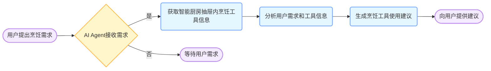

# 智能厨房抽屉：AI Agent的烹饪工具使用建议

> 关键词：智能厨房抽屉、AI Agent、烹饪工具、使用建议、人工智能烹饪

> 摘要：本文聚焦于智能厨房抽屉与AI Agent在烹饪场景中的应用。首先介绍了相关背景，包括目的、预期读者、文档结构和术语表。接着阐述了核心概念及联系，通过文本示意图和Mermaid流程图展示。详细讲解了核心算法原理，并用Python代码进行说明，同时给出了数学模型和公式及具体例子。在项目实战部分，涵盖开发环境搭建、源代码实现与解读。还探讨了实际应用场景，推荐了学习资源、开发工具框架和相关论文著作。最后总结了未来发展趋势与挑战，提供常见问题解答和扩展阅读参考资料，旨在为利用AI Agent为智能厨房抽屉提供烹饪工具使用建议提供全面的技术指导。

## 1. 背景介绍 
### 1.1 目的和范围
随着人工智能技术的飞速发展，其在家庭生活中的应用越来越广泛，智能厨房便是其中一个重要的应用场景。智能厨房抽屉结合AI Agent，旨在为用户提供更加智能化、个性化的烹饪工具使用建议。本文的目的在于深入探讨如何利用AI Agent为智能厨房抽屉中的烹饪工具提供合理的使用建议，提高用户的烹饪体验和效率。

文章的范围主要涵盖智能厨房抽屉和AI Agent的相关概念、核心算法原理、数学模型、实际应用案例以及相关的工具和资源推荐等方面。通过全面的分析和讲解，为开发者、研究者以及对智能厨房感兴趣的用户提供有价值的参考。

### 1.2 预期读者
本文的预期读者包括但不限于以下几类人群：
- **人工智能开发者**：对将AI技术应用于智能厨房领域感兴趣，希望了解如何实现AI Agent为烹饪工具提供使用建议的技术细节。
- **智能厨房产品研发人员**：致力于开发智能厨房抽屉等相关产品，需要获取AI Agent在烹饪场景中的应用思路和方法。
- **烹饪爱好者**：希望借助智能技术提升自己的烹饪水平，了解如何利用智能厨房抽屉和AI Agent获得更好的烹饪体验。
- **研究者**：对智能厨房、人工智能在家庭生活中的应用等领域进行研究，需要参考相关的理论和实践案例。

### 1.3 文档结构概述
本文将按照以下结构进行组织：
- **核心概念与联系**：介绍智能厨房抽屉和AI Agent的核心概念，以及它们之间的联系，通过文本示意图和Mermaid流程图进行直观展示。
- **核心算法原理 & 具体操作步骤**：详细讲解实现AI Agent为烹饪工具提供使用建议的核心算法原理，并使用Python源代码进行具体阐述。
- **数学模型和公式 & 详细讲解 & 举例说明**：给出相关的数学模型和公式，进行详细讲解，并通过具体例子加深理解。
- **项目实战：代码实际案例和详细解释说明**：进行实际项目开发，包括开发环境搭建、源代码详细实现和代码解读。
- **实际应用场景**：探讨智能厨房抽屉和AI Agent在不同烹饪场景中的实际应用。
- **工具和资源推荐**：推荐相关的学习资源、开发工具框架和论文著作。
- **总结：未来发展趋势与挑战**：总结智能厨房抽屉和AI Agent的未来发展趋势，分析面临的挑战。
- **附录：常见问题与解答**：解答读者在阅读过程中可能遇到的常见问题。
- **扩展阅读 & 参考资料**：提供相关的扩展阅读内容和参考资料，方便读者进一步深入研究。

### 1.4 术语表
#### 1.4.1 核心术语定义
- **智能厨房抽屉**：具备智能感知、存储和管理烹饪工具功能的厨房抽屉，能够与其他智能设备进行交互。
- **AI Agent**：人工智能代理，是一种能够感知环境、做出决策并采取行动的智能实体，在本文中主要用于为智能厨房抽屉中的烹饪工具提供使用建议。
- **烹饪工具**：用于烹饪过程中的各种器具，如刀具、锅具、餐具等。
- **使用建议**：AI Agent根据用户的需求、烹饪场景和烹饪工具的特点，为用户提供的关于如何使用烹饪工具的建议。

#### 1.4.2 相关概念解释
- **智能感知**：智能厨房抽屉通过传感器等设备，能够感知抽屉内烹饪工具的种类、数量、状态等信息。
- **个性化推荐**：AI Agent根据用户的烹饪习惯、口味偏好等因素，为用户提供个性化的烹饪工具使用建议。
- **上下文感知**：AI Agent能够根据当前的烹饪场景，如烹饪菜品、烹饪步骤等，提供相应的烹饪工具使用建议。

#### 1.4.3 缩略词列表
- **AI**：Artificial Intelligence，人工智能
- **IoT**：Internet of Things，物联网

## 2. 核心概念与联系 

### 核心概念原理
智能厨房抽屉是智能厨房系统的重要组成部分，它通过物联网技术实现与其他智能设备的连接，具备智能感知和管理烹饪工具的能力。抽屉内安装有各种传感器，如重量传感器、位置传感器等，能够实时监测烹饪工具的状态和位置信息。

AI Agent是基于人工智能技术的智能实体，它通过学习大量的烹饪知识和用户数据，能够理解用户的需求和烹饪场景，为用户提供个性化的烹饪工具使用建议。AI Agent可以与智能厨房抽屉进行交互，获取抽屉内烹饪工具的信息，并根据这些信息和用户的需求，生成合理的使用建议。

### 架构的文本示意图
```plaintext
用户 <-> AI Agent <-> 智能厨房抽屉
|                     |
|                     |
V                     V
烹饪需求           烹饪工具信息
```
用户向AI Agent提出烹饪需求，AI Agent根据用户需求和从智能厨房抽屉获取的烹饪工具信息，为用户提供烹饪工具使用建议。

### Mermaid流程图


## 3. 核心算法原理 & 具体操作步骤 

### 核心算法原理
为了实现AI Agent为烹饪工具提供使用建议，我们可以采用基于规则的推理和机器学习相结合的方法。

#### 基于规则的推理
我们可以定义一系列的规则，根据烹饪需求和烹饪工具的特点，直接生成使用建议。例如，如果用户要煎牛排，规则可以规定使用平底锅；如果要煮面条，规则可以规定使用汤锅。

#### 机器学习
使用机器学习算法对大量的烹饪数据进行学习，建立用户的烹饪偏好模型和烹饪工具推荐模型。例如，使用协同过滤算法，根据用户的历史烹饪记录和其他用户的相似记录，为用户推荐合适的烹饪工具。

### 具体操作步骤
1. **数据收集**：收集烹饪工具的信息，如类型、功能、适用场景等；收集用户的烹饪历史数据，包括烹饪菜品、使用的烹饪工具等。
2. **规则定义**：根据烹饪知识和经验，定义一系列的规则，用于基于规则的推理。
3. **模型训练**：使用机器学习算法对收集到的数据进行训练，建立用户的烹饪偏好模型和烹饪工具推荐模型。
4. **需求分析**：当用户提出烹饪需求时，AI Agent首先根据规则进行初步的推理，然后结合机器学习模型进行进一步的分析。
5. **建议生成**：根据分析结果，生成烹饪工具使用建议，并提供给用户。

### Python源代码实现
```python
# 模拟烹饪工具信息
cooking_tools = {
    "平底锅": ["煎牛排", "炒鸡蛋"],
    "汤锅": ["煮面条", "煲汤"],
    "烤箱": ["烤蛋糕", "烤鸡翅"]
}

# 基于规则的推理函数
def rule_based_recommendation(dish):
    recommendations = []
    for tool, suitable_dishes in cooking_tools.items():
        if dish in suitable_dishes:
            recommendations.append(tool)
    return recommendations

# 模拟用户提出烹饪需求
dish = "煎牛排"
recommendations = rule_based_recommendation(dish)
print(f"为了烹饪 {dish}，建议使用的烹饪工具：{recommendations}")
```

## 4. 数学模型和公式 & 详细讲解 & 举例说明 

### 数学模型
我们可以使用协同过滤算法来建立烹饪工具推荐模型。协同过滤算法基于用户之间的相似性进行推荐，其核心思想是如果两个用户在过去的烹饪行为上相似，那么他们对未来的烹饪工具需求也可能相似。

### 公式
设 $U$ 为用户集合，$I$ 为烹饪工具集合，$r_{ui}$ 表示用户 $u$ 对烹饪工具 $i$ 的使用频率。用户 $u$ 和用户 $v$ 之间的相似度可以使用皮尔逊相关系数来计算：

$$
sim(u, v) = \frac{\sum_{i \in I}(r_{ui} - \bar{r}_u)(r_{vi} - \bar{r}_v)}{\sqrt{\sum_{i \in I}(r_{ui} - \bar{r}_u)^2}\sqrt{\sum_{i \in I}(r_{vi} - \bar{r}_v)^2}}
$$

其中，$\bar{r}_u$ 和 $\bar{r}_v$ 分别表示用户 $u$ 和用户 $v$ 对所有烹饪工具的平均使用频率。

对于用户 $u$，推荐的烹饪工具 $i$ 的得分可以通过以下公式计算：

$$
score(u, i) = \bar{r}_u + \frac{\sum_{v \in U}sim(u, v)(r_{vi} - \bar{r}_v)}{\sum_{v \in U}|sim(u, v)|}
$$

### 详细讲解
- 皮尔逊相关系数 $sim(u, v)$ 用于衡量用户 $u$ 和用户 $v$ 之间的相似性。值越接近 1，表示两个用户的烹饪行为越相似；值越接近 -1，表示两个用户的烹饪行为越相反。
- 推荐得分 $score(u, i)$ 综合考虑了用户 $u$ 的平均使用频率和与其他用户的相似性，用于预测用户 $u$ 对烹饪工具 $i$ 的使用可能性。

### 举例说明
假设有三个用户 $U = \{u_1, u_2, u_3\}$ 和三个烹饪工具 $I = \{i_1, i_2, i_3\}$，他们的使用频率矩阵如下：

| 用户 | $i_1$ | $i_2$ | $i_3$ |
| ---- | ---- | ---- | ---- |
| $u_1$ | 3 | 4 | 2 |
| $u_2$ | 4 | 3 | 3 |
| $u_3$ | 2 | 5 | 1 |

首先计算用户之间的相似度：

- $sim(u_1, u_2) = \frac{(3 - 3)(4 - 3.33) + (4 - 3)(3 - 3.33) + (2 - 3)(3 - 3.33)}{\sqrt{(3 - 3)^2 + (4 - 3)^2 + (2 - 3)^2}\sqrt{(4 - 3.33)^2 + (3 - 3.33)^2 + (3 - 3.33)^2}} \approx -0.24$
- $sim(u_1, u_3) = \frac{(3 - 3)(2 - 2.67) + (4 - 3)(5 - 2.67) + (2 - 3)(1 - 2.67)}{\sqrt{(3 - 3)^2 + (4 - 3)^2 + (2 - 3)^2}\sqrt{(2 - 2.67)^2 + (5 - 2.67)^2 + (1 - 2.67)^2}} \approx 0.93$

然后计算用户 $u_1$ 对烹饪工具 $i_3$ 的推荐得分：

$\bar{r}_{u_1} = \frac{3 + 4 + 2}{3} = 3$

$score(u_1, i_3) = 3 + \frac{-0.24(3 - 3.33) + 0.93(1 - 2.67)}{|-0.24| + |0.93|} \approx 2.27$

由于推荐得分较高，说明用户 $u_1$ 可能对烹饪工具 $i_3$ 有较高的使用需求。

## 5. 项目实战：代码实际案例和详细解释说明 

### 5.1  开发环境搭建
#### 硬件环境
- 智能厨房抽屉：配备重量传感器、位置传感器等，用于感知烹饪工具的信息。
- 服务器：用于运行AI Agent和存储数据。可以选择云服务器，如阿里云、腾讯云等。

#### 软件环境
- 操作系统：推荐使用Linux系统，如Ubuntu。
- 编程语言：Python 3.x，用于实现AI Agent的核心算法。
- 数据库：可以选择MySQL或MongoDB，用于存储烹饪工具信息和用户数据。
- 机器学习框架：使用Scikit-learn，用于实现协同过滤算法。

### 5.2  源代码详细实现和代码解读
```python
import numpy as np
from sklearn.metrics.pairwise import cosine_similarity

# 模拟用户-烹饪工具使用频率矩阵
user_item_matrix = np.array([
    [3, 4, 2],
    [4, 3, 3],
    [2, 5, 1]
])

# 计算用户之间的相似度
user_similarity = cosine_similarity(user_item_matrix)

# 为用户u推荐烹饪工具
def recommend_items(user_id, user_item_matrix, user_similarity, top_n=1):
    user_ratings = user_item_matrix[user_id]
    similar_users = user_similarity[user_id]
    item_scores = []

    for item_id in range(user_item_matrix.shape[1]):
        if user_ratings[item_id] == 0:
            score = 0
            similarity_sum = 0
            for other_user_id in range(user_item_matrix.shape[0]):
                if other_user_id != user_id:
                    score += similar_users[other_user_id] * user_item_matrix[other_user_id][item_id]
                    similarity_sum += similar_users[other_user_id]
            if similarity_sum != 0:
                score /= similarity_sum
            item_scores.append((item_id, score))

    item_scores.sort(key=lambda x: x[1], reverse=True)
    recommended_items = [item[0] for item in item_scores[:top_n]]
    return recommended_items

# 为用户0推荐烹饪工具
user_id = 0
recommended_items = recommend_items(user_id, user_item_matrix, user_similarity)
print(f"为用户 {user_id} 推荐的烹饪工具编号：{recommended_items}")
```

### 5.3  代码解读与分析
- **用户-烹饪工具使用频率矩阵**：`user_item_matrix` 表示用户对烹饪工具的使用频率，每一行代表一个用户，每一列代表一个烹饪工具。
- **用户相似度计算**：使用 `cosine_similarity` 函数计算用户之间的相似度，得到 `user_similarity` 矩阵。
- **推荐函数**：`recommend_items` 函数根据用户的使用频率和相似度矩阵，为指定用户推荐未使用过的烹饪工具。
- **推荐结果**：代码最后为用户 0 推荐了一个烹饪工具，并输出其编号。

## 6. 实际应用场景 
### 家庭烹饪
在家庭厨房中，智能厨房抽屉和AI Agent可以为用户提供个性化的烹饪工具使用建议。例如，当用户准备做一道新的菜品时，AI Agent可以根据用户的口味偏好、烹饪习惯和抽屉内的烹饪工具情况，为用户推荐最合适的烹饪工具，并提供详细的使用方法和注意事项。

### 餐厅厨房
在餐厅厨房中，智能厨房抽屉和AI Agent可以提高厨师的工作效率。厨师可以通过语音或手势向AI Agent提出烹饪需求，AI Agent迅速为厨师推荐所需的烹饪工具，并指引厨师从智能厨房抽屉中快速找到这些工具。同时，AI Agent还可以根据餐厅的菜品特点和订单情况，为厨师提供烹饪工具的优化使用建议，减少工具的使用数量和清洗成本。

### 烹饪教学
在烹饪教学场景中，智能厨房抽屉和AI Agent可以作为辅助教学工具。教师可以通过AI Agent向学生展示不同菜品所需的烹饪工具，并演示如何正确使用这些工具。学生可以根据AI Agent的建议，从智能厨房抽屉中取出相应的工具进行实践操作，提高学习效果。

## 7. 工具和资源推荐
### 7.1 学习资源推荐
#### 7.1.1 书籍推荐
- 《人工智能：一种现代的方法》：全面介绍了人工智能的基本概念、算法和应用，是学习人工智能的经典教材。
- 《Python机器学习实战》：通过实际案例详细讲解了Python在机器学习中的应用，适合初学者入门。
- 《智能厨房：技术与应用》：专门介绍了智能厨房领域的相关技术和应用案例，对智能厨房抽屉和AI Agent的学习有很大帮助。

#### 7.1.2 在线课程
- Coursera上的“人工智能基础”课程：由知名高校的教授授课，系统地介绍了人工智能的基础知识和算法。
- edX上的“Python数据科学”课程：重点讲解了Python在数据处理和机器学习中的应用，适合有一定编程基础的学习者。
- 中国大学MOOC上的“智能厨房技术与创新”课程：聚焦于智能厨房领域的最新技术和创新应用，为学习者提供了深入了解智能厨房的机会。

#### 7.1.3 技术博客和网站
- AI科技评论：提供人工智能领域的最新技术动态和深度分析文章。
- 机器之心：专注于人工智能技术的报道和解读，有很多关于智能厨房和AI Agent的相关文章。
- 开源中国：一个开源技术社区，有大量的技术文章和代码分享，对智能厨房项目的开发有很大的参考价值。

### 7.2 开发工具框架推荐
#### 7.2.1 IDE和编辑器
- PyCharm：一款专业的Python集成开发环境，提供了丰富的代码编辑、调试和测试功能，适合Python项目的开发。
- Visual Studio Code：一款轻量级的代码编辑器，支持多种编程语言，有丰富的插件扩展，方便开发者进行快速开发。

#### 7.2.2 调试和性能分析工具
- Py-Spy：一个用于Python程序性能分析的工具，可以帮助开发者找出程序中的性能瓶颈。
- PDB：Python自带的调试器，用于调试Python代码，定位程序中的错误。

#### 7.2.3 相关框架和库
- Scikit-learn：一个强大的机器学习库，提供了丰富的机器学习算法和工具，方便开发者进行模型训练和预测。
- TensorFlow：一个开源的深度学习框架，广泛应用于人工智能领域，可用于构建复杂的深度学习模型。
- Flask：一个轻量级的Python Web框架，用于开发Web应用程序，可用于实现AI Agent的Web接口。

### 7.3 相关论文著作推荐
#### 7.3.1 经典论文
- “Collaborative Filtering for Implicit Feedback Datasets”：详细介绍了协同过滤算法在隐式反馈数据集上的应用，是协同过滤算法的经典论文之一。
- “Recommender Systems Handbook”：全面介绍了推荐系统的相关理论和算法，对烹饪工具推荐系统的研究有很大的参考价值。

#### 7.3.2 最新研究成果
- 近年来，关于智能厨房和AI Agent的研究不断涌现。可以通过IEEE Xplore、ACM Digital Library等学术数据库搜索相关的最新研究论文，了解该领域的最新发展动态。

#### 7.3.3 应用案例分析
- 一些知名企业和研究机构会发布智能厨房相关的应用案例分析报告。可以关注这些报告，了解智能厨房抽屉和AI Agent在实际应用中的效果和经验教训。

## 8. 总结：未来发展趋势与挑战
### 未来发展趋势
- **智能化程度不断提高**：随着人工智能技术的不断发展，AI Agent将具备更强的学习能力和推理能力，能够为用户提供更加精准、个性化的烹饪工具使用建议。智能厨房抽屉也将具备更高的智能感知和管理能力，实现更加自动化的操作。
- **与其他智能设备的融合**：智能厨房抽屉和AI Agent将与其他智能设备，如智能炉灶、智能冰箱等进行深度融合，实现整个厨房的智能化协同工作。例如，智能冰箱可以将食材信息传递给AI Agent，AI Agent根据食材信息为用户推荐合适的烹饪工具和菜品。
- **云服务的应用**：通过云服务，智能厨房抽屉和AI Agent可以存储和处理大量的用户数据和烹饪知识，实现数据的共享和更新。用户可以通过云端平台获取更多的烹饪资源和服务，提高烹饪体验。

### 挑战
- **数据安全和隐私问题**：智能厨房抽屉和AI Agent需要收集和处理大量的用户数据，如烹饪习惯、口味偏好等。如何保障这些数据的安全和隐私，防止数据泄露和滥用，是一个重要的挑战。
- **技术标准和兼容性问题**：目前智能厨房领域的技术标准还不够完善，不同品牌和型号的智能厨房设备之间可能存在兼容性问题。如何建立统一的技术标准，促进智能厨房设备之间的互联互通，是需要解决的问题。
- **用户接受度问题**：虽然智能厨房抽屉和AI Agent具有很多优势，但部分用户可能对新技术存在疑虑和不信任。如何提高用户对智能厨房技术的接受度，推广智能厨房产品的应用，是一个挑战。

## 9. 附录：常见问题与解答
### 问题1：智能厨房抽屉如何感知烹饪工具的信息？
智能厨房抽屉通过安装在抽屉内的各种传感器来感知烹饪工具的信息。例如，重量传感器可以感知烹饪工具的重量，从而判断工具的种类和数量；位置传感器可以感知烹饪工具的位置，方便用户快速找到所需工具。

### 问题2：AI Agent的推荐结果准确吗？
AI Agent的推荐结果的准确性取决于多个因素，如数据的质量和数量、算法的选择和优化等。通过不断收集和分析用户数据，优化算法模型，可以提高AI Agent的推荐准确性。同时，用户也可以根据自己的实际情况对推荐结果进行调整和反馈。

### 问题3：智能厨房抽屉和AI Agent的成本高吗？
智能厨房抽屉和AI Agent的成本受到多种因素的影响，如硬件设备的选型、软件开发的复杂度等。随着技术的不断发展和成本的降低，智能厨房产品的价格也在逐渐下降。目前，市场上已经有一些性价比较高的智能厨房产品可供选择。

### 问题4：如何保证智能厨房抽屉和AI Agent的安全性？
为了保证智能厨房抽屉和AI Agent的安全性，可以采取以下措施：
- 采用安全可靠的硬件设备，确保设备的稳定性和安全性。
- 对数据进行加密处理，防止数据泄露和篡改。
- 定期更新软件系统，修复安全漏洞。
- 加强用户认证和授权管理，防止非法访问。

## 10. 扩展阅读 & 参考资料
### 扩展阅读
- 《智能家居：未来生活的新趋势》：介绍了智能家居领域的发展趋势和应用场景，对智能厨房的发展有一定的启示。
- 《人工智能与人类未来》：探讨了人工智能技术对人类社会的影响和挑战，有助于深入理解智能厨房技术的发展背景。

### 参考资料
- IEEE Transactions on Consumer Electronics：该期刊发表了很多关于智能厨房和消费电子领域的研究论文，具有较高的学术价值。
- ACM SIGKDD Conference on Knowledge Discovery and Data Mining：该会议是数据挖掘领域的顶级会议，收录了很多关于推荐系统和机器学习算法的优秀论文。
- 智能厨房相关企业的官方网站：如方太、美的等企业的官方网站，提供了智能厨房产品的详细信息和技术资料。