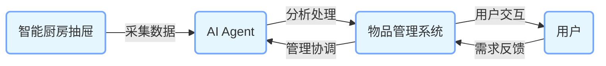

# 智能厨房抽屉：AI Agent的物品管理系统

> 关键词：智能厨房抽屉、AI Agent、物品管理系统、物联网、计算机视觉、机器学习

> 摘要：本文围绕智能厨房抽屉的AI Agent物品管理系统展开，深入探讨了其核心概念、算法原理、数学模型以及实际应用等方面。通过引入AI Agent技术，实现对厨房抽屉内物品的智能管理，提升厨房使用的便利性和效率。文章详细阐述了系统的架构和工作流程，通过Python代码展示了核心算法的实现，并结合实际案例分析了系统的开发和应用。此外，还推荐了相关的学习资源、开发工具和论文著作，最后对该系统的未来发展趋势和挑战进行了总结。

## 1. 背景介绍 
### 1.1 目的和范围
随着智能家居技术的不断发展，人们对厨房的智能化程度有了更高的期望。智能厨房抽屉的AI Agent物品管理系统旨在解决传统厨房中物品管理不便的问题，通过引入人工智能技术，实现对厨房抽屉内物品的自动识别、分类、库存管理和使用建议等功能。本系统的范围涵盖了从物品的识别到管理的整个流程，包括硬件设备的集成、软件算法的实现以及用户界面的设计。

### 1.2 预期读者
本文的预期读者包括智能家居开发者、人工智能研究人员、厨房用品制造商以及对智能厨房感兴趣的普通消费者。对于开发者和研究人员，本文提供了系统的详细技术实现和算法原理，有助于他们进行相关项目的开发和研究。对于制造商和消费者，本文介绍了系统的功能和应用场景，能够帮助他们了解智能厨房抽屉的发展趋势和潜在价值。

### 1.3 文档结构概述
本文共分为十个部分，具体结构如下：
1. 背景介绍：介绍系统的目的、范围、预期读者和文档结构。
2. 核心概念与联系：阐述智能厨房抽屉、AI Agent和物品管理系统的核心概念，并展示它们之间的联系。
3. 核心算法原理 & 具体操作步骤：详细讲解系统中使用的核心算法，包括物品识别算法、库存管理算法等，并给出具体的操作步骤。
4. 数学模型和公式 & 详细讲解 & 举例说明：介绍系统中涉及的数学模型和公式，并通过具体例子进行详细讲解。
5. 项目实战：代码实际案例和详细解释说明：提供系统开发的实际案例，包括开发环境搭建、源代码实现和代码解读。
6. 实际应用场景：介绍系统在不同场景下的实际应用，如家庭厨房、餐厅厨房等。
7. 工具和资源推荐：推荐相关的学习资源、开发工具和论文著作。
8. 总结：未来发展趋势与挑战：总结系统的发展趋势和面临的挑战。
9. 附录：常见问题与解答：解答读者在阅读过程中可能遇到的常见问题。
10. 扩展阅读 & 参考资料：提供相关的扩展阅读材料和参考资料。

### 1.4 术语表
#### 1.4.1 核心术语定义
- **智能厨房抽屉**：配备了传感器、摄像头等设备，能够实现物品自动识别和管理的厨房抽屉。
- **AI Agent**：人工智能代理，是一种能够感知环境、做出决策并采取行动的智能实体。
- **物品管理系统**：用于对物品进行识别、分类、库存管理和使用建议等操作的系统。
- **物联网（IoT）**：通过互联网将各种设备连接起来，实现数据交换和远程控制的技术。
- **计算机视觉**：研究如何使计算机能够理解和处理图像和视频的技术。
- **机器学习**：让计算机通过数据学习模式和规律，从而实现预测和决策的技术。

#### 1.4.2 相关概念解释
- **物品识别**：通过计算机视觉技术，对物品的外观特征进行分析和识别，确定物品的种类和名称。
- **库存管理**：对物品的数量、位置、保质期等信息进行实时监控和管理，确保物品的合理使用和库存充足。
- **使用建议**：根据物品的库存情况、用户的使用习惯和健康需求，为用户提供合理的物品使用建议。

#### 1.4.3 缩略词列表
- **AI**：Artificial Intelligence（人工智能）
- **IoT**：Internet of Things（物联网）
- **CV**：Computer Vision（计算机视觉）
- **ML**：Machine Learning（机器学习）

## 2. 核心概念与联系 
### 核心概念原理
智能厨房抽屉的AI Agent物品管理系统主要由三个核心部分组成：智能厨房抽屉、AI Agent和物品管理系统。

#### 智能厨房抽屉
智能厨房抽屉是系统的硬件基础，它配备了多种传感器和摄像头，用于感知抽屉内物品的状态和信息。传感器可以检测物品的重量、温度、湿度等物理参数，摄像头可以拍摄物品的图像，为后续的物品识别提供数据支持。

#### AI Agent
AI Agent是系统的智能核心，它通过对传感器和摄像头采集的数据进行分析和处理，实现物品的识别、分类、库存管理和使用建议等功能。AI Agent可以根据用户的需求和习惯，自动调整管理策略，提供个性化的服务。

#### 物品管理系统
物品管理系统是系统的软件平台，它负责对AI Agent的决策和行动进行管理和协调。物品管理系统可以与用户进行交互，提供物品的信息查询、库存预警、使用建议等功能。同时，物品管理系统还可以与其他智能家居设备进行集成，实现更加智能化的厨房管理。

### 架构的文本示意图
```plaintext
+---------------------+
| 物品管理系统        |
| (软件平台)          |
+---------------------+
        |
        | 管理和协调
        v
+---------------------+
| AI Agent            |
| (智能核心)          |
+---------------------+
        |
        | 分析和处理
        v
+---------------------+
| 智能厨房抽屉        |
| (硬件基础)          |
| - 传感器            |
| - 摄像头            |
+---------------------+
```

### Mermaid流程图


## 3. 核心算法原理 & 具体操作步骤 
### 物品识别算法原理
物品识别是智能厨房抽屉AI Agent物品管理系统的核心功能之一，其主要目的是通过计算机视觉技术，对抽屉内物品的图像进行分析和识别，确定物品的种类和名称。常用的物品识别算法包括基于深度学习的卷积神经网络（CNN）算法。

#### 卷积神经网络（CNN）原理
卷积神经网络是一种专门用于处理图像数据的深度学习模型，它通过卷积层、池化层和全连接层等组件，自动提取图像的特征，并进行分类和识别。具体来说，卷积层通过卷积核在图像上滑动，提取图像的局部特征；池化层通过对卷积层的输出进行下采样，减少数据的维度；全连接层将池化层的输出进行连接，输出最终的分类结果。

#### Python代码实现
```python
import tensorflow as tf
from tensorflow.keras import layers, models

# 构建卷积神经网络模型
model = models.Sequential([
    layers.Conv2D(32, (3, 3), activation='relu', input_shape=(150, 150, 3)),
    layers.MaxPooling2D((2, 2)),
    layers.Conv2D(64, (3, 3), activation='relu'),
    layers.MaxPooling2D((2, 2)),
    layers.Conv2D(128, (3, 3), activation='relu'),
    layers.MaxPooling2D((2, 2)),
    layers.Flatten(),
    layers.Dense(128, activation='relu'),
    layers.Dense(10, activation='softmax')  # 假设共有10类物品
])

# 编译模型
model.compile(optimizer='adam',
              loss='categorical_crossentropy',
              metrics=['accuracy'])

# 训练模型
# 这里需要准备训练数据和标签
# train_images, train_labels = ...
# model.fit(train_images, train_labels, epochs=10, batch_size=32)

# 使用模型进行物品识别
# test_image = ...
# predictions = model.predict(test_image)
```

### 库存管理算法原理
库存管理是智能厨房抽屉AI Agent物品管理系统的另一个重要功能，其主要目的是对抽屉内物品的数量、位置、保质期等信息进行实时监控和管理，确保物品的合理使用和库存充足。常用的库存管理算法包括基于规则的算法和基于机器学习的算法。

#### 基于规则的库存管理算法原理
基于规则的库存管理算法是根据预设的规则，对物品的库存情况进行判断和处理。例如，当物品的数量低于某个阈值时，系统会自动发出库存预警；当物品的保质期即将到期时，系统会提醒用户及时使用或处理。

#### Python代码实现
```python
# 定义物品库存类
class ItemInventory:
    def __init__(self, item_name, quantity, expiration_date):
        self.item_name = item_name
        self.quantity = quantity
        self.expiration_date = expiration_date

    def check_quantity_threshold(self, threshold):
        if self.quantity < threshold:
            print(f"{self.item_name} 库存不足，当前数量：{self.quantity}")
        else:
            print(f"{self.item_name} 库存充足，当前数量：{self.quantity}")

    def check_expiration_date(self):
        import datetime
        today = datetime.date.today()
        if self.expiration_date < today:
            print(f"{self.item_name} 已过期，过期日期：{self.expiration_date}")
        elif (self.expiration_date - today).days <= 3:  # 提前3天预警
            print(f"{self.item_name} 即将过期，过期日期：{self.expiration_date}")
        else:
            print(f"{self.item_name} 未过期，过期日期：{self.expiration_date}")

# 创建物品库存实例
item = ItemInventory("苹果", 5, "2024-10-10")
item.check_quantity_threshold(3)
item.check_expiration_date()
```

### 具体操作步骤
#### 物品识别操作步骤
1. **数据采集**：通过智能厨房抽屉的摄像头采集物品的图像数据。
2. **数据预处理**：对采集到的图像数据进行预处理，包括图像裁剪、缩放、归一化等操作，以提高模型的识别准确率。
3. **模型加载**：加载预训练的卷积神经网络模型。
4. **物品识别**：将预处理后的图像数据输入到模型中，得到物品的分类结果。

#### 库存管理操作步骤
1. **数据采集**：通过智能厨房抽屉的传感器采集物品的数量、重量等数据。
2. **数据更新**：将采集到的数据更新到物品管理系统的数据库中。
3. **规则判断**：根据预设的规则，对物品的库存情况进行判断，如是否低于阈值、是否即将过期等。
4. **预警处理**：如果物品的库存情况触发了预警规则，系统会自动发出库存预警，提醒用户及时处理。

## 4. 数学模型和公式 & 详细讲解 & 举例说明 
### 卷积神经网络中的数学模型和公式
#### 卷积操作
卷积操作是卷积神经网络的核心操作之一，其数学公式如下：
$$
y_{i,j} = \sum_{m=0}^{M-1} \sum_{n=0}^{N-1} x_{i+m,j+n} \cdot w_{m,n} + b
$$
其中，$x$ 是输入图像，$w$ 是卷积核，$b$ 是偏置项，$y$ 是卷积输出。$M$ 和 $N$ 分别是卷积核的高度和宽度，$i$ 和 $j$ 是输出特征图的坐标。

#### 举例说明
假设输入图像 $x$ 是一个 $3\times3$ 的矩阵：
$$
x = \begin{bmatrix}
1 & 2 & 3 \\
4 & 5 & 6 \\
7 & 8 & 9
\end{bmatrix}
$$
卷积核 $w$ 是一个 $2\times2$ 的矩阵：
$$
w = \begin{bmatrix}
1 & 0 \\
0 & 1
\end{bmatrix}
$$
偏置项 $b = 1$。

则卷积输出 $y$ 的计算过程如下：
- 对于 $y_{0,0}$：
$$
y_{0,0} = x_{0,0} \cdot w_{0,0} + x_{0,1} \cdot w_{0,1} + x_{1,0} \cdot w_{1,0} + x_{1,1} \cdot w_{1,1} + b = 1\times1 + 2\times0 + 4\times0 + 5\times1 + 1 = 7
$$
- 对于 $y_{0,1}$：
$$
y_{0,1} = x_{0,1} \cdot w_{0,0} + x_{0,2} \cdot w_{0,1} + x_{1,1} \cdot w_{1,0} + x_{1,2} \cdot w_{1,1} + b = 2\times1 + 3\times0 + 5\times0 + 6\times1 + 1 = 9
$$
- 对于 $y_{1,0}$：
$$
y_{1,0} = x_{1,0} \cdot w_{0,0} + x_{1,1} \cdot w_{0,1} + x_{2,0} \cdot w_{1,0} + x_{2,1} \cdot w_{1,1} + b = 4\times1 + 5\times0 + 7\times0 + 8\times1 + 1 = 13
$$
- 对于 $y_{1,1}$：
$$
y_{1,1} = x_{1,1} \cdot w_{0,0} + x_{1,2} \cdot w_{0,1} + x_{2,1} \cdot w_{1,0} + x_{2,2} \cdot w_{1,1} + b = 5\times1 + 6\times0 + 8\times0 + 9\times1 + 1 = 15
$$

因此，卷积输出 $y$ 是一个 $2\times2$ 的矩阵：
$$
y = \begin{bmatrix}
7 & 9 \\
13 & 15
\end{bmatrix}
$$

#### 池化操作
池化操作是卷积神经网络中用于减少数据维度的操作，常用的池化操作包括最大池化和平均池化。以最大池化为例，其数学公式如下：
$$
y_{i,j} = \max_{m=0}^{M-1} \max_{n=0}^{N-1} x_{i\times s + m,j\times s + n}
$$
其中，$x$ 是输入特征图，$y$ 是池化输出，$s$ 是池化步长，$M$ 和 $N$ 分别是池化窗口的高度和宽度，$i$ 和 $j$ 是输出特征图的坐标。

#### 举例说明
假设输入特征图 $x$ 是一个 $4\times4$ 的矩阵：
$$
x = \begin{bmatrix}
1 & 2 & 3 & 4 \\
5 & 6 & 7 & 8 \\
9 & 10 & 11 & 12 \\
13 & 14 & 15 & 16
\end{bmatrix}
$$
池化窗口大小为 $2\times2$，步长 $s = 2$。

则池化输出 $y$ 的计算过程如下：
- 对于 $y_{0,0}$：
$$
y_{0,0} = \max(x_{0,0}, x_{0,1}, x_{1,0}, x_{1,1}) = \max(1, 2, 5, 6) = 6
$$
- 对于 $y_{0,1}$：
$$
y_{0,1} = \max(x_{0,2}, x_{0,3}, x_{1,2}, x_{1,3}) = \max(3, 4, 7, 8) = 8
$$
- 对于 $y_{1,0}$：
$$
y_{1,0} = \max(x_{2,0}, x_{2,1}, x_{3,0}, x_{3,1}) = \max(9, 10, 13, 14) = 14
$$
- 对于 $y_{1,1}$：
$$
y_{1,1} = \max(x_{2,2}, x_{2,3}, x_{3,2}, x_{3,3}) = \max(11, 12, 15, 16) = 16
$$

因此，池化输出 $y$ 是一个 $2\times2$ 的矩阵：
$$
y = \begin{bmatrix}
6 & 8 \\
14 & 16
\end{bmatrix}
$$

### 库存管理中的数学模型和公式
#### 库存预警模型
库存预警模型可以用以下公式表示：
$$
\text{预警信号} = 
\begin{cases}
\text{发出预警}, & \text{if } Q < T \\
\text{不发出预警}, & \text{if } Q \geq T
\end{cases}
$$
其中，$Q$ 是物品的当前库存数量，$T$ 是预设的库存阈值。

#### 举例说明
假设某种物品的当前库存数量 $Q = 5$，预设的库存阈值 $T = 10$。由于 $Q < T$，根据库存预警模型，系统会发出预警信号，提醒用户该物品库存不足。

## 5. 项目实战：代码实际案例和详细解释说明 
### 5.1  开发环境搭建
#### 硬件环境
- **智能厨房抽屉**：配备传感器和摄像头的智能抽屉，可以选择市面上已有的产品，如小米智能厨房抽屉。
- **开发板**：选择一款性能稳定的开发板，如树莓派4B，用于运行物品管理系统的软件。
- **网络设备**：确保开发板和智能厨房抽屉能够连接到同一网络，以便进行数据传输。

#### 软件环境
- **操作系统**：在开发板上安装Raspbian操作系统，这是一款基于Debian的轻量级操作系统，适合树莓派使用。
- **Python环境**：安装Python 3.x版本，用于编写和运行系统的代码。
- **深度学习框架**：安装TensorFlow和Keras深度学习框架，用于实现物品识别算法。
- **数据库**：安装MySQL数据库，用于存储物品的信息和库存数据。

### 5.2  源代码详细实现和代码解读
#### 物品识别模块
```python
import tensorflow as tf
from tensorflow.keras.preprocessing import image
import numpy as np

# 加载预训练的模型
model = tf.keras.models.load_model('item_recognition_model.h5')

# 定义物品类别
class_names = ['苹果', '香蕉', '橙子', '牛奶', '面包', '鸡蛋', '巧克力', '薯片', '可乐', '咖啡']

def recognize_item(image_path):
    # 加载图像并进行预处理
    img = image.load_img(image_path, target_size=(150, 150))
    img_array = image.img_to_array(img)
    img_array = np.expand_dims(img_array, axis=0)
    img_array /= 255.0

    # 进行物品识别
    predictions = model.predict(img_array)
    predicted_class_index = np.argmax(predictions)
    predicted_class_name = class_names[predicted_class_index]

    return predicted_class_name

# 测试物品识别
image_path = 'test_image.jpg'
result = recognize_item(image_path)
print(f"识别结果：{result}")
```
**代码解读**：
- 首先，使用`tf.keras.models.load_model`函数加载预训练的物品识别模型。
- 定义物品的类别列表`class_names`，用于将模型的预测结果转换为具体的物品名称。
- `recognize_item`函数用于对输入的图像进行物品识别，具体步骤包括加载图像、预处理图像、使用模型进行预测和获取预测结果。
- 最后，调用`recognize_item`函数对测试图像进行识别，并输出识别结果。

#### 库存管理模块
```python
import mysql.connector

# 连接到数据库
mydb = mysql.connector.connect(
    host="localhost",
    user="your_username",
    password="your_password",
    database="item_inventory"
)

mycursor = mydb.cursor()

# 定义物品库存类
class ItemInventory:
    def __init__(self, item_name, quantity, expiration_date):
        self.item_name = item_name
        self.quantity = quantity
        self.expiration_date = expiration_date

    def add_item(self):
        # 插入物品信息到数据库
        sql = "INSERT INTO items (item_name, quantity, expiration_date) VALUES (%s, %s, %s)"
        val = (self.item_name, self.quantity, self.expiration_date)
        mycursor.execute(sql, val)
        mydb.commit()
        print(f"{self.item_name} 已添加到库存")

    def update_quantity(self, new_quantity):
        # 更新物品的库存数量
        sql = "UPDATE items SET quantity = %s WHERE item_name = %s"
        val = (new_quantity, self.item_name)
        mycursor.execute(sql, val)
        mydb.commit()
        print(f"{self.item_name} 库存数量已更新为 {new_quantity}")

    def check_quantity_threshold(self, threshold):
        # 查询物品的当前库存数量
        sql = "SELECT quantity FROM items WHERE item_name = %s"
        val = (self.item_name,)
        mycursor.execute(sql, val)
        result = mycursor.fetchone()
        if result:
            current_quantity = result[0]
            if current_quantity < threshold:
                print(f"{self.item_name} 库存不足，当前数量：{current_quantity}")
            else:
                print(f"{self.item_name} 库存充足，当前数量：{current_quantity}")
        else:
            print(f"{self.item_name} 未找到库存信息")

# 创建物品库存实例
item = ItemInventory("苹果", 5, "2024-10-10")
item.add_item()
item.update_quantity(3)
item.check_quantity_threshold(4)
```
**代码解读**：
- 首先，使用`mysql.connector`库连接到MySQL数据库。
- 定义物品库存类`ItemInventory`，包含物品的名称、数量和保质期等属性。
- `add_item`方法用于将物品信息插入到数据库中。
- `update_quantity`方法用于更新物品的库存数量。
- `check_quantity_threshold`方法用于检查物品的库存数量是否低于阈值，并输出相应的提示信息。
- 最后，创建物品库存实例，并调用相应的方法进行测试。

### 5.3  代码解读与分析
#### 物品识别模块
- **优点**：使用预训练的模型可以大大提高物品识别的准确率和效率，减少训练时间和成本。同时，代码结构清晰，易于理解和维护。
- **缺点**：模型的性能依赖于训练数据的质量和数量，如果训练数据不足或不具有代表性，可能会导致识别准确率下降。此外，模型的泛化能力有限，对于一些未在训练数据中出现的物品，可能无法准确识别。

#### 库存管理模块
- **优点**：使用数据库来存储物品的信息和库存数据，方便数据的管理和查询。同时，代码中使用了面向对象的编程思想，将物品库存的操作封装在类中，提高了代码的可复用性和可维护性。
- **缺点**：数据库的操作可能会受到网络延迟和数据库性能的影响，导致系统的响应速度变慢。此外，代码中没有对数据库操作的异常情况进行处理，可能会导致程序崩溃。

## 6. 实际应用场景 
### 家庭厨房
在家庭厨房中，智能厨房抽屉的AI Agent物品管理系统可以帮助用户更好地管理厨房物品。用户可以通过手机APP查看抽屉内物品的信息和库存情况，系统会自动发出库存预警，提醒用户及时补充物品。同时，系统还可以根据用户的健康需求和饮食习惯，为用户提供合理的饮食建议。

### 餐厅厨房
在餐厅厨房中，智能厨房抽屉的AI Agent物品管理系统可以提高厨房的管理效率。餐厅工作人员可以通过系统实时监控食材的库存情况，及时采购食材，避免食材短缺或浪费。此外，系统还可以对食材的保质期进行管理，确保食材的新鲜和安全。

### 超市仓库
在超市仓库中，智能厨房抽屉的AI Agent物品管理系统可以实现对商品的自动化管理。超市工作人员可以通过系统快速查找商品的位置和库存数量，提高货物的出入库效率。同时，系统还可以对商品的销售情况进行分析，为超市的采购和营销策略提供数据支持。

## 7. 工具和资源推荐
### 7.1 学习资源推荐
#### 7.1.1 书籍推荐
- 《深度学习》（Deep Learning）：由Ian Goodfellow、Yoshua Bengio和Aaron Courville所著，是深度学习领域的经典教材，涵盖了深度学习的基本概念、算法和应用。
- 《Python机器学习实战》（Hands-On Machine Learning with Scikit-Learn, Keras, and TensorFlow）：由Aurélien Géron所著，通过实际案例介绍了如何使用Python和相关库进行机器学习项目的开发。
- 《计算机视觉：算法与应用》（Computer Vision: Algorithms and Applications）：由Richard Szeliski所著，系统介绍了计算机视觉的基本算法和应用，包括图像滤波、特征提取、目标检测等。

#### 7.1.2 在线课程
- Coursera上的“深度学习专项课程”（Deep Learning Specialization）：由Andrew Ng教授授课，涵盖了深度学习的各个方面，包括神经网络、卷积神经网络、循环神经网络等。
- edX上的“计算机视觉基础”（Foundations of Computer Vision）：由加州大学伯克利分校的教授授课，介绍了计算机视觉的基本概念和算法。
- 阿里云大学上的“人工智能实战营”：提供了丰富的人工智能实战课程，包括机器学习、深度学习、计算机视觉等方面的内容。

#### 7.1.3 技术博客和网站
- Medium：是一个技术博客平台，上面有很多关于人工智能、机器学习和计算机视觉的优秀文章。
- arXiv：是一个预印本数据库，提供了大量的学术论文，涵盖了人工智能、机器学习、计算机视觉等领域的最新研究成果。
- 机器之心：是一个专注于人工智能领域的科技媒体，提供了人工智能领域的最新动态、技术文章和案例分析。

### 7.2 开发工具框架推荐
#### 7.2.1 IDE和编辑器
- PyCharm：是一款专门用于Python开发的集成开发环境，提供了代码编辑、调试、版本控制等功能，支持多种Python框架和库。
- Visual Studio Code：是一款轻量级的代码编辑器，支持多种编程语言和插件，具有丰富的代码编辑和调试功能。
- Jupyter Notebook：是一个交互式的开发环境，适合进行数据分析和机器学习项目的开发，支持Python、R等多种编程语言。

#### 7.2.2 调试和性能分析工具
- TensorBoard：是TensorFlow提供的一个可视化工具，用于监控和分析深度学习模型的训练过程和性能。
- Py-Spy：是一个用于分析Python代码性能的工具，可以帮助开发者找出代码中的性能瓶颈。
- cProfile：是Python标准库中的一个性能分析工具，可以统计代码的运行时间和函数调用次数。

#### 7.2.3 相关框架和库
- TensorFlow：是一个开源的深度学习框架，提供了丰富的深度学习模型和工具，支持多种硬件平台和编程语言。
- Keras：是一个高级神经网络API，基于TensorFlow、Theano等后端，提供了简单易用的模型构建和训练接口。
- OpenCV：是一个开源的计算机视觉库，提供了丰富的计算机视觉算法和工具，用于图像和视频处理、目标检测、特征提取等。

### 7.3 相关论文著作推荐
#### 7.3.1 经典论文
- 《ImageNet Classification with Deep Convolutional Neural Networks》：由Alex Krizhevsky、Ilya Sutskever和Geoffrey E. Hinton所著，介绍了AlexNet卷积神经网络，开创了深度学习在计算机视觉领域的应用先河。
- 《Very Deep Convolutional Networks for Large-Scale Image Recognition》：由Karen Simonyan和Andrew Zisserman所著，提出了VGGNet卷积神经网络，通过增加网络的深度提高了图像分类的准确率。
- 《Going Deeper with Convolutions》：由Christian Szegedy等人所著，提出了GoogLeNet卷积神经网络，采用了Inception模块，提高了网络的计算效率和准确率。

#### 7.3.2 最新研究成果
- 《EfficientNet: Rethinking Model Scaling for Convolutional Neural Networks》：提出了EfficientNet卷积神经网络，通过统一缩放网络的深度、宽度和分辨率，实现了模型的高效缩放。
- 《YOLOv5: You Only Look Once》：是YOLO系列目标检测算法的最新版本，具有更快的检测速度和更高的检测准确率。
- 《Mask R-CNN》：提出了一种基于Faster R-CNN的实例分割算法，能够同时进行目标检测和分割。

#### 7.3.3 应用案例分析
- 《Smart Kitchen: A Review of Technologies and Applications》：对智能厨房技术和应用进行了综述，介绍了智能厨房的发展现状和未来趋势。
- 《AI-Enabled Smart Kitchen for Personalized Nutrition and Health Management》：介绍了一种基于人工智能的智能厨房系统，用于个性化营养和健康管理。
- 《An Intelligent Kitchen Cabinet System for Food Management and Diet Recommendation》：提出了一种智能厨房橱柜系统，用于食品管理和饮食推荐。

## 8. 总结：未来发展趋势与挑战
### 未来发展趋势
#### 智能化程度不断提高
随着人工智能技术的不断发展，智能厨房抽屉的AI Agent物品管理系统将具备更高的智能化程度。系统将能够更好地理解用户的需求和习惯，提供更加个性化的服务。例如，系统可以根据用户的健康状况和饮食偏好，自动调整物品的库存管理策略，并为用户提供定制化的饮食建议。

#### 与其他智能家居设备的集成
智能厨房抽屉的AI Agent物品管理系统将与其他智能家居设备进行更深入的集成，实现整个家居环境的智能化管理。例如，系统可以与智能冰箱、智能烤箱等设备进行联动，实现食材的自动采购、烹饪过程的智能控制等功能。

#### 云服务的应用
云服务将在智能厨房抽屉的AI Agent物品管理系统中得到更广泛的应用。通过云服务，系统可以实现数据的存储、分析和共享，提高系统的性能和可靠性。同时，用户可以通过手机APP等终端设备随时随地访问系统，实现远程控制和管理。

### 挑战
#### 数据隐私和安全问题
智能厨房抽屉的AI Agent物品管理系统需要采集和处理大量的用户数据，如物品信息、使用习惯等。这些数据涉及用户的隐私和安全，因此需要采取有效的措施来保护用户数据的隐私和安全。例如，系统可以采用加密技术对数据进行加密处理，防止数据泄露和篡改。

#### 算法的准确性和可靠性
物品识别和库存管理等算法的准确性和可靠性是智能厨房抽屉的AI Agent物品管理系统的关键。由于厨房环境复杂，物品种类繁多，算法可能会受到光照、遮挡等因素的影响，导致识别准确率下降。因此，需要不断优化算法，提高算法的准确性和可靠性。

#### 成本和普及问题
智能厨房抽屉的AI Agent物品管理系统的成本较高，包括硬件设备的成本和软件开发的成本。这可能会限制系统的普及和应用。因此，需要降低系统的成本，提高系统的性价比，以促进系统的普及和应用。

## 9. 附录：常见问题与解答
### 物品识别不准确怎么办？
- **检查图像质量**：确保摄像头拍摄的物品图像清晰、无遮挡、光照均匀。可以调整摄像头的位置和角度，或者使用补光灯来改善光照条件。
- **增加训练数据**：如果物品识别准确率较低，可能是由于训练数据不足或不具有代表性。可以收集更多的物品图像数据，并对模型进行重新训练。
- **优化模型参数**：可以尝试调整模型的参数，如学习率、批次大小等，以提高模型的性能。

### 库存管理系统出现数据错误怎么办？
- **检查传感器数据**：库存管理系统的数据主要来自于传感器，如重量传感器、RFID传感器等。可以检查传感器的工作状态，确保传感器采集的数据准确无误。
- **检查数据库连接**：如果库存管理系统使用数据库来存储数据，可以检查数据库的连接是否正常，是否存在数据丢失或损坏的情况。
- **进行数据校准**：可以定期对库存管理系统的数据进行校准，确保数据的准确性。

### 系统响应速度慢怎么办？
- **检查硬件性能**：系统的响应速度可能受到硬件性能的影响，如开发板的CPU、内存等。可以检查硬件的配置是否满足系统的要求，或者升级硬件设备。
- **优化算法和代码**：可以对系统中使用的算法和代码进行优化，减少计算量和内存占用，提高系统的运行效率。
- **使用缓存技术**：可以使用缓存技术来减少对数据库和传感器的频繁访问，提高系统的响应速度。

## 10. 扩展阅读 & 参考资料
### 扩展阅读
- 《智能家居：原理、设计与应用》：介绍了智能家居的基本原理、设计方法和应用案例，对智能厨房抽屉的AI Agent物品管理系统的设计和开发有一定的参考价值。
- 《人工智能：现代方法》：全面介绍了人工智能的基本概念、算法和应用，有助于深入理解智能厨房抽屉的AI Agent物品管理系统中使用的人工智能技术。
- 《物联网：技术、应用与标准》：探讨了物联网的技术架构、应用场景和标准规范，对于智能厨房抽屉的AI Agent物品管理系统与物联网的集成有一定的指导意义。

### 参考资料
- [TensorFlow官方文档](https://www.tensorflow.org/)
- [Keras官方文档](https://keras.io/)
- [OpenCV官方文档](https://opencv.org/)
- [MySQL官方文档](https://dev.mysql.com/doc/)
- [树莓派官方网站](https://www.raspberrypi.org/)