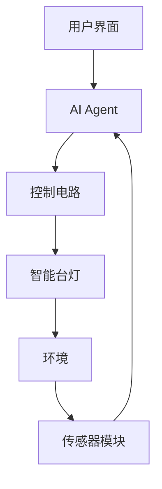

# 智能台灯：AI Agent的个性化照明方案

> 关键词：智能台灯、AI Agent、个性化照明、环境感知、用户偏好

> 摘要：本文深入探讨了智能台灯结合AI Agent实现个性化照明方案的相关技术。首先介绍了智能台灯个性化照明的背景，包括目的、预期读者、文档结构和术语等。接着阐述了核心概念与联系，通过文本示意图和Mermaid流程图展示其原理和架构。详细讲解了核心算法原理和具体操作步骤，并给出Python源代码。对涉及的数学模型和公式进行了分析和举例说明。通过项目实战展示了代码实际案例和详细解释。探讨了智能台灯个性化照明的实际应用场景，推荐了相关的学习资源、开发工具框架和论文著作。最后总结了未来发展趋势与挑战，并提供了常见问题解答和扩展阅读参考资料。

## 1. 背景介绍 
### 1.1 目的和范围
随着科技的不断发展，人们对于生活品质的要求越来越高，照明作为日常生活中不可或缺的一部分，也逐渐朝着智能化、个性化的方向发展。智能台灯结合AI Agent实现个性化照明方案的目的在于为用户提供更加舒适、高效、符合个人需求的照明体验。

本文章的范围主要涵盖智能台灯个性化照明的核心概念、算法原理、数学模型、项目实战、应用场景以及相关的工具和资源推荐等方面。通过对这些内容的详细阐述，帮助读者全面了解智能台灯个性化照明的技术实现和应用。

### 1.2 预期读者
本文预期读者包括但不限于以下几类人群：
- 智能家居开发者：对智能硬件开发和人工智能应用感兴趣，希望了解智能台灯个性化照明的技术实现和开发思路。
- 照明行业从业者：希望借助新技术提升产品竞争力，了解智能台灯个性化照明的发展趋势和应用场景。
- 科技爱好者：对新兴科技有浓厚兴趣，想要深入了解智能台灯结合AI Agent实现个性化照明的原理和优势。
- 研究人员：从事人工智能、物联网等相关领域的研究，希望获取智能台灯个性化照明的相关研究资料和案例。

### 1.3 文档结构概述
本文将按照以下结构进行详细阐述：
- 核心概念与联系：介绍智能台灯个性化照明的核心概念，通过文本示意图和Mermaid流程图展示其原理和架构。
- 核心算法原理 & 具体操作步骤：讲解实现个性化照明的核心算法原理，并给出Python源代码。
- 数学模型和公式 & 详细讲解 & 举例说明：分析涉及的数学模型和公式，并通过具体例子进行说明。
- 项目实战：代码实际案例和详细解释说明：展示智能台灯个性化照明项目的实战案例，包括开发环境搭建、源代码实现和代码解读。
- 实际应用场景：探讨智能台灯个性化照明的实际应用场景。
- 工具和资源推荐：推荐相关的学习资源、开发工具框架和论文著作。
- 总结：未来发展趋势与挑战：总结智能台灯个性化照明的未来发展趋势和面临的挑战。
- 附录：常见问题与解答：提供常见问题的解答。
- 扩展阅读 & 参考资料：提供相关的扩展阅读和参考资料。

### 1.4 术语表
#### 1.4.1 核心术语定义
- 智能台灯：具备智能化功能的台灯，能够根据环境和用户需求自动调节照明参数。
- AI Agent：人工智能代理，是一种能够感知环境、进行决策并采取行动的智能实体。
- 个性化照明：根据用户的个人偏好、环境条件等因素，为用户提供定制化的照明方案。
- 环境感知：通过传感器获取周围环境的信息，如光线强度、颜色、温度等。
- 用户偏好：用户对于照明的亮度、颜色、色温等参数的喜好。

#### 1.4.2 相关概念解释
- 传感器融合：将多个传感器的数据进行融合处理，以获取更准确、全面的环境信息。
- 机器学习：一种人工智能技术，通过对大量数据的学习和分析，让计算机自动发现数据中的规律和模式。
- 深度学习：机器学习的一个分支，使用深度神经网络进行模型训练，能够处理复杂的非线性问题。
- 自然语言处理：让计算机能够理解和处理人类语言的技术，可用于实现与用户的交互。

#### 1.4.3 缩略词列表
- AI：Artificial Intelligence，人工智能
- IoT：Internet of Things，物联网
- RGB：Red, Green, Blue，红、绿、蓝三原色
- PWM：Pulse Width Modulation，脉冲宽度调制

## 2. 核心概念与联系 
### 核心概念原理
智能台灯的个性化照明方案核心在于结合AI Agent实现根据用户偏好和环境条件自动调节照明参数。其原理主要基于以下几个方面：

#### 环境感知
智能台灯配备了多种传感器，如光线传感器、颜色传感器、温度传感器等，用于实时获取周围环境的信息。这些传感器将采集到的数据传输给AI Agent，为后续的决策提供依据。

#### 用户偏好学习
AI Agent通过与用户的交互，学习用户对于照明亮度、颜色、色温等参数的偏好。用户可以通过手机APP、语音指令等方式设置自己的偏好，AI Agent将这些信息进行存储和分析。

#### 决策与控制
AI Agent根据环境感知数据和用户偏好信息，运用预设的算法进行决策，确定最佳的照明参数。然后通过控制电路调节台灯的亮度、颜色、色温等，实现个性化照明。

### 架构的文本示意图
```plaintext
+---------------------+
|      用户界面       |
|  (手机APP、语音等)  |
+---------------------+
          |
          v
+---------------------+
|      AI Agent       |
|  (环境感知、决策)   |
+---------------------+
          |
          |  环境感知数据
          |  用户偏好数据
          v
+---------------------+
|      传感器模块     |
|  (光线、颜色等)     |
+---------------------+
          |
          v
+---------------------+
|      控制电路       |
|  (调节照明参数)     |
+---------------------+
          |
          v
+---------------------+
|      智能台灯       |
|  (提供照明)         |
+---------------------+
```

### Mermaid流程图


## 3. 核心算法原理 & 具体操作步骤 
### 核心算法原理
实现智能台灯个性化照明的核心算法主要包括环境感知数据处理、用户偏好学习和照明参数决策三个部分。

#### 环境感知数据处理
传感器采集到的环境数据可能存在噪声和误差，需要进行预处理。常见的预处理方法包括滤波、归一化等。例如，对于光线传感器采集到的数据，可以使用滑动平均滤波算法去除噪声。

#### 用户偏好学习
用户偏好学习可以采用机器学习算法，如聚类算法、回归算法等。通过对用户历史设置数据的分析，将用户的偏好进行分类和建模。例如，使用K-Means聚类算法将用户的亮度偏好分为几个类别。

#### 照明参数决策
根据环境感知数据和用户偏好模型，采用决策算法确定最佳的照明参数。可以使用基于规则的决策算法或机器学习算法，如决策树、神经网络等。例如，使用决策树算法根据环境光线强度和用户亮度偏好类别，确定台灯的亮度。

### 具体操作步骤
以下是实现智能台灯个性化照明的具体操作步骤：

#### 步骤1：环境数据采集
使用传感器模块采集周围环境的光线强度、颜色、温度等数据。

#### 步骤2：数据预处理
对采集到的环境数据进行滤波、归一化等预处理操作，以提高数据的质量。

#### 步骤3：用户偏好学习
通过用户界面获取用户的照明偏好设置，并将这些数据存储到数据库中。使用机器学习算法对用户偏好数据进行分析和建模。

#### 步骤4：照明参数决策
根据预处理后的环境数据和用户偏好模型，使用决策算法确定最佳的照明参数。

#### 步骤5：控制台灯
将确定的照明参数发送给控制电路，调节台灯的亮度、颜色、色温等。

### Python源代码
以下是一个简单的Python示例代码，用于模拟智能台灯的个性化照明决策过程：

```python
import numpy as np
from sklearn.cluster import KMeans

# 模拟环境数据采集
def collect_environment_data():
    light_intensity = np.random.randint(0, 100)  # 光线强度
    color = np.random.randint(0, 3)  # 颜色类别
    temperature = np.random.randint(20, 30)  # 温度
    return light_intensity, color, temperature

# 模拟用户偏好学习
def learn_user_preferences():
    # 假设用户历史亮度偏好数据
    user_brightness_preferences = np.array([20, 30, 40, 50, 60, 70, 80, 90])
    # 使用K-Means聚类算法进行用户偏好分类
    kmeans = KMeans(n_clusters=3)
    kmeans.fit(user_brightness_preferences.reshape(-1, 1))
    return kmeans

# 照明参数决策
def make_decision(light_intensity, user_preference_model):
    # 根据光线强度和用户偏好模型确定台灯亮度
    if light_intensity < 30:
        cluster = 0
    elif light_intensity < 60:
        cluster = 1
    else:
        cluster = 2
    # 获取该聚类中心的亮度值
    brightness = user_preference_model.cluster_centers_[cluster][0]
    return brightness

# 主函数
def main():
    # 采集环境数据
    light_intensity, color, temperature = collect_environment_data()
    print(f"环境光线强度: {light_intensity}")
    
    # 学习用户偏好
    user_preference_model = learn_user_preferences()
    
    # 进行照明参数决策
    brightness = make_decision(light_intensity, user_preference_model)
    print(f"台灯亮度设置为: {brightness}")

if __name__ == "__main__":
    main()
```

## 4. 数学模型和公式 & 详细讲解 & 举例说明 
### 环境数据预处理
#### 滑动平均滤波
滑动平均滤波是一种常用的信号滤波方法，用于去除噪声。其数学公式为：

$$
y_n = \frac{1}{N} \sum_{i=0}^{N-1} x_{n-i}
$$

其中，$y_n$ 是滤波后的输出值，$x_n$ 是输入的原始数据，$N$ 是滑动窗口的大小。

例如，假设输入的光线强度数据为 $[10, 12, 15, 13, 14]$，滑动窗口大小 $N = 3$，则滤波后的输出为：

$$
y_2 = \frac{10 + 12 + 15}{3} = 12.33
$$

$$
y_3 = \frac{12 + 15 + 13}{3} = 13.33
$$

$$
y_4 = \frac{15 + 13 + 14}{3} = 14
$$

#### 归一化
归一化是将数据映射到一个特定的区间，通常是 $[0, 1]$。常见的归一化方法是线性归一化，其数学公式为：

$$
x_{norm} = \frac{x - x_{min}}{x_{max} - x_{min}}
$$

其中，$x_{norm}$ 是归一化后的值，$x$ 是原始数据，$x_{min}$ 和 $x_{max}$ 分别是数据的最小值和最大值。

例如，假设光线强度数据的最小值为 $0$，最大值为 $100$，原始光线强度为 $50$，则归一化后的值为：

$$
x_{norm} = \frac{50 - 0}{100 - 0} = 0.5
$$

### 用户偏好学习
#### K-Means聚类算法
K-Means聚类算法是一种无监督学习算法，用于将数据分为 $K$ 个类别。其基本思想是通过迭代的方式，不断更新聚类中心，使得数据点到其所属聚类中心的距离之和最小。

K-Means聚类算法的目标函数为：

$$
J = \sum_{i=1}^{n} \sum_{j=1}^{K} r_{ij} \left\| x_i - \mu_j \right\|^2
$$

其中，$n$ 是数据点的数量，$K$ 是聚类的数量，$r_{ij}$ 是指示变量，表示第 $i$ 个数据点是否属于第 $j$ 个聚类，$\mu_j$ 是第 $j$ 个聚类的中心。

K-Means聚类算法的具体步骤如下：
1. 随机初始化 $K$ 个聚类中心。
2. 计算每个数据点到各个聚类中心的距离，将其分配到距离最近的聚类中。
3. 更新每个聚类的中心，即计算该聚类中所有数据点的平均值。
4. 重复步骤2和3，直到聚类中心不再变化或达到最大迭代次数。

例如，假设有以下用户亮度偏好数据：$[20, 30, 40, 50, 60, 70, 80, 90]$，使用K-Means聚类算法将其分为 $3$ 个类别。具体实现可以使用Python的 `sklearn` 库：

```python
import numpy as np
from sklearn.cluster import KMeans

user_brightness_preferences = np.array([20, 30, 40, 50, 60, 70, 80, 90])
kmeans = KMeans(n_clusters=3)
kmeans.fit(user_brightness_preferences.reshape(-1, 1))

print("聚类中心:", kmeans.cluster_centers_)
```

### 照明参数决策
#### 决策树算法
决策树算法是一种基于树结构进行决策的算法。每个内部节点是一个属性上的测试，每个分支是一个测试输出，每个叶节点是一个类别或值。

例如，根据环境光线强度和用户亮度偏好类别，使用决策树算法确定台灯的亮度。假设决策树的规则如下：
- 如果环境光线强度小于 $30$，且用户亮度偏好类别为低，则台灯亮度设置为 $20$。
- 如果环境光线强度小于 $30$，且用户亮度偏好类别为中，则台灯亮度设置为 $30$。
- 如果环境光线强度小于 $30$，且用户亮度偏好类别为高，则台灯亮度设置为 $40$。
- 如果环境光线强度大于等于 $30$ 且小于 $60$，且用户亮度偏好类别为低，则台灯亮度设置为 $40$。
- 如果环境光线强度大于等于 $30$ 且小于 $60$，且用户亮度偏好类别为中，则台灯亮度设置为 $50$。
- 如果环境光线强度大于等于 $30$ 且小于 $60$，且用户亮度偏好类别为高，则台灯亮度设置为 $60$。
- 如果环境光线强度大于等于 $60$，且用户亮度偏好类别为低，则台灯亮度设置为 $60$。
- 如果环境光线强度大于等于 $60$，且用户亮度偏好类别为中，则台灯亮度设置为 $70$。
- 如果环境光线强度大于等于 $60$，且用户亮度偏好类别为高，则台灯亮度设置为 $80$。

以下是一个简单的Python代码实现：

```python
def decision_tree(light_intensity, user_preference_category):
    if light_intensity < 30:
        if user_preference_category == "low":
            return 20
        elif user_preference_category == "medium":
            return 30
        else:
            return 40
    elif light_intensity < 60:
        if user_preference_category == "low":
            return 40
        elif user_preference_category == "medium":
            return 50
        else:
            return 60
    else:
        if user_preference_category == "low":
            return 60
        elif user_preference_category == "medium":
            return 70
        else:
            return 80

# 示例
light_intensity = 40
user_preference_category = "medium"
brightness = decision_tree(light_intensity, user_preference_category)
print(f"台灯亮度设置为: {brightness}")
```

## 5. 项目实战：代码实际案例和详细解释说明 
### 5.1  开发环境搭建
#### 硬件准备
- 智能台灯：选择支持可编程控制的智能台灯，如带有PWM调光功能的LED台灯。
- 传感器模块：选择光线传感器、颜色传感器、温度传感器等，如BH1750光线传感器、TCS34725颜色传感器、DHT11温度传感器。
- 开发板：选择适合的开发板，如Arduino、Raspberry Pi等。

#### 软件准备
- 开发环境：安装Arduino IDE或Raspberry Pi的操作系统。
- 编程语言：使用Python或C/C++进行开发。
- 相关库：安装传感器驱动库、通信库等。

### 5.2  源代码详细实现和代码解读
以下是一个基于Arduino和Python的智能台灯个性化照明项目的示例代码：

#### Arduino代码（控制台灯和传感器）
```cpp
#include <Wire.h>
#include <BH1750.h>

BH1750 lightMeter;

// 初始化PWM引脚
const int pwmPin = 9;

void setup() {
  Serial.begin(9600);
  Wire.begin();
  lightMeter.begin();
  
  // 设置PWM引脚为输出模式
  pinMode(pwmPin, OUTPUT);
}

void loop() {
  // 读取光线强度
  float lux = lightMeter.readLightLevel();
  Serial.print("Light intensity: ");
  Serial.print(lux);
  Serial.println(" lux");
  
  // 等待Python发送亮度指令
  if (Serial.available() > 0) {
    int brightness = Serial.parseInt();
    analogWrite(pwmPin, brightness);
  }
  
  delay(1000);
}
```

代码解读：
- 引入 `Wire.h` 和 `BH1750.h` 库，用于I2C通信和光线传感器读取。
- 在 `setup()` 函数中，初始化串口通信、I2C总线和光线传感器，并设置PWM引脚为输出模式。
- 在 `loop()` 函数中，读取光线强度并通过串口发送给Python程序。同时，等待Python发送的亮度指令，并通过 `analogWrite()` 函数调节台灯的亮度。

#### Python代码（AI Agent决策）
```python
import serial
import time

# 打开串口
ser = serial.Serial('COM3', 9600)

# 模拟用户偏好学习
user_preference_brightness = 50

while True:
    # 读取Arduino发送的光线强度数据
    if ser.in_waiting > 0:
        line = ser.readline().decode('utf-8').rstrip()
        if "Light intensity:" in line:
            light_intensity = float(line.split(":")[1].split(" ")[1])
            print(f"环境光线强度: {light_intensity} lux")
            
            # 照明参数决策
            if light_intensity < 30:
                brightness = 20
            elif light_intensity < 60:
                brightness = 50
            else:
                brightness = 80
            
            # 发送亮度指令给Arduino
            ser.write(str(brightness).encode())
            print(f"台灯亮度设置为: {brightness}")
    
    time.sleep(1)
```

代码解读：
- 引入 `serial` 库，用于与Arduino进行串口通信。
- 模拟用户偏好学习，设置用户偏好的亮度为 $50$。
- 在主循环中，读取Arduino发送的光线强度数据，并根据光线强度进行照明参数决策。
- 将决策后的亮度指令发送给Arduino，调节台灯的亮度。

### 5.3  代码解读与分析
#### Arduino代码分析
- 光线传感器读取：通过 `BH1750` 库读取环境光线强度，并将数据通过串口发送给Python程序。
- PWM调光：根据Python程序发送的亮度指令，使用 `analogWrite()` 函数调节台灯的亮度。

#### Python代码分析
- 串口通信：使用 `serial.Serial()` 函数打开串口，与Arduino进行通信。
- 照明参数决策：根据环境光线强度和用户偏好，使用简单的规则进行照明参数决策。
- 指令发送：将决策后的亮度指令通过串口发送给Arduino。

## 6. 实际应用场景 
### 阅读场景
在阅读时，智能台灯可以根据环境光线强度和用户的阅读习惯，自动调节台灯的亮度和色温。例如，在较暗的环境下，提高台灯的亮度，同时将色温调节为暖白色，以减少眼睛的疲劳。

### 工作场景
在工作时，智能台灯可以根据工作内容和时间，提供合适的照明。例如，在进行精细的视觉工作时，提高台灯的亮度和显色指数，以保证工作的准确性。

### 睡眠场景
在睡眠前，智能台灯可以逐渐降低亮度和色温，营造舒适的睡眠环境。同时，还可以根据用户的睡眠习惯，设置定时关闭功能。

### 娱乐场景
在观看电影、玩游戏等娱乐活动时，智能台灯可以根据屏幕的亮度和颜色，调节台灯的照明效果，增强娱乐体验。

## 7. 工具和资源推荐
### 7.1 学习资源推荐
#### 7.1.1 书籍推荐
- 《智能家居系统设计与开发》：介绍智能家居系统的设计原理和开发方法，包括智能照明系统。
- 《Python机器学习实战》：详细讲解Python在机器学习领域的应用，对于实现智能台灯的个性化照明算法有很大帮助。
- 《传感器技术与应用》：介绍各种传感器的原理和应用，有助于了解智能台灯的环境感知技术。

#### 7.1.2 在线课程
- Coursera上的“人工智能基础”课程：系统学习人工智能的基本概念和算法。
- edX上的“物联网基础”课程：了解物联网的技术架构和应用场景。
- 网易云课堂上的“智能硬件开发实战”课程：学习智能硬件的开发流程和方法。

#### 7.1.3 技术博客和网站
- 开源中国：提供大量的开源项目和技术文章，可搜索智能台灯、AI Agent等相关内容。
- 博客园：有很多开发者分享的技术经验和代码示例。
- Medium：有许多关于人工智能、智能家居的优质文章。

### 7.2 开发工具框架推荐
#### 7.2.1 IDE和编辑器
- Arduino IDE：适合开发基于Arduino的智能硬件项目。
- PyCharm：专业的Python集成开发环境，提供丰富的代码编辑和调试功能。
- Visual Studio Code：轻量级的代码编辑器，支持多种编程语言和插件扩展。

#### 7.2.2 调试和性能分析工具
- Arduino Serial Monitor：用于调试Arduino程序，查看串口通信数据。
- PyCharm的调试功能：可以对Python代码进行单步调试，查找问题。
- 性能分析工具如 `cProfile`：用于分析Python代码的性能瓶颈。

#### 7.2.3 相关框架和库
- TensorFlow：开源的机器学习框架，可用于实现复杂的人工智能算法。
- Scikit-learn：简单易用的机器学习库，提供了丰富的算法和工具。
- RPi.GPIO：用于树莓派的GPIO控制库，方便进行硬件接口开发。

### 7.3 相关论文著作推荐
#### 7.3.1 经典论文
- "Artificial Intelligence: A Modern Approach"：人工智能领域的经典教材，系统介绍了人工智能的各种算法和技术。
- "Sensor Fusion in Smart Lighting Systems"：探讨了传感器融合技术在智能照明系统中的应用。
- "Personalized Lighting Based on User Preferences and Environmental Conditions"：研究了基于用户偏好和环境条件的个性化照明方案。

#### 7.3.2 最新研究成果
- IEEE Xplore、ACM Digital Library等学术数据库：可以搜索到智能台灯、AI Agent、个性化照明等领域的最新研究论文。
- 相关学术会议如ACM SIGKDD、IEEE ICRA等：会发布该领域的最新研究成果。

#### 7.3.3 应用案例分析
- 各大科技公司的官方博客和技术报告：会分享他们在智能照明领域的应用案例和实践经验。
- 行业研究报告：如艾瑞咨询、Gartner等发布的智能照明行业研究报告，提供了市场趋势和应用案例分析。

## 8. 总结：未来发展趋势与挑战
### 未来发展趋势
#### 更加智能化
随着人工智能技术的不断发展，智能台灯将具备更强的学习和决策能力，能够更加准确地理解用户的需求和环境变化，提供更加个性化的照明方案。

#### 与其他智能家居设备的集成
智能台灯将与其他智能家居设备如智能音箱、智能窗帘、智能空调等进行深度集成，实现更加智能化的家居控制。例如，当用户通过智能音箱发出指令时，智能台灯可以与其他设备协同工作，营造出不同的场景氛围。

#### 健康照明
关注用户的健康将成为智能台灯未来的重要发展方向。智能台灯可以根据人体生物钟和健康需求，调节照明的亮度、颜色和色温，减少蓝光对眼睛的伤害，促进用户的健康睡眠和工作效率。

#### 节能与环保
在能源问题日益突出的今天，智能台灯将更加注重节能与环保。通过优化照明算法和采用高效的照明技术，降低能源消耗，减少对环境的影响。

### 挑战
#### 数据隐私和安全
智能台灯在收集用户偏好和环境数据的过程中，涉及到用户的隐私问题。如何保证数据的安全和隐私，防止数据泄露和滥用，是智能台灯发展面临的重要挑战。

#### 算法的准确性和可靠性
智能台灯的个性化照明决策依赖于算法的准确性和可靠性。如何提高算法的性能，减少误判和错误决策，是需要解决的关键问题。

#### 成本和市场接受度
智能台灯的研发和生产成本相对较高，这可能会影响其市场价格和用户接受度。如何在保证产品性能的前提下，降低成本，提高市场竞争力，是智能台灯产业发展需要面对的挑战。

## 9. 附录：常见问题与解答
### 智能台灯的个性化照明方案是否适合所有人？
智能台灯的个性化照明方案是基于用户的偏好和环境条件进行定制的，因此可以满足大多数用户的需求。但不同用户的视觉感受和需求可能存在差异，在实际使用中，用户可以根据自己的实际情况进行调整。

### 智能台灯的传感器精度如何保证？
传感器的精度受到多种因素的影响，如传感器的质量、安装位置、环境干扰等。为了保证传感器的精度，可以选择高质量的传感器产品，合理安装传感器，并采取相应的抗干扰措施。同时，定期对传感器进行校准和维护也是很重要的。

### 智能台灯的个性化照明方案是否会增加能源消耗？
智能台灯的个性化照明方案是根据环境和用户需求进行动态调节的，因此在大多数情况下可以实现节能的效果。例如，在环境光线充足时，降低台灯的亮度；在用户离开时，自动关闭台灯。但如果用户设置的照明参数过高，可能会增加能源消耗。

### 智能台灯的AI Agent如何学习用户的偏好？
智能台灯的AI Agent可以通过多种方式学习用户的偏好，如用户手动设置、语音指令、历史使用记录等。通过对这些数据的分析和建模，AI Agent可以逐渐了解用户的偏好，并提供更加符合用户需求的照明方案。

## 10. 扩展阅读 & 参考资料
### 扩展阅读
- 《智能照明技术与应用》：深入介绍智能照明的技术原理和应用案例。
- 《人工智能与物联网融合发展研究》：探讨人工智能与物联网在智能家居领域的融合应用。
- 《LED照明技术与设计》：了解LED照明的技术特点和设计方法。

### 参考资料
- Arduino官方文档：https://www.arduino.cc/reference/en/
- Raspberry Pi官方文档：https://www.raspberrypi.org/documentation/
- TensorFlow官方文档：https://www.tensorflow.org/api_docs
- Scikit-learn官方文档：https://scikit-learn.org/stable/documentation.html