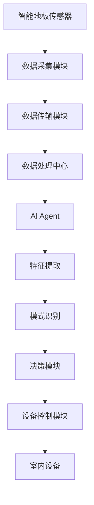

# 智能地板：AI Agent的室内活动模式分析

> 关键词：智能地板、AI Agent、室内活动模式、数据分析、行为识别

> 摘要：本文围绕智能地板与AI Agent的室内活动模式分析展开。详细介绍了智能地板的技术原理、AI Agent的工作机制，探讨了如何通过智能地板收集的数据对AI Agent在室内的活动模式进行分析。阐述了相关核心概念、算法原理、数学模型，并通过项目实战展示具体实现过程。同时，分析了其实际应用场景，推荐了相关学习资源、开发工具和论文著作，最后对未来发展趋势与挑战进行了总结，还提供了常见问题解答及参考资料，为深入研究和应用智能地板与AI Agent的室内活动模式分析提供全面的技术指导。

## 1. 背景介绍 
### 1.1 目的和范围
智能地板作为一种新兴的物联网设备，能够感知和记录室内人员或物体的活动信息。而AI Agent（人工智能代理）则可以利用这些信息进行更深入的分析和决策。本文章的目的在于深入探讨如何利用智能地板所收集的数据，借助AI Agent对室内活动模式进行全面、准确的分析。范围涵盖了智能地板的工作原理、AI Agent的应用算法、室内活动模式的识别与分析方法，以及相关技术在实际场景中的应用等方面。

### 1.2 预期读者
本文预期读者包括对物联网、人工智能、智能家居等领域感兴趣的技术爱好者，从事相关领域研究的科研人员，以及希望将智能地板和AI Agent技术应用于实际项目的工程师和开发者。同时，对于关注室内空间管理和人员行为分析的企业管理人员和决策者也具有一定的参考价值。

### 1.3 文档结构概述
本文首先介绍了相关的背景知识，包括目的、预期读者和文档结构。接着阐述了智能地板和AI Agent的核心概念及其联系，给出了原理和架构的文本示意图与Mermaid流程图。然后详细讲解了核心算法原理和具体操作步骤，并给出了Python源代码。随后介绍了相关的数学模型和公式，并举例说明。通过项目实战部分展示了代码实际案例和详细解释。分析了智能地板与AI Agent在室内活动模式分析的实际应用场景。推荐了相关的学习资源、开发工具和论文著作。最后总结了未来发展趋势与挑战，提供了常见问题解答和参考资料。

### 1.4 术语表
#### 1.4.1 核心术语定义
- **智能地板**：一种集成了传感器技术的地板，能够感知压力、振动、温度等物理量，从而获取室内人员或物体的活动信息。
- **AI Agent**：人工智能代理，是一种能够感知环境、进行推理和决策，并采取行动以实现特定目标的智能实体。
- **室内活动模式**：指人员或物体在室内空间中的行为规律和活动特征，如行走路径、停留时间、活动频率等。

#### 1.4.2 相关概念解释
- **物联网（IoT）**：通过各种信息传感器、射频识别技术、全球定位系统等各种装置与技术，实时采集任何需要监控、连接、互动的物体或过程，采集其声、光、热、电、力学、化学、生物、位置等各种需要的信息，通过各类可能的网络接入，实现物与物、物与人的泛在连接，实现对物品和过程的智能化感知、识别和管理。
- **机器学习**：一门多领域交叉学科，涉及概率论、统计学、逼近论、凸分析、算法复杂度理论等多门学科。它专门研究计算机怎样模拟或实现人类的学习行为，以获取新的知识或技能，重新组织已有的知识结构使之不断改善自身的性能。

#### 1.4.3 缩略词列表
- **IoT**：Internet of Things（物联网）
- **ML**：Machine Learning（机器学习）

## 2. 核心概念与联系 

### 智能地板原理
智能地板通常采用压力传感器、振动传感器等多种传感器技术。压力传感器可以感知人员或物体对地板施加的压力变化，通过测量压力的大小和分布，能够推断出人员的位置、行走方向和体重等信息。振动传感器则可以检测到地板表面的微小振动，从而判断人员的运动状态，如是否在行走、跑步或跳跃。

### AI Agent工作机制
AI Agent通过接收智能地板传来的数据，对其进行处理和分析。首先，它会对原始数据进行预处理，去除噪声和无效信息。然后，利用机器学习算法对处理后的数据进行特征提取和模式识别，从而识别出不同的室内活动模式。最后，根据识别结果进行决策和行动，例如控制室内设备的开关、提供个性化的服务等。

### 核心概念原理和架构的文本示意图
智能地板与AI Agent的系统架构主要包括以下几个部分：
1. **数据采集层**：由智能地板上的各种传感器组成，负责采集室内活动的原始数据。
2. **数据传输层**：将采集到的数据通过有线或无线通信网络传输到数据处理中心。
3. **数据处理层**：AI Agent所在的层，对传输过来的数据进行预处理、特征提取和模式识别等操作。
4. **决策与执行层**：根据模式识别的结果，AI Agent做出决策，并控制相关设备执行相应的动作。

### Mermaid流程图


## 3. 核心算法原理 & 具体操作步骤 

### 核心算法原理
在室内活动模式分析中，常用的机器学习算法包括聚类算法、分类算法和时间序列分析算法等。

#### 聚类算法
聚类算法的目的是将相似的数据点划分到同一个簇中。在室内活动模式分析中，可以使用聚类算法将不同的活动模式进行分类。例如，将人员的行走、站立、坐下等活动模式分别聚类。常用的聚类算法有K-Means算法。

#### 分类算法
分类算法用于将数据点分类到不同的类别中。在室内活动模式分析中，可以使用分类算法对已知的活动模式进行分类。例如，训练一个分类器，将人员的活动模式分为正常活动、异常活动等类别。常用的分类算法有决策树、支持向量机等。

#### 时间序列分析算法
时间序列分析算法用于分析随时间变化的数据。在室内活动模式分析中，可以使用时间序列分析算法分析人员的活动频率、活动时间分布等信息。常用的时间序列分析算法有ARIMA模型。

### 具体操作步骤

#### 数据预处理
首先，对智能地板采集到的原始数据进行预处理。这包括去除噪声、缺失值处理和数据归一化等操作。以下是一个使用Python进行数据预处理的示例代码：
```python
import numpy as np
from sklearn.preprocessing import StandardScaler

# 假设data是智能地板采集到的原始数据
data = np.array([[1, 2, 3], [4, 5, 6], [7, 8, 9]])

# 去除缺失值
data = np.nan_to_num(data)

# 数据归一化
scaler = StandardScaler()
scaled_data = scaler.fit_transform(data)
```

#### 特征提取
从预处理后的数据中提取有用的特征。例如，可以提取压力的均值、方差、最大值、最小值等统计特征，以及振动的频率、振幅等特征。以下是一个提取统计特征的示例代码：
```python
import numpy as np

# 假设scaled_data是预处理后的数据
mean_features = np.mean(scaled_data, axis=0)
std_features = np.std(scaled_data, axis=0)
max_features = np.max(scaled_data, axis=0)
min_features = np.min(scaled_data, axis=0)

features = np.hstack((mean_features, std_features, max_features, min_features))
```

#### 模式识别
使用机器学习算法对提取的特征进行模式识别。以下是一个使用K-Means算法进行聚类的示例代码：
```python
from sklearn.cluster import KMeans

# 假设features是提取的特征
kmeans = KMeans(n_clusters=3)  # 假设分为3类
kmeans.fit(features)
labels = kmeans.labels_
```

## 4. 数学模型和公式 & 详细讲解 & 举例说明 

### K-Means算法数学模型和公式
K-Means算法的目标是将数据点划分到 $k$ 个簇中，使得每个数据点到其所属簇的中心点的距离之和最小。

设数据集为 $X = \{x_1, x_2, \cdots, x_n\}$，其中 $x_i \in \mathbb{R}^d$，$n$ 是数据点的数量，$d$ 是数据的维度。$k$ 个簇的中心点为 $C = \{c_1, c_2, \cdots, c_k\}$，其中 $c_j \in \mathbb{R}^d$。

K-Means算法的目标函数为：
$$
J = \sum_{i=1}^{n} \min_{j=1}^{k} \|x_i - c_j\|^2
$$

其中 $\|x_i - c_j\|^2$ 表示数据点 $x_i$ 到中心点 $c_j$ 的欧几里得距离的平方。

### 详细讲解
K-Means算法的具体步骤如下：
1. **初始化**：随机选择 $k$ 个数据点作为初始的中心点 $C$。
2. **分配数据点**：对于每个数据点 $x_i$，计算其到 $k$ 个中心点的距离，将其分配到距离最近的中心点所在的簇中。
3. **更新中心点**：对于每个簇，计算其所有数据点的均值，将该均值作为新的中心点。
4. **重复步骤2和3**：直到中心点不再变化或达到最大迭代次数。

### 举例说明
假设我们有一个二维数据集 $X = \{(1, 2), (2, 3), (8, 9), (9, 10), (15, 16), (16, 17)\}$，我们要将其分为 $k = 3$ 个簇。

1. **初始化**：随机选择 $(1, 2)$，$(8, 9)$，$(15, 16)$ 作为初始的中心点。
2. **分配数据点**：
    - 计算 $(2, 3)$ 到三个中心点的距离，发现其距离 $(1, 2)$ 最近，将其分配到第一个簇中。
    - 计算 $(9, 10)$ 到三个中心点的距离，发现其距离 $(8, 9)$ 最近，将其分配到第二个簇中。
    - 计算 $(16, 17)$ 到三个中心点的距离，发现其距离 $(15, 16)$ 最近，将其分配到第三个簇中。
3. **更新中心点**：
    - 第一个簇的中心点更新为 $((1 + 2)/2, (2 + 3)/2) = (1.5, 2.5)$。
    - 第二个簇的中心点更新为 $((8 + 9)/2, (9 + 10)/2) = (8.5, 9.5)$。
    - 第三个簇的中心点更新为 $((15 + 16)/2, (16 + 17)/2) = (15.5, 16.5)$。
4. **重复步骤2和3**：直到中心点不再变化。

## 5. 项目实战：代码实际案例和详细解释说明 

### 5.1  开发环境搭建
在进行智能地板与AI Agent的室内活动模式分析项目实战之前，需要搭建相应的开发环境。

#### 硬件环境
- 智能地板：选择一款具有压力传感器和振动传感器的智能地板，确保其能够正常采集数据。
- 数据传输设备：如WiFi模块、蓝牙模块等，用于将智能地板采集到的数据传输到计算机或服务器。
- 计算机或服务器：用于运行数据处理和分析程序。

#### 软件环境
- 操作系统：可以选择Windows、Linux或macOS等操作系统。
- 编程语言：Python是一个不错的选择，因为它具有丰富的机器学习和数据分析库。
- 开发工具：可以使用PyCharm、Jupyter Notebook等开发工具。

### 5.2  源代码详细实现和代码解读
以下是一个完整的智能地板与AI Agent的室内活动模式分析项目的源代码示例：

```python
import numpy as np
from sklearn.preprocessing import StandardScaler
from sklearn.cluster import KMeans
import matplotlib.pyplot as plt

# 模拟智能地板采集到的原始数据
data = np.random.rand(100, 3)  # 100个数据点，每个数据点有3个特征

# 数据预处理
data = np.nan_to_num(data)
scaler = StandardScaler()
scaled_data = scaler.fit_transform(data)

# 特征提取
mean_features = np.mean(scaled_data, axis=0)
std_features = np.std(scaled_data, axis=0)
max_features = np.max(scaled_data, axis=0)
min_features = np.min(scaled_data, axis=0)

features = np.hstack((mean_features, std_features, max_features, min_features))

# 模式识别
kmeans = KMeans(n_clusters=3)
kmeans.fit(scaled_data)
labels = kmeans.labels_

# 可视化结果
plt.scatter(scaled_data[:, 0], scaled_data[:, 1], c=labels, cmap='viridis')
centers = kmeans.cluster_centers_
plt.scatter(centers[:, 0], centers[:, 1], c='red', s=200, alpha=0.5)
plt.show()
```

### 5.3  代码解读与分析
1. **数据模拟**：使用 `np.random.rand(100, 3)` 模拟智能地板采集到的原始数据，这里有100个数据点，每个数据点有3个特征。
2. **数据预处理**：使用 `np.nan_to_num` 去除缺失值，使用 `StandardScaler` 进行数据归一化。
3. **特征提取**：提取数据的均值、方差、最大值和最小值等统计特征。
4. **模式识别**：使用K-Means算法将数据分为3个簇。
5. **可视化结果**：使用 `matplotlib` 库将聚类结果可视化，不同颜色的点表示不同的簇，红色的点表示簇的中心点。

## 6. 实际应用场景 
### 智能家居
智能地板与AI Agent的室内活动模式分析可以应用于智能家居系统中。通过分析人员的活动模式，智能家居系统可以自动调节室内温度、光线、电器设备等，提供更加舒适和便捷的居住环境。例如，当检测到人员离开房间时，自动关闭灯光和电器设备，以节省能源。

### 健康监测
在健康监测领域，智能地板可以监测老年人或病人的活动模式。通过分析他们的行走速度、步数、停留时间等信息，可以及时发现异常情况，如摔倒、行动不便等，并及时通知家人或医护人员。

### 商业场所管理
在商业场所，如商场、超市等，智能地板与AI Agent的室内活动模式分析可以帮助管理人员了解顾客的行为习惯和购物路径。通过分析顾客的活动模式，商场可以优化商品布局、调整促销策略，提高顾客的购物体验和商场的销售额。

### 安防监控
智能地板可以作为安防监控系统的一部分。通过分析人员的活动模式，如是否有陌生人进入、是否有异常的行动轨迹等，可以及时发现安全隐患，并采取相应的措施。

## 7. 工具和资源推荐
### 7.1 学习资源推荐
#### 7.1.1 书籍推荐
- 《Python机器学习》：这本书详细介绍了Python在机器学习领域的应用，包括各种机器学习算法的原理和实现。
- 《物联网导论》：全面介绍了物联网的基本概念、技术和应用，对于理解智能地板和AI Agent的相关知识有很大的帮助。
- 《机器学习实战》：通过实际案例介绍了机器学习算法的应用，适合初学者快速上手。

#### 7.1.2 在线课程
- Coursera上的“机器学习”课程：由斯坦福大学的Andrew Ng教授授课，是机器学习领域的经典课程。
- edX上的“物联网基础”课程：系统地介绍了物联网的基础知识和技术。
- 中国大学MOOC上的“Python数据分析与应用”课程：介绍了Python在数据分析领域的应用，包括数据预处理、特征提取和模式识别等内容。

#### 7.1.3 技术博客和网站
- 博客园：有很多技术爱好者分享的关于物联网、人工智能和机器学习的技术文章。
- 知乎：可以在知乎上搜索相关的问题和回答，了解最新的技术动态和应用案例。
- 开源中国：提供了很多开源的物联网和人工智能项目，可以参考和学习。

### 7.2 开发工具框架推荐
#### 7.2.1 IDE和编辑器
- PyCharm：是一款专业的Python集成开发环境，具有代码编辑、调试、版本控制等功能。
- Jupyter Notebook：是一个交互式的开发环境，适合进行数据探索和分析。
- Visual Studio Code：是一款轻量级的代码编辑器，支持多种编程语言和插件。

#### 7.2.2 调试和性能分析工具
- PDB：Python自带的调试工具，可以帮助开发者调试代码。
- cProfile：Python的性能分析工具，可以分析代码的运行时间和内存使用情况。
- TensorBoard：是TensorFlow的可视化工具，可以帮助开发者可视化模型的训练过程和性能。

#### 7.2.3 相关框架和库
- Scikit-learn：是一个常用的机器学习库，提供了各种机器学习算法的实现。
- Pandas：是一个数据分析库，提供了数据处理和分析的工具。
- NumPy：是一个科学计算库，提供了高效的数组操作和数学函数。

### 7.3 相关论文著作推荐
#### 7.3.1 经典论文
- “A Survey on Internet of Things: Architecture, Enabling Technologies, Security and Privacy, and Applications”：全面介绍了物联网的架构、技术、安全和隐私等方面的内容。
- “Machine Learning: A Probabilistic Perspective”：从概率的角度介绍了机器学习的理论和方法。
- “The Elements of Statistical Learning: Data Mining, Inference, and Prediction”：是机器学习领域的经典著作，介绍了统计学习的基本理论和方法。

#### 7.3.2 最新研究成果
- 可以通过IEEE Xplore、ACM Digital Library等学术数据库搜索关于智能地板、AI Agent和室内活动模式分析的最新研究成果。

#### 7.3.3 应用案例分析
- 可以参考一些行业报告和案例分析，了解智能地板与AI Agent在实际应用中的效果和经验。

## 8. 总结：未来发展趋势与挑战
### 未来发展趋势
- **智能化程度不断提高**：随着人工智能技术的不断发展，智能地板与AI Agent的室内活动模式分析将更加智能化。例如，能够自动识别更多复杂的活动模式，提供更加个性化的服务。
- **多传感器融合**：未来的智能地板可能会融合更多类型的传感器，如视觉传感器、声音传感器等，以获取更全面的室内活动信息，提高活动模式分析的准确性。
- **与其他系统的集成**：智能地板与AI Agent的室内活动模式分析将与智能家居、智能建筑、智慧城市等系统更加紧密地集成，实现更加智能化的管理和服务。

### 挑战
- **数据隐私和安全**：智能地板采集的大量个人活动数据涉及到用户的隐私问题，如何保障数据的安全和隐私是一个重要的挑战。
- **算法的准确性和效率**：室内活动模式分析需要处理大量的数据，如何提高算法的准确性和效率，以满足实时性的要求，是一个亟待解决的问题。
- **标准化和互操作性**：目前智能地板和AI Agent的相关技术还缺乏统一的标准，不同厂商的产品之间可能存在互操作性问题，这给系统的集成和应用带来了困难。

## 9. 附录：常见问题与解答
### 智能地板的传感器精度对活动模式分析有多大影响？
智能地板的传感器精度对活动模式分析有很大的影响。传感器精度越高，采集到的数据越准确，能够更准确地反映人员或物体的活动信息，从而提高活动模式分析的准确性。如果传感器精度较低，采集到的数据可能存在误差，导致活动模式分析的结果不准确。

### 如何选择合适的机器学习算法进行室内活动模式分析？
选择合适的机器学习算法需要考虑多个因素，如数据的特点、分析的目标、计算资源等。如果数据具有明显的聚类结构，可以选择聚类算法；如果需要对数据进行分类，可以选择分类算法；如果需要分析数据的时间序列特征，可以选择时间序列分析算法。同时，还需要根据实际情况进行实验和比较，选择最适合的算法。

### 智能地板与AI Agent的室内活动模式分析系统的成本高吗？
智能地板与AI Agent的室内活动模式分析系统的成本取决于多个因素，如智能地板的类型、传感器的精度、数据处理和分析的算法、系统的规模等。一般来说，高端的智能地板和复杂的算法会增加系统的成本。但是，随着技术的不断发展和成本的不断降低，智能地板与AI Agent的室内活动模式分析系统的成本也在逐渐下降。

## 10. 扩展阅读 & 参考资料
### 扩展阅读
- 可以阅读一些关于物联网、人工智能和机器学习的前沿研究论文和技术报告，了解最新的技术发展趋势。
- 关注一些行业动态和新闻，了解智能地板与AI Agent的室内活动模式分析在实际应用中的案例和经验。

### 参考资料
- 相关的学术论文、书籍、技术报告等。
- 智能地板和AI Agent相关产品的技术文档和用户手册。
- 开源的物联网和人工智能项目的源代码和文档。