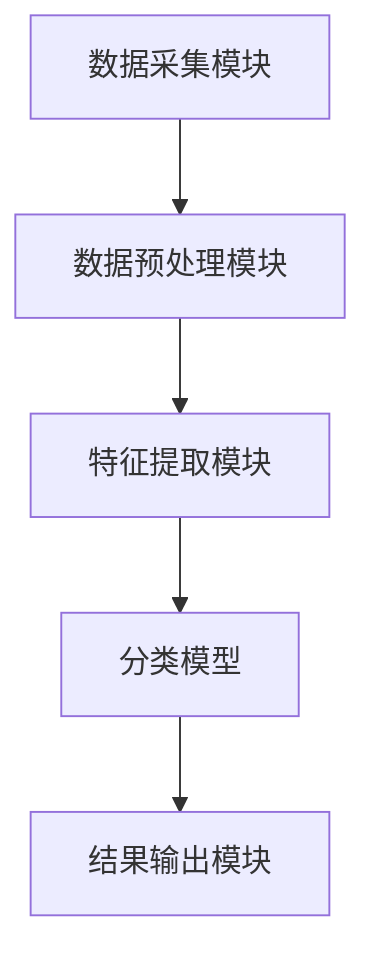

# 智能垃圾分类：AI Agent的识别系统

> 关键词：智能垃圾分类、AI Agent、识别系统、计算机视觉、机器学习、深度学习、环境可持续性

> 摘要：本文聚焦于智能垃圾分类领域中AI Agent识别系统的研究与应用。首先介绍了智能垃圾分类的背景和意义，明确了文章的目的和范围，以及预期读者和文档结构。详细阐述了核心概念，包括AI Agent和垃圾分类识别系统的原理与架构，并给出了相应的文本示意图和Mermaid流程图。深入探讨了核心算法原理，通过Python源代码进行详细说明，同时介绍了相关的数学模型和公式。通过项目实战，展示了开发环境搭建、源代码实现和代码解读的全过程。分析了该识别系统在实际生活中的应用场景，推荐了学习资源、开发工具框架和相关论文著作。最后总结了智能垃圾分类AI Agent识别系统的未来发展趋势与挑战，并提供了常见问题的解答和扩展阅读参考资料。

## 1. 背景介绍 
### 1.1 目的和范围
随着全球城市化进程的加速和人口的不断增长，垃圾产生量也在急剧增加。垃圾分类作为一种有效的垃圾处理方式，对于环境保护、资源回收利用和可持续发展具有至关重要的意义。传统的垃圾分类主要依靠人工进行，效率低下且容易出现错误。因此，开发智能垃圾分类系统成为了当前的研究热点。

本文的目的是深入探讨智能垃圾分类中AI Agent识别系统的相关技术和应用。具体范围包括核心概念的介绍、核心算法原理的分析、数学模型的讲解、项目实战案例的展示、实际应用场景的分析以及相关工具和资源的推荐等。

### 1.2 预期读者
本文的预期读者包括对人工智能、计算机视觉、垃圾分类等领域感兴趣的技术人员、研究人员和学生。同时，对于关注环境保护和可持续发展的相关人士也具有一定的参考价值。

### 1.3 文档结构概述
本文将按照以下结构进行组织：
1. **背景介绍**：介绍智能垃圾分类的背景和意义，明确文章的目的和范围、预期读者以及文档结构。
2. **核心概念与联系**：阐述AI Agent和垃圾分类识别系统的核心概念，给出原理和架构的文本示意图和Mermaid流程图。
3. **核心算法原理 & 具体操作步骤**：详细介绍核心算法原理，并通过Python源代码进行说明。
4. **数学模型和公式 & 详细讲解 & 举例说明**：介绍相关的数学模型和公式，并进行详细讲解和举例。
5. **项目实战：代码实际案例和详细解释说明**：展示项目实战案例，包括开发环境搭建、源代码实现和代码解读。
6. **实际应用场景**：分析智能垃圾分类AI Agent识别系统在实际生活中的应用场景。
7. **工具和资源推荐**：推荐学习资源、开发工具框架和相关论文著作。
8. **总结：未来发展趋势与挑战**：总结智能垃圾分类AI Agent识别系统的未来发展趋势和面临的挑战。
9. **附录：常见问题与解答**：提供常见问题的解答。
10. **扩展阅读 & 参考资料**：提供扩展阅读的内容和参考资料。

### 1.4 术语表
#### 1.4.1 核心术语定义
- **智能垃圾分类**：利用先进的技术手段，如人工智能、传感器等，实现对垃圾的自动分类。
- **AI Agent**：人工智能代理，是一种能够感知环境、做出决策并采取行动的智能实体。
- **识别系统**：用于识别和分类目标对象的系统，在本文中主要指垃圾分类识别系统。
- **计算机视觉**：让计算机能够“看”和理解图像和视频的技术。
- **机器学习**：让计算机通过数据学习模式和规律，从而进行预测和决策的技术。
- **深度学习**：机器学习的一个分支，通过构建深度神经网络来学习数据的高级特征。

#### 1.4.2 相关概念解释
- **卷积神经网络（CNN）**：一种专门用于处理具有网格结构数据（如图像）的深度学习模型，通过卷积层、池化层等结构提取图像特征。
- **目标检测**：在图像或视频中识别和定位特定目标对象的任务。
- **图像分类**：将图像分配到预定义的类别中的任务。

#### 1.4.3 缩略词列表
- **CNN**：Convolutional Neural Network（卷积神经网络）
- **AI**：Artificial Intelligence（人工智能）
- **ML**：Machine Learning（机器学习）
- **DL**：Deep Learning（深度学习）

## 2. 核心概念与联系 

### 核心概念原理
#### AI Agent
AI Agent是一种具有自主性、反应性、主动性和社会性的智能实体。在智能垃圾分类识别系统中，AI Agent可以感知垃圾的图像信息，根据预设的规则和学习到的知识进行分析和决策，最终实现对垃圾的分类。

AI Agent的工作原理主要包括以下几个步骤：
1. **感知**：通过摄像头等设备获取垃圾的图像信息。
2. **分析**：对获取的图像进行处理和分析，提取特征。
3. **决策**：根据提取的特征和预设的规则或学习到的模型，做出垃圾分类的决策。
4. **行动**：将垃圾分类的结果反馈给相应的执行机构，如垃圾桶的开关等。

#### 垃圾分类识别系统
垃圾分类识别系统是基于计算机视觉和机器学习技术构建的系统，其主要原理是通过对大量垃圾图像的学习，构建分类模型，然后利用该模型对新的垃圾图像进行分类。

垃圾分类识别系统的主要组成部分包括：
1. **数据采集模块**：负责采集垃圾的图像数据。
2. **数据预处理模块**：对采集到的图像数据进行预处理，如裁剪、缩放、归一化等。
3. **特征提取模块**：从预处理后的图像中提取特征。
4. **分类模型**：根据提取的特征进行分类。
5. **结果输出模块**：将分类结果输出。

### 架构的文本示意图
```plaintext
+-------------------+
| 数据采集模块      |
| （摄像头等设备）  |
+-------------------+
         |
         v
+-------------------+
| 数据预处理模块    |
| （裁剪、缩放等）  |
+-------------------+
         |
         v
+-------------------+
| 特征提取模块      |
| （CNN等）         |
+-------------------+
         |
         v
+-------------------+
| 分类模型          |
| （训练好的模型）  |
+-------------------+
         |
         v
+-------------------+
| 结果输出模块      |
| （显示分类结果）  |
+-------------------+
```

### Mermaid流程图


## 3. 核心算法原理 & 具体操作步骤 

### 核心算法原理
在智能垃圾分类识别系统中，常用的核心算法是卷积神经网络（CNN）。CNN是一种专门用于处理具有网格结构数据（如图像）的深度学习模型，其主要原理是通过卷积层、池化层和全连接层等结构提取图像的特征，并进行分类。

#### 卷积层
卷积层是CNN的核心层，其主要作用是提取图像的局部特征。卷积层通过卷积核（也称为滤波器）在图像上滑动，进行卷积操作，得到特征图。卷积操作可以表示为：

$$y_{i,j}^k = \sum_{m=0}^{M-1} \sum_{n=0}^{N-1} x_{i+m,j+n} w_{m,n}^k + b^k$$

其中，$x$ 是输入图像，$w$ 是卷积核，$b$ 是偏置，$y$ 是特征图，$i$ 和 $j$ 是特征图的位置索引，$k$ 是卷积核的索引，$M$ 和 $N$ 是卷积核的大小。

#### 池化层
池化层的主要作用是对特征图进行下采样，减少特征图的尺寸，同时保留重要的特征信息。常用的池化方法有最大池化和平均池化。最大池化操作可以表示为：

$$y_{i,j}^k = \max_{m=0}^{M-1} \max_{n=0}^{N-1} x_{iM+m,jN+n}^k$$

其中，$x$ 是输入特征图，$y$ 是池化后的特征图，$i$ 和 $j$ 是池化后特征图的位置索引，$k$ 是特征图的通道索引，$M$ 和 $N$ 是池化窗口的大小。

#### 全连接层
全连接层的主要作用是将卷积层和池化层提取的特征进行整合，并进行分类。全连接层的每个神经元都与上一层的所有神经元相连，其输出可以表示为：

$$y_i = \sum_{j=0}^{N-1} w_{i,j} x_j + b_i$$

其中，$x$ 是输入特征，$w$ 是权重，$b$ 是偏置，$y$ 是输出，$i$ 是输出神经元的索引，$j$ 是输入神经元的索引，$N$ 是输入神经元的数量。

### 具体操作步骤
以下是使用Python和PyTorch库实现一个简单的CNN垃圾分类识别系统的具体操作步骤：

#### 1. 安装必要的库
```bash
pip install torch torchvision
```

#### 2. 数据准备
首先，需要准备垃圾分类的图像数据集。可以将数据集分为训练集和测试集。

```python
import torch
from torchvision import datasets, transforms

# 数据预处理
transform = transforms.Compose([
    transforms.Resize((224, 224)),
    transforms.ToTensor(),
    transforms.Normalize(mean=[0.485, 0.456, 0.406], std=[0.229, 0.224, 0.225])
])

# 加载训练集和测试集
train_dataset = datasets.ImageFolder(root='train_data', transform=transform)
test_dataset = datasets.ImageFolder(root='test_data', transform=transform)

train_loader = torch.utils.data.DataLoader(train_dataset, batch_size=32, shuffle=True)
test_loader = torch.utils.data.DataLoader(test_dataset, batch_size=32, shuffle=False)
```

#### 3. 定义CNN模型
```python
import torch.nn as nn

class SimpleCNN(nn.Module):
    def __init__(self):
        super(SimpleCNN, self).__init__()
        self.conv1 = nn.Conv2d(3, 16, kernel_size=3, padding=1)
        self.relu1 = nn.ReLU()
        self.pool1 = nn.MaxPool2d(kernel_size=2, stride=2)
        self.conv2 = nn.Conv2d(16, 32, kernel_size=3, padding=1)
        self.relu2 = nn.ReLU()
        self.pool2 = nn.MaxPool2d(kernel_size=2, stride=2)
        self.fc1 = nn.Linear(32 * 56 * 56, 128)
        self.relu3 = nn.ReLU()
        self.fc2 = nn.Linear(128, len(train_dataset.classes))

    def forward(self, x):
        x = self.pool1(self.relu1(self.conv1(x)))
        x = self.pool2(self.relu2(self.conv2(x)))
        x = x.view(-1, 32 * 56 * 56)
        x = self.relu3(self.fc1(x))
        x = self.fc2(x)
        return x

model = SimpleCNN()
```

#### 4. 定义损失函数和优化器
```python
import torch.optim as optim

criterion = nn.CrossEntropyLoss()
optimizer = optim.Adam(model.parameters(), lr=0.001)
```

#### 5. 训练模型
```python
num_epochs = 10

for epoch in range(num_epochs):
    running_loss = 0.0
    for i, (images, labels) in enumerate(train_loader):
        optimizer.zero_grad()
        outputs = model(images)
        loss = criterion(outputs, labels)
        loss.backward()
        optimizer.step()
        running_loss += loss.item()
    print(f'Epoch {epoch + 1}, Loss: {running_loss / len(train_loader)}')
```

#### 6. 测试模型
```python
correct = 0
total = 0
with torch.no_grad():
    for images, labels in test_loader:
        outputs = model(images)
        _, predicted = torch.max(outputs.data, 1)
        total += labels.size(0)
        correct += (predicted == labels).sum().item()

print(f'Accuracy: {100 * correct / total}%')
```

## 4. 数学模型和公式 & 详细讲解 & 举例说明 

### 卷积操作的数学模型和公式
如前面所述，卷积操作可以表示为：

$$y_{i,j}^k = \sum_{m=0}^{M-1} \sum_{n=0}^{N-1} x_{i+m,j+n} w_{m,n}^k + b^k$$

详细讲解：
- $x$ 是输入图像，通常是一个三维张量，形状为 $(C, H, W)$，其中 $C$ 是通道数，$H$ 和 $W$ 分别是图像的高度和宽度。
- $w$ 是卷积核，也是一个三维张量，形状为 $(C_{in}, M, N)$，其中 $C_{in}$ 是输入通道数，$M$ 和 $N$ 是卷积核的大小。
- $b$ 是偏置，是一个一维张量，长度为卷积核的数量。
- $y$ 是特征图，形状为 $(C_{out}, H', W')$，其中 $C_{out}$ 是输出通道数，$H'$ 和 $W'$ 是特征图的高度和宽度。

举例说明：
假设输入图像 $x$ 是一个单通道的 $3\times3$ 图像：

$$x = \begin{bmatrix}
1 & 2 & 3 \\
4 & 5 & 6 \\
7 & 8 & 9
\end{bmatrix}$$

卷积核 $w$ 是一个 $2\times2$ 的卷积核：

$$w = \begin{bmatrix}
1 & 2 \\
3 & 4
\end{bmatrix}$$

偏置 $b = 1$。

首先，将卷积核在输入图像上滑动，进行卷积操作。当卷积核的左上角与输入图像的左上角对齐时：

$$y_{0,0} = 1\times1 + 2\times2 + 3\times4 + 4\times5 + 1 = 1 + 4 + 12 + 20 + 1 = 38$$

依次计算其他位置的卷积结果，最终得到特征图。

### 池化操作的数学模型和公式
最大池化操作可以表示为：

$$y_{i,j}^k = \max_{m=0}^{M-1} \max_{n=0}^{N-1} x_{iM+m,jN+n}^k$$

详细讲解：
- $x$ 是输入特征图，形状为 $(C, H, W)$。
- $y$ 是池化后的特征图，形状为 $(C, H', W')$，其中 $H' = \lfloor\frac{H}{M}\rfloor$，$W' = \lfloor\frac{W}{N}\rfloor$。
- $M$ 和 $N$ 是池化窗口的大小。

举例说明：
假设输入特征图 $x$ 是一个单通道的 $4\times4$ 特征图：

$$x = \begin{bmatrix}
1 & 2 & 3 & 4 \\
5 & 6 & 7 & 8 \\
9 & 10 & 11 & 12 \\
13 & 14 & 15 & 16
\end{bmatrix}$$

池化窗口大小为 $2\times2$。

首先，将池化窗口在输入特征图上滑动，取每个窗口内的最大值。当池化窗口的左上角与输入特征图的左上角对齐时：

$$y_{0,0} = \max(1, 2, 5, 6) = 6$$

依次计算其他位置的池化结果，最终得到池化后的特征图：

$$y = \begin{bmatrix}
6 & 8 \\
14 & 16
\end{bmatrix}$$

### 全连接层的数学模型和公式
全连接层的输出可以表示为：

$$y_i = \sum_{j=0}^{N-1} w_{i,j} x_j + b_i$$

详细讲解：
- $x$ 是输入特征，是一个一维张量，长度为 $N$。
- $w$ 是权重矩阵，形状为 $(M, N)$，其中 $M$ 是输出神经元的数量。
- $b$ 是偏置向量，长度为 $M$。
- $y$ 是输出，是一个一维张量，长度为 $M$。

举例说明：
假设输入特征 $x = [1, 2, 3]$，权重矩阵 $w$ 为：

$$w = \begin{bmatrix}
1 & 2 & 3 \\
4 & 5 & 6
\end{bmatrix}$$

偏置向量 $b = [1, 2]$。

则输出 $y$ 为：

$$y_0 = 1\times1 + 2\times2 + 3\times3 + 1 = 1 + 4 + 9 + 1 = 15$$
$$y_1 = 4\times1 + 5\times2 + 6\times3 + 2 = 4 + 10 + 18 + 2 = 34$$

所以，$y = [15, 34]$。

## 5. 项目实战：代码实际案例和详细解释说明 

### 5.1  开发环境搭建
#### 操作系统
可以选择Windows、Linux或macOS操作系统。建议使用Linux系统，因为它在深度学习开发中具有更好的稳定性和性能。

#### Python环境
安装Python 3.7及以上版本。可以使用Anaconda来管理Python环境，具体步骤如下：
1. 从Anaconda官网下载适合自己操作系统的Anaconda安装包。
2. 运行安装包，按照提示进行安装。
3. 创建一个新的Python环境：
```bash
conda create -n garbage_classification python=3.8
conda activate garbage_classification
```

#### 深度学习框架
安装PyTorch和TorchVision库：
```bash
pip install torch torchvision
```

#### 其他依赖库
安装其他必要的依赖库，如NumPy、Matplotlib等：
```bash
pip install numpy matplotlib
```

### 5.2  源代码详细实现和代码解读
#### 数据准备
```python
import torch
from torchvision import datasets, transforms

# 数据预处理
transform = transforms.Compose([
    transforms.Resize((224, 224)),  # 将图像调整为224x224大小
    transforms.ToTensor(),  # 将图像转换为张量
    transforms.Normalize(mean=[0.485, 0.456, 0.406], std=[0.229, 0.224, 0.225])  # 归一化处理
])

# 加载训练集和测试集
train_dataset = datasets.ImageFolder(root='train_data', transform=transform)
test_dataset = datasets.ImageFolder(root='test_data', transform=transform)

train_loader = torch.utils.data.DataLoader(train_dataset, batch_size=32, shuffle=True)
test_loader = torch.utils.data.DataLoader(test_dataset, batch_size=32, shuffle=False)
```
代码解读：
- `transforms.Compose` 用于组合多个数据预处理操作。
- `transforms.Resize` 用于将图像调整为指定大小。
- `transforms.ToTensor` 用于将图像转换为张量。
- `transforms.Normalize` 用于对图像进行归一化处理，使得图像的均值和标准差分别为指定的值。
- `datasets.ImageFolder` 用于从指定的文件夹中加载图像数据集。
- `torch.utils.data.DataLoader` 用于创建数据加载器，方便批量加载数据。

#### 定义CNN模型
```python
import torch.nn as nn

class SimpleCNN(nn.Module):
    def __init__(self):
        super(SimpleCNN, self).__init__()
        self.conv1 = nn.Conv2d(3, 16, kernel_size=3, padding=1)  # 第一个卷积层
        self.relu1 = nn.ReLU()  # 第一个ReLU激活函数
        self.pool1 = nn.MaxPool2d(kernel_size=2, stride=2)  # 第一个最大池化层
        self.conv2 = nn.Conv2d(16, 32, kernel_size=3, padding=1)  # 第二个卷积层
        self.relu2 = nn.ReLU()  # 第二个ReLU激活函数
        self.pool2 = nn.MaxPool2d(kernel_size=2, stride=2)  # 第二个最大池化层
        self.fc1 = nn.Linear(32 * 56 * 56, 128)  # 第一个全连接层
        self.relu3 = nn.ReLU()  # 第三个ReLU激活函数
        self.fc2 = nn.Linear(128, len(train_dataset.classes))  # 第二个全连接层

    def forward(self, x):
        x = self.pool1(self.relu1(self.conv1(x)))
        x = self.pool2(self.relu2(self.conv2(x)))
        x = x.view(-1, 32 * 56 * 56)
        x = self.relu3(self.fc1(x))
        x = self.fc2(x)
        return x

model = SimpleCNN()
```
代码解读：
- `nn.Conv2d` 用于定义卷积层。
- `nn.ReLU` 用于定义ReLU激活函数。
- `nn.MaxPool2d` 用于定义最大池化层。
- `nn.Linear` 用于定义全连接层。
- `forward` 方法定义了模型的前向传播过程。

#### 定义损失函数和优化器
```python
import torch.optim as optim

criterion = nn.CrossEntropyLoss()  # 交叉熵损失函数
optimizer = optim.Adam(model.parameters(), lr=0.001)  # Adam优化器
```
代码解读：
- `nn.CrossEntropyLoss` 用于定义交叉熵损失函数，适用于多分类问题。
- `optim.Adam` 用于定义Adam优化器，用于更新模型的参数。

#### 训练模型
```python
num_epochs = 10

for epoch in range(num_epochs):
    running_loss = 0.0
    for i, (images, labels) in enumerate(train_loader):
        optimizer.zero_grad()  # 清空梯度
        outputs = model(images)  # 前向传播
        loss = criterion(outputs, labels)  # 计算损失
        loss.backward()  # 反向传播
        optimizer.step()  # 更新参数
        running_loss += loss.item()
    print(f'Epoch {epoch + 1}, Loss: {running_loss / len(train_loader)}')
```
代码解读：
- `optimizer.zero_grad()` 用于清空梯度，避免梯度累积。
- `model(images)` 进行前向传播，得到模型的输出。
- `criterion(outputs, labels)` 计算损失。
- `loss.backward()` 进行反向传播，计算梯度。
- `optimizer.step()` 更新模型的参数。

#### 测试模型
```python
correct = 0
total = 0
with torch.no_grad():
    for images, labels in test_loader:
        outputs = model(images)
        _, predicted = torch.max(outputs.data, 1)
        total += labels.size(0)
        correct += (predicted == labels).sum().item()

print(f'Accuracy: {100 * correct / total}%')
```
代码解读：
- `torch.no_grad()` 用于关闭梯度计算，提高测试效率。
- `torch.max(outputs.data, 1)` 用于找到输出中概率最大的类别。
- `(predicted == labels).sum().item()` 用于计算预测正确的样本数量。

### 5.3  代码解读与分析
#### 数据预处理的重要性
数据预处理可以提高模型的训练效率和泛化能力。通过调整图像大小、转换为张量和归一化处理，可以使得输入数据具有统一的格式和分布，减少模型的训练难度。

#### 模型结构的选择
在本案例中，选择了一个简单的CNN模型。对于更复杂的任务，可以选择更复杂的模型，如ResNet、VGG等。

#### 损失函数和优化器的选择
交叉熵损失函数适用于多分类问题，Adam优化器具有自适应学习率的特点，能够更快地收敛。

#### 训练和测试过程的分析
在训练过程中，通过多次迭代更新模型的参数，使得损失函数逐渐减小。在测试过程中，使用测试集评估模型的性能，计算准确率。

## 6. 实际应用场景 
### 家庭垃圾分类
在家庭中，可以安装智能垃圾分类识别系统，通过摄像头对垃圾进行识别，然后自动打开相应的垃圾桶。这样可以提高家庭垃圾分类的效率，减少人工分类的麻烦。

### 公共场所垃圾分类
在公共场所，如商场、学校、公园等，可以设置智能垃圾分类垃圾桶。当人们投放垃圾时，系统可以自动识别垃圾的类别，并提示投放是否正确。这有助于提高公共场所垃圾分类的准确率和效率。

### 垃圾处理厂
在垃圾处理厂，可以使用智能垃圾分类识别系统对垃圾进行初步分类，然后将不同类别的垃圾送往不同的处理环节。这可以提高垃圾处理的效率，减少人工分类的工作量。

### 物流和回收行业
在物流和回收行业，智能垃圾分类识别系统可以用于对回收物品进行分类和检测，确保回收物品的质量和安全性。

## 7. 工具和资源推荐
### 7.1 学习资源推荐
#### 7.1.1 书籍推荐
- 《深度学习》（Deep Learning）：由Ian Goodfellow、Yoshua Bengio和Aaron Courville所著，是深度学习领域的经典教材。
- 《Python深度学习》（Deep Learning with Python）：由Francois Chollet所著，通过Python和Keras库介绍深度学习的基本概念和应用。
- 《计算机视觉：算法与应用》（Computer Vision: Algorithms and Applications）：由Richard Szeliski所著，全面介绍计算机视觉的算法和应用。

#### 7.1.2 在线课程
- Coursera上的“深度学习专项课程”（Deep Learning Specialization）：由Andrew Ng教授授课，包括深度学习的基础知识、卷积神经网络、循环神经网络等内容。
- edX上的“计算机视觉基础”（Foundations of Computer Vision）：介绍计算机视觉的基本概念和算法。
- 哔哩哔哩上的一些深度学习和计算机视觉相关的教程，如“李沐深度学习”等。

#### 7.1.3 技术博客和网站
- Medium：有很多关于深度学习和计算机视觉的优秀文章。
- Towards Data Science：专注于数据科学和机器学习领域的技术博客。
- 机器之心：提供人工智能领域的最新技术和应用案例。

### 7.2 开发工具框架推荐
#### 7.2.1 IDE和编辑器
- PyCharm：是一款专门用于Python开发的集成开发环境，具有代码编辑、调试、版本控制等功能。
- Jupyter Notebook：是一个交互式的开发环境，适合进行数据分析和模型实验。
- Visual Studio Code：是一款轻量级的代码编辑器，支持多种编程语言和插件。

#### 7.2.2 调试和性能分析工具
- PyTorch Profiler：用于分析PyTorch模型的性能，找出性能瓶颈。
- TensorBoard：用于可视化深度学习模型的训练过程和性能指标。
- NVIDIA Nsight Systems：用于分析GPU应用程序的性能。

#### 7.2.3 相关框架和库
- PyTorch：是一个开源的深度学习框架，具有动态图和静态图两种模式，易于使用和调试。
- TensorFlow：是另一个广泛使用的深度学习框架，具有强大的分布式训练和部署能力。
- OpenCV：是一个开源的计算机视觉库，提供了丰富的图像处理和计算机视觉算法。

### 7.3 相关论文著作推荐
#### 7.3.1 经典论文
- LeCun, Y., Bottou, L., Bengio, Y., & Haffner, P. (1998). Gradient-based learning applied to document recognition. Proceedings of the IEEE, 86(11), 2278-2324. （介绍了卷积神经网络的经典论文）
- Krizhevsky, A., Sutskever, I., & Hinton, G. E. (2012). ImageNet classification with deep convolutional neural networks. Advances in neural information processing systems, 25. （介绍了AlexNet模型，开启了深度学习在计算机视觉领域的热潮）

#### 7.3.2 最新研究成果
可以通过IEEE Xplore、ACM Digital Library等学术数据库查找智能垃圾分类和计算机视觉领域的最新研究成果。

#### 7.3.3 应用案例分析
可以参考一些知名企业和研究机构发布的智能垃圾分类应用案例，了解实际应用中的技术和挑战。

## 8. 总结：未来发展趋势与挑战
### 未来发展趋势
#### 更高的识别准确率
随着深度学习技术的不断发展，智能垃圾分类识别系统的识别准确率将不断提高。可以通过使用更大规模的数据集、更复杂的模型和更先进的算法来实现。

#### 多模态识别
除了图像识别，未来的智能垃圾分类识别系统可能会结合其他模态的信息，如声音、气味等，提高识别的准确性和可靠性。

#### 智能化和自动化
智能垃圾分类识别系统将与其他智能设备和系统进行集成，实现智能化和自动化的垃圾分类处理。例如，与机器人结合，实现自动分类和搬运。

#### 云服务和边缘计算
通过云服务和边缘计算技术，智能垃圾分类识别系统可以实现数据的实时处理和共享，提高系统的效率和性能。

### 挑战
#### 数据质量和多样性
高质量和多样化的数据集是训练准确的分类模型的关键。然而，收集和标注大量的垃圾图像数据是一项具有挑战性的任务。

#### 复杂环境下的识别
在实际应用中，垃圾的外观和环境条件可能非常复杂，如光照变化、遮挡、重叠等，这会影响识别系统的准确性。

#### 成本和可扩展性
开发和部署智能垃圾分类识别系统需要一定的成本，包括硬件设备、软件算法和数据处理等方面。如何降低成本并实现系统的可扩展性是一个需要解决的问题。

#### 法律法规和社会接受度
智能垃圾分类识别系统的推广和应用需要得到法律法规的支持和社会的广泛接受。如何制定相关的法律法规和提高公众的环保意识是一个长期的挑战。

## 9. 附录：常见问题与解答
### 问题1：智能垃圾分类识别系统的识别准确率能达到多少？
解答：识别准确率取决于多种因素，如数据集的质量和规模、模型的复杂度和训练方法等。目前，一些先进的系统在特定数据集上的识别准确率可以达到90%以上，但在实际应用中，由于环境的复杂性，准确率可能会有所下降。

### 问题2：智能垃圾分类识别系统需要哪些硬件设备？
解答：主要需要摄像头用于采集垃圾图像，还可能需要计算机或服务器用于运行识别算法。在一些实际应用中，还可能需要配备垃圾桶的开关控制装置等。

### 问题3：如何提高智能垃圾分类识别系统的性能？
解答：可以通过以下方法提高系统的性能：
- 使用更大规模和更具多样性的数据集进行训练。
- 选择更复杂和先进的模型，如ResNet、EfficientNet等。
- 进行数据增强，增加训练数据的多样性。
- 优化模型的训练参数和算法。

### 问题4：智能垃圾分类识别系统可以识别所有类型的垃圾吗？
解答：目前还很难识别所有类型的垃圾。一些特殊形状、材质或被遮挡的垃圾可能会影响识别的准确性。此外，新出现的垃圾类型也可能需要对模型进行更新和训练。

### 问题5：智能垃圾分类识别系统的成本高吗？
解答：成本取决于系统的规模和复杂度。简单的系统可能只需要几百元的硬件设备和一些软件开发成本，而大规模的商业应用系统可能需要数万元甚至更高的成本。

## 10. 扩展阅读 & 参考资料
### 扩展阅读
- 了解更多关于深度学习和计算机视觉的基础知识，可以阅读《神经网络与深度学习》等相关书籍。
- 关注智能垃圾分类领域的最新研究成果和应用案例，可以订阅相关的学术期刊和行业杂志。
- 学习如何进行数据采集和标注，可以参考相关的数据科学和机器学习教程。

### 参考资料
- Goodfellow, I., Bengio, Y., & Courville, A. (2016). Deep Learning. MIT Press.
- Chollet, F. (2017). Deep Learning with Python. Manning Publications.
- Szeliski, R. (2010). Computer Vision: Algorithms and Applications. Springer.
- LeCun, Y., Bottou, L., Bengio, Y., & Haffner, P. (1998). Gradient-based learning applied to document recognition. Proceedings of the IEEE, 86(11), 2278-2324.
- Krizhevsky, A., Sutskever, I., & Hinton, G. E. (2012). ImageNet classification with deep convolutional neural networks. Advances in neural information processing systems, 25.