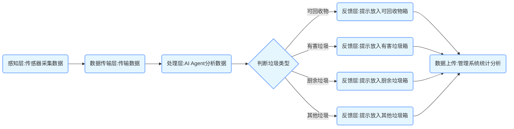

# 智能垃圾箱：AI Agent的废物分类指导

> 关键词：智能垃圾箱、AI Agent、废物分类指导、人工智能、机器学习、传感器技术、物联网

> 摘要：本文聚焦于智能垃圾箱借助AI Agent实现废物分类指导这一前沿技术。通过深入剖析其核心概念、算法原理、数学模型，结合项目实战案例，探讨了该技术在实际应用中的场景和价值。同时，推荐了相关的学习资源、开发工具和论文著作，最后对其未来发展趋势与挑战进行了总结，并提供了常见问题解答和扩展阅读参考资料，旨在为相关领域的研究者和开发者提供全面且深入的技术指南。

## 1. 背景介绍 
### 1.1 目的和范围
随着全球人口的不断增长和城市化进程的加速，垃圾产生量急剧增加，废物分类处理成为环境保护和资源可持续利用的关键环节。传统的废物分类主要依赖人工，效率低下且容易出现分类错误。智能垃圾箱借助AI Agent实现废物分类指导的技术应运而生，旨在提高废物分类的准确性和效率，促进资源的有效回收和再利用。本文的范围涵盖了智能垃圾箱中AI Agent的核心概念、算法原理、数学模型、项目实战、实际应用场景以及相关工具和资源推荐等方面。

### 1.2 预期读者
本文预期读者包括计算机科学、环境科学、自动化控制等领域的研究者、开发者，以及对智能废物管理和人工智能应用感兴趣的技术爱好者和相关行业从业者。

### 1.3 文档结构概述
本文将按照以下结构展开：首先介绍核心概念与联系，包括智能垃圾箱和AI Agent的原理及架构；接着阐述核心算法原理和具体操作步骤，并给出Python源代码示例；然后讲解数学模型和公式，并举例说明；之后通过项目实战展示代码的实际应用和详细解释；再探讨实际应用场景；随后推荐相关的工具和资源；最后总结未来发展趋势与挑战，提供常见问题解答和扩展阅读参考资料。

### 1.4 术语表
#### 1.4.1 核心术语定义
- **智能垃圾箱**：一种集成了传感器、处理器和通信模块的垃圾箱，能够感知垃圾的类型和状态，并通过AI Agent提供废物分类指导。
- **AI Agent**：人工智能代理，是一种能够感知环境、做出决策并采取行动的软件实体，在智能垃圾箱中用于识别垃圾类型并提供分类建议。
- **废物分类**：将不同类型的垃圾按照其特性和处理方式进行区分，如可回收物、有害垃圾、厨余垃圾和其他垃圾。
- **机器学习**：一门多领域交叉学科，涉及概率论、统计学、逼近论、凸分析、算法复杂度理论等多门学科。它专门研究计算机怎样模拟或实现人类的学习行为，以获取新的知识或技能，重新组织已有的知识结构使之不断改善自身的性能。
- **传感器技术**：获取信息的重要手段，通过各种传感器可以感知垃圾的重量、体积、材质等物理特性。

#### 1.4.2 相关概念解释
- **物联网（IoT）**：通过各种信息传感器、射频识别技术、全球定位系统、红外感应器、激光扫描器等各种装置与技术，实时采集任何需要监控、连接、互动的物体或过程，采集其声、光、热、电、力学、化学、生物、位置等各种需要的信息，通过各类可能的网络接入，实现物与物、物与人的泛在连接，实现对物品和过程的智能化感知、识别和管理。在智能垃圾箱中，物联网技术用于实现垃圾箱与管理系统之间的数据传输和远程控制。
- **深度学习**：机器学习的一个分支领域，它是一种基于对数据进行表征学习的方法。深度学习通过构建具有很多层的神经网络模型，自动从大量数据中学习特征和模式，在图像识别、语音识别等领域取得了显著的成果。在智能垃圾箱中，深度学习可用于垃圾图像的识别和分类。

#### 1.4.3 缩略词列表
- **AI**：Artificial Intelligence，人工智能
- **IoT**：Internet of Things，物联网
- **CNN**：Convolutional Neural Network，卷积神经网络
- **RNN**：Recurrent Neural Network，循环神经网络

## 2. 核心概念与联系 
### 核心概念原理
智能垃圾箱借助AI Agent实现废物分类指导的核心原理是综合运用传感器技术、人工智能算法和物联网通信技术。传感器负责收集垃圾的各种信息，如外观图像、重量、体积等；AI Agent利用这些信息进行分析和判断，确定垃圾的类型；最后，通过物联网将分类结果和指导信息反馈给用户或管理系统。

### 架构的文本示意图
智能垃圾箱的架构主要包括以下几个部分：
1. **感知层**：由各种传感器组成，如摄像头、重量传感器、红外传感器等，用于采集垃圾的物理特征和状态信息。
2. **数据传输层**：通过有线或无线通信技术，将传感器采集的数据传输到中央处理器或云端服务器。
3. **处理层**：AI Agent所在的层次，负责对采集的数据进行处理和分析，利用机器学习和深度学习算法识别垃圾的类型，并生成分类指导信息。
4. **反馈层**：将分类结果和指导信息通过显示屏、语音提示等方式反馈给用户，同时将数据上传到管理系统进行统计和分析。

### Mermaid 流程图


## 3. 核心算法原理 & 具体操作步骤 
### 核心算法原理
在智能垃圾箱中，常用的核心算法包括机器学习和深度学习算法，如卷积神经网络（CNN）用于图像识别，支持向量机（SVM）用于特征分类等。以CNN为例，其原理是通过卷积层、池化层和全连接层对图像进行特征提取和分类。

### 具体操作步骤
1. **数据采集**：使用摄像头采集垃圾的图像数据，同时记录垃圾的重量、体积等信息。
2. **数据预处理**：对采集到的图像数据进行预处理，如缩放、裁剪、归一化等，以提高模型的训练效果。
3. **模型训练**：使用标注好的图像数据集对CNN模型进行训练，调整模型的参数，使其能够准确地识别垃圾的类型。
4. **模型评估**：使用测试数据集对训练好的模型进行评估，计算模型的准确率、召回率等指标，评估模型的性能。
5. **实时识别**：将训练好的模型部署到智能垃圾箱中，实时采集垃圾的图像数据，使用模型进行识别，并给出分类指导信息。

### Python源代码示例
```python
import tensorflow as tf
from tensorflow.keras import layers, models

# 构建CNN模型
def build_cnn_model():
    model = models.Sequential()
    model.add(layers.Conv2D(32, (3, 3), activation='relu', input_shape=(150, 150, 3)))
    model.add(layers.MaxPooling2D((2, 2)))
    model.add(layers.Conv2D(64, (3, 3), activation='relu'))
    model.add(layers.MaxPooling2D((2, 2)))
    model.add(layers.Conv2D(128, (3, 3), activation='relu'))
    model.add(layers.MaxPooling2D((2, 2)))
    model.add(layers.Flatten())
    model.add(layers.Dense(128, activation='relu'))
    model.add(layers.Dense(4, activation='softmax'))  # 假设分为4类垃圾

    model.compile(optimizer='adam',
                  loss='categorical_crossentropy',
                  metrics=['accuracy'])
    return model

# 训练模型
def train_model(model, train_images, train_labels, test_images, test_labels, epochs=10):
    history = model.fit(train_images, train_labels, epochs=epochs,
                        validation_data=(test_images, test_labels))
    return history

# 实时识别
def real_time_recognition(model, image):
    image = tf.expand_dims(image, axis=0)
    predictions = model.predict(image)
    predicted_class = tf.argmax(predictions, axis=1)[0].numpy()
    return predicted_class
```

## 4. 数学模型和公式 & 详细讲解 & 举例说明 
### 卷积神经网络的数学模型
卷积神经网络（CNN）的核心是卷积层，其数学模型可以表示为：

$$
y_{i,j}^l = f\left(\sum_{m=0}^{M - 1}\sum_{n=0}^{N - 1}w_{m,n}^l x_{i + m,j + n}^{l - 1}+b^l\right)
$$

其中，$y_{i,j}^l$ 是第 $l$ 层卷积层在位置 $(i, j)$ 的输出，$x_{i + m,j + n}^{l - 1}$ 是第 $l - 1$ 层在位置 $(i + m, j + n)$ 的输入，$w_{m,n}^l$ 是卷积核在位置 $(m, n)$ 的权重，$b^l$ 是偏置项，$f$ 是激活函数，如ReLU函数：

$$
f(x)=\max(0,x)
$$

### 详细讲解
卷积层通过卷积操作提取输入图像的特征，卷积核在输入图像上滑动，与图像的局部区域进行点积运算，得到卷积结果。池化层则用于降低特征图的维度，减少计算量，常用的池化操作有最大池化和平均池化。全连接层将卷积层和池化层提取的特征进行整合，输出分类结果。

### 举例说明
假设输入图像的大小为 $150\times150\times3$（高度 $\times$ 宽度 $\times$ 通道数），卷积核的大小为 $3\times3$，步长为 1，填充为 0。那么卷积层的输出特征图的大小可以通过以下公式计算：

$$
H_{out}=\frac{H_{in}-H_{kernel}+2\times padding}{stride}+1
$$

$$
W_{out}=\frac{W_{in}-W_{kernel}+2\times padding}{stride}+1
$$

其中，$H_{in}$ 和 $W_{in}$ 是输入图像的高度和宽度，$H_{kernel}$ 和 $W_{kernel}$ 是卷积核的高度和宽度，$padding$ 是填充的大小，$stride$ 是步长。代入数据可得：

$$
H_{out}=\frac{150 - 3+2\times0}{1}+1 = 148
$$

$$
W_{out}=\frac{150 - 3+2\times0}{1}+1 = 148
$$

所以，卷积层的输出特征图的大小为 $148\times148\times32$（假设卷积核的数量为 32）。

## 5. 项目实战：代码实际案例和详细解释说明 
### 5.1  开发环境搭建
1. **安装Python**：推荐使用Python 3.7及以上版本，可以从Python官方网站（https://www.python.org/downloads/）下载安装。
2. **安装深度学习框架**：使用TensorFlow或PyTorch等深度学习框架，可通过pip命令进行安装：
```bash
pip install tensorflow
```
3. **安装其他依赖库**：安装OpenCV用于图像处理，NumPy用于数值计算等：
```bash
pip install opencv-python numpy
```

### 5.2  源代码详细实现和代码解读
```python
import tensorflow as tf
from tensorflow.keras.preprocessing.image import ImageDataGenerator
import numpy as np
import cv2

# 数据预处理
train_datagen = ImageDataGenerator(
    rescale=1./255,
    shear_range=0.2,
    zoom_range=0.2,
    horizontal_flip=True
)

test_datagen = ImageDataGenerator(rescale=1./255)

train_generator = train_datagen.flow_from_directory(
    'train_data_directory',
    target_size=(150, 150),
    batch_size=32,
    class_mode='categorical'
)

test_generator = test_datagen.flow_from_directory(
    'test_data_directory',
    target_size=(150, 150),
    batch_size=32,
    class_mode='categorical'
)

# 构建CNN模型
model = tf.keras.Sequential([
    tf.keras.layers.Conv2D(32, (3, 3), activation='relu', input_shape=(150, 150, 3)),
    tf.keras.layers.MaxPooling2D((2, 2)),
    tf.keras.layers.Conv2D(64, (3, 3), activation='relu'),
    tf.keras.layers.MaxPooling2D((2, 2)),
    tf.keras.layers.Conv2D(128, (3, 3), activation='relu'),
    tf.keras.layers.MaxPooling2D((2, 2)),
    tf.keras.layers.Flatten(),
    tf.keras.layers.Dense(128, activation='relu'),
    tf.keras.layers.Dense(4, activation='softmax')
])

model.compile(optimizer='adam',
              loss='categorical_crossentropy',
              metrics=['accuracy'])

# 训练模型
model.fit(
    train_generator,
    steps_per_epoch=train_generator.samples // train_generator.batch_size,
    epochs=10,
    validation_data=test_generator,
    validation_steps=test_generator.samples // test_generator.batch_size
)

# 实时识别
def real_time_recognition(model, image_path):
    img = cv2.imread(image_path)
    img = cv2.resize(img, (150, 150))
    img = np.expand_dims(img, axis=0)
    img = img / 255.0
    predictions = model.predict(img)
    predicted_class = np.argmax(predictions, axis=1)[0]
    class_names = ['可回收物', '有害垃圾', '厨余垃圾', '其他垃圾']
    return class_names[predicted_class]

# 测试实时识别
test_image_path = 'test_image.jpg'
result = real_time_recognition(model, test_image_path)
print(f'识别结果: {result}')
```

### 代码解读与分析
1. **数据预处理**：使用`ImageDataGenerator`对训练数据和测试数据进行预处理，包括归一化、图像增强等操作，以提高模型的泛化能力。
2. **构建CNN模型**：使用`tf.keras.Sequential`构建一个简单的CNN模型，包含卷积层、池化层和全连接层。
3. **模型编译**：使用`adam`优化器和`categorical_crossentropy`损失函数对模型进行编译。
4. **模型训练**：使用`model.fit`方法对模型进行训练，指定训练数据、训练轮数和验证数据。
5. **实时识别**：定义`real_time_recognition`函数，对输入的图像进行预处理和识别，输出识别结果。

## 6. 实际应用场景 
### 城市公共场所
在城市的公园、广场、街道等公共场所设置智能垃圾箱，通过AI Agent为市民提供废物分类指导，提高市民的环保意识和分类准确率。同时，管理部门可以通过物联网实时监控垃圾箱的状态，及时进行清理和维护。

### 学校和企业
在学校和企业内部设置智能垃圾箱，对师生和员工进行废物分类教育和指导。学校可以将废物分类纳入课程体系，培养学生的环保习惯；企业可以通过智能垃圾箱实现废物的有效管理，降低运营成本。

### 社区和居民楼
在社区和居民楼内设置智能垃圾箱，方便居民进行废物分类投放。同时，通过积分奖励等方式激励居民积极参与废物分类，提高社区的环境质量。

## 7. 工具和资源推荐
### 7.1 学习资源推荐
#### 7.1.1 书籍推荐
- 《深度学习》（Deep Learning）：由Ian Goodfellow、Yoshua Bengio和Aaron Courville合著，是深度学习领域的经典教材，涵盖了深度学习的基本概念、算法和应用。
- 《Python机器学习》（Python Machine Learning）：由Sebastian Raschka和Vahid Mirjalili合著，介绍了使用Python进行机器学习的方法和技术，包括数据预处理、模型选择、深度学习等内容。
- 《计算机视觉：算法与应用》（Computer Vision: Algorithms and Applications）：由Richard Szeliski著，详细介绍了计算机视觉的基本算法和应用，如图像处理、特征提取、目标检测等。

#### 7.1.2 在线课程
- Coursera上的“深度学习专项课程”（Deep Learning Specialization）：由Andrew Ng教授授课，包括神经网络和深度学习、改善深层神经网络、结构化机器学习项目、卷积神经网络和序列模型等课程。
- edX上的“人工智能基础”（Introduction to Artificial Intelligence）：由MIT的Patrick Winston教授授课，介绍了人工智能的基本概念、算法和应用。
- 中国大学MOOC上的“机器学习”：由周志华教授授课，系统地介绍了机器学习的基本理论和方法。

#### 7.1.3 技术博客和网站
- Medium：一个技术博客平台，有很多关于人工智能、机器学习和计算机视觉的优秀文章。
- arXiv：一个预印本数据库，提供了大量的学术论文和研究成果，涵盖了人工智能的各个领域。
- Kaggle：一个数据科学竞赛平台，提供了丰富的数据集和竞赛项目，可以通过参与竞赛来提高自己的技术水平。

### 7.2 开发工具框架推荐
#### 7.2.1 IDE和编辑器
- PyCharm：一款专门为Python开发设计的集成开发环境，提供了代码编辑、调试、版本控制等功能。
- Jupyter Notebook：一个交互式的开发环境，支持Python、R等多种编程语言，适合进行数据分析和模型实验。
- Visual Studio Code：一款轻量级的代码编辑器，支持多种编程语言和插件扩展，具有丰富的功能和良好的用户体验。

#### 7.2.2 调试和性能分析工具
- TensorBoard：TensorFlow提供的可视化工具，可以用于监控模型的训练过程、可视化模型结构和分析性能指标。
- PyTorch Profiler：PyTorch提供的性能分析工具，可以帮助开发者找出模型中的性能瓶颈，优化代码。
- cProfile：Python标准库中的性能分析工具，可以统计函数的调用时间和次数，帮助开发者找出代码中的性能问题。

#### 7.2.3 相关框架和库
- TensorFlow：一个开源的深度学习框架，由Google开发，提供了丰富的工具和接口，支持分布式训练和模型部署。
- PyTorch：一个开源的深度学习框架，由Facebook开发，具有动态图的特点，易于使用和调试。
- OpenCV：一个开源的计算机视觉库，提供了丰富的图像处理和计算机视觉算法，如图像滤波、特征提取、目标检测等。

### 7.3 相关论文著作推荐
#### 7.3.1 经典论文
- “ImageNet Classification with Deep Convolutional Neural Networks”：Alex Krizhevsky、Ilya Sutskever和Geoffrey E. Hinton在2012年发表的论文，介绍了AlexNet模型，开启了深度学习在计算机视觉领域的革命。
- “Very Deep Convolutional Networks for Large-Scale Image Recognition”：Karen Simonyan和Andrew Zisserman在2014年发表的论文，提出了VGGNet模型，通过增加网络的深度提高了图像分类的准确率。
- “Going Deeper with Convolutions”：Christian Szegedy等人在2014年发表的论文，提出了GoogLeNet模型，使用了Inception模块，提高了模型的计算效率和准确率。

#### 7.3.2 最新研究成果
- 关注顶级学术会议，如CVPR（Computer Vision and Pattern Recognition）、ICCV（International Conference on Computer Vision）、NeurIPS（Neural Information Processing Systems）等，这些会议上会发表很多关于人工智能和计算机视觉的最新研究成果。
- 关注知名学术期刊，如Journal of Artificial Intelligence Research（JAIR）、Artificial Intelligence、IEEE Transactions on Pattern Analysis and Machine Intelligence（PAMI）等，这些期刊会发表高质量的学术论文。

#### 7.3.3 应用案例分析
- 可以参考一些实际应用案例，如智能安防、自动驾驶、医疗影像诊断等领域的应用案例，了解如何将人工智能技术应用到实际场景中。同时，一些企业和研究机构也会发布相关的技术报告和案例分析，可以从中学习到实际应用中的经验和技巧。

## 8. 总结：未来发展趋势与挑战
### 未来发展趋势
- **智能化程度不断提高**：随着人工智能技术的不断发展，AI Agent将具备更强的学习能力和决策能力，能够更准确地识别垃圾类型，并提供更个性化的分类指导。
- **与物联网深度融合**：智能垃圾箱将与物联网技术深度融合，实现数据的实时传输和远程监控，提高管理效率和资源利用率。
- **多功能集成**：未来的智能垃圾箱可能会集成更多的功能，如垃圾分类宣传、环境监测、自动压缩等，为用户提供更全面的服务。

### 挑战
- **数据质量和标注问题**：高质量的数据是训练准确模型的基础，但垃圾图像数据的收集和标注存在一定的难度，需要投入大量的人力和物力。
- **算法的鲁棒性和泛化能力**：在实际应用中，垃圾的外观和特征可能会受到光照、遮挡、污渍等因素的影响，需要提高算法的鲁棒性和泛化能力。
- **成本和维护问题**：智能垃圾箱的研发和部署成本较高，同时需要定期进行维护和更新，这对企业和管理部门来说是一个挑战。

## 9. 附录：常见问题与解答
### 问题1：智能垃圾箱的识别准确率能达到多少？
智能垃圾箱的识别准确率取决于多种因素，如数据集的质量、模型的复杂度、传感器的精度等。一般来说，经过良好训练的模型在测试数据集上的准确率可以达到80%以上，但在实际应用中，由于环境因素的影响，准确率可能会有所下降。

### 问题2：智能垃圾箱的使用寿命是多久？
智能垃圾箱的使用寿命取决于其硬件质量和使用环境。一般来说，正常使用情况下，智能垃圾箱的使用寿命可以达到3 - 5年，但需要定期进行维护和保养。

### 问题3：智能垃圾箱的成本高吗？
智能垃圾箱的成本相对较高，主要包括硬件成本（传感器、处理器、显示屏等）、软件开发成本和安装维护成本。但随着技术的不断发展和规模的扩大，成本有望逐渐降低。

### 问题4：智能垃圾箱如何进行数据更新和模型优化？
智能垃圾箱可以通过物联网与云端服务器连接，定期上传数据和下载更新后的模型。同时，开发人员可以通过分析上传的数据，不断优化模型，提高识别准确率。

## 10. 扩展阅读 & 参考资料
### 扩展阅读
- 《智能城市：物联网与智慧城市的融合》：介绍了智能城市的概念、技术和应用，探讨了物联网在城市管理中的作用和发展趋势。
- 《人工智能时代的环境管理》：探讨了人工智能技术在环境管理中的应用，如废物处理、空气质量监测等。
- 《机器学习实战》：通过实际案例介绍了机器学习的算法和应用，适合初学者学习。

### 参考资料
- 相关学术论文和研究报告
- 人工智能和计算机视觉领域的技术博客和网站
- 智能垃圾箱的产品说明书和技术文档