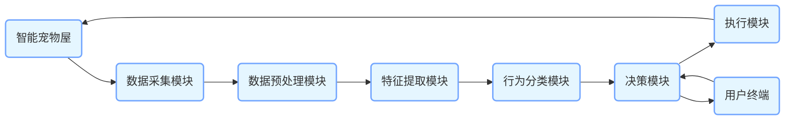

# 智能宠物屋：AI Agent的宠物行为分析

> 关键词：智能宠物屋、AI Agent、宠物行为分析、计算机视觉、机器学习

> 摘要：本文围绕智能宠物屋中AI Agent的宠物行为分析展开。首先介绍了研究的背景、目的、预期读者和文档结构等内容。接着阐述了核心概念及联系，包括AI Agent、宠物行为分析等原理和架构。详细讲解了核心算法原理及具体操作步骤，并给出了Python源代码示例。深入探讨了相关的数学模型和公式，通过举例进行说明。在项目实战部分，展示了开发环境搭建、源代码实现与解读。分析了实际应用场景，推荐了学习资源、开发工具框架和相关论文著作。最后总结了未来发展趋势与挑战，提供了常见问题解答和扩展阅读参考资料，旨在为智能宠物屋中宠物行为分析技术的研究和应用提供全面的技术指导。

## 1. 背景介绍 
### 1.1 目的和范围
随着人们生活水平的提高，宠物在家庭中的地位日益重要。智能宠物屋的出现为宠物的生活提供了更舒适和便利的环境。本研究的目的是利用AI Agent技术对宠物在智能宠物屋中的行为进行分析，以便更好地了解宠物的健康状况、情绪状态和生活习惯。范围涵盖了从数据采集到行为分类和分析的整个过程，包括计算机视觉、机器学习等技术的应用。

### 1.2 预期读者
本文的预期读者包括宠物科技开发者、人工智能研究人员、宠物爱好者以及对智能硬件和数据分析感兴趣的技术人员。希望通过本文，读者能够了解智能宠物屋中宠物行为分析的技术原理和实现方法，为相关项目的开发和研究提供参考。

### 1.3 文档结构概述
本文首先介绍了研究的背景和相关信息，包括目的、预期读者和文档结构。接着详细阐述了核心概念和联系，包括AI Agent、宠物行为分析等的原理和架构。然后讲解了核心算法原理和具体操作步骤，通过Python代码进行说明。之后探讨了数学模型和公式，并举例说明。在项目实战部分，展示了开发环境搭建、源代码实现和解读。分析了实际应用场景，推荐了学习资源、开发工具框架和相关论文著作。最后总结了未来发展趋势与挑战，提供了常见问题解答和扩展阅读参考资料。

### 1.4 术语表
#### 1.4.1 核心术语定义
- **AI Agent**：人工智能代理，是一种能够感知环境、做出决策并采取行动的智能实体。在本文中，AI Agent用于分析宠物的行为数据。
- **宠物行为分析**：通过对宠物的动作、姿态、活动模式等进行观察和分析，以了解宠物的健康状况、情绪状态和生活习惯。
- **计算机视觉**：是一门研究如何使机器“看”的科学，通过图像和视频处理技术，让计算机理解和解释视觉信息。
- **机器学习**：是一门多领域交叉学科，涉及概率论、统计学、逼近论、凸分析、算法复杂度理论等多门学科。它专门研究计算机怎样模拟或实现人类的学习行为，以获取新的知识或技能，重新组织已有的知识结构使之不断改善自身的性能。

#### 1.4.2 相关概念解释
- **智能宠物屋**：是一种集成了多种传感器和设备的宠物居住环境，能够实时监测宠物的行为和环境信息，并通过AI Agent进行分析和处理。
- **行为分类**：将宠物的行为划分为不同的类别，如进食、休息、玩耍等，以便更好地进行分析和理解。
- **数据采集**：通过传感器和摄像头等设备收集宠物的行为数据，包括图像、视频、音频等。

#### 1.4.3 缩略词列表
- **AI**：Artificial Intelligence，人工智能
- **CV**：Computer Vision，计算机视觉
- **ML**：Machine Learning，机器学习

## 2. 核心概念与联系 

### 核心概念原理
#### AI Agent原理
AI Agent是智能宠物屋中宠物行为分析的核心。它由感知模块、决策模块和执行模块组成。感知模块负责收集宠物的行为数据，如通过摄像头获取宠物的图像和视频信息，通过传感器获取宠物的活动频率、体温等数据。决策模块利用机器学习和数据分析技术对感知模块收集到的数据进行处理和分析，判断宠物的行为类别和状态。执行模块根据决策模块的结果采取相应的行动，如调节宠物屋的温度、湿度，提供食物和水等。

#### 宠物行为分析原理
宠物行为分析基于计算机视觉和机器学习技术。计算机视觉技术用于从图像和视频中提取宠物的特征，如宠物的姿态、动作、位置等。机器学习算法则根据提取的特征对宠物的行为进行分类和识别。常见的机器学习算法包括卷积神经网络（CNN）、循环神经网络（RNN）等。

### 架构示意图


### 架构说明
- **数据采集模块**：通过摄像头、传感器等设备收集宠物的行为数据和环境信息。
- **数据预处理模块**：对采集到的数据进行清洗、降噪、归一化等处理，以提高数据的质量。
- **特征提取模块**：利用计算机视觉技术从预处理后的数据中提取宠物的特征。
- **行为分类模块**：使用机器学习算法对提取的特征进行分类，识别宠物的行为类别。
- **决策模块**：根据行为分类结果和用户设定的规则，做出决策。
- **执行模块**：根据决策模块的结果，控制宠物屋的设备，如调节温度、提供食物等。
- **用户终端**：用户可以通过手机APP或网页等终端设备查看宠物的行为信息和控制宠物屋的设备。

## 3. 核心算法原理 & 具体操作步骤 

### 核心算法原理
本项目主要使用卷积神经网络（CNN）进行宠物行为分类。CNN是一种专门用于处理具有网格结构数据的深度学习模型，非常适合处理图像和视频数据。CNN的基本结构包括卷积层、池化层和全连接层。

#### 卷积层
卷积层是CNN的核心层，它通过卷积操作提取输入数据的特征。卷积操作使用一组卷积核（滤波器）在输入数据上滑动，计算卷积核与输入数据的局部区域的点积，得到特征图。卷积层可以自动学习数据的特征，减少了人工特征工程的工作量。

#### 池化层
池化层用于减少特征图的尺寸，降低计算量，同时增强模型的鲁棒性。常见的池化操作包括最大池化和平均池化。最大池化选择每个局部区域的最大值作为输出，平均池化选择每个局部区域的平均值作为输出。

#### 全连接层
全连接层将卷积层和池化层提取的特征进行整合，输出最终的分类结果。全连接层中的每个神经元与上一层的所有神经元相连，通过权重和偏置进行线性组合，然后通过激活函数进行非线性变换。

### 具体操作步骤

#### 数据准备
首先，需要收集宠物的行为图像和视频数据，并进行标注。标注数据是指为每个图像或视频片段标注对应的行为类别，如进食、休息、玩耍等。将标注好的数据划分为训练集、验证集和测试集，训练集用于训练模型，验证集用于调整模型的超参数，测试集用于评估模型的性能。

#### 模型构建
使用Python和深度学习框架（如TensorFlow或PyTorch）构建CNN模型。以下是一个使用TensorFlow构建简单CNN模型的示例代码：

```python
import tensorflow as tf
from tensorflow.keras import layers, models

# 构建CNN模型
model = models.Sequential()
model.add(layers.Conv2D(32, (3, 3), activation='relu', input_shape=(150, 150, 3)))
model.add(layers.MaxPooling2D((2, 2)))
model.add(layers.Conv2D(64, (3, 3), activation='relu'))
model.add(layers.MaxPooling2D((2, 2)))
model.add(layers.Conv2D(128, (3, 3), activation='relu'))
model.add(layers.MaxPooling2D((2, 2)))
model.add(layers.Flatten())
model.add(layers.Dense(128, activation='relu'))
model.add(layers.Dense(3, activation='softmax'))  # 假设分为3类行为

# 编译模型
model.compile(optimizer='adam',
              loss='categorical_crossentropy',
              metrics=['accuracy'])

model.summary()
```

#### 模型训练
使用训练集对构建好的模型进行训练。在训练过程中，模型会不断调整权重和偏置，以最小化损失函数。以下是训练模型的示例代码：

```python
from tensorflow.keras.preprocessing.image import ImageDataGenerator

# 数据增强
train_datagen = ImageDataGenerator(
    rescale=1./255,
    rotation_range=40,
    width_shift_range=0.2,
    height_shift_range=0.2,
    shear_range=0.2,
    zoom_range=0.2,
    horizontal_flip=True,
    fill_mode='nearest')

test_datagen = ImageDataGenerator(rescale=1./255)

# 加载数据
train_generator = train_datagen.flow_from_directory(
    'train_data_directory',
    target_size=(150, 150),
    batch_size=32,
    class_mode='categorical')

validation_generator = test_datagen.flow_from_directory(
    'validation_data_directory',
    target_size=(150, 150),
    batch_size=32,
    class_mode='categorical')

# 训练模型
history = model.fit(
    train_generator,
    steps_per_epoch=train_generator.samples // train_generator.batch_size,
    epochs=10,
    validation_data=validation_generator,
    validation_steps=validation_generator.samples // validation_generator.batch_size)
```

#### 模型评估
使用测试集对训练好的模型进行评估，计算模型的准确率、召回率、F1值等指标。以下是评估模型的示例代码：

```python
test_generator = test_datagen.flow_from_directory(
    'test_data_directory',
    target_size=(150, 150),
    batch_size=32,
    class_mode='categorical')

test_loss, test_acc = model.evaluate(test_generator)
print(f"Test accuracy: {test_acc}")
```

#### 模型部署
将训练好的模型部署到智能宠物屋的设备上，实时对宠物的行为进行分析。可以使用TensorFlow Lite等工具将模型转换为适合嵌入式设备运行的格式。

## 4. 数学模型和公式 & 详细讲解 & 举例说明 

### 卷积操作
卷积操作是CNN的核心操作，其数学公式如下：

$$(I * K)_{i,j} = \sum_{m=0}^{M-1} \sum_{n=0}^{N-1} I_{i+m, j+n} K_{m,n}$$

其中，$I$ 是输入图像，$K$ 是卷积核，$M$ 和 $N$ 分别是卷积核的高度和宽度，$(I * K)_{i,j}$ 是卷积结果在位置 $(i,j)$ 处的值。

#### 详细讲解
卷积操作通过卷积核在输入图像上滑动，计算卷积核与输入图像的局部区域的点积，得到特征图。卷积核可以看作是一个滤波器，用于提取输入图像的特定特征。不同的卷积核可以提取不同类型的特征，如边缘、纹理等。

#### 举例说明
假设输入图像 $I$ 是一个 $3\times3$ 的矩阵：

$$
I = 
\begin{bmatrix}
1 & 2 & 3 \\
4 & 5 & 6 \\
7 & 8 & 9
\end{bmatrix}
$$

卷积核 $K$ 是一个 $2\times2$ 的矩阵：

$$
K = 
\begin{bmatrix}
1 & 0 \\
0 & 1
\end{bmatrix}
$$

则卷积结果 $(I * K)$ 为：

$$
(I * K) = 
\begin{bmatrix}
1\times1 + 2\times0 + 4\times0 + 5\times1 & 2\times1 + 3\times0 + 5\times0 + 6\times1 \\
4\times1 + 5\times0 + 7\times0 + 8\times1 & 5\times1 + 6\times0 + 8\times0 + 9\times1
\end{bmatrix}
= 
\begin{bmatrix}
6 & 8 \\
12 & 14
\end{bmatrix}
$$

### 池化操作
池化操作用于减少特征图的尺寸，常见的池化操作是最大池化。最大池化的数学公式如下：

$$(P)_{i,j} = \max_{m=0}^{M-1} \max_{n=0}^{N-1} F_{i\times s + m, j\times s + n}$$

其中，$F$ 是输入特征图，$P$ 是池化结果，$M$ 和 $N$ 分别是池化窗口的高度和宽度，$s$ 是池化步长。

#### 详细讲解
最大池化选择每个池化窗口内的最大值作为输出，这样可以保留特征图中的重要信息，同时减少数据量。池化操作可以增强模型的鲁棒性，对输入数据的微小变化不敏感。

#### 举例说明
假设输入特征图 $F$ 是一个 $4\times4$ 的矩阵：

$$
F = 
\begin{bmatrix}
1 & 2 & 3 & 4 \\
5 & 6 & 7 & 8 \\
9 & 10 & 11 & 12 \\
13 & 14 & 15 & 16
\end{bmatrix}
$$

池化窗口大小为 $2\times2$，步长为 $2$，则最大池化结果 $P$ 为：

$$
P = 
\begin{bmatrix}
\max(1, 2, 5, 6) & \max(3, 4, 7, 8) \\
\max(9, 10, 13, 14) & \max(11, 12, 15, 16)
\end{bmatrix}
= 
\begin{bmatrix}
6 & 8 \\
14 & 16
\end{bmatrix}
$$

### 交叉熵损失函数
在分类问题中，常用的损失函数是交叉熵损失函数。对于多分类问题，交叉熵损失函数的数学公式如下：

$$L = -\frac{1}{N} \sum_{i=1}^{N} \sum_{j=1}^{C} y_{i,j} \log(p_{i,j})$$

其中，$N$ 是样本数量，$C$ 是类别数量，$y_{i,j}$ 是第 $i$ 个样本的真实标签的第 $j$ 个分量（如果样本属于第 $j$ 类，则 $y_{i,j}=1$，否则 $y_{i,j}=0$），$p_{i,j}$ 是模型对第 $i$ 个样本属于第 $j$ 类的预测概率。

#### 详细讲解
交叉熵损失函数衡量了模型的预测概率分布与真实标签分布之间的差异。当模型的预测结果与真实标签完全一致时，交叉熵损失函数的值为 0；当模型的预测结果与真实标签差异较大时，交叉熵损失函数的值较大。在训练过程中，模型的目标是最小化交叉熵损失函数。

#### 举例说明
假设我们有 3 个样本，分为 3 类，真实标签矩阵 $Y$ 和模型预测概率矩阵 $P$ 如下：

$$
Y = 
\begin{bmatrix}
1 & 0 & 0 \\
0 & 1 & 0 \\
0 & 0 & 1
\end{bmatrix}
$$

$$
P = 
\begin{bmatrix}
0.8 & 0.1 & 0.1 \\
0.2 & 0.7 & 0.1 \\
0.1 & 0.2 & 0.7
\end{bmatrix}
$$

则交叉熵损失函数的值为：

$$
L = -\frac{1}{3} \left(1\times\log(0.8) + 0\times\log(0.1) + 0\times\log(0.1) + 0\times\log(0.2) + 1\times\log(0.7) + 0\times\log(0.1) + 0\times\log(0.1) + 0\times\log(0.2) + 1\times\log(0.7)\right)
$$

## 5. 项目实战：代码实际案例和详细解释说明 

### 5.1  开发环境搭建
#### 硬件环境
- 智能宠物屋设备，如树莓派、摄像头、传感器等。
- 计算机，用于模型训练和开发。

#### 软件环境
- 操作系统：Linux（如Ubuntu）或Windows。
- 编程语言：Python 3.x。
- 深度学习框架：TensorFlow或PyTorch。
- 开发工具：Jupyter Notebook或PyCharm。

#### 安装步骤
1. 安装Python 3.x：可以从Python官方网站下载安装包进行安装。
2. 安装TensorFlow：使用pip命令安装TensorFlow，如 `pip install tensorflow`。
3. 安装其他依赖库：如NumPy、Pandas、OpenCV等，使用pip命令安装，如 `pip install numpy pandas opencv-python`。

### 5.2  源代码详细实现和代码解读

#### 数据采集与预处理
```python
import cv2
import numpy as np

# 初始化摄像头
cap = cv2.VideoCapture(0)

while True:
    ret, frame = cap.read()
    if not ret:
        break
    
    # 数据预处理
    frame = cv2.resize(frame, (150, 150))
    frame = frame / 255.0  # 归一化
    frame = np.expand_dims(frame, axis=0)  # 添加批次维度
    
    # 显示图像
    cv2.imshow('Pet Video', frame[0])
    
    # 按 'q' 键退出
    if cv2.waitKey(1) & 0xFF == ord('q'):
        break

# 释放摄像头并关闭窗口
cap.release()
cv2.destroyAllWindows()
```

**代码解读**：
- `cv2.VideoCapture(0)`：初始化摄像头，`0` 表示默认摄像头。
- `cap.read()`：读取摄像头的一帧图像。
- `cv2.resize(frame, (150, 150))`：将图像调整为 $150\times150$ 的尺寸。
- `frame / 255.0`：将图像像素值归一化到 $[0, 1]$ 范围内。
- `np.expand_dims(frame, axis=0)`：添加批次维度，因为模型输入需要是一个批次的图像。

#### 模型加载与预测
```python
import tensorflow as tf

# 加载训练好的模型
model = tf.keras.models.load_model('pet_behavior_model.h5')

# 假设已经采集到一帧图像并进行了预处理
input_image = np.random.rand(1, 150, 150, 3)  # 示例输入

# 进行预测
predictions = model.predict(input_image)
predicted_class = np.argmax(predictions)

print(f"Predicted class: {predicted_class}")
```

**代码解读**：
- `tf.keras.models.load_model('pet_behavior_model.h5')`：加载训练好的模型。
- `model.predict(input_image)`：对输入图像进行预测，得到每个类别的预测概率。
- `np.argmax(predictions)`：返回预测概率最大的类别索引。

### 5.3  代码解读与分析
#### 数据采集与预处理
数据采集是整个系统的第一步，通过摄像头实时获取宠物的图像数据。预处理步骤包括图像尺寸调整和归一化，这是为了保证输入数据的一致性和模型的稳定性。归一化可以将图像像素值缩放到 $[0, 1]$ 范围内，避免模型受到不同尺度数据的影响。

#### 模型加载与预测
模型加载是将训练好的模型从磁盘加载到内存中，以便进行实时预测。预测过程是将预处理后的图像输入到模型中，得到每个类别的预测概率，然后选择概率最大的类别作为最终的预测结果。

## 6. 实际应用场景 
### 宠物健康监测
通过对宠物的行为进行分析，可以及时发现宠物的健康问题。例如，如果宠物的活动量明显减少，可能表示宠物身体不适；如果宠物频繁舔舐某个部位，可能表示该部位有伤痛。智能宠物屋可以实时监测宠物的行为，当发现异常行为时，及时向主人发送警报，提醒主人带宠物去看兽医。

### 宠物情绪识别
宠物的行为可以反映其情绪状态。例如，宠物摇尾巴、跳跃表示开心；宠物蜷缩在角落、发出低吼声表示害怕或生气。智能宠物屋可以通过分析宠物的行为，识别宠物的情绪状态，主人可以根据宠物的情绪状态采取相应的措施，如陪伴宠物玩耍、安抚宠物等。

### 宠物生活习惯管理
智能宠物屋可以记录宠物的进食、休息、玩耍等生活习惯，主人可以通过手机APP查看宠物的生活习惯数据，了解宠物的生活规律。根据宠物的生活习惯，主人可以合理安排宠物的饮食和活动时间，保证宠物的健康成长。

### 远程宠物互动
主人可以通过手机APP远程查看宠物的实时视频和行为信息，还可以通过智能宠物屋的设备与宠物进行互动，如播放音乐、投放食物等。这样，即使主人不在家，也能关注宠物的情况，与宠物保持互动。

## 7. 工具和资源推荐
### 7.1 学习资源推荐
#### 7.1.1 书籍推荐
- 《深度学习》（Deep Learning）：由Ian Goodfellow、Yoshua Bengio和Aaron Courville撰写，是深度学习领域的经典教材，涵盖了深度学习的基本概念、算法和应用。
- 《Python机器学习实战》（Python Machine Learning）：由Sebastian Raschka和Vahid Mirjalili撰写，介绍了使用Python进行机器学习的方法和技巧，包括数据预处理、模型选择、评估和优化等。
- 《计算机视觉：算法与应用》（Computer Vision: Algorithms and Applications）：由Richard Szeliski撰写，详细介绍了计算机视觉的各种算法和应用，包括图像滤波、特征提取、目标检测、图像分割等。

#### 7.1.2 在线课程
- Coursera上的“深度学习专项课程”（Deep Learning Specialization）：由Andrew Ng教授授课，包括深度学习基础、卷积神经网络、循环神经网络等内容。
- edX上的“人工智能基础”（Introduction to Artificial Intelligence）：介绍了人工智能的基本概念、算法和应用，包括搜索算法、机器学习、自然语言处理等。
- 哔哩哔哩（Bilibili）上有很多关于计算机视觉和机器学习的教程，如“吴恩达深度学习教程”、“李沐动手学深度学习”等。

#### 7.1.3 技术博客和网站
- Medium：是一个技术博客平台，有很多关于人工智能、计算机视觉和机器学习的优秀文章。
- arXiv：是一个预印本服务器，提供了大量的学术论文，涵盖了人工智能、计算机视觉等领域的最新研究成果。
- Kaggle：是一个数据科学竞赛平台，提供了丰富的数据集和竞赛项目，可以通过参与竞赛学习和实践数据分析和机器学习技能。

### 7.2 开发工具框架推荐
#### 7.2.1 IDE和编辑器
- PyCharm：是一款专门为Python开发设计的集成开发环境（IDE），提供了代码编辑、调试、代码分析等功能，适合开发大型Python项目。
- Jupyter Notebook：是一个交互式笔记本，支持代码、文本、图像等多种形式的内容，可以方便地进行数据探索、模型训练和可视化。
- Visual Studio Code：是一款轻量级的代码编辑器，支持多种编程语言，有丰富的插件扩展功能，适合快速开发和调试代码。

#### 7.2.2 调试和性能分析工具
- TensorBoard：是TensorFlow的可视化工具，可以用于可视化模型的训练过程、损失函数曲线、模型结构等，帮助开发者调试和优化模型。
- PyTorch Profiler：是PyTorch的性能分析工具，可以分析模型的计算时间、内存使用情况等，帮助开发者找出性能瓶颈。
- cProfile：是Python的内置性能分析工具，可以分析Python代码的执行时间和函数调用情况，帮助开发者优化代码性能。

#### 7.2.3 相关框架和库
- TensorFlow：是一个开源的深度学习框架，由Google开发，提供了丰富的深度学习模型和工具，支持GPU加速，适合大规模深度学习项目的开发。
- PyTorch：是一个开源的深度学习框架，由Facebook开发，具有动态图的特点，易于调试和开发，适合研究和快速原型开发。
- OpenCV：是一个开源的计算机视觉库，提供了丰富的图像和视频处理算法，包括图像滤波、特征提取、目标检测、图像分割等，广泛应用于计算机视觉领域。

### 7.3 相关论文著作推荐
#### 7.3.1 经典论文
- “ImageNet Classification with Deep Convolutional Neural Networks”：由Alex Krizhevsky、Ilya Sutskever和Geoffrey E. Hinton撰写，介绍了AlexNet卷积神经网络，开启了深度学习在计算机视觉领域的革命。
- “Very Deep Convolutional Networks for Large-Scale Image Recognition”：由Karen Simonyan和Andrew Zisserman撰写，介绍了VGGNet卷积神经网络，提出了使用多个小卷积核代替大卷积核的方法，提高了模型的性能。
- “Deep Residual Learning for Image Recognition”：由Kaiming He、Xiangyu Zhang、Shaoqing Ren和Jian Sun撰写，介绍了ResNet残差网络，解决了深度神经网络训练过程中的梯度消失问题，使得可以训练更深的神经网络。

#### 7.3.2 最新研究成果
- 关注arXiv上关于计算机视觉和机器学习的最新论文，如关于目标检测、图像分割、行为分析等方面的研究成果。
- 参加国际计算机视觉会议（CVPR）、神经信息处理系统大会（NeurIPS）等学术会议，了解最新的研究动态和技术发展趋势。

#### 7.3.3 应用案例分析
- Kaggle上有很多关于计算机视觉和机器学习的应用案例，如宠物图像分类、行为分析等，可以参考这些案例学习和实践相关技术。
- 一些科技公司的官方博客会分享他们在人工智能和计算机视觉领域的应用案例，如Google AI Blog、Facebook AI Research等。

## 8. 总结：未来发展趋势与挑战
### 未来发展趋势
#### 多模态数据融合
未来的智能宠物屋将不仅仅依赖于图像和视频数据，还会融合音频、传感器数据等多模态信息，以更全面地了解宠物的行为和状态。例如，通过分析宠物的叫声和活动频率，可以更准确地判断宠物的情绪和健康状况。

#### 个性化服务
根据宠物的品种、年龄、性别等特征，为宠物提供个性化的服务。例如，针对不同品种的宠物，提供适合其饮食习惯和活动需求的饮食和活动方案；根据宠物的年龄和健康状况，提供个性化的健康监测和护理建议。

#### 与智能家居系统的集成
智能宠物屋将与智能家居系统进行集成，实现更智能的家居控制。例如，当宠物感到寒冷时，智能宠物屋可以自动调节室内温度；当宠物需要玩耍时，智能宠物屋可以控制智能家居设备，如智能玩具，与宠物进行互动。

#### 云服务和大数据分析
利用云服务和大数据分析技术，存储和分析大量的宠物行为数据。通过对这些数据的挖掘和分析，可以发现宠物的行为模式和规律，为宠物主人提供更科学的养宠建议。

### 挑战
#### 数据隐私和安全
智能宠物屋收集了大量的宠物和主人的敏感信息，如宠物的行为数据、主人的家庭地址等。如何保护这些数据的隐私和安全是一个重要的挑战。需要采取有效的数据加密、访问控制等措施，防止数据泄露和滥用。

#### 模型的准确性和鲁棒性
宠物的行为具有多样性和复杂性，不同的宠物在相同的情况下可能表现出不同的行为。如何提高模型的准确性和鲁棒性，以适应不同宠物的行为特点，是一个需要解决的问题。需要收集更多的样本数据，优化模型的结构和算法，提高模型的泛化能力。

#### 硬件设备的性能和成本
智能宠物屋需要配备高性能的硬件设备，如摄像头、传感器等，以保证数据采集的质量和效率。然而，高性能的硬件设备往往成本较高，限制了智能宠物屋的普及。如何在保证硬件设备性能的前提下，降低成本，是一个需要解决的问题。

#### 用户接受度
智能宠物屋是一种新兴的产品，用户对其功能和使用方法可能不太熟悉。如何提高用户的接受度，让用户愿意使用智能宠物屋，是一个需要解决的问题。需要加强产品的宣传和推广，提供优质的用户服务，提高用户的使用体验。

## 9. 附录：常见问题与解答
### 问题1：智能宠物屋的摄像头会侵犯宠物和主人的隐私吗？
解答：智能宠物屋的摄像头主要用于监控宠物的行为，不会随意泄露宠物和主人的隐私。在设计智能宠物屋时，会采取一系列的安全措施，如数据加密、访问控制等，确保数据的安全性。同时，主人可以根据自己的需求设置摄像头的开启和关闭时间，保护自己的隐私。

### 问题2：如何保证模型的准确性？
解答：为了保证模型的准确性，需要收集大量的样本数据，并对数据进行标注。同时，选择合适的模型结构和算法，进行模型训练和优化。在训练过程中，使用验证集和测试集对模型进行评估，不断调整模型的参数，提高模型的性能。此外，还可以采用数据增强、集成学习等方法，进一步提高模型的准确性和鲁棒性。

### 问题3：智能宠物屋的硬件设备容易损坏吗？
解答：智能宠物屋的硬件设备在设计和制造过程中会考虑到可靠性和耐用性。一般来说，只要按照正确的使用方法和维护要求进行操作，硬件设备不容易损坏。然而，硬件设备在长期使用过程中可能会出现一些故障，如摄像头故障、传感器故障等。如果遇到硬件设备故障，可以联系厂家的售后服务人员进行维修或更换。

### 问题4：智能宠物屋的成本高吗？
解答：智能宠物屋的成本因产品的功能和配置而异。一些基本功能的智能宠物屋价格相对较低，而一些功能丰富、配置高端的智能宠物屋价格可能会较高。随着技术的不断发展和市场的竞争，智能宠物屋的成本有望逐渐降低。此外，一些厂家还会提供租赁服务，降低用户的使用成本。

## 10. 扩展阅读 & 参考资料
### 扩展阅读
- 《智能硬件开发实战》：介绍了智能硬件的开发流程和技术，包括传感器应用、嵌入式系统开发等，对于了解智能宠物屋的硬件开发有帮助。
- 《数据分析实战》：详细讲解了数据分析的方法和技巧，包括数据清洗、数据分析、数据可视化等，对于处理和分析宠物行为数据有指导作用。
- 《人工智能伦理与社会》：探讨了人工智能在发展过程中面临的伦理和社会问题，对于思考智能宠物屋可能带来的伦理和社会影响有启示作用。

### 参考资料
- 相关的学术论文和研究报告，如在IEEE、ACM等学术数据库中搜索关于宠物行为分析、智能硬件开发等方面的论文。
- 智能宠物屋相关产品的官方文档和技术手册，如小米、华为等公司推出的智能宠物屋产品的相关资料。
- 开源代码库，如GitHub上关于宠物行为分析、计算机视觉、机器学习等方面的开源项目。