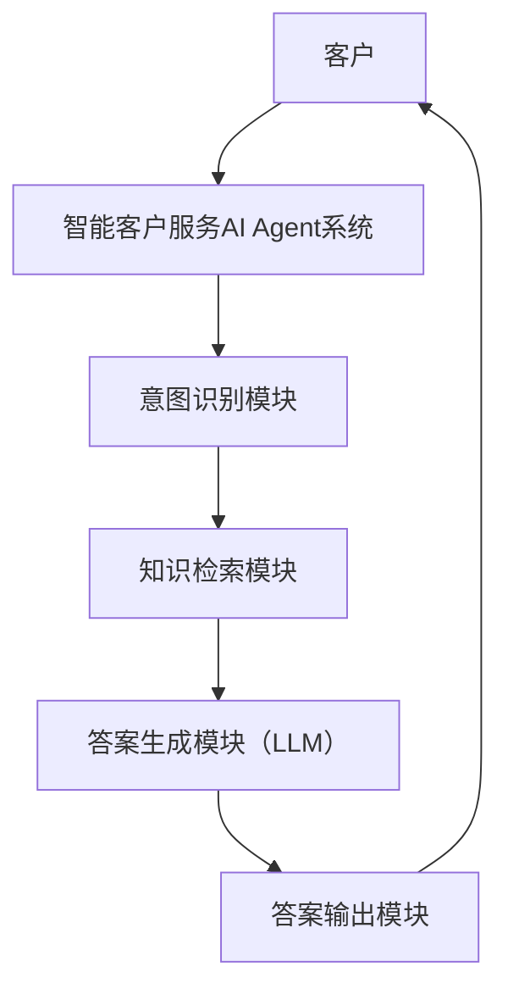

# 智能客户服务AI Agent：LLM驱动的全天候支持系统

> 关键词：智能客户服务、AI Agent、大语言模型（LLM）、全天候支持、自然语言处理

> 摘要：本文聚焦于智能客户服务AI Agent这一基于大语言模型（LLM）驱动的全天候支持系统。首先介绍该系统的背景，包括目的、预期读者等内容。接着深入探讨其核心概念与联系，详细阐述核心算法原理及具体操作步骤，并结合数学模型和公式进行说明。通过项目实战展示代码实际案例和详细解释。分析其实际应用场景，推荐相关的工具和资源。最后总结该系统的未来发展趋势与挑战，提供常见问题解答和扩展阅读参考资料，旨在全面深入地剖析这一前沿技术，为相关领域的研究和实践提供有价值的参考。

## 1. 背景介绍 
### 1.1 目的和范围
在当今数字化时代，客户对于服务的响应速度和质量要求越来越高。传统的客户服务模式往往受到时间、人力等因素的限制，难以满足客户的多样化需求。智能客户服务AI Agent：LLM驱动的全天候支持系统的目的在于利用大语言模型（LLM）的强大自然语言处理能力，构建一个能够24小时不间断为客户提供高效、准确服务的智能系统。

本系统的范围涵盖了多种客户服务场景，如电商平台的商品咨询、金融机构的业务解答、在线教育的课程咨询等。它可以处理文本形式的客户问题，通过理解客户意图，提供相应的解决方案或信息。

### 1.2 预期读者
本文的预期读者包括对人工智能技术在客户服务领域应用感兴趣的研究人员、企业的客户服务管理人员、从事软件开发的程序员以及相关专业的学生。研究人员可以从本文中获取关于智能客户服务系统的最新技术和研究方向；客户服务管理人员可以了解如何利用该系统提升客户服务效率和质量；程序员可以学习到具体的实现方法和技术细节；学生则可以将其作为学习人工智能应用的参考资料。

### 1.3 文档结构概述
本文将按照以下结构进行阐述：首先介绍智能客户服务AI Agent系统的背景信息，包括目的、预期读者等。然后深入探讨其核心概念与联系，通过文本示意图和Mermaid流程图展示系统的原理和架构。接着详细讲解核心算法原理及具体操作步骤，结合Python源代码进行说明。随后介绍相关的数学模型和公式，并举例说明。通过项目实战展示代码实际案例和详细解释。分析该系统的实际应用场景，推荐相关的工具和资源。最后总结系统的未来发展趋势与挑战，提供常见问题解答和扩展阅读参考资料。

### 1.4 术语表
#### 1.4.1 核心术语定义
- **AI Agent（人工智能智能体）**：是一种能够感知环境、自主决策并采取行动以实现特定目标的智能实体。在智能客户服务系统中，AI Agent可以理解客户的问题并提供相应的服务。
- **大语言模型（LLM）**：是一种基于深度学习的自然语言处理模型，通过对大量文本数据的学习，能够生成自然语言文本，理解语言的语义和上下文。
- **自然语言处理（NLP）**：是计算机科学与语言学的交叉领域，旨在让计算机能够理解、处理和生成人类语言。

#### 1.4.2 相关概念解释
- **意图识别**：是自然语言处理中的一个重要任务，旨在确定客户问题的核心意图，例如查询信息、寻求帮助、投诉等。
- **知识图谱**：是一种结构化的语义网络，用于表示实体之间的关系和知识。在智能客户服务系统中，知识图谱可以帮助AI Agent更准确地理解客户问题并提供相关信息。

#### 1.4.3 缩略词列表
- **LLM**：Large Language Model（大语言模型）
- **NLP**：Natural Language Processing（自然语言处理）

## 2. 核心概念与联系 
### 核心概念原理
智能客户服务AI Agent：LLM驱动的全天候支持系统的核心原理是利用大语言模型（LLM）的强大自然语言处理能力，结合人工智能智能体（AI Agent）的自主决策和行动能力，实现对客户问题的自动理解和处理。

系统的工作流程主要包括以下几个步骤：
1. **客户问题输入**：客户通过文本形式输入问题，如在网页的在线客服窗口、移动应用的聊天界面等。
2. **意图识别**：系统对客户输入的问题进行意图识别，确定客户的核心需求。
3. **知识检索**：根据客户的意图，系统在知识图谱或知识库中检索相关的信息。
4. **答案生成**：利用大语言模型（LLM）对检索到的信息进行处理，生成自然语言形式的答案。
5. **答案输出**：将生成的答案返回给客户。

### 架构的文本示意图
```plaintext
客户 --> 智能客户服务AI Agent系统
            |
            | 客户问题输入
            v
        意图识别模块
            |
            | 识别结果
            v
        知识检索模块
            |
            | 检索信息
            v
        答案生成模块（LLM）
            |
            | 生成答案
            v
        答案输出模块 --> 客户
```

### Mermaid流程图


## 3. 核心算法原理 & 具体操作步骤 
### 核心算法原理
智能客户服务AI Agent系统的核心算法主要包括意图识别算法和答案生成算法。

#### 意图识别算法
意图识别算法通常采用基于机器学习或深度学习的方法。在深度学习中，常用的模型有卷积神经网络（CNN）、循环神经网络（RNN）及其变体（如LSTM、GRU）等。这里我们以LSTM为例进行说明。

LSTM（长短期记忆网络）是一种特殊的RNN，能够处理序列数据中的长距离依赖关系。其基本结构包括输入门、遗忘门和输出门，通过这些门的控制，LSTM可以选择性地记住或遗忘信息。

#### 答案生成算法
答案生成算法主要利用大语言模型（LLM）。大语言模型通常采用Transformer架构，通过自注意力机制学习文本的上下文信息。在答案生成过程中，模型根据客户问题和检索到的信息，生成自然语言形式的答案。

### 具体操作步骤及Python源代码
#### 意图识别的Python代码示例
```python
import numpy as np
from tensorflow.keras.preprocessing.text import Tokenizer
from tensorflow.keras.preprocessing.sequence import pad_sequences
from tensorflow.keras.models import Sequential
from tensorflow.keras.layers import Embedding, LSTM, Dense

# 示例数据
questions = ["这个商品什么时候发货？", "如何办理退款？", "你们的客服电话是多少？"]
labels = ["查询发货时间", "办理退款咨询", "查询客服电话"]

# 数据预处理
tokenizer = Tokenizer()
tokenizer.fit_on_texts(questions)
sequences = tokenizer.texts_to_sequences(questions)
max_length = max([len(seq) for seq in sequences])
padded_sequences = pad_sequences(sequences, maxlen=max_length)

# 标签编码
label_mapping = {label: index for index, label in enumerate(set(labels))}
encoded_labels = [label_mapping[label] for label in labels]
encoded_labels = np.array(encoded_labels)

# 构建LSTM模型
model = Sequential()
model.add(Embedding(input_dim=len(tokenizer.word_index) + 1, output_dim=100, input_length=max_length))
model.add(LSTM(100))
model.add(Dense(len(set(labels)), activation='softmax'))

# 编译模型
model.compile(optimizer='adam', loss='sparse_categorical_crossentropy', metrics=['accuracy'])

# 训练模型
model.fit(padded_sequences, encoded_labels, epochs=10, batch_size=1)

# 预测示例
new_question = ["这个订单什么时候能到？"]
new_sequence = tokenizer.texts_to_sequences(new_question)
new_padded_sequence = pad_sequences(new_sequence, maxlen=max_length)
prediction = model.predict(new_padded_sequence)
predicted_label_index = np.argmax(prediction)
reverse_label_mapping = {index: label for label, index in label_mapping.items()}
predicted_label = reverse_label_mapping[predicted_label_index]
print(f"预测意图: {predicted_label}")
```

#### 答案生成的Python代码示例（使用Hugging Face的Transformers库）
```python
from transformers import AutoTokenizer, AutoModelForCausalLM

# 加载预训练模型和分词器
tokenizer = AutoTokenizer.from_pretrained("gpt2")
model = AutoModelForCausalLM.from_pretrained("gpt2")

# 示例问题和检索信息
question = "这个商品什么时候发货？"
retrieved_info = "一般情况下，我们会在下单后的24小时内发货。"

# 生成答案
input_text = f"问题: {question} 信息: {retrieved_info} 答案:"
input_ids = tokenizer.encode(input_text, return_tensors='pt')
output = model.generate(input_ids, max_length=100, num_beams=5, no_repeat_ngram_size=2, early_stopping=True)
answer = tokenizer.decode(output[0], skip_special_tokens=True)
print(f"生成的答案: {answer}")
```

## 4. 数学模型和公式 & 详细讲解 & 举例说明 
### 意图识别的数学模型和公式
#### 嵌入层
在意图识别的LSTM模型中，嵌入层将输入的文本序列转换为向量表示。假设输入的文本序列长度为 $T$，词汇表大小为 $V$，嵌入维度为 $d$。嵌入层的作用是将每个词的索引 $w_i$ 映射到一个 $d$ 维的向量 $\mathbf{e}_i$。

嵌入层的数学公式可以表示为：
$$\mathbf{e}_i = \mathbf{E}[w_i]$$
其中，$\mathbf{E} \in \mathbb{R}^{V \times d}$ 是嵌入矩阵。

#### LSTM单元
LSTM单元的核心是三个门：输入门 $i_t$、遗忘门 $f_t$ 和输出门 $o_t$，以及细胞状态 $\mathbf{c}_t$。

遗忘门的计算公式为：
$$f_t = \sigma(\mathbf{W}_f \cdot [\mathbf{h}_{t-1}, \mathbf{x}_t] + \mathbf{b}_f)$$
输入门的计算公式为：
$$i_t = \sigma(\mathbf{W}_i \cdot [\mathbf{h}_{t-1}, \mathbf{x}_t] + \mathbf{b}_i)$$
细胞状态的更新公式为：
$$\tilde{\mathbf{c}}_t = \tanh(\mathbf{W}_c \cdot [\mathbf{h}_{t-1}, \mathbf{x}_t] + \mathbf{b}_c)$$
$$\mathbf{c}_t = f_t \odot \mathbf{c}_{t-1} + i_t \odot \tilde{\mathbf{c}}_t$$
输出门的计算公式为：
$$o_t = \sigma(\mathbf{W}_o \cdot [\mathbf{h}_{t-1}, \mathbf{x}_t] + \mathbf{b}_o)$$
隐藏状态的更新公式为：
$$\mathbf{h}_t = o_t \odot \tanh(\mathbf{c}_t)$$
其中，$\sigma$ 是 sigmoid 函数，$\tanh$ 是双曲正切函数，$\mathbf{W}$ 是权重矩阵，$\mathbf{b}$ 是偏置向量，$\odot$ 表示逐元素相乘。

#### 全连接层
最后，通过全连接层将LSTM的输出映射到不同的意图类别。假设LSTM的输出维度为 $h$，意图类别数为 $C$。全连接层的数学公式为：
$$\mathbf{y} = \text{softmax}(\mathbf{W}_{fc} \cdot \mathbf{h}_T + \mathbf{b}_{fc})$$
其中，$\mathbf{W}_{fc} \in \mathbb{R}^{C \times h}$ 是全连接层的权重矩阵，$\mathbf{b}_{fc} \in \mathbb{R}^C$ 是偏置向量，$\text{softmax}$ 是 softmax 函数，用于将输出转换为概率分布。

### 举例说明
假设我们有一个简单的文本序列 "这个商品什么时候发货？"，经过分词和编码后得到序列 $[10, 20, 30, 40, 50]$。嵌入层将每个词的索引映射到一个 100 维的向量，例如词索引 10 映射到向量 $\mathbf{e}_{10} \in \mathbb{R}^{100}$。

LSTM 单元依次处理这些向量，通过遗忘门、输入门和输出门的控制，更新细胞状态和隐藏状态。最后，全连接层将LSTM的输出映射到不同的意图类别，例如 "查询发货时间"、"办理退款咨询" 等，输出一个概率分布，我们选择概率最大的类别作为预测的意图。

### 答案生成的数学模型和公式
大语言模型（LLM）通常基于Transformer架构，其核心是自注意力机制。自注意力机制的计算公式为：
$$\text{Attention}(Q, K, V) = \text{softmax}\left(\frac{QK^T}{\sqrt{d_k}}\right)V$$
其中，$Q$ 是查询矩阵，$K$ 是键矩阵，$V$ 是值矩阵，$d_k$ 是键向量的维度。

在答案生成过程中，模型根据输入的问题和检索信息，通过自注意力机制学习文本的上下文信息，生成下一个词的概率分布，然后根据概率分布选择合适的词作为输出，不断重复这个过程，直到生成完整的答案。

## 5. 项目实战：代码实际案例和详细解释说明 
### 5.1  开发环境搭建
#### 安装Python
首先，确保你已经安装了Python 3.6或更高版本。可以从Python官方网站（https://www.python.org/downloads/） 下载并安装。

#### 安装必要的库
在命令行中使用以下命令安装所需的库：
```sh
pip install tensorflow
pip install transformers
```

### 5.2  源代码详细实现和代码解读
#### 完整代码示例
```python
import numpy as np
from tensorflow.keras.preprocessing.text import Tokenizer
from tensorflow.keras.preprocessing.sequence import pad_sequences
from tensorflow.keras.models import Sequential
from tensorflow.keras.layers import Embedding, LSTM, Dense
from transformers import AutoTokenizer, AutoModelForCausalLM

# 示例数据
questions = ["这个商品什么时候发货？", "如何办理退款？", "你们的客服电话是多少？"]
labels = ["查询发货时间", "办理退款咨询", "查询客服电话"]

# 数据预处理
tokenizer = Tokenizer()
tokenizer.fit_on_texts(questions)
sequences = tokenizer.texts_to_sequences(questions)
max_length = max([len(seq) for seq in sequences])
padded_sequences = pad_sequences(sequences, maxlen=max_length)

# 标签编码
label_mapping = {label: index for index, label in enumerate(set(labels))}
encoded_labels = [label_mapping[label] for label in labels]
encoded_labels = np.array(encoded_labels)

# 构建LSTM模型
model = Sequential()
model.add(Embedding(input_dim=len(tokenizer.word_index) + 1, output_dim=100, input_length=max_length))
model.add(LSTM(100))
model.add(Dense(len(set(labels)), activation='softmax'))

# 编译模型
model.compile(optimizer='adam', loss='sparse_categorical_crossentropy', metrics=['accuracy'])

# 训练模型
model.fit(padded_sequences, encoded_labels, epochs=10, batch_size=1)

# 预测意图
new_question = ["这个订单什么时候能到？"]
new_sequence = tokenizer.texts_to_sequences(new_question)
new_padded_sequence = pad_sequences(new_sequence, maxlen=max_length)
prediction = model.predict(new_padded_sequence)
predicted_label_index = np.argmax(prediction)
reverse_label_mapping = {index: label for label, index in label_mapping.items()}
predicted_label = reverse_label_mapping[predicted_label_index]
print(f"预测意图: {predicted_label}")

# 加载预训练模型和分词器
tokenizer_transformer = AutoTokenizer.from_pretrained("gpt2")
model_transformer = AutoModelForCausalLM.from_pretrained("gpt2")

# 示例问题和检索信息
question = "这个商品什么时候发货？"
retrieved_info = "一般情况下，我们会在下单后的24小时内发货。"

# 生成答案
input_text = f"问题: {question} 信息: {retrieved_info} 答案:"
input_ids = tokenizer_transformer.encode(input_text, return_tensors='pt')
output = model_transformer.generate(input_ids, max_length=100, num_beams=5, no_repeat_ngram_size=2, early_stopping=True)
answer = tokenizer_transformer.decode(output[0], skip_special_tokens=True)
print(f"生成的答案: {answer}")
```

#### 代码解读
1. **数据预处理**：使用 `Tokenizer` 对问题文本进行分词和编码，将文本转换为数字序列。使用 `pad_sequences` 对序列进行填充，使其长度一致。
2. **标签编码**：将意图标签转换为数字编码，方便模型处理。
3. **构建LSTM模型**：使用 `Sequential` 模型构建LSTM模型，包括嵌入层、LSTM层和全连接层。
4. **编译和训练模型**：使用 `adam` 优化器和 `sparse_categorical_crossentropy` 损失函数编译模型，并进行训练。
5. **意图预测**：对新的问题进行意图预测，将预测结果转换为标签。
6. **答案生成**：使用Hugging Face的 `transformers` 库加载预训练的大语言模型（GPT-2），根据问题和检索信息生成答案。

### 5.3  代码解读与分析
#### 优点
- **可扩展性**：可以通过增加训练数据和调整模型参数来提高模型的性能和泛化能力。
- **灵活性**：可以根据不同的业务需求，选择不同的大语言模型和意图识别算法。

#### 缺点
- **数据依赖**：模型的性能高度依赖于训练数据的质量和数量。
- **计算资源需求**：大语言模型的训练和推理需要大量的计算资源。

## 6. 实际应用场景 
### 电商平台
在电商平台中，智能客户服务AI Agent可以处理客户的商品咨询、订单查询、售后问题等。例如，客户询问某商品的尺寸、颜色、库存等信息，AI Agent可以快速准确地提供答案。对于订单查询，AI Agent可以告知客户订单的状态、发货时间、预计送达时间等。在售后方面，AI Agent可以指导客户办理退款、退货、换货等业务。

### 金融机构
金融机构的客户服务需求也非常多样化，智能客户服务AI Agent可以帮助客户解答账户管理、贷款申请、信用卡使用等问题。例如，客户询问如何开通网上银行、贷款的利率和还款方式、信用卡的账单日和还款日等，AI Agent可以提供详细的信息和指导。

### 在线教育
在线教育平台的客户可能会有课程咨询、学习方法指导、考试报名等问题。智能客户服务AI Agent可以为客户提供课程介绍、学习计划建议、考试报名流程等信息，帮助客户更好地了解和使用平台的服务。

### 旅游行业
旅游行业的客户服务涉及酒店预订、机票查询、旅游路线规划等方面。AI Agent可以根据客户的需求，提供酒店的价格、位置、设施等信息，查询机票的航班时间、票价等，还可以为客户规划旅游路线，推荐景点和美食。

## 7. 工具和资源推荐
### 7.1 学习资源推荐
#### 7.1.1 书籍推荐
- 《深度学习》（Deep Learning）：由Ian Goodfellow、Yoshua Bengio和Aaron Courville撰写，是深度学习领域的经典教材，涵盖了神经网络、卷积神经网络、循环神经网络等内容。
- 《自然语言处理入门》：由何晗编写，适合初学者学习自然语言处理的基础知识和技术。

#### 7.1.2 在线课程
- Coursera上的“Deep Learning Specialization”：由Andrew Ng教授讲授，系统地介绍了深度学习的理论和实践。
- 网易云课堂上的“自然语言处理实战”：通过实际案例讲解自然语言处理的应用和技术。

#### 7.1.3 技术博客和网站
- Hugging Face Blog（https://huggingface.co/blog）：提供了关于大语言模型和自然语言处理的最新研究和应用案例。
- Medium上的“Towards Data Science”：有很多关于人工智能和机器学习的技术文章。

### 7.2 开发工具框架推荐
#### 7.2.1 IDE和编辑器
- PyCharm：是一款专业的Python集成开发环境，提供了代码编辑、调试、版本控制等功能。
- Visual Studio Code：是一款轻量级的代码编辑器，支持多种编程语言，有丰富的插件可以扩展功能。

#### 7.2.2 调试和性能分析工具
- TensorBoard：是TensorFlow的可视化工具，可以帮助用户分析模型的训练过程和性能。
- PyTorch Profiler：是PyTorch的性能分析工具，可以帮助用户找出代码中的性能瓶颈。

#### 7.2.3 相关框架和库
- TensorFlow：是一个开源的机器学习框架，提供了丰富的工具和库，用于构建和训练深度学习模型。
- PyTorch：是另一个流行的深度学习框架，具有动态图和简洁的API，适合快速开发和研究。
- Hugging Face Transformers：提供了预训练的大语言模型和相关工具，方便用户进行自然语言处理任务。

### 7.3 相关论文著作推荐
#### 7.3.1 经典论文
- “Attention Is All You Need”：介绍了Transformer架构，是大语言模型的基础。
- “Long Short-Term Memory”：提出了LSTM网络，解决了RNN中的梯度消失问题。

#### 7.3.2 最新研究成果
- 关注顶级学术会议如ACL（Association for Computational Linguistics）、EMNLP（Conference on Empirical Methods in Natural Language Processing）上的最新研究成果。

#### 7.3.3 应用案例分析
- 可以在ACM SIGKDD（Special Interest Group on Knowledge Discovery and Data Mining）会议论文集中找到关于智能客户服务系统的应用案例分析。

## 8. 总结：未来发展趋势与挑战
### 未来发展趋势
#### 多模态融合
未来的智能客户服务AI Agent将不仅仅局限于处理文本信息，还将融合语音、图像等多模态信息。例如，客户可以通过语音提问，AI Agent可以识别语音并生成语音答案，同时还可以结合图像信息提供更直观的服务。

#### 个性化服务
随着用户数据的不断积累，AI Agent将能够根据用户的历史行为、偏好等信息，提供更加个性化的服务。例如，根据用户的购买记录和浏览历史，推荐符合用户需求的商品和服务。

#### 与其他系统的集成
智能客户服务AI Agent将与企业的其他系统如CRM（客户关系管理系统）、ERP（企业资源计划系统）等进行集成，实现数据的共享和业务流程的自动化。例如，当客户咨询订单状态时，AI Agent可以直接从ERP系统中获取最新的订单信息。

### 挑战
#### 数据隐私和安全
智能客户服务AI Agent需要处理大量的用户数据，包括个人信息、交易记录等。如何保证数据的隐私和安全是一个重要的挑战。企业需要采取有效的数据加密、访问控制等措施，防止数据泄露和滥用。

#### 模型的可解释性
大语言模型通常是黑盒模型，其决策过程难以解释。在客户服务场景中，用户可能需要了解AI Agent的决策依据，例如为什么推荐某个商品或提供某个解决方案。提高模型的可解释性是一个亟待解决的问题。

#### 语言理解的局限性
虽然大语言模型在自然语言处理方面取得了很大的进展，但仍然存在语言理解的局限性。例如，对于一些模糊、歧义的问题，AI Agent可能无法准确理解用户的意图，导致回答不准确或不完整。

## 9. 附录：常见问题与解答
### 1. 智能客户服务AI Agent的准确率如何提高？
可以通过增加训练数据的数量和质量、调整模型的参数、使用更先进的算法等方法来提高准确率。同时，对训练数据进行标注和清洗，确保数据的准确性和一致性也非常重要。

### 2. 如何选择合适的大语言模型？
需要考虑模型的性能、计算资源需求、应用场景等因素。对于一些简单的任务，可以选择轻量级的模型；对于复杂的任务，可以选择性能更强大的模型。同时，还需要考虑模型的开源性和可扩展性。

### 3. 智能客户服务AI Agent如何处理复杂的问题？
对于复杂的问题，可以采用分步骤处理的方法。首先，对问题进行分解，识别出关键信息和子问题。然后，针对每个子问题进行处理，最后将结果整合起来。同时，可以结合知识图谱和知识库，提供更全面的信息和解决方案。

### 4. 智能客户服务AI Agent的部署需要注意哪些问题？
需要考虑计算资源的需求、网络环境、安全性等问题。确保服务器具有足够的计算能力和存储空间，保证网络的稳定性和安全性。同时，需要进行性能测试和优化，确保系统能够高效运行。

## 10. 扩展阅读 & 参考资料
### 扩展阅读
- 《人工智能：现代方法》（Artificial Intelligence: A Modern Approach）：全面介绍了人工智能的理论和方法，包括搜索算法、知识表示、机器学习等内容。
- 《Python自然语言处理》（Natural Language Processing with Python）：详细介绍了Python在自然语言处理中的应用，包括分词、词性标注、命名实体识别等技术。

### 参考资料
- Hugging Face官方文档（https://huggingface.co/docs）：提供了关于大语言模型和Transformers库的详细文档和教程。
- TensorFlow官方文档（https://www.tensorflow.org/）：是TensorFlow框架的官方文档，包含了大量的教程和示例代码。
- PyTorch官方文档（https://pytorch.org/）：是PyTorch框架的官方文档，提供了丰富的学习资源和API文档。