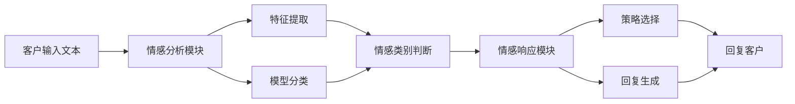

# 智能客服中心：AI Agent的情感分析与响应

> 关键词：智能客服中心、AI Agent、情感分析、情感响应、自然语言处理

> 摘要：本文聚焦于智能客服中心中AI Agent的情感分析与响应技术。首先介绍了该技术的背景，包括目的、预期读者、文档结构和相关术语。接着阐述了核心概念，如情感分析和情感响应的原理及联系，并通过文本示意图和Mermaid流程图展示。详细讲解了核心算法原理及操作步骤，结合Python代码实现。深入探讨了数学模型和公式，并举例说明。通过项目实战，给出代码案例并详细解读。分析了该技术的实际应用场景，推荐了学习资源、开发工具框架和相关论文著作。最后总结了未来发展趋势与挑战，还提供了常见问题解答和扩展阅读参考资料，旨在为读者全面呈现智能客服中心中AI Agent情感分析与响应的技术全貌。

## 1. 背景介绍 
### 1.1 目的和范围
智能客服中心在现代企业服务中扮演着至关重要的角色，随着人工智能技术的发展，AI Agent逐渐成为客服中心的核心力量。本文章的目的在于深入探讨AI Agent在智能客服中心中的情感分析与响应技术。范围涵盖了从情感分析的基本原理、算法实现，到如何根据分析结果进行有效的情感响应，以及该技术在实际客服场景中的应用和未来发展趋势。

### 1.2 预期读者
本文预期读者包括人工智能领域的研究者、智能客服系统的开发者、企业客服部门的管理人员以及对自然语言处理和情感分析技术感兴趣的爱好者。对于研究者，可以从中获取最新的技术思路和研究方向；开发者能够学习到具体的算法实现和项目实战经验；客服管理人员可以了解如何利用这些技术提升客服服务质量；爱好者则可以通过本文对该领域有一个全面的认识。

### 1.3 文档结构概述
本文将按照以下结构进行阐述：首先介绍核心概念与联系，明确情感分析和情感响应的基本原理和相互关系；接着详细讲解核心算法原理及具体操作步骤，通过Python代码进行演示；然后介绍相关的数学模型和公式，并举例说明；之后通过项目实战给出实际代码案例并进行详细解读；分析该技术在实际中的应用场景；推荐学习资源、开发工具框架和相关论文著作；最后总结未来发展趋势与挑战，提供常见问题解答和扩展阅读参考资料。

### 1.4 术语表
#### 1.4.1 核心术语定义
- **智能客服中心**：利用人工智能技术实现客户服务自动化的系统，通过AI Agent与客户进行交互，解答问题、处理业务。
- **AI Agent**：人工智能代理，是一种能够自主执行任务、与环境进行交互的智能实体，在智能客服中心中用于与客户进行对话。
- **情感分析**：又称意见挖掘，是指通过自然语言处理、文本挖掘等技术，对文本中的情感倾向进行分析和判断，如积极、消极、中性等。
- **情感响应**：根据情感分析的结果，AI Agent采取相应的策略和语言与客户进行交流，以满足客户的情感需求，提高客户满意度。

#### 1.4.2 相关概念解释
- **自然语言处理（NLP）**：是人工智能的一个重要分支，研究如何让计算机理解和处理人类语言。情感分析是自然语言处理的一个具体应用领域。
- **机器学习**：是一门多领域交叉学科，涉及概率论、统计学、逼近论、凸分析、算法复杂度理论等多门学科。它专门研究计算机怎样模拟或实现人类的学习行为，以获取新的知识或技能，重新组织已有的知识结构使之不断改善自身的性能。在情感分析中，机器学习算法被广泛应用于文本分类和情感识别。

#### 1.4.3 缩略词列表
- **NLP**：Natural Language Processing（自然语言处理）
- **ML**：Machine Learning（机器学习）
- **CNN**：Convolutional Neural Network（卷积神经网络）
- **LSTM**：Long Short-Term Memory（长短期记忆网络）

## 2. 核心概念与联系 
### 核心概念原理
#### 情感分析原理
情感分析的核心目标是判断文本所表达的情感倾向。其基本原理是通过对文本中的词汇、语法结构和语义信息进行分析，提取与情感相关的特征，然后利用机器学习或深度学习模型对这些特征进行分类，从而确定文本的情感类别。例如，一些积极词汇如“好”“棒”“开心”等通常表示积极情感，而消极词汇如“坏”“差”“难过”等则表示消极情感。同时，句子的语法结构和上下文信息也会影响情感的判断，比如双重否定句可能表达的是积极情感。

#### 情感响应原理
情感响应是在情感分析的基础上进行的。当AI Agent分析出客户的情感倾向后，会根据预设的规则或训练好的模型选择合适的响应策略。对于积极情感，AI Agent可以给予肯定和鼓励，进一步增强客户的好感；对于消极情感，AI Agent需要表达理解和歉意，并提供解决方案，以缓解客户的不满。例如，当客户表达“你们的产品太棒了，我很满意”时，AI Agent可以回复“感谢您的认可，我们会继续努力提供更好的产品和服务”；当客户说“你们的服务太差劲了，我很生气”时，AI Agent可以回复“非常抱歉给您带来了不好的体验，我们会立即为您解决问题”。

### 架构的文本示意图
```plaintext
客户输入文本 -> 情感分析模块（特征提取、模型分类） -> 情感类别判断 -> 情感响应模块（策略选择、回复生成） -> 回复客户
```

### Mermaid流程图


## 3. 核心算法原理 & 具体操作步骤 
### 情感分析算法原理
#### 基于机器学习的情感分析
常见的机器学习算法如朴素贝叶斯、支持向量机等可以用于情感分析。以朴素贝叶斯算法为例，其基本思想是基于贝叶斯定理，通过计算文本属于不同情感类别的概率来进行分类。

### Python代码实现
```python
import numpy as np
from sklearn.feature_extraction.text import CountVectorizer
from sklearn.naive_bayes import MultinomialNB

# 训练数据
corpus = [
    "这个产品真好，我很喜欢",
    "服务太差劲了，我很生气",
    "电影非常精彩，值得一看",
    "这次购物体验糟透了"
]
labels = [1, 0, 1, 0]  # 1表示积极，0表示消极

# 特征提取
vectorizer = CountVectorizer()
X = vectorizer.fit_transform(corpus)

# 训练模型
clf = MultinomialNB()
clf.fit(X, labels)

# 测试数据
test_text = ["这个餐厅的食物很棒"]
test_X = vectorizer.transform(test_text)

# 预测
prediction = clf.predict(test_X)
print("预测结果：", "积极" if prediction[0] == 1 else "消极")
```

### 操作步骤
1. **数据准备**：收集包含情感信息的文本数据，并标注情感类别（如积极、消极、中性）。
2. **特征提取**：使用词袋模型、TF-IDF等方法将文本转换为数值特征。
3. **模型训练**：选择合适的机器学习算法，如朴素贝叶斯、支持向量机等，使用训练数据进行模型训练。
4. **模型评估**：使用测试数据对训练好的模型进行评估，计算准确率、召回率等指标。
5. **预测应用**：将训练好的模型应用于实际文本的情感分析。

### 情感响应算法原理
情感响应可以基于规则或机器学习方法实现。基于规则的方法是根据预设的规则来生成响应，例如，如果客户表达积极情感，则回复感谢和鼓励的话语；如果客户表达消极情感，则回复道歉和解决方案。基于机器学习的方法则是通过训练模型来学习不同情感下的最佳响应策略。

### Python代码实现
```python
def emotion_response(emotion):
    if emotion == 1:  # 积极情感
        return "感谢您的认可，我们会继续努力！"
    else:  # 消极情感
        return "非常抱歉给您带来了不好的体验，我们会尽快解决问题。"

# 假设情感分析结果为积极
emotion_result = 1
response = emotion_response(emotion_result)
print("情感响应：", response)
```

### 操作步骤
1. **规则制定**：根据不同的情感类别和业务需求，制定相应的响应规则。
2. **模型训练（可选）**：如果使用机器学习方法，需要收集情感分析和响应的历史数据，进行模型训练。
3. **响应生成**：根据情感分析的结果，选择合适的响应规则或模型生成响应内容。

## 4. 数学模型和公式 & 详细讲解 & 举例说明 
### 朴素贝叶斯算法数学模型和公式
#### 贝叶斯定理
贝叶斯定理的公式为：
$$P(C|X)=\frac{P(X|C)P(C)}{P(X)}$$
其中，$P(C|X)$ 表示在特征 $X$ 出现的情况下类别 $C$ 发生的概率，$P(X|C)$ 表示在类别 $C$ 发生的情况下特征 $X$ 出现的概率，$P(C)$ 表示类别 $C$ 发生的先验概率，$P(X)$ 表示特征 $X$ 出现的概率。

#### 朴素贝叶斯分类器
在朴素贝叶斯分类器中，假设特征之间是相互独立的。对于文本分类问题，设文本 $X=(x_1,x_2,\cdots,x_n)$ 由 $n$ 个特征（单词）组成，类别 $C$ 有 $k$ 个（如积极、消极），则文本 $X$ 属于类别 $C_i$ 的概率为：
$$P(C_i|X)=\frac{P(X|C_i)P(C_i)}{P(X)}$$
由于 $P(X)$ 对于所有类别都是相同的，因此可以忽略分母，只比较分子的大小。根据特征独立性假设，$P(X|C_i)=\prod_{j=1}^{n}P(x_j|C_i)$，则分类器的决策规则为：
$$\hat{C}=\arg\max_{C_i}P(C_i)\prod_{j=1}^{n}P(x_j|C_i)$$

### 详细讲解
- $P(C_i)$ 是类别 $C_i$ 的先验概率，可以通过训练数据中类别 $C_i$ 出现的频率来估计。
- $P(x_j|C_i)$ 是在类别 $C_i$ 下特征 $x_j$ 出现的条件概率，可以通过训练数据中类别 $C_i$ 下特征 $x_j$ 出现的频率来估计。

### 举例说明
假设训练数据中有 100 条文本，其中 60 条是积极文本，40 条是消极文本。则积极类别的先验概率 $P(C_{积极})=\frac{60}{100}=0.6$，消极类别的先验概率 $P(C_{消极})=\frac{40}{100}=0.4$。

对于一个特征 “好”，在积极文本中出现了 30 次，在消极文本中出现了 5 次。则在积极类别下 “好” 出现的条件概率 $P(好|C_{积极})=\frac{30}{60}=0.5$，在消极类别下 “好” 出现的条件概率 $P(好|C_{消极})=\frac{5}{40}=0.125$。

对于一个包含特征 “好” 的文本，计算其属于积极和消极类别的概率：
- $P(C_{积极})\times P(好|C_{积极}) = 0.6\times0.5 = 0.3$
- $P(C_{消极})\times P(好|C_{消极}) = 0.4\times0.125 = 0.05$

由于 $0.3>0.05$，因此该文本被分类为积极文本。

## 5. 项目实战：代码实际案例和详细解释说明 
### 5.1  开发环境搭建
#### 安装Python
首先需要安装Python，建议使用Python 3.6及以上版本。可以从Python官方网站（https://www.python.org/downloads/）下载安装包，按照安装向导进行安装。

#### 安装必要的库
使用pip命令安装以下必要的库：
```sh
pip install numpy scikit-learn pandas
```
- `numpy`：用于数值计算。
- `scikit-learn`：提供了丰富的机器学习算法和工具。
- `pandas`：用于数据处理和分析。

### 5.2  源代码详细实现和代码解读
#### 数据准备
```python
import pandas as pd

# 读取数据集
data = pd.read_csv('sentiment_data.csv')
texts = data['text'].tolist()
labels = data['label'].tolist()

# 划分训练集和测试集
from sklearn.model_selection import train_test_split
X_train, X_test, y_train, y_test = train_test_split(texts, labels, test_size=0.2, random_state=42)
```
**代码解读**：首先使用`pandas`库读取包含文本和标签的CSV文件，将文本和标签分别存储在`texts`和`labels`列表中。然后使用`train_test_split`函数将数据集划分为训练集和测试集，测试集占比为20%。

#### 特征提取
```python
from sklearn.feature_extraction.text import TfidfVectorizer

# 特征提取
vectorizer = TfidfVectorizer()
X_train_vec = vectorizer.fit_transform(X_train)
X_test_vec = vectorizer.transform(X_test)
```
**代码解读**：使用`TfidfVectorizer`将文本转换为TF-IDF特征向量。`fit_transform`方法用于训练集，它会学习词汇表并将文本转换为特征向量；`transform`方法用于测试集，它使用训练集学习到的词汇表将测试集文本转换为特征向量。

#### 模型训练
```python
from sklearn.svm import SVC

# 训练模型
model = SVC()
model.fit(X_train_vec, y_train)
```
**代码解读**：使用支持向量机（SVM）作为分类模型，调用`fit`方法使用训练集的特征向量和标签进行模型训练。

#### 模型评估
```python
from sklearn.metrics import accuracy_score

# 预测
y_pred = model.predict(X_test_vec)

# 计算准确率
accuracy = accuracy_score(y_test, y_pred)
print("模型准确率：", accuracy)
```
**代码解读**：使用训练好的模型对测试集进行预测，得到预测结果`y_pred`。然后使用`accuracy_score`函数计算模型的准确率。

#### 情感响应
```python
def get_emotion_response(emotion):
    if emotion == 1:
        return "感谢您的好评，我们会继续努力！"
    else:
        return "很抱歉给您带来不好的体验，我们会尽快改进。"

# 示例文本
test_text = ["这个产品真的太好用了"]
test_text_vec = vectorizer.transform(test_text)
emotion = model.predict(test_text_vec)[0]
response = get_emotion_response(emotion)
print("情感响应：", response)
```
**代码解读**：定义了一个`get_emotion_response`函数，根据情感类别生成相应的响应。然后对示例文本进行特征提取和情感预测，根据预测结果调用`get_emotion_response`函数生成情感响应。

### 5.3  代码解读与分析
#### 数据处理
数据处理阶段主要包括数据读取、划分训练集和测试集。使用`pandas`库可以方便地读取和处理CSV文件，`train_test_split`函数可以帮助我们将数据集划分为训练集和测试集，以便评估模型的性能。

#### 特征提取
使用TF-IDF特征提取方法可以将文本转换为数值特征，TF-IDF考虑了单词在文档中的频率和在整个语料库中的逆文档频率，能够更好地表示文本的重要性。

#### 模型训练和评估
支持向量机是一种强大的分类模型，在文本分类任务中表现良好。使用`fit`方法进行模型训练，`predict`方法进行预测，`accuracy_score`函数计算准确率，这些都是`scikit-learn`库提供的常用功能。

#### 情感响应
根据情感分析的结果生成相应的情感响应，这是智能客服系统的重要环节。通过简单的条件判断可以实现基本的情感响应功能。

## 6. 实际应用场景 
### 电商客服
在电商平台中，AI Agent可以实时分析客户的咨询和反馈的情感倾向。当客户表达对商品的喜爱时，AI Agent可以及时给予感谢和推荐相关商品；当客户对商品质量或服务不满意时，AI Agent可以迅速表达歉意并提供解决方案，如退换货、补偿优惠券等，从而提高客户满意度和忠诚度。

### 金融客服
金融客服场景中，客户可能会因为投资收益、账户问题等产生不同的情感。AI Agent通过情感分析可以更好地理解客户的情绪状态，对于焦虑或愤怒的客户，及时安抚情绪并提供专业的解决方案；对于满意的客户，可以进一步推荐其他金融产品或服务，促进业务拓展。

### 电信客服
电信客服经常需要处理客户的投诉、咨询等问题。AI Agent可以通过情感分析判断客户的情绪，对于投诉的客户，表达理解并快速处理问题，避免客户情绪进一步恶化；对于咨询业务的客户，根据其积极或中性的情感，提供详细准确的信息，提升服务效率和质量。

### 医疗客服
在医疗客服中，患者可能因为疾病困扰、就医体验等产生不同的情感。AI Agent可以分析患者的情感，对于焦虑和担忧的患者，给予安慰和鼓励，并提供相关的医疗建议；对于满意的患者，收集反馈以进一步优化医疗服务。

## 7. 工具和资源推荐
### 7.1 学习资源推荐
#### 7.1.1 书籍推荐
- 《Python自然语言处理实战：核心技术与算法》：本书详细介绍了Python在自然语言处理中的应用，包括文本预处理、情感分析、命名实体识别等内容，适合初学者入门。
- 《机器学习》（周志华著）：全面介绍了机器学习的基本概念、算法和应用，对于理解情感分析中使用的机器学习算法有很大帮助。
- 《深度学习》（Ian Goodfellow等著）：深入探讨了深度学习的原理和应用，包括神经网络、卷积神经网络、循环神经网络等，对于理解深度学习在情感分析中的应用有重要参考价值。

#### 7.1.2 在线课程
- Coursera上的“Natural Language Processing Specialization”：由顶尖高校的教授授课，系统介绍了自然语言处理的各个方面，包括情感分析、机器翻译等。
- edX上的“Artificial Intelligence”：涵盖了人工智能的基本概念和技术，包括机器学习、深度学习等，对于理解智能客服中心的技术基础有很大帮助。
- 中国大学MOOC上的“自然语言处理”：国内高校开设的课程，结合了国内的研究成果和实际应用，适合国内学习者。

#### 7.1.3 技术博客和网站
- Medium：上面有很多关于人工智能、自然语言处理的技术文章和研究成果分享，可以关注一些知名博主和社区。
- 机器之心：专注于人工智能领域的资讯和技术分享，提供了很多关于情感分析、智能客服的最新动态和技术文章。
- 开源中国：国内知名的开源技术社区，有很多关于Python、机器学习的技术文章和项目案例。

### 7.2 开发工具框架推荐
#### 7.2.1 IDE和编辑器
- PyCharm：功能强大的Python集成开发环境，提供了代码编辑、调试、版本控制等功能，适合专业开发者使用。
- Jupyter Notebook：交互式的开发环境，方便进行数据探索、模型训练和结果展示，适合初学者和研究人员使用。
- Visual Studio Code：轻量级的代码编辑器，支持多种编程语言和插件扩展，具有良好的开发体验。

#### 7.2.2 调试和性能分析工具
- Py-Spy：用于分析Python程序的性能瓶颈，找出耗时较长的代码段，帮助优化程序性能。
- TensorBoard：TensorFlow提供的可视化工具，可以用于可视化训练过程中的损失函数、准确率等指标，方便调试和优化深度学习模型。
- Memory Profiler：用于分析Python程序的内存使用情况，找出内存泄漏和内存占用过高的问题。

#### 7.2.3 相关框架和库
- NLTK：自然语言处理工具包，提供了丰富的文本处理功能，如分词、词性标注、情感分析等。
- spaCy：高效的自然语言处理库，支持多种语言，具有快速的处理速度和良好的性能。
- Transformers：Hugging Face开发的深度学习框架，提供了预训练的语言模型，如BERT、GPT等，可以用于情感分析等自然语言处理任务。

### 7.3 相关论文著作推荐
#### 7.3.1 经典论文
- “Sentiment Analysis and Subjectivity” by Bing Liu：该论文系统地介绍了情感分析的基本概念、方法和应用，是情感分析领域的经典之作。
- “Convolutional Neural Networks for Sentence Classification” by Yoon Kim：提出了使用卷积神经网络进行句子分类的方法，在情感分析任务中取得了很好的效果。
- “Long Short-Term Memory” by Sepp Hochreiter and Jürgen Schmidhuber：介绍了长短期记忆网络（LSTM）的原理和应用，LSTM在处理序列数据（如文本）方面具有独特的优势，在情感分析中也有广泛应用。

#### 7.3.2 最新研究成果
- 关注顶级学术会议如ACL（Association for Computational Linguistics）、EMNLP（Conference on Empirical Methods in Natural Language Processing）等，这些会议上会发布情感分析领域的最新研究成果。
- 查阅顶级学术期刊如Journal of Artificial Intelligence Research、Computational Linguistics等，这些期刊上发表的论文具有较高的学术水平和研究价值。

#### 7.3.3 应用案例分析
- 一些企业和研究机构会发布智能客服中心中情感分析与响应的应用案例，可以通过搜索引擎、行业报告等渠道获取。这些案例可以帮助我们了解实际应用中的问题和解决方案，以及技术的应用效果。

## 8. 总结：未来发展趋势与挑战
### 未来发展趋势
#### 多模态情感分析
未来的情感分析将不仅仅局限于文本，还会结合语音、图像等多模态信息进行综合分析。例如，在智能客服中心中，通过分析客户的语音语调、面部表情等信息，更准确地判断客户的情感状态，提供更加个性化的服务。

#### 实时情感响应
随着技术的发展，AI Agent将能够实现实时的情感分析和响应。在与客户的对话过程中，及时捕捉客户的情感变化，并迅速做出相应的调整，提高客户的交互体验。

#### 个性化情感服务
根据客户的历史数据和偏好，为每个客户提供个性化的情感服务。例如，对于经常购买高端商品的客户，在其表达积极情感时，可以提供更高级别的优惠和服务；对于容易焦虑的客户，在沟通时采用更加温和、安抚的语言。

#### 与其他技术的融合
情感分析技术将与区块链、物联网等技术进行融合。例如，在物联网设备中嵌入情感分析功能，通过分析用户与设备的交互数据，了解用户的情感需求，为用户提供更加智能化的服务。

### 挑战
#### 数据质量和多样性
情感分析需要大量高质量的数据进行训练，但目前的数据存在质量参差不齐、标注不准确等问题。同时，不同领域、不同文化背景下的情感表达存在差异，需要收集更加多样化的数据来提高模型的泛化能力。

#### 情感理解的复杂性
人类的情感是复杂多样的，有时会存在隐含的情感信息，如讽刺、幽默等。目前的情感分析技术在处理这些复杂情感时还存在一定的困难，需要进一步提高情感理解的能力。

#### 隐私和安全问题
在情感分析过程中，需要收集和处理客户的大量信息，包括文本、语音等。如何保护客户的隐私和信息安全，避免数据泄露和滥用，是一个亟待解决的问题。

#### 技术成本和效率
一些先进的情感分析技术，如深度学习模型，需要大量的计算资源和时间进行训练和部署。如何降低技术成本，提高分析效率，是推广情感分析技术的关键。

## 9. 附录：常见问题与解答
### 1. 情感分析的准确率如何提高？
可以从以下几个方面提高情感分析的准确率：
- 收集更多高质量、多样化的数据进行训练，包括不同领域、不同情感表达的文本。
- 选择合适的特征提取方法和分类模型，如使用TF-IDF特征和深度学习模型。
- 进行数据增强，如对文本进行同义词替换、句子重组等，增加数据的多样性。
- 对模型进行调优，如调整模型的超参数、使用正则化方法等。

### 2. 如何处理多语言的情感分析？
可以采用以下方法处理多语言的情感分析：
- 使用多语言预训练模型，如mBERT、XLM-R等，这些模型在多种语言上进行了预训练，具有较好的跨语言能力。
- 针对不同语言分别训练模型，根据不同语言的特点选择合适的特征提取方法和分类模型。
- 利用语言之间的迁移学习，将在一种语言上训练好的模型迁移到其他语言上进行微调。

### 3. 情感分析在实时场景中的应用有哪些挑战？
情感分析在实时场景中的应用面临以下挑战：
- 实时数据处理能力要求高，需要在短时间内完成文本的特征提取和情感分类。
- 实时数据的质量和稳定性较差，可能存在噪声和不完整的信息。
- 实时情感响应需要快速生成合适的回复，对模型的推理速度和回复生成能力有较高要求。

### 4. 如何评估情感分析模型的性能？
可以使用以下指标评估情感分析模型的性能：
- 准确率（Accuracy）：预测正确的样本数占总样本数的比例。
- 精确率（Precision）：预测为某一类别中实际为该类别的样本数占预测为该类别的样本数的比例。
- 召回率（Recall）：实际为某一类别中预测为该类别的样本数占实际为该类别的样本数的比例。
- F1值（F1-score）：精确率和召回率的调和平均数，综合考虑了精确率和召回率。

## 10. 扩展阅读 & 参考资料
### 扩展阅读
- 《自然语言处理入门》：进一步深入学习自然语言处理的基础知识和技术。
- 《人工智能：现代方法》：全面介绍人工智能的各个方面，包括搜索算法、机器学习、知识表示等。
- 《智能客服：从基础到实战》：专门介绍智能客服系统的设计、开发和应用，对于理解智能客服中心的整体架构有很大帮助。

### 参考资料
- 相关学术论文和研究报告，如ACM Digital Library、IEEE Xplore等学术数据库中的论文。
- 开源项目和代码库，如GitHub上的情感分析相关项目。
- 行业资讯和博客文章，如TechCrunch、InfoQ等网站上的文章。