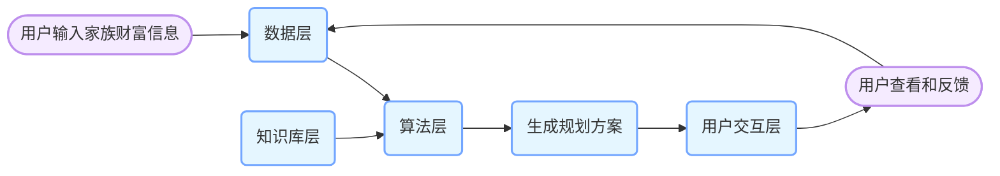

# 智能家族财富传承规划助手

> 关键词：智能助手、家族财富传承、规划算法、数学模型、项目实战

> 摘要：本文聚焦于智能家族财富传承规划助手这一创新工具。首先介绍其开发背景，包括目的、预期读者、文档结构等。接着阐述核心概念与联系，通过文本示意图和 Mermaid 流程图展示其架构原理。详细讲解核心算法原理，用 Python 代码进行具体说明，并给出相关数学模型和公式。通过项目实战，展示开发环境搭建、源代码实现与解读。分析实际应用场景，推荐相关工具和资源，最后总结未来发展趋势与挑战，提供常见问题解答和扩展阅读参考资料，旨在帮助读者全面了解和运用智能家族财富传承规划助手。

## 1. 背景介绍 
### 1.1 目的和范围
智能家族财富传承规划助手的目的在于为家族提供全面、科学、智能的财富传承规划解决方案。随着社会经济的发展，家族财富的规模不断扩大，财富传承问题日益复杂，涉及到法律、税务、金融等多个领域。传统的财富传承规划方式往往需要耗费大量的时间和精力，且容易出现信息不全面、规划不合理等问题。本助手旨在利用先进的人工智能技术，整合多方面的知识和数据，为家族量身定制个性化的财富传承规划方案，提高规划的效率和准确性。

本助手的范围涵盖了家族财富传承的各个方面，包括但不限于资产分配、税务筹划、信托设立、遗嘱制定等。它可以根据家族的具体情况，如家族成员结构、资产类型和规模、传承目标等，提供详细的规划建议和方案。

### 1.2 预期读者
本文的预期读者主要包括以下几类：
1. **家族企业所有者和管理者**：他们需要对家族财富进行合理的传承规划，以确保家族企业的可持续发展和家族财富的稳定传承。
2. **高净值个人和家庭**：希望通过科学的规划，实现家族财富的有效传承，保障家族成员的生活质量。
3. **金融机构从业人员**：如银行理财经理、信托顾问、税务师等，他们可以借助本助手为客户提供更专业的财富传承规划服务。
4. **法律专业人士**：在处理家族财富传承相关法律事务时，本助手可以提供有价值的参考信息。
5. **对家族财富传承规划感兴趣的研究人员和学者**：通过了解本助手的原理和应用，深入研究家族财富传承的相关问题。

### 1.3 文档结构概述
本文将按照以下结构进行阐述：
1. **背景介绍**：介绍智能家族财富传承规划助手的目的、预期读者和文档结构概述。
2. **核心概念与联系**：阐述智能家族财富传承规划助手的核心概念和架构原理，通过文本示意图和 Mermaid 流程图进行展示。
3. **核心算法原理 & 具体操作步骤**：详细讲解智能家族财富传承规划助手所采用的核心算法原理，并使用 Python 代码进行具体说明。
4. **数学模型和公式 & 详细讲解 & 举例说明**：给出智能家族财富传承规划中涉及的数学模型和公式，并进行详细讲解和举例说明。
5. **项目实战：代码实际案例和详细解释说明**：通过一个具体的项目实战，展示智能家族财富传承规划助手的开发环境搭建、源代码实现和代码解读。
6. **实际应用场景**：分析智能家族财富传承规划助手在不同场景下的实际应用。
7. **工具和资源推荐**：推荐与智能家族财富传承规划相关的学习资源、开发工具框架和论文著作。
8. **总结：未来发展趋势与挑战**：总结智能家族财富传承规划助手的发展现状，分析未来的发展趋势和面临的挑战。
9. **附录：常见问题与解答**：解答读者在使用智能家族财富传承规划助手过程中可能遇到的常见问题。
10. **扩展阅读 & 参考资料**：提供与智能家族财富传承规划相关的扩展阅读资料和参考文献。

### 1.4 术语表
#### 1.4.1 核心术语定义
1. **家族财富传承**：指家族将其拥有的资产、企业、文化等财富从一代传递到下一代的过程。
2. **智能助手**：利用人工智能技术，为用户提供智能化服务和决策支持的软件系统。
3. **资产分配**：将家族的资产按照一定的原则和目标，分配到不同的资产类别和家族成员手中。
4. **税务筹划**：通过合理的税务安排，降低家族财富传承过程中的税务负担。
5. **信托设立**：将家族的资产委托给信托机构，由信托机构按照信托合同的约定进行管理和分配。
6. **遗嘱制定**：家族成员通过遗嘱的方式，对自己的财产进行处分和安排。

#### 1.4.2 相关概念解释
1. **人工智能**：研究如何使计算机模拟人类的智能行为，如学习、推理、决策等。
2. **大数据**：指海量的数据集合，通过对大数据的分析和挖掘，可以发现有价值的信息和规律。
3. **机器学习**：人工智能的一个分支，通过让计算机从数据中学习，自动改进其性能。
4. **自然语言处理**：研究如何让计算机理解和处理人类的自然语言，如文本、语音等。

#### 1.4.3 缩略词列表
1. **AI**：Artificial Intelligence，人工智能
2. **ML**：Machine Learning，机器学习
3. **NLP**：Natural Language Processing，自然语言处理
4. **API**：Application Programming Interface，应用程序编程接口

## 2. 核心概念与联系 
智能家族财富传承规划助手的核心概念主要包括家族财富数据、规划算法、知识库和用户交互界面。下面通过文本示意图和 Mermaid 流程图来展示它们之间的联系。

### 文本示意图
智能家族财富传承规划助手的架构可以分为以下几个层次：
1. **数据层**：负责收集和存储家族财富相关的数据，包括家族成员信息、资产信息、财务信息等。
2. **算法层**：运用各种规划算法，对数据层的数据进行分析和处理，生成个性化的财富传承规划方案。
3. **知识库层**：存储与家族财富传承相关的法律法规、税务政策、金融产品等知识，为算法层提供知识支持。
4. **用户交互层**：提供用户与智能助手进行交互的界面，用户可以输入家族财富信息，查看规划方案，并与智能助手进行沟通和反馈。

### Mermaid 流程图


这个流程图展示了智能家族财富传承规划助手的工作流程。用户首先输入家族财富信息，数据层接收并存储这些信息。算法层结合知识库层的知识，对数据进行分析和处理，生成个性化的财富传承规划方案。方案通过用户交互层展示给用户，用户可以查看方案并进行反馈，反馈信息又会回到数据层，用于优化后续的规划方案。

## 3. 核心算法原理 & 具体操作步骤 
智能家族财富传承规划助手的核心算法主要包括资产分配算法、税务筹划算法和风险评估算法。下面我们将详细讲解这些算法的原理，并使用 Python 代码进行具体说明。

### 资产分配算法
资产分配算法的目标是根据家族的风险承受能力、传承目标和资产状况，将家族资产合理地分配到不同的资产类别中。常见的资产类别包括股票、债券、房地产、现金等。

#### 算法原理
我们可以使用现代投资组合理论中的均值 - 方差模型来进行资产分配。该模型的核心思想是在给定的风险水平下，最大化投资组合的预期收益；或者在给定的预期收益水平下，最小化投资组合的风险。

假设我们有 $n$ 种资产，每种资产的预期收益率为 $\mu_i$，方差为 $\sigma_i^2$，资产之间的协方差为 $\sigma_{ij}$。投资组合的权重向量为 $w = [w_1, w_2, \cdots, w_n]^T$，其中 $\sum_{i=1}^{n} w_i = 1$。投资组合的预期收益率为 $\mu_p = w^T \mu$，方差为 $\sigma_p^2 = w^T \Sigma w$，其中 $\mu = [\mu_1, \mu_2, \cdots, \mu_n]^T$，$\Sigma$ 是资产收益率的协方差矩阵。

我们可以通过求解以下优化问题来确定最优的资产分配权重：
$$
\begin{aligned}
\min_{w} &\quad w^T \Sigma w \\
\text{s.t.} &\quad w^T \mu \geq \mu_{target} \\
&\quad \sum_{i=1}^{n} w_i = 1 \\
&\quad w_i \geq 0, \quad i = 1, 2, \cdots, n
\end{aligned}
$$
其中 $\mu_{target}$ 是投资组合的目标预期收益率。

#### Python 代码实现
```python
import numpy as np
from scipy.optimize import minimize

# 定义资产的预期收益率和协方差矩阵
mu = np.array([0.1, 0.08, 0.06])  # 预期收益率
Sigma = np.array([[0.1, 0.05, 0.02],
                  [0.05, 0.08, 0.03],
                  [0.02, 0.03, 0.06]])  # 协方差矩阵

# 定义目标预期收益率
mu_target = 0.09

# 定义优化目标函数
def objective(w):
    return np.dot(w.T, np.dot(Sigma, w))

# 定义约束条件
constraints = [{'type': 'eq', 'fun': lambda w: np.sum(w) - 1},
               {'type': 'ineq', 'fun': lambda w: np.dot(w, mu) - mu_target}]

# 定义变量边界
bounds = [(0, None) for _ in range(len(mu))]

# 初始权重猜测
w0 = np.ones(len(mu)) / len(mu)

# 求解优化问题
result = minimize(objective, w0, method='SLSQP', constraints=constraints, bounds=bounds)

# 输出最优权重
optimal_weights = result.x
print("最优资产分配权重:", optimal_weights)
```

### 税务筹划算法
税务筹划算法的目的是通过合理的税务安排，降低家族财富传承过程中的税务负担。税务筹划需要考虑多种因素，如资产类型、传承方式、税收政策等。

#### 算法原理
我们可以采用基于规则的方法进行税务筹划。首先，建立一个税务规则库，包含各种税收政策和优惠条件。然后，根据家族的资产信息和传承计划，匹配相应的税务规则，生成最优的税务筹划方案。

#### Python 代码实现
```python
# 定义税务规则库
tax_rules = {
    '房产传承': {
        '直接继承': {
            '税率': 0.01,
            '优惠条件': '满五唯一可免征'
        },
        '赠与': {
            '税率': 0.03,
            '优惠条件': '直系亲属赠与可享受一定减免'
        }
    },
    '股票传承': {
        '直接继承': {
            '税率': 0.005,
            '优惠条件': ''
        },
        '赠与': {
            '税率': 0.01,
            '优惠条件': ''
        }
    }
}

# 定义家族资产信息和传承计划
assets = [
    {'类型': '房产', '价值': 1000000, '传承方式': '直接继承', '满五唯一': True},
    {'类型': '股票', '价值': 500000, '传承方式': '赠与'}
]

# 计算税务负担
total_tax = 0
for asset in assets:
    asset_type = asset['类型']
    inheritance_method = asset['传承方式']
    if asset_type in tax_rules and inheritance_method in tax_rules[asset_type]:
        rule = tax_rules[asset_type][inheritance_method]
        tax_rate = rule['税率']
        if '满五唯一' in asset and asset['满五唯一'] and rule['优惠条件'] == '满五唯一可免征':
            tax = 0
        else:
            tax = asset['价值'] * tax_rate
        total_tax += tax

print("总税务负担:", total_tax)
```

### 风险评估算法
风险评估算法用于评估家族财富传承过程中可能面临的各种风险，如市场风险、法律风险、健康风险等。

#### 算法原理
我们可以采用多因素风险评估模型来评估风险。首先，确定影响家族财富传承的各种风险因素，并为每个因素分配一个权重。然后，根据家族的具体情况，对每个风险因素进行评分。最后，将每个因素的评分乘以其权重，相加得到总的风险评分。

#### Python 代码实现
```python
# 定义风险因素和权重
risk_factors = {
    '市场风险': 0.3,
    '法律风险': 0.2,
    '健康风险': 0.2,
    '家族内部矛盾风险': 0.3
}

# 定义家族的风险评分
risk_scores = {
    '市场风险': 7,
    '法律风险': 4,
    '健康风险': 5,
    '家族内部矛盾风险': 6
}

# 计算总风险评分
total_risk_score = 0
for factor, weight in risk_factors.items():
    score = risk_scores[factor]
    total_risk_score += weight * score

print("总风险评分:", total_risk_score)
```

## 4. 数学模型和公式 & 详细讲解 & 举例说明 
### 资产分配模型
#### 数学公式
在前面的资产分配算法中，我们使用了均值 - 方差模型。该模型的核心公式如下：
- 投资组合的预期收益率：$\mu_p = w^T \mu$
- 投资组合的方差：$\sigma_p^2 = w^T \Sigma w$
- 优化问题：
$$
\begin{aligned}
\min_{w} &\quad w^T \Sigma w \\
\text{s.t.} &\quad w^T \mu \geq \mu_{target} \\
&\quad \sum_{i=1}^{n} w_i = 1 \\
&\quad w_i \geq 0, \quad i = 1, 2, \cdots, n
\end{aligned}
$$

#### 详细讲解
- $\mu_p$ 表示投资组合的预期收益率，它是投资组合中每种资产预期收益率的加权平均值，权重为每种资产的投资比例 $w_i$。
- $\sigma_p^2$ 表示投资组合的方差，它衡量了投资组合的风险。方差越大，投资组合的风险越高。
- 优化问题的目标是在满足一定预期收益率要求的前提下，最小化投资组合的风险。约束条件包括投资组合的权重之和为 1，以及每种资产的投资比例非负。

#### 举例说明
假设我们有两种资产，资产 A 的预期收益率为 0.1，方差为 0.04；资产 B 的预期收益率为 0.08，方差为 0.01。两种资产之间的协方差为 0.005。我们的目标预期收益率为 0.09。

首先，我们可以列出以下参数：
- $\mu = [0.1, 0.08]^T$
- $\Sigma = \begin{bmatrix} 0.04 & 0.005 \\ 0.005 & 0.01 \end{bmatrix}$
- $\mu_{target} = 0.09$

然后，我们可以使用 Python 代码求解优化问题，得到最优的资产分配权重。

### 税务筹划模型
#### 数学公式
税务筹划模型主要基于税务规则进行计算。假设某种资产的价值为 $V$，适用的税率为 $r$，则该资产的税务负担为 $T = V \times r$。

#### 详细讲解
在实际应用中，税务规则可能会更加复杂，可能会有各种优惠条件和减免政策。我们需要根据具体的规则来计算税务负担。

#### 举例说明
假设家族有一套价值 200 万元的房产，采用赠与的方式传承。根据税务规则，赠与房产的税率为 0.03。则该房产的税务负担为 $T = 2000000 \times 0.03 = 60000$ 元。

### 风险评估模型
#### 数学公式
风险评估模型采用多因素风险评估方法，总风险评分 $R$ 的计算公式为：
$$
R = \sum_{i=1}^{m} w_i s_i
$$
其中 $w_i$ 是第 $i$ 个风险因素的权重，$s_i$ 是第 $i$ 个风险因素的评分，$m$ 是风险因素的数量。

#### 详细讲解
该公式通过对每个风险因素的评分进行加权求和，得到总的风险评分。权重反映了每个风险因素对家族财富传承的重要程度。

#### 举例说明
假设我们有三个风险因素：市场风险、法律风险和健康风险，它们的权重分别为 0.4、0.3 和 0.3。家族在这三个风险因素上的评分分别为 6、5 和 7。则总风险评分 $R = 0.4 \times 6 + 0.3 \times 5 + 0.3 \times 7 = 6$。

## 5. 项目实战：代码实际案例和详细解释说明 
### 5.1  开发环境搭建
#### 安装 Python
首先，我们需要安装 Python 环境。建议使用 Python 3.7 及以上版本。可以从 Python 官方网站（https://www.python.org/downloads/）下载并安装 Python。

#### 安装必要的库
我们需要安装一些必要的 Python 库，如 `numpy`、`scipy` 等。可以使用以下命令进行安装：
```sh
pip install numpy scipy
```

### 5.2  源代码详细实现和代码解读
下面是一个完整的智能家族财富传承规划助手的 Python 代码示例：
```python
import numpy as np
from scipy.optimize import minimize

# 定义资产的预期收益率和协方差矩阵
mu = np.array([0.1, 0.08, 0.06])  # 预期收益率
Sigma = np.array([[0.1, 0.05, 0.02],
                  [0.05, 0.08, 0.03],
                  [0.02, 0.03, 0.06]])  # 协方差矩阵

# 定义目标预期收益率
mu_target = 0.09

# 定义优化目标函数
def objective(w):
    return np.dot(w.T, np.dot(Sigma, w))

# 定义约束条件
constraints = [{'type': 'eq', 'fun': lambda w: np.sum(w) - 1},
               {'type': 'ineq', 'fun': lambda w: np.dot(w, mu) - mu_target}]

# 定义变量边界
bounds = [(0, None) for _ in range(len(mu))]

# 初始权重猜测
w0 = np.ones(len(mu)) / len(mu)

# 求解优化问题
result = minimize(objective, w0, method='SLSQP', constraints=constraints, bounds=bounds)

# 输出最优权重
optimal_weights = result.x
print("最优资产分配权重:", optimal_weights)

# 定义税务规则库
tax_rules = {
    '房产传承': {
        '直接继承': {
            '税率': 0.01,
            '优惠条件': '满五唯一可免征'
        },
        '赠与': {
            '税率': 0.03,
            '优惠条件': '直系亲属赠与可享受一定减免'
        }
    },
    '股票传承': {
        '直接继承': {
            '税率': 0.005,
            '优惠条件': ''
        },
        '赠与': {
            '税率': 0.01,
            '优惠条件': ''
        }
    }
}

# 定义家族资产信息和传承计划
assets = [
    {'类型': '房产', '价值': 1000000, '传承方式': '直接继承', '满五唯一': True},
    {'类型': '股票', '价值': 500000, '传承方式': '赠与'}
]

# 计算税务负担
total_tax = 0
for asset in assets:
    asset_type = asset['类型']
    inheritance_method = asset['传承方式']
    if asset_type in tax_rules and inheritance_method in tax_rules[asset_type]:
        rule = tax_rules[asset_type][inheritance_method]
        tax_rate = rule['税率']
        if '满五唯一' in asset and asset['满五唯一'] and rule['优惠条件'] == '满五唯一可免征':
            tax = 0
        else:
            tax = asset['价值'] * tax_rate
        total_tax += tax

print("总税务负担:", total_tax)

# 定义风险因素和权重
risk_factors = {
    '市场风险': 0.3,
    '法律风险': 0.2,
    '健康风险': 0.2,
    '家族内部矛盾风险': 0.3
}

# 定义家族的风险评分
risk_scores = {
    '市场风险': 7,
    '法律风险': 4,
    '健康风险': 5,
    '家族内部矛盾风险': 6
}

# 计算总风险评分
total_risk_score = 0
for factor, weight in risk_factors.items():
    score = risk_scores[factor]
    total_risk_score += weight * score

print("总风险评分:", total_risk_score)
```

### 5.3  代码解读与分析
#### 资产分配部分
- `mu` 和 `Sigma` 分别存储了资产的预期收益率和协方差矩阵。
- `objective` 函数定义了优化目标，即最小化投资组合的方差。
- `constraints` 定义了优化问题的约束条件，包括投资组合的权重之和为 1 和目标预期收益率的要求。
- `bounds` 定义了变量的边界，即每种资产的投资比例非负。
- `minimize` 函数用于求解优化问题，得到最优的资产分配权重。

#### 税务筹划部分
- `tax_rules` 存储了税务规则库，包含不同资产类型和传承方式的税率和优惠条件。
- `assets` 存储了家族的资产信息和传承计划。
- 通过遍历 `assets`，根据税务规则计算每种资产的税务负担，并累加得到总税务负担。

#### 风险评估部分
- `risk_factors` 存储了风险因素和对应的权重。
- `risk_scores` 存储了家族在每个风险因素上的评分。
- 通过加权求和计算总风险评分。

## 6. 实际应用场景 
### 家族企业传承
对于家族企业来说，智能家族财富传承规划助手可以帮助企业主制定合理的传承方案。例如，通过资产分配算法，将企业股权、固定资产等合理分配给家族成员，确保企业的稳定发展。同时，税务筹划算法可以帮助企业降低传承过程中的税务负担，提高家族财富的传承效率。风险评估算法可以识别企业传承过程中可能面临的风险，如市场风险、法律风险等，并提供相应的应对措施。

### 高净值个人财富传承
高净值个人通常拥有多种类型的资产，如房产、股票、基金等。智能家族财富传承规划助手可以根据个人的资产状况和传承目标，制定个性化的资产分配方案。在税务筹划方面，助手可以帮助个人利用各种税收政策和优惠条件，降低财富传承的成本。此外，助手还可以对个人财富传承过程中的风险进行评估，如健康风险、家族内部矛盾风险等，并提供相应的解决方案。

### 金融机构服务客户
银行、信托公司等金融机构可以利用智能家族财富传承规划助手为客户提供更专业的财富传承规划服务。通过助手，金融机构可以快速了解客户的家族财富状况和传承需求，为客户生成详细的规划方案。同时，助手的知识库可以为金融机构的从业人员提供最新的法律法规、税务政策等知识支持，提高服务的质量和效率。

### 法律事务处理
律师在处理家族财富传承相关的法律事务时，智能家族财富传承规划助手可以提供有价值的参考信息。例如，在制定遗嘱、设立信托等方面，助手可以帮助律师了解家族的资产情况和传承意愿，提供合理的法律建议。此外，助手的风险评估功能可以帮助律师识别法律事务中可能存在的风险，提前做好防范措施。

## 7. 工具和资源推荐
### 7.1 学习资源推荐
#### 7.1.1 书籍推荐
1. 《家族财富传承》：本书系统地介绍了家族财富传承的理论和实践，包括资产分配、税务筹划、信托设立等方面的内容。
2. 《投资组合理论与实践》：详细讲解了现代投资组合理论，包括均值 - 方差模型、资本资产定价模型等，对于理解资产分配算法有很大的帮助。
3. 《税法》：全面介绍了我国的税收法律法规，对于学习税务筹划算法有重要的参考价值。

#### 7.1.2 在线课程
1. Coursera 上的“家族财富管理与传承”课程：由知名教授授课，涵盖了家族财富传承的各个方面，包括战略规划、资产配置、风险管理等。
2. edX 上的“投资组合管理”课程：深入讲解了投资组合管理的理论和方法，对于掌握资产分配算法有很大的帮助。
3. 中国大学 MOOC 上的“税法”课程：系统介绍了我国的税收法律制度，对于学习税务筹划算法有重要的指导作用。

#### 7.1.3 技术博客和网站
1. 知乎：在知乎上可以搜索到很多关于家族财富传承的讨论和经验分享，还可以关注一些专业的金融和法律领域的答主。
2. 雪球：雪球是一个财经社区，上面有很多关于投资组合管理和财富传承的文章和讨论，可以从中获取一些有用的信息。
3. 国家税务总局官网：可以及时了解最新的税收政策和法规，对于税务筹划非常重要。

### 7.2 开发工具框架推荐
#### 7.2.1 IDE和编辑器
1. PyCharm：是一款专业的 Python 集成开发环境，具有代码编辑、调试、自动补全等功能，非常适合开发智能家族财富传承规划助手。
2. Visual Studio Code：是一款轻量级的代码编辑器，支持多种编程语言，通过安装 Python 扩展可以方便地进行 Python 开发。

#### 7.2.2 调试和性能分析工具
1. PDB：是 Python 自带的调试工具，可以帮助开发者定位代码中的问题。
2. cProfile：可以对 Python 代码进行性能分析，找出代码中的性能瓶颈。

#### 7.2.3 相关框架和库
1. NumPy：是 Python 中用于科学计算的基础库，提供了高效的数组操作和数学函数，在资产分配算法中经常使用。
2. SciPy：是 Python 中的科学计算库，提供了优化、插值、积分等功能，在求解优化问题时非常有用。
3. Pandas：是 Python 中用于数据处理和分析的库，可以方便地处理家族财富数据。

### 7.3 相关论文著作推荐
#### 7.3.1 经典论文
1. Markowitz, H. M. (1952). Portfolio Selection. The Journal of Finance, 7(1), 77 - 91. 这篇论文提出了现代投资组合理论的均值 - 方差模型，是资产分配领域的经典之作。
2. Modigliani, F., & Miller, M. H. (1958). The Cost of Capital, Corporation Finance and the Theory of Investment. The American Economic Review, 48(3), 261 - 297. 这篇论文探讨了企业资本结构和投资决策的关系，对于家族企业传承有一定的参考价值。

#### 7.3.2 最新研究成果
可以关注《Journal of Financial Economics》、《Review of Financial Studies》等金融领域的顶级期刊，了解家族财富传承领域的最新研究成果。

#### 7.3.3 应用案例分析
一些咨询公司和研究机构会发布家族财富传承的应用案例分析报告，可以从中学习实际应用中的经验和方法。

## 8. 总结：未来发展趋势与挑战
### 未来发展趋势
1. **智能化程度不断提高**：随着人工智能技术的不断发展，智能家族财富传承规划助手将具备更强的学习能力和决策能力。它可以自动学习新的法律法规、税收政策和市场动态，为家族提供更加准确和及时的规划建议。
2. **个性化服务更加突出**：未来的助手将能够根据家族的独特需求和偏好，提供更加个性化的财富传承规划方案。例如，考虑家族的文化背景、价值观等因素，制定符合家族特色的传承计划。
3. **与金融科技深度融合**：智能家族财富传承规划助手将与金融科技的其他领域，如区块链、大数据等深度融合。区块链技术可以提高资产信息的安全性和透明度，大数据技术可以为规划提供更丰富的数据支持。
4. **全球化服务趋势**：随着家族财富的全球化布局，智能家族财富传承规划助手将提供全球化的服务。它可以考虑不同国家和地区的法律、税收和金融环境，为家族制定跨国界的财富传承方案。

### 挑战
1. **数据安全和隐私保护**：智能家族财富传承规划助手需要处理大量的家族财富信息，包括资产信息、家族成员信息等。如何确保这些数据的安全和隐私，防止数据泄露和滥用，是一个重要的挑战。
2. **法律法规的复杂性**：不同国家和地区的法律法规、税收政策存在很大差异，而且这些政策经常发生变化。智能家族财富传承规划助手需要及时跟踪和更新这些信息，确保规划方案的合法性和合规性。
3. **用户信任问题**：家族财富传承是一个非常敏感和重要的问题，用户对智能助手的信任度至关重要。如何提高用户对智能助手的信任，让用户愿意将家族财富信息交给助手进行规划，是一个需要解决的问题。
4. **技术人才短缺**：开发和维护智能家族财富传承规划助手需要具备多方面的技术人才，如人工智能、金融、法律等领域的专业人才。目前，这类复合型人才相对短缺，限制了助手的发展。

## 9. 附录：常见问题与解答
### 1. 智能家族财富传承规划助手的准确性如何保证？
智能家族财富传承规划助手的准确性主要通过以下几个方面来保证：
- **数据准确性**：助手会尽可能收集准确和全面的家族财富信息，同时结合权威的市场数据和法律法规信息。
- **算法优化**：不断优化核心算法，采用先进的人工智能和数学模型，提高规划的准确性。
- **知识更新**：及时更新知识库，确保助手掌握最新的法律法规、税收政策等知识。
- **人工审核**：对于重要的规划方案，会由专业的金融和法律人士进行审核，确保方案的合理性和可行性。

### 2. 智能家族财富传承规划助手是否能适应不同地区的法律法规和税收政策？
是的，智能家族财富传承规划助手会不断跟踪和更新不同地区的法律法规和税收政策。助手的知识库会包含多个国家和地区的相关信息，在为家族制定规划方案时，会根据家族的实际情况和所在地，选择适用的法律法规和税收政策。

### 3. 使用智能家族财富传承规划助手需要支付费用吗？
这取决于具体的产品和服务提供商。有些智能家族财富传承规划助手可能提供免费的基础服务，如简单的资产分配建议和风险评估。而对于更高级的功能和个性化的规划方案，可能需要支付一定的费用。

### 4. 智能家族财富传承规划助手会泄露我的家族财富信息吗？
正规的智能家族财富传承规划助手会采取严格的数据安全和隐私保护措施，确保用户的家族财富信息不被泄露。例如，采用加密技术对数据进行加密存储和传输，限制数据访问权限等。在选择使用助手时，建议选择有良好信誉和安全保障的产品和服务提供商。

### 5. 智能家族财富传承规划助手可以替代专业的金融和法律顾问吗？
智能家族财富传承规划助手可以为家族提供有价值的规划建议和方案，但不能完全替代专业的金融和法律顾问。专业顾问具有丰富的实践经验和专业知识，能够根据家族的具体情况提供更个性化的服务和深入的分析。在使用智能助手的同时，建议结合专业顾问的意见，制定更加完善的财富传承规划。

## 10. 扩展阅读 & 参考资料
### 扩展阅读
1. 《家族办公室：财富传承与治理》：深入探讨了家族办公室的运作模式和财富传承治理方法。
2. 《财富传承的秘密》：通过实际案例分析，揭示了财富传承的成功经验和失败教训。
3. 《金融科技前沿》：介绍了金融科技领域的最新发展动态和应用案例，对于了解智能家族财富传承规划助手与金融科技的融合有一定的帮助。

### 参考资料
1. 国家税务总局官方网站：获取最新的税收政策和法规信息。
2. 中国人民银行官方网站：了解金融市场动态和相关政策。
3. 相关学术期刊：如《Journal of Financial Economics》、《Review of Financial Studies》等，获取家族财富传承领域的最新研究成果。
4. 咨询公司和研究机构的报告：如麦肯锡、波士顿咨询等公司发布的家族财富管理相关报告。