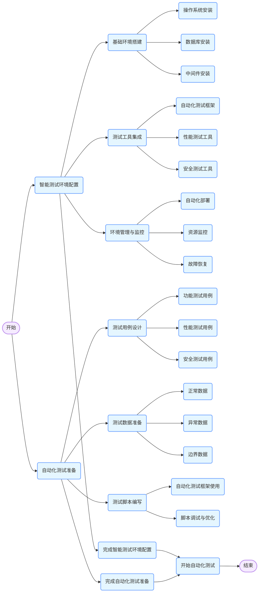

# 智能测试环境配置:自动化测试准备

> 关键词：智能测试环境、自动化测试、环境配置、测试准备、测试框架、测试工具

> 摘要：本文围绕智能测试环境配置和自动化测试准备展开深入探讨。首先介绍了相关背景信息，包括目的、预期读者、文档结构和术语表。接着阐述了核心概念与联系，通过文本示意图和Mermaid流程图展示其架构。详细讲解了核心算法原理，并结合Python源代码说明具体操作步骤。引入数学模型和公式，辅以举例加深理解。在项目实战部分，从开发环境搭建、源代码实现及解读等方面进行分析。还探讨了实际应用场景，推荐了学习资源、开发工具框架和相关论文著作。最后总结了未来发展趋势与挑战，提供常见问题解答和扩展阅读参考资料，旨在为读者全面了解和开展智能测试环境配置及自动化测试准备工作提供指导。

## 1. 背景介绍 
### 1.1 目的和范围
在当今软件开发的快速迭代过程中，确保软件质量的同时提高测试效率成为了关键需求。智能测试环境配置和自动化测试准备正是为了满足这一需求而产生的重要技术手段。本文的目的在于全面介绍智能测试环境配置的相关知识和自动化测试准备的具体步骤，帮助读者理解如何搭建一个高效、稳定的测试环境，为自动化测试的顺利开展奠定基础。

本文的范围涵盖了从智能测试环境的基本概念到具体的配置方法，从自动化测试的核心算法原理到实际项目中的代码实现，以及相关工具和资源的推荐。同时，还会探讨智能测试环境配置和自动化测试在不同应用场景中的应用，以及未来的发展趋势和面临的挑战。

### 1.2 预期读者
本文预期读者主要包括软件测试工程师、软件开发工程师、测试管理人员以及对智能测试和自动化测试感兴趣的技术爱好者。对于软件测试工程师来说，本文可以帮助他们掌握智能测试环境的配置技巧和自动化测试的准备方法，提高测试工作的效率和质量。软件开发工程师可以通过了解测试环境和自动化测试的相关知识，更好地编写可测试的代码，提高软件的可维护性和可靠性。测试管理人员可以从本文中获取关于测试环境规划和自动化测试策略的相关信息，为团队的测试工作提供指导。技术爱好者则可以通过阅读本文，了解智能测试和自动化测试领域的最新技术和发展趋势。

### 1.3 文档结构概述
本文将按照以下结构进行组织：
1. **背景介绍**：介绍本文的目的、范围、预期读者和文档结构，同时对相关术语进行解释。
2. **核心概念与联系**：阐述智能测试环境和自动化测试的核心概念，通过文本示意图和Mermaid流程图展示它们之间的联系和架构。
3. **核心算法原理 & 具体操作步骤**：详细讲解自动化测试中常用的核心算法原理，并使用Python源代码说明具体的操作步骤。
4. **数学模型和公式 & 详细讲解 & 举例说明**：引入相关的数学模型和公式，对其进行详细讲解，并通过举例加深读者的理解。
5. **项目实战：代码实际案例和详细解释说明**：以一个实际的项目为例，介绍开发环境的搭建、源代码的实现和代码的解读。
6. **实际应用场景**：探讨智能测试环境配置和自动化测试在不同应用场景中的应用。
7. **工具和资源推荐**：推荐一些学习资源、开发工具框架和相关论文著作，帮助读者进一步深入学习和研究。
8. **总结：未来发展趋势与挑战**：总结智能测试环境配置和自动化测试的未来发展趋势，并分析可能面临的挑战。
9. **附录：常见问题与解答**：解答读者在智能测试环境配置和自动化测试准备过程中可能遇到的常见问题。
10. **扩展阅读 & 参考资料**：提供一些扩展阅读的资料和参考书籍，方便读者进一步学习和研究。

### 1.4 术语表
#### 1.4.1 核心术语定义
- **智能测试环境**：是指利用先进的技术和工具，实现测试环境的自动化配置、管理和监控，提高测试效率和质量的一种测试环境。
- **自动化测试**：是指使用自动化测试工具和脚本，自动执行测试用例，验证软件系统的功能、性能等方面是否符合预期的一种测试方法。
- **测试框架**：是指为了方便自动化测试的开展，提供了一系列的工具、类库和规范的软件框架。
- **测试用例**：是指为了验证软件系统的某个功能或特性是否符合预期而设计的一组输入数据和预期输出结果。
- **测试数据**：是指在自动化测试过程中使用的输入数据，用于验证软件系统的功能和性能。

#### 1.4.2 相关概念解释
- **持续集成（CI）**：是指开发团队频繁地将代码集成到共享仓库中，并通过自动化构建和测试来验证代码的正确性。
- **持续交付（CD）**：是指在持续集成的基础上，将经过测试的代码自动部署到生产环境中，实现软件的快速交付。
- **容器化技术**：是指将应用程序及其依赖项打包成一个独立的容器，实现应用程序的隔离和部署的一种技术。
- **云计算**：是指通过互联网提供计算资源和服务的一种模式，用户可以根据需要随时使用和扩展这些资源。

#### 1.4.3 缩略词列表
- **CI**：Continuous Integration（持续集成）
- **CD**：Continuous Delivery（持续交付）
- **Docker**：一种开源的容器化平台
- **Jenkins**：一种开源的持续集成工具
- **Selenium**：一种自动化测试工具，用于测试Web应用程序

## 2. 核心概念与联系 

### 核心概念原理
#### 智能测试环境
智能测试环境的核心原理在于利用自动化和智能化技术，实现测试环境的快速搭建、配置和管理。它通过对测试环境的资源进行抽象和建模，使用脚本和工具自动完成环境的部署和配置，从而减少人工干预，提高测试环境的一致性和可靠性。例如，使用Docker容器技术可以将测试环境的各个组件打包成独立的容器，通过容器编排工具（如Kubernetes）可以实现容器的自动化部署和管理。

#### 自动化测试
自动化测试的核心原理是通过编写自动化测试脚本，模拟用户的操作，自动执行测试用例，并对测试结果进行验证。自动化测试脚本可以使用各种编程语言编写，如Python、Java等。测试框架则提供了一系列的工具和类库，帮助测试人员更方便地编写和管理测试脚本。例如，Selenium是一个常用的自动化测试框架，它可以模拟用户在浏览器中的操作，对Web应用程序进行自动化测试。

### 架构的文本示意图
```plaintext
智能测试环境配置
├── 基础环境搭建
│   ├── 操作系统安装
│   ├── 数据库安装
│   ├── 中间件安装
├── 测试工具集成
│   ├── 自动化测试框架
│   ├── 性能测试工具
│   ├── 安全测试工具
├── 环境管理与监控
│   ├── 自动化部署
│   ├── 资源监控
│   ├── 故障恢复

自动化测试准备
├── 测试用例设计
│   ├── 功能测试用例
│   ├── 性能测试用例
│   ├── 安全测试用例
├── 测试数据准备
│   ├── 正常数据
│   ├── 异常数据
│   ├── 边界数据
├── 测试脚本编写
│   ├── 自动化测试框架使用
│   ├── 脚本调试与优化
```

### Mermaid流程图


## 3. 核心算法原理 & 具体操作步骤 

### 核心算法原理
在自动化测试中，常用的核心算法原理包括控制流分析、数据流分析和断言验证等。

#### 控制流分析
控制流分析是指对程序的控制结构进行分析，确定程序的执行路径。在自动化测试中，通过控制流分析可以确定测试用例的执行顺序，确保所有可能的执行路径都被覆盖。例如，对于一个包含条件语句和循环语句的程序，控制流分析可以帮助我们确定不同条件下的执行路径，从而设计出相应的测试用例。

#### 数据流分析
数据流分析是指对程序中数据的流动和使用情况进行分析，确定数据的定义和引用关系。在自动化测试中，通过数据流分析可以确保测试用例覆盖了所有的数据定义和引用，避免出现数据未定义或引用错误的情况。例如，对于一个函数，数据流分析可以帮助我们确定函数的输入参数和返回值，以及函数内部对数据的处理过程，从而设计出相应的测试用例。

#### 断言验证
断言验证是指在自动化测试脚本中使用断言语句来验证程序的输出结果是否符合预期。断言语句是一种在程序中插入的检查点，当程序的输出结果与预期不符时，断言语句会抛出异常，从而提示测试人员程序存在问题。例如，在Python中，可以使用`assert`语句来进行断言验证。

### 具体操作步骤及Python源代码示例
以下是一个使用Python和Selenium进行Web应用程序自动化测试的具体操作步骤和源代码示例。

#### 步骤1：安装必要的库
首先，需要安装Selenium库和对应的浏览器驱动（如ChromeDriver）。可以使用以下命令安装Selenium库：
```bash
pip install selenium
```

#### 步骤2：编写自动化测试脚本
以下是一个简单的自动化测试脚本示例，用于打开百度首页并搜索关键词：
```python
from selenium import webdriver
from selenium.webdriver.common.by import By

# 初始化浏览器驱动
driver = webdriver.Chrome()

try:
    # 打开百度首页
    driver.get("https://www.baidu.com")

    # 定位搜索框并输入关键词
    search_box = driver.find_element(By.ID, "kw")
    search_box.send_keys("自动化测试")

    # 定位搜索按钮并点击
    search_button = driver.find_element(By.ID, "su")
    search_button.click()

    # 等待页面加载
    driver.implicitly_wait(10)

    # 验证搜索结果页面是否包含关键词
    assert "自动化测试" in driver.page_source
    print("测试通过")

except AssertionError:
    print("测试失败：搜索结果页面未包含关键词")

finally:
    # 关闭浏览器
    driver.quit()
```

#### 步骤3：运行自动化测试脚本
将上述代码保存为一个Python文件（如`test_baidu.py`），然后在命令行中运行该文件：
```bash
python test_baidu.py
```

通过以上步骤，就可以实现一个简单的Web应用程序自动化测试。在实际应用中，可以根据具体的测试需求，设计更多的测试用例和测试脚本，对软件系统进行全面的测试。

## 4. 数学模型和公式 & 详细讲解 & 举例说明 

### 测试覆盖率模型
在自动化测试中，测试覆盖率是一个重要的指标，用于衡量测试用例对软件系统的覆盖程度。常见的测试覆盖率包括语句覆盖率、分支覆盖率和路径覆盖率等。

#### 语句覆盖率
语句覆盖率是指测试用例执行过程中覆盖的语句数量与软件系统中总语句数量的比值。其数学公式为：
$$
\text{语句覆盖率} = \frac{\text{被执行的语句数量}}{\text{总语句数量}} \times 100\%
$$

例如，一个软件系统总共有100条语句，在一次测试中，有80条语句被执行，则该测试的语句覆盖率为：
$$
\frac{80}{100} \times 100\% = 80\%
$$

#### 分支覆盖率
分支覆盖率是指测试用例执行过程中覆盖的分支数量与软件系统中总分支数量的比值。其数学公式为：
$$
\text{分支覆盖率} = \frac{\text{被执行的分支数量}}{\text{总分支数量}} \times 100\%
$$

例如，一个软件系统中有10个分支，在一次测试中，有6个分支被执行，则该测试的分支覆盖率为：
$$
\frac{6}{10} \times 100\% = 60\%
$$

#### 路径覆盖率
路径覆盖率是指测试用例执行过程中覆盖的路径数量与软件系统中总路径数量的比值。由于路径数量可能非常庞大，计算路径覆盖率通常比较困难。其数学公式为：
$$
\text{路径覆盖率} = \frac{\text{被执行的路径数量}}{\text{总路径数量}} \times 100\%
$$

### 测试用例优先级排序模型
在自动化测试中，为了提高测试效率，通常需要对测试用例进行优先级排序。一种常见的测试用例优先级排序模型是基于风险的排序模型。

设测试用例 $i$ 的风险值为 $R_i$，其计算公式为：
$$
R_i = P_i \times I_i
$$
其中，$P_i$ 是测试用例 $i$ 对应的缺陷发生的概率，$I_i$ 是测试用例 $i$ 对应的缺陷影响的严重程度。

例如，有两个测试用例 $A$ 和 $B$，测试用例 $A$ 对应的缺陷发生的概率为 $0.2$，缺陷影响的严重程度为 $8$；测试用例 $B$ 对应的缺陷发生的概率为 $0.5$，缺陷影响的严重程度为 $5$。则测试用例 $A$ 的风险值为：
$$
R_A = 0.2 \times 8 = 1.6
$$
测试用例 $B$ 的风险值为：
$$
R_B = 0.5 \times 5 = 2.5
$$
由于 $R_B > R_A$，所以测试用例 $B$ 的优先级高于测试用例 $A$。

### 测试执行时间预测模型
在自动化测试中，预测测试执行时间可以帮助测试人员合理安排测试计划。一种简单的测试执行时间预测模型是基于历史数据的线性回归模型。

设测试用例 $i$ 的执行时间为 $T_i$，影响测试用例执行时间的因素有 $n$ 个，分别为 $x_{i1}, x_{i2}, \cdots, x_{in}$。则可以建立如下的线性回归模型：
$$
T_i = \beta_0 + \beta_1 x_{i1} + \beta_2 x_{i2} + \cdots + \beta_n x_{in} + \epsilon_i
$$
其中，$\beta_0, \beta_1, \cdots, \beta_n$ 是待估计的回归系数，$\epsilon_i$ 是随机误差项。

例如，假设影响测试用例执行时间的因素有两个：测试用例的复杂度 $x_1$ 和测试数据的规模 $x_2$。通过对历史数据进行分析，得到回归系数 $\beta_0 = 10$，$\beta_1 = 2$，$\beta_2 = 0.5$。则对于一个复杂度为 $5$，测试数据规模为 $100$ 的测试用例，其预测执行时间为：
$$
T = 10 + 2 \times 5 + 0.5 \times 100 = 10 + 10 + 50 = 70
$$

## 5. 项目实战：代码实际案例和详细解释说明 

### 5.1  开发环境搭建
#### 操作系统选择
对于自动化测试项目，常见的操作系统选择有Windows、Linux（如Ubuntu、CentOS等）。这里我们选择Ubuntu 20.04作为开发环境的操作系统，因为它具有开源、稳定、易于管理等优点，并且对各种开发工具和测试框架的支持良好。

#### 安装必要的软件
- **Python环境**：Ubuntu 20.04默认安装了Python 3，可以使用以下命令检查Python版本：
```bash
python3 --version
```
如果需要安装Python包管理工具`pip`，可以使用以下命令：
```bash
sudo apt-get install python3-pip
```
- **浏览器和浏览器驱动**：选择Chrome浏览器作为测试的目标浏览器。可以通过以下步骤安装Chrome浏览器：
```bash
wget https://dl.google.com/linux/direct/google-chrome-stable_current_amd64.deb
sudo dpkg -i google-chrome-stable_current_amd64.deb
sudo apt-get install -f
```
安装ChromeDriver，ChromeDriver是Selenium与Chrome浏览器进行交互的驱动程序。可以从[ChromeDriver官方网站](https://sites.google.com/chromium.org/driver/)下载与Chrome浏览器版本对应的ChromeDriver，并将其添加到系统的`PATH`环境变量中。

- **自动化测试框架**：使用Selenium作为自动化测试框架，使用以下命令安装Selenium库：
```bash
pip3 install selenium
```

### 5.2  源代码详细实现和代码解读
以下是一个完整的自动化测试项目示例，用于测试一个简单的Web应用程序的登录功能。

#### 项目结构
```plaintext
test_project/
├── config/
│   └── config.ini
├── pages/
│   ├── base_page.py
│   └── login_page.py
├── tests/
│   └── test_login.py
└── utils/
    └── driver_utils.py
```

#### 代码实现

##### `config/config.ini`
```ini
[web]
url = https://example.com/login
username = test_user
password = test_password
```

##### `utils/driver_utils.py`
```python
from selenium import webdriver

def get_driver():
    driver = webdriver.Chrome()
    return driver
```

##### `pages/base_page.py`
```python
class BasePage:
    def __init__(self, driver):
        self.driver = driver

    def open_url(self, url):
        self.driver.get(url)

    def close(self):
        self.driver.quit()
```

##### `pages/login_page.py`
```python
from selenium.webdriver.common.by import By
from pages.base_page import BasePage

class LoginPage(BasePage):
    USERNAME_INPUT = (By.ID, "username")
    PASSWORD_INPUT = (By.ID, "password")
    LOGIN_BUTTON = (By.ID, "login-button")

    def enter_username(self, username):
        username_input = self.driver.find_element(*self.USERNAME_INPUT)
        username_input.send_keys(username)

    def enter_password(self, password):
        password_input = self.driver.find_element(*self.PASSWORD_INPUT)
        password_input.send_keys(password)

    def click_login_button(self):
        login_button = self.driver.find_element(*self.LOGIN_BUTTON)
        login_button.click()
```

##### `tests/test_login.py`
```python
import configparser
from utils.driver_utils import get_driver
from pages.login_page import LoginPage

def test_login():
    # 读取配置文件
    config = configparser.ConfigParser()
    config.read('config/config.ini')
    url = config.get('web', 'url')
    username = config.get('web', 'username')
    password = config.get('web', 'password')

    # 初始化浏览器驱动
    driver = get_driver()

    try:
        # 打开登录页面
        login_page = LoginPage(driver)
        login_page.open_url(url)

        # 输入用户名和密码
        login_page.enter_username(username)
        login_page.enter_password(password)

        # 点击登录按钮
        login_page.click_login_button()

        # 这里可以添加更多的验证逻辑，如验证登录成功后的页面元素
        assert "Welcome" in driver.page_source
        print("登录测试通过")

    except AssertionError:
        print("登录测试失败")

    finally:
        # 关闭浏览器
        login_page.close()
```

### 5.3  代码解读与分析
#### `config/config.ini`
该文件用于存储测试所需的配置信息，如测试网站的URL、用户名和密码等。通过将配置信息集中管理，方便后续的修改和维护。

#### `utils/driver_utils.py`
该文件中的`get_driver`函数用于初始化浏览器驱动，这里使用的是Chrome浏览器驱动。将驱动初始化逻辑封装在一个函数中，方便在不同的测试用例中复用。

#### `pages/base_page.py`
`BasePage`类是所有页面类的基类，它包含了一些通用的方法，如打开URL和关闭浏览器等。通过继承`BasePage`类，可以在不同的页面类中复用这些通用方法。

#### `pages/login_page.py`
`LoginPage`类继承自`BasePage`类，用于封装登录页面的操作。它定义了登录页面的元素定位器（如用户名输入框、密码输入框和登录按钮），并提供了相应的操作方法（如输入用户名、输入密码和点击登录按钮）。将页面操作封装在页面类中，提高了代码的可维护性和可复用性。

#### `tests/test_login.py`
`test_login`函数是一个具体的测试用例，用于测试登录功能。它首先读取配置文件中的信息，然后初始化浏览器驱动，打开登录页面，输入用户名和密码，点击登录按钮，最后验证登录是否成功。通过将测试逻辑封装在测试函数中，方便测试用例的组织和执行。

## 6. 实际应用场景 
### 软件产品的功能测试
在软件开发过程中，功能测试是确保软件系统各项功能正常运行的重要环节。智能测试环境配置和自动化测试可以大大提高功能测试的效率和质量。例如，对于一个电商网站的购物车功能，可以使用自动化测试脚本模拟用户添加商品、修改商品数量、删除商品等操作，自动验证购物车的计算逻辑和显示效果是否正确。通过智能测试环境的配置，可以快速搭建多个不同版本的测试环境，对软件的不同版本进行功能测试，确保软件在不同环境下的兼容性和稳定性。

### 软件系统的性能测试
性能测试是评估软件系统在不同负载下的性能表现的重要手段。智能测试环境配置和自动化测试可以帮助测试人员更准确地模拟不同的负载场景，对软件系统的性能进行全面的测试。例如，对于一个在线游戏服务器，可以使用自动化测试工具模拟大量用户同时登录、游戏操作等场景，收集服务器的响应时间、吞吐量等性能指标。通过智能测试环境的配置，可以动态调整测试环境的资源配置（如CPU、内存等），模拟不同的硬件环境，评估软件系统在不同硬件条件下的性能表现。

### 软件系统的安全测试
安全测试是保障软件系统安全可靠运行的重要措施。智能测试环境配置和自动化测试可以帮助测试人员发现软件系统中的安全漏洞和隐患。例如，对于一个Web应用程序，可以使用自动化测试工具进行漏洞扫描，检测SQL注入、跨站脚本攻击（XSS）等安全漏洞。通过智能测试环境的配置，可以模拟不同的网络环境和攻击场景，对软件系统的安全性进行全面的测试。

### 持续集成和持续交付流程中的测试
在持续集成和持续交付（CI/CD）流程中，智能测试环境配置和自动化测试是确保代码质量和快速交付的关键环节。每当开发人员提交代码到代码仓库时，自动化测试脚本会自动执行，对代码进行功能测试、性能测试和安全测试等。如果测试通过，代码会自动部署到生产环境中。通过智能测试环境的配置，可以快速搭建和销毁测试环境，实现测试环境的动态管理，提高CI/CD流程的效率和可靠性。

## 7. 工具和资源推荐
### 7.1 学习资源推荐
#### 7.1.1 书籍推荐
- 《Python自动化测试实战》：本书详细介绍了使用Python进行自动化测试的方法和技巧，包括Selenium、Appium等自动化测试框架的使用，以及测试用例设计、测试数据管理等方面的内容。
- 《软件测试的艺术》：这是一本经典的软件测试书籍，系统地介绍了软件测试的基本概念、方法和技术，对测试人员的理论知识和实践能力提升都有很大的帮助。
- 《性能测试实战》：本书深入讲解了性能测试的原理、方法和工具，包括LoadRunner、JMeter等性能测试工具的使用，以及性能测试报告的分析和优化等方面的内容。

#### 7.1.2 在线课程
- Coursera上的“Software Testing and Automation”：该课程由知名大学的教授授课，全面介绍了软件测试的基本概念、方法和自动化测试技术，适合初学者学习。
- Udemy上的“Automated Software Testing with Python and Selenium”：该课程详细讲解了使用Python和Selenium进行自动化测试的方法和技巧，通过实际项目案例让学员掌握自动化测试的实际应用。
- 网易云课堂上的“软件测试工程师就业班”：该课程涵盖了软件测试的各个方面，包括功能测试、性能测试、自动化测试等，通过实战项目让学员掌握软件测试的实际操作技能。

#### 7.1.3 技术博客和网站
- 开源中国（https://www.oschina.net/）：该网站是国内知名的开源技术社区，提供了丰富的技术文章和开源项目资源，对于学习和了解自动化测试技术有很大的帮助。
- 思否（https://segmentfault.com/）：这是一个技术问答和交流社区，有很多关于自动化测试的技术文章和问题讨论，通过参与讨论可以拓宽自己的技术视野。
- 测试人社区（https://ceshiren.com/）：该社区专注于软件测试领域，提供了丰富的测试技术文章、测试工具分享和测试案例分析等内容，是测试人员学习和交流的好去处。

### 7.2 开发工具框架推荐
#### 7.2.1 IDE和编辑器
- PyCharm：这是一款专门为Python开发设计的集成开发环境（IDE），具有代码自动补全、调试、版本控制等功能，非常适合用于编写自动化测试脚本。
- Visual Studio Code：这是一款轻量级的代码编辑器，支持多种编程语言，通过安装相关的插件可以实现代码高亮、调试等功能，是很多开发人员和测试人员喜欢使用的工具。
- Sublime Text：这是一款简洁高效的代码编辑器，具有快速打开文件、代码折叠等功能，适合用于快速编写和修改测试脚本。

#### 7.2.2 调试和性能分析工具
- PDB：这是Python自带的调试工具，可以在代码中设置断点，逐步执行代码，查看变量的值和程序的执行流程，帮助调试自动化测试脚本。
- Chrome DevTools：这是Chrome浏览器自带的开发者工具，具有调试JavaScript代码、分析页面性能等功能，对于调试Web应用程序的自动化测试脚本非常有用。
- JMeter：这是一款开源的性能测试工具，可以模拟大量用户并发访问，对软件系统的性能进行测试和分析，生成详细的性能测试报告。

#### 7.2.3 相关框架和库
- Selenium：这是一个用于自动化测试Web应用程序的框架，支持多种浏览器和编程语言，通过模拟用户在浏览器中的操作，实现对Web应用程序的自动化测试。
- Appium：这是一个用于自动化测试移动应用程序的框架，支持iOS和Android平台，通过模拟用户在移动设备上的操作，实现对移动应用程序的自动化测试。
- pytest：这是一个简单而强大的Python测试框架，具有丰富的插件和功能，支持参数化测试、测试用例分组等，方便编写和管理自动化测试脚本。

### 7.3 相关论文著作推荐
#### 7.3.1 经典论文
- “A Survey on Software Testing”：该论文对软件测试的发展历程、基本概念和方法进行了全面的综述，是了解软件测试领域的经典文献。
- “Automated Software Testing: A Roadmap”：该论文探讨了自动化测试的发展趋势和面临的挑战，为自动化测试技术的研究和应用提供了重要的参考。
- “Model-Based Testing: A Research Roadmap”：该论文介绍了基于模型的测试方法和技术，为提高软件测试的效率和质量提供了新的思路。

#### 7.3.2 最新研究成果
- 每年的IEEE International Conference on Software Testing, Verification and Validation（ICST）会议上都会发表很多关于软件测试和自动化测试的最新研究成果，可以关注该会议的论文集。
- 《ACM Transactions on Software Engineering and Methodology》等学术期刊上也会发表一些关于软件测试和自动化测试的前沿研究论文。

#### 7.3.3 应用案例分析
- 《Automated Software Testing in the Real World》：该书通过实际项目案例，介绍了自动化测试在不同行业和领域的应用经验和最佳实践，对于实际项目中的自动化测试实施具有很大的参考价值。
- 一些知名软件公司（如Google、Microsoft等）的技术博客上也会分享他们在自动化测试方面的应用案例和经验，可以关注这些博客获取相关信息。

## 8. 总结：未来发展趋势与挑战
### 未来发展趋势
#### 智能化和自动化程度不断提高
随着人工智能和机器学习技术的不断发展，智能测试环境配置和自动化测试将朝着更加智能化和自动化的方向发展。例如，利用机器学习算法自动生成测试用例，根据软件系统的运行状态自动调整测试策略，实现测试过程的自我优化和自我调整。

#### 与DevOps和敏捷开发的深度融合
在DevOps和敏捷开发的理念下，软件的开发、测试和部署过程需要更加紧密地结合在一起。智能测试环境配置和自动化测试将成为DevOps和敏捷开发流程中的重要组成部分，实现测试的持续集成和持续交付，提高软件的开发效率和质量。

#### 跨平台和跨设备测试的需求增加
随着移动互联网和云计算的发展，软件系统需要支持多种平台和设备。智能测试环境配置和自动化测试需要能够适应不同的平台和设备，实现跨平台和跨设备的测试，确保软件在各种环境下的兼容性和稳定性。

#### 安全测试的重要性日益凸显
随着信息技术的快速发展，软件系统面临的安全威胁越来越多。智能测试环境配置和自动化测试将更加注重安全测试，利用先进的安全测试技术和工具，发现软件系统中的安全漏洞和隐患，保障软件系统的安全可靠运行。

### 面临的挑战
#### 测试数据的管理和维护
在自动化测试中，测试数据的质量和完整性对测试结果的准确性有很大的影响。随着软件系统的不断发展和变化，测试数据的管理和维护变得越来越困难。如何有效地管理和维护测试数据，确保测试数据的一致性和有效性，是智能测试环境配置和自动化测试面临的一个重要挑战。

#### 测试环境的复杂性和多样性
随着软件系统的不断发展和变化，测试环境的复杂性和多样性也在不断增加。不同的软件系统可能需要不同的测试环境，而且测试环境可能会受到硬件、软件、网络等多种因素的影响。如何快速、准确地搭建和配置测试环境，确保测试环境的稳定性和一致性，是智能测试环境配置和自动化测试面临的另一个重要挑战。

#### 自动化测试脚本的维护和更新
随着软件系统的不断更新和迭代，自动化测试脚本也需要不断地进行维护和更新。如果自动化测试脚本的维护和更新不及时，可能会导致测试结果的不准确和测试效率的降低。如何有效地管理和维护自动化测试脚本，确保自动化测试脚本的可维护性和可扩展性，是智能测试环境配置和自动化测试面临的又一个重要挑战。

#### 测试人员的技术能力和综合素质要求提高
随着智能测试环境配置和自动化测试技术的不断发展，对测试人员的技术能力和综合素质要求也在不断提高。测试人员不仅需要掌握传统的测试技术和方法，还需要掌握人工智能、机器学习、云计算等新兴技术，具备较强的编程能力和问题解决能力。如何提高测试人员的技术能力和综合素质，培养适应未来发展需求的测试人才，是智能测试环境配置和自动化测试面临的一个重要挑战。

## 9. 附录：常见问题与解答
### 问题1：如何选择适合的自动化测试框架？
解答：选择适合的自动化测试框架需要考虑以下几个因素：
- **测试对象**：不同的测试对象（如Web应用程序、移动应用程序、桌面应用程序等）需要选择不同的自动化测试框架。例如，对于Web应用程序可以选择Selenium，对于移动应用程序可以选择Appium。
- **编程语言**：自动化测试框架通常支持多种编程语言，需要根据自己的编程能力和项目需求选择合适的编程语言。例如，Python是一种简单易学、功能强大的编程语言，很多自动化测试框架都支持Python。
- **社区支持**：选择一个有活跃社区支持的自动化测试框架，可以获得更多的技术文档、示例代码和问题解决方案。例如，Selenium和Appium都有庞大的社区支持。
- **性能和稳定性**：自动化测试框架的性能和稳定性对测试效率和测试结果的准确性有很大的影响。需要选择一个性能和稳定性较好的自动化测试框架。

### 问题2：如何解决自动化测试脚本执行过程中的元素定位失败问题？
解答：元素定位失败是自动化测试脚本执行过程中常见的问题之一，可以采取以下措施解决：
- **检查元素定位方式**：确保使用的元素定位方式（如ID、Name、XPath等）正确，并且元素定位表达式能够准确地定位到目标元素。
- **等待元素加载**：在元素定位之前，添加适当的等待时间，确保元素已经加载完成。可以使用显式等待或隐式等待的方式实现。例如，在Selenium中可以使用`WebDriverWait`类实现显式等待。
- **处理动态元素**：如果元素是动态生成的，需要使用动态元素定位方式，如根据元素的属性、文本内容等进行定位。
- **检查页面结构变化**：如果页面结构发生了变化，可能会导致元素定位失败。需要及时更新元素定位表达式。

### 问题3：如何提高自动化测试脚本的执行效率？
解答：可以采取以下措施提高自动化测试脚本的执行效率：
- **优化测试用例设计**：合理设计测试用例，避免重复的测试步骤和不必要的操作，减少测试用例的执行时间。
- **并行执行测试用例**：使用测试框架提供的并行执行功能，同时执行多个测试用例，提高测试效率。例如，pytest框架支持并行执行测试用例。
- **优化元素定位方式**：选择合适的元素定位方式，避免使用复杂的XPath表达式，提高元素定位的速度。
- **减少等待时间**：在元素定位和操作过程中，合理设置等待时间，避免不必要的等待，提高脚本的执行效率。

### 问题4：如何确保自动化测试的覆盖率？
解答：可以采取以下措施确保自动化测试的覆盖率：
- **设计全面的测试用例**：根据软件系统的功能需求和设计文档，设计全面的测试用例，覆盖软件系统的各个功能模块和业务流程。
- **使用测试覆盖率工具**：使用测试覆盖率工具（如Coverage.py）对自动化测试脚本的执行情况进行分析，了解测试用例对代码的覆盖程度，及时发现未覆盖的代码部分，并补充相应的测试用例。
- **进行代码审查**：在编写自动化测试脚本的过程中，进行代码审查，确保测试用例的完整性和正确性。
- **定期更新测试用例**：随着软件系统的不断更新和迭代，及时更新测试用例，确保测试用例的覆盖率始终保持在较高的水平。

## 10. 扩展阅读 & 参考资料
### 扩展阅读
- 《Python编程：从入门到实践》：本书适合Python初学者阅读，通过实际项目案例介绍了Python的基本语法和编程技巧，为学习使用Python进行自动化测试打下基础。
- 《软件测试工程师面试宝典》：该书收集了大量软件测试工程师面试中常见的问题和解答，对于准备从事软件测试工作的人员有很大的帮助。
- 《人工智能与机器学习》：了解人工智能和机器学习的基本概念和方法，对于理解智能测试环境配置和自动化测试中的智能化技术有很大的帮助。

### 参考资料
- Selenium官方文档（https://www.selenium.dev/documentation/）：提供了Selenium自动化测试框架的详细文档和使用指南。
- Appium官方文档（http://appium.io/docs/en/about-appium/intro/）：提供了Appium自动化测试框架的详细文档和使用指南。
- pytest官方文档（https://docs.pytest.org/en/stable/）：提供了pytest测试框架的详细文档和使用指南。
- Python官方文档（https://docs.python.org/3/）：提供了Python编程语言的详细文档和使用指南。