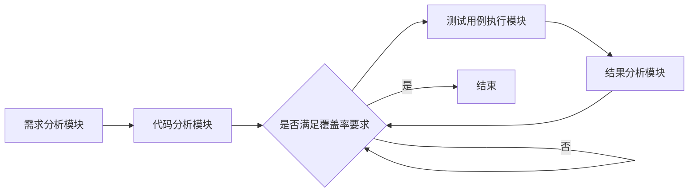

# 智能测试用例生成:提高测试覆盖率

> 关键词：智能测试用例生成、测试覆盖率、自动化测试、软件测试、算法原理、应用场景

> 摘要：本文围绕智能测试用例生成以提高测试覆盖率展开深入探讨。首先介绍了该领域的背景信息，包括目的范围、预期读者等。接着阐述了核心概念及其联系，详细讲解了核心算法原理和具体操作步骤，并给出了相应的 Python 代码示例。通过数学模型和公式进一步剖析其原理，结合实际案例进行代码解读。同时，探讨了智能测试用例生成的实际应用场景，推荐了相关的工具和资源。最后对未来发展趋势与挑战进行总结，并提供了常见问题解答和扩展阅读参考资料，旨在帮助读者全面了解智能测试用例生成技术及其在提高测试覆盖率方面的重要作用。

## 1. 背景介绍 
### 1.1 目的和范围
在软件开发过程中，测试是确保软件质量的关键环节。测试用例的设计和执行对于发现软件中的缺陷至关重要。然而，传统的手动测试用例设计方式不仅效率低下，而且难以保证全面覆盖软件的各种功能和场景。智能测试用例生成技术应运而生，其目的是通过自动化的方法生成高质量的测试用例，从而提高测试覆盖率，减少软件中的潜在缺陷。

本文的范围涵盖了智能测试用例生成的核心概念、算法原理、实际应用以及相关工具和资源。我们将详细介绍如何利用智能算法生成测试用例，以及这些测试用例如何有效地提高软件测试的覆盖率。

### 1.2 预期读者
本文的预期读者包括软件测试工程师、软件开发人员、软件质量保证人员以及对智能测试用例生成技术感兴趣的研究人员。对于测试工程师来说，本文将提供实用的技术和方法，帮助他们提高测试效率和质量；对于开发人员，了解智能测试用例生成技术有助于他们更好地理解软件测试的需求，从而编写更易于测试的代码；对于研究人员，本文可以作为进一步深入研究的参考资料。

### 1.3 文档结构概述
本文将按照以下结构进行组织：
- 核心概念与联系：介绍智能测试用例生成的基本概念和相关架构。
- 核心算法原理 & 具体操作步骤：详细讲解智能测试用例生成的算法原理，并给出 Python 代码示例。
- 数学模型和公式 & 详细讲解 & 举例说明：通过数学模型和公式进一步阐述算法原理，并进行举例说明。
- 项目实战：代码实际案例和详细解释说明：通过实际项目案例，展示智能测试用例生成的具体实现和代码解读。
- 实际应用场景：探讨智能测试用例生成在不同领域的实际应用场景。
- 工具和资源推荐：推荐相关的学习资源、开发工具框架和论文著作。
- 总结：未来发展趋势与挑战：对智能测试用例生成技术的未来发展趋势和面临的挑战进行总结。
- 附录：常见问题与解答：提供常见问题的解答。
- 扩展阅读 & 参考资料：提供相关的扩展阅读和参考资料。

### 1.4 术语表
#### 1.4.1 核心术语定义
- **智能测试用例生成**：利用人工智能算法自动生成测试用例的过程。
- **测试覆盖率**：指测试用例对软件代码或功能的覆盖程度，通常用百分比表示。
- **自动化测试**：使用自动化工具执行测试用例的过程。
- **软件测试**：对软件进行评估和验证，以确保其满足需求和质量标准的过程。

#### 1.4.2 相关概念解释
- **白盒测试**：基于代码结构和逻辑的测试方法，测试人员需要了解软件的内部实现细节。
- **黑盒测试**：基于软件功能和需求的测试方法，测试人员不需要了解软件的内部实现细节。
- **边界值分析**：一种测试用例设计技术，通过选择输入值的边界情况来设计测试用例。
- **等价类划分**：一种测试用例设计技术，将输入值划分为等价类，从每个等价类中选择一个或多个代表值作为测试用例。

#### 1.4.3 缩略词列表
- **AI**：Artificial Intelligence，人工智能
- **TDD**：Test-Driven Development，测试驱动开发
- **BDD**：Behavior-Driven Development，行为驱动开发

## 2. 核心概念与联系 

### 核心概念原理
智能测试用例生成的核心原理是利用人工智能算法自动分析软件的需求、代码结构和功能，从而生成能够覆盖软件各种情况的测试用例。这些算法可以根据不同的输入和约束条件，动态地生成测试用例，提高测试的效率和覆盖率。

常见的智能测试用例生成算法包括遗传算法、模拟退火算法、蚁群算法等。这些算法通过模拟自然现象或生物行为，在搜索空间中寻找最优的测试用例组合。

### 架构的文本示意图
智能测试用例生成系统通常由以下几个部分组成：
- **需求分析模块**：对软件的需求文档进行分析，提取关键信息和约束条件。
- **代码分析模块**：对软件的源代码进行分析，了解代码的结构和逻辑。
- **测试用例生成模块**：根据需求分析和代码分析的结果，利用智能算法生成测试用例。
- **测试用例执行模块**：执行生成的测试用例，并记录测试结果。
- **结果分析模块**：对测试结果进行分析，评估测试覆盖率和软件质量。

### Mermaid 流程图


## 3. 核心算法原理 & 具体操作步骤 

### 遗传算法原理
遗传算法是一种基于生物进化原理的优化算法，通过模拟自然选择和遗传机制，在搜索空间中寻找最优解。在智能测试用例生成中，遗传算法可以用于生成能够覆盖软件各种情况的测试用例。

遗传算法的基本步骤如下：
1. **初始化种群**：随机生成一组初始的测试用例，作为种群的第一代。
2. **适应度评估**：计算每个测试用例的适应度值，适应度值越高表示该测试用例越优秀。
3. **选择操作**：根据适应度值选择一部分优秀的测试用例作为父代。
4. **交叉操作**：对父代测试用例进行交叉操作，生成新的子代测试用例。
5. **变异操作**：对子代测试用例进行变异操作，引入新的基因。
6. **更新种群**：用新生成的子代测试用例替换种群中的一部分个体。
7. **终止条件判断**：判断是否满足终止条件，如果满足则停止算法，否则返回步骤 2。

### Python 代码实现
```python
import random

# 定义测试用例的长度
TEST_CASE_LENGTH = 10
# 定义种群大小
POPULATION_SIZE = 20
# 定义交叉概率
CROSSOVER_RATE = 0.8
# 定义变异概率
MUTATION_RATE = 0.2
# 定义最大迭代次数
MAX_GENERATIONS = 100

# 初始化种群
def initialize_population():
    population = []
    for _ in range(POPULATION_SIZE):
        test_case = [random.randint(0, 1) for _ in range(TEST_CASE_LENGTH)]
        population.append(test_case)
    return population

# 适应度评估
def fitness_evaluation(test_case):
    # 这里简单地将测试用例中 1 的个数作为适应度值
    return sum(test_case)

# 选择操作
def selection(population):
    fitness_values = [fitness_evaluation(test_case) for test_case in population]
    total_fitness = sum(fitness_values)
    probabilities = [fitness / total_fitness for fitness in fitness_values]
    selected_indices = random.choices(range(POPULATION_SIZE), weights=probabilities, k=2)
    return [population[i] for i in selected_indices]

# 交叉操作
def crossover(parent1, parent2):
    if random.random() < CROSSOVER_RATE:
        crossover_point = random.randint(1, TEST_CASE_LENGTH - 1)
        child1 = parent1[:crossover_point] + parent2[crossover_point:]
        child2 = parent2[:crossover_point] + parent1[crossover_point:]
        return child1, child2
    else:
        return parent1, parent2

# 变异操作
def mutation(test_case):
    mutated_case = []
    for bit in test_case:
        if random.random() < MUTATION_RATE:
            mutated_case.append(1 - bit)
        else:
            mutated_case.append(bit)
    return mutated_case

# 遗传算法主函数
def genetic_algorithm():
    population = initialize_population()
    for generation in range(MAX_GENERATIONS):
        new_population = []
        for _ in range(POPULATION_SIZE // 2):
            parents = selection(population)
            child1, child2 = crossover(parents[0], parents[1])
            child1 = mutation(child1)
            child2 = mutation(child2)
            new_population.extend([child1, child2])
        population = new_population
    best_test_case = max(population, key=fitness_evaluation)
    return best_test_case

# 运行遗传算法
best_case = genetic_algorithm()
print("Best test case:", best_case)
print("Fitness value:", fitness_evaluation(best_case))
```

### 具体操作步骤
1. **初始化种群**：调用 `initialize_population` 函数生成初始的测试用例种群。
2. **迭代更新种群**：在 `genetic_algorithm` 函数中，进行多次迭代，每次迭代包括选择、交叉和变异操作，更新种群。
3. **选择最优测试用例**：在迭代结束后，选择适应度值最高的测试用例作为最优测试用例。

## 4. 数学模型和公式 & 详细讲解 & 举例说明 

### 适应度函数
在遗传算法中，适应度函数用于评估每个测试用例的优劣。适应度函数的设计直接影响到算法的搜索方向和性能。

在上述 Python 代码中，我们使用了一个简单的适应度函数：
$$
\text{fitness}(x) = \sum_{i=0}^{n-1} x_i
$$
其中 $x$ 是一个测试用例，$x_i$ 是测试用例中的第 $i$ 个元素，$n$ 是测试用例的长度。这个适应度函数表示测试用例中 1 的个数。

### 选择概率
在选择操作中，每个测试用例被选中作为父代的概率与其适应度值成正比。选择概率的计算公式如下：
$$
P(x_j) = \frac{\text{fitness}(x_j)}{\sum_{i=0}^{m-1} \text{fitness}(x_i)}
$$
其中 $x_j$ 是第 $j$ 个测试用例，$m$ 是种群的大小。

### 举例说明
假设我们有一个种群包含 3 个测试用例：
$$
x_0 = [1, 0, 1], \quad x_1 = [0, 1, 0], \quad x_2 = [1, 1, 1]
$$
首先计算每个测试用例的适应度值：
$$
\text{fitness}(x_0) = 2, \quad \text{fitness}(x_1) = 1, \quad \text{fitness}(x_2) = 3
$$
然后计算总适应度值：
$$
\sum_{i=0}^{2} \text{fitness}(x_i) = 2 + 1 + 3 = 6
$$
最后计算每个测试用例的选择概率：
$$
P(x_0) = \frac{2}{6} = \frac{1}{3}, \quad P(x_1) = \frac{1}{6}, \quad P(x_2) = \frac{3}{6} = \frac{1}{2}
$$

在选择操作中，根据这些概率选择父代测试用例。

## 5. 项目实战：代码实际案例和详细解释说明 

### 5.1  开发环境搭建
为了运行上述的遗传算法代码，我们需要搭建一个 Python 开发环境。以下是具体的步骤：
1. **安装 Python**：从 Python 官方网站（https://www.python.org/downloads/）下载并安装 Python 3.x 版本。
2. **安装开发工具**：可以选择使用 PyCharm、VS Code 等集成开发环境（IDE），也可以使用简单的文本编辑器，如 Notepad++。
3. **创建项目目录**：在本地创建一个新的项目目录，用于存放代码文件。

### 5.2  源代码详细实现和代码解读
```python
import random

# 定义测试用例的长度
TEST_CASE_LENGTH = 10
# 定义种群大小
POPULATION_SIZE = 20
# 定义交叉概率
CROSSOVER_RATE = 0.8
# 定义变异概率
MUTATION_RATE = 0.2
# 定义最大迭代次数
MAX_GENERATIONS = 100

# 初始化种群
def initialize_population():
    population = []
    for _ in range(POPULATION_SIZE):
        test_case = [random.randint(0, 1) for _ in range(TEST_CASE_LENGTH)]
        population.append(test_case)
    return population

# 适应度评估
def fitness_evaluation(test_case):
    # 这里简单地将测试用例中 1 的个数作为适应度值
    return sum(test_case)

# 选择操作
def selection(population):
    fitness_values = [fitness_evaluation(test_case) for test_case in population]
    total_fitness = sum(fitness_values)
    probabilities = [fitness / total_fitness for fitness in fitness_values]
    selected_indices = random.choices(range(POPULATION_SIZE), weights=probabilities, k=2)
    return [population[i] for i in selected_indices]

# 交叉操作
def crossover(parent1, parent2):
    if random.random() < CROSSOVER_RATE:
        crossover_point = random.randint(1, TEST_CASE_LENGTH - 1)
        child1 = parent1[:crossover_point] + parent2[crossover_point:]
        child2 = parent2[:crossover_point] + parent1[crossover_point:]
        return child1, child2
    else:
        return parent1, parent2

# 变异操作
def mutation(test_case):
    mutated_case = []
    for bit in test_case:
        if random.random() < MUTATION_RATE:
            mutated_case.append(1 - bit)
        else:
            mutated_case.append(bit)
    return mutated_case

# 遗传算法主函数
def genetic_algorithm():
    population = initialize_population()
    for generation in range(MAX_GENERATIONS):
        new_population = []
        for _ in range(POPULATION_SIZE // 2):
            parents = selection(population)
            child1, child2 = crossover(parents[0], parents[1])
            child1 = mutation(child1)
            child2 = mutation(child2)
            new_population.extend([child1, child2])
        population = new_population
    best_test_case = max(population, key=fitness_evaluation)
    return best_test_case

# 运行遗传算法
best_case = genetic_algorithm()
print("Best test case:", best_case)
print("Fitness value:", fitness_evaluation(best_case))
```

### 代码解读与分析
- **初始化种群**：`initialize_population` 函数通过随机生成 0 和 1 的序列来初始化测试用例种群。
- **适应度评估**：`fitness_evaluation` 函数计算每个测试用例中 1 的个数作为适应度值。
- **选择操作**：`selection` 函数根据适应度值计算每个测试用例的选择概率，并使用 `random.choices` 函数选择父代测试用例。
- **交叉操作**：`crossover` 函数以一定的概率对父代测试用例进行交叉操作，生成新的子代测试用例。
- **变异操作**：`mutation` 函数以一定的概率对测试用例中的每个元素进行变异操作。
- **遗传算法主函数**：`genetic_algorithm` 函数实现了遗传算法的主要逻辑，包括多次迭代更新种群和选择最优测试用例。

## 6. 实际应用场景 
智能测试用例生成技术在以下几个实际应用场景中具有重要的作用：

### 软件开发
在软件开发过程中，智能测试用例生成可以帮助开发人员快速生成大量的测试用例，覆盖软件的各种功能和场景。这有助于提高软件的测试效率和质量，减少软件中的潜在缺陷。例如，在 Web 应用开发中，可以使用智能测试用例生成技术对用户界面、表单验证、数据库交互等功能进行测试。

### 金融行业
在金融行业，软件系统的安全性和稳定性至关重要。智能测试用例生成可以用于对金融交易系统、风险管理系统等进行测试，确保系统在各种复杂情况下都能正常运行。例如，对银行的网上银行系统进行测试，模拟各种不同的交易场景和异常情况，以发现潜在的安全漏洞和业务逻辑错误。

### 医疗行业
在医疗行业，软件系统的准确性和可靠性直接关系到患者的生命安全。智能测试用例生成可以用于对医疗信息系统、医学影像诊断系统等进行测试，确保系统的功能和性能符合医疗标准。例如，对电子病历系统进行测试，验证数据的准确性和完整性，以及系统的操作流程是否符合医疗规范。

### 汽车行业
在汽车行业，智能网联汽车的软件系统越来越复杂。智能测试用例生成可以用于对汽车的自动驾驶系统、车载信息娱乐系统等进行测试，确保系统的安全性和可靠性。例如，对自动驾驶系统进行测试，模拟各种不同的路况和驾驶场景，以验证系统的决策和控制能力。

## 7. 工具和资源推荐
### 7.1 学习资源推荐
#### 7.1.1 书籍推荐
- 《软件测试基础教程》：全面介绍了软件测试的基本概念、方法和技术，适合初学者入门。
- 《人工智能算法（Python 实现）》：详细讲解了各种人工智能算法的原理和 Python 实现，对理解智能测试用例生成的算法有很大帮助。
- 《遗传算法原理及应用》：专门介绍了遗传算法的原理、应用和实现，是学习遗传算法的经典书籍。

#### 7.1.2 在线课程
- Coursera 上的“Software Testing”课程：由知名高校的教授授课，系统地介绍了软件测试的理论和实践。
- edX 上的“Artificial Intelligence”课程：深入讲解了人工智能的基本概念、算法和应用，包括遗传算法等智能算法。
- Udemy 上的“Python for Data Science and Machine Learning Bootcamp”课程：通过实际项目案例，教授 Python 在数据科学和机器学习中的应用，对智能测试用例生成的代码实现有很大帮助。

#### 7.1.3 技术博客和网站
- 开源中国（https://www.oschina.net/）：提供了丰富的开源项目和技术文章，涵盖了软件测试、人工智能等多个领域。
- 博客园（https://www.cnblogs.com/）：有很多技术博主分享软件测试和人工智能方面的经验和心得。
- Stack Overflow（https://stackoverflow.com/）：是一个知名的技术问答社区，在上面可以找到很多关于智能测试用例生成的问题和解决方案。

### 7.2 开发工具框架推荐
#### 7.2.1 IDE和编辑器
- PyCharm：是一款专门为 Python 开发设计的集成开发环境，具有强大的代码编辑、调试和项目管理功能。
- VS Code：是一款轻量级的代码编辑器，支持多种编程语言，通过安装插件可以实现 Python 开发的各种功能。
- Sublime Text：是一款简洁高效的文本编辑器，适合快速编写和调试代码。

#### 7.2.2 调试和性能分析工具
- PyDebug：是 Python 自带的调试工具，可以帮助开发人员定位代码中的错误和问题。
- cProfile：是 Python 标准库中的性能分析工具，可以分析代码的执行时间和资源消耗情况。
- Pylint：是一个 Python 代码静态分析工具，可以检查代码的语法错误、风格问题和潜在的逻辑错误。

#### 7.2.3 相关框架和库
- Numpy：是 Python 中用于科学计算的基础库，提供了高效的数组操作和数学函数。
- Scikit-learn：是一个强大的机器学习库，提供了各种机器学习算法和工具，可用于智能测试用例生成的算法实现。
- PyTorch：是一个深度学习框架，可用于构建和训练深度学习模型，在智能测试用例生成中也有一定的应用。

### 7.3 相关论文著作推荐
#### 7.3.1 经典论文
- “Genetic Algorithms in Search, Optimization, and Machine Learning”：是遗传算法领域的经典论文，详细介绍了遗传算法的基本原理和应用。
- “A Survey of Search-Based Software Engineering”：对基于搜索的软件工程进行了全面的综述，包括智能测试用例生成等方面的研究。
- “Automated Test Case Generation for Object-Oriented Software”：专门研究了面向对象软件的自动化测试用例生成技术。

#### 7.3.2 最新研究成果
- 在 IEEE Transactions on Software Engineering、ACM Transactions on Software Engineering and Methodology 等顶级期刊上发表的关于智能测试用例生成的最新研究论文。
- 在 ICSE（International Conference on Software Engineering）、ISSTA（International Symposium on Software Testing and Analysis）等国际会议上发表的相关研究成果。

#### 7.3.3 应用案例分析
- 一些大型软件公司（如 Google、Microsoft 等）发布的关于智能测试用例生成在实际项目中的应用案例分析报告，这些报告可以帮助我们了解智能测试用例生成技术在实际应用中的效果和挑战。

## 8. 总结：未来发展趋势与挑战
### 未来发展趋势
- **与深度学习的融合**：深度学习在图像识别、自然语言处理等领域取得了巨大的成功，未来智能测试用例生成可能会与深度学习技术相结合，利用深度学习模型自动学习软件的行为模式，从而更准确地生成测试用例。
- **跨领域应用**：随着智能测试用例生成技术的不断发展，它将不仅仅应用于软件开发领域，还将扩展到其他领域，如物联网、人工智能芯片等。
- **智能化和自动化程度的提高**：未来的智能测试用例生成系统将更加智能化和自动化，能够自动分析软件的需求和代码，自动生成测试用例，并自动执行和分析测试结果。

### 挑战
- **算法复杂度**：智能测试用例生成算法通常具有较高的复杂度，需要大量的计算资源和时间。如何优化算法，提高算法的效率，是一个亟待解决的问题。
- **测试用例的有效性评估**：如何准确评估生成的测试用例的有效性，确保测试用例能够覆盖软件的各种情况，是智能测试用例生成面临的另一个挑战。
- **与现有测试流程的集成**：将智能测试用例生成技术集成到现有的软件测试流程中，需要解决与现有工具和系统的兼容性问题，以及如何让测试人员更好地接受和使用这些新技术。

## 9. 附录：常见问题与解答
### 问题 1：智能测试用例生成是否可以完全替代手动测试？
答：虽然智能测试用例生成可以提高测试效率和覆盖率，但目前还不能完全替代手动测试。手动测试在一些需要人类主观判断和经验的场景中仍然具有重要的作用，例如用户体验测试、界面布局测试等。智能测试用例生成可以与手动测试相结合，形成互补的测试策略。

### 问题 2：如何选择合适的智能测试用例生成算法？
答：选择合适的智能测试用例生成算法需要考虑多个因素，如软件的类型、测试的目标、计算资源等。不同的算法适用于不同的场景，例如遗传算法适用于搜索空间较大的问题，模拟退火算法适用于求解全局最优解。在实际应用中，可以根据具体情况进行实验和比较，选择最适合的算法。

### 问题 3：智能测试用例生成的测试覆盖率是否越高越好？
答：测试覆盖率是衡量测试用例质量的一个重要指标，但并不是越高越好。过高的测试覆盖率可能会导致测试用例的冗余和测试时间的增加，同时也不能保证软件中没有缺陷。在实际测试中，应该根据软件的重要性、风险程度等因素，合理确定测试覆盖率的目标。

## 10. 扩展阅读 & 参考资料
### 扩展阅读
- 《软件测试自动化实战》：介绍了软件测试自动化的实践经验和方法，包括测试框架的搭建、测试用例的设计和执行等方面。
- 《人工智能：现代方法》：是人工智能领域的经典教材，全面介绍了人工智能的基本概念、算法和应用。
- 《Python 数据分析实战》：通过实际项目案例，教授 Python 在数据分析中的应用，对智能测试用例生成的数据分析和结果评估有一定的帮助。

### 参考资料
- 本文中引用的所有书籍、论文、在线课程和网站等资源。
- 相关的行业标准和规范，如 IEEE 软件测试标准、ISO 软件质量标准等。
- 各大软件公司和研究机构发布的关于智能测试用例生成的技术报告和白皮书。