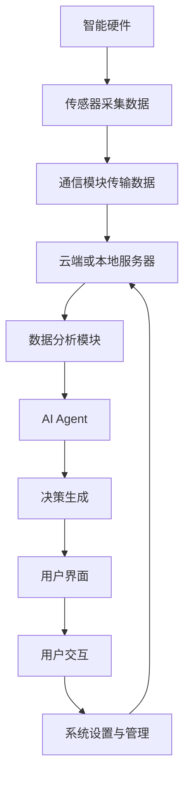

# 智能浴室置物架：AI Agent的洗护用品管理

> 关键词：智能浴室置物架、AI Agent、洗护用品管理、物联网、智能家居、传感器技术、数据分析

> 摘要：本文聚焦于智能浴室置物架这一创新产品，深入探讨了如何运用AI Agent实现对洗护用品的高效管理。首先介绍了智能浴室置物架的背景，包括其目的、预期读者、文档结构和相关术语。接着阐述了核心概念与联系，通过文本示意图和Mermaid流程图展示了系统架构。详细讲解了核心算法原理，并用Python代码进行了具体实现。同时给出了相关的数学模型和公式，并举例说明。在项目实战部分，介绍了开发环境搭建、源代码实现与解读。还探讨了智能浴室置物架的实际应用场景，推荐了相关的学习资源、开发工具框架和论文著作。最后总结了其未来发展趋势与挑战，并提供了常见问题解答和扩展阅读参考资料。

## 1. 背景介绍 
### 1.1 目的和范围
智能浴室置物架的开发目的在于解决传统浴室置物架功能单一的问题，借助AI Agent技术实现对洗护用品的智能化管理。传统浴室置物架仅仅提供了物品放置的空间，无法对物品的使用情况、剩余量等信息进行有效监测和管理。而智能浴室置物架可以实时感知洗护用品的状态，为用户提供便捷的使用体验，例如自动提醒用户补充即将用完的洗护用品、根据用户的使用习惯提供个性化的推荐等。

本项目的范围涵盖了智能浴室置物架的硬件设计、软件算法开发、与用户交互的界面设计以及系统的集成和测试。同时，还包括对AI Agent在洗护用品管理中的应用研究，以及如何通过数据分析实现更智能的决策。

### 1.2 预期读者
本文的预期读者包括智能家居领域的开发者、研究人员，对智能产品感兴趣的技术爱好者，以及从事浴室用品设计和生产的企业人员。对于开发者和研究人员，本文提供了智能浴室置物架开发的详细技术方案和实现思路；对于技术爱好者，能帮助他们了解智能产品背后的技术原理；对于企业人员，则可以为其产品创新提供参考。

### 1.3 文档结构概述
本文将按照以下结构进行阐述：首先介绍智能浴室置物架的背景信息，包括目的、预期读者和文档结构概述等。接着讲解核心概念与联系，通过文本示意图和Mermaid流程图展示系统的架构和工作原理。然后详细介绍核心算法原理，并给出Python代码实现。再阐述相关的数学模型和公式，并举例说明。在项目实战部分，介绍开发环境搭建、源代码实现与解读。之后探讨智能浴室置物架的实际应用场景。推荐相关的学习资源、开发工具框架和论文著作。最后总结未来发展趋势与挑战，提供常见问题解答和扩展阅读参考资料。

### 1.4 术语表
#### 1.4.1 核心术语定义
- **智能浴室置物架**：一种具备智能化功能的浴室置物架，通过传感器、AI Agent等技术实现对洗护用品的管理和监测。
- **AI Agent**：人工智能代理，是一种能够感知环境、进行推理和决策，并采取行动以实现特定目标的智能实体。在智能浴室置物架中，AI Agent用于分析洗护用品的状态信息，做出相应的决策，如提醒用户补充物品等。
- **物联网（IoT）**：通过各种信息传感器、射频识别技术、全球定位系统、红外感应器、激光扫描器等各种装置与技术，实时采集任何需要监控、连接、互动的物体或过程，采集其声、光、热、电、力学、化学、生物、位置等各种需要的信息，通过各类可能的网络接入，实现物与物、物与人的泛在连接，实现对物品和过程的智能化感知、识别和管理。智能浴室置物架通过物联网技术实现与其他设备的通信和数据传输。
- **传感器**：一种检测装置，能感受到被测量的信息，并能将感受到的信息，按一定规律变换成为电信号或其他所需形式的信息输出，以满足信息的传输、处理、存储、显示、记录和控制等要求。在智能浴室置物架中，传感器用于检测洗护用品的重量、使用频率等信息。

#### 1.4.2 相关概念解释
- **数据分析**：对大量的数据进行收集、整理、分析和解释，以发现有价值的信息和模式。在智能浴室置物架中，数据分析用于处理传感器采集到的洗护用品状态信息，为AI Agent的决策提供依据。
- **机器学习**：一门多领域交叉学科，涉及概率论、统计学、逼近论、凸分析、算法复杂度理论等多门学科。它专门研究计算机怎样模拟或实现人类的学习行为，以获取新的知识或技能，重新组织已有的知识结构使之不断改善自身的性能。在智能浴室置物架中，机器学习算法可以用于预测用户的使用习惯和洗护用品的消耗速度。
- **个性化推荐**：根据用户的个人信息、行为习惯、偏好等因素，为用户提供符合其需求的推荐内容。在智能浴室置物架中，个性化推荐可以根据用户的使用习惯推荐合适的洗护用品。

#### 1.4.3 缩略词列表
- **IoT**：物联网（Internet of Things）
- **AI**：人工智能（Artificial Intelligence）

## 2. 核心概念与联系 
智能浴室置物架的核心概念主要包括智能硬件、AI Agent、传感器技术和数据分析等。下面通过文本示意图和Mermaid流程图来展示它们之间的联系。

### 文本示意图
智能浴室置物架的系统架构主要由以下几个部分组成：
- **智能硬件**：包括置物架本体、安装在置物架上的各种传感器（如重量传感器、红外传感器等）、通信模块（如Wi-Fi模块、蓝牙模块等）和控制模块。智能硬件负责感知洗护用品的状态信息，并将这些信息通过通信模块传输到云端或本地服务器。
- **AI Agent**：AI Agent是智能浴室置物架的核心决策单元，它接收来自智能硬件的洗护用品状态信息，通过数据分析和机器学习算法进行推理和决策。例如，根据洗护用品的剩余重量判断是否需要提醒用户补充物品，根据用户的使用频率提供个性化的推荐等。
- **数据分析**：数据分析模块对传感器采集到的大量数据进行处理和分析，挖掘其中有价值的信息和模式。数据分析的结果为AI Agent的决策提供支持。
- **用户界面**：用户界面可以是手机应用程序、网页或智能语音助手等，用户通过用户界面与智能浴室置物架进行交互，接收系统的提醒和推荐信息，也可以对系统进行设置和管理。

### Mermaid流程图

该流程图展示了智能浴室置物架的工作流程：首先，智能硬件上的传感器采集洗护用品的状态信息，然后通过通信模块将数据传输到云端或本地服务器。数据分析模块对数据进行处理和分析，AI Agent根据分析结果进行推理和决策。决策结果通过用户界面展示给用户，用户可以进行交互、设置和管理系统，这些操作信息又反馈到服务器中。

## 3. 核心算法原理 & 具体操作步骤 
### 核心算法原理
智能浴室置物架的核心算法主要包括重量监测算法、使用频率分析算法和个性化推荐算法。下面分别介绍这些算法的原理，并给出Python代码实现。

#### 重量监测算法
重量监测算法用于实时监测洗护用品的重量，判断其剩余量是否低于设定的阈值。当剩余量低于阈值时，系统将提醒用户补充物品。

```python
class WeightMonitor:
    def __init__(self, threshold):
        self.threshold = threshold

    def check_weight(self, current_weight):
        if current_weight < self.threshold:
            return True  # 需要补充物品
        else:
            return False  # 不需要补充物品

# 使用示例
threshold = 50  # 设定阈值为50克
monitor = WeightMonitor(threshold)
current_weight = 40  # 当前重量为40克
if monitor.check_weight(current_weight):
    print("需要补充物品")
else:
    print("不需要补充物品")
```

#### 使用频率分析算法
使用频率分析算法用于统计用户使用洗护用品的频率，通过分析一段时间内的使用记录，了解用户的使用习惯。

```python
import datetime

class UsageFrequencyAnalyzer:
    def __init__(self):
        self.usage_records = []

    def add_usage_record(self):
        self.usage_records.append(datetime.datetime.now())

    def calculate_frequency(self, days):
        start_date = datetime.datetime.now() - datetime.timedelta(days=days)
        usage_count = sum(record > start_date for record in self.usage_records)
        return usage_count / days

# 使用示例
analyzer = UsageFrequencyAnalyzer()
analyzer.add_usage_record()  # 记录一次使用
analyzer.add_usage_record()  # 记录一次使用
frequency = analyzer.calculate_frequency(7)  # 计算最近7天的使用频率
print(f"最近7天的使用频率为: {frequency} 次/天")
```

#### 个性化推荐算法
个性化推荐算法根据用户的使用习惯和偏好，为用户推荐合适的洗护用品。这里简单示例，根据使用频率推荐不同容量的洗护用品。

```python
class PersonalizedRecommender:
    def __init__(self):
        self.usage_frequency = 0

    def set_usage_frequency(self, frequency):
        self.usage_frequency = frequency

    def recommend_product(self):
        if self.usage_frequency < 0.5:
            return "小容量洗护用品"
        elif self.usage_frequency < 1:
            return "中容量洗护用品"
        else:
            return "大容量洗护用品"

# 使用示例
recommender = PersonalizedRecommender()
recommender.set_usage_frequency(frequency)
recommendation = recommender.recommend_product()
print(f"推荐的洗护用品为: {recommendation}")
```

### 具体操作步骤
1. **数据采集**：智能硬件上的传感器实时采集洗护用品的重量、使用时间等信息。
2. **数据传输**：通信模块将采集到的数据传输到云端或本地服务器。
3. **数据处理**：数据分析模块对数据进行清洗、整理和分析。
4. **决策生成**：AI Agent根据分析结果进行推理和决策，如判断是否需要提醒用户补充物品、生成个性化推荐等。
5. **信息反馈**：决策结果通过用户界面反馈给用户，用户可以进行交互和管理。

## 4. 数学模型和公式 & 详细讲解 & 举例说明 
### 重量监测模型
#### 数学公式
设 $W_c$ 为当前洗护用品的重量，$W_t$ 为设定的阈值。当 $W_c < W_t$ 时，需要提醒用户补充物品。

#### 详细讲解
这个模型非常简单直观，通过比较当前重量和阈值来判断洗护用品的剩余量是否足够。阈值的设定可以根据不同的洗护用品和用户需求进行调整。

#### 举例说明
假设洗发水的阈值 $W_t = 100$ 克，当前重量 $W_c = 80$ 克，因为 $80 < 100$，所以系统会提醒用户补充洗发水。

### 使用频率分析模型
#### 数学公式
设 $n$ 为在时间区间 $[t_1, t_2]$ 内的使用次数，$\Delta t = t_2 - t_1$ 为时间区间的长度（以天为单位），则使用频率 $f$ 可以表示为：
$$f = \frac{n}{\Delta t}$$

#### 详细讲解
该公式通过计算在一定时间区间内的使用次数与时间区间长度的比值来得到使用频率。使用频率可以帮助我们了解用户的使用习惯，例如使用频繁的用户可能需要大容量的洗护用品，而使用不频繁的用户则可以选择小容量的产品。

#### 举例说明
假设在最近7天内，用户使用沐浴露的次数 $n = 5$ 次，则使用频率 $f = \frac{5}{7} \approx 0.71$ 次/天。

### 个性化推荐模型
#### 数学公式
个性化推荐模型可以根据使用频率 $f$ 进行分类推荐，设 $f_1$ 和 $f_2$ 为两个阈值（$f_1 < f_2$），则推荐规则可以表示为：
- 当 $f < f_1$ 时，推荐小容量洗护用品；
- 当 $f_1 \leq f < f_2$ 时，推荐中容量洗护用品；
- 当 $f \geq f_2$ 时，推荐大容量洗护用品。

#### 详细讲解
这个模型根据使用频率将用户分为不同的类别，然后根据类别推荐合适容量的洗护用品。阈值 $f_1$ 和 $f_2$ 可以根据市场调研和用户反馈进行调整。

#### 举例说明
假设 $f_1 = 0.5$，$f_2 = 1$，用户的使用频率 $f = 0.71$，因为 $0.5 \leq 0.71 < 1$，所以推荐中容量的沐浴露。

## 5. 项目实战：代码实际案例和详细解释说明 
### 5.1  开发环境搭建
#### 硬件环境
- **智能浴室置物架**：可以选择市面上现有的智能置物架，或者自行设计和制作。置物架需要安装重量传感器、红外传感器等设备，用于采集洗护用品的状态信息。
- **开发板**：如树莓派（Raspberry Pi），作为智能浴室置物架的控制中心，负责数据的处理和通信。
- **传感器模块**：重量传感器用于测量洗护用品的重量，红外传感器用于检测物品的使用情况。
- **通信模块**：Wi-Fi模块或蓝牙模块，用于将数据传输到云端或本地服务器。

#### 软件环境
- **操作系统**：树莓派可以安装Raspbian操作系统。
- **开发语言**：Python，因为Python具有丰富的库和工具，适合快速开发。
- **数据库**：可以选择MySQL或SQLite等数据库，用于存储传感器采集到的数据。
- **服务器**：如果选择将数据上传到云端，可以使用阿里云、腾讯云等云服务器；如果选择本地服务器，可以使用Apache或Nginx等Web服务器。

### 5.2  源代码详细实现和代码解读
#### 数据采集模块
```python
import RPi.GPIO as GPIO
import time

# 初始化重量传感器
def init_weight_sensor():
    GPIO.setmode(GPIO.BCM)
    # 这里需要根据实际连接的引脚进行设置
    GPIO.setup(17, GPIO.IN)  

# 读取重量传感器数据
def read_weight_sensor():
    # 模拟读取重量数据
    # 实际应用中需要根据传感器的型号和接口进行读取
    weight = 100  
    return weight

# 初始化红外传感器
def init_ir_sensor():
    GPIO.setmode(GPIO.BCM)
    # 这里需要根据实际连接的引脚进行设置
    GPIO.setup(18, GPIO.IN)  

# 读取红外传感器数据
def read_ir_sensor():
    # 模拟读取红外数据
    # 实际应用中需要根据传感器的型号和接口进行读取
    is_used = True  
    return is_used

if __name__ == "__main__":
    init_weight_sensor()
    init_ir_sensor()
    while True:
        weight = read_weight_sensor()
        is_used = read_ir_sensor()
        print(f"当前重量: {weight} 克，是否使用: {is_used}")
        time.sleep(1)
```
**代码解读**：
- `init_weight_sensor` 函数用于初始化重量传感器的引脚。
- `read_weight_sensor` 函数用于读取重量传感器的数据，这里只是模拟返回一个固定值，实际应用中需要根据传感器的型号和接口进行读取。
- `init_ir_sensor` 函数用于初始化红外传感器的引脚。
- `read_ir_sensor` 函数用于读取红外传感器的数据，同样是模拟返回一个固定值。
- 在主程序中，不断循环读取重量和红外传感器的数据，并打印输出。

#### 数据传输模块
```python
import requests
import json

# 数据上传函数
def upload_data(weight, is_used):
    url = "http://your_server_address/api/upload"  # 替换为实际的服务器地址
    data = {
        "weight": weight,
        "is_used": is_used
    }
    headers = {
        "Content-Type": "application/json"
    }
    try:
        response = requests.post(url, data=json.dumps(data), headers=headers)
        if response.status_code == 200:
            print("数据上传成功")
        else:
            print(f"数据上传失败，状态码: {response.status_code}")
    except Exception as e:
        print(f"数据上传出错: {e}")

if __name__ == "__main__":
    weight = 100
    is_used = True
    upload_data(weight, is_used)
```
**代码解读**：
- `upload_data` 函数用于将采集到的重量和使用状态数据上传到服务器。使用 `requests` 库发送POST请求，将数据以JSON格式发送到服务器。
- 在主程序中，模拟了一个重量和使用状态数据，并调用 `upload_data` 函数进行上传。

#### 数据分析和决策模块
```python
import sqlite3

# 连接数据库
def connect_db():
    conn = sqlite3.connect('bathroom_data.db')
    return conn

# 插入数据到数据库
def insert_data(conn, weight, is_used):
    cursor = conn.cursor()
    cursor.execute("INSERT INTO bathroom_data (weight, is_used) VALUES (?, ?)", (weight, is_used))
    conn.commit()

# 分析数据并决策
def analyze_data(conn):
    cursor = conn.cursor()
    cursor.execute("SELECT AVG(weight) FROM bathroom_data")
    avg_weight = cursor.fetchone()[0]
    if avg_weight < 50:
        print("需要补充物品")
    else:
        print("不需要补充物品")

if __name__ == "__main__":
    conn = connect_db()
    weight = 100
    is_used = True
    insert_data(conn, weight, is_used)
    analyze_data(conn)
    conn.close()
```
**代码解读**：
- `connect_db` 函数用于连接SQLite数据库。
- `insert_data` 函数用于将采集到的数据插入到数据库中。
- `analyze_data` 函数用于分析数据库中的数据，计算平均重量，并根据平均重量判断是否需要补充物品。
- 在主程序中，连接数据库，插入数据，分析数据，最后关闭数据库连接。

### 5.3  代码解读与分析
通过以上三个模块的代码，我们实现了智能浴室置物架的数据采集、传输、分析和决策功能。数据采集模块负责从传感器读取洗护用品的状态信息，数据传输模块将采集到的数据上传到服务器，数据分析和决策模块对数据进行处理和分析，根据分析结果做出决策。

在实际应用中，还需要对代码进行优化和扩展，例如增加错误处理、提高数据传输的稳定性、优化数据分析算法等。同时，还可以开发用户界面，让用户可以方便地查看洗护用品的状态信息和接收系统的提醒。

## 6. 实际应用场景 
### 家庭场景
在家庭浴室中，智能浴室置物架可以为用户提供便捷的洗护用品管理服务。用户可以通过手机应用程序实时查看洗护用品的剩余量，系统会自动提醒用户补充即将用完的物品。同时，根据用户的使用习惯，智能浴室置物架还可以提供个性化的推荐，帮助用户选择合适的洗护用品。例如，对于经常出差的用户，推荐小容量的便携式洗护用品；对于家庭成员较多的家庭，推荐大容量的洗护用品。

### 酒店场景
在酒店浴室中，智能浴室置物架可以提高酒店的服务质量和管理效率。酒店工作人员可以通过后台系统实时了解每个房间洗护用品的使用情况，及时进行补充和更换，避免客人因缺少洗护用品而产生不满。同时，智能浴室置物架还可以收集客人的使用习惯数据，为酒店提供个性化的服务，例如根据客人的使用频率和偏好，在客人下次入住时提前准备好合适的洗护用品。

### 商业洗浴中心场景
在商业洗浴中心，智能浴室置物架可以帮助管理大量的洗护用品。通过实时监测洗护用品的使用情况，洗浴中心可以合理安排库存，减少浪费。同时，智能浴室置物架还可以提供数据分析功能，帮助洗浴中心了解顾客的使用习惯和需求，优化产品的采购和配置。

## 7. 工具和资源推荐
### 7.1 学习资源推荐
#### 7.1.1 书籍推荐
- 《Python编程：从入门到实践》：这本书适合Python初学者，详细介绍了Python的基本语法和编程技巧，通过大量的实例帮助读者快速掌握Python编程。
- 《机器学习实战》：该书介绍了机器学习的基本算法和应用场景，通过Python代码实现了各种机器学习算法，帮助读者理解和应用机器学习技术。
- 《物联网：技术、应用与标准》：全面介绍了物联网的技术原理、应用场景和相关标准，对于了解智能浴室置物架所涉及的物联网技术有很大的帮助。

#### 7.1.2 在线课程
- Coursera上的“Python for Everybody”：由密歇根大学提供的Python入门课程，课程内容丰富，讲解详细，适合初学者。
- edX上的“Machine Learning”：由斯坦福大学提供的机器学习课程，由著名教授Andrew Ng授课，是学习机器学习的经典课程。
- 中国大学MOOC上的“物联网技术与应用”：由国内高校提供的物联网课程，介绍了物联网的基本概念、技术和应用，对于了解智能浴室置物架的相关技术有很大的帮助。

#### 7.1.3 技术博客和网站
- 博客园：国内知名的技术博客网站，有很多关于Python、机器学习、物联网等领域的技术文章。
- 开源中国：提供了大量的开源项目和技术文章，对于了解最新的技术动态和开源项目有很大的帮助。
- 知乎：一个知识分享平台，有很多关于智能产品、物联网等领域的讨论和经验分享。

### 7.2 开发工具框架推荐
#### 7.2.1 IDE和编辑器
- PyCharm：一款专业的Python集成开发环境，提供了代码编辑、调试、版本控制等功能，适合Python开发。
- Visual Studio Code：一款轻量级的代码编辑器，支持多种编程语言，有丰富的插件和扩展功能，适合快速开发。
- Raspberry Pi IDE：专门为树莓派开发设计的集成开发环境，提供了对树莓派硬件的支持和开发工具。

#### 7.2.2 调试和性能分析工具
- PDB：Python自带的调试工具，可以帮助开发者调试Python代码，查找和解决问题。
- cProfile：Python的性能分析工具，可以分析Python代码的性能瓶颈，帮助开发者优化代码。
- Wireshark：一款网络协议分析工具，可以用于分析智能浴室置物架与服务器之间的数据传输情况，排查网络故障。

#### 7.2.3 相关框架和库
- Flask：一个轻量级的Python Web框架，适合快速开发Web应用程序，可用于开发智能浴室置物架的服务器端应用。
- Django：一个功能强大的Python Web框架，提供了丰富的功能和工具，适合开发大型的Web应用程序。
- TensorFlow：一个开源的机器学习框架，可用于实现智能浴室置物架中的机器学习算法，如个性化推荐算法。

### 7.3 相关论文著作推荐
#### 7.3.1 经典论文
- “Artificial Intelligence: A Modern Approach”：这是人工智能领域的经典教材，全面介绍了人工智能的基本概念、算法和应用，对于了解AI Agent的原理和应用有很大的帮助。
- “Internet of Things: A Survey”：该论文对物联网的技术、应用和挑战进行了全面的综述，对于了解智能浴室置物架所涉及的物联网技术有重要的参考价值。

#### 7.3.2 最新研究成果
- 在IEEE Xplore、ACM Digital Library等学术数据库中搜索关于智能家居、物联网、AI Agent等领域的最新研究成果，了解行业的最新动态和技术发展趋势。

#### 7.3.3 应用案例分析
- 可以参考一些智能家居产品的应用案例分析报告，了解智能产品的设计思路、技术实现和市场推广策略，为智能浴室置物架的开发和推广提供参考。

## 8. 总结：未来发展趋势与挑战
### 未来发展趋势
- **智能化程度不断提高**：随着人工智能技术的不断发展，智能浴室置物架的智能化程度将不断提高。例如，AI Agent将能够更加准确地理解用户的需求和使用习惯，提供更加个性化的服务。同时，智能浴室置物架还可以与其他智能家居设备进行联动，实现更加智能化的家居控制。
- **功能不断扩展**：除了现有的洗护用品管理功能，智能浴室置物架还可能扩展其他功能。例如，增加健康监测功能，检测用户的皮肤状况，根据皮肤状况推荐合适的洗护用品；增加娱乐功能，如播放音乐、视频等，为用户提供更加舒适的洗浴体验。
- **与大数据和云计算的结合**：通过与大数据和云计算技术的结合，智能浴室置物架可以收集和分析更多的数据，为用户提供更加精准的服务。同时，云计算还可以提供强大的计算能力，支持智能浴室置物架运行更加复杂的算法和模型。

### 挑战
- **数据安全和隐私问题**：智能浴室置物架需要收集和处理用户的大量数据，如洗护用品的使用习惯、个人偏好等，这些数据涉及用户的隐私。因此，如何保障数据的安全和隐私是一个重要的挑战。需要采用先进的加密技术和安全机制，防止数据泄露和滥用。
- **标准和兼容性问题**：目前，智能家居行业缺乏统一的标准和规范，不同品牌和型号的智能设备之间可能存在兼容性问题。智能浴室置物架需要与其他智能家居设备进行通信和联动，因此需要解决标准和兼容性问题，确保设备之间的互操作性。
- **用户接受度问题**：智能浴室置物架作为一种新型的智能家居产品，用户对其认知和接受度还需要提高。一些用户可能对智能产品的可靠性和安全性存在疑虑，需要加强宣传和推广，提高用户的认知和信任度。

## 9. 附录：常见问题与解答
### 智能浴室置物架的传感器精度如何保证？
传感器的精度可以通过以下方法保证：选择质量可靠、精度高的传感器产品；对传感器进行定期校准和维护；在设计和安装传感器时，注意避免外界干扰因素的影响。

### 智能浴室置物架的数据传输稳定吗？
数据传输的稳定性可以通过选择可靠的通信模块和网络环境来保证。例如，选择信号强度高、稳定性好的Wi-Fi模块或蓝牙模块；在浴室等信号容易受到干扰的环境中，可以增加信号增强器等设备。同时，还可以采用数据重传、错误校验等机制来提高数据传输的可靠性。

### 智能浴室置物架的个性化推荐准确吗？
个性化推荐的准确性取决于数据的收集和分析。智能浴室置物架通过传感器收集用户的使用习惯和偏好数据，然后通过机器学习算法进行分析和预测。随着数据的不断积累和算法的不断优化，个性化推荐的准确性将不断提高。

### 智能浴室置物架的电池续航能力如何？
电池续航能力取决于智能浴室置物架的硬件设计和使用情况。在设计时，可以选择低功耗的硬件组件，优化电路设计，降低功耗。同时，还可以采用充电电池或外接电源的方式来保证设备的持续运行。

## 10. 扩展阅读 & 参考资料
### 扩展阅读
- 《智能家居：改变生活的未来科技》：介绍了智能家居的发展历程、技术原理和应用场景，对于了解智能浴室置物架所处的智能家居领域有很大的帮助。
- 《人工智能时代的智能产品设计》：探讨了人工智能技术在智能产品设计中的应用和发展趋势，对于智能浴室置物架的设计和创新有一定的启发。

### 参考资料
- 相关传感器产品的技术文档和使用手册。
- 物联网、人工智能、机器学习等领域的学术论文和研究报告。
- 智能家居行业的标准和规范文件。