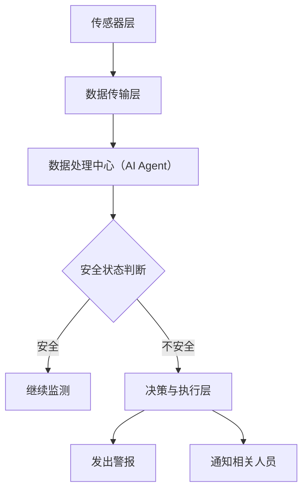

# 智能浴室防滑垫：AI Agent的洗浴安全监护

> 关键词：智能浴室防滑垫、AI Agent、洗浴安全监护、传感器技术、数据分析

> 摘要：本文聚焦于智能浴室防滑垫结合AI Agent实现洗浴安全监护这一前沿技术。详细介绍了智能浴室防滑垫的背景、核心概念、算法原理、数学模型，通过项目实战展示了其代码实现与解读，探讨了实际应用场景，推荐了相关学习资源、开发工具和论文著作，最后总结了未来发展趋势与挑战，并解答了常见问题。旨在为读者全面深入地呈现智能浴室防滑垫在洗浴安全监护方面的技术原理、应用价值和发展前景。

## 1. 背景介绍 
### 1.1 目的和范围
随着人们生活水平的提高，对洗浴安全的关注度也日益增加。浴室作为家庭中容易发生滑倒等意外事故的场所，传统的防滑垫仅能提供有限的防滑功能，无法实时监测和保障洗浴者的安全。本文章的目的在于介绍智能浴室防滑垫结合AI Agent技术实现洗浴安全监护的相关知识，范围涵盖该技术的原理、实现方法、实际应用以及未来发展趋势等方面。

### 1.2 预期读者
本文预期读者包括对智能家居技术、人工智能应用、洗浴安全相关领域感兴趣的科研人员、技术开发者、产品设计师以及关注家庭安全的普通消费者。通过阅读本文，他们可以了解智能浴室防滑垫这一创新产品的技术细节和应用前景。

### 1.3 文档结构概述
本文首先介绍智能浴室防滑垫及AI Agent的背景知识，包括目的、预期读者和文档结构等。接着阐述核心概念与联系，给出原理和架构的文本示意图与Mermaid流程图。然后详细讲解核心算法原理和具体操作步骤，并用Python源代码进行说明。之后介绍数学模型和公式，并举例说明。通过项目实战展示代码实际案例和详细解释。探讨实际应用场景，推荐相关工具和资源。最后总结未来发展趋势与挑战，解答常见问题并提供扩展阅读和参考资料。

### 1.4 术语表
#### 1.4.1 核心术语定义
- **智能浴室防滑垫**：集成了多种传感器和计算模块，能够感知洗浴者的行为、状态等信息，并具备一定数据处理和通信能力的防滑垫。
- **AI Agent**：人工智能代理，是一种能够感知环境、做出决策并采取行动以实现特定目标的智能实体。在本文中，AI Agent用于分析智能浴室防滑垫收集的数据，提供洗浴安全监护服务。
- **洗浴安全监护**：通过监测洗浴者在浴室中的各种状态和行为，及时发现潜在的安全风险，并采取相应措施保障洗浴者的安全。

#### 1.4.2 相关概念解释
- **传感器技术**：用于采集智能浴室防滑垫所需的各种数据，如压力、温度、湿度等。不同类型的传感器可以感知不同的物理量，为后续的数据分析提供基础。
- **数据分析**：对传感器采集到的数据进行处理、挖掘和分析，提取有价值的信息，以便AI Agent做出准确的决策。
- **机器学习算法**：AI Agent可以使用机器学习算法对大量的历史数据进行训练，从而能够准确地识别洗浴者的行为模式和潜在的安全风险。

#### 1.4.3 缩略词列表
- **AI**：Artificial Intelligence，人工智能
- **IoT**：Internet of Things，物联网
- **ML**：Machine Learning，机器学习

## 2. 核心概念与联系 
### 核心概念原理
智能浴室防滑垫结合AI Agent实现洗浴安全监护的核心原理是通过防滑垫上集成的多种传感器实时采集洗浴者的相关数据，如压力分布、身体姿态、停留时间等。这些数据被传输到AI Agent中，AI Agent利用机器学习算法和预设的规则对数据进行分析和处理，判断洗浴者是否处于安全状态。如果发现潜在的安全风险，AI Agent会及时发出警报或采取相应的措施，如通知家庭成员或急救中心。

### 架构的文本示意图
智能浴室防滑垫系统主要由以下几个部分组成：
- **传感器层**：包括压力传感器、温度传感器、湿度传感器等，负责采集洗浴者的各种数据。
- **数据传输层**：将传感器采集到的数据传输到数据处理中心，可以通过无线通信技术（如蓝牙、Wi-Fi等）实现。
- **数据处理中心**：包含AI Agent，对采集到的数据进行分析和处理，判断洗浴者的安全状态。
- **决策与执行层**：根据AI Agent的分析结果，做出相应的决策，如发出警报、通知相关人员等。

### Mermaid流程图


## 3. 核心算法原理 & 具体操作步骤 
### 核心算法原理
智能浴室防滑垫结合AI Agent实现洗浴安全监护主要使用机器学习中的分类算法，如决策树、支持向量机等。以决策树算法为例，其基本原理是根据输入的特征数据构建一棵决策树，每个内部节点表示一个特征上的测试，每个分支是一个测试输出，每个叶节点是一个类别。通过对大量的历史数据进行训练，决策树可以学习到不同特征与安全状态之间的关系，从而对新的输入数据进行分类和判断。

### 具体操作步骤
1. **数据采集**：通过防滑垫上的传感器采集洗浴者的压力分布、身体姿态、停留时间等数据。
2. **数据预处理**：对采集到的数据进行清洗、归一化等处理，去除噪声和异常值，使数据具有可比性。
3. **特征提取**：从预处理后的数据中提取有代表性的特征，如压力的最大值、平均值、方差等。
4. **模型训练**：使用训练数据集对决策树模型进行训练，调整模型的参数，使其能够准确地分类不同的安全状态。
5. **模型评估**：使用测试数据集对训练好的模型进行评估，计算模型的准确率、召回率等指标，评估模型的性能。
6. **实时监测与决策**：在实际应用中，将实时采集到的数据输入到训练好的模型中，模型根据输入数据进行分类和判断，AI Agent根据判断结果做出相应的决策。

### Python源代码实现
```python
import numpy as np
from sklearn.tree import DecisionTreeClassifier
from sklearn.model_selection import train_test_split
from sklearn.metrics import accuracy_score

# 模拟数据采集
def generate_data():
    # 假设每个样本有3个特征
    X = np.random.rand(100, 3)
    # 假设安全状态用0和1表示
    y = np.random.randint(0, 2, 100)
    return X, y

# 数据预处理
def preprocess_data(X):
    # 简单的归一化处理
    X = (X - np.mean(X, axis=0)) / np.std(X, axis=0)
    return X

# 模型训练与评估
def train_and_evaluate(X, y):
    # 划分训练集和测试集
    X_train, X_test, y_train, y_test = train_test_split(X, y, test_size=0.2, random_state=42)
    # 创建决策树分类器
    model = DecisionTreeClassifier()
    # 模型训练
    model.fit(X_train, y_train)
    # 模型预测
    y_pred = model.predict(X_test)
    # 计算准确率
    accuracy = accuracy_score(y_test, y_pred)
    print(f"模型准确率: {accuracy}")
    return model

# 实时监测与决策
def real_time_monitoring(model, new_data):
    new_data = preprocess_data(new_data)
    prediction = model.predict(new_data)
    if prediction[0] == 0:
        print("洗浴者处于安全状态")
    else:
        print("洗浴者存在安全风险，发出警报！")

# 主函数
def main():
    X, y = generate_data()
    X = preprocess_data(X)
    model = train_and_evaluate(X, y)
    # 模拟实时数据
    new_data = np.random.rand(1, 3)
    real_time_monitoring(model, new_data)

if __name__ == "__main__":
    main()
```

## 4. 数学模型和公式 & 详细讲解 & 举例说明 
### 决策树算法的数学模型
决策树算法的核心是构建一棵决策树，决策树的构建过程可以使用信息增益、基尼指数等指标来选择最优的划分特征。以信息增益为例，信息增益的计算公式如下：
$$
IG(D, A) = Ent(D) - \sum_{v = 1}^{V} \frac{|D^v|}{|D|} Ent(D^v)
$$
其中，$IG(D, A)$ 表示特征 $A$ 对数据集 $D$ 的信息增益，$Ent(D)$ 表示数据集 $D$ 的信息熵，$V$ 表示特征 $A$ 的取值个数，$D^v$ 表示数据集 $D$ 中特征 $A$ 取值为 $v$ 的子集。

### 信息熵的计算公式
信息熵用于衡量数据集的不确定性，其计算公式如下：
$$
Ent(D) = - \sum_{k = 1}^{K} p_k \log_2 p_k
$$
其中，$K$ 表示数据集 $D$ 中类别的个数，$p_k$ 表示第 $k$ 个类别的样本在数据集 $D$ 中所占的比例。

### 详细讲解
信息增益的计算过程是先计算数据集 $D$ 的信息熵 $Ent(D)$，然后对于每个特征 $A$，计算其不同取值下子集的信息熵 $Ent(D^v)$，并根据子集的大小进行加权求和，最后用数据集 $D$ 的信息熵减去加权后的子集信息熵，得到特征 $A$ 对数据集 $D$ 的信息增益。信息增益越大，说明该特征对数据集的划分能力越强，越适合作为决策树的划分特征。

### 举例说明
假设有一个数据集 $D$ 包含 10 个样本，分为两个类别：安全（6 个样本）和不安全（4 个样本）。则数据集 $D$ 的信息熵为：
$$
Ent(D) = - \frac{6}{10} \log_2 \frac{6}{10} - \frac{4}{10} \log_2 \frac{4}{10} \approx 0.971
$$
假设存在一个特征 $A$，其取值为 $A_1$ 和 $A_2$，$A_1$ 对应的子集 $D^1$ 包含 3 个安全样本和 1 个不安全样本，$A_2$ 对应的子集 $D^2$ 包含 3 个安全样本和 3 个不安全样本。则子集 $D^1$ 的信息熵为：
$$
Ent(D^1) = - \frac{3}{4} \log_2 \frac{3}{4} - \frac{1}{4} \log_2 \frac{1}{4} \approx 0.811
$$
子集 $D^2$ 的信息熵为：
$$
Ent(D^2) = - \frac{3}{6} \log_2 \frac{3}{6} - \frac{3}{6} \log_2 \frac{3}{6} = 1
$$
特征 $A$ 对数据集 $D$ 的信息增益为：
$$
IG(D, A) = Ent(D) - \frac{4}{10} Ent(D^1) - \frac{6}{10} Ent(D^2) \approx 0.971 - \frac{4}{10} \times 0.811 - \frac{6}{10} \times 1 \approx 0.135
$$

## 5. 项目实战：代码实际案例和详细解释说明 
### 5.1  开发环境搭建
- **硬件环境**：需要一块支持传感器集成和数据处理的开发板，如 Raspberry Pi，以及压力传感器、温度传感器、湿度传感器等。
- **软件环境**：安装 Python 3.x 环境，以及相关的机器学习库，如 `scikit-learn`、`numpy`、`pandas` 等。可以使用以下命令进行安装：
```sh
pip install scikit-learn numpy pandas
```

### 5.2  源代码详细实现和代码解读
```python
import numpy as np
import pandas as pd
from sklearn.tree import DecisionTreeClassifier
from sklearn.model_selection import train_test_split
from sklearn.metrics import accuracy_score

# 读取数据
def read_data(file_path):
    data = pd.read_csv(file_path)
    X = data.drop('label', axis=1).values
    y = data['label'].values
    return X, y

# 数据预处理
def preprocess_data(X):
    # 归一化处理
    X = (X - np.mean(X, axis=0)) / np.std(X, axis=0)
    return X

# 模型训练与评估
def train_and_evaluate(X, y):
    # 划分训练集和测试集
    X_train, X_test, y_train, y_test = train_test_split(X, y, test_size=0.2, random_state=42)
    # 创建决策树分类器
    model = DecisionTreeClassifier()
    # 模型训练
    model.fit(X_train, y_train)
    # 模型预测
    y_pred = model.predict(X_test)
    # 计算准确率
    accuracy = accuracy_score(y_test, y_pred)
    print(f"模型准确率: {accuracy}")
    return model

# 实时监测与决策
def real_time_monitoring(model, new_data):
    new_data = preprocess_data(new_data)
    prediction = model.predict(new_data)
    if prediction[0] == 0:
        print("洗浴者处于安全状态")
    else:
        print("洗浴者存在安全风险，发出警报！")

# 主函数
def main():
    file_path = 'bathroom_data.csv'
    X, y = read_data(file_path)
    X = preprocess_data(X)
    model = train_and_evaluate(X, y)
    # 模拟实时数据
    new_data = np.random.rand(1, X.shape[1])
    real_time_monitoring(model, new_data)

if __name__ == "__main__":
    main()
```
### 代码解读与分析
- **读取数据**：`read_data` 函数用于读取存储在 CSV 文件中的数据，将特征数据和标签数据分离。
- **数据预处理**：`preprocess_data` 函数对特征数据进行归一化处理，使数据具有可比性。
- **模型训练与评估**：`train_and_evaluate` 函数将数据集划分为训练集和测试集，使用决策树分类器进行训练和预测，并计算模型的准确率。
- **实时监测与决策**：`real_time_monitoring` 函数将实时采集到的数据进行预处理，输入到训练好的模型中进行预测，根据预测结果做出相应的决策。
- **主函数**：`main` 函数调用上述函数，完成数据读取、预处理、模型训练和实时监测等操作。

## 6. 实际应用场景 
### 家庭使用
在家庭浴室中，智能浴室防滑垫可以实时监测家庭成员的洗浴安全状况。例如，当老人在洗浴过程中长时间静止不动或身体姿态异常时，防滑垫可以及时发出警报，通知家人采取措施，避免发生意外事故。

### 公共场所
在酒店、健身房等公共场所的浴室中，智能浴室防滑垫可以提高洗浴者的安全性。一旦检测到安全风险，工作人员可以及时响应，保障洗浴者的生命安全。

### 医疗护理
在医院、养老院等医疗护理场所，智能浴室防滑垫可以为行动不便的患者提供更安全的洗浴环境。防滑垫可以实时监测患者的身体状态，为医护人员提供准确的信息，便于及时进行护理和治疗。

## 7. 工具和资源推荐
### 7.1 学习资源推荐
#### 7.1.1 书籍推荐
- 《机器学习》（周志华著）：全面介绍了机器学习的基本概念、算法和应用，是机器学习领域的经典教材。
- 《Python机器学习实战》（Sebastian Raschka著）：通过实际案例介绍了如何使用 Python 实现机器学习算法，适合初学者学习。
- 《人工智能：一种现代的方法》（Stuart Russell、Peter Norvig著）：涵盖了人工智能的各个领域，包括搜索算法、知识表示、机器学习等，是人工智能领域的权威著作。

#### 7.1.2 在线课程
- Coursera 上的“Machine Learning”（Andrew Ng 教授主讲）：经典的机器学习课程，系统地介绍了机器学习的基本概念和算法。
- edX 上的“Artificial Intelligence”（UC Berkeley 开设）：全面介绍了人工智能的各个方面，包括搜索、推理、学习等。
- 中国大学MOOC上的“Python 机器学习应用”：结合实际案例介绍了 Python 在机器学习中的应用，适合初学者学习。

#### 7.1.3 技术博客和网站
- Medium：上面有很多关于人工智能、机器学习的技术文章和案例分享。
- Towards Data Science：专注于数据科学和机器学习领域的技术博客，提供了很多实用的教程和案例。
- Kaggle：一个数据科学竞赛平台，上面有很多公开的数据集和优秀的数据分析代码，可以学习到很多实际应用的技巧。

### 7.2 开发工具框架推荐
#### 7.2.1 IDE和编辑器
- PyCharm：一款专业的 Python 集成开发环境，提供了丰富的代码编辑、调试和分析功能。
- Jupyter Notebook：一种交互式的开发环境，适合进行数据探索和模型实验。
- Visual Studio Code：一款轻量级的代码编辑器，支持多种编程语言，有丰富的插件可以扩展功能。

#### 7.2.2 调试和性能分析工具
- PDB：Python 自带的调试器，可以帮助开发者定位代码中的问题。
- cProfile：Python 内置的性能分析工具，可以分析代码的运行时间和函数调用情况。
- TensorBoard：TensorFlow 提供的可视化工具，可以用于可视化模型的训练过程和性能指标。

#### 7.2.3 相关框架和库
- scikit-learn：一个简单易用的机器学习库，提供了各种机器学习算法和工具，适合初学者使用。
- TensorFlow：一个开源的深度学习框架，广泛应用于图像识别、自然语言处理等领域。
- PyTorch：另一个流行的深度学习框架，具有动态图的特点，易于使用和调试。

### 7.3 相关论文著作推荐
#### 7.3.1 经典论文
- “A Decision-Theoretic Generalization of On-Line Learning and an Application to Boosting”（Yoav Freund、Robert E. Schapire著）：介绍了 AdaBoost 算法的原理和应用，是机器学习领域的经典论文。
- “Gradient-Based Learning Applied to Document Recognition”（Yann LeCun、Léon Bottou、Yoshua Bengio、Patrick Haffner著）：介绍了卷积神经网络（CNN）在手写数字识别中的应用，是深度学习领域的奠基性论文。
- “Playing Atari with Deep Reinforcement Learning”（Volodymyr Mnih、Koray Kavukcuoglu、David Silver等著）：介绍了深度强化学习在 Atari 游戏中的应用，开启了深度强化学习的研究热潮。

#### 7.3.2 最新研究成果
- 可以关注顶级学术会议如 NeurIPS、ICML、CVPR 等的论文，了解人工智能领域的最新研究成果。
- 一些知名的学术期刊如 Journal of Artificial Intelligence Research（JAIR）、Artificial Intelligence 等也会发表人工智能领域的高质量研究论文。

#### 7.3.3 应用案例分析
- 可以参考一些实际应用案例的论文，了解智能浴室防滑垫等智能家居产品在实际应用中的问题和解决方案。例如，一些关于智能健康监测系统的论文可以为智能浴室防滑垫的设计和开发提供参考。

## 8. 总结：未来发展趋势与挑战
### 未来发展趋势
- **功能集成化**：未来的智能浴室防滑垫可能会集成更多的功能，如水质监测、洗浴用品自动投放等，为用户提供更加全面的洗浴体验。
- **智能化程度提高**：随着人工智能技术的不断发展，AI Agent 可以更加准确地识别洗浴者的行为和状态，提供更加个性化的安全监护服务。
- **与其他智能家居设备的联动**：智能浴室防滑垫可以与其他智能家居设备（如智能门锁、智能摄像头等）进行联动，实现更加智能化的家庭安全管理。

### 挑战
- **数据安全与隐私保护**：智能浴室防滑垫会收集大量的用户数据，如何保障这些数据的安全和隐私是一个重要的挑战。
- **传感器精度和可靠性**：传感器的精度和可靠性直接影响到智能浴室防滑垫的性能，如何提高传感器的精度和可靠性是需要解决的问题。
- **成本问题**：目前智能浴室防滑垫的成本相对较高，如何降低成本，提高产品的性价比，是推广智能浴室防滑垫的关键。

## 9. 附录：常见问题与解答
### 问题1：智能浴室防滑垫的传感器容易损坏吗？
解答：一般来说，智能浴室防滑垫的传感器经过了严格的测试和验证，具有一定的耐用性。但是，在使用过程中仍需要注意避免过度挤压、碰撞等情况，以延长传感器的使用寿命。

### 问题2：智能浴室防滑垫的电池续航时间有多长？
解答：电池续航时间取决于防滑垫的使用频率、传感器的功耗等因素。一般来说，一次充满电后可以使用数天到数周不等。具体的续航时间可以参考产品说明书。

### 问题3：智能浴室防滑垫的安装复杂吗？
解答：智能浴室防滑垫的安装通常比较简单，只需要将防滑垫平整地放置在浴室地面上，并连接好电源或电池即可。有些防滑垫还支持无线连接，安装更加方便。

### 问题4：智能浴室防滑垫可以与手机APP连接吗？
解答：大多数智能浴室防滑垫都支持与手机APP连接，通过手机APP可以实时查看洗浴者的安全状态、设置警报参数等。具体的连接方式可以参考产品说明书。

## 10. 扩展阅读 & 参考资料
- [1] 周志华. 机器学习. 清华大学出版社, 2016.
- [2] Sebastian Raschka. Python机器学习实战. 人民邮电出版社, 2015.
- [3] Stuart Russell, Peter Norvig. 人工智能：一种现代的方法. 清华大学出版社, 2006.
- [4] Coursera. Machine Learning. https://www.coursera.org/learn/machine-learning
- [5] edX. Artificial Intelligence. https://www.edx.org/course/artificial-intelligence-uc-berkeleyx-cs188-1x
- [6] 中国大学MOOC. Python 机器学习应用. https://www.icourse163.org/course/BIT-1001872001
- [7] Medium. https://medium.com/
- [8] Towards Data Science. https://towardsdatascience.com/
- [9] Kaggle. https://www.kaggle.com/
- [10] PyCharm. https://www.jetbrains.com/pycharm/
- [11] Jupyter Notebook. https://jupyter.org/
- [12] Visual Studio Code. https://code.visualstudio.com/
- [13] scikit-learn. https://scikit-learn.org/stable/
- [14] TensorFlow. https://www.tensorflow.org/
- [15] PyTorch. https://pytorch.org/
- [16] Yoav Freund, Robert E. Schapire. A Decision-Theoretic Generalization of On-Line Learning and an Application to Boosting. Machine Learning, 1997.
- [17] Yann LeCun, Léon Bottou, Yoshua Bengio, Patrick Haffner. Gradient-Based Learning Applied to Document Recognition. Proceedings of the IEEE, 1998.
- [18] Volodymyr Mnih, Koray Kavukcuoglu, David Silver, et al. Playing Atari with Deep Reinforcement Learning. arXiv:1312.5602, 2013.