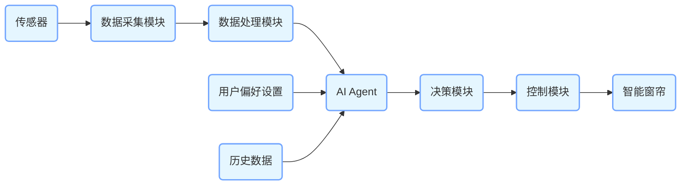

# 智能窗帘：AI Agent的室内光线优化

> 关键词：智能窗帘、AI Agent、室内光线优化、传感器、机器学习

> 摘要：本文围绕智能窗帘借助AI Agent实现室内光线优化这一主题展开。详细介绍了相关的背景知识，包括目的、预期读者等。深入阐述了核心概念，如AI Agent与智能窗帘的联系，并给出了原理和架构的示意图与流程图。对核心算法原理进行了讲解，结合Python代码说明具体操作步骤。运用数学模型和公式解释光线优化的计算过程，并举例说明。通过项目实战，展示了代码的实际案例和详细解读。探讨了智能窗帘在不同场景下的实际应用，推荐了学习资源、开发工具框架以及相关论文著作。最后总结了未来发展趋势与挑战，提供了常见问题的解答和扩展阅读的参考资料。

## 1. 背景介绍 
### 1.1 目的和范围
随着人们对生活品质要求的不断提高，智能家居成为了近年来的热门话题。智能窗帘作为智能家居的重要组成部分，能够根据室内外环境的变化自动调整窗帘的开合状态，实现室内光线的优化。本文章的目的在于深入探讨如何利用AI Agent技术实现智能窗帘对室内光线的有效优化。具体范围涵盖了从核心概念的介绍、算法原理的分析、数学模型的建立，到项目实战案例的展示以及实际应用场景的探讨等多个方面。

### 1.2 预期读者
本文的预期读者包括智能家居领域的开发者、研究人员，对AI技术在实际应用中感兴趣的技术爱好者，以及希望了解智能窗帘工作原理和室内光线优化方法的普通用户。对于开发者和研究人员，文章提供了详细的技术原理和代码实现，可作为技术参考和研究方向的指导；对于技术爱好者，文章能够帮助他们深入理解智能窗帘背后的技术逻辑；对于普通用户，文章可以让他们更好地了解智能窗帘的功能和优势，从而在选择智能家居产品时做出更合适的决策。

### 1.3 文档结构概述
本文按照以下结构进行组织：首先在背景介绍部分阐述了文章的目的、预期读者和文档结构概述，并对相关术语进行了定义和解释。接着详细介绍了核心概念，包括AI Agent与智能窗帘的联系，以及其原理和架构，并通过示意图和流程图进行直观展示。然后讲解了核心算法原理和具体操作步骤，结合Python代码进行详细说明。之后建立了数学模型和公式，对光线优化的计算过程进行了详细讲解，并举例说明。通过项目实战，展示了代码的实际案例和详细解读。再探讨了智能窗帘在不同场景下的实际应用。推荐了学习资源、开发工具框架以及相关论文著作。最后总结了未来发展趋势与挑战，提供了常见问题的解答和扩展阅读的参考资料。

### 1.4 术语表
#### 1.4.1 核心术语定义
- **智能窗帘**：一种能够通过电子设备控制开合的窗帘，可根据预设的条件或外界环境的变化自动调整状态。
- **AI Agent（人工智能代理）**：是一种能够感知环境、根据自身的目标和知识进行决策，并采取行动以实现目标的智能实体。在智能窗帘系统中，AI Agent负责收集环境信息，分析数据，并控制窗帘的开合。
- **室内光线优化**：根据用户的需求和室内环境的特点，通过调整智能窗帘的开合状态，使室内光线达到最佳的亮度、均匀度和舒适度。

#### 1.4.2 相关概念解释
- **传感器**：用于收集环境信息的设备，如光照传感器、温度传感器等。在智能窗帘系统中，传感器负责采集室内外的光线强度、温度等数据，为AI Agent的决策提供依据。
- **机器学习**：是一门多领域交叉学科，涉及概率论、统计学、逼近论、凸分析、算法复杂度理论等多门学科。它专门研究计算机怎样模拟或实现人类的学习行为，以获取新的知识或技能，重新组织已有的知识结构使之不断改善自身的性能。在智能窗帘系统中，机器学习算法可以根据历史数据学习用户的光线偏好，从而更准确地控制窗帘的开合。

#### 1.4.3 缩略词列表
- **AI**：Artificial Intelligence，人工智能
- **ML**：Machine Learning，机器学习

## 2. 核心概念与联系 

### 核心概念原理
智能窗帘借助AI Agent实现室内光线优化的核心原理在于通过传感器收集室内外的环境信息，如光线强度、时间、天气等，然后将这些信息传输给AI Agent。AI Agent根据预设的规则和机器学习算法对这些信息进行分析和处理，做出决策，控制智能窗帘的开合程度，以达到室内光线优化的目的。

### 架构示意图


### 架构说明
- **传感器**：负责收集室内外的环境信息，如光照传感器收集光线强度数据，时间传感器记录当前时间，天气传感器获取天气情况等。
- **数据采集模块**：将传感器收集到的数据进行整合和初步处理，以便后续分析。
- **数据处理模块**：对采集到的数据进行清洗、归一化等操作，提高数据的质量和可用性。
- **AI Agent**：是整个系统的核心，它接收处理后的数据，结合用户的偏好设置和历史数据，运用机器学习算法进行分析和决策。
- **决策模块**：根据AI Agent的分析结果，生成具体的控制指令。
- **控制模块**：将决策模块生成的控制指令转换为实际的操作信号，控制智能窗帘的开合。
- **用户偏好设置**：用户可以根据自己的需求设置不同的光线偏好，如阅读时需要较强的光线，休息时需要较暗的光线等。
- **历史数据**：记录系统过去的运行数据，包括不同时间、天气条件下的光线强度和窗帘开合状态等，为AI Agent的学习和决策提供参考。

## 3. 核心算法原理 & 具体操作步骤 

### 核心算法原理
在智能窗帘的室内光线优化系统中，我们可以使用机器学习中的线性回归算法来预测最佳的窗帘开合程度。线性回归是一种用于建立自变量和因变量之间线性关系的统计方法。在这个系统中，自变量可以是光线强度、时间、天气等因素，因变量是窗帘的开合程度。

### 线性回归算法的Python实现
```python
import numpy as np
from sklearn.linear_model import LinearRegression

# 示例数据
# 假设我们有三个自变量：光线强度、时间、天气（天气用0表示晴天，1表示阴天）
# 因变量是窗帘的开合程度（范围是0-100）
X = np.array([[100, 9, 0], [200, 12, 0], [50, 15, 1], [150, 18, 0]])
y = np.array([30, 50, 10, 40])

# 创建线性回归模型
model = LinearRegression()

# 训练模型
model.fit(X, y)

# 假设我们要预测新的光线强度为120，时间为13，天气为晴天（0）时的窗帘开合程度
new_data = np.array([[120, 13, 0]])
prediction = model.predict(new_data)

print("预测的窗帘开合程度为:", prediction[0])
```

### 具体操作步骤
1. **数据收集**：使用传感器收集室内外的环境信息，包括光线强度、时间、天气等，并将这些数据存储在数据库中。
2. **数据预处理**：对收集到的数据进行清洗、归一化等操作，去除噪声和异常值，使数据符合机器学习算法的要求。
3. **模型训练**：选择合适的机器学习算法（如线性回归），使用历史数据对模型进行训练。在训练过程中，调整模型的参数，使模型的预测结果尽可能接近真实值。
4. **实时预测**：在实际应用中，传感器实时收集环境信息，将这些信息输入到训练好的模型中，模型根据输入的数据预测最佳的窗帘开合程度。
5. **控制窗帘**：根据模型的预测结果，控制模块向智能窗帘发送控制指令，调整窗帘的开合程度，实现室内光线的优化。

## 4. 数学模型和公式 & 详细讲解 & 举例说明 

### 线性回归数学模型
线性回归的数学模型可以表示为：

$$y = \beta_0 + \beta_1x_1 + \beta_2x_2 + \cdots + \beta_nx_n + \epsilon$$

其中：
- $y$ 是因变量，在智能窗帘系统中表示窗帘的开合程度。
- $\beta_0$ 是截距，表示当所有自变量都为0时的因变量值。
- $\beta_1, \beta_2, \cdots, \beta_n$ 是回归系数，表示每个自变量对因变量的影响程度。
- $x_1, x_2, \cdots, x_n$ 是自变量，在智能窗帘系统中可以是光线强度、时间、天气等因素。
- $\epsilon$ 是误差项，表示模型无法解释的随机误差。

### 最小二乘法求解回归系数
在训练线性回归模型时，我们的目标是找到一组回归系数 $\beta_0, \beta_1, \cdots, \beta_n$，使得模型的预测值与真实值之间的误差平方和最小。这个过程可以使用最小二乘法来实现。

误差平方和的计算公式为：

$$S(\beta) = \sum_{i=1}^{m}(y_i - \hat{y}_i)^2 = \sum_{i=1}^{m}(y_i - (\beta_0 + \beta_1x_{i1} + \beta_2x_{i2} + \cdots + \beta_nx_{in}))^2$$

其中：
- $m$ 是样本数量。
- $y_i$ 是第 $i$ 个样本的真实值。
- $\hat{y}_i$ 是第 $i$ 个样本的预测值。

最小二乘法的目标是求解以下优化问题：

$$\min_{\beta} S(\beta)$$

通过对 $S(\beta)$ 求偏导数并令其等于0，可以得到回归系数的估计值。

### 举例说明
假设我们有以下数据：

| 光线强度 ($x_1$) | 时间 ($x_2$) | 天气 ($x_3$) | 窗帘开合程度 ($y$) |
| --- | --- | --- | --- |
| 100 | 9 | 0 | 30 |
| 200 | 12 | 0 | 50 |
| 50 | 15 | 1 | 10 |
| 150 | 18 | 0 | 40 |

我们可以使用Python的 `numpy` 库来手动计算回归系数：

```python
import numpy as np

# 构建自变量矩阵 X 和因变量向量 y
X = np.array([[1, 100, 9, 0], [1, 200, 12, 0], [1, 50, 15, 1], [1, 150, 18, 0]])
y = np.array([30, 50, 10, 40])

# 计算回归系数
beta = np.linalg.inv(X.T.dot(X)).dot(X.T).dot(y)

print("回归系数:", beta)
```

在这个例子中，我们首先在自变量矩阵 $X$ 的第一列添加了一列全为1的向量，用于表示截距 $\beta_0$。然后使用最小二乘法的公式计算回归系数。最后输出回归系数的值。

## 5. 项目实战：代码实际案例和详细解释说明 

### 5.1  开发环境搭建
#### 硬件环境
- **智能窗帘**：选择支持远程控制的智能窗帘产品，如小米智能窗帘、杜亚智能窗帘等。
- **传感器**：使用光照传感器、时间传感器、天气传感器等收集环境信息。可以选择开源的传感器模块，如Arduino的光照传感器模块。
- **控制设备**：使用树莓派作为控制设备，树莓派具有强大的计算能力和丰富的接口，可以方便地与传感器和智能窗帘进行连接。

#### 软件环境
- **操作系统**：在树莓派上安装Raspbian操作系统。
- **编程语言**：使用Python作为开发语言，Python具有丰富的库和工具，适合进行数据处理和机器学习。
- **机器学习库**：安装 `scikit-learn` 库，用于实现线性回归算法。
- **通信协议**：使用MQTT协议进行设备之间的通信，MQTT是一种轻量级的消息传输协议，适合物联网设备之间的通信。

### 5.2  源代码详细实现和代码解读
```python
import paho.mqtt.client as mqtt
import numpy as np
from sklearn.linear_model import LinearRegression

# MQTT配置
MQTT_BROKER = "localhost"
MQTT_PORT = 1883
MQTT_TOPIC_SENSOR = "sensor/data"
MQTT_TOPIC_CONTROL = "curtain/control"

# 历史数据
X_history = []
y_history = []

# 线性回归模型
model = LinearRegression()

# 连接MQTT服务器
def on_connect(client, userdata, flags, rc):
    print("Connected with result code " + str(rc))
    client.subscribe(MQTT_TOPIC_SENSOR)

# 处理传感器数据
def on_message(client, userdata, msg):
    global X_history, y_history, model
    data = msg.payload.decode().split(",")
    light_intensity = float(data[0])
    time = int(data[1])
    weather = int(data[2])

    # 模拟真实场景，这里简单假设窗帘开合程度与光线强度、时间、天气有关
    # 实际应用中需要根据真实数据进行训练
    curtain_openness = 30 + 0.1 * light_intensity + 0.2 * time - 10 * weather

    # 保存历史数据
    X_history.append([light_intensity, time, weather])
    y_history.append(curtain_openness)

    # 训练模型
    if len(X_history) >= 10:
        X = np.array(X_history)
        y = np.array(y_history)
        model.fit(X, y)

        # 预测最佳窗帘开合程度
        new_data = np.array([[light_intensity, time, weather]])
        prediction = model.predict(new_data)
        curtain_openness_pred = int(prediction[0])

        # 发送控制指令
        client.publish(MQTT_TOPIC_CONTROL, str(curtain_openness_pred))

# 创建MQTT客户端
client = mqtt.Client()
client.on_connect = on_connect
client.on_message = on_message

# 连接到MQTT服务器
client.connect(MQTT_BROKER, MQTT_PORT, 60)

# 开始循环处理网络流量
client.loop_forever()
```

### 代码解读
1. **MQTT配置**：设置MQTT服务器的地址、端口，以及订阅和发布的主题。
2. **历史数据**：使用 `X_history` 和 `y_history` 列表保存历史的自变量和因变量数据。
3. **线性回归模型**：创建一个线性回归模型 `model`。
4. **连接MQTT服务器**：定义 `on_connect` 函数，当连接到MQTT服务器时，订阅传感器数据主题。
5. **处理传感器数据**：定义 `on_message` 函数，当接收到传感器数据时，解析数据并模拟计算窗帘开合程度。将数据保存到历史数据列表中。当历史数据达到一定数量时，使用历史数据训练模型，并预测最佳的窗帘开合程度。最后将控制指令发布到MQTT主题上。
6. **创建MQTT客户端**：创建一个MQTT客户端，并设置连接和消息处理函数。
7. **连接到MQTT服务器**：连接到MQTT服务器，并开始循环处理网络流量。

### 5.3  代码解读与分析
#### 优点
- **模块化设计**：代码采用模块化设计，将MQTT通信、数据处理、模型训练和预测等功能分开实现，提高了代码的可维护性和可扩展性。
- **实时性**：通过MQTT协议实时接收传感器数据，并实时进行数据处理和模型预测，保证了系统的实时性。
- **机器学习应用**：使用线性回归算法对历史数据进行学习，能够根据环境变化自动调整窗帘的开合程度，实现室内光线的优化。

#### 缺点
- **数据准确性**：代码中模拟了窗帘开合程度的计算，实际应用中需要根据真实数据进行训练，以提高模型的准确性。
- **模型局限性**：线性回归模型只能处理自变量和因变量之间的线性关系，对于复杂的非线性关系可能无法准确预测。

## 6. 实际应用场景 
### 家庭环境
在家庭环境中，智能窗帘可以根据不同的时间和场景自动调整开合程度。例如，在早晨，窗帘可以自动打开，让阳光进入房间，唤醒主人；在中午阳光强烈时，窗帘可以自动关闭一部分，避免室内温度过高；在晚上，窗帘可以完全关闭，保证室内的私密性和安静。此外，用户还可以根据自己的喜好设置不同的场景模式，如阅读模式、休息模式等，智能窗帘会根据不同的模式自动调整光线。

### 办公环境
在办公环境中，智能窗帘可以根据室内的光线强度和员工的工作需求自动调整开合程度。例如，在会议室中，当进行投影演示时，窗帘可以自动关闭，避免光线干扰；在办公区域，当光线不足时，窗帘可以自动打开，提供充足的自然光线，提高员工的工作效率。

### 商业场所
在商业场所中，智能窗帘可以用于营造不同的氛围和展示效果。例如，在商场的橱窗展示中，智能窗帘可以根据不同的时间段和促销活动自动调整开合程度，吸引顾客的注意力；在酒店的餐厅和会议室中，智能窗帘可以根据不同的用餐和会议需求自动调整光线，提供舒适的环境。

## 7. 工具和资源推荐
### 7.1 学习资源推荐
#### 7.1.1 书籍推荐
- 《Python机器学习》：这本书详细介绍了Python在机器学习中的应用，包括线性回归、逻辑回归、决策树等多种算法的原理和实现。
- 《智能家居实战指南》：本书涵盖了智能家居的各个方面，包括智能窗帘的设计、开发和应用，适合初学者和有一定经验的开发者阅读。
- 《传感器技术与应用》：介绍了各种传感器的工作原理和应用场景，对于理解智能窗帘系统中的传感器部分非常有帮助。

#### 7.1.2 在线课程
- Coursera上的“机器学习”课程：由斯坦福大学的Andrew Ng教授授课，是机器学习领域的经典课程，讲解了机器学习的基本概念和算法。
- edX上的“智能家居技术”课程：系统介绍了智能家居的技术架构和应用开发，包括智能窗帘的相关内容。
- 中国大学MOOC上的“Python语言程序设计”课程：适合初学者学习Python编程语言，为后续的智能窗帘开发打下基础。

#### 7.1.3 技术博客和网站
- 博客园：有很多开发者分享的关于智能家居和机器学习的技术文章，可以从中获取最新的技术动态和实践经验。
- 开源中国：提供了大量的开源项目和技术资源，对于智能窗帘开发有一定的参考价值。
- Hackster.io：专注于物联网和智能家居领域，有很多优秀的项目案例和教程。

### 7.2 开发工具框架推荐
#### 7.2.1 IDE和编辑器
- PyCharm：是一款专业的Python集成开发环境，具有代码自动补全、调试、版本控制等功能，适合Python开发。
- Visual Studio Code：是一款轻量级的代码编辑器，支持多种编程语言和插件扩展，对于智能窗帘开发中的代码编写和调试非常方便。

#### 7.2.2 调试和性能分析工具
- Py-Spy：是一个用于Python代码性能分析的工具，可以帮助开发者找出代码中的性能瓶颈。
- MQTT.fx：是一个MQTT客户端工具，用于测试和调试MQTT通信协议，方便开发者验证智能窗帘系统中的设备通信。

#### 7.2.3 相关框架和库
- `scikit-learn`：是一个强大的Python机器学习库，提供了多种机器学习算法的实现，如线性回归、逻辑回归、决策树等。
- `paho-mqtt`：是一个Python的MQTT客户端库，用于实现MQTT通信协议，方便智能窗帘系统中的设备之间进行数据传输。
- `RPi.GPIO`：是树莓派的GPIO控制库，用于控制树莓派的GPIO引脚，实现与传感器和智能窗帘的硬件连接。

### 7.3 相关论文著作推荐
#### 7.3.1 经典论文
- 《A Survey on Machine Learning for Smart Home Automation》：该论文对智能家居自动化中的机器学习应用进行了全面的综述，包括智能窗帘的相关研究。
- 《Energy-Efficient Smart Curtain Control System Using Machine Learning Techniques》：提出了一种基于机器学习技术的智能窗帘节能控制系统，具有一定的参考价值。

#### 7.3.2 最新研究成果
- 在IEEE Xplore、ACM Digital Library等学术数据库中搜索“智能窗帘”、“室内光线优化”等关键词，可以找到最新的研究成果和技术进展。

#### 7.3.3 应用案例分析
- 《Smart Home Case Studies: Implementing Intelligent Curtain Systems》：通过实际案例分析了智能窗帘系统的设计、开发和应用，对于实际项目的实施有一定的指导意义。

## 8. 总结：未来发展趋势与挑战
### 未来发展趋势
- **智能化程度不断提高**：随着人工智能技术的不断发展，智能窗帘将具备更强的学习和适应能力，能够根据用户的习惯和环境变化自动调整窗帘的开合程度，实现更加智能化的室内光线优化。
- **与其他智能家居设备的集成**：智能窗帘将与其他智能家居设备，如智能灯光、智能空调等进行深度集成，实现整个家居环境的协同控制。例如，当智能窗帘关闭时，智能灯光可以自动调节亮度，提供舒适的照明效果。
- **个性化定制**：用户可以根据自己的喜好和需求对智能窗帘进行个性化定制，如设置不同的场景模式、颜色、图案等，满足不同用户的个性化需求。
- **节能环保**：智能窗帘可以根据室内外的光线强度和温度自动调整开合程度，减少人工干预，降低能源消耗，实现节能环保的目标。

### 挑战
- **数据安全和隐私问题**：智能窗帘系统需要收集大量的用户数据，如室内外环境信息、用户的使用习惯等。如何保证这些数据的安全和隐私，防止数据泄露和滥用，是一个亟待解决的问题。
- **技术标准和兼容性问题**：目前智能家居市场上的产品种类繁多，不同品牌和型号的智能窗帘设备可能采用不同的技术标准和通信协议，导致设备之间的兼容性较差。如何建立统一的技术标准和通信协议，实现不同设备之间的互联互通，是智能窗帘发展面临的一个挑战。
- **成本问题**：智能窗帘的研发、生产和安装成本相对较高，导致产品价格较贵，限制了其市场推广和普及。如何降低智能窗帘的成本，提高产品的性价比，是智能窗帘企业需要解决的一个问题。

## 9. 附录：常见问题与解答
### 智能窗帘的安装复杂吗？
智能窗帘的安装相对传统窗帘来说会复杂一些，需要进行电路布线和设备调试。一般建议由专业的安装人员进行安装，以确保安装质量和使用安全。

### 智能窗帘的使用寿命有多长？
智能窗帘的使用寿命主要取决于其电机和控制系统的质量。一般来说，优质的智能窗帘产品的使用寿命可以达到5-10年。

### 智能窗帘在停电时还能使用吗？
大部分智能窗帘在停电时可以手动操作，但无法实现自动控制功能。一些高端的智能窗帘产品配备了备用电源，可以在停电时继续使用一段时间。

### 智能窗帘的安全性如何？
智能窗帘在设计和生产过程中会考虑安全性问题，如设置过载保护、限位保护等功能，以防止电机损坏和窗帘过度开合。此外，智能窗帘的控制系统也会采用加密技术，保证数据传输的安全性。

### 智能窗帘可以与手机远程控制吗？
大多数智能窗帘产品支持与手机远程控制，用户可以通过手机APP随时随地控制窗帘的开合程度。一些智能窗帘还支持与语音助手（如小爱同学、天猫精灵等）进行连接，实现语音控制功能。

## 10. 扩展阅读 & 参考资料
### 扩展阅读
- 《智能家居：从概念到实践》：进一步深入探讨了智能家居的各个方面，包括智能窗帘的未来发展方向和应用案例。
- 《人工智能在物联网中的应用》：介绍了人工智能技术在物联网领域的应用，对于理解智能窗帘中AI Agent的工作原理有一定的帮助。

### 参考资料
- 智能窗帘产品说明书和技术文档。
- 相关的学术论文和研究报告，如IEEE Xplore、ACM Digital Library等数据库中的文献。
- 智能家居行业的相关标准和规范，如《智能家居系统通用技术要求》等。