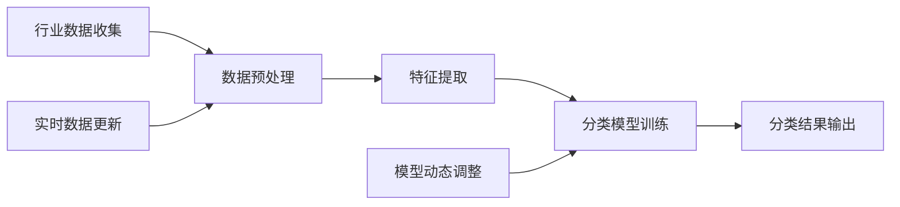

# 智能算法构建动态行业分类体系

> 关键词：智能算法、动态行业分类体系、机器学习、数据挖掘、行业数据、实时更新、分类模型

> 摘要：本文聚焦于利用智能算法构建动态行业分类体系。随着经济和科技的快速发展，行业形态不断演变，传统的静态行业分类体系已难以适应变化。通过智能算法，能够对海量的行业数据进行高效处理和分析，实现行业分类体系的动态更新。文章详细阐述了相关核心概念、算法原理、数学模型，结合项目实战给出具体代码实现和解读，探讨了实际应用场景，推荐了相关工具和资源，最后总结了未来发展趋势与挑战。

## 1. 背景介绍 
### 1.1 目的和范围
在当今数字化时代，行业的发展日新月异，新兴行业不断涌现，传统行业也在不断融合和变革。传统的行业分类体系往往是静态的，不能及时反映行业的最新变化，导致在市场分析、企业战略规划、政府政策制定等方面存在信息滞后的问题。本文章的目的是介绍如何运用智能算法构建动态行业分类体系，以实时、准确地对行业进行分类和更新。范围涵盖了从数据收集、处理到分类模型构建、动态更新的整个过程，以及相关技术的原理和实际应用。

### 1.2 预期读者
本文预期读者包括从事数据科学、机器学习、人工智能领域的研究人员和开发者，希望利用行业分类信息进行市场分析和战略规划的企业管理人员，以及关注行业动态和政策制定的政府部门工作人员。这些读者可以从本文中获取构建动态行业分类体系的技术思路和方法，以及相关的实践经验和资源。

### 1.3 文档结构概述
本文将按照以下结构进行组织：首先介绍相关的核心概念和它们之间的联系，包括行业分类体系和智能算法的基本原理和架构；接着详细讲解核心算法的原理和具体操作步骤，并给出Python源代码示例；然后介绍构建动态行业分类体系所涉及的数学模型和公式，并通过具体例子进行说明；之后通过项目实战展示代码的实际应用和详细解读；再探讨该体系的实际应用场景；推荐相关的学习资源、开发工具和论文著作；最后总结未来发展趋势与挑战，并提供常见问题的解答和扩展阅读及参考资料。

### 1.4 术语表
#### 1.4.1 核心术语定义
- **智能算法**：一类基于人工智能技术的算法，能够自动从数据中学习模式和规律，进行预测和决策。常见的智能算法包括机器学习算法（如决策树、神经网络等）和深度学习算法（如卷积神经网络、循环神经网络等）。
- **动态行业分类体系**：一种能够根据行业的实时变化自动更新分类标准和类别结构的行业分类系统。它可以及时反映新兴行业的出现和传统行业的演变。
- **行业数据**：与各个行业相关的各种数据，包括企业信息、产品信息、市场数据、技术数据等。这些数据可以用于行业分类和分析。
- **分类模型**：用于对行业进行分类的数学模型，通过对大量行业数据的学习和训练，能够根据输入的特征判断所属的行业类别。

#### 1.4.2 相关概念解释
- **数据挖掘**：从大量的、不完全的、有噪声的、模糊的、随机的数据中提取隐含在其中的、人们事先不知道的、但又是潜在有用的信息和知识的过程。在构建动态行业分类体系中，数据挖掘用于从行业数据中发现有价值的特征和模式。
- **机器学习**：一门多领域交叉学科，涉及概率论、统计学、逼近论、凸分析、算法复杂度理论等多门学科。它专门研究计算机怎样模拟或实现人类的学习行为，以获取新的知识或技能，重新组织已有的知识结构使之不断改善自身的性能。在行业分类中，机器学习算法用于训练分类模型。
- **实时更新**：指系统能够在数据发生变化时立即进行处理和更新，以保证信息的及时性和准确性。在动态行业分类体系中，实时更新意味着能够及时将新出现的行业或行业变化纳入分类体系。

#### 1.4.3 缩略词列表
- **AI**：Artificial Intelligence，人工智能
- **ML**：Machine Learning，机器学习
- **DL**：Deep Learning，深度学习
- **RNN**：Recurrent Neural Network，循环神经网络
- **CNN**：Convolutional Neural Network，卷积神经网络

## 2. 核心概念与联系 

### 核心概念原理
#### 行业分类体系
行业分类体系是对经济活动进行分类的一种方法，它将不同的经济活动按照一定的标准划分为不同的行业类别。传统的行业分类体系通常是基于产业结构、产品或服务的性质等因素进行划分的，例如国际标准产业分类（ISIC）、中国国民经济行业分类（GB/T 4754-2017）等。这些分类体系在一定时期内具有稳定性，但随着经济和科技的发展，它们可能无法及时反映新的行业形态和变化。

动态行业分类体系则是在传统分类体系的基础上，引入智能算法和实时数据，实现分类体系的动态更新。它通过对大量行业数据的分析和挖掘，发现新的行业特征和模式，从而对分类标准和类别结构进行调整。

#### 智能算法
智能算法是构建动态行业分类体系的核心技术。常用的智能算法包括机器学习算法和深度学习算法。机器学习算法通过对大量样本数据的学习，建立分类模型，对未知样本进行分类。常见的机器学习算法有决策树、支持向量机、朴素贝叶斯等。深度学习算法则是一类基于神经网络的机器学习算法，它能够自动从数据中学习复杂的特征和模式，在图像识别、自然语言处理等领域取得了巨大的成功。在行业分类中，深度学习算法可以处理高维、复杂的行业数据，提高分类的准确性和效率。

### 架构的文本示意图
```plaintext
行业数据收集 --> 数据预处理 --> 特征提取 --> 分类模型训练 --> 分类结果输出
                             |                      |
                             |                      |
                             v                      v
                      实时数据更新            模型动态调整
```
这个示意图展示了构建动态行业分类体系的基本架构。首先，收集各种行业数据，然后对数据进行预处理，包括清洗、转换等操作。接着，从预处理后的数据中提取特征，用于训练分类模型。训练好的模型对未知数据进行分类，输出分类结果。同时，实时数据的更新会触发模型的动态调整，以保证分类体系的实时性和准确性。

### Mermaid 流程图


## 3. 核心算法原理 & 具体操作步骤 

### 核心算法原理
在构建动态行业分类体系中，我们可以使用支持向量机（SVM）作为分类算法。支持向量机是一种二分类模型，它的基本思想是在特征空间中找到一个最优的超平面，使得不同类别的样本能够被最大程度地分开。对于多分类问题，可以通过一对一或一对多的策略将其转化为多个二分类问题。

### 具体操作步骤
#### 1. 数据收集
收集与各个行业相关的数据，包括企业的经营范围、产品信息、财务数据等。这些数据可以从政府部门、行业协会、企业年报等渠道获取。

#### 2. 数据预处理
对收集到的数据进行清洗和转换，去除噪声数据和缺失值，将文本数据转换为数值特征。例如，可以使用词袋模型（Bag of Words）将文本数据转换为向量表示。

#### 3. 特征提取
从预处理后的数据中提取有代表性的特征，例如企业的规模、盈利能力、技术创新能力等。可以使用主成分分析（PCA）等方法对特征进行降维，减少特征的维度，提高模型的训练效率。

#### 4. 模型训练
使用支持向量机算法对提取的特征进行训练，得到分类模型。在训练过程中，需要选择合适的核函数和参数，以提高模型的性能。

#### 5. 模型评估
使用测试数据集对训练好的模型进行评估，计算模型的准确率、召回率、F1值等指标，评估模型的性能。

#### 6. 模型更新
随着新数据的不断出现，需要对模型进行实时更新，以保证分类体系的动态性。可以使用增量学习的方法，在不重新训练整个模型的情况下，对模型进行更新。

### Python源代码示例
```python
import numpy as np
from sklearn import svm
from sklearn.model_selection import train_test_split
from sklearn.preprocessing import StandardScaler
from sklearn.metrics import accuracy_score

# 生成示例数据
X = np.random.rand(100, 10)  # 特征数据
y = np.random.randint(0, 2, 100)  # 标签数据

# 划分训练集和测试集
X_train, X_test, y_train, y_test = train_test_split(X, y, test_size=0.2, random_state=42)

# 数据标准化
scaler = StandardScaler()
X_train = scaler.fit_transform(X_train)
X_test = scaler.transform(X_test)

# 创建支持向量机模型
clf = svm.SVC(kernel='linear')

# 模型训练
clf.fit(X_train, y_train)

# 模型预测
y_pred = clf.predict(X_test)

# 模型评估
accuracy = accuracy_score(y_test, y_pred)
print(f"模型准确率: {accuracy}")
```

## 4. 数学模型和公式 & 详细讲解 & 举例说明 

### 支持向量机的数学模型
支持向量机的目标是在特征空间中找到一个最优的超平面，使得不同类别的样本能够被最大程度地分开。对于二分类问题，假设训练数据集为 $\{(x_1, y_1), (x_2, y_2), \cdots, (x_n, y_n)\}$，其中 $x_i \in \mathbb{R}^d$ 是特征向量，$y_i \in \{-1, 1\}$ 是标签。超平面的方程可以表示为 $w^T x + b = 0$，其中 $w \in \mathbb{R}^d$ 是法向量，$b \in \mathbb{R}$ 是截距。

支持向量机的优化目标是最大化间隔，即最大化 $\frac{2}{\|w\|}$，同时满足约束条件 $y_i(w^T x_i + b) \geq 1$，$i = 1, 2, \cdots, n$。这个优化问题可以转化为以下的对偶问题：

$$
\begin{aligned}
\max_{\alpha} &\sum_{i=1}^{n} \alpha_i - \frac{1}{2} \sum_{i=1}^{n} \sum_{j=1}^{n} \alpha_i \alpha_j y_i y_j x_i^T x_j \\
\text{s.t.} &\sum_{i=1}^{n} \alpha_i y_i = 0 \\
&0 \leq \alpha_i \leq C, i = 1, 2, \cdots, n
\end{aligned}
$$

其中 $\alpha_i$ 是拉格朗日乘子，$C$ 是惩罚参数，用于控制分类误差和间隔大小之间的平衡。

### 详细讲解
支持向量机的核心思想是通过寻找最优的超平面来实现分类。在特征空间中，不同类别的样本可以被超平面分开，而支持向量机的目标是找到一个使得间隔最大的超平面。间隔是指超平面到最近样本点的距离，最大化间隔可以提高模型的泛化能力。

对偶问题的求解可以通过二次规划算法来实现。求解对偶问题得到拉格朗日乘子 $\alpha_i$ 后，可以计算出法向量 $w$ 和截距 $b$，从而得到超平面的方程。

### 举例说明
假设我们有一个二维特征空间，有两类样本点，分别用红色和蓝色表示。我们希望找到一个超平面将这两类样本点分开。支持向量机通过最大化间隔，找到一个最优的超平面，使得这个超平面到最近样本点的距离最大。这些最近的样本点就是支持向量，它们决定了超平面的位置和方向。

在实际应用中，支持向量机可以处理线性可分和线性不可分的问题。对于线性不可分的问题，可以通过引入核函数将特征空间映射到更高维的空间，使得样本在高维空间中变得线性可分。常见的核函数有线性核、多项式核、高斯核等。

## 5. 项目实战：代码实际案例和详细解释说明 

### 5.1  开发环境搭建
#### 安装Python
首先，需要安装Python 3.x版本。可以从Python官方网站（https://www.python.org/downloads/）下载适合自己操作系统的安装包，按照安装向导进行安装。

#### 安装必要的库
使用以下命令安装必要的Python库：
```bash
pip install numpy pandas scikit-learn
```
- `numpy`：用于数值计算和数组操作。
- `pandas`：用于数据处理和分析。
- `scikit-learn`：提供了丰富的机器学习算法和工具。

### 5.2  源代码详细实现和代码解读
```python
import pandas as pd
from sklearn import svm
from sklearn.model_selection import train_test_split
from sklearn.preprocessing import StandardScaler
from sklearn.metrics import accuracy_score

# 读取数据
data = pd.read_csv('industry_data.csv')

# 分离特征和标签
X = data.drop('label', axis=1)
y = data['label']

# 划分训练集和测试集
X_train, X_test, y_train, y_test = train_test_split(X, y, test_size=0.2, random_state=42)

# 数据标准化
scaler = StandardScaler()
X_train = scaler.fit_transform(X_train)
X_test = scaler.transform(X_test)

# 创建支持向量机模型
clf = svm.SVC(kernel='linear')

# 模型训练
clf.fit(X_train, y_train)

# 模型预测
y_pred = clf.predict(X_test)

# 模型评估
accuracy = accuracy_score(y_test, y_pred)
print(f"模型准确率: {accuracy}")
```

### 代码解读与分析
#### 数据读取
```python
data = pd.read_csv('industry_data.csv')
```
使用 `pandas` 库的 `read_csv` 函数读取存储行业数据的CSV文件。

#### 特征和标签分离
```python
X = data.drop('label', axis=1)
y = data['label']
```
将数据集中的特征和标签分离，`X` 表示特征矩阵，`y` 表示标签向量。

#### 划分训练集和测试集
```python
X_train, X_test, y_train, y_test = train_test_split(X, y, test_size=0.2, random_state=42)
```
使用 `sklearn` 库的 `train_test_split` 函数将数据集划分为训练集和测试集，其中测试集占总数据的20%。

#### 数据标准化
```python
scaler = StandardScaler()
X_train = scaler.fit_transform(X_train)
X_test = scaler.transform(X_test)
```
使用 `StandardScaler` 对特征数据进行标准化处理，使得特征数据具有零均值和单位方差，提高模型的训练效果。

#### 模型创建和训练
```python
clf = svm.SVC(kernel='linear')
clf.fit(X_train, y_train)
```
创建一个线性核的支持向量机模型，并使用训练集数据对模型进行训练。

#### 模型预测和评估
```python
y_pred = clf.predict(X_test)
accuracy = accuracy_score(y_test, y_pred)
print(f"模型准确率: {accuracy}")
```
使用训练好的模型对测试集数据进行预测，并计算模型的准确率。

## 6. 实际应用场景 
### 市场分析
动态行业分类体系可以帮助市场分析人员更准确地了解市场结构和行业趋势。通过实时更新行业分类信息，可以及时发现新兴行业的发展动态和传统行业的变化趋势，为企业的市场定位和战略规划提供有力支持。例如，在科技行业，新的技术和应用不断涌现，动态行业分类体系可以帮助企业及时了解这些变化，调整产品策略和市场布局。

### 企业战略规划
企业可以利用动态行业分类体系对自身所处的行业进行准确评估，了解竞争对手的情况和行业的发展前景。同时，通过对新兴行业的关注，企业可以提前布局，寻找新的业务增长点。例如，一家传统制造业企业可以通过动态行业分类体系发现智能制造等新兴行业的机会，进行转型升级。

### 政府政策制定
政府部门可以根据动态行业分类体系了解不同行业的发展状况和需求，制定更加精准的产业政策。例如，对于新兴行业，可以出台扶持政策，促进其发展；对于传统行业，可以引导其进行技术改造和升级。此外，动态行业分类体系还可以帮助政府部门监测行业的发展动态，及时发现潜在的风险和问题。

### 投资决策
投资者可以利用动态行业分类体系对不同行业的投资价值进行评估，选择具有潜力的行业和企业进行投资。通过实时了解行业的变化，投资者可以及时调整投资组合，降低投资风险。例如，在新兴科技行业快速发展的时期，投资者可以加大对相关行业的投资，获取更高的回报。

## 7. 工具和资源推荐
### 7.1 学习资源推荐
#### 7.1.1 书籍推荐
- 《机器学习》（周志华著）：这本书全面介绍了机器学习的基本概念、算法和应用，是机器学习领域的经典教材。
- 《深度学习》（Ian Goodfellow、Yoshua Bengio和Aaron Courville著）：该书系统地介绍了深度学习的理论和实践，适合想要深入学习深度学习的读者。
- 《Python数据分析实战》（李金洪著）：本书结合实际案例，介绍了使用Python进行数据分析的方法和技巧，对于处理行业数据非常有帮助。

#### 7.1.2 在线课程
- Coursera上的“机器学习”课程（由Andrew Ng教授授课）：该课程是机器学习领域的经典在线课程，涵盖了机器学习的基本算法和应用。
- edX上的“深度学习基础”课程：由深度学习领域的专家授课，系统地介绍了深度学习的理论和实践。
- 中国大学MOOC上的“Python语言程序设计”课程：适合初学者学习Python编程语言，为后续的数据分析和机器学习打下基础。

#### 7.1.3 技术博客和网站
- 博客园（https://www.cnblogs.com/）：提供了大量的技术文章和经验分享，涵盖了机器学习、数据挖掘等领域。
- 开源中国（https://www.oschina.net/）：是国内知名的开源技术社区，提供了丰富的开源项目和技术资源。
- Kaggle（https://www.kaggle.com/）：是一个数据科学竞赛平台，上面有很多优秀的数据集和数据分析案例，可以学习到很多实用的技巧和方法。

### 7.2 开发工具框架推荐
#### 7.2.1 IDE和编辑器
- PyCharm：是一款专门为Python开发设计的集成开发环境，具有代码编辑、调试、版本控制等功能，非常适合Python项目的开发。
- Jupyter Notebook：是一个交互式的笔记本环境，可以方便地进行代码编写、数据可视化和结果展示，常用于数据分析和机器学习的实验和研究。
- Visual Studio Code：是一款轻量级的代码编辑器，支持多种编程语言和插件，具有丰富的扩展功能，可以满足不同的开发需求。

#### 7.2.2 调试和性能分析工具
- PDB：是Python自带的调试器，可以帮助开发者定位代码中的问题和错误。
- cProfile：是Python的性能分析工具，可以分析代码的运行时间和函数调用情况，帮助开发者优化代码性能。
- TensorBoard：是TensorFlow提供的可视化工具，可以用于可视化模型的训练过程和性能指标，帮助开发者理解模型的行为和优化模型。

#### 7.2.3 相关框架和库
- Scikit-learn：是一个简单易用的机器学习库，提供了丰富的机器学习算法和工具，适合初学者和快速开发。
- TensorFlow：是一个开源的深度学习框架，由Google开发，具有强大的计算能力和灵活性，广泛应用于深度学习领域。
- PyTorch：是另一个流行的深度学习框架，具有简洁的API和动态计算图的特点，受到了很多研究者和开发者的喜爱。

### 7.3 相关论文著作推荐
#### 7.3.1 经典论文
- “Support-Vector Networks”（Cortes和Vapnik著）：这篇论文是支持向量机领域的经典论文，详细介绍了支持向量机的基本原理和算法。
- “Gradient-Based Learning Applied to Document Recognition”（LeCun等人著）：该论文提出了卷积神经网络（CNN）的基本思想和算法，是深度学习领域的奠基之作。
- “Long Short-Term Memory”（Hochreiter和Schmidhuber著）：这篇论文提出了长短期记忆网络（LSTM），解决了传统循环神经网络（RNN）的梯度消失问题，在自然语言处理等领域取得了广泛应用。

#### 7.3.2 最新研究成果
- 在各大学术数据库（如IEEE Xplore、ACM Digital Library、ScienceDirect等）上搜索关于动态行业分类体系、智能算法应用等方面的最新研究论文。这些论文通常反映了该领域的最新研究动态和技术发展趋势。

#### 7.3.3 应用案例分析
- 一些行业报告和研究机构的出版物会提供动态行业分类体系在实际应用中的案例分析。例如，麦肯锡、波士顿咨询集团等咨询公司的报告，以及一些行业协会发布的研究报告，可以帮助读者了解如何将相关技术应用到实际场景中。

## 8. 总结：未来发展趋势与挑战
### 未来发展趋势
#### 智能化程度不断提高
随着人工智能技术的不断发展，智能算法将更加智能化和自动化。未来的动态行业分类体系将能够自动从海量数据中提取有价值的信息，实时更新分类体系，并且能够自动调整分类标准和模型参数，以适应不断变化的行业环境。

#### 与其他技术的融合
动态行业分类体系将与大数据、云计算、物联网等技术深度融合。通过大数据技术可以获取更全面、更准确的行业数据；云计算技术可以提供强大的计算能力，支持大规模数据的处理和分析；物联网技术可以实时收集行业的生产、销售等数据，为分类体系的实时更新提供支持。

#### 跨行业应用拓展
动态行业分类体系将不仅仅应用于传统的经济领域，还将拓展到医疗、教育、文化等其他领域。例如，在医疗领域，可以对不同的医疗服务和技术进行分类，帮助医疗机构进行管理和决策；在教育领域，可以对不同的教育模式和课程进行分类，促进教育资源的优化配置。

### 挑战
#### 数据质量和安全性
构建动态行业分类体系需要大量的高质量数据，但实际中数据可能存在噪声、缺失值等问题，影响分类的准确性。此外，行业数据通常包含敏感信息，如企业的商业机密和个人隐私，数据的安全性和隐私保护也是一个重要的挑战。

#### 算法的可解释性
一些智能算法（如深度学习算法）具有很强的预测能力，但它们的决策过程往往是黑箱模型，难以解释。在实际应用中，用户需要了解算法的决策依据，以便做出合理的决策。因此，提高算法的可解释性是一个亟待解决的问题。

#### 行业变化的快速性
行业的变化速度越来越快，新兴行业不断涌现，传统行业也在不断变革。动态行业分类体系需要能够及时跟上行业的变化，实时更新分类标准和模型，但这对系统的实时性和适应性提出了很高的要求。

## 9. 附录：常见问题与解答
### 问题1：如何选择合适的智能算法构建动态行业分类体系？
解答：选择合适的智能算法需要考虑多个因素，如数据的特点、分类的复杂度、模型的可解释性等。如果数据是线性可分的，支持向量机、逻辑回归等线性算法可能是一个不错的选择；如果数据具有复杂的非线性关系，深度学习算法（如神经网络）可能更适合。此外，还可以通过交叉验证等方法比较不同算法的性能，选择最优的算法。

### 问题2：如何保证动态行业分类体系的实时性？
解答：保证动态行业分类体系的实时性需要从数据收集、处理和模型更新等方面入手。在数据收集方面，需要建立实时的数据采集系统，及时获取行业的最新数据；在数据处理方面，需要采用高效的数据处理算法，快速对新数据进行处理和分析；在模型更新方面，可以采用增量学习的方法，在不重新训练整个模型的情况下，对模型进行实时更新。

### 问题3：动态行业分类体系的准确性如何评估？
解答：可以使用多种指标来评估动态行业分类体系的准确性，如准确率、召回率、F1值等。准确率是指分类正确的样本数占总样本数的比例；召回率是指分类正确的正样本数占实际正样本数的比例；F1值是准确率和召回率的调和平均数。此外，还可以通过交叉验证等方法对模型的性能进行评估，以提高评估的可靠性。

## 10. 扩展阅读 & 参考资料
### 扩展阅读
- 《人工智能时代的行业变革与创新》：这本书探讨了人工智能技术对各个行业的影响和变革，以及如何在人工智能时代进行行业创新。
- 《大数据与行业分析》：介绍了如何利用大数据技术进行行业分析和决策，对于理解行业数据的价值和应用有很大的帮助。

### 参考资料
- 国际标准产业分类（ISIC）：https://unstats.un.org/unsd/classifications/Econ/ISIC
- 中国国民经济行业分类（GB/T 4754-2017）：http://www.stats.gov.cn/tjsj/tjbz/hyflbz/
- Scikit-learn官方文档：https://scikit-learn.org/stable/
- TensorFlow官方文档：https://www.tensorflow.org/
- PyTorch官方文档：https://pytorch.org/