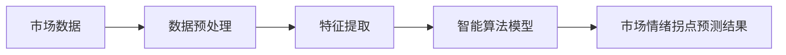

# 智能算法识别市场情绪拐点

> 关键词：智能算法、市场情绪拐点、情绪分析、机器学习、金融市场

> 摘要：本文聚焦于利用智能算法识别市场情绪拐点这一重要课题。首先介绍了研究的背景、目的和范围，明确了预期读者和文档结构。接着阐述了市场情绪、智能算法等核心概念及其联系，给出了原理和架构的文本示意图与 Mermaid 流程图。详细讲解了核心算法原理，包括使用 Python 代码进行阐述，并对相关数学模型和公式进行了说明。通过项目实战，展示了代码实际案例并进行详细解释。分析了智能算法识别市场情绪拐点在金融投资、风险管理等方面的实际应用场景。推荐了学习资源、开发工具框架以及相关论文著作。最后总结了未来发展趋势与挑战，解答了常见问题并提供了扩展阅读和参考资料，旨在为相关领域的研究和实践提供全面且深入的指导。

## 1. 背景介绍 
### 1.1 目的和范围
在金融市场中，市场情绪对于资产价格的波动有着至关重要的影响。市场情绪的变化往往会引发价格的大幅变动，而准确识别市场情绪的拐点，能够帮助投资者把握投资机会，降低风险；对于金融机构而言，有助于优化风险管理策略，提高资产配置的效率。本研究的目的就是探索如何利用智能算法准确识别市场情绪的拐点。

研究范围涵盖了多种金融市场，如股票市场、债券市场、期货市场等。同时，考虑了不同类型的智能算法，包括机器学习算法（如支持向量机、决策树等）和深度学习算法（如循环神经网络、长短时记忆网络等）在市场情绪拐点识别中的应用。

### 1.2 预期读者
本文的预期读者包括金融市场的投资者、金融分析师、金融科技从业者、机器学习和人工智能领域的研究人员以及相关专业的学生。对于投资者来说，了解如何利用智能算法识别市场情绪拐点可以帮助他们做出更明智的投资决策；金融分析师可以将其作为一种新的分析工具，提高分析的准确性和效率；金融科技从业者可以借鉴相关技术，开发更智能的金融产品和服务；研究人员可以在本文的基础上开展更深入的研究；学生则可以通过阅读本文，了解智能算法在金融领域的应用，拓宽知识面。

### 1.3 文档结构概述
本文将按照以下结构进行组织：首先介绍核心概念与联系，包括市场情绪、智能算法等概念的定义和它们之间的关系，并给出相应的文本示意图和 Mermaid 流程图；接着详细讲解核心算法原理，通过 Python 代码进行具体操作步骤的阐述；然后介绍相关的数学模型和公式，并举例说明；之后通过项目实战展示代码实际案例并进行详细解释；分析智能算法识别市场情绪拐点的实际应用场景；推荐学习资源、开发工具框架以及相关论文著作；最后总结未来发展趋势与挑战，解答常见问题并提供扩展阅读和参考资料。

### 1.4 术语表
#### 1.4.1 核心术语定义
- **市场情绪**：指投资者对金融市场的整体看法和预期，通常反映在投资者的交易行为和市场价格波动中。市场情绪可以分为乐观、悲观和中性三种状态。
- **市场情绪拐点**：市场情绪从一种状态转变为另一种状态的时刻，例如从乐观情绪转变为悲观情绪，或者从悲观情绪转变为乐观情绪。
- **智能算法**：利用计算机技术和数学模型，模拟人类智能的算法，包括机器学习算法和深度学习算法等。
- **机器学习**：一门多领域交叉学科，涉及概率论、统计学、逼近论、凸分析、算法复杂度理论等多门学科。它专门研究计算机怎样模拟或实现人类的学习行为，以获取新的知识或技能，重新组织已有的知识结构使之不断改善自身的性能。
- **深度学习**：机器学习的一个分支领域，它是一种基于对数据进行表征学习的方法。深度学习通过构建具有很多层的神经网络模型，自动从大量数据中学习特征和模式。

#### 1.4.2 相关概念解释
- **情绪指标**：用于衡量市场情绪的量化指标，常见的情绪指标包括投资者信心指数、恐慌指数（VIX）等。
- **特征工程**：将原始数据转换为更适合模型训练的特征的过程，包括数据清洗、特征选择、特征提取等步骤。
- **模型评估**：使用各种评估指标（如准确率、召回率、F1 值等）来评估模型的性能，以确定模型的有效性和可靠性。

#### 1.4.3 缩略词列表
- **SVM**：支持向量机（Support Vector Machine）
- **RNN**：循环神经网络（Recurrent Neural Network）
- **LSTM**：长短时记忆网络（Long Short-Term Memory）
- **VIX**：恐慌指数（Volatility Index）

## 2. 核心概念与联系 

### 核心概念原理

#### 市场情绪
市场情绪是投资者对市场的主观感受和预期，它受到多种因素的影响，如宏观经济数据、政策变化、公司业绩等。市场情绪的变化会导致投资者的交易行为发生改变，从而影响市场价格的波动。例如，当市场情绪乐观时，投资者更愿意买入股票，推动股价上涨；当市场情绪悲观时，投资者更倾向于卖出股票，导致股价下跌。

#### 智能算法
智能算法可以分为机器学习算法和深度学习算法。机器学习算法通过对历史数据的学习，建立模型来预测未来的市场情绪拐点。常见的机器学习算法包括支持向量机（SVM）、决策树、随机森林等。深度学习算法则通过构建神经网络模型，自动从大量数据中学习特征和模式，从而实现对市场情绪拐点的识别。常见的深度学习算法包括循环神经网络（RNN）、长短时记忆网络（LSTM）等。

### 架构的文本示意图
```plaintext
市场数据（包括价格、成交量等） -> 数据预处理（清洗、归一化等） -> 特征提取（提取情绪指标等特征） -> 智能算法模型（机器学习或深度学习模型） -> 市场情绪拐点预测结果
```

### Mermaid 流程图


## 3. 核心算法原理 & 具体操作步骤 

### 支持向量机（SVM）算法原理
支持向量机是一种有监督的机器学习算法，其基本思想是在特征空间中找到一个最优的超平面，使得不同类别的样本能够被最大程度地分开。对于线性可分的情况，支持向量机通过求解一个二次规划问题来找到最优超平面；对于线性不可分的情况，支持向量机通过引入核函数将样本映射到高维空间，使得样本在高维空间中线性可分。

### Python 代码实现
```python
import numpy as np
from sklearn import svm
from sklearn.model_selection import train_test_split
from sklearn.metrics import accuracy_score

# 生成示例数据
X = np.array([[1, 2], [2, 3], [3, 4], [4, 5], [5, 6], [6, 7], [7, 8], [8, 9], [9, 10], [10, 11]])
y = np.array([0, 0, 0, 0, 0, 1, 1, 1, 1, 1])

# 划分训练集和测试集
X_train, X_test, y_train, y_test = train_test_split(X, y, test_size=0.2, random_state=42)

# 创建 SVM 模型
clf = svm.SVC(kernel='linear')

# 训练模型
clf.fit(X_train, y_train)

# 预测
y_pred = clf.predict(X_test)

# 评估模型
accuracy = accuracy_score(y_test, y_pred)
print(f"Accuracy: {accuracy}")
```

### 具体操作步骤
1. **数据准备**：收集市场数据，包括价格、成交量等，并进行数据预处理，如清洗、归一化等。
2. **特征提取**：从预处理后的数据中提取情绪指标等特征。
3. **模型选择**：根据数据的特点和问题的复杂度，选择合适的智能算法模型，如 SVM、RNN 等。
4. **模型训练**：将提取的特征和对应的市场情绪标签作为输入，对模型进行训练。
5. **模型评估**：使用测试数据对训练好的模型进行评估，计算评估指标，如准确率、召回率等。
6. **模型优化**：根据评估结果，对模型进行优化，如调整模型参数、更换特征等。
7. **预测**：使用优化后的模型对未来的市场情绪拐点进行预测。

## 4. 数学模型和公式 & 详细讲解 & 举例说明 

### 支持向量机的数学模型和公式
#### 线性可分情况
对于线性可分的数据集 $D = \{(x_1, y_1), (x_2, y_2), \cdots, (x_n, y_n)\}$，其中 $x_i \in \mathbb{R}^d$ 是样本特征向量，$y_i \in \{-1, +1\}$ 是样本标签。支持向量机的目标是找到一个最优的超平面 $w^T x + b = 0$，使得不同类别的样本能够被最大程度地分开。

这个问题可以转化为求解以下二次规划问题：
$$
\begin{aligned}
\min_{w, b} &\quad \frac{1}{2} \|w\|^2 \\
\text{s.t.} &\quad y_i (w^T x_i + b) \geq 1, \quad i = 1, 2, \cdots, n
\end{aligned}
$$
其中，$w$ 是超平面的法向量，$b$ 是偏置项。

#### 线性不可分情况
对于线性不可分的情况，支持向量机引入松弛变量 $\xi_i \geq 0$，允许部分样本点违反约束条件。此时，问题转化为：
$$
\begin{aligned}
\min_{w, b, \xi} &\quad \frac{1}{2} \|w\|^2 + C \sum_{i=1}^{n} \xi_i \\
\text{s.t.} &\quad y_i (w^T x_i + b) \geq 1 - \xi_i, \quad i = 1, 2, \cdots, n \\
&\quad \xi_i \geq 0, \quad i = 1, 2, \cdots, n
\end{aligned}
$$
其中，$C$ 是惩罚参数，用于控制对误分类样本的惩罚程度。

### 举例说明
假设我们有一个二维数据集，包含两个类别的样本，我们可以使用支持向量机来找到一个最优的超平面将这两个类别分开。以下是一个简单的 Python 代码示例：
```python
import numpy as np
import matplotlib.pyplot as plt
from sklearn import svm

# 生成示例数据
X = np.array([[3, 4], [1, 2], [2, 3], [4, 5], [5, 6], [6, 7], [7, 8], [8, 9], [9, 10], [10, 11]])
y = np.array([-1, -1, -1, -1, -1, 1, 1, 1, 1, 1])

# 创建 SVM 模型
clf = svm.SVC(kernel='linear')

# 训练模型
clf.fit(X, y)

# 绘制数据点
plt.scatter(X[:, 0], X[:, 1], c=y, cmap=plt.cm.Paired)

# 绘制超平面
ax = plt.gca()
xlim = ax.get_xlim()
ylim = ax.get_ylim()

# 创建网格点
xx = np.linspace(xlim[0], xlim[1], 30)
yy = np.linspace(ylim[0], ylim[1], 30)
YY, XX = np.meshgrid(yy, xx)
xy = np.vstack([XX.ravel(), YY.ravel()]).T
Z = clf.decision_function(xy).reshape(XX.shape)

# 绘制决策边界和间隔边界
ax.contour(XX, YY, Z, colors='k', levels=[-1, 0, 1], alpha=0.5, linestyles=['--', '-', '--'])

# 绘制支持向量
ax.scatter(clf.support_vectors_[:, 0], clf.support_vectors_[:, 1], s=100, linewidth=1, facecolors='none', edgecolors='k')

plt.show()
```
在这个例子中，我们使用支持向量机找到了一个最优的超平面将两个类别的样本分开，并绘制了决策边界和间隔边界，以及支持向量。

## 5. 项目实战：代码实际案例和详细解释说明 

### 5.1  开发环境搭建
#### 安装 Python
首先，需要安装 Python 环境。可以从 Python 官方网站（https://www.python.org/downloads/）下载适合自己操作系统的 Python 版本，并按照安装向导进行安装。

#### 安装必要的库
使用以下命令安装必要的 Python 库：
```sh
pip install numpy pandas scikit-learn tensorflow matplotlib
```
其中，`numpy` 用于数值计算，`pandas` 用于数据处理，`scikit-learn` 提供了各种机器学习算法和工具，`tensorflow` 用于深度学习，`matplotlib` 用于数据可视化。

### 5.2  源代码详细实现和代码解读
以下是一个使用 LSTM 网络识别市场情绪拐点的代码示例：
```python
import numpy as np
import pandas as pd
from sklearn.preprocessing import MinMaxScaler
from tensorflow.keras.models import Sequential
from tensorflow.keras.layers import LSTM, Dense
import matplotlib.pyplot as plt

# 读取数据
data = pd.read_csv('market_data.csv')

# 提取特征和标签
features = data[['price', 'volume']].values
labels = data['sentiment'].values

# 数据归一化
scaler = MinMaxScaler()
features = scaler.fit_transform(features)

# 划分训练集和测试集
train_size = int(len(features) * 0.8)
X_train, X_test = features[:train_size], features[train_size:]
y_train, y_test = labels[:train_size], labels[train_size:]

# 调整数据形状以适应 LSTM 输入
X_train = np.reshape(X_train, (X_train.shape[0], X_train.shape[1], 1))
X_test = np.reshape(X_test, (X_test.shape[0], X_test.shape[1], 1))

# 创建 LSTM 模型
model = Sequential()
model.add(LSTM(50, input_shape=(X_train.shape[1], 1)))
model.add(Dense(1, activation='sigmoid'))

# 编译模型
model.compile(optimizer='adam', loss='binary_crossentropy', metrics=['accuracy'])

# 训练模型
history = model.fit(X_train, y_train, epochs=50, batch_size=32, validation_data=(X_test, y_test))

# 预测
y_pred = model.predict(X_test)
y_pred = (y_pred > 0.5).astype(int)

# 绘制训练和验证损失曲线
plt.plot(history.history['loss'], label='Training Loss')
plt.plot(history.history['val_loss'], label='Validation Loss')
plt.legend()
plt.show()

# 绘制训练和验证准确率曲线
plt.plot(history.history['accuracy'], label='Training Accuracy')
plt.plot(history.history['val_accuracy'], label='Validation Accuracy')
plt.legend()
plt.show()
```

### 代码解读与分析
1. **数据读取**：使用 `pandas` 库读取市场数据文件 `market_data.csv`。
2. **特征提取和标签提取**：从数据中提取特征（如价格、成交量）和标签（市场情绪）。
3. **数据归一化**：使用 `MinMaxScaler` 对特征数据进行归一化处理，将数据缩放到 [0, 1] 范围内。
4. **划分训练集和测试集**：将数据按照 80:20 的比例划分为训练集和测试集。
5. **数据形状调整**：将训练集和测试集的特征数据调整为适合 LSTM 网络输入的形状，即 (样本数, 特征数, 时间步长)。
6. **模型创建**：使用 `Sequential` 模型创建一个 LSTM 网络，包含一个 LSTM 层和一个全连接层。
7. **模型编译**：使用 `adam` 优化器和 `binary_crossentropy` 损失函数编译模型，并设置评估指标为准确率。
8. **模型训练**：使用训练集数据对模型进行训练，设置训练轮数为 50，批次大小为 32，并使用测试集数据进行验证。
9. **预测**：使用训练好的模型对测试集数据进行预测，并将预测结果转换为二进制标签。
10. **可视化**：使用 `matplotlib` 库绘制训练和验证损失曲线以及训练和验证准确率曲线，以便观察模型的训练效果。

## 6. 实际应用场景 
### 金融投资
投资者可以利用智能算法识别市场情绪拐点，及时调整投资组合。当预测到市场情绪从悲观转向乐观时，投资者可以增加股票等风险资产的配置；当预测到市场情绪从乐观转向悲观时，投资者可以减少风险资产的配置，增加债券等避险资产的配置。

### 风险管理
金融机构可以利用智能算法识别市场情绪拐点，提前做好风险管理措施。例如，当预测到市场情绪即将发生重大变化时，金融机构可以调整风险敞口，加强对风险资产的监控和管理，降低潜在的损失。

### 市场研究
市场研究机构可以利用智能算法分析市场情绪的变化，为企业提供市场趋势分析和决策建议。例如，通过分析消费者的情绪变化，企业可以调整产品策略和营销策略，提高市场竞争力。

### 量化交易
量化交易策略可以结合智能算法识别市场情绪拐点，实现自动化交易。例如，当市场情绪出现拐点时，量化交易系统可以自动执行买入或卖出操作，提高交易效率和准确性。

## 7. 工具和资源推荐
### 7.1 学习资源推荐
#### 7.1.1 书籍推荐
- 《机器学习》（周志华）：全面介绍了机器学习的基本概念、算法和应用，是机器学习领域的经典教材。
- 《深度学习》（Ian Goodfellow、Yoshua Bengio 和 Aaron Courville）：由深度学习领域的三位领军人物撰写，系统地介绍了深度学习的理论和实践。
- 《Python 数据分析实战》（Sebastian Raschka）：介绍了如何使用 Python 进行数据分析，包括数据处理、可视化和机器学习等方面的内容。

#### 7.1.2 在线课程
- Coursera 上的“机器学习”课程（Andrew Ng 教授）：是一门非常经典的机器学习课程，适合初学者入门。
- edX 上的“深度学习基础”课程：由微软提供，系统地介绍了深度学习的基础知识和应用。
- Kaggle 上的机器学习和深度学习教程：提供了丰富的数据集和竞赛，适合通过实践来学习。

#### 7.1.3 技术博客和网站
- Medium：有很多机器学习和深度学习领域的优秀博客文章，涵盖了最新的研究成果和实践经验。
- Towards Data Science：专注于数据科学和机器学习领域的技术博客，提供了很多实用的教程和案例。
- arXiv：是一个预印本服务器，包含了大量的学术论文，涵盖了机器学习、深度学习等多个领域。

### 7.2 开发工具框架推荐
#### 7.2.1 IDE和编辑器
- PyCharm：是一款专门为 Python 开发设计的集成开发环境，提供了丰富的功能和插件，适合大型项目的开发。
- Jupyter Notebook：是一个交互式的开发环境，适合数据探索、模型实验和代码演示。
- Visual Studio Code：是一款轻量级的代码编辑器，支持多种编程语言，具有丰富的插件生态系统。

#### 7.2.2 调试和性能分析工具
- TensorBoard：是 TensorFlow 提供的一个可视化工具，可以用于可视化模型的训练过程、性能指标等。
- PyTorch Profiler：是 PyTorch 提供的一个性能分析工具，可以帮助开发者找出代码中的性能瓶颈。
- cProfile：是 Python 标准库中的一个性能分析工具，可以用于分析 Python 代码的执行时间和调用关系。

#### 7.2.3 相关框架和库
- TensorFlow：是一个开源的深度学习框架，由 Google 开发，提供了丰富的工具和接口，适合大规模的深度学习项目。
- PyTorch：是另一个开源的深度学习框架，由 Facebook 开发，具有动态图的特点，适合快速原型开发和研究。
- Scikit-learn：是一个开源的机器学习库，提供了各种机器学习算法和工具，适合初学者和小型项目的开发。

### 7.3 相关论文著作推荐
#### 7.3.1 经典论文
- “Support-Vector Networks”（Cortes 和 Vapnik）：是支持向量机领域的经典论文，详细介绍了支持向量机的原理和算法。
- “Long Short-Term Memory”（Hochreiter 和 Schmidhuber）：是长短时记忆网络领域的经典论文，提出了 LSTM 网络的概念和结构。
- “Gradient-Based Learning Applied to Document Recognition”（LeCun 等人）：是卷积神经网络领域的经典论文，介绍了 LeNet 网络的结构和应用。

#### 7.3.2 最新研究成果
- 可以关注 NeurIPS、ICML、CVPR 等顶级机器学习和人工智能会议的论文，了解最新的研究成果和技术趋势。
- 一些知名的学术期刊，如 Journal of Machine Learning Research、Artificial Intelligence 等，也会发表高质量的研究论文。

#### 7.3.3 应用案例分析
- Kaggle 上有很多关于金融市场数据分析和预测的竞赛和案例，可以学习他人的经验和方法。
- 一些金融科技公司的官方博客会分享他们在市场情绪分析和预测方面的应用案例和实践经验。

## 8. 总结：未来发展趋势与挑战
### 未来发展趋势
#### 多模态数据融合
未来，智能算法识别市场情绪拐点将不仅仅依赖于传统的金融数据，还会融合更多的多模态数据，如新闻文本、社交媒体数据、图像数据等。通过综合分析多种类型的数据，可以更全面地了解市场情绪的变化，提高预测的准确性。

#### 深度学习模型的改进
随着深度学习技术的不断发展，未来会出现更多更强大的深度学习模型，如 Transformer 架构在市场情绪分析中的应用。这些模型可以更好地处理序列数据和长距离依赖关系，提高模型的性能和泛化能力。

#### 实时预测与决策
随着金融市场的快速变化，实时预测市场情绪拐点变得越来越重要。未来的智能算法将具备实时处理数据和快速做出决策的能力，为投资者和金融机构提供更及时的决策支持。

#### 与其他技术的融合
智能算法将与区块链、物联网等技术进行融合，实现更加安全、高效的市场情绪分析和预测。例如，区块链技术可以保证数据的真实性和不可篡改，物联网技术可以提供更多的实时数据。

### 挑战
#### 数据质量和数量
市场数据的质量和数量对智能算法的性能有着重要的影响。数据中可能存在噪声、缺失值等问题，需要进行有效的数据预处理。同时，获取大量高质量的市场数据也面临着一定的困难。

#### 模型解释性
深度学习模型通常是黑盒模型，难以解释模型的决策过程和结果。在金融领域，模型的解释性尤为重要，因为投资者和监管机构需要了解模型的决策依据。因此，如何提高模型的解释性是一个亟待解决的问题。

#### 市场的复杂性和不确定性
金融市场是一个复杂的系统，受到多种因素的影响，具有很高的不确定性。市场情绪的变化往往是突然和难以预测的，这给智能算法的识别带来了很大的挑战。

#### 法律法规和伦理问题
在使用智能算法进行市场情绪分析和预测时，需要遵守相关的法律法规和伦理准则。例如，数据的隐私保护、算法的公平性等问题都需要引起重视。

## 9. 附录：常见问题与解答
### 问题 1：如何选择合适的智能算法？
解答：选择合适的智能算法需要考虑多个因素，如数据的特点、问题的复杂度、模型的可解释性等。如果数据量较小且问题相对简单，可以选择传统的机器学习算法，如支持向量机、决策树等；如果数据量较大且问题较为复杂，可以选择深度学习算法，如循环神经网络、长短时记忆网络等。同时，还需要根据具体的应用场景和需求来选择合适的算法。

### 问题 2：如何评估模型的性能？
解答：可以使用多种评估指标来评估模型的性能，如准确率、召回率、F1 值、均方误差等。对于分类问题，常用的评估指标是准确率、召回率和 F1 值；对于回归问题，常用的评估指标是均方误差。在评估模型性能时，需要使用测试数据进行评估，并根据具体的应用场景选择合适的评估指标。

### 问题 3：如何处理数据中的缺失值和噪声？
解答：处理数据中的缺失值可以采用多种方法，如删除含有缺失值的样本、使用均值或中位数填充缺失值、使用机器学习算法预测缺失值等。处理数据中的噪声可以采用平滑滤波、异常值检测等方法。在处理数据时，需要根据数据的特点和具体情况选择合适的方法。

### 问题 4：如何提高模型的泛化能力？
解答：提高模型的泛化能力可以采用多种方法，如增加训练数据的数量、进行数据增强、正则化、使用交叉验证等。增加训练数据的数量可以让模型学习到更多的特征和模式，从而提高模型的泛化能力；数据增强可以通过对训练数据进行变换和扩充，增加数据的多样性；正则化可以通过在损失函数中添加正则化项，限制模型的复杂度；交叉验证可以通过将数据集划分为多个子集，轮流使用不同的子集进行训练和验证，从而评估模型的泛化能力。

## 10. 扩展阅读 & 参考资料
### 扩展阅读
- 《金融市场技术分析》（约翰·墨菲）：介绍了金融市场的技术分析方法，包括趋势分析、形态分析等，对于理解市场情绪和价格波动有很大的帮助。
- 《聪明的投资者》（本杰明·格雷厄姆）：是价值投资领域的经典著作，介绍了价值投资的理念和方法，对于投资者做出明智的投资决策具有重要的指导意义。
- 《算法时代：人工智能与经济、社会、法律的交互性影响》（张凌寒）：探讨了人工智能在经济、社会和法律等领域的应用和影响，对于了解智能算法在金融市场中的应用背景和挑战有一定的帮助。

### 参考资料
- 相关的学术论文和研究报告，可以通过学术数据库（如 IEEE Xplore、ACM Digital Library 等）进行查找。
- 金融数据提供商（如 Bloomberg、Wind 等）的官方网站，提供了丰富的金融市场数据和研究报告。
- 各大金融科技公司的官方博客和技术文档，分享了他们在市场情绪分析和预测方面的实践经验和技术成果。