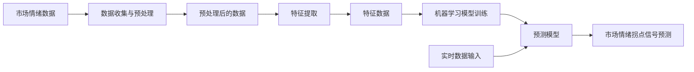

# 智能算法识别市场情绪拐点信号

> 关键词：智能算法、市场情绪、拐点信号、量化分析、机器学习

> 摘要：本文聚焦于运用智能算法识别市场情绪拐点信号这一重要课题。首先介绍了相关背景知识，包括研究目的、预期读者、文档结构及术语定义。接着阐述了核心概念及联系，通过文本示意图和 Mermaid 流程图展示其原理和架构。详细讲解了核心算法原理，并用 Python 代码进行具体实现。给出了数学模型和公式，并结合实例说明。通过项目实战展示代码案例并进行详细解读。探讨了实际应用场景，推荐了相关的学习资源、开发工具框架和论文著作。最后总结了未来发展趋势与挑战，提供了常见问题解答和扩展阅读参考资料，旨在为投资者和研究者提供全面且深入的指导，助力其在市场中更好地捕捉情绪拐点信号。

## 1. 背景介绍 
### 1.1 目的和范围
在金融市场中，市场情绪对资产价格的波动有着至关重要的影响。市场参与者的情绪变化往往会引发市场趋势的转变，而准确识别市场情绪的拐点信号，能够帮助投资者及时把握投资机会，降低风险。本研究的目的在于运用智能算法，对市场情绪数据进行分析和处理，从而精准识别市场情绪的拐点信号。

研究范围涵盖了股票市场、期货市场等主要金融市场，涉及到的市场情绪数据包括社交媒体言论、新闻报道、投资者调查等多方面的信息。通过对这些数据的挖掘和分析，建立有效的智能算法模型，以实现对市场情绪拐点信号的准确识别。

### 1.2 预期读者
本文预期读者主要包括金融投资者、金融分析师、量化投资从业者、机器学习和人工智能领域的研究者以及相关专业的学生。对于金融投资者和分析师来说，了解如何运用智能算法识别市场情绪拐点信号，有助于他们制定更加科学合理的投资策略。量化投资从业者可以借鉴本文的方法和技术，优化其量化模型。而机器学习和人工智能领域的研究者和学生则可以从本文中获取将智能算法应用于金融市场的实践经验。

### 1.3 文档结构概述
本文将按照以下结构进行组织：首先介绍背景知识，包括研究目的、预期读者、文档结构和术语表；接着阐述核心概念与联系，通过文本示意图和 Mermaid 流程图展示其原理和架构；详细讲解核心算法原理，并给出 Python 代码实现；介绍数学模型和公式，并结合实例进行说明；通过项目实战展示代码案例并进行详细解读；探讨实际应用场景；推荐相关的学习资源、开发工具框架和论文著作；总结未来发展趋势与挑战；提供常见问题解答和扩展阅读参考资料。

### 1.4 术语表
#### 1.4.1 核心术语定义
- **市场情绪**：指市场参与者对市场未来走势的整体心理预期和情感倾向，它可以通过各种渠道反映出来，如投资者的交易行为、社交媒体言论等。
- **拐点信号**：在市场情绪变化过程中，标志着市场情绪从上升趋势转变为下降趋势或从下降趋势转变为上升趋势的关键信号。
- **智能算法**：运用人工智能和机器学习技术，对数据进行分析和处理，以实现特定目标的算法。

#### 1.4.2 相关概念解释
- **量化分析**：将市场数据进行量化处理，通过数学模型和统计方法进行分析，以揭示市场规律和趋势的方法。
- **机器学习**：让计算机通过数据学习模式和规律，从而实现预测和决策的技术。

#### 1.4.3 缩略词列表
- **AI**：Artificial Intelligence，人工智能
- **ML**：Machine Learning，机器学习
- **NLP**：Natural Language Processing，自然语言处理

## 2. 核心概念与联系 

### 核心概念原理
市场情绪的形成是众多市场参与者心理和行为的综合体现。市场参与者通过社交媒体、新闻报道等渠道表达自己对市场的看法和预期，这些信息汇聚起来就形成了市场情绪。市场情绪的变化通常不是线性的，而是会出现拐点，即从一种趋势转变为另一种趋势。

智能算法识别市场情绪拐点信号的原理是通过对市场情绪数据进行收集、整理和分析，提取其中的特征信息，然后运用机器学习模型对这些特征进行学习和训练，从而建立起能够预测市场情绪拐点的模型。

### 架构的文本示意图
```plaintext
市场情绪数据（社交媒体、新闻报道等）
    |
    | 数据收集与预处理
    v
预处理后的数据
    |
    | 特征提取
    v
特征数据
    |
    | 机器学习模型训练
    v
预测模型
    |
    | 实时数据输入
    v
市场情绪拐点信号预测
```

### Mermaid 流程图


## 3. 核心算法原理 & 具体操作步骤 

### 核心算法原理
我们选择使用支持向量机（SVM）作为核心算法来识别市场情绪拐点信号。支持向量机是一种有监督的机器学习算法，它通过寻找一个最优的超平面，将不同类别的数据分隔开来。在市场情绪拐点信号识别中，我们可以将市场情绪分为上升和下降两种状态，通过 SVM 模型来判断当前市场情绪是否处于拐点。

### 具体操作步骤
1. **数据收集**：收集社交媒体、新闻报道等渠道的市场情绪数据。
2. **数据预处理**：对收集到的数据进行清洗、去重、分词等处理，将文本数据转换为数值特征。
3. **特征提取**：从预处理后的数据中提取能够反映市场情绪的特征，如关键词频率、情感极性等。
4. **模型训练**：使用提取的特征数据对 SVM 模型进行训练。
5. **模型评估**：使用测试数据对训练好的模型进行评估，计算模型的准确率、召回率等指标。
6. **实时预测**：将实时的市场情绪数据输入到训练好的模型中，进行市场情绪拐点信号的预测。

### Python 源代码实现
```python
import pandas as pd
from sklearn.feature_extraction.text import TfidfVectorizer
from sklearn.svm import SVC
from sklearn.model_selection import train_test_split
from sklearn.metrics import accuracy_score, recall_score

# 数据收集与预处理
data = pd.read_csv('market_sentiment_data.csv')
X = data['text']
y = data['label']

# 特征提取
vectorizer = TfidfVectorizer()
X_features = vectorizer.fit_transform(X)

# 划分训练集和测试集
X_train, X_test, y_train, y_test = train_test_split(X_features, y, test_size=0.2, random_state=42)

# 模型训练
model = SVC()
model.fit(X_train, y_train)

# 模型评估
y_pred = model.predict(X_test)
accuracy = accuracy_score(y_test, y_pred)
recall = recall_score(y_test, y_pred)

print(f"模型准确率: {accuracy}")
print(f"模型召回率: {recall}")

# 实时预测示例
new_text = ["市场前景一片大好"]
new_features = vectorizer.transform(new_text)
prediction = model.predict(new_features)
print(f"实时预测结果: {prediction}")
```

## 4. 数学模型和公式 & 详细讲解 & 举例说明 

### 支持向量机数学模型
支持向量机的目标是找到一个最优的超平面，将不同类别的数据分隔开来。对于一个二分类问题，假设训练数据集为 $\{(x_1, y_1), (x_2, y_2), \cdots, (x_n, y_n)\}$，其中 $x_i \in \mathbb{R}^d$ 是输入特征向量，$y_i \in \{-1, 1\}$ 是对应的类别标签。

支持向量机的优化问题可以表示为：
$$
\begin{aligned}
\min_{w, b, \xi} &\quad \frac{1}{2} \|w\|^2 + C \sum_{i=1}^{n} \xi_i \\
\text{s.t.} &\quad y_i(w^T x_i + b) \geq 1 - \xi_i, \quad i = 1, 2, \cdots, n \\
&\quad \xi_i \geq 0, \quad i = 1, 2, \cdots, n
\end{aligned}
$$
其中，$w$ 是超平面的法向量，$b$ 是偏置项，$\xi_i$ 是松弛变量，$C$ 是惩罚参数。

### 详细讲解
- **目标函数**：$\frac{1}{2} \|w\|^2$ 表示超平面的间隔最大化，即让不同类别的数据尽可能地分开。$C \sum_{i=1}^{n} \xi_i$ 是对分类错误的惩罚项，$C$ 越大，对分类错误的惩罚越严重。
- **约束条件**：$y_i(w^T x_i + b) \geq 1 - \xi_i$ 表示每个样本都要被正确分类或者在一定的误差范围内分类。$\xi_i \geq 0$ 保证了松弛变量的非负性。

### 举例说明
假设我们有一个二维的数据集，其中有两个类别，分别用红色和蓝色表示。支持向量机的目标是找到一个最优的直线（超平面），将这两个类别分隔开来。通过求解上述优化问题，我们可以得到最优的 $w$ 和 $b$，从而确定超平面的位置。

## 5. 项目实战：代码实际案例和详细解释说明 

### 5.1  开发环境搭建
- **操作系统**：Windows、Linux 或 macOS
- **Python 版本**：Python 3.6 及以上
- **开发工具**：PyCharm、Jupyter Notebook 等
- **依赖库**：pandas、scikit-learn、numpy 等

可以使用以下命令安装依赖库：
```bash
pip install pandas scikit-learn numpy
```

### 5.2  源代码详细实现和代码解读
```python
import pandas as pd
from sklearn.feature_extraction.text import TfidfVectorizer
from sklearn.svm import SVC
from sklearn.model_selection import train_test_split
from sklearn.metrics import accuracy_score, recall_score

# 数据收集与预处理
# 读取市场情绪数据文件
data = pd.read_csv('market_sentiment_data.csv')
# 提取文本数据
X = data['text']
# 提取标签数据
y = data['label']

# 特征提取
# 使用 TF-IDF 向量器将文本数据转换为数值特征
vectorizer = TfidfVectorizer()
X_features = vectorizer.fit_transform(X)

# 划分训练集和测试集
# 将数据集按照 80:20 的比例划分为训练集和测试集
X_train, X_test, y_train, y_test = train_test_split(X_features, y, test_size=0.2, random_state=42)

# 模型训练
# 创建 SVM 模型实例
model = SVC()
# 使用训练集数据对模型进行训练
model.fit(X_train, y_train)

# 模型评估
# 使用训练好的模型对测试集数据进行预测
y_pred = model.predict(X_test)
# 计算模型的准确率
accuracy = accuracy_score(y_test, y_pred)
# 计算模型的召回率
recall = recall_score(y_test, y_pred)

print(f"模型准确率: {accuracy}")
print(f"模型召回率: {recall}")

# 实时预测示例
new_text = ["市场前景一片大好"]
# 将新的文本数据转换为特征向量
new_features = vectorizer.transform(new_text)
# 使用训练好的模型对新的文本数据进行预测
prediction = model.predict(new_features)
print(f"实时预测结果: {prediction}")
```

### 5.3  代码解读与分析
- **数据收集与预处理**：使用 `pandas` 库读取市场情绪数据文件，并提取文本数据和标签数据。
- **特征提取**：使用 `TfidfVectorizer` 将文本数据转换为数值特征，TF-IDF 是一种常用的文本特征提取方法，它能够反映一个词在文档中的重要程度。
- **模型训练**：使用 `SVC` 创建 SVM 模型实例，并使用训练集数据对模型进行训练。
- **模型评估**：使用测试集数据对训练好的模型进行评估，计算模型的准确率和召回率，准确率表示模型预测正确的样本占总样本的比例，召回率表示模型正确预测为正类的样本占实际正类样本的比例。
- **实时预测**：将新的文本数据转换为特征向量，并使用训练好的模型进行预测。

## 6. 实际应用场景 
### 投资决策
投资者可以利用智能算法识别的市场情绪拐点信号，及时调整投资组合。当市场情绪从悲观转向乐观时，投资者可以增加股票等风险资产的配置；当市场情绪从乐观转向悲观时，投资者可以减少风险资产的配置，增加债券等避险资产的配置。

### 风险管理
金融机构可以运用智能算法识别市场情绪拐点信号，对市场风险进行实时监测和预警。当市场情绪出现拐点时，金融机构可以及时采取措施，如调整保证金比例、限制交易额度等，以降低风险。

### 市场研究
市场研究机构可以通过分析市场情绪拐点信号，深入了解市场参与者的心理和行为，为市场趋势预测和政策制定提供参考依据。

## 7. 工具和资源推荐
### 7.1 学习资源推荐
#### 7.1.1 书籍推荐
- 《机器学习》（周志华）：全面介绍了机器学习的基本概念、算法和应用，是机器学习领域的经典教材。
- 《Python 数据分析实战》（韦斯·麦金尼）：详细介绍了使用 Python 进行数据分析的方法和技巧，包括数据处理、可视化等方面。
- 《金融市场技术分析》（约翰·墨菲）：介绍了金融市场的技术分析方法，包括趋势分析、指标分析等，对理解市场情绪和市场趋势有很大帮助。

#### 7.1.2 在线课程
- Coursera 上的“机器学习”课程（Andrew Ng 教授主讲）：全球知名的机器学习课程，内容丰富，讲解详细。
- edX 上的“数据科学与机器学习微硕士学位课程”：系统介绍了数据科学和机器学习的相关知识和技能。

#### 7.1.3 技术博客和网站
- 机器学习算法全栈工程师：提供了大量的机器学习算法和实践案例，对学习智能算法有很大帮助。
- 金融界网站：提供了丰富的金融市场信息和分析报告，有助于了解市场情绪和市场趋势。

### 7.2 开发工具框架推荐
#### 7.2.1 IDE和编辑器
- PyCharm：功能强大的 Python 集成开发环境，提供了代码编辑、调试、版本控制等功能。
- Jupyter Notebook：交互式的 Python 开发环境，适合进行数据探索和模型实验。

#### 7.2.2 调试和性能分析工具
- PySnooper：可以自动记录函数的执行过程和变量的值，方便调试代码。
- cProfile：Python 自带的性能分析工具，可以分析代码的运行时间和函数调用情况。

#### 7.2.3 相关框架和库
- scikit-learn：简单易用的机器学习库，提供了各种机器学习算法和工具，如分类、回归、聚类等。
- TensorFlow：谷歌开发的深度学习框架，广泛应用于图像识别、自然语言处理等领域。

### 7.3 相关论文著作推荐
#### 7.3.1 经典论文
- “Support-Vector Networks”（Cortes 和 Vapnik）：介绍了支持向量机的基本原理和算法，是支持向量机领域的经典论文。
- “Efficient Estimation of Word Representations in Vector Space”（Mikolov 等）：提出了 Word2Vec 模型，用于将文本数据转换为向量表示，对自然语言处理有重要影响。

#### 7.3.2 最新研究成果
- 可以关注顶级学术会议如 NIPS、ICML、KDD 等的会议论文，了解智能算法在市场情绪分析领域的最新研究成果。

#### 7.3.3 应用案例分析
- 一些金融科技公司会发布关于智能算法在市场情绪分析和投资决策中的应用案例，可以通过他们的官方网站或行业报告获取相关信息。

## 8. 总结：未来发展趋势与挑战
### 未来发展趋势
- **多源数据融合**：未来将整合更多来源的市场情绪数据，如卫星图像、物联网数据等，以更全面地反映市场情绪。
- **深度学习的应用**：深度学习模型如卷积神经网络（CNN）、循环神经网络（RNN）等将在市场情绪拐点信号识别中得到更广泛的应用，以提高预测的准确性。
- **实时监测与预警**：实现对市场情绪的实时监测和预警，为投资者和金融机构提供更及时的决策支持。

### 挑战
- **数据质量问题**：市场情绪数据来源广泛，数据质量参差不齐，如何有效地处理和清洗数据是一个挑战。
- **模型解释性**：智能算法模型如深度学习模型通常是黑盒模型，缺乏解释性，如何提高模型的解释性，让投资者和监管机构更好地理解模型的决策过程是一个重要问题。
- **市场复杂性**：金融市场具有高度的复杂性和不确定性，市场情绪的变化受到多种因素的影响，如何准确地捕捉市场情绪的拐点信号是一个巨大的挑战。

## 9. 附录：常见问题与解答
### 问题 1：如何收集市场情绪数据？
可以通过社交媒体平台、新闻网站、金融论坛等渠道收集市场情绪数据。同时，也可以使用数据爬虫工具自动抓取相关数据。

### 问题 2：支持向量机模型的参数如何选择？
支持向量机模型的参数如惩罚参数 $C$、核函数等可以通过网格搜索、随机搜索等方法进行优化选择。

### 问题 3：如何评估智能算法模型的性能？
可以使用准确率、召回率、F1 值、ROC 曲线等指标评估智能算法模型的性能。

### 问题 4：智能算法识别的市场情绪拐点信号一定准确吗？
智能算法识别的市场情绪拐点信号并不是绝对准确的，市场具有不确定性，模型的预测结果可能存在误差。投资者应该结合其他因素进行综合判断。

## 10. 扩展阅读 & 参考资料
### 扩展阅读
- 《人工智能时代的金融科技》：探讨了人工智能在金融科技领域的应用和发展趋势。
- 《大数据时代》：介绍了大数据的概念、技术和应用，对理解市场情绪数据的处理有帮助。

### 参考资料
- 周志华. 机器学习[M]. 清华大学出版社, 2016.
- 韦斯·麦金尼. Python 数据分析实战[M]. 机械工业出版社, 2018.
- 约翰·墨菲. 金融市场技术分析[M]. 地震出版社, 2008.