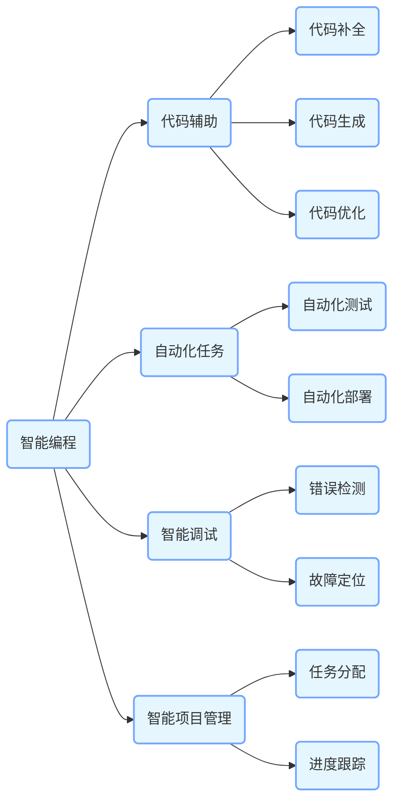

# 智能编程：AI如何改变开发者的工作

> 关键词：智能编程、AI、开发者、代码辅助、自动化、工作流、未来趋势

> 摘要：本文深入探讨了智能编程中AI对开发者工作的多方面改变。首先介绍了相关背景知识，包括目的、预期读者等。接着阐述了智能编程的核心概念与联系，详细讲解了核心算法原理及操作步骤，并结合数学模型和公式进行说明。通过项目实战展示了代码实际案例及解读，分析了实际应用场景。同时推荐了学习、开发工具和相关论文著作等资源。最后总结了未来发展趋势与挑战，并提供了常见问题解答和参考资料，旨在让读者全面了解AI在智能编程领域给开发者工作带来的变革。

## 1. 背景介绍 
### 1.1 目的和范围
随着人工智能技术的飞速发展，其在编程领域的应用越来越广泛且深入。本文的目的在于全面剖析AI如何改变开发者的工作，涵盖从日常代码编写到项目管理等多个方面。范围包括智能编程的核心概念、算法原理、实际应用场景以及未来发展趋势等内容，旨在为开发者和对智能编程感兴趣的人士提供深入的技术洞察和实践指导。

### 1.2 预期读者
本文预期读者包括专业开发者、软件工程师、技术管理者、对人工智能和编程交叉领域感兴趣的学生以及相关研究人员。无论是希望提升编程效率的一线开发者，还是关注行业趋势的技术管理者，都能从本文中获取有价值的信息。

### 1.3 文档结构概述
本文将按照以下结构展开：首先介绍背景知识，包括目的、读者和术语表等；接着阐述智能编程的核心概念与联系，通过文本示意图和Mermaid流程图进行说明；然后详细讲解核心算法原理和具体操作步骤，并给出Python源代码；再介绍数学模型和公式，并举例说明；之后通过项目实战展示代码实际案例和详细解释；分析实际应用场景；推荐学习、开发工具和相关论文著作等资源；最后总结未来发展趋势与挑战，提供常见问题解答和参考资料。

### 1.4 术语表
#### 1.4.1 核心术语定义
- **智能编程（Intelligent Programming）**：利用人工智能技术辅助或自动化完成编程任务的过程，包括代码生成、代码优化、错误检测等。
- **AI（Artificial Intelligence）**：即人工智能，是研究、开发用于模拟、延伸和扩展人的智能的理论、方法、技术及应用系统的一门新的技术科学。
- **代码补全（Code Completion）**：智能编程系统根据开发者输入的部分代码，预测并提供完整代码片段的功能。
- **自动化测试（Automated Testing）**：使用软件工具自动执行测试用例，验证代码功能和性能的过程。

#### 1.4.2 相关概念解释
- **机器学习（Machine Learning）**：AI的一个重要分支，通过让计算机从数据中学习模式和规律，从而实现预测和决策。在智能编程中，机器学习可用于代码生成、错误检测等任务。
- **深度学习（Deep Learning）**：一种基于人工神经网络的机器学习技术，通过多层神经网络学习数据的复杂特征。在智能编程中，深度学习可用于处理自然语言和代码语义。
- **自然语言处理（Natural Language Processing，NLP）**：研究如何让计算机理解和处理人类语言的技术。在智能编程中，NLP可用于将自然语言描述转换为代码。

#### 1.4.3 缩略词列表
- **AI**：Artificial Intelligence
- **NLP**：Natural Language Processing
- **ML**：Machine Learning
- **DL**：Deep Learning

## 2. 核心概念与联系 
智能编程的核心概念主要围绕AI技术在编程过程中的应用，旨在提高编程效率、降低开发成本和提升代码质量。以下是核心概念的文本示意图：

```plaintext
智能编程
|-- 代码辅助
|   |-- 代码补全
|   |-- 代码生成
|   |-- 代码优化
|-- 自动化任务
|   |-- 自动化测试
|   |-- 自动化部署
|-- 智能调试
|   |-- 错误检测
|   |-- 故障定位
|-- 智能项目管理
|   |-- 任务分配
|   |-- 进度跟踪
```

下面是对应的Mermaid流程图：


这些核心概念之间相互关联，形成一个有机的整体。例如，代码辅助功能可以为自动化测试提供高质量的代码，而智能调试可以帮助开发者快速修复代码中的错误，从而提高项目的进度跟踪效率。

## 3. 核心算法原理 & 具体操作步骤 
### 3.1 代码补全算法原理
代码补全是智能编程中最常见的功能之一，其核心算法通常基于机器学习和自然语言处理技术。以下是一个简单的基于统计语言模型的代码补全算法示例，使用Python实现：

```python
import re
from collections import defaultdict

# 构建代码语料库
corpus = [
    "def add(a, b):",
    "    return a + b",
    "def subtract(a, b):",
    "    return a - b",
    "result = add(1, 2)"
]

# 预处理语料库
tokenized_corpus = []
for line in corpus:
    tokens = re.findall(r'\w+|\W', line)
    tokenized_corpus.append(tokens)

# 构建n-gram模型
n = 2
n_gram_model = defaultdict(lambda: defaultdict(int))
for tokens in tokenized_corpus:
    for i in range(len(tokens) - n + 1):
        context = tuple(tokens[i:i+n-1])
        next_token = tokens[i+n-1]
        n_gram_model[context][next_token] += 1

# 代码补全函数
def code_completion(prefix, n_gram_model):
    prefix_tokens = re.findall(r'\w+|\W', prefix)
    context = tuple(prefix_tokens[-n+1:])
    candidates = n_gram_model[context]
    sorted_candidates = sorted(candidates.items(), key=lambda item: item[1], reverse=True)
    if sorted_candidates:
        return sorted_candidates[0][0]
    else:
        return None

# 测试代码补全
prefix = "def "
next_token = code_completion(prefix, n_gram_model)
print(f"补全结果: {next_token}")
```

### 3.2 具体操作步骤
1. **数据收集**：收集大量的代码语料库，可以来自开源项目、代码仓库等。
2. **数据预处理**：对代码语料库进行分词、去除噪声等预处理操作。
3. **模型训练**：使用预处理后的数据训练n-gram模型或更复杂的深度学习模型，如Transformer。
4. **代码补全**：当开发者输入部分代码时，提取上下文信息，根据训练好的模型预测下一个可能的代码片段。

### 3.3 代码生成算法原理
代码生成是智能编程的另一个重要功能，其核心算法通常基于深度学习技术，如Transformer架构。以下是一个简单的基于Transformer的代码生成示例：

```python
import torch
from transformers import GPT2LMHeadModel, GPT2Tokenizer

# 加载预训练模型和分词器
model = GPT2LMHeadModel.from_pretrained('gpt2')
tokenizer = GPT2Tokenizer.from_pretrained('gpt2')

# 输入文本
input_text = "def factorial(n):"

# 编码输入文本
input_ids = tokenizer.encode(input_text, return_tensors='pt')

# 生成代码
output = model.generate(input_ids, max_length=100, num_beams=5, no_repeat_ngram_size=2, early_stopping=True)

# 解码输出
generated_code = tokenizer.decode(output[0], skip_special_tokens=True)
print(f"生成的代码: {generated_code}")
```

### 3.4 具体操作步骤
1. **模型选择**：选择合适的预训练模型，如GPT-2、CodeBERT等。
2. **数据微调**：如果需要，可以使用特定领域的代码数据对预训练模型进行微调。
3. **代码生成**：输入自然语言描述或部分代码，模型根据输入生成完整的代码。

## 4. 数学模型和公式 & 详细讲解 & 举例说明 
### 4.1 n-gram模型
n-gram模型是一种基于统计的语言模型，用于预测文本中下一个词的概率。其数学公式如下：

$$P(w_i|w_{i-1}, w_{i-2}, \cdots, w_{i-n+1}) = \frac{C(w_{i-1}, w_{i-2}, \cdots, w_{i-n+1}, w_i)}{C(w_{i-1}, w_{i-2}, \cdots, w_{i-n+1})}$$

其中，$P(w_i|w_{i-1}, w_{i-2}, \cdots, w_{i-n+1})$ 表示在给定前 $n-1$ 个词的条件下，第 $i$ 个词为 $w_i$ 的概率；$C(w_{i-1}, w_{i-2}, \cdots, w_{i-n+1}, w_i)$ 表示 $n$ 元组 $(w_{i-1}, w_{i-2}, \cdots, w_{i-n+1}, w_i)$ 在语料库中出现的次数；$C(w_{i-1}, w_{i-2}, \cdots, w_{i-n+1})$ 表示 $(n-1)$ 元组 $(w_{i-1}, w_{i-2}, \cdots, w_{i-n+1})$ 在语料库中出现的次数。

举例说明：假设语料库中有以下句子 "I like to eat apples"，我们要计算 $P(apples|to, eat)$ 的概率。在这个语料库中，$(to, eat, apples)$ 出现了1次，$(to, eat)$ 也出现了1次，所以 $P(apples|to, eat) = \frac{1}{1} = 1$。

### 4.2 注意力机制
注意力机制是深度学习中一种重要的技术，用于捕捉序列中不同位置之间的依赖关系。其数学公式如下：

$$Attention(Q, K, V) = softmax(\frac{QK^T}{\sqrt{d_k}})V$$

其中，$Q$ 是查询矩阵，$K$ 是键矩阵，$V$ 是值矩阵，$d_k$ 是键向量的维度。

举例说明：假设我们有一个序列 $x = [x_1, x_2, x_3]$，我们要计算 $x_1$ 对其他位置的注意力权重。首先，我们将 $x_1$ 作为查询向量 $q_1$，将 $x_2$ 和 $x_3$ 作为键向量 $k_2$ 和 $k_3$，计算 $q_1k_2^T$ 和 $q_1k_3^T$，然后进行缩放和softmax操作，得到注意力权重，最后将注意力权重与值向量相乘，得到加权和。

## 5. 项目实战：代码实际案例和详细解释说明 
### 5.1  开发环境搭建
本次项目实战使用Python语言，需要安装以下库：
- `torch`：深度学习框架
- `transformers`：用于加载预训练模型
- `numpy`：用于数值计算
- `pandas`：用于数据处理

可以使用以下命令安装这些库：
```sh
pip install torch transformers numpy pandas
```

### 5.2  源代码详细实现和代码解读
我们将实现一个简单的智能代码生成器，根据用户输入的自然语言描述生成对应的Python代码。以下是完整的代码：

```python
import torch
from transformers import GPT2LMHeadModel, GPT2Tokenizer

# 加载预训练模型和分词器
model = GPT2LMHeadModel.from_pretrained('gpt2')
tokenizer = GPT2Tokenizer.from_pretrained('gpt2')

# 代码生成函数
def generate_code(input_text):
    # 编码输入文本
    input_ids = tokenizer.encode(input_text, return_tensors='pt')
    
    # 生成代码
    output = model.generate(input_ids, max_length=200, num_beams=5, no_repeat_ngram_size=2, early_stopping=True)
    
    # 解码输出
    generated_code = tokenizer.decode(output[0], skip_special_tokens=True)
    
    return generated_code

# 主函数
if __name__ == "__main__":
    input_text = "写一个函数，计算两个数的和"
    code = generate_code(input_text)
    print(f"生成的代码: {code}")
```

### 5.3  代码解读与分析
1. **模型加载**：使用 `GPT2LMHeadModel.from_pretrained('gpt2')` 和 `GPT2Tokenizer.from_pretrained('gpt2')` 加载预训练的GPT-2模型和分词器。
2. **代码生成函数**：`generate_code` 函数接受用户输入的自然语言描述，将其编码为输入ID，然后使用模型生成代码，最后解码输出。
3. **主函数**：在主函数中，我们定义了一个自然语言描述 "写一个函数，计算两个数的和"，调用 `generate_code` 函数生成代码并打印输出。

需要注意的是，由于GPT-2是一个通用的语言模型，生成的代码可能不是最优的，需要开发者进行进一步的修改和优化。

## 6. 实际应用场景 
### 6.1 提高代码编写效率
智能编程工具可以通过代码补全、代码生成等功能，帮助开发者快速编写代码，减少手动输入的工作量。例如，当开发者输入部分函数名时，智能编程工具可以自动补全函数的参数和代码体，大大提高了代码编写的速度。

### 6.2 代码质量提升
智能编程工具可以通过错误检测、代码优化等功能，帮助开发者发现和修复代码中的错误，提高代码的质量。例如，智能编程工具可以检测代码中的语法错误、逻辑错误和潜在的安全漏洞，并提供相应的修复建议。

### 6.3 自动化测试和部署
智能编程工具可以自动化执行测试用例，验证代码的功能和性能，减少人工测试的工作量。同时，智能编程工具还可以自动化部署代码到生产环境，提高部署的效率和准确性。

### 6.4 智能项目管理
智能编程工具可以帮助项目管理者更好地分配任务、跟踪进度和预测风险。例如，智能编程工具可以根据开发者的技能和工作量，自动分配任务；可以实时跟踪项目的进度，及时发现和解决问题；可以通过数据分析预测项目的风险，提前采取措施。

## 7. 工具和资源推荐
### 7.1 学习资源推荐
#### 7.1.1 书籍推荐
- 《Python深度学习》：介绍了Python语言和深度学习的基础知识，以及如何使用Python实现深度学习模型。
- 《人工智能：一种现代的方法》：全面介绍了人工智能的各个领域，包括机器学习、自然语言处理、计算机视觉等。
- 《代码大全》：介绍了软件开发的最佳实践和技巧，包括代码设计、代码编写、代码测试等。

#### 7.1.2 在线课程
- Coursera上的《深度学习专项课程》：由深度学习领域的专家授课，介绍了深度学习的基础知识和应用。
- edX上的《人工智能导论》：介绍了人工智能的基本概念、算法和应用。
- 中国大学MOOC上的《Python语言程序设计》：介绍了Python语言的基础知识和编程技巧。

#### 7.1.3 技术博客和网站
- Medium：一个技术博客平台，有很多关于人工智能和编程的优秀文章。
- Towards Data Science：专注于数据科学和人工智能领域的技术博客。
- GitHub：一个开源代码托管平台，可以学习到很多优秀的开源项目和代码。

### 7.2 开发工具框架推荐
#### 7.2.1 IDE和编辑器
- PyCharm：一款专业的Python集成开发环境，提供了代码编辑、调试、版本控制等功能。
- Visual Studio Code：一款轻量级的代码编辑器，支持多种编程语言和插件扩展。
- Jupyter Notebook：一种交互式的开发环境，适合数据科学和机器学习的开发。

#### 7.2.2 调试和性能分析工具
- pdb：Python自带的调试器，可以帮助开发者调试代码。
- cProfile：Python自带的性能分析工具，可以帮助开发者分析代码的性能瓶颈。
- Py-Spy：一个跨平台的Python性能分析工具，可以实时监控Python程序的性能。

#### 7.2.3 相关框架和库
- TensorFlow：一个开源的深度学习框架，支持多种深度学习模型的开发和训练。
- PyTorch：一个开源的深度学习框架，具有动态图和易于使用的特点。
- Scikit-learn：一个开源的机器学习库，提供了多种机器学习算法和工具。

### 7.3 相关论文著作推荐
#### 7.3.1 经典论文
- "Attention Is All You Need"：介绍了Transformer架构，是深度学习领域的经典论文。
- "Generative Adversarial Networks"：介绍了生成对抗网络（GAN），是人工智能领域的重要论文。
- "A Neural Algorithm of Artistic Style"：介绍了风格迁移算法，是计算机视觉领域的经典论文。

#### 7.3.2 最新研究成果
- "CodeBERT: A Pre-Trained Model for Programming and Natural Languages"：介绍了CodeBERT预训练模型，用于处理编程和自然语言任务。
- "GraphCodeBERT: Pre-Training Code Representations with Data Flow"：介绍了GraphCodeBERT预训练模型，考虑了代码的数据流信息。
- "Codex: A Generative Language Model for Code"：介绍了Codex模型，用于代码生成任务。

#### 7.3.3 应用案例分析
- "DeepCode: AI-Powered Code Review"：介绍了DeepCode工具，使用AI技术进行代码审查的应用案例。
- "GitHub Copilot: Your AI Pair Programmer"：介绍了GitHub Copilot工具，使用AI技术辅助编程的应用案例。
- "OpenAI Gym: A Tool for Developing and Comparing Reinforcement Learning Algorithms"：介绍了OpenAI Gym工具，用于开发和比较强化学习算法的应用案例。

## 8. 总结：未来发展趋势与挑战
### 8.1 未来发展趋势
- **更强大的代码生成能力**：未来的智能编程工具将能够根据更复杂的自然语言描述生成高质量的代码，甚至可以生成整个项目的代码框架。
- **个性化的编程助手**：智能编程工具将根据开发者的编程习惯和偏好，提供个性化的代码建议和编程指导。
- **跨语言和跨平台支持**：智能编程工具将支持更多的编程语言和开发平台，方便开发者在不同的环境中进行开发。
- **与其他工具的深度集成**：智能编程工具将与版本控制工具、项目管理工具、测试工具等深度集成，实现开发流程的自动化和智能化。

### 8.2 挑战
- **数据隐私和安全问题**：智能编程工具需要处理大量的代码数据，如何保证数据的隐私和安全是一个重要的挑战。
- **模型的可解释性**：深度学习模型通常是黑盒模型，难以解释其决策过程。在智能编程中，如何提高模型的可解释性，让开发者信任模型的输出是一个挑战。
- **技术的普及和应用**：智能编程技术还处于发展阶段，如何让更多的开发者了解和应用这些技术，提高整个行业的编程效率和质量是一个挑战。

## 9. 附录：常见问题与解答
### 9.1 智能编程工具会取代开发者吗？
不会。智能编程工具可以帮助开发者提高编程效率和质量，但不能完全取代开发者的创造力和判断力。开发者仍然需要理解业务需求、设计算法和架构，并对代码进行审核和优化。

### 9.2 智能编程工具生成的代码质量如何？
智能编程工具生成的代码质量取决于模型的训练数据和算法的复杂度。目前，智能编程工具生成的代码可能存在一些错误和不规范的地方，需要开发者进行进一步的修改和优化。

### 9.3 如何选择适合自己的智能编程工具？
可以根据自己的需求和使用场景选择适合的智能编程工具。例如，如果需要代码补全功能，可以选择集成了智能代码补全插件的IDE；如果需要代码生成功能，可以选择专门的代码生成工具。同时，还可以参考其他开发者的评价和推荐。

## 10. 扩展阅读 & 参考资料
- 《人工智能简史》
- 《Python自然语言处理实战》
- https://www.openai.com/
- https://github.com/
- https://arxiv.org/