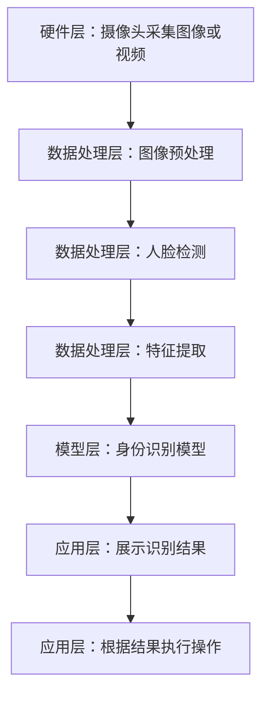

# 智能门铃：AI Agent的访客身份识别

> 关键词：智能门铃、AI Agent、访客身份识别、计算机视觉、机器学习、深度学习、身份验证

> 摘要：本文围绕智能门铃中AI Agent的访客身份识别技术展开深入探讨。首先介绍了智能门铃及访客身份识别的背景信息，包括目的、预期读者、文档结构等。接着阐述了AI Agent、访客身份识别等核心概念及其联系，详细讲解了相关核心算法原理和具体操作步骤，并通过Python代码进行示例。同时，给出了该技术背后的数学模型和公式，并举例说明。在项目实战部分，通过实际案例展示了开发环境搭建、源代码实现与解读。随后探讨了该技术的实际应用场景，推荐了相关的学习资源、开发工具框架以及论文著作。最后对智能门铃中AI Agent访客身份识别技术的未来发展趋势与挑战进行总结，并在附录中解答常见问题，还提供了扩展阅读和参考资料，旨在为读者全面呈现智能门铃中访客身份识别技术的全貌。

## 1. 背景介绍 
### 1.1 目的和范围
智能门铃作为智能家居系统的重要组成部分，其访客身份识别功能的出现极大地提升了家庭和场所的安全性与便利性。本文章的目的在于深入剖析智能门铃中基于AI Agent的访客身份识别技术的原理、实现方法、应用场景等方面。范围涵盖从基础的概念讲解到具体的算法实现，再到实际项目案例分析，以及对未来发展趋势的探讨，旨在为读者提供全面且深入的技术知识体系。

### 1.2 预期读者
本文预期读者包括对智能家居技术感兴趣的普通爱好者、从事计算机视觉、机器学习、人工智能等相关领域的技术人员、研究人员，以及智能门铃相关产品的开发工程师、架构师等。不同层次的读者都能从本文中获取到与自身需求相关的知识和信息。

### 1.3 文档结构概述
本文首先介绍智能门铃及访客身份识别的背景信息，包括目的、读者对象和文档结构等。接着详细阐述核心概念及其联系，通过文本示意图和Mermaid流程图进行清晰展示。然后深入讲解核心算法原理，并用Python代码进行说明，同时给出数学模型和公式。项目实战部分通过实际案例展示开发环境搭建、代码实现与解读。之后探讨实际应用场景，推荐相关学习资源、开发工具和论文著作。最后总结未来发展趋势与挑战，在附录中解答常见问题并提供扩展阅读和参考资料。

### 1.4 术语表
#### 1.4.1 核心术语定义
- **智能门铃**：一种具备智能功能的门铃设备，通常集成了摄像头、传感器等硬件，能够实现视频通话、访客身份识别等多种功能。
- **AI Agent（人工智能代理）**：是一种能够感知环境、进行决策并采取行动的智能实体。在智能门铃中，AI Agent可以通过分析摄像头采集的图像或视频数据，实现对访客身份的识别。
- **访客身份识别**：指通过特定的技术手段，对智能门铃摄像头所捕获的访客图像或视频进行分析，确定访客身份的过程。

#### 1.4.2 相关概念解释
- **计算机视觉**：是一门研究如何使机器“看”的科学，即通过摄像头等设备获取图像或视频数据，然后运用算法对这些数据进行处理和分析，以实现目标检测、识别等任务。在智能门铃访客身份识别中，计算机视觉技术用于从图像或视频中提取访客的面部特征等信息。
- **机器学习**：是一门多领域交叉学科，涉及概率论、统计学、逼近论、凸分析、算法复杂度理论等多门学科。它专门研究计算机怎样模拟或实现人类的学习行为，以获取新的知识或技能，重新组织已有的知识结构使之不断改善自身的性能。在访客身份识别中，机器学习算法可以用于训练模型，以提高身份识别的准确性。
- **深度学习**：是机器学习的一个分支领域，它是一种基于对数据进行表征学习的方法。深度学习通过构建具有多个层次的神经网络模型，自动从大量数据中学习到复杂的特征和模式。在智能门铃访客身份识别中，深度学习模型如卷积神经网络（CNN）被广泛应用于面部特征提取和身份识别。

#### 1.4.3 缩略词列表
- **CNN**：Convolutional Neural Network，卷积神经网络
- **AI**：Artificial Intelligence，人工智能
- **ML**：Machine Learning，机器学习
- **CV**：Computer Vision，计算机视觉

## 2. 核心概念与联系 
### 核心概念原理
智能门铃中的AI Agent访客身份识别主要基于计算机视觉和机器学习技术。其基本原理是通过智能门铃上的摄像头采集访客的图像或视频数据，然后利用计算机视觉算法对这些数据进行预处理，如图像增强、人脸检测等，提取出访客的面部特征。接着，将提取的特征输入到经过训练的机器学习或深度学习模型中，模型根据特征进行分类和识别，判断访客的身份。

### 架构的文本示意图
智能门铃访客身份识别系统主要由硬件层、数据处理层、模型层和应用层组成。
- **硬件层**：包括智能门铃的摄像头、传感器、处理器等硬件设备，负责采集访客的图像或视频数据，并进行初步的数据处理和传输。
- **数据处理层**：对硬件层采集到的数据进行预处理，如图像裁剪、归一化、人脸检测等操作，以提高数据的质量和可用性。
- **模型层**：包含经过训练的机器学习或深度学习模型，如卷积神经网络（CNN）、支持向量机（SVM）等，用于对预处理后的数据进行特征提取和身份识别。
- **应用层**：将模型层的识别结果进行展示和应用，如通过手机APP通知用户访客的身份信息，或根据访客身份进行相应的操作，如自动开门等。

### Mermaid 流程图


## 3. 核心算法原理 & 具体操作步骤 
### 核心算法原理
在智能门铃访客身份识别中，常用的算法是卷积神经网络（CNN）。CNN是一种专门用于处理具有网格结构数据（如图像）的深度学习模型，它通过卷积层、池化层和全连接层等组件，自动从图像中学习到具有代表性的特征。

### 具体操作步骤
1. **数据收集**：收集大量的访客图像数据，包括不同角度、不同光照条件下的人脸图像，并对这些图像进行标注，标注出每张图像中人脸对应的身份信息。
2. **数据预处理**：对收集到的图像数据进行预处理，包括图像裁剪、归一化、灰度化等操作，以提高数据的质量和一致性。
3. **模型构建**：构建卷积神经网络模型，通常包括输入层、卷积层、池化层、全连接层和输出层。卷积层用于提取图像的特征，池化层用于降低特征图的维度，全连接层用于将特征图转换为向量，输出层用于输出识别结果。
4. **模型训练**：使用预处理后的图像数据对构建好的模型进行训练，通过反向传播算法不断调整模型的参数，以提高模型的识别准确率。
5. **模型评估**：使用测试集对训练好的模型进行评估，计算模型的准确率、召回率、F1值等指标，评估模型的性能。
6. **部署应用**：将训练好的模型部署到智能门铃设备中，当有访客来访时，智能门铃采集访客的图像数据，经过预处理后输入到模型中进行身份识别，并将识别结果反馈给用户。

### Python源代码示例
```python
import tensorflow as tf
from tensorflow.keras import layers, models
import numpy as np
from sklearn.model_selection import train_test_split

# 数据收集和预处理（假设已经有处理好的数据集）
# 假设X是图像数据，y是对应的身份标签
X = np.random.rand(1000, 64, 64, 3)  # 1000张64x64的彩色图像
y = np.random.randint(0, 10, 1000)  # 10个不同的身份标签

# 划分训练集和测试集
X_train, X_test, y_train, y_test = train_test_split(X, y, test_size=0.2, random_state=42)

# 模型构建
model = models.Sequential()
model.add(layers.Conv2D(32, (3, 3), activation='relu', input_shape=(64, 64, 3)))
model.add(layers.MaxPooling2D((2, 2)))
model.add(layers.Conv2D(64, (3, 3), activation='relu'))
model.add(layers.MaxPooling2D((2, 2)))
model.add(layers.Conv2D(64, (3, 3), activation='relu'))
model.add(layers.Flatten())
model.add(layers.Dense(64, activation='relu'))
model.add(layers.Dense(10, activation='softmax'))

# 模型编译
model.compile(optimizer='adam',
              loss='sparse_categorical_crossentropy',
              metrics=['accuracy'])

# 模型训练
model.fit(X_train, y_train, epochs=10, validation_data=(X_test, y_test))

# 模型评估
test_loss, test_acc = model.evaluate(X_test, y_test)
print(f"Test accuracy: {test_acc}")
```

## 4. 数学模型和公式 & 详细讲解 & 举例说明 
### 数学模型
在卷积神经网络（CNN）中，主要涉及到卷积运算、池化运算和全连接层的线性变换等数学模型。

### 卷积运算公式
卷积运算的公式可以表示为：
$$(I * K)_{i,j}=\sum_{m=0}^{M - 1}\sum_{n=0}^{N - 1}I_{i + m,j + n}K_{m,n}$$
其中，$I$ 是输入图像，$K$ 是卷积核，$M$ 和 $N$ 分别是卷积核的高度和宽度，$(I * K)_{i,j}$ 是卷积结果在位置 $(i,j)$ 处的值。

### 详细讲解
卷积运算的作用是从输入图像中提取特征。卷积核是一个小的矩阵，它在输入图像上滑动，对每个位置的图像区域进行加权求和，得到一个特征图。通过不同的卷积核，可以提取出不同类型的特征，如边缘、纹理等。

### 举例说明
假设输入图像 $I$ 是一个 $3\times3$ 的矩阵：
$$I=\begin{bmatrix}
1 & 2 & 3\\
4 & 5 & 6\\
7 & 8 & 9
\end{bmatrix}$$
卷积核 $K$ 是一个 $2\times2$ 的矩阵：
$$K=\begin{bmatrix}
1 & 0\\
0 & 1
\end{bmatrix}$$
则卷积运算的过程如下：
- 对于第一个位置 $(0,0)$：
  - 取输入图像中对应的 $2\times2$ 区域：$\begin{bmatrix}
1 & 2\\
4 & 5
\end{bmatrix}$
  - 与卷积核进行逐元素相乘并求和：$1\times1 + 2\times0 + 4\times0 + 5\times1 = 6$
- 依次计算其他位置，最终得到卷积结果：
$$(I * K)=\begin{bmatrix}
6 & 8\\
10 & 12
\end{bmatrix}$$

### 池化运算公式
常用的池化运算有最大池化和平均池化。以最大池化为例，其公式可以表示为：
$$P_{i,j}=\max_{m,n\in\Omega_{i,j}}I_{m,n}$$
其中，$P$ 是池化结果，$\Omega_{i,j}$ 是池化窗口在输入图像 $I$ 中对应的区域。

### 全连接层线性变换公式
全连接层的线性变换公式可以表示为：
$$y = Wx + b$$
其中，$x$ 是输入向量，$W$ 是权重矩阵，$b$ 是偏置向量，$y$ 是输出向量。

## 5. 项目实战：代码实际案例和详细解释说明 
### 5.1  开发环境搭建
1. **硬件环境**：选择一款合适的智能门铃开发板，如树莓派，配备摄像头模块用于采集图像数据。
2. **软件环境**：安装Python开发环境，推荐使用Python 3.7及以上版本。同时，安装相关的深度学习库，如TensorFlow、Keras等。可以使用以下命令进行安装：
```sh
pip install tensorflow keras opencv-python
```

### 5.2  源代码详细实现和代码解读
```python
import cv2
import tensorflow as tf
from tensorflow.keras.models import load_model
import numpy as np

# 加载预训练的人脸识别模型
model = load_model('face_recognition_model.h5')

# 加载人脸检测器
face_cascade = cv2.CascadeClassifier(cv2.data.haarcascades + 'haarcascade_frontalface_default.xml')

# 打开摄像头
cap = cv2.VideoCapture(0)

while True:
    ret, frame = cap.read()
    if not ret:
        break

    # 转换为灰度图像
    gray = cv2.cvtColor(frame, cv2.COLOR_BGR2GRAY)

    # 检测人脸
    faces = face_cascade.detectMultiScale(gray, 1.3, 5)

    for (x, y, w, h) in faces:
        # 裁剪人脸区域
        face_roi = frame[y:y + h, x:x + w]

        # 调整图像大小
        face_roi = cv2.resize(face_roi, (64, 64))
        face_roi = np.expand_dims(face_roi, axis=0)

        # 进行身份识别
        predictions = model.predict(face_roi)
        predicted_class = np.argmax(predictions)

        # 在图像上绘制矩形框和标签
        cv2.rectangle(frame, (x, y), (x + w, y + h), (0, 255, 0), 2)
        cv2.putText(frame, f"Person {predicted_class}", (x, y - 10), cv2.FONT_HERSHEY_SIMPLEX, 0.9, (0, 255, 0), 2)

    # 显示图像
    cv2.imshow('Face Recognition', frame)

    # 按 'q' 键退出
    if cv2.waitKey(1) & 0xFF == ord('q'):
        break

# 释放摄像头并关闭窗口
cap.release()
cv2.destroyAllWindows()
```

### 5.3  代码解读与分析
1. **加载模型和人脸检测器**：使用 `load_model` 函数加载预训练的人脸识别模型，使用 `cv2.CascadeClassifier` 加载人脸检测器。
2. **打开摄像头**：使用 `cv2.VideoCapture` 打开摄像头，开始采集图像数据。
3. **人脸检测**：在每一帧图像中，使用人脸检测器检测人脸，并返回人脸的位置信息。
4. **裁剪和预处理人脸区域**：根据检测到的人脸位置，裁剪出人脸区域，并将其调整为模型输入所需的大小。
5. **身份识别**：将预处理后的人脸图像输入到模型中进行身份识别，得到预测结果。
6. **绘制矩形框和标签**：在图像上绘制矩形框标记出人脸位置，并显示预测的身份标签。
7. **显示图像和退出程序**：使用 `cv2.imshow` 显示处理后的图像，按 'q' 键退出程序。

## 6. 实际应用场景 
### 家庭安防
智能门铃的访客身份识别功能可以极大地提升家庭的安全性。当有访客来访时，智能门铃可以自动识别访客的身份，并将识别结果通过手机APP通知用户。如果识别出是陌生人，用户可以选择是否与访客进行视频通话，或者采取其他安全措施，如报警等。

### 物业管理
在小区或商业建筑中，智能门铃的访客身份识别功能可以用于物业管理。物业管理人员可以通过后台系统对访客的身份进行管理和记录，提高小区或建筑的安全性和管理效率。

### 企业门禁
在企业办公场所，智能门铃的访客身份识别功能可以作为门禁系统的一部分。员工可以通过刷脸进入公司，访客需要在智能门铃上进行身份验证，验证通过后才能进入公司，从而提高企业的安全性和管理水平。

## 7. 工具和资源推荐
### 7.1 学习资源推荐
#### 7.1.1 书籍推荐
- 《深度学习》（Deep Learning）：由Ian Goodfellow、Yoshua Bengio和Aaron Courville合著，是深度学习领域的经典教材，涵盖了深度学习的基本概念、算法和应用。
- 《Python机器学习》（Python Machine Learning）：由Sebastian Raschka和Vahid Mirjalili合著，介绍了Python在机器学习中的应用，包括各种机器学习算法的实现和实践案例。
- 《计算机视觉：算法与应用》（Computer Vision: Algorithms and Applications）：由Richard Szeliski著，全面介绍了计算机视觉的基本算法和应用，是计算机视觉领域的经典书籍。

#### 7.1.2 在线课程
- Coursera上的“深度学习专项课程”（Deep Learning Specialization）：由Andrew Ng教授授课，包括深度学习的基础、卷积神经网络、循环神经网络等多个主题。
- edX上的“计算机视觉基础”（Foundations of Computer Vision）：由华盛顿大学的教授授课，介绍了计算机视觉的基本概念和算法。
- 哔哩哔哩上的“李沐深度学习”系列课程：由李沐教授讲解，内容通俗易懂，适合初学者学习深度学习。

#### 7.1.3 技术博客和网站
- Medium：是一个技术博客平台，有很多关于人工智能、计算机视觉等领域的优质文章。
- Towards Data Science：专注于数据科学和机器学习领域的技术博客，提供了很多实用的技术文章和案例。
- 开源中国：是国内知名的开源技术社区，有很多关于人工智能、计算机视觉等领域的技术文章和开源项目。

### 7.2 开发工具框架推荐
#### 7.2.1 IDE和编辑器
- PyCharm：是一款专门用于Python开发的集成开发环境，提供了丰富的功能和插件，方便开发人员进行代码编写、调试和管理。
- Jupyter Notebook：是一个交互式的开发环境，适合进行数据分析、模型训练和实验。
- Visual Studio Code：是一款轻量级的代码编辑器，支持多种编程语言和插件，具有良好的扩展性和性能。

#### 7.2.2 调试和性能分析工具
- TensorBoard：是TensorFlow提供的可视化工具，可以用于查看模型的训练过程、性能指标等信息。
- PyTorch Profiler：是PyTorch提供的性能分析工具，可以帮助开发人员找出模型训练过程中的性能瓶颈。
- cProfile：是Python标准库中的性能分析工具，可以用于分析Python代码的性能。

#### 7.2.3 相关框架和库
- TensorFlow：是一个开源的深度学习框架，由Google开发，提供了丰富的深度学习模型和工具。
- PyTorch：是一个开源的深度学习框架，由Facebook开发，具有动态图的特点，适合进行快速实验和开发。
- OpenCV：是一个开源的计算机视觉库，提供了各种计算机视觉算法和工具，如图像预处理、特征提取、目标检测等。

### 7.3 相关论文著作推荐
#### 7.3.1 经典论文
- 《Gradient-Based Learning Applied to Document Recognition》：由Yann LeCun等人发表，介绍了卷积神经网络（CNN）的基本原理和应用，是深度学习领域的经典论文。
- 《ImageNet Classification with Deep Convolutional Neural Networks》：由Alex Krizhevsky等人发表，介绍了AlexNet模型，开创了深度学习在图像分类领域的先河。
- 《Faster R-CNN: Towards Real-Time Object Detection with Region Proposal Networks》：由Shaoqing Ren等人发表，提出了Faster R-CNN目标检测算法，提高了目标检测的效率和准确性。

#### 7.3.2 最新研究成果
- 关注顶级学术会议，如CVPR（Computer Vision and Pattern Recognition）、ICCV（International Conference on Computer Vision）、ECCV（European Conference on Computer Vision）等，这些会议上会发表很多关于计算机视觉和人工智能领域的最新研究成果。
- 关注知名学术期刊，如IEEE Transactions on Pattern Analysis and Machine Intelligence（TPAMI）、International Journal of Computer Vision（IJCV）等，这些期刊上也会发表很多高质量的研究论文。

#### 7.3.3 应用案例分析
- 关注智能门铃相关的产品白皮书和技术报告，了解不同厂商在访客身份识别技术方面的应用案例和实践经验。
- 关注开源项目和技术博客，了解开发者在实际项目中遇到的问题和解决方案，以及如何应用访客身份识别技术实现具体的功能。

## 8. 总结：未来发展趋势与挑战
### 未来发展趋势
1. **更高的识别准确率**：随着深度学习技术的不断发展和算法的不断优化，智能门铃的访客身份识别准确率将不断提高，能够更好地应对各种复杂的环境和场景。
2. **多模态识别**：未来的智能门铃可能会结合多种生物特征识别技术，如人脸识别、指纹识别、语音识别等，实现多模态的访客身份识别，提高识别的准确性和安全性。
3. **智能化和个性化**：智能门铃将更加智能化和个性化，能够根据用户的习惯和需求进行定制化的设置和服务。例如，根据不同的访客身份自动调整门铃的响铃方式、通知方式等。
4. **与智能家居系统的深度融合**：智能门铃将与智能家居系统更加深度地融合，实现更多的智能化功能。例如，当识别出是主人回家时，自动打开门锁、开启灯光、调节温度等。

### 挑战
1. **数据隐私和安全问题**：智能门铃需要采集和处理大量的访客图像和视频数据，这些数据涉及到用户的隐私和安全问题。如何保护这些数据的隐私和安全，防止数据泄露和滥用，是一个亟待解决的问题。
2. **复杂环境下的识别问题**：在实际应用中，智能门铃可能会面临各种复杂的环境和场景，如光照变化、遮挡、模糊等，这些都会影响访客身份识别的准确率。如何提高智能门铃在复杂环境下的识别能力，是一个挑战。
3. **算法的可解释性问题**：深度学习模型通常是一个黑盒模型，其决策过程和结果难以解释。在智能门铃的访客身份识别中，如何提高算法的可解释性，让用户能够理解模型的决策依据，是一个需要解决的问题。
4. **成本和性能的平衡**：提高智能门铃的访客身份识别性能通常需要更高的计算资源和更复杂的算法，这会增加产品的成本。如何在成本和性能之间找到一个平衡点，是智能门铃厂商需要考虑的问题。

## 9. 附录：常见问题与解答
### 1. 智能门铃的访客身份识别准确率有多高？
智能门铃的访客身份识别准确率受到多种因素的影响，如光照条件、图像质量、模型的训练数据等。一般来说，在理想的条件下，识别准确率可以达到90%以上。但在实际应用中，由于环境的复杂性，准确率可能会有所下降。

### 2. 智能门铃的访客身份识别数据安全吗？
智能门铃厂商通常会采取多种措施来保障访客身份识别数据的安全，如数据加密、访问控制、安全审计等。但数据安全仍然是一个需要关注的问题，用户在选择智能门铃产品时，应该选择有良好信誉和安全保障措施的厂商。

### 3. 智能门铃的访客身份识别可以识别哪些身份？
智能门铃的访客身份识别可以识别已注册的用户身份，也可以识别陌生人。对于已注册的用户，系统可以准确地识别出其身份信息；对于陌生人，系统可以发出警报或通知用户。

### 4. 智能门铃的访客身份识别需要联网吗？
大多数智能门铃的访客身份识别功能需要联网，因为需要将采集到的图像或视频数据上传到云端进行处理和分析。但也有一些智能门铃支持本地识别功能，不需要联网即可进行身份识别。

### 5. 智能门铃的访客身份识别可以在夜间使用吗？
一些智能门铃配备了红外夜视功能，可以在夜间采集清晰的图像或视频数据，从而实现夜间的访客身份识别。但在夜间，由于光照条件的限制，识别准确率可能会受到一定的影响。

## 10. 扩展阅读 & 参考资料
### 扩展阅读
- 《智能家居技术与应用》：介绍了智能家居的各种技术和应用场景，包括智能门铃、智能门锁、智能家电等。
- 《人工智能：现代方法》（Artificial Intelligence: A Modern Approach）：是人工智能领域的经典教材，涵盖了人工智能的基本概念、算法和应用。
- 《人脸识别技术原理与应用》：专门介绍了人脸识别技术的原理、算法和应用，对于深入了解智能门铃的访客身份识别技术有很大的帮助。

### 参考资料
- 相关智能门铃产品的官方网站和技术文档。
- 学术数据库，如IEEE Xplore、ACM Digital Library等，搜索关于智能门铃、计算机视觉、机器学习等领域的学术论文。
- 开源项目，如GitHub上的相关智能门铃开发项目，学习其他开发者的代码和经验。