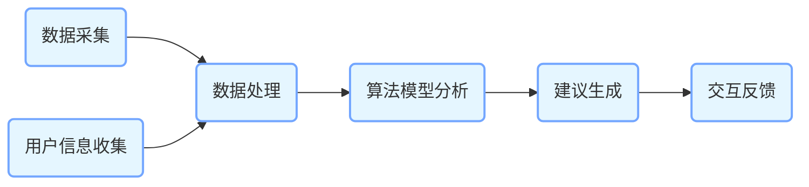

# 智能餐桌：AI Agent的营养均衡建议

> 关键词：智能餐桌、AI Agent、营养均衡建议、人工智能、饮食健康、数据处理、算法模型

> 摘要：本文围绕智能餐桌中AI Agent提供营养均衡建议这一主题展开。首先介绍了智能餐桌和AI Agent在饮食健康领域的背景，阐述了相关核心概念及其联系。接着详细讲解了实现营养均衡建议的核心算法原理和具体操作步骤，包括Python源代码示例。深入探讨了背后的数学模型和公式，并举例说明。通过项目实战，给出代码实际案例并进行详细解释。分析了智能餐桌提供营养均衡建议的实际应用场景，推荐了相关的学习资源、开发工具框架以及论文著作。最后总结了该领域的未来发展趋势与挑战，并提供了常见问题解答和扩展阅读参考资料，旨在为读者全面呈现智能餐桌与AI Agent结合实现营养均衡建议的技术全貌。

## 1. 背景介绍 
### 1.1 目的和范围
随着人们生活水平的提高，对饮食健康的关注度日益增加。智能餐桌结合AI Agent提供营养均衡建议，旨在帮助用户更加科学地选择食物，满足身体对各种营养素的需求。本文章的范围涵盖了智能餐桌与AI Agent结合的基本原理、算法实现、实际应用等方面，从技术角度深入剖析如何利用人工智能技术为用户提供精准的营养均衡建议。

### 1.2 预期读者
本文预期读者包括对人工智能在饮食健康领域应用感兴趣的技术人员、研究人员，以及关注饮食营养均衡的普通大众。对于技术人员，文章提供了详细的算法实现和代码示例；对于研究人员，有助于了解该领域的最新技术进展和研究方向；对于普通大众，能帮助他们理解智能餐桌和AI Agent如何为自己的饮食健康服务。

### 1.3 文档结构概述
本文将首先介绍智能餐桌和AI Agent的核心概念及其联系，通过文本示意图和Mermaid流程图进行清晰展示。接着详细讲解实现营养均衡建议的核心算法原理和具体操作步骤，结合Python源代码进行阐述。深入探讨背后的数学模型和公式，并举例说明。通过项目实战，给出代码实际案例并进行详细解释。分析智能餐桌提供营养均衡建议的实际应用场景，推荐相关的学习资源、开发工具框架以及论文著作。最后总结该领域的未来发展趋势与挑战，提供常见问题解答和扩展阅读参考资料。

### 1.4 术语表
#### 1.4.1 核心术语定义
- **智能餐桌**：集成了各种传感器、计算机设备和软件系统的餐桌，能够识别餐桌上的食物，收集相关数据，并与用户进行交互。
- **AI Agent**：人工智能代理，是一种能够感知环境、做出决策并采取行动以实现特定目标的智能实体。在智能餐桌场景中，AI Agent根据收集到的食物信息和用户的个人信息，提供营养均衡建议。
- **营养均衡**：指人体摄入的各种营养素在种类、数量和比例上能够满足身体的正常生理需求，维持身体健康。

#### 1.4.2 相关概念解释
- **食物识别技术**：利用计算机视觉、传感器等技术，对餐桌上的食物进行识别和分类，确定食物的种类和数量。
- **营养素数据库**：存储了各种食物中所含营养素信息的数据库，包括蛋白质、脂肪、碳水化合物、维生素、矿物质等。
- **个性化营养建议**：根据用户的年龄、性别、身高、体重、身体状况、运动习惯等个人信息，结合食物识别结果，为用户提供符合其个体需求的营养均衡建议。

#### 1.4.3 缩略词列表
- **AI**：Artificial Intelligence，人工智能
- **BMI**：Body Mass Index，身体质量指数

## 2. 核心概念与联系 

### 核心概念原理
智能餐桌结合AI Agent提供营养均衡建议的核心原理是通过智能餐桌的传感器收集餐桌上食物的信息，如食物的种类、数量等。AI Agent将这些信息与用户的个人信息（如年龄、性别、身高、体重、运动量等）相结合，利用营养素数据库和预设的算法模型，分析当前饮食中各种营养素的摄入量，并与人体的营养需求进行对比。根据对比结果，AI Agent为用户提供个性化的营养均衡建议，如增加或减少某些食物的摄入、选择更健康的食物替代品等。

### 架构的文本示意图
智能餐桌与AI Agent的架构主要包括以下几个部分：
1. **数据采集层**：智能餐桌通过摄像头、重量传感器等设备采集餐桌上食物的图像和重量信息。
2. **数据处理层**：对采集到的食物信息进行处理，包括图像识别、食物分类、重量计算等。同时，收集用户的个人信息，如年龄、性别、身高、体重、运动量等。
3. **算法模型层**：AI Agent利用营养素数据库和预设的算法模型，对处理后的数据进行分析，计算当前饮食中各种营养素的摄入量，并与人体的营养需求进行对比。
4. **建议生成层**：根据对比结果，AI Agent为用户生成个性化的营养均衡建议。
5. **交互层**：通过智能餐桌的显示屏或其他交互设备，将营养均衡建议反馈给用户，并与用户进行交互。

### Mermaid流程图


## 3. 核心算法原理 & 具体操作步骤 

### 核心算法原理
智能餐桌中AI Agent提供营养均衡建议的核心算法主要包括食物识别算法和营养分析算法。

#### 食物识别算法
食物识别算法通常基于计算机视觉技术，如卷积神经网络（Convolutional Neural Network, CNN）。CNN通过对大量食物图像进行训练，学习食物的特征，从而能够准确地识别餐桌上的食物种类。以下是一个简单的基于Python和Keras库的食物识别代码示例：

```python
import tensorflow as tf
from tensorflow.keras.models import Sequential
from tensorflow.keras.layers import Conv2D, MaxPooling2D, Flatten, Dense

# 构建CNN模型
model = Sequential([
    Conv2D(32, (3, 3), activation='relu', input_shape=(150, 150, 3)),
    MaxPooling2D((2, 2)),
    Conv2D(64, (3, 3), activation='relu'),
    MaxPooling2D((2, 2)),
    Conv2D(128, (3, 3), activation='relu'),
    MaxPooling2D((2, 2)),
    Flatten(),
    Dense(128, activation='relu'),
    Dense(10, activation='softmax')  # 假设识别10种不同的食物
])

# 编译模型
model.compile(optimizer='adam',
              loss='categorical_crossentropy',
              metrics=['accuracy'])

# 加载训练数据并进行训练
# 这里省略数据加载和训练的具体代码
# train_data, train_labels = load_data()
# model.fit(train_data, train_labels, epochs=10)

# 使用训练好的模型进行食物识别
import numpy as np
from tensorflow.keras.preprocessing import image

def recognize_food(image_path):
    img = image.load_img(image_path, target_size=(150, 150))
    img = image.img_to_array(img)
    img = np.expand_dims(img, axis=0)
    img = img / 255.0  # 归一化
    prediction = model.predict(img)
    food_index = np.argmax(prediction)
    # 假设这里有一个食物名称列表
    food_names = ['apple', 'banana', 'carrot', 'chicken', 'fish', 'pizza', 'rice', 'salad', 'tomato', 'yogurt']
    return food_names[food_index]

# 示例调用
image_path = 'test_image.jpg'
recognized_food = recognize_food(image_path)
print(f"识别到的食物是: {recognized_food}")
```

#### 营养分析算法
营养分析算法根据食物识别结果和营养素数据库，计算当前饮食中各种营养素的摄入量。然后，根据用户的个人信息和预设的营养需求标准，分析当前饮食是否达到营养均衡。以下是一个简单的营养分析代码示例：

```python
# 营养素数据库示例
nutrient_database = {
    'apple': {'protein': 0.3, 'fat': 0.2, 'carbohydrates': 13.8, 'vitamin_c': 8.4},
    'banana': {'protein': 1.1, 'fat': 0.3, 'carbohydrates': 22.8, 'potassium': 358},
    # 其他食物的营养素信息
}

# 用户信息示例
user_info = {
    'age': 30,
    'gender': 'male',
    'height': 175,
    'weight': 70,
    'activity_level': 'moderate'
}

# 计算每日营养需求
def calculate_nutrient_requirements(user_info):
    # 这里使用简单的公式计算每日蛋白质、脂肪、碳水化合物的需求
    # 实际应用中需要更复杂的公式
    weight = user_info['weight']
    protein_requirement = weight * 1.2  # 每公斤体重1.2克蛋白质
    fat_requirement = weight * 0.8  # 每公斤体重0.8克脂肪
    carbohydrate_requirement = weight * 5  # 每公斤体重5克碳水化合物
    return {
        'protein': protein_requirement,
        'fat': fat_requirement,
        'carbohydrates': carbohydrate_requirement
    }

# 计算当前饮食的营养素摄入量
def calculate_nutrient_intake(food_list):
    total_protein = 0
    total_fat = 0
    total_carbohydrates = 0
    for food in food_list:
        if food in nutrient_database:
            total_protein += nutrient_database[food]['protein']
            total_fat += nutrient_database[food]['fat']
            total_carbohydrates += nutrient_database[food]['carbohydrates']
    return {
        'protein': total_protein,
        'fat': total_fat,
        'carbohydrates': total_carbohydrates
    }

# 生成营养均衡建议
def generate_nutrition_advice(user_info, food_list):
    requirements = calculate_nutrient_requirements(user_info)
    intake = calculate_nutrient_intake(food_list)
    advice = []
    for nutrient, req in requirements.items():
        if intake[nutrient] < req:
            advice.append(f"建议增加 {nutrient} 的摄入，可以选择富含 {nutrient} 的食物，如鸡蛋、牛奶等。")
        elif intake[nutrient] > req:
            advice.append(f"建议减少 {nutrient} 的摄入，控制相关食物的量。")
    return advice

# 示例调用
food_list = ['apple', 'banana']
nutrition_advice = generate_nutrition_advice(user_info, food_list)
for advice in nutrition_advice:
    print(advice)
```

### 具体操作步骤
1. **数据采集**：使用智能餐桌的摄像头和重量传感器，采集餐桌上食物的图像和重量信息。
2. **食物识别**：将采集到的食物图像输入到训练好的食物识别模型中，识别食物的种类。
3. **用户信息收集**：通过智能餐桌的交互界面或其他方式，收集用户的个人信息，如年龄、性别、身高、体重、运动量等。
4. **营养分析**：根据食物识别结果和营养素数据库，计算当前饮食中各种营养素的摄入量。同时，根据用户的个人信息计算每日营养需求。
5. **建议生成**：对比营养素摄入量和营养需求，为用户生成个性化的营养均衡建议。
6. **交互反馈**：通过智能餐桌的显示屏或其他交互设备，将营养均衡建议反馈给用户。

## 4. 数学模型和公式 & 详细讲解 & 举例说明 

### 数学模型
智能餐桌中AI Agent提供营养均衡建议的数学模型主要基于营养学原理和统计学方法。以下是一些常见的数学模型和公式：

#### 身体质量指数（BMI）
BMI是衡量人体胖瘦程度和健康状况的常用指标，计算公式为：
$$BMI = \frac{weight}{height^2}$$
其中，$weight$ 是体重（单位：千克），$height$ 是身高（单位：米）。

根据BMI值，可以将人体健康状况分为以下几类：
- $BMI < 18.5$：体重过轻
- $18.5 \leq BMI < 24$：正常范围
- $24 \leq BMI < 28$：超重
- $BMI \geq 28$：肥胖

#### 每日能量需求
每日能量需求可以根据基础代谢率（BMR）和活动水平来计算。基础代谢率是指人体在清醒而又极端安静的状态下，不受肌肉活动、环境温度、食物及精神紧张等影响时的能量代谢率。常用的计算基础代谢率的公式有哈里斯 - 本尼迪克特公式（Harris - Benedict Equation）：

**男性**：
$$BMR = 88.362 + (13.397 \times weight) + (4.799 \times height) - (5.677 \times age)$$

**女性**：
$$BMR = 447.593 + (9.247 \times weight) + (3.098 \times height) - (4.330 \times age)$$

其中，$weight$ 是体重（单位：千克），$height$ 是身高（单位：厘米），$age$ 是年龄（单位：岁）。

根据活动水平，每日能量需求可以通过以下公式计算：
$$Total\ Energy\ Expenditure = BMR \times Activity\ Factor$$

活动因子（Activity Factor）根据不同的活动水平取值如下：
- 久坐不动（很少或没有运动）：1.2
- 轻度活动（每周1 - 3天运动）：1.375
- 中度活动（每周3 - 5天运动）：1.55
- 高度活动（每周6 - 7天运动）：1.725
- 极高度活动（每天高强度运动或体力劳动）：1.9

#### 营养素摄入量计算
营养素摄入量可以根据食物的种类和数量，结合营养素数据库来计算。假设某种食物 $i$ 的摄入量为 $m_i$（单位：克），该食物中某种营养素 $j$ 的含量为 $n_{ij}$（单位：毫克/克），则该营养素的摄入量 $N_j$ 为：
$$N_j = \sum_{i=1}^{k} m_i \times n_{ij}$$
其中，$k$ 是食物的种类数。

### 详细讲解
- **BMI**：BMI通过体重和身高的比值，反映了人体的胖瘦程度。它是一个简单而有效的指标，可以帮助我们初步判断自己的体重是否在正常范围内。但需要注意的是，BMI并不能完全准确地反映人体的脂肪含量，例如运动员由于肌肉含量较高，BMI可能会偏高，但实际上他们的身体脂肪含量并不高。
- **每日能量需求**：基础代谢率是维持人体基本生理功能所需的能量，不同性别、年龄、体重和身高的人基础代谢率不同。活动因子则考虑了人体的日常活动水平，不同的活动水平消耗的能量不同。通过将基础代谢率乘以活动因子，可以得到每日的总能量需求。
- **营养素摄入量计算**：营养素摄入量的计算是根据食物中各种营养素的含量和食物的摄入量来进行的。通过对各种食物的营养素摄入量进行求和，可以得到当前饮食中某种营养素的总摄入量。

### 举例说明
假设一位30岁的男性，身高175厘米，体重70千克，活动水平为中度活动。

#### 计算BMI
$$BMI = \frac{70}{(1.75)^2} \approx 22.86$$
该男性的BMI在正常范围内。

#### 计算基础代谢率
$$BMR = 88.362 + (13.397 \times 70) + (4.799 \times 175) - (5.677 \times 30) \approx 1685.7$$

#### 计算每日能量需求
$$Total\ Energy\ Expenditure = 1685.7 \times 1.55 \approx 2612.8$$
该男性每日的能量需求约为2612.8千卡。

#### 计算营养素摄入量
假设他今天吃了100克苹果和200克香蕉。根据营养素数据库，苹果中蛋白质含量为0.3克/100克，脂肪含量为0.2克/100克，碳水化合物含量为13.8克/100克；香蕉中蛋白质含量为1.1克/100克，脂肪含量为0.3克/100克，碳水化合物含量为22.8克/100克。

蛋白质摄入量：
$$N_{protein} = 100 \times \frac{0.3}{100} + 200 \times \frac{1.1}{100} = 0.3 + 2.2 = 2.5$$（克）

脂肪摄入量：
$$N_{fat} = 100 \times \frac{0.2}{100} + 200 \times \frac{0.3}{100} = 0.2 + 0.6 = 0.8$$（克）

碳水化合物摄入量：
$$N_{carbohydrates} = 100 \times \frac{13.8}{100} + 200 \times \frac{22.8}{100} = 13.8 + 45.6 = 59.4$$（克）

## 5. 项目实战：代码实际案例和详细解释说明 

### 5.1  开发环境搭建
为了实现智能餐桌中AI Agent的营养均衡建议功能，我们需要搭建以下开发环境：

#### 硬件环境
- 智能餐桌：配备摄像头、重量传感器、显示屏等设备。
- 计算机：用于运行食物识别模型和营养分析算法。

#### 软件环境
- 操作系统：推荐使用Windows、Linux或macOS。
- 编程语言：Python 3.x。
- 深度学习框架：TensorFlow、Keras。
- 其他库：OpenCV（用于图像处理）、NumPy（用于数值计算）、Pandas（用于数据处理）。

#### 安装步骤
1. 安装Python 3.x：可以从Python官方网站（https://www.python.org/downloads/）下载并安装。
2. 安装TensorFlow和Keras：可以使用pip命令进行安装：
```sh
pip install tensorflow keras
```
3. 安装OpenCV、NumPy和Pandas：
```sh
pip install opencv-python numpy pandas
```

### 5.2  源代码详细实现和代码解读
以下是一个完整的智能餐桌营养均衡建议系统的代码示例：

```python
import tensorflow as tf
from tensorflow.keras.models import Sequential
from tensorflow.keras.layers import Conv2D, MaxPooling2D, Flatten, Dense
import numpy as np
from tensorflow.keras.preprocessing import image
import cv2

# 食物识别模型
def build_food_recognition_model():
    model = Sequential([
        Conv2D(32, (3, 3), activation='relu', input_shape=(150, 150, 3)),
        MaxPooling2D((2, 2)),
        Conv2D(64, (3, 3), activation='relu'),
        MaxPooling2D((2, 2)),
        Conv2D(128, (3, 3), activation='relu'),
        MaxPooling2D((2, 2)),
        Flatten(),
        Dense(128, activation='relu'),
        Dense(10, activation='softmax')  # 假设识别10种不同的食物
    ])
    model.compile(optimizer='adam',
                  loss='categorical_crossentropy',
                  metrics=['accuracy'])
    return model

# 食物识别函数
def recognize_food(model, image_path):
    img = image.load_img(image_path, target_size=(150, 150))
    img = image.img_to_array(img)
    img = np.expand_dims(img, axis=0)
    img = img / 255.0  # 归一化
    prediction = model.predict(img)
    food_index = np.argmax(prediction)
    food_names = ['apple', 'banana', 'carrot', 'chicken', 'fish', 'pizza', 'rice', 'salad', 'tomato', 'yogurt']
    return food_names[food_index]

# 营养素数据库
nutrient_database = {
    'apple': {'protein': 0.3, 'fat': 0.2, 'carbohydrates': 13.8, 'vitamin_c': 8.4},
    'banana': {'protein': 1.1, 'fat': 0.3, 'carbohydrates': 22.8, 'potassium': 358},
    # 其他食物的营养素信息
}

# 用户信息类
class UserInfo:
    def __init__(self, age, gender, height, weight, activity_level):
        self.age = age
        self.gender = gender
        self.height = height
        self.weight = weight
        self.activity_level = activity_level

    def calculate_bmr(self):
        if self.gender == 'male':
            bmr = 88.362 + (13.397 * self.weight) + (4.799 * self.height) - (5.677 * self.age)
        else:
            bmr = 447.593 + (9.247 * self.weight) + (3.098 * self.height) - (4.330 * self.age)
        return bmr

    def calculate_total_energy_expenditure(self):
        bmr = self.calculate_bmr()
        activity_factors = {
            'sedentary': 1.2,
            'lightly_active': 1.375,
            'moderately_active': 1.55,
            'very_active': 1.725,
            'extra_active': 1.9
        }
        activity_factor = activity_factors[self.activity_level]
        return bmr * activity_factor

    def calculate_nutrient_requirements(self):
        total_energy = self.calculate_total_energy_expenditure()
        protein_requirement = (total_energy * 0.15) / 4  # 蛋白质占总能量的15%，每克蛋白质提供4千卡能量
        fat_requirement = (total_energy * 0.25) / 9  # 脂肪占总能量的25%，每克脂肪提供9千卡能量
        carbohydrate_requirement = (total_energy * 0.6) / 4  # 碳水化合物占总能量的60%，每克碳水化合物提供4千卡能量
        return {
            'protein': protein_requirement,
            'fat': fat_requirement,
            'carbohydrates': carbohydrate_requirement
        }

# 计算当前饮食的营养素摄入量
def calculate_nutrient_intake(food_list):
    total_protein = 0
    total_fat = 0
    total_carbohydrates = 0
    for food in food_list:
        if food in nutrient_database:
            total_protein += nutrient_database[food]['protein']
            total_fat += nutrient_database[food]['fat']
            total_carbohydrates += nutrient_database[food]['carbohydrates']
    return {
        'protein': total_protein,
        'fat': total_fat,
        'carbohydrates': total_carbohydrates
    }

# 生成营养均衡建议
def generate_nutrition_advice(user_info, food_list):
    requirements = user_info.calculate_nutrient_requirements()
    intake = calculate_nutrient_intake(food_list)
    advice = []
    for nutrient, req in requirements.items():
        if intake[nutrient] < req:
            advice.append(f"建议增加 {nutrient} 的摄入，可以选择富含 {nutrient} 的食物，如鸡蛋、牛奶等。")
        elif intake[nutrient] > req:
            advice.append(f"建议减少 {nutrient} 的摄入，控制相关食物的量。")
    return advice

# 主函数
def main():
    # 加载食物识别模型
    model = build_food_recognition_model()
    # 假设模型已经训练好，这里省略训练代码

    # 模拟采集食物图像
    image_path = 'test_image.jpg'
    recognized_food = recognize_food(model, image_path)
    print(f"识别到的食物是: {recognized_food}")

    # 模拟用户信息
    user_info = UserInfo(30, 'male', 175, 70, 'moderately_active')

    # 模拟食物列表
    food_list = [recognized_food]

    # 生成营养均衡建议
    nutrition_advice = generate_nutrition_advice(user_info, food_list)
    for advice in nutrition_advice:
        print(advice)

if __name__ == "__main__":
    main()
```

### 5.3  代码解读与分析
#### 食物识别部分
- `build_food_recognition_model` 函数：构建一个简单的CNN模型用于食物识别。该模型包含卷积层、池化层、全连接层，最后使用softmax激活函数输出食物分类的概率。
- `recognize_food` 函数：将输入的食物图像进行预处理，然后输入到训练好的模型中进行预测，返回识别到的食物名称。

#### 营养分析部分
- `UserInfo` 类：包含用户的个人信息，如年龄、性别、身高、体重、活动水平等。该类提供了计算基础代谢率、每日总能量需求和营养素需求的方法。
- `calculate_nutrient_intake` 函数：根据食物列表和营养素数据库，计算当前饮食中各种营养素的摄入量。
- `generate_nutrition_advice` 函数：对比营养素摄入量和营养需求，为用户生成个性化的营养均衡建议。

#### 主函数部分
- `main` 函数：加载食物识别模型，模拟采集食物图像并进行识别，创建用户信息对象，生成食物列表，最后调用 `generate_nutrition_advice` 函数生成营养均衡建议并输出。

## 6. 实际应用场景 
### 家庭场景
在家庭中，智能餐桌可以为家庭成员提供个性化的营养均衡建议。例如，家长可以通过智能餐桌了解孩子的饮食情况，根据孩子的年龄、身体状况等因素，为孩子提供适合的食物选择建议。同时，智能餐桌还可以记录家庭成员的饮食历史，帮助家长更好地管理家庭饮食健康。

### 餐厅场景
在餐厅中，智能餐桌可以为顾客提供营养均衡建议。顾客在点餐时，智能餐桌可以根据顾客的个人信息和餐厅的菜品信息，为顾客推荐适合的菜品组合，帮助顾客实现营养均衡。此外，餐厅还可以利用智能餐桌收集顾客的饮食偏好和营养需求信息，优化菜品设计和菜单推荐。

### 医疗机构场景
在医疗机构中，智能餐桌可以用于患者的饮食管理。医生可以根据患者的病情和身体状况，为患者制定个性化的饮食方案。智能餐桌可以帮助患者准确了解自己的饮食摄入情况，确保患者按照饮食方案进行饮食。同时，智能餐桌还可以将患者的饮食信息反馈给医生，方便医生进行病情跟踪和调整治疗方案。

### 学校场景
在学校中，智能餐桌可以为学生提供营养均衡建议。学校可以通过智能餐桌了解学生的饮食情况，根据学生的年龄、性别、运动量等因素，为学生提供科学的饮食指导。此外，智能餐桌还可以帮助学校优化食堂的菜品供应，确保学生能够摄入足够的营养。

## 7. 工具和资源推荐
### 7.1 学习资源推荐
#### 7.1.1 书籍推荐
- 《Python深度学习》：由Francois Chollet所著，本书详细介绍了Python和深度学习框架Keras的使用，对于学习食物识别和营养分析算法的实现非常有帮助。
- 《营养与食品卫生学》：这是一本经典的营养学教材，涵盖了营养学的基本原理、食物营养成分、营养需求等方面的知识，对于理解智能餐桌营养均衡建议的理论基础很有帮助。
- 《计算机视觉：算法与应用》：本书介绍了计算机视觉的基本算法和应用，包括图像识别、目标检测等，对于学习食物识别算法有很大的帮助。

#### 7.1.2 在线课程
- Coursera上的“深度学习专项课程”：由Andrew Ng教授授课，涵盖了深度学习的基础知识和应用，包括卷积神经网络、循环神经网络等，对于学习食物识别模型的构建非常有帮助。
- edX上的“营养学基础”：该课程介绍了营养学的基本概念、营养素的作用、饮食与健康的关系等内容，对于理解营养均衡建议的原理很有帮助。
- 中国大学MOOC上的“计算机视觉基础”：该课程介绍了计算机视觉的基本原理和算法，包括图像预处理、特征提取、目标识别等，对于学习食物识别技术有很大的帮助。

#### 7.1.3 技术博客和网站
- Medium：这是一个技术博客平台，上面有很多关于人工智能、计算机视觉、营养学等方面的文章，可以帮助我们了解最新的技术动态和研究成果。
- Kaggle：这是一个数据科学竞赛平台，上面有很多关于图像识别、营养分析等方面的数据集和竞赛项目，可以帮助我们提高实践能力。
- 丁香园：这是一个专业的医学健康网站，上面有很多关于营养学、饮食健康等方面的文章和资讯，可以帮助我们了解最新的营养学知识和健康建议。

### 7.2 开发工具框架推荐
#### 7.2.1 IDE和编辑器
- PyCharm：这是一款专门为Python开发设计的集成开发环境（IDE），具有代码编辑、调试、版本控制等功能，非常适合开发智能餐桌营养均衡建议系统。
- Visual Studio Code：这是一款轻量级的代码编辑器，支持多种编程语言和插件扩展，对于快速开发和调试代码非常方便。

#### 7.2.2 调试和性能分析工具
- TensorBoard：这是TensorFlow提供的一个可视化工具，可以帮助我们可视化模型的训练过程、评估指标、网络结构等，对于调试和优化食物识别模型非常有帮助。
- cProfile：这是Python标准库中的一个性能分析工具，可以帮助我们分析代码的性能瓶颈，找出需要优化的部分。

#### 7.2.3 相关框架和库
- TensorFlow：这是一个开源的深度学习框架，提供了丰富的深度学习模型和工具，对于构建食物识别模型非常方便。
- Keras：这是一个高级神经网络API，基于TensorFlow、Theano等后端，简化了深度学习模型的构建过程，适合初学者使用。
- OpenCV：这是一个开源的计算机视觉库，提供了丰富的图像处理和计算机视觉算法，对于食物图像的预处理和特征提取非常有帮助。

### 7.3 相关论文著作推荐
#### 7.3.1 经典论文
- "ImageNet Classification with Deep Convolutional Neural Networks"：这篇论文是卷积神经网络领域的经典论文，介绍了AlexNet模型在ImageNet图像分类竞赛中的应用，为食物识别模型的构建提供了重要的理论基础。
- "A New Equation to Estimate Glomerular Filtration Rate"：这篇论文提出了一个新的估算肾小球滤过率的公式，对于理解人体生理指标的计算和营养需求的评估有一定的参考价值。

#### 7.3.2 最新研究成果
- "Deep Learning for Food Recognition: A Review"：这篇论文对深度学习在食物识别领域的研究进展进行了综述，介绍了最新的食物识别算法和模型，对于了解该领域的最新技术动态非常有帮助。
- "Personalized Nutrition: From Genomics to the Microbiome"：这篇论文探讨了个性化营养的概念和实现方法，包括基于基因组学和微生物组学的个性化营养建议，对于智能餐桌提供个性化营养均衡建议有一定的启示作用。

#### 7.3.3 应用案例分析
- "Smart Tableware for Dietary Monitoring and Nutrition Guidance"：这篇论文介绍了一种智能餐具用于饮食监测和营养指导的应用案例，对于智能餐桌的设计和开发有一定的参考价值。
- "Using Artificial Intelligence to Improve Diet Quality: A Systematic Review"：这篇论文对利用人工智能技术改善饮食质量的应用案例进行了系统综述，分析了人工智能在饮食健康领域的应用效果和挑战，对于智能餐桌的实际应用有一定的借鉴意义。

## 8. 总结：未来发展趋势与挑战
### 未来发展趋势
- **个性化程度更高**：随着人工智能技术的不断发展，智能餐桌将能够更准确地收集用户的个人信息，包括基因信息、肠道微生物信息等，从而为用户提供更加个性化的营养均衡建议。
- **多模态数据融合**：除了食物图像和重量信息，智能餐桌还将融合更多的传感器数据，如气味传感器、口感传感器等，更全面地了解食物的特征和用户的饮食体验。
- **与智能家居系统集成**：智能餐桌将与智能家居系统进行集成，实现与冰箱、烤箱、洗碗机等设备的互联互通。例如，当智能餐桌检测到用户缺乏某种营养素时，可以自动向冰箱发送补货提醒，或者向烤箱发送烹饪指令，为用户制作富含该营养素的食物。
- **社交化功能增强**：智能餐桌将增加社交化功能，用户可以与家人、朋友分享自己的饮食信息和营养均衡建议，形成健康饮食的社交圈子。同时，智能餐桌还可以根据用户的社交关系，为用户推荐适合的聚餐菜品和饮食方案。

### 挑战
- **数据准确性和安全性**：智能餐桌需要收集大量的用户个人信息和饮食数据，数据的准确性和安全性是一个重要的挑战。如何确保数据的准确采集、存储和传输，防止数据泄露和滥用，是需要解决的问题。
- **算法复杂度和计算资源**：实现精准的食物识别和营养分析需要复杂的算法模型，这些模型对计算资源的要求较高。如何在保证算法性能的前提下，降低计算成本，提高系统的运行效率，是一个挑战。
- **用户接受度**：智能餐桌作为一种新兴的产品，用户对其功能和使用方式可能存在一定的陌生感和疑虑。如何提高用户的接受度，让用户愿意使用智能餐桌来管理自己的饮食健康，是需要解决的问题。
- **法规和标准**：智能餐桌涉及到用户的个人健康信息和饮食安全问题，目前相关的法规和标准还不够完善。如何制定合理的法规和标准，规范智能餐桌的生产和使用，保障用户的权益，是一个需要关注的问题。

## 9. 附录：常见问题与解答
### 1. 智能餐桌的食物识别准确率有多高？
智能餐桌的食物识别准确率受到多种因素的影响，如食物的种类、图像质量、光照条件等。一般来说，经过大量数据训练的食物识别模型，准确率可以达到80% - 90%左右。但对于一些相似的食物，识别准确率可能会有所下降。

### 2. 智能餐桌的营养均衡建议是否适用于所有人？
智能餐桌的营养均衡建议是根据用户的个人信息和食物识别结果生成的，具有一定的个性化。但由于每个人的身体状况和营养需求都有所不同，建议在遵循智能餐桌建议的同时，咨询专业的营养师或医生的意见。

### 3. 智能餐桌的传感器容易损坏吗？
智能餐桌的传感器通常经过了严格的质量检测和可靠性测试，正常使用情况下不容易损坏。但为了保证传感器的准确性和使用寿命，建议定期对传感器进行清洁和维护。

### 4. 智能餐桌的价格贵吗？
智能餐桌的价格因品牌、功能、配置等因素而异。目前市场上的智能餐桌价格范围较广，从几千元到上万元不等。随着技术的不断发展和市场竞争的加剧，智能餐桌的价格有望逐渐下降。

### 5. 智能餐桌可以与手机APP连接吗？
大多数智能餐桌支持与手机APP连接，用户可以通过手机APP查看自己的饮食信息、营养均衡建议，还可以进行远程控制和设置。通过手机APP，用户可以更加方便地管理自己的饮食健康。

## 10. 扩展阅读 & 参考资料
### 扩展阅读
- 《人工智能：现代方法》：本书全面介绍了人工智能的基本概念、算法和应用，对于深入理解智能餐桌中AI Agent的工作原理有很大的帮助。
- 《数字医疗：从医疗信息化到人工智能》：本书探讨了数字技术在医疗领域的应用，包括智能健康监测、个性化医疗等，对于了解智能餐桌在医疗健康领域的应用前景有一定的启示作用。
- 《未来饮食：科技如何塑造我们的餐桌》：本书介绍了科技对未来饮食的影响，包括智能厨房设备、人造肉、个性化营养等，对于了解智能餐桌的未来发展趋势有一定的参考价值。

### 参考资料
- TensorFlow官方文档：https://www.tensorflow.org/
- Keras官方文档：https://keras.io/
- OpenCV官方文档：https://opencv.org/
- 中国营养学会官网：https://www.cnsoc.org/
- 世界卫生组织官网：https://www.who.int/