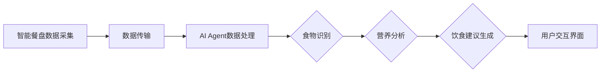

# 智能餐盘：AI Agent的饮食平衡建议

> 关键词：智能餐盘、AI Agent、饮食平衡建议、人工智能、健康饮食、计算机视觉、营养分析

> 摘要：本文围绕智能餐盘与AI Agent提供饮食平衡建议这一主题展开。详细介绍了智能餐盘和AI Agent的相关概念及联系，阐述了其背后的核心算法原理，通过数学模型和公式进行深入分析。结合项目实战，给出代码实际案例并详细解释。探讨了智能餐盘在不同场景下的实际应用，推荐了学习、开发工具和相关论文著作。最后总结了该领域的未来发展趋势与挑战，并提供常见问题解答和扩展阅读资料，旨在帮助读者全面了解智能餐盘利用AI Agent实现饮食平衡建议的技术与应用。

## 1. 背景介绍 
### 1.1 目的和范围
随着人们对健康饮食的关注度不断提高，如何实现饮食的平衡成为了一个重要问题。智能餐盘结合AI Agent的饮食平衡建议系统旨在利用先进的人工智能技术，为用户提供实时、准确的饮食分析和个性化的平衡建议。本文章的范围涵盖了智能餐盘和AI Agent的核心概念、算法原理、数学模型、项目实战、实际应用场景等方面，旨在全面介绍这一新兴技术的相关知识和应用。

### 1.2 预期读者
本文的预期读者包括对人工智能技术在健康饮食领域应用感兴趣的科研人员、开发者、营养师、健康管理从业者以及关注自身饮食健康的普通大众。

### 1.3 文档结构概述
本文将按照以下结构进行阐述：首先介绍智能餐盘和AI Agent的背景知识和相关术语；接着详细讲解核心概念及其联系，包括原理和架构的示意图与流程图；然后阐述核心算法原理并给出Python源代码；之后介绍数学模型和公式，并举例说明；再通过项目实战给出代码实际案例和详细解释；接着探讨实际应用场景；推荐相关的工具和资源；最后总结未来发展趋势与挑战，提供常见问题解答和扩展阅读资料。

### 1.4 术语表
#### 1.4.1 核心术语定义
- **智能餐盘**：一种具备感知、识别和数据传输功能的餐盘，通常集成了摄像头、传感器等设备，能够获取餐盘内食物的图像、重量等信息。
- **AI Agent**：人工智能代理，是一种能够感知环境、进行推理和决策，并采取行动以实现特定目标的智能实体。在本文中，AI Agent主要用于分析智能餐盘获取的数据，提供饮食平衡建议。
- **饮食平衡**：指人体摄入的各种营养素（如碳水化合物、蛋白质、脂肪、维生素、矿物质等）在种类和数量上达到合理的比例，以满足人体正常生理功能和健康需求。

#### 1.4.2 相关概念解释
- **计算机视觉**：是人工智能的一个重要分支，主要研究如何使计算机从图像或视频中获取信息，进行目标检测、识别、分类等任务。在智能餐盘系统中，计算机视觉技术用于识别餐盘内的食物种类。
- **营养分析**：通过对食物的成分进行分析，计算出食物中各种营养素的含量，并根据人体的需求和健康状况，评估饮食的合理性。

#### 1.4.3 缩略词列表
- **AI**：Artificial Intelligence，人工智能
- **CV**：Computer Vision，计算机视觉
- **ML**：Machine Learning，机器学习
- **DL**：Deep Learning，深度学习

## 2. 核心概念与联系 
### 核心概念原理
智能餐盘利用内置的摄像头和传感器获取餐盘内食物的图像和重量信息。摄像头拍摄食物的图像，传感器测量食物的重量。这些数据被传输到AI Agent中进行处理。

AI Agent首先使用计算机视觉技术对食物图像进行分析，识别出食物的种类。然后，根据识别出的食物种类和传感器测量的重量，结合营养数据库，计算出食物中各种营养素的含量。最后，AI Agent根据用户的个人信息（如年龄、性别、身高、体重、运动量等）和健康目标（如减肥、增肌、维持健康等），提供个性化的饮食平衡建议。

### 架构的文本示意图
智能餐盘系统的架构主要包括以下几个部分：
1. **数据采集层**：由智能餐盘的摄像头和传感器组成，负责采集食物的图像和重量信息。
2. **数据传输层**：将采集到的数据传输到云端服务器或本地设备。
3. **数据处理层**：AI Agent运行在云端服务器或本地设备上，对传输过来的数据进行处理，包括食物识别、营养分析和饮食建议生成。
4. **用户交互层**：用户可以通过手机应用、网页等方式与系统进行交互，查看饮食分析结果和建议。

### Mermaid流程图


## 3. 核心算法原理 & 具体操作步骤 
### 核心算法原理
#### 食物识别算法
食物识别主要使用深度学习中的卷积神经网络（CNN）。CNN是一种专门用于处理图像数据的神经网络，它能够自动提取图像的特征，并进行分类。常见的CNN模型有ResNet、VGG、Inception等。

在训练阶段，需要收集大量的食物图像数据集，并对其进行标注，标注信息包括食物的种类。然后使用这些标注好的图像数据对CNN模型进行训练，调整模型的参数，使其能够准确地识别不同种类的食物。

在预测阶段，将智能餐盘采集到的食物图像输入到训练好的CNN模型中，模型会输出食物的种类。

#### 营养分析算法
营养分析算法根据识别出的食物种类和传感器测量的重量，结合营养数据库，计算出食物中各种营养素的含量。营养数据库中存储了各种食物的营养成分信息，包括每100克食物中碳水化合物、蛋白质、脂肪、维生素、矿物质等营养素的含量。

具体计算公式如下：
某种营养素的含量 = 食物的重量 × 每100克该食物中该营养素的含量 / 100

#### 饮食建议生成算法
饮食建议生成算法根据用户的个人信息和健康目标，结合营养分析结果，生成个性化的饮食平衡建议。例如，如果用户的目标是减肥，算法会建议减少高热量、高脂肪食物的摄入，增加蔬菜、水果等低热量、高纤维食物的摄入。

### 具体操作步骤
#### 食物识别步骤
1. 数据预处理：对采集到的食物图像进行预处理，包括图像缩放、归一化等操作，以提高模型的训练和预测效果。
2. 模型加载：加载训练好的CNN模型。
3. 图像输入：将预处理后的食物图像输入到模型中。
4. 预测结果：模型输出食物的种类。

#### 营养分析步骤
1. 获取食物种类和重量：从食物识别结果和传感器数据中获取食物的种类和重量。
2. 查询营养数据库：根据食物种类，在营养数据库中查询该食物每100克中各种营养素的含量。
3. 计算营养素含量：使用上述公式计算食物中各种营养素的含量。

#### 饮食建议生成步骤
1. 获取用户信息：获取用户的个人信息和健康目标。
2. 分析营养需求：根据用户信息和健康目标，分析用户的营养需求。
3. 对比分析：将营养分析结果与用户的营养需求进行对比。
4. 生成建议：根据对比结果，生成个性化的饮食平衡建议。

### Python源代码实现
以下是一个简单的食物识别和营养分析的Python代码示例：

```python
import tensorflow as tf
from tensorflow.keras.applications.resnet50 import ResNet50, preprocess_input, decode_predictions
import numpy as np

# 加载预训练的ResNet50模型
model = ResNet50(weights='imagenet')

# 食物识别函数
def food_recognition(image_path):
    # 加载图像
    img = tf.keras.preprocessing.image.load_img(image_path, target_size=(224, 224))
    # 将图像转换为数组
    img_array = tf.keras.preprocessing.image.img_to_array(img)
    # 增加一个维度
    img_array = np.expand_dims(img_array, axis=0)
    # 图像预处理
    img_array = preprocess_input(img_array)
    # 预测
    predictions = model.predict(img_array)
    # 解码预测结果
    decoded_predictions = decode_predictions(predictions, top=1)[0]
    food_name = decoded_predictions[0][1]
    return food_name

# 营养数据库
nutrition_database = {
    "apple": {
        "carbohydrates": 13.81,
        "protein": 0.26,
        "fat": 0.17
    },
    "banana": {
        "carbohydrates": 22.84,
        "protein": 1.09,
        "fat": 0.33
    }
}

# 营养分析函数
def nutrition_analysis(food_name, weight):
    if food_name in nutrition_database:
        nutrients = nutrition_database[food_name]
        carbohydrate_content = weight * nutrients["carbohydrates"] / 100
        protein_content = weight * nutrients["protein"] / 100
        fat_content = weight * nutrients["fat"] / 100
        return {
            "carbohydrates": carbohydrate_content,
            "protein": protein_content,
            "fat": fat_content
        }
    else:
        return None

# 示例使用
image_path = "apple.jpg"
food_name = food_recognition(image_path)
weight = 200  # 食物重量，单位：克
nutrients = nutrition_analysis(food_name, weight)
if nutrients:
    print(f"食物名称: {food_name}")
    print(f"碳水化合物含量: {nutrients['carbohydrates']} 克")
    print(f"蛋白质含量: {nutrients['protein']} 克")
    print(f"脂肪含量: {nutrients['fat']} 克")
else:
    print("未找到该食物的营养信息")
```

## 4. 数学模型和公式 & 详细讲解 & 举例说明 
### 数学模型和公式
#### 营养成分计算模型
设某种食物的重量为 $m$（单位：克），该食物每100克中某种营养素的含量为 $n_{100}$，则该食物中该营养素的含量 $N$ 可以通过以下公式计算：
$$N = \frac{m}{100} \times n_{100}$$

#### 营养需求计算模型
以计算每日能量需求为例，常用的Harris - Benedict公式如下：

对于男性：
$$BMR = 88.362 + (13.397 \times W) + (4.799 \times H) - (5.677 \times A)$$

对于女性：
$$BMR = 447.593 + (9.247 \times W) + (3.098 \times H) - (4.330 \times A)$$

其中，$BMR$ 是基础代谢率（单位：千卡），$W$ 是体重（单位：千克），$H$ 是身高（单位：厘米），$A$ 是年龄（单位：岁）。

然后，根据活动水平系数 $AF$ 计算每日总能量需求 $TDEE$：
$$TDEE = BMR \times AF$$

活动水平系数 $AF$ 的取值如下：
- 久坐不动（很少或没有运动）：$AF = 1.2$
- 轻度运动（每周1 - 3天运动）：$AF = 1.375$
- 中度运动（每周3 - 5天运动）：$AF = 1.55$
- 重度运动（每周6 - 7天运动）：$AF = 1.725$
- 极重度运动（每天高强度运动或体力劳动）：$AF = 1.9$

### 详细讲解
#### 营养成分计算模型
该公式的原理是根据比例关系进行计算。每100克食物中某种营养素的含量是已知的，那么通过食物的实际重量与100克的比例，就可以计算出该食物中该营养素的实际含量。

#### 营养需求计算模型
Harris - Benedict公式是基于大量的人体生理数据统计得出的，用于估算人体的基础代谢率。基础代谢率是指人体在安静状态下维持生命所需要的最低能量消耗。然后，根据活动水平系数，考虑到不同的运动和活动情况，计算出每日总能量需求。

### 举例说明
#### 营养成分计算举例
假设一个苹果的重量是200克，每100克苹果中碳水化合物的含量是13.81克。根据营养成分计算模型，该苹果中碳水化合物的含量为：
$$N = \frac{200}{100} \times 13.81 = 27.62 \text{ 克}$$

#### 营养需求计算举例
假设一位30岁的男性，体重70千克，身高175厘米，每周运动3 - 5天。

首先，计算基础代谢率：
$$BMR = 88.362 + (13.397 \times 70) + (4.799 \times 175) - (5.677 \times 30)$$
$$BMR = 88.362 + 937.79 + 839.825 - 170.31$$
$$BMR = 1695.667 \text{ 千卡}$$

然后，根据活动水平系数（中度运动，$AF = 1.55$）计算每日总能量需求：
$$TDEE = 1695.667 \times 1.55 = 2628.283 \text{ 千卡}$$

## 5. 项目实战：代码实际案例和详细解释说明 
### 5.1  开发环境搭建
#### 硬件环境
- 智能餐盘：可以选择市面上支持图像采集和数据传输的智能餐盘，或者自行搭建一个带有摄像头和传感器的餐盘装置。
- 服务器或本地设备：可以使用云服务器（如阿里云、腾讯云等）或本地计算机，要求具备足够的计算资源和存储空间。

#### 软件环境
- 操作系统：可以选择Windows、Linux或macOS。
- 编程语言：Python 3.x
- 深度学习框架：TensorFlow、PyTorch等
- 数据库：MySQL、MongoDB等

#### 安装依赖库
在命令行中执行以下命令安装所需的Python库：
```bash
pip install tensorflow numpy opencv-python mysql-connector-python
```

### 5.2  源代码详细实现和代码解读
以下是一个更完整的智能餐盘系统的Python代码示例，包括食物识别、营养分析和饮食建议生成：

```python
import tensorflow as tf
from tensorflow.keras.applications.resnet50 import ResNet50, preprocess_input, decode_predictions
import numpy as np
import cv2
import mysql.connector

# 加载预训练的ResNet50模型
model = ResNet50(weights='imagenet')

# 食物识别函数
def food_recognition(image_path):
    # 加载图像
    img = tf.keras.preprocessing.image.load_img(image_path, target_size=(224, 224))
    # 将图像转换为数组
    img_array = tf.keras.preprocessing.image.img_to_array(img)
    # 增加一个维度
    img_array = np.expand_dims(img_array, axis=0)
    # 图像预处理
    img_array = preprocess_input(img_array)
    # 预测
    predictions = model.predict(img_array)
    # 解码预测结果
    decoded_predictions = decode_predictions(predictions, top=1)[0]
    food_name = decoded_predictions[0][1]
    return food_name

# 连接数据库
def connect_db():
    mydb = mysql.connector.connect(
        host="localhost",
        user="your_username",
        password="your_password",
        database="nutrition_db"
    )
    return mydb

# 营养分析函数
def nutrition_analysis(food_name, weight):
    mydb = connect_db()
    mycursor = mydb.cursor()
    query = f"SELECT carbohydrates, protein, fat FROM nutrition_table WHERE food_name = '{food_name}'"
    mycursor.execute(query)
    result = mycursor.fetchone()
    if result:
        carbohydrates, protein, fat = result
        carbohydrate_content = weight * carbohydrates / 100
        protein_content = weight * protein / 100
        fat_content = weight * fat / 100
        return {
            "carbohydrates": carbohydrate_content,
            "protein": protein_content,
            "fat": fat_content
        }
    else:
        return None

# 饮食建议生成函数
def diet_recommendation(user_info, nutrients):
    age = user_info["age"]
    gender = user_info["gender"]
    weight = user_info["weight"]
    height = user_info["height"]
    activity_level = user_info["activity_level"]
    goal = user_info["goal"]

    # 计算基础代谢率
    if gender == "male":
        bmr = 88.362 + (13.397 * weight) + (4.799 * height) - (5.677 * age)
    else:
        bmr = 447.593 + (9.247 * weight) + (3.098 * height) - (4.330 * age)

    # 根据活动水平计算每日总能量需求
    activity_factors = {
        "sedentary": 1.2,
        "lightly_active": 1.375,
        "moderately_active": 1.55,
        "very_active": 1.725,
        "extra_active": 1.9
    }
    af = activity_factors[activity_level]
    tdee = bmr * af

    # 计算当前饮食的能量
    energy = nutrients["carbohydrates"] * 4 + nutrients["protein"] * 4 + nutrients["fat"] * 9

    if goal == "lose_weight":
        if energy > tdee * 0.8:
            return "建议减少高热量食物的摄入，增加蔬菜和水果的比例。"
        else:
            return "当前饮食能量摄入基本符合减肥需求，继续保持。"
    elif goal == "gain_weight":
        if energy < tdee * 1.2:
            return "建议增加高热量、高蛋白食物的摄入，如肉类、豆类等。"
        else:
            return "当前饮食能量摄入基本符合增肌需求，继续保持。"
    else:
        if abs(energy - tdee) > 200:
            return "建议调整饮食结构，使能量摄入更接近身体需求。"
        else:
            return "当前饮食能量摄入基本平衡，继续保持。"

# 示例使用
image_path = "apple.jpg"
food_name = food_recognition(image_path)
weight = 200  # 食物重量，单位：克
nutrients = nutrition_analysis(food_name, weight)
if nutrients:
    user_info = {
        "age": 30,
        "gender": "male",
        "weight": 70,
        "height": 175,
        "activity_level": "moderately_active",
        "goal": "lose_weight"
    }
    recommendation = diet_recommendation(user_info, nutrients)
    print(f"食物名称: {food_name}")
    print(f"碳水化合物含量: {nutrients['carbohydrates']} 克")
    print(f"蛋白质含量: {nutrients['protein']} 克")
    print(f"脂肪含量: {nutrients['fat']} 克")
    print(f"饮食建议: {recommendation}")
else:
    print("未找到该食物的营养信息")
```

### 5.3  代码解读与分析
#### 食物识别部分
使用预训练的ResNet50模型对食物图像进行识别。首先加载图像并进行预处理，然后将图像输入到模型中进行预测，最后解码预测结果得到食物的名称。

#### 营养分析部分
连接到MySQL数据库，根据食物名称查询营养数据库，获取该食物每100克中碳水化合物、蛋白质和脂肪的含量。然后根据食物的重量计算出实际的营养素含量。

#### 饮食建议生成部分
根据用户的个人信息（年龄、性别、体重、身高、活动水平、健康目标）计算基础代谢率和每日总能量需求。然后计算当前饮食的能量，根据健康目标给出相应的饮食建议。

## 6. 实际应用场景 
### 家庭场景
在家庭中，智能餐盘可以帮助家庭成员了解每餐的营养摄入情况。家长可以根据系统提供的饮食建议，为孩子制定更健康的饮食计划。例如，孩子如果摄入的蛋白质不足，系统可以建议增加肉类、蛋类、豆类等食物的摄入。

### 学校场景
学校食堂可以引入智能餐盘系统，为学生提供饮食平衡建议。学生可以通过手机应用查看自己每餐的营养分析结果和建议，培养健康的饮食习惯。学校也可以根据学生的整体饮食情况，调整食堂的菜品搭配。

### 餐厅场景
餐厅可以使用智能餐盘系统为顾客提供个性化的饮食建议。顾客在点餐时，系统可以根据顾客的健康目标和个人信息，推荐适合的菜品。例如，对于想要减肥的顾客，推荐低热量、高纤维的菜品。

### 健身场所场景
健身爱好者在健身前后需要合理的饮食来支持训练效果。智能餐盘系统可以根据他们的健身目标（如增肌、减脂）和训练强度，提供精准的饮食建议。例如，在增肌阶段，建议增加蛋白质的摄入；在减脂阶段，控制碳水化合物和脂肪的摄入。

## 7. 工具和资源推荐
### 7.1 学习资源推荐
#### 7.1.1 书籍推荐
- 《深度学习》（Deep Learning）：由Ian Goodfellow、Yoshua Bengio和Aaron Courville撰写，是深度学习领域的经典教材，涵盖了深度学习的基本概念、算法和应用。
- 《Python机器学习》（Python Machine Learning）：由Sebastian Raschka和Vahid Mirjalili撰写，介绍了使用Python进行机器学习的方法和技术。
- 《计算机视觉：算法与应用》（Computer Vision: Algorithms and Applications）：由Richard Szeliski撰写，全面介绍了计算机视觉的算法和应用。

#### 7.1.2 在线课程
- Coursera上的“深度学习专项课程”（Deep Learning Specialization）：由Andrew Ng教授授课，包括神经网络和深度学习、改善深层神经网络、结构化机器学习项目、卷积神经网络、序列模型等课程。
- edX上的“计算机视觉基础”（Foundations of Computer Vision）：由UC Berkeley的教授授课，介绍了计算机视觉的基本概念和算法。
- 网易云课堂上的“Python数据分析与机器学习实战”：介绍了使用Python进行数据分析和机器学习的方法和技术。

#### 7.1.3 技术博客和网站
- Medium：是一个技术博客平台，有很多关于人工智能、深度学习、计算机视觉等领域的优质文章。
- Towards Data Science：专注于数据科学和机器学习领域的技术博客，有很多实用的教程和案例。
- Kaggle：是一个数据科学竞赛平台，有很多公开的数据集和优秀的代码分享。

### 7.2 开发工具框架推荐
#### 7.2.1 IDE和编辑器
- PyCharm：是一款专门用于Python开发的集成开发环境，具有代码编辑、调试、版本控制等功能。
- Visual Studio Code：是一款轻量级的代码编辑器，支持多种编程语言，有丰富的插件可以扩展功能。
- Jupyter Notebook：是一个交互式的开发环境，适合进行数据分析和机器学习的实验和演示。

#### 7.2.2 调试和性能分析工具
- TensorBoard：是TensorFlow提供的可视化工具，可以用于监控模型的训练过程、可视化模型的结构和性能指标。
- PyTorch Profiler：是PyTorch提供的性能分析工具，可以帮助开发者找出代码中的性能瓶颈。
- cProfile：是Python标准库中的性能分析工具，可以统计函数的调用次数和执行时间。

#### 7.2.3 相关框架和库
- TensorFlow：是一个开源的深度学习框架，由Google开发，具有高效的计算能力和丰富的工具集。
- PyTorch：是一个开源的深度学习框架，由Facebook开发，具有动态图的特点，易于使用和调试。
- OpenCV：是一个开源的计算机视觉库，提供了丰富的图像和视频处理算法。

### 7.3 相关论文著作推荐
#### 7.3.1 经典论文
- “ImageNet Classification with Deep Convolutional Neural Networks”：由Alex Krizhevsky、Ilya Sutskever和Geoffrey E. Hinton撰写，介绍了AlexNet模型，开启了深度学习在计算机视觉领域的热潮。
- “Very Deep Convolutional Networks for Large-Scale Image Recognition”：由Karen Simonyan和Andrew Zisserman撰写，介绍了VGG模型，提出了使用小卷积核构建深层网络的方法。
- “Deep Residual Learning for Image Recognition”：由Kaiming He、Xiangyu Zhang、Shaoqing Ren和Jian Sun撰写，介绍了ResNet模型，解决了深层网络训练中的梯度消失问题。

#### 7.3.2 最新研究成果
- 在IEEE Transactions on Pattern Analysis and Machine Intelligence、ACM Transactions on Intelligent Systems and Technology等顶级学术期刊上可以找到关于计算机视觉、人工智能在健康饮食领域的最新研究成果。
- 在CVPR（Computer Vision and Pattern Recognition）、ICCV（International Conference on Computer Vision）、NeurIPS（Neural Information Processing Systems）等顶级学术会议上也有很多相关的研究论文。

#### 7.3.3 应用案例分析
- 可以在一些商业媒体和行业报告中找到智能餐盘和AI Agent在饮食平衡建议方面的应用案例分析，了解实际应用中的效果和挑战。

## 8. 总结：未来发展趋势与挑战
### 未来发展趋势
#### 技术融合
智能餐盘系统将与更多的技术进行融合，如物联网、大数据、区块链等。通过物联网技术，可以实现智能餐盘与其他设备（如智能手表、智能秤等）的互联互通，获取更全面的用户健康数据。大数据技术可以对大量的饮食数据进行分析和挖掘，为用户提供更精准的饮食建议。区块链技术可以保证数据的安全性和可信度。

#### 个性化定制
未来的智能餐盘系统将更加注重个性化定制。除了考虑用户的年龄、性别、身高、体重、运动量等基本信息外，还会考虑用户的饮食习惯、过敏史、基因信息等因素，为用户提供更加个性化的饮食平衡建议。

#### 智能化交互
智能餐盘系统将具备更加智能化的交互功能。用户可以通过语音、手势等方式与系统进行交互，获取饮食分析结果和建议。系统还可以根据用户的反馈进行学习和优化，提高服务质量。

### 挑战
#### 数据准确性
食物识别和营养分析的准确性是智能餐盘系统面临的重要挑战。由于食物的外观、颜色、形状等因素的影响，食物识别的准确率可能会受到一定的影响。营养数据库的准确性也会影响营养分析的结果。

#### 数据隐私和安全
智能餐盘系统涉及到用户的个人信息和饮食数据，数据隐私和安全问题至关重要。如何保证数据的安全存储和传输，防止数据泄露和滥用，是需要解决的问题。

#### 成本和普及性
智能餐盘的制造成本和系统的开发成本较高，这可能会限制其普及性。如何降低成本，提高产品的性价比，是推广智能餐盘系统的关键。

## 9. 附录：常见问题与解答
### 问题1：智能餐盘的食物识别准确率有多高？
智能餐盘的食物识别准确率受到多种因素的影响，如食物的外观、光照条件、图像质量等。一般来说，使用先进的深度学习模型，食物识别准确率可以达到80% - 90%以上。但在实际应用中，可能会因为各种复杂情况而有所降低。

### 问题2：营养数据库的信息是否准确？
营养数据库的信息通常是基于科学研究和实验得出的，但不同的数据源可能会存在一定的差异。此外，食物的营养成分也会受到品种、产地、种植方式等因素的影响。因此，营养数据库的信息只能作为参考，实际的营养成分可能会有所不同。

### 问题3：智能餐盘系统是否适合所有人？
智能餐盘系统可以为大多数人提供饮食平衡建议，但对于一些特殊人群（如患有糖尿病、高血压、高血脂等疾病的人群），可能需要结合医生的建议进行饮食调整。此外，智能餐盘系统的建议是基于普遍的营养知识和算法，不能完全替代专业的营养师。

### 问题4：智能餐盘的使用寿命有多长？
智能餐盘的使用寿命取决于多个因素，如硬件质量、使用频率、维护情况等。一般来说，正常使用情况下，智能餐盘的使用寿命可以达到2 - 3年。

## 10. 扩展阅读 & 参考资料
### 扩展阅读
- 《营养与食品卫生学》：介绍了营养学的基本理论和食品卫生的相关知识，可以帮助读者更深入地了解饮食平衡的重要性。
- 《人工智能：现代方法》：全面介绍了人工智能的基本概念、算法和应用，对于理解智能餐盘系统背后的人工智能技术有很大的帮助。

### 参考资料
- 相关的学术论文和研究报告，如在IEEE、ACM等学术数据库中搜索关于智能餐盘、计算机视觉、营养分析等方面的论文。
- 智能餐盘产品的官方文档和技术资料，了解不同产品的特点和功能。
- 政府和专业机构发布的营养指南和健康建议，如中国居民膳食指南等。