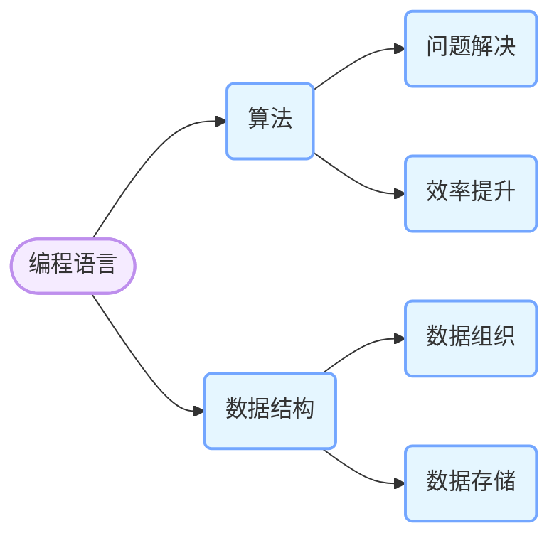

# 未来社会中的编程：人人必备的新技能

> 关键词：未来社会、编程技能、数字化生活、人工智能、自动化、创新能力、职业发展

> 摘要：本文围绕未来社会中编程成为人人必备新技能这一主题展开深入探讨。首先介绍了研究的背景、目的、预期读者等内容。接着阐述了编程的核心概念与联系，包括其原理和架构。详细讲解了核心算法原理及具体操作步骤，并结合数学模型和公式进行说明。通过项目实战展示代码案例并进行解读。分析了编程在实际应用中的多个场景。推荐了学习编程的工具和资源，涵盖书籍、在线课程、开发工具等。最后总结了编程在未来的发展趋势与挑战，还提供了常见问题解答和扩展阅读资料，旨在帮助读者全面了解编程在未来社会的重要性和学习方法。

## 1. 背景介绍 
### 1.1 目的和范围
在当今数字化飞速发展的时代，编程已经逐渐渗透到社会的各个角落。本文章的目的在于深入探讨编程为何会在未来社会成为人人必备的新技能，分析编程技能的重要性、应用场景以及学习方法等方面。范围涵盖了编程的基础概念、核心算法、数学模型，通过实际项目案例展示编程的实际应用，同时介绍学习编程所需的工具和资源，为读者全面了解编程在未来社会的地位和作用提供参考。

### 1.2 预期读者
本文预期读者广泛，包括对未来科技发展趋势感兴趣的普通大众、想要提升自身技能的职场人士、对编程有初步了解并希望深入学习的初学者，以及关注教育变革和人才培养的教育工作者等。无论是否具备编程基础，都能从本文中获取有价值的信息。

### 1.3 文档结构概述
本文将按照以下结构进行阐述：首先介绍编程相关的背景知识，包括目的、读者群体和文档结构等。接着深入讲解编程的核心概念与联系，通过示意图和流程图展示其原理和架构。随后详细介绍核心算法原理和具体操作步骤，并结合Python代码进行说明。再引入数学模型和公式，进一步解释编程中的数学原理。通过项目实战，展示代码案例并进行详细解读。分析编程在实际生活中的应用场景。推荐学习编程的工具和资源，包括书籍、在线课程、开发工具等。最后总结编程在未来的发展趋势与挑战，提供常见问题解答和扩展阅读资料。

### 1.4 术语表
#### 1.4.1 核心术语定义
- **编程**：是指使用特定的编程语言，按照一定的规则和逻辑，编写指令序列，让计算机执行特定任务的过程。
- **算法**：是解决特定问题的一系列明确的、有限的操作步骤。
- **数据结构**：是指相互之间存在一种或多种特定关系的数据元素的集合，用于组织和存储数据。
- **编程语言**：是用于人与计算机之间进行交流的语言，如Python、Java、C++等。

#### 1.4.2 相关概念解释
- **代码**：是程序员编写的指令序列，是编程的具体表现形式。
- **调试**：是指查找和修复代码中存在的错误，确保程序能够正常运行的过程。
- **开源**：是指软件的源代码可以被公开查看、修改和分发的一种软件开发模式。

#### 1.4.3 缩略词列表
- **IDE**：Integrated Development Environment，集成开发环境，是一种用于开发软件的应用程序，提供了代码编辑、编译、调试等功能。
- **API**：Application Programming Interface，应用程序编程接口，是一组用于不同软件组件之间进行交互的规范和协议。
- **AI**：Artificial Intelligence，人工智能，是指让计算机模拟人类智能的技术。

## 2. 核心概念与联系 

### 编程的核心概念
编程的核心概念主要包括编程语言、算法和数据结构。编程语言是程序员与计算机交流的工具，不同的编程语言有不同的语法和特点，适用于不同的应用场景。算法是解决问题的步骤和方法，它决定了程序的效率和正确性。数据结构则是组织和存储数据的方式，合理的数据结构可以提高程序的性能。

### 编程概念之间的联系
编程语言为算法和数据结构的实现提供了平台。程序员使用编程语言来编写算法，将算法转化为计算机可以执行的代码。同时，数据结构也是通过编程语言来实现的，不同的数据结构在不同的编程语言中有不同的实现方式。算法的设计和实现离不开合适的数据结构，而数据结构的选择也会影响算法的效率。

### 编程原理和架构的文本示意图
```plaintext
              编程语言
            /           \
         算法            数据结构
        /   \          /    \
  问题解决  效率提升  数据组织  数据存储
```

### Mermaid 流程图


## 3. 核心算法原理 & 具体操作步骤 

### 算法的基本概念
算法是解决特定问题的一系列明确的、有限的操作步骤。一个好的算法应该具有正确性、可读性、效率高和资源占用少等特点。常见的算法类型包括排序算法、搜索算法、图算法等。

### 排序算法 - 冒泡排序
#### 算法原理
冒泡排序是一种简单的排序算法，它重复地走访过要排序的数列，一次比较两个元素，如果它们的顺序错误就把它们交换过来。走访数列的工作是重复地进行直到没有再需要交换，也就是说该数列已经排序完成。

#### Python 代码实现
```python
def bubble_sort(arr):
    n = len(arr)
    for i in range(n):
        for j in range(0, n - i - 1):
            if arr[j] > arr[j + 1]:
                arr[j], arr[j + 1] = arr[j + 1], arr[j]
    return arr

# 测试代码
arr = [64, 34, 25, 12, 22, 11, 90]
sorted_arr = bubble_sort(arr)
print("排序后的数组:", sorted_arr)
```

#### 具体操作步骤
1. 比较相邻的元素。如果第一个比第二个大，就把它们交换。
2. 对每一对相邻元素作同样的工作，从开始第一对到结尾的最后一对。这步做完后，最后的元素会是最大的数。
3. 针对所有的元素重复以上的步骤，除了最后一个。
4. 持续每次对越来越少的元素重复上面的步骤，直到没有任何一对数字需要比较。

### 搜索算法 - 二分搜索
#### 算法原理
二分搜索是一种在有序数组中查找特定元素的搜索算法。它每次将搜索范围缩小一半，直到找到目标元素或确定目标元素不存在。

#### Python 代码实现
```python
def binary_search(arr, target):
    left, right = 0, len(arr) - 1
    while left <= right:
        mid = (left + right) // 2
        if arr[mid] == target:
            return mid
        elif arr[mid] < target:
            left = mid + 1
        else:
            right = mid - 1
    return -1

# 测试代码
arr = [2, 5, 8, 12, 16, 23, 38, 56, 72, 91]
target = 23
result = binary_search(arr, target)
if result != -1:
    print(f"元素 {target} 在数组中的索引是 {result}")
else:
    print(f"元素 {target} 不在数组中")
```

#### 具体操作步骤
1. 确定数组的中间位置。
2. 将中间位置的元素与目标元素进行比较。
3. 如果中间元素等于目标元素，则返回中间位置的索引。
4. 如果中间元素小于目标元素，则在右半部分继续搜索。
5. 如果中间元素大于目标元素，则在左半部分继续搜索。
6. 重复步骤1 - 5，直到找到目标元素或搜索范围为空。

## 4. 数学模型和公式 & 详细讲解 & 举例说明 

### 时间复杂度和空间复杂度
#### 数学模型和公式
在算法分析中，时间复杂度和空间复杂度是衡量算法效率的重要指标。时间复杂度表示算法执行所需的时间随输入规模增长的变化趋势，通常用大O表示法来描述。空间复杂度表示算法执行所需的额外存储空间随输入规模增长的变化趋势。

常见的时间复杂度有：
- 常数时间复杂度：$O(1)$，表示算法的执行时间不随输入规模的变化而变化。
- 线性时间复杂度：$O(n)$，表示算法的执行时间与输入规模成正比。
- 对数时间复杂度：$O(\log n)$，表示算法的执行时间随输入规模的对数增长。
- 平方时间复杂度：$O(n^2)$，表示算法的执行时间与输入规模的平方成正比。

#### 详细讲解
以冒泡排序为例，其时间复杂度为$O(n^2)$。在最坏情况下，需要进行$n(n - 1)/2$次比较和交换操作，因此时间复杂度为$O(n^2)$。而二分搜索的时间复杂度为$O(\log n)$，因为每次搜索都将搜索范围缩小一半。

#### 举例说明
假设我们有一个长度为$n$的数组，使用冒泡排序对其进行排序。在最坏情况下，需要进行的比较次数为：
$$
\frac{n(n - 1)}{2} = \frac{n^2 - n}{2}
$$
当$n$很大时，$n^2$的增长速度远远快于$n$，因此可以忽略$n$的影响，冒泡排序的时间复杂度可以近似为$O(n^2)$。

对于二分搜索，每次搜索将搜索范围缩小一半，设搜索次数为$k$，则有$n/2^k = 1$，解得$k = \log_2 n$，因此二分搜索的时间复杂度为$O(\log n)$。

### 概率算法中的数学模型
#### 数学模型和公式
在概率算法中，常常会用到概率和期望的概念。设随机变量$X$的取值为$x_1, x_2, \cdots, x_n$，对应的概率为$p_1, p_2, \cdots, p_n$，则$X$的期望$E(X)$定义为：
$$
E(X) = \sum_{i = 1}^{n} x_i p_i
$$

#### 详细讲解
期望表示随机变量的平均取值。在概率算法中，我们可以通过计算期望来评估算法的性能。例如，在随机化快速排序中，每次选择一个随机的基准元素，通过计算期望可以证明其平均时间复杂度为$O(n \log n)$。

#### 举例说明
假设有一个抽奖活动，中奖的概率为$p = 0.1$，中奖可以获得奖金$100$元，不中奖则没有奖金。设随机变量$X$表示中奖获得的奖金，则$X$的取值为$100$（中奖）和$0$（不中奖），对应的概率分别为$p = 0.1$和$1 - p = 0.9$。根据期望的定义，可得：
$$
E(X) = 100 \times 0.1 + 0 \times 0.9 = 10
$$
这表示参加这个抽奖活动平均可以获得$10$元的奖金。

## 5. 项目实战：代码实际案例和详细解释说明 

### 5.1  开发环境搭建
#### 选择编程语言
在本项目实战中，我们选择Python作为开发语言。Python是一种简单易学、功能强大的编程语言，具有丰富的库和框架，适用于各种应用场景。

#### 安装Python
可以从Python官方网站（https://www.python.org/downloads/）下载适合自己操作系统的Python安装包，然后按照安装向导进行安装。

#### 选择集成开发环境（IDE）
推荐使用PyCharm作为开发环境。PyCharm是一款专门为Python开发设计的IDE，提供了代码编辑、调试、自动补全、代码分析等功能。可以从JetBrains官方网站（https://www.jetbrains.com/pycharm/download/）下载并安装PyCharm。

### 5.2  源代码详细实现和代码解读
#### 项目需求
我们要实现一个简单的学生信息管理系统，该系统可以实现学生信息的添加、查询、修改和删除功能。

#### 源代码实现
```python
# 定义学生类
class Student:
    def __init__(self, id, name, age):
        self.id = id
        self.name = name
        self.age = age

    def __str__(self):
        return f"学号: {self.id}, 姓名: {self.name}, 年龄: {self.age}"

# 定义学生信息管理系统类
class StudentManagementSystem:
    def __init__(self):
        self.students = []

    # 添加学生信息
    def add_student(self, student):
        self.students.append(student)
        print("学生信息添加成功！")

    # 查询学生信息
    def query_student(self, id):
        for student in self.students:
            if student.id == id:
                print(student)
                return
        print("未找到该学生信息！")

    # 修改学生信息
    def modify_student(self, id, name, age):
        for student in self.students:
            if student.id == id:
                student.name = name
                student.age = age
                print("学生信息修改成功！")
                return
        print("未找到该学生信息，无法修改！")

    # 删除学生信息
    def delete_student(self, id):
        for student in self.students:
            if student.id == id:
                self.students.remove(student)
                print("学生信息删除成功！")
                return
        print("未找到该学生信息，无法删除！")

# 主程序
if __name__ == "__main__":
    sms = StudentManagementSystem()
    while True:
        print("\n学生信息管理系统")
        print("1. 添加学生信息")
        print("2. 查询学生信息")
        print("3. 修改学生信息")
        print("4. 删除学生信息")
        print("5. 退出系统")
        choice = input("请输入你的选择: ")
        if choice == "1":
            id = input("请输入学号: ")
            name = input("请输入姓名: ")
            age = input("请输入年龄: ")
            student = Student(id, name, age)
            sms.add_student(student)
        elif choice == "2":
            id = input("请输入要查询的学号: ")
            sms.query_student(id)
        elif choice == "3":
            id = input("请输入要修改信息的学号: ")
            name = input("请输入新的姓名: ")
            age = input("请输入新的年龄: ")
            sms.modify_student(id, name, age)
        elif choice == "4":
            id = input("请输入要删除信息的学号: ")
            sms.delete_student(id)
        elif choice == "5":
            print("退出系统，再见！")
            break
        else:
            print("输入无效，请重新输入！")
```

#### 代码解读
1. **Student类**：定义了学生的基本信息，包括学号、姓名和年龄。`__init__`方法用于初始化学生对象，`__str__`方法用于返回学生信息的字符串表示。
2. **StudentManagementSystem类**：
    - `__init__`方法：初始化一个空的学生列表。
    - `add_student`方法：将学生对象添加到学生列表中，并输出添加成功的信息。
    - `query_student`方法：根据学号在学生列表中查找学生信息，如果找到则输出学生信息，否则输出未找到的信息。
    - `modify_student`方法：根据学号在学生列表中查找学生信息，如果找到则修改学生的姓名和年龄，并输出修改成功的信息，否则输出未找到的信息。
    - `delete_student`方法：根据学号在学生列表中查找学生信息，如果找到则将该学生信息从列表中删除，并输出删除成功的信息，否则输出未找到的信息。
3. **主程序**：创建一个`StudentManagementSystem`对象，通过一个无限循环显示菜单，根据用户的选择调用相应的方法，直到用户选择退出系统。

### 5.3  代码解读与分析
#### 优点
- **代码结构清晰**：通过将学生信息和管理系统分别封装在不同的类中，提高了代码的可读性和可维护性。
- **功能完整**：实现了学生信息的添加、查询、修改和删除功能，满足了基本的学生信息管理需求。
- **用户交互友好**：通过菜单的方式让用户选择操作，提高了用户体验。

#### 缺点
- **数据存储问题**：学生信息仅存储在内存中，程序退出后数据会丢失。可以考虑将数据存储到文件或数据库中。
- **错误处理不足**：对于用户输入的合法性没有进行充分的检查，可能会导致程序出现异常。可以添加输入验证逻辑来增强程序的健壮性。

## 6. 实际应用场景 
### 数字化生活
在未来社会，编程将深入到我们的日常生活中。例如，智能家居系统可以通过编程实现自动化控制，用户可以通过手机应用程序远程控制家里的电器设备，如灯光、空调、窗帘等。智能健康监测设备可以通过编程对用户的健康数据进行分析和处理，及时提醒用户关注自己的健康状况。

### 商业领域
在商业领域，编程可以用于数据分析、市场预测、客户关系管理等方面。通过编程可以对大量的商业数据进行挖掘和分析，帮助企业做出更明智的决策。例如，电商平台可以通过编程实现个性化推荐系统，根据用户的浏览历史和购买记录为用户推荐合适的商品，提高用户的购买转化率。

### 教育领域
编程教育已经逐渐成为教育领域的重要组成部分。通过学习编程，学生可以培养逻辑思维能力、创新能力和解决问题的能力。在学校中，可以开设编程课程，让学生从小接触编程知识。此外，编程还可以用于开发教育软件和在线学习平台，为学生提供更加丰富和个性化的学习资源。

### 科研领域
在科研领域，编程是进行数据处理、模型模拟和实验分析的重要工具。科研人员可以使用编程来编写算法，对实验数据进行处理和分析，验证科研假设。例如，在物理学中，编程可以用于模拟天体运动；在生物学中，编程可以用于分析基因序列数据。

### 娱乐领域
编程在娱乐领域也有广泛的应用。游戏开发是编程的一个重要应用方向，通过编程可以实现各种类型的游戏，如角色扮演游戏、射击游戏、策略游戏等。此外，虚拟现实（VR）和增强现实（AR）技术也离不开编程，通过编程可以创建沉浸式的虚拟体验和增强现实场景。

## 7. 工具和资源推荐
### 7.1 学习资源推荐
#### 7.1.1 书籍推荐
- 《Python编程：从入门到实践》：这本书适合Python初学者，通过实际项目案例引导读者学习Python编程的基础知识和应用。
- 《算法导论》：经典的算法书籍，全面介绍了各种算法的原理、分析和应用，适合有一定编程基础的读者深入学习算法。
- 《代码大全》：涵盖了软件开发的各个方面，包括代码设计、编码规范、调试技巧等，是一本软件开发的百科全书。

#### 7.1.2 在线课程
- Coursera：提供了众多知名大学和机构的编程课程，如Python、Java、数据结构等，课程质量高，学习资源丰富。
- edX：与全球顶尖高校合作，推出了一系列编程相关的在线课程，课程内容涵盖了编程基础、人工智能、机器学习等领域。
- 中国大学MOOC：国内知名的在线学习平台，提供了大量国内高校的编程课程，适合国内学习者。

#### 7.1.3 技术博客和网站
- 博客园：国内知名的技术博客平台，有许多程序员分享自己的编程经验和技术心得。
- 开源中国：提供了丰富的开源项目资源和技术文章，关注开源技术的发展动态。
- Stack Overflow：全球最大的程序员问答社区，遇到编程问题可以在这里查找解决方案。

### 7.2 开发工具框架推荐
#### 7.2.1 IDE和编辑器
- PyCharm：专为Python开发设计的集成开发环境，功能强大，提供了代码编辑、调试、自动补全、代码分析等功能。
- Visual Studio Code：一款轻量级的代码编辑器，支持多种编程语言，具有丰富的插件生态系统，可以根据需要进行扩展。
- IntelliJ IDEA：Java开发的首选IDE，提供了强大的代码智能提示、调试和重构功能。

#### 7.2.2 调试和性能分析工具
- pdb：Python自带的调试器，可以帮助程序员查找和修复代码中的错误。
- Py-Spy：用于Python代码的性能分析工具，可以分析代码的运行时间和内存使用情况。
- VisualVM：Java应用程序的性能分析工具，可以监控Java程序的CPU、内存、线程等情况。

#### 7.2.3 相关框架和库
- Django：Python的一个高级Web开发框架，提供了丰富的功能和工具，适合快速开发大型Web应用。
- Flask：轻量级的Python Web开发框架，简单易用，适合初学者和小型项目。
- TensorFlow：Google开发的开源机器学习框架，广泛应用于深度学习领域。

### 7.3 相关论文著作推荐
#### 7.3.1 经典论文
- 《A Mathematical Theory of Communication》：香农的经典论文，奠定了信息论的基础。
- 《The Structure of Scientific Revolutions》：库恩的著作，提出了科学革命的范式转换理论，对科学研究方法产生了深远影响。
- 《The Mythical Man-Month》：布鲁克斯的经典著作，探讨了软件开发项目管理中的问题和挑战。

#### 7.3.2 最新研究成果
- 在IEEE Xplore、ACM Digital Library等学术数据库中可以查找编程、人工智能、机器学习等领域的最新研究论文。
- 关注顶级学术会议，如ACM SIGPLAN、IEEE ICML等，了解最新的研究动态和成果。

#### 7.3.3 应用案例分析
- 《Lean Software Development: An Agile Toolkit》：介绍了精益软件开发的方法和工具，通过实际案例分析展示了如何提高软件开发的效率和质量。
- 《Building Microservices》：深入探讨了微服务架构的设计和实现，通过实际案例分析了微服务在企业级应用中的应用。

## 8. 总结：未来发展趋势与挑战
### 未来发展趋势
#### 人工智能与编程的深度融合
未来，人工智能将与编程更加紧密地结合。编程将成为开发人工智能系统的重要手段，同时人工智能技术也将为编程带来新的工具和方法。例如，自动代码生成技术可以根据需求自动生成代码，提高编程效率；智能编程助手可以根据程序员的输入提供代码建议和错误提示。

#### 低代码/无代码开发平台的兴起
低代码/无代码开发平台将降低编程的门槛，让更多非专业程序员也能够参与到软件开发中来。这些平台通过可视化的界面和拖拽式的操作，让用户可以快速创建应用程序，无需编写大量的代码。这将推动编程技能的普及，使得编程成为更多人在工作和生活中可以使用的工具。

#### 量子编程的发展
随着量子计算机技术的不断发展，量子编程将成为未来的一个重要研究方向。量子编程利用量子比特的特性，可以实现传统计算机无法完成的计算任务，如量子模拟、量子优化等。虽然目前量子编程还处于起步阶段，但未来有望在密码学、药物研发、金融等领域取得重要应用。

### 挑战
#### 技术更新换代快
编程领域的技术更新换代非常快，新的编程语言、框架和工具不断涌现。程序员需要不断学习和更新自己的知识，以跟上技术发展的步伐。这对于个人的学习能力和适应能力提出了很高的要求。

#### 安全问题
随着编程技术在各个领域的广泛应用，软件安全问题日益突出。恶意软件、网络攻击、数据泄露等安全事件频繁发生，给个人、企业和社会带来了巨大的损失。程序员需要具备安全意识，掌握安全编程的方法和技术，确保软件系统的安全性。

#### 人才短缺
随着编程在未来社会的重要性不断提升，对编程人才的需求也将越来越大。然而，目前全球范围内编程人才短缺的问题依然存在。培养更多优秀的编程人才需要教育机构、企业和社会的共同努力。

## 9. 附录：常见问题与解答
### 编程难学吗？
编程的难度因人而异。对于有一定逻辑思维能力和数学基础的人来说，学习编程可能相对容易一些。但是，编程是一门需要不断实践和积累的技能，需要花费一定的时间和精力去学习和练习。只要有耐心和毅力，通过系统的学习和实践，大多数人都可以掌握编程技能。

### 学习编程需要具备哪些基础知识？
学习编程需要具备一定的数学基础，如代数、逻辑、概率等。此外，还需要具备一定的英语基础，因为编程中的许多术语和文档都是用英语编写的。不过，这些基础知识并不是学习编程的绝对障碍，在学习过程中可以逐步补充和提高。

### 如何选择适合自己的编程语言？
选择适合自己的编程语言需要考虑多个因素，如学习目的、应用场景、个人兴趣等。如果是初学者，建议选择Python、JavaScript等简单易学的编程语言。如果是从事Web开发，可以选择Python（Django、Flask）、Java（Spring）等；如果是从事数据科学和机器学习，可以选择Python（TensorFlow、PyTorch）等。

### 编程可以带来哪些职业发展机会？
编程可以带来丰富的职业发展机会，如软件开发工程师、数据分析师、人工智能工程师、游戏开发工程师等。随着编程技能的不断提高和经验的积累，还可以晋升为技术经理、架构师等管理职位。此外，编程技能也可以为创业者提供技术支持，帮助他们实现自己的创业梦想。

## 10. 扩展阅读 & 参考资料
### 扩展阅读
- 《未来简史：从智人到神人》：探讨了未来科技发展对人类社会的影响，包括编程、人工智能等技术的发展趋势。
- 《人类简史：从动物到上帝》：从人类进化的角度，分析了人类如何通过技术创新改变自己的命运，对理解编程在人类发展中的作用有一定的启示。
- 《创新者：一群技术狂人和鬼才程序员如何改变世界》：讲述了计算机和互联网发展历程中的创新故事，展示了编程在推动科技进步中的重要作用。

### 参考资料
- Python官方文档（https://docs.python.org/）
- Java官方文档（https://docs.oracle.com/javase/）
- IEEE Xplore（https://ieeexplore.ieee.org/）
- ACM Digital Library（https://dl.acm.org/）