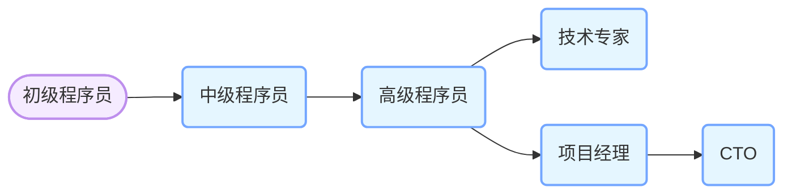

# 未来程序员的职业路径与发展方向

> 关键词：程序员、职业路径、发展方向、技术趋势、职业转型

> 摘要：本文深入探讨了未来程序员的职业路径与发展方向。首先介绍了研究的背景和目的，包括帮助程序员更好规划职业等。接着阐述了程序员职业发展相关的核心概念，如不同技术领域和职业阶段的特点。详细分析了关键算法原理和具体操作步骤，为程序员提升技术能力提供指导。通过数学模型和公式进一步解释了职业发展中的一些规律。给出了项目实战案例，包括环境搭建、代码实现与解读。探讨了实际应用场景，如不同行业对程序员的需求。推荐了学习资源、开发工具和相关论文著作。最后总结了未来发展趋势与挑战，并解答了常见问题，为程序员的职业发展提供了全面且具有前瞻性的参考。

## 1. 背景介绍 
### 1.1 目的和范围
随着信息技术的飞速发展，软件行业正经历着前所未有的变革。程序员作为这个行业的核心力量，其职业路径和发展方向也在不断演变。本文的目的在于为广大程序员提供一个全面、深入且具有前瞻性的职业规划指南，帮助他们更好地理解未来的发展趋势，选择适合自己的职业道路。

我们的研究范围涵盖了多个层面。从技术领域来看，包括但不限于人工智能、大数据、云计算、区块链等新兴技术，以及传统的软件开发领域，如移动应用开发、Web开发等。在职业路径方面，我们将探讨从初级程序员到高级程序员、技术专家、项目经理、CTO等不同层级的发展路径，同时也会涉及到跨领域转型和创业等可能性。

### 1.2 预期读者
本文主要面向广大程序员群体，无论是刚踏入编程领域的新手，还是有一定经验的中级程序员，甚至是寻求职业突破的高级开发者，都能从本文中获得有价值的信息。此外，对于计算机相关专业的学生、职业规划师以及对软件行业感兴趣的人士，本文也具有一定的参考意义。

### 1.3 文档结构概述
本文将按照以下结构展开：首先介绍核心概念，帮助读者了解程序员职业发展的基本框架；接着深入探讨核心算法原理和具体操作步骤，为技术提升提供指导；通过数学模型和公式进一步分析职业发展中的规律；给出项目实战案例，展示如何将理论应用于实际；探讨实际应用场景，明确不同行业对程序员的需求；推荐学习资源、开发工具和相关论文著作，助力程序员不断学习和成长；最后总结未来发展趋势与挑战，解答常见问题，并提供扩展阅读和参考资料。

### 1.4 术语表
#### 1.4.1 核心术语定义
- **程序员**：指从事程序设计、开发和维护的专业人员，通过编写代码来实现各种软件系统和应用程序。
- **职业路径**：指个人在职业生涯中所经历的一系列职位和阶段，包括晋升、转型等发展轨迹。
- **技术栈**：指程序员在开发过程中所使用的一系列技术和工具的集合，如编程语言、框架、数据库等。
- **全栈开发**：指能够同时掌握前端和后端开发技术，独立完成一个完整的软件项目的开发。
- **领域专家**：指在某个特定技术领域具有深入专业知识和丰富实践经验的专家。

#### 1.4.2 相关概念解释
- **人工智能（AI）**：是一门研究如何使计算机能够模拟人类智能的学科，包括机器学习、深度学习、自然语言处理等技术。
- **大数据**：指海量、高增长率和多样化的信息资产，需要新处理模式才能具有更强的决策力、洞察发现力和流程优化能力。
- **云计算**：是一种基于互联网的计算方式，通过将计算资源、存储资源等提供给用户，实现资源的共享和按需使用。
- **区块链**：是一种分布式账本技术，具有去中心化、不可篡改、安全可靠等特点，广泛应用于金融、供应链等领域。

#### 1.4.3 缩略词列表
- **AI**：Artificial Intelligence（人工智能）
- **ML**：Machine Learning（机器学习）
- **DL**：Deep Learning（深度学习）
- **NLP**：Natural Language Processing（自然语言处理）
- **Big Data**：大数据
- **Cloud Computing**：云计算
- **Blockchain**：区块链

## 2. 核心概念与联系 
### 核心概念原理
程序员的职业发展可以看作是一个不断积累知识和技能、提升能力和影响力的过程。这个过程通常可以分为几个不同的阶段，每个阶段都有其特定的目标和要求。

#### 初级程序员阶段
初级程序员通常刚刚从学校毕业或进入编程领域不久，主要负责编写简单的代码，实现一些基本的功能。在这个阶段，重点是学习编程语言、开发工具和基本的算法，掌握软件开发的基本流程和规范。

#### 中级程序员阶段
中级程序员已经具备了一定的编程经验，能够独立完成一些复杂的模块开发。他们开始关注代码的性能、可维护性和可扩展性，学习设计模式和架构思想，提高自己的技术水平。

#### 高级程序员阶段
高级程序员在技术上已经达到了较高的水平，能够带领团队完成大型项目的开发。他们不仅精通多种技术栈，还具备良好的问题解决能力和团队协作能力。在这个阶段，他们开始关注行业趋势和技术创新，为公司的技术发展提供战略建议。

#### 技术专家阶段
技术专家是某个特定技术领域的权威，他们在该领域具有深入的研究和丰富的实践经验。技术专家通常会参与行业标准的制定和技术创新的研究，为公司和行业的发展做出重要贡献。

#### 项目经理阶段
项目经理负责项目的整体规划、组织、协调和控制，确保项目按时、按质量要求完成。项目经理需要具备良好的沟通能力、团队管理能力和项目管理经验，同时也需要对技术有一定的了解。

#### CTO阶段
CTO（首席技术官）是公司技术战略的制定者和执行者，负责公司的技术研发、创新和团队建设。CTO需要具备广阔的技术视野、敏锐的市场洞察力和卓越的领导能力，能够带领团队推动公司的技术发展。

### 架构的文本示意图
```plaintext
初级程序员 -> 中级程序员 -> 高级程序员 -> 技术专家
                                      |
                                      v
                                   项目经理
                                      |
                                      v
                                     CTO
```

### Mermaid 流程图


## 3. 核心算法原理 & 具体操作步骤 
### 算法原理讲解
在程序员的职业发展中，我们可以将其看作是一个不断优化和提升的过程，类似于算法中的迭代优化。以下是一个简单的Python代码示例，模拟了程序员职业发展的过程：

```python
class Programmer:
    def __init__(self, level=1, skills=[]):
        self.level = level
        self.skills = skills
        self.experience = 0

    def learn_skill(self, skill):
        if skill not in self.skills:
            self.skills.append(skill)
            print(f"学会了新技能: {skill}")
        else:
            print(f"已经掌握了技能: {skill}")

    def gain_experience(self, exp):
        self.experience += exp
        print(f"获得了 {exp} 点经验值，当前经验值: {self.experience}")
        if self.experience >= self.level * 100:
            self.level_up()

    def level_up(self):
        self.level += 1
        self.experience = 0
        print(f"恭喜升级到等级 {self.level}!")

# 创建一个初级程序员实例
programmer = Programmer()

# 学习新技能
programmer.learn_skill("Python")
programmer.learn_skill("Java")

# 获得经验值
programmer.gain_experience(80)
programmer.gain_experience(30)
```

### 具体操作步骤
#### 初级程序员阶段
- **学习基础知识**：选择一门编程语言，如Python、Java、C++等，深入学习其语法、数据结构和算法。同时，学习开发工具，如IDE（集成开发环境）、版本控制系统（如Git）等。
- **实践项目**：通过完成一些小型的编程项目，如控制台应用程序、Web页面等，巩固所学的知识，提高编程能力。
- **阅读优秀代码**：学习其他优秀程序员的代码，了解代码的规范和最佳实践，提高代码质量。

#### 中级程序员阶段
- **深入学习技术**：学习更高级的技术，如数据库管理、网络编程、设计模式等，拓宽自己的技术视野。
- **参与团队项目**：加入团队，与其他程序员合作完成大型项目，学习团队协作和项目管理的经验。
- **解决实际问题**：在项目中遇到问题时，通过查阅资料、请教他人等方式解决问题，提高自己的问题解决能力。

#### 高级程序员阶段
- **掌握多种技术栈**：学习不同的技术栈，如前端开发、后端开发、移动端开发等，成为全栈开发者。
- **带领团队**：担任团队负责人，带领团队完成项目，培养团队管理能力和领导能力。
- **关注行业趋势**：关注行业的最新动态和技术趋势，学习新兴技术，为公司的技术发展提供建议。

#### 技术专家阶段
- **深入研究特定领域**：选择一个特定的技术领域，如人工智能、大数据等，深入研究该领域的理论和技术，成为该领域的专家。
- **发表论文和演讲**：在行业会议和学术期刊上发表论文和演讲，分享自己的研究成果和经验，提高自己的知名度和影响力。
- **参与行业标准制定**：参与行业标准的制定和技术规范的编写，为行业的发展做出贡献。

#### 项目经理阶段
- **学习项目管理知识**：学习项目管理的理论和方法，如项目计划、进度控制、风险管理等，考取相关的项目管理证书，如PMP（项目管理专业人士资格认证）。
- **管理项目团队**：负责项目团队的组建、培训和管理，协调团队成员之间的工作，确保项目按时、按质量要求完成。
- **与客户沟通**：与客户保持良好的沟通，了解客户的需求和期望，及时反馈项目进展情况，解决客户的问题。

#### CTO阶段
- **制定技术战略**：根据公司的业务目标和市场需求，制定公司的技术战略和发展规划，确定技术研发的方向和重点。
- **领导技术团队**：领导公司的技术团队，吸引和培养优秀的技术人才，建立高效的技术研发体系。
- **推动技术创新**：关注行业的技术创新趋势，推动公司的技术创新和产品升级，提高公司的核心竞争力。

## 4. 数学模型和公式 & 详细讲解 & 举例说明 
### 职业发展速度模型
我们可以用一个简单的数学模型来描述程序员的职业发展速度。假设程序员的职业发展水平 $L$ 与学习时间 $t$、学习效率 $e$ 和经验积累 $x$ 有关，可以表示为：

$$L = f(t, e, x)$$

为了简化模型，我们假设职业发展水平与学习时间、学习效率和经验积累成正比，即：

$$L = k_1 \cdot t \cdot e + k_2 \cdot x$$

其中，$k_1$ 和 $k_2$ 是常数，分别表示学习时间和经验积累对职业发展水平的影响权重。

### 详细讲解
- **学习时间 $t$**：指程序员用于学习新知识和技能的时间。学习时间越长，掌握的知识和技能就越多，职业发展水平也就越高。
- **学习效率 $e$**：指程序员在学习过程中的效率。学习效率高的程序员能够更快地掌握新知识和技能，从而提高职业发展速度。
- **经验积累 $x$**：指程序员在实际项目中积累的经验。经验积累越多，解决问题的能力就越强，职业发展水平也就越高。

### 举例说明
假设程序员A和程序员B的学习效率相同，$e = 0.8$，经验积累的影响权重 $k_2 = 0.5$。程序员A每周学习10小时，经验积累为20；程序员B每周学习20小时，经验积累为10。学习时间的影响权重 $k_1 = 0.3$。

则程序员A的职业发展水平为：

$$L_A = 0.3 \times 10 \times 0.8 + 0.5 \times 20 = 2.4 + 10 = 12.4$$

程序员B的职业发展水平为：

$$L_B = 0.3 \times 20 \times 0.8 + 0.5 \times 10 = 4.8 + 5 = 9.8$$

从这个例子可以看出，虽然程序员B的学习时间比程序员A多，但由于经验积累较少，职业发展水平反而不如程序员A。因此，在职业发展过程中，不仅要注重学习时间，还要注重经验积累。

## 5. 项目实战：代码实际案例和详细解释说明 
### 5.1  开发环境搭建
#### 选择编程语言和框架
假设我们要开发一个简单的Web应用程序，我们选择Python作为编程语言，Flask作为Web框架。

#### 安装Python和Flask
首先，从Python官方网站（https://www.python.org/downloads/）下载并安装Python。安装完成后，打开命令行工具，使用以下命令安装Flask：

```bash
pip install flask
```

#### 创建项目目录
在本地创建一个项目目录，例如 `my_web_app`，并在该目录下创建一个Python文件，例如 `app.py`。

### 5.2  源代码详细实现和代码解读
以下是一个简单的Flask Web应用程序的代码示例：

```python
from flask import Flask

# 创建Flask应用实例
app = Flask(__name__)

# 定义路由和视图函数
@app.route('/')
def hello_world():
    return 'Hello, World!'

if __name__ == '__main__':
    # 启动应用程序
    app.run(debug=True)
```

### 代码解读与分析
- **导入Flask模块**：`from flask import Flask` 导入Flask类，用于创建Flask应用实例。
- **创建Flask应用实例**：`app = Flask(__name__)` 创建一个Flask应用实例，`__name__` 是Python的内置变量，表示当前模块的名称。
- **定义路由和视图函数**：`@app.route('/')` 定义了一个路由，当用户访问根路径 `/` 时，会调用 `hello_world` 函数。`hello_world` 函数返回一个字符串 `'Hello, World!'`。
- **启动应用程序**：`app.run(debug=True)` 启动Flask应用程序，并开启调试模式。在调试模式下，当代码发生变化时，应用程序会自动重启。

## 6. 实际应用场景 
### 互联网行业
在互联网行业，程序员的需求非常大。他们主要负责开发各种Web应用程序、移动应用程序、搜索引擎、电商平台等。随着互联网技术的不断发展，对程序员的技术要求也越来越高，如需要掌握人工智能、大数据、云计算等新兴技术。

### 金融行业
金融行业对数据的安全性和准确性要求非常高，因此需要大量的程序员来开发金融交易系统、风险管理系统、数据分析系统等。金融行业的程序员需要具备扎实的数学和统计学基础，以及对金融业务的深入理解。

### 医疗行业
医疗行业的信息化建设正在加速推进，程序员在其中发挥着重要作用。他们负责开发电子病历系统、医疗影像诊断系统、远程医疗系统等。医疗行业的程序员需要了解医疗业务流程和相关法规，确保系统的安全性和可靠性。

### 制造业
制造业正在向智能制造转型，需要程序员来开发工业自动化系统、机器人控制系统、物联网平台等。制造业的程序员需要具备机械工程、电子工程等相关领域的知识，能够将软件技术与硬件设备相结合。

### 教育行业
教育行业的数字化转型也为程序员提供了广阔的发展空间。他们负责开发在线教育平台、学习管理系统、智能教学工具等。教育行业的程序员需要了解教育教学原理和方法，能够设计出符合用户需求的教育软件。

## 7. 工具和资源推荐
### 7.1 学习资源推荐
#### 7.1.1 书籍推荐
- 《Python编程：从入门到实践》：适合Python初学者，通过大量的实例和项目，帮助读者快速掌握Python编程。
- 《Effective Java》：经典的Java编程书籍，介绍了Java编程的最佳实践和设计原则。
- 《算法导论》：算法领域的权威著作，详细介绍了各种算法的原理和实现。
- 《设计模式：可复用面向对象软件的基础》：介绍了23种常见的设计模式，帮助程序员提高代码的可维护性和可扩展性。

#### 7.1.2 在线课程
- Coursera：提供了丰富的计算机科学和编程课程，包括机器学习、深度学习、数据科学等领域。
- edX：与全球顶尖大学合作，提供高质量的在线课程，涵盖了计算机科学的各个方面。
- Udemy：拥有大量的编程课程，价格相对较低，适合不同水平的学习者。

#### 7.3.3 技术博客和网站
- Medium：有许多优秀的技术博客，涵盖了各种技术领域，如人工智能、大数据、区块链等。
- Stack Overflow：程序员的问答社区，遇到问题时可以在这里找到解决方案。
- GitHub：全球最大的开源代码托管平台，可以学习其他优秀程序员的代码。

### 7.2 开发工具框架推荐
#### 7.2.1 IDE和编辑器
- PyCharm：专业的Python集成开发环境，功能强大，适合Python开发。
- IntelliJ IDEA：优秀的Java集成开发环境，支持多种编程语言和框架。
- Visual Studio Code：轻量级的代码编辑器，支持多种编程语言和插件，非常适合快速开发。

#### 7.2.2 调试和性能分析工具
- PyCharm Debugger：PyCharm自带的调试工具，方便调试Python代码。
- VisualVM：Java性能分析工具，可以监控Java应用程序的性能和内存使用情况。
- Chrome DevTools：浏览器自带的调试工具，可用于调试Web应用程序。

#### 7.2.3 相关框架和库
- Flask：轻量级的Python Web框架，适合快速开发小型Web应用程序。
- Django：功能强大的Python Web框架，适合开发大型Web应用程序。
- React：流行的JavaScript前端框架，用于构建用户界面。

### 7.3 相关论文著作推荐
#### 7.3.1 经典论文
- 《A Mathematical Theory of Communication》：信息论的奠基之作，对计算机科学和通信技术产生了深远影响。
- 《The Structure of Scientific Revolutions》：科学哲学领域的经典著作，提出了“范式转换”的概念。
- 《The Mythical Man-Month》：软件工程领域的经典著作，探讨了软件开发中的项目管理问题。

#### 7.3.2 最新研究成果
- arXiv：一个预印本平台，提供了大量的计算机科学和相关领域的最新研究成果。
- ACM Digital Library：计算机协会的数字图书馆，收录了大量的学术论文和会议记录。
- IEEE Xplore：电气和电子工程师协会的数字图书馆，提供了丰富的计算机科学和工程领域的研究文献。

#### 7.3.3 应用案例分析
- Case Studies in Software Engineering：提供了许多软件工程项目的案例分析，帮助读者了解实际项目中的问题和解决方案。
- Harvard Business School Case Studies：哈佛商学院的案例研究，涵盖了各个行业的企业案例，对程序员了解商业需求和项目管理有很大帮助。

## 8. 总结：未来发展趋势与挑战
### 未来发展趋势
#### 新兴技术的崛起
人工智能、大数据、云计算、区块链等新兴技术将继续引领软件行业的发展。程序员需要不断学习和掌握这些新兴技术，才能在未来的职业竞争中占据优势。

#### 跨领域融合
未来的软件系统将越来越复杂，需要程序员具备跨领域的知识和技能。例如，在医疗行业，需要程序员将计算机科学与医学知识相结合；在金融行业，需要程序员将编程技术与金融业务相结合。

#### 开源和社区合作
开源软件的发展将越来越迅速，程序员将更多地参与到开源项目中。通过开源和社区合作，程序员可以学习到其他优秀程序员的经验，提高自己的技术水平，同时也可以为开源社区做出贡献。

#### 个性化和定制化需求
随着消费者需求的不断多样化，软件产品将越来越注重个性化和定制化。程序员需要能够根据用户的需求，开发出符合用户个性化需求的软件产品。

### 挑战
#### 技术更新换代快
软件行业的技术更新换代非常快，程序员需要不断学习和更新自己的知识和技能，才能跟上技术发展的步伐。这对程序员的学习能力和适应能力提出了很高的要求。

#### 竞争激烈
随着软件行业的发展，程序员的数量也在不断增加，竞争越来越激烈。程序员需要不断提高自己的技术水平和综合素质，才能在竞争中脱颖而出。

#### 工作压力大
软件项目通常有严格的时间要求和质量标准，程序员需要在有限的时间内完成任务，工作压力较大。此外，程序员还需要不断解决项目中出现的各种问题，需要具备较强的抗压能力和问题解决能力。

#### 安全和隐私问题
随着信息技术的发展，安全和隐私问题越来越受到关注。程序员需要在开发过程中注重安全和隐私保护，避免出现安全漏洞和隐私泄露问题。

## 9. 附录：常见问题与解答
### 如何选择适合自己的职业路径？
选择适合自己的职业路径需要考虑多个因素，如个人兴趣、技能水平、职业目标等。首先，要了解自己的兴趣所在，选择自己感兴趣的技术领域。其次，要评估自己的技能水平，根据自己的实际情况选择适合自己的职业阶段。最后，要明确自己的职业目标，制定合理的职业规划。

### 如何提升自己的技术水平？
提升自己的技术水平需要不断学习和实践。可以通过阅读专业书籍、参加在线课程、参与开源项目等方式学习新知识和技能。同时，要多实践，通过完成项目来巩固所学的知识，提高自己的编程能力。

### 如何应对技术更新换代快的问题？
要应对技术更新换代快的问题，需要保持学习的热情和积极性，不断关注行业的最新动态和技术趋势。可以加入技术社区，参加技术交流活动，与其他程序员分享经验和学习心得。此外，要学会快速学习和掌握新知识和技能的方法，提高自己的学习效率。

### 如何提高自己的竞争力？
提高自己的竞争力需要从多个方面入手。首先，要不断提升自己的技术水平，掌握更多的技术和工具。其次，要培养自己的软技能，如沟通能力、团队协作能力、问题解决能力等。此外，要建立自己的个人品牌，通过发表博客、参与开源项目等方式展示自己的能力和成果。

## 10. 扩展阅读 & 参考资料
### 扩展阅读
- 《软技能：代码之外的生存指南》：介绍了程序员在职业生涯中需要具备的软技能，如沟通技巧、时间管理、职业规划等。
- 《程序员的思维修炼：开发认知潜能的九堂课》：探讨了程序员如何提高自己的思维能力和学习效率。
- 《浪潮之巅》：讲述了计算机行业的发展历程和各大科技公司的兴衰，对程序员了解行业发展趋势有很大帮助。

### 参考资料
- 各编程语言官方文档，如Python官方文档、Java官方文档等。
- 各框架和库的官方文档，如Flask官方文档、Django官方文档等。
- 相关行业报告和研究机构的研究成果，如Gartner、IDC等发布的报告。