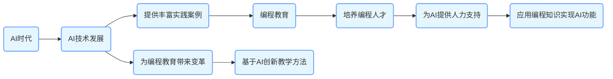

# 未来编程教育在AI时代的转型与创新

> 关键词：编程教育、AI时代、转型、创新、教育变革、人才培养、技术融合

> 摘要：本文聚焦于未来编程教育在AI时代的转型与创新这一核心主题。随着AI技术的飞速发展，编程教育面临着前所未有的变革需求。文章深入剖析了编程教育在AI时代背景下的现状与挑战，阐述了核心概念及相互联系，详细讲解了相关算法原理与操作步骤，借助数学模型进行理论支撑，并通过项目实战展示实际应用。同时探讨了编程教育在不同场景中的实际应用，推荐了相关学习资源、开发工具及论文著作。最后总结了未来发展趋势与挑战，旨在为编程教育在AI时代的转型与创新提供全面且深入的参考，以培养适应新时代需求的编程人才。

## 1. 背景介绍 
### 1.1 目的和范围
在当今AI技术蓬勃发展的时代，编程教育的重要性日益凸显。本文章的目的在于深入探讨编程教育在AI时代的转型与创新路径，旨在为教育工作者、学生、家长以及相关行业从业者提供全面且具有前瞻性的指导。范围涵盖了编程教育的各个方面，包括教育理念、教学方法、课程设置、实践应用等，同时涉及到AI技术与编程教育的深度融合。

### 1.2 预期读者
本文的预期读者包括但不限于以下几类人群：编程教育工作者，他们可以从中获取创新教学思路和方法，以改进教学实践；学生及其家长，有助于他们了解未来编程教育的发展趋势，为学生的学习规划提供参考；IT行业从业者，能从教育角度了解人才培养方向，为行业发展提供需求反馈；教育政策制定者，可依据文中观点和建议，制定更符合时代需求的编程教育政策。

### 1.3 文档结构概述
本文将按照以下结构展开：首先介绍编程教育在AI时代的背景信息，包括目的、预期读者和文档结构概述等；接着阐述核心概念与联系，通过文本示意图和Mermaid流程图呈现编程教育与AI的关系；然后讲解核心算法原理及具体操作步骤，并用Python代码详细阐述；再通过数学模型和公式进行理论分析并举例说明；之后进行项目实战，包括开发环境搭建、源代码实现与解读；随后探讨实际应用场景；接着推荐相关工具和资源；最后总结未来发展趋势与挑战，并提供常见问题解答和扩展阅读参考资料。

### 1.4 术语表
#### 1.4.1 核心术语定义
- **编程教育**：是指教授人们如何使用计算机编程语言进行程序设计和开发的教育活动，旨在培养学生的计算思维、逻辑能力和创新能力。
- **AI时代**：指人工智能技术广泛应用和快速发展的时代，其特征包括机器学习、深度学习、自然语言处理等技术的大规模应用。
- **转型**：在编程教育领域，指从传统的编程教学模式向适应AI时代需求的教学模式转变，包括教学内容、方法、评价等方面的变革。
- **创新**：指在编程教育中引入新的理念、技术和方法，以提高教育质量和效果，培养更具竞争力的编程人才。

#### 1.4.2 相关概念解释
- **计算思维**：是运用计算机科学的基础概念进行问题求解、系统设计以及人类行为理解等涵盖计算机科学之广度的一系列思维活动。在编程教育中，计算思维是培养学生解决问题能力的关键。
- **机器学习**：是一门多领域交叉学科，涉及概率论、统计学、逼近论、凸分析、算法复杂度理论等多门学科。它专门研究计算机怎样模拟或实现人类的学习行为，以获取新的知识或技能，重新组织已有的知识结构使之不断改善自身的性能。
- **深度学习**：是机器学习的一个分支领域，它是一种基于对数据进行表征学习的方法。深度学习通过构建具有很多层的神经网络模型，自动从大量数据中学习特征和模式。

#### 1.4.3 缩略词列表
- **AI**：Artificial Intelligence，人工智能
- **ML**：Machine Learning，机器学习
- **DL**：Deep Learning，深度学习

## 2. 核心概念与联系 

### 编程教育与AI时代的核心概念
在AI时代，编程教育的核心概念不再仅仅局限于传统的编程语言教学，而是更加注重培养学生的计算思维和解决实际问题的能力。编程教育成为了培养学生适应数字化社会的重要手段，通过编程，学生能够理解计算机的工作原理，学会如何利用技术来解决复杂的问题。

AI技术则是这个时代的核心驱动力，它涵盖了机器学习、深度学习、自然语言处理等多个领域。AI的发展使得计算机能够模拟人类的智能行为，实现自动化、智能化的决策和操作。

### 两者的联系
编程教育为AI的发展提供了人才基础，只有具备编程能力的人才能够开发和应用AI技术。同时，AI技术的发展也为编程教育带来了新的机遇和挑战。AI可以作为编程教育的工具，帮助学生更好地理解和掌握编程知识，例如通过智能辅导系统、自动化评测工具等。此外，AI的应用场景也为编程教育提供了丰富的实践案例，使学生能够将所学的编程知识应用到实际问题中。

### 文本示意图
```plaintext
编程教育 <----> AI时代
|                    |
| 培养编程人才       | AI技术发展
|                    |
| 为AI提供人力支持   | 为编程教育带来变革
|                    |
| 基于AI创新教学方法 | 应用编程知识实现AI功能
```

### Mermaid流程图


## 3. 核心算法原理 & 具体操作步骤 

### 核心算法原理
在编程教育与AI融合的过程中，机器学习算法是一个重要的核心内容。以简单的线性回归算法为例，它是一种用于预测连续数值的机器学习算法。其基本原理是通过寻找一条最佳的直线来拟合给定的数据点，使得数据点到直线的距离之和最小。

### Python源代码详细阐述
以下是使用Python实现简单线性回归算法的示例代码：
```python
import numpy as np
import matplotlib.pyplot as plt

# 生成一些示例数据
np.random.seed(0)
x = np.linspace(0, 10, 100)
y = 2 * x + 1 + np.random.randn(100)

# 计算均值
x_mean = np.mean(x)
y_mean = np.mean(y)

# 计算斜率和截距
numerator = np.sum((x - x_mean) * (y - y_mean))
denominator = np.sum((x - x_mean) ** 2)
slope = numerator / denominator
intercept = y_mean - slope * x_mean

# 预测值
y_pred = slope * x + intercept

# 绘制原始数据和拟合直线
plt.scatter(x, y, label='Original Data')
plt.plot(x, y_pred, color='red', label='Fitted Line')
plt.xlabel('x')
plt.ylabel('y')
plt.title('Simple Linear Regression')
plt.legend()
plt.show()
```
### 具体操作步骤
1. **数据准备**：首先需要准备好用于训练的数据集，在上述代码中，我们使用`np.linspace`生成了一个包含100个数据点的自变量`x`，并根据线性关系生成了因变量`y`，同时添加了一些随机噪声。
2. **计算均值**：计算自变量`x`和因变量`y`的均值，这是后续计算斜率和截距的基础。
3. **计算斜率和截距**：根据线性回归的公式，计算出最佳拟合直线的斜率和截距。
4. **预测值**：使用计算得到的斜率和截距，对自变量`x`进行预测，得到预测值`y_pred`。
5. **可视化结果**：使用`matplotlib`库将原始数据点和拟合直线绘制出来，直观地展示线性回归的结果。

## 4. 数学模型和公式 & 详细讲解 & 举例说明 

### 线性回归的数学模型
线性回归的数学模型可以表示为：
$$y = \beta_0 + \beta_1x + \epsilon$$
其中，$y$ 是因变量，$x$ 是自变量，$\beta_0$ 是截距，$\beta_1$ 是斜率，$\epsilon$ 是误差项，表示实际值与预测值之间的差异。

### 最小二乘法原理
线性回归的目标是找到最佳的 $\beta_0$ 和 $\beta_1$，使得误差项的平方和最小。误差项的平方和可以表示为：
$$S(\beta_0, \beta_1) = \sum_{i=1}^{n}(y_i - (\beta_0 + \beta_1x_i))^2$$
其中，$n$ 是数据点的数量，$y_i$ 是第 $i$ 个数据点的实际值，$x_i$ 是第 $i$ 个数据点的自变量值。

为了找到使得 $S(\beta_0, \beta_1)$ 最小的 $\beta_0$ 和 $\beta_1$，我们对 $S(\beta_0, \beta_1)$ 分别求关于 $\beta_0$ 和 $\beta_1$ 的偏导数，并令其等于0：
$$\frac{\partial S}{\partial \beta_0} = -2\sum_{i=1}^{n}(y_i - (\beta_0 + \beta_1x_i)) = 0$$
$$\frac{\partial S}{\partial \beta_1} = -2\sum_{i=1}^{n}(y_i - (\beta_0 + \beta_1x_i))x_i = 0$$

通过求解上述方程组，可以得到 $\beta_0$ 和 $\beta_1$ 的最优解：
$$\beta_1 = \frac{\sum_{i=1}^{n}(x_i - \bar{x})(y_i - \bar{y})}{\sum_{i=1}^{n}(x_i - \bar{x})^2}$$
$$\beta_0 = \bar{y} - \beta_1\bar{x}$$
其中，$\bar{x}$ 和 $\bar{y}$ 分别是自变量 $x$ 和因变量 $y$ 的均值。

### 举例说明
假设我们有以下数据集：
| $x$ | $y$ |
| --- | --- |
| 1 | 3 |
| 2 | 5 |
| 3 | 7 |
| 4 | 9 |
| 5 | 11 |

首先计算均值：
$\bar{x} = \frac{1 + 2 + 3 + 4 + 5}{5} = 3$
$\bar{y} = \frac{3 + 5 + 7 + 9 + 11}{5} = 7$

然后计算斜率：
$$\beta_1 = \frac{(1 - 3)(3 - 7) + (2 - 3)(5 - 7) + (3 - 3)(7 - 7) + (4 - 3)(9 - 7) + (5 - 3)(11 - 7)}{(1 - 3)^2 + (2 - 3)^2 + (3 - 3)^2 + (4 - 3)^2 + (5 - 3)^2} = 2$$

最后计算截距：
$$\beta_0 = 7 - 2 \times 3 = 1$$

因此，线性回归方程为 $y = 1 + 2x$。

## 5. 项目实战：代码实际案例和详细解释说明 

### 5.1  开发环境搭建
#### 安装Python
首先需要安装Python解释器。可以从Python官方网站（https://www.python.org/downloads/）下载适合自己操作系统的Python版本。安装过程中，建议勾选“Add Python to PATH”选项，这样可以在命令行中直接使用Python命令。

#### 安装开发工具
推荐使用PyCharm作为开发工具，它是一款功能强大的Python集成开发环境（IDE）。可以从JetBrains官方网站（https://www.jetbrains.com/pycharm/download/）下载并安装。

#### 安装必要的库
在项目中，我们需要使用`numpy`和`matplotlib`库。可以使用以下命令进行安装：
```sh
pip install numpy matplotlib
```

### 5.2  源代码详细实现和代码解读
以下是一个简单的Python项目，用于实现一个基于机器学习的手写数字识别系统。

```python
import numpy as np
from sklearn.datasets import load_digits
from sklearn.model_selection import train_test_split
from sklearn.svm import SVC
from sklearn.metrics import accuracy_score
import matplotlib.pyplot as plt

# 加载手写数字数据集
digits = load_digits()
X = digits.data
y = digits.target

# 划分训练集和测试集
X_train, X_test, y_train, y_test = train_test_split(X, y, test_size=0.2, random_state=42)

# 创建支持向量机分类器
clf = SVC()

# 训练模型
clf.fit(X_train, y_train)

# 预测测试集
y_pred = clf.predict(X_test)

# 计算准确率
accuracy = accuracy_score(y_test, y_pred)
print(f"Accuracy: {accuracy}")

# 可视化部分预测结果
fig, axes = plt.subplots(2, 5, figsize=(10, 4))
axes = axes.flatten()
for i in range(10):
    img = X_test[i].reshape(8, 8)
    axes[i].imshow(img, cmap='gray')
    axes[i].set_title(f"Pred: {y_pred[i]}")
    axes[i].axis('off')
plt.show()
```

### 5.3  代码解读与分析
1. **数据加载**：使用`sklearn.datasets.load_digits`函数加载手写数字数据集，该数据集包含1797个样本，每个样本是一个8x8的图像，代表一个手写数字。
2. **数据划分**：使用`train_test_split`函数将数据集划分为训练集和测试集，其中测试集占总数据的20%。
3. **模型创建**：使用`SVC`类创建一个支持向量机分类器。
4. **模型训练**：使用`fit`方法对模型进行训练，将训练集的特征数据`X_train`和标签数据`y_train`作为输入。
5. **模型预测**：使用`predict`方法对测试集进行预测，得到预测结果`y_pred`。
6. **准确率计算**：使用`accuracy_score`函数计算模型的准确率，即预测正确的样本数占总样本数的比例。
7. **可视化结果**：使用`matplotlib`库可视化部分预测结果，将测试集中的前10个样本的图像和预测结果展示出来。

## 6. 实际应用场景 
### 教育领域
- **个性化学习**：利用AI技术可以对学生的学习行为和能力进行分析，为每个学生提供个性化的学习路径和内容推荐。例如，智能辅导系统可以根据学生的答题情况，自动调整教学难度和内容，帮助学生更好地掌握编程知识。
- **自动化评测**：通过AI技术实现对学生编程作业的自动化评测，提高评测效率和准确性。例如，使用代码分析工具可以自动检查学生代码的语法错误、逻辑错误和代码风格，同时还可以对代码的性能进行评估。

### 企业领域
- **智能编程助手**：企业可以开发智能编程助手，帮助程序员提高编程效率。例如，智能编程助手可以根据程序员输入的代码片段，自动推荐相关的代码库、函数和代码示例，同时还可以对代码进行自动补全和错误提示。
- **AI驱动的软件开发**：将AI技术应用到软件开发过程中，实现软件的自动化测试、优化和维护。例如，使用机器学习算法可以对软件的性能数据进行分析，自动发现软件中的性能瓶颈，并提出优化建议。

### 科研领域
- **数据分析与挖掘**：在科研工作中，编程和AI技术可以用于数据分析和挖掘。例如，生物学家可以使用编程和机器学习算法对基因数据进行分析，发现基因之间的关联和规律；物理学家可以使用编程和AI技术对实验数据进行处理和分析，验证物理模型。
- **科学模拟与计算**：编程和AI技术可以用于科学模拟和计算。例如，气象学家可以使用编程和高性能计算技术对气象数据进行模拟和预测，为气象预报提供支持；天文学家可以使用编程和AI技术对天体数据进行模拟和分析，研究宇宙的演化和结构。

## 7. 工具和资源推荐
### 7.1 学习资源推荐
#### 7.1.1 书籍推荐
- 《Python编程：从入门到实践》：这本书适合初学者，通过实际项目的方式引导读者学习Python编程，内容丰富，案例生动。
- 《机器学习》（周志华著）：被称为“西瓜书”，是机器学习领域的经典教材，内容全面，讲解深入，适合有一定编程基础的读者。
- 《深度学习》（Ian Goodfellow等著）：由深度学习领域的三位顶尖专家撰写，是深度学习领域的权威著作，对深度学习的理论和实践进行了系统的介绍。

#### 7.1.2 在线课程
- Coursera上的“Python for Everybody”：由密歇根大学的教授授课，课程内容涵盖Python编程的基础知识和应用，适合初学者。
- edX上的“Introduction to Artificial Intelligence”：由麻省理工学院的教授授课，课程介绍了人工智能的基本概念、算法和应用，是学习人工智能的入门课程。
- 中国大学MOOC上的“机器学习”：由清华大学的教授授课，课程内容深入，适合有一定编程基础的学生学习。

#### 7.1.3 技术博客和网站
- 博客园：是一个技术开发者的社区，上面有很多关于编程和AI的技术文章和经验分享。
- 知乎：是一个知识问答社区，上面有很多关于编程和AI的问题和回答，可以从中获取很多有用的信息。
- Medium：是一个全球性的写作平台，上面有很多关于编程和AI的优质文章，作者来自世界各地。

### 7.2 开发工具框架推荐
#### 7.2.1 IDE和编辑器
- PyCharm：是一款功能强大的Python集成开发环境，提供了代码编辑、调试、版本控制等功能，适合专业的Python开发者。
- Visual Studio Code：是一款轻量级的代码编辑器，支持多种编程语言，具有丰富的插件生态系统，可以根据自己的需求进行扩展。
- Jupyter Notebook：是一个交互式的编程环境，适合数据科学和机器学习领域的开发者，可以实时展示代码的运行结果和可视化图表。

#### 7.2.2 调试和性能分析工具
- pdb：是Python自带的调试工具，可以在代码中设置断点，逐步执行代码，查看变量的值和程序的执行流程。
- cProfile：是Python的性能分析工具，可以分析代码的运行时间和函数调用次数，帮助开发者找出代码中的性能瓶颈。
- TensorBoard：是TensorFlow的可视化工具，可以用于可视化深度学习模型的训练过程和结果，帮助开发者更好地理解和优化模型。

#### 7.2.3 相关框架和库
- TensorFlow：是一个开源的机器学习框架，由Google开发，提供了丰富的深度学习模型和工具，支持分布式训练和部署。
- PyTorch：是一个开源的深度学习框架，由Facebook开发，具有动态计算图的特点，适合快速开发和实验。
- Scikit-learn：是一个开源的机器学习库，提供了丰富的机器学习算法和工具，包括分类、回归、聚类等，适合初学者和快速原型开发。

### 7.3 相关论文著作推荐
#### 7.3.1 经典论文
- “Gradient-Based Learning Applied to Document Recognition”（Yann LeCun等著）：这篇论文介绍了卷积神经网络（CNN）在手写数字识别中的应用，是深度学习领域的经典论文之一。
- “ImageNet Classification with Deep Convolutional Neural Networks”（Alex Krizhevsky等著）：这篇论文介绍了AlexNet网络，在2012年的ImageNet图像分类竞赛中取得了巨大的成功，标志着深度学习在计算机视觉领域的崛起。
- “Attention Is All You Need”（Ashish Vaswani等著）：这篇论文介绍了Transformer架构，是自然语言处理领域的重要突破，被广泛应用于各种自然语言处理任务中。

#### 7.3.2 最新研究成果
- 关注顶级学术会议如NeurIPS（神经信息处理系统大会）、ICML（国际机器学习会议）、CVPR（计算机视觉与模式识别会议）等的最新论文，这些会议收录了人工智能领域的最新研究成果。
- 阅读知名学术期刊如Journal of Artificial Intelligence Research（JAIR）、Artificial Intelligence等的最新文章，了解人工智能领域的前沿研究动态。

#### 7.3.3 应用案例分析
- 《AI未来进行式》（李开复、王咏刚著）：这本书通过大量的实际案例，介绍了AI技术在医疗、金融、教育、交通等领域的应用，以及AI对社会和人类的影响。
- 《智能时代》（吴军著）：这本书介绍了智能时代的发展趋势和特点，以及AI技术在各个领域的应用案例，探讨了人类如何在智能时代中生存和发展。

## 8. 总结：未来发展趋势与挑战
### 未来发展趋势
- **融合发展**：编程教育与AI技术将进一步深度融合，AI将成为编程教育的核心内容和重要工具，同时编程教育也将为AI的发展提供更多的人才支持。
- **个性化教育**：基于AI的个性化学习将成为编程教育的主流模式，通过对学生的学习数据进行分析，为每个学生提供个性化的学习方案和指导。
- **跨学科教育**：编程教育将与其他学科如数学、物理、生物等进行更深入的融合，培养学生的跨学科思维和综合能力。
- **实践导向**：编程教育将更加注重实践应用，通过实际项目和案例教学，让学生更好地掌握编程技能和解决实际问题的能力。

### 挑战
- **师资短缺**：目前缺乏既懂编程又懂AI的专业教师，这将成为编程教育在AI时代转型与创新的重要瓶颈。
- **课程更新**：AI技术发展迅速，编程教育的课程内容需要不断更新和完善，以跟上技术的发展步伐。
- **教育公平**：在AI时代，编程教育的资源分配不均衡问题可能会更加突出，如何确保不同地区、不同阶层的学生都能享受到优质的编程教育是一个重要的挑战。
- **伦理和安全问题**：随着AI技术的广泛应用，编程教育需要加强对学生的伦理和安全意识教育，让学生了解AI技术可能带来的风险和挑战。

## 9. 附录：常见问题与解答
### 1. 编程教育在AI时代有哪些新的教学方法？
在AI时代，编程教育可以采用以下新的教学方法：
- **项目式学习**：通过实际项目的方式让学生参与编程实践，培养学生的解决实际问题的能力。
- **游戏化学习**：将编程知识融入到游戏中，让学生在游戏中学习编程，提高学习的趣味性和积极性。
- **智能辅导**：利用AI技术开发智能辅导系统，为学生提供个性化的学习指导和反馈。

### 2. 如何在编程教育中培养学生的计算思维？
可以通过以下方法在编程教育中培养学生的计算思维：
- **问题解决**：让学生通过编程解决实际问题，在解决问题的过程中培养逻辑思维和分析能力。
- **抽象与建模**：引导学生将实际问题抽象为数学模型和算法，培养学生的抽象思维和建模能力。
- **算法设计**：让学生学习和设计算法，理解算法的基本概念和原理，培养学生的算法思维。

### 3. 编程教育与AI技术的融合对学生有哪些好处？
编程教育与AI技术的融合对学生有以下好处：
- **提高就业竞争力**：掌握编程和AI技术可以让学生在未来的就业市场中更具竞争力。
- **培养创新能力**：AI技术的发展为学生提供了更多的创新机会，通过编程教育与AI技术的融合，可以培养学生的创新能力。
- **促进跨学科学习**：编程教育与AI技术的融合涉及到多个学科的知识，有助于学生进行跨学科学习，培养综合能力。

## 10. 扩展阅读 & 参考资料
### 扩展阅读
- 《失控》（凯文·凯利著）：这本书探讨了生物系统、计算机科学、经济学等多个领域的自组织和进化现象，对理解AI时代的发展趋势有很大的启发。
- 《生命3.0》（迈克斯·泰格马克著）：这本书探讨了人工智能对人类未来的影响，以及人类如何与人工智能共存和发展。

### 参考资料
- 相关学术论文和研究报告，如ACM、IEEE等学术组织发表的关于编程教育和AI技术的论文。
- 教育政策文件，如国家和地方政府发布的关于编程教育的政策和规划。
- 行业报告和统计数据，如市场研究机构发布的关于AI技术和编程教育市场的报告和数据。