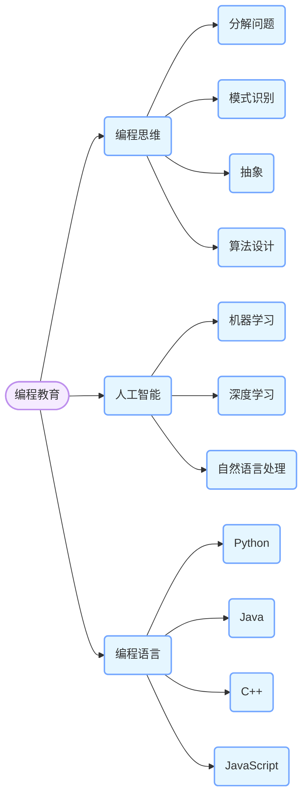

# 未来编程教育：培养AI时代的开发者

> 关键词：编程教育、AI时代、开发者培养、未来趋势、教育方法

> 摘要：本文聚焦于未来编程教育如何培养适应AI时代的开发者。在AI技术飞速发展的当下，编程教育面临着新的机遇与挑战。文章深入探讨了编程教育的背景，包括目的、预期读者、文档结构和相关术语。详细阐述了核心概念及其联系，介绍了核心算法原理和操作步骤，并结合数学模型进行解释。通过项目实战案例展示了编程教育在实际中的应用，分析了其在不同场景下的应用价值。同时推荐了相关的学习资源、开发工具和论文著作。最后总结了未来编程教育的发展趋势与挑战，并提供了常见问题解答和扩展阅读资料，旨在为编程教育工作者、学习者以及关注该领域的人士提供全面且深入的参考。

## 1. 背景介绍 
### 1.1 目的和范围
在当今AI时代，科技发展日新月异，编程能力已成为一项关键技能。编程教育的目的不仅是传授编程知识和技能，更重要的是培养学生的逻辑思维、创新能力和解决问题的能力，使他们能够适应快速变化的技术环境，成为AI时代的合格开发者。

本文的范围涵盖了编程教育的多个方面，包括核心概念、算法原理、数学模型、项目实战、应用场景等。旨在全面探讨如何在未来编程教育中培养出能够应对AI挑战的开发者，为编程教育工作者、学生以及相关行业人士提供有价值的参考。

### 1.2 预期读者
本文的预期读者包括以下几类人群：
- **编程教育工作者**：希望从中获取新的教学理念、方法和技术，以改进编程教育课程和教学效果。
- **学生和学习者**：为他们提供系统的编程学习指导，帮助他们更好地理解编程知识和技能，规划未来的学习方向。
- **教育机构和学校管理人员**：为制定编程教育政策、课程体系和教学计划提供参考依据。
- **科技行业从业者**：了解编程教育的发展趋势，以便更好地与教育领域合作，为行业培养所需的人才。

### 1.3 文档结构概述
本文将按照以下结构进行阐述：
- **核心概念与联系**：介绍编程教育和AI时代的核心概念，以及它们之间的相互关系，并通过示意图和流程图进行展示。
- **核心算法原理 & 具体操作步骤**：讲解编程中常用的核心算法原理，并结合Python源代码详细说明具体的操作步骤。
- **数学模型和公式 & 详细讲解 & 举例说明**：引入数学模型和公式，对编程中的关键概念进行深入解释，并通过实际例子进行说明。
- **项目实战：代码实际案例和详细解释说明**：通过具体的项目实战案例，展示编程教育在实际中的应用，包括开发环境搭建、源代码实现和代码解读。
- **实际应用场景**：分析编程教育在不同领域的实际应用场景，展示其在AI时代的重要性。
- **工具和资源推荐**：推荐相关的学习资源、开发工具和论文著作，为读者提供更多的学习和研究途径。
- **总结：未来发展趋势与挑战**：总结未来编程教育的发展趋势，并分析可能面临的挑战。
- **附录：常见问题与解答**：解答读者在编程教育和学习过程中常见的问题。
- **扩展阅读 & 参考资料**：提供相关的扩展阅读材料和参考资料，方便读者进一步深入学习。

### 1.4 术语表
#### 1.4.1 核心术语定义
- **编程教育**：指通过系统的教学方法和课程，传授编程知识和技能，培养学生编程思维和解决问题能力的教育活动。
- **AI时代**：指以人工智能技术为核心驱动力，广泛应用于各个领域，深刻改变社会生产和生活方式的时代。
- **开发者**：指具备编程技能，能够使用各种编程语言和工具开发软件、系统和应用程序的专业人员。
- **算法**：指解决特定问题的一系列明确的指令和步骤，是编程的核心组成部分。
- **数学模型**：指用数学语言和方法对实际问题进行抽象和描述的模型，用于分析和解决编程中的问题。

#### 1.4.2 相关概念解释
- **编程思维**：指一种逻辑思维方式，包括分解问题、模式识别、抽象和算法设计等能力，是编程的基础。
- **人工智能**：指让计算机模拟人类智能，具备学习、推理、决策等能力的技术领域。
- **机器学习**：是人工智能的一个重要分支，通过让计算机从数据中学习模式和规律，实现自主决策和预测。
- **深度学习**：是机器学习的一种，基于神经网络模型，能够处理复杂的非线性问题，在图像识别、语音识别等领域取得了显著成果。

#### 1.4.3 缩略词列表
- **AI**：Artificial Intelligence，人工智能
- **ML**：Machine Learning，机器学习
- **DL**：Deep Learning，深度学习
- **IDE**：Integrated Development Environment，集成开发环境

## 2. 核心概念与联系 

### 核心概念原理
在未来编程教育中，有几个核心概念需要深入理解。首先是编程思维，它是一种结构化的思考方式，帮助开发者将复杂的问题分解为更小、更易于管理的子问题。例如，当开发一个大型软件项目时，编程思维可以指导开发者将项目分解为多个模块，每个模块负责特定的功能。

其次是人工智能，它是未来编程的重要方向。人工智能技术可以让程序具备学习和自适应的能力，从而更好地处理复杂的任务。例如，在图像识别领域，人工智能算法可以通过大量的图像数据进行训练，从而准确地识别不同的物体。

另外，编程语言也是编程教育的核心内容之一。不同的编程语言适用于不同的应用场景，例如Python常用于数据科学和人工智能领域，Java常用于企业级应用开发，C++常用于游戏开发和系统编程。

### 架构的文本示意图
以下是一个简单的文本示意图，展示了编程教育、编程思维、人工智能和编程语言之间的关系：

```plaintext
编程教育
|
|-- 编程思维
|   |-- 分解问题
|   |-- 模式识别
|   |-- 抽象
|   |-- 算法设计
|
|-- 人工智能
|   |-- 机器学习
|   |-- 深度学习
|   |-- 自然语言处理
|
|-- 编程语言
|   |-- Python
|   |-- Java
|   |-- C++
|   |-- JavaScript
```

### Mermaid流程图


这个流程图清晰地展示了编程教育包含编程思维、人工智能和编程语言三个主要方面，每个方面又包含多个子领域。

## 3. 核心算法原理 & 具体操作步骤 

### 核心算法原理
在编程中，有许多核心算法，如排序算法、搜索算法等。这里我们以冒泡排序算法为例进行讲解。冒泡排序是一种简单的排序算法，它重复地走访过要排序的数列，一次比较两个元素，如果它们的顺序错误就把它们交换过来。走访数列的工作是重复地进行直到没有再需要交换，也就是说该数列已经排序完成。

### 具体操作步骤
以下是冒泡排序算法的具体操作步骤：
1. 比较相邻的元素。如果第一个比第二个大，就交换它们两个。
2. 对每一对相邻元素作同样的工作，从开始第一对到结尾的最后一对。这步做完后，最后的元素会是最大的数。
3. 针对所有的元素重复以上的步骤，除了最后一个。
4. 持续每次对越来越少的元素重复上面的步骤，直到没有任何一对数字需要比较。

### Python源代码实现
```python
def bubble_sort(arr):
    n = len(arr)
    for i in range(n):
        for j in range(0, n - i - 1):
            if arr[j] > arr[j + 1]:
                arr[j], arr[j + 1] = arr[j + 1], arr[j]
    return arr

# 测试代码
arr = [64, 34, 25, 12, 22, 11, 90]
sorted_arr = bubble_sort(arr)
print("排序后的数组:", sorted_arr)
```

### 代码解释
- `bubble_sort` 函数接受一个数组 `arr` 作为输入。
- 外层循环 `for i in range(n)` 控制排序的轮数，总共需要进行 `n` 轮排序。
- 内层循环 `for j in range(0, n - i - 1)` 用于比较相邻的元素，并交换顺序错误的元素。
- 最后返回排序好的数组。

通过这个简单的例子，我们可以看到如何使用Python实现一个基本的算法，并理解其具体的操作步骤。

## 4. 数学模型和公式 & 详细讲解 & 举例说明 

### 数学模型和公式
在编程中，数学模型和公式起着重要的作用。例如，在机器学习中，线性回归是一个常见的数学模型，用于预测连续变量的值。线性回归的数学模型可以表示为：

$$y = \theta_0 + \theta_1x_1 + \theta_2x_2 + \cdots + \theta_nx_n$$

其中，$y$ 是预测值，$x_1, x_2, \cdots, x_n$ 是输入特征，$\theta_0, \theta_1, \theta_2, \cdots, \theta_n$ 是模型的参数。

### 详细讲解
线性回归的目标是找到一组最优的参数 $\theta$，使得预测值 $y$ 与实际值之间的误差最小。通常使用最小二乘法来求解这个问题，即最小化误差平方和：

$$J(\theta) = \frac{1}{2m}\sum_{i = 1}^{m}(h_{\theta}(x^{(i)}) - y^{(i)})^2$$

其中，$m$ 是样本数量，$h_{\theta}(x^{(i)})$ 是第 $i$ 个样本的预测值，$y^{(i)}$ 是第 $i$ 个样本的实际值。

为了找到最优的参数 $\theta$，可以使用梯度下降算法。梯度下降算法的基本思想是通过不断地更新参数 $\theta$，使得损失函数 $J(\theta)$ 逐渐减小。具体的更新公式为：

$$\theta_j := \theta_j - \alpha\frac{\partial}{\partial\theta_j}J(\theta)$$

其中，$\alpha$ 是学习率，控制参数更新的步长。

### 举例说明
假设我们有一组数据集，包含房屋的面积和价格。我们想要使用线性回归模型来预测房屋的价格。以下是一个简单的Python代码示例：

```python
import numpy as np

# 输入特征
X = np.array([[1], [2], [3], [4], [5]])
# 实际值
y = np.array([2, 4, 6, 8, 10])

# 添加偏置项
X_b = np.c_[np.ones((X.shape[0], 1)), X]

# 初始化参数
theta = np.zeros((X_b.shape[1], 1))

# 学习率
alpha = 0.01
# 迭代次数
num_iterations = 1000

# 梯度下降算法
for iteration in range(num_iterations):
    gradients = 2/X_b.shape[0] * X_b.T.dot(X_b.dot(theta) - y.reshape(-1, 1))
    theta = theta - alpha * gradients

# 预测
new_X = np.array([[6]])
new_X_b = np.c_[np.ones((new_X.shape[0], 1)), new_X]
prediction = new_X_b.dot(theta)

print("预测值:", prediction)
```

在这个例子中，我们使用梯度下降算法来求解线性回归模型的参数 $\theta$，并使用训练好的模型进行预测。通过这个例子，我们可以看到数学模型和公式在编程中的具体应用。

## 5. 项目实战：代码实际案例和详细解释说明 

### 5.1 开发环境搭建
在进行项目实战之前，需要搭建相应的开发环境。以Python为例，以下是搭建开发环境的步骤：
1. **安装Python**：从Python官方网站（https://www.python.org/downloads/）下载并安装Python。
2. **安装集成开发环境（IDE）**：推荐使用PyCharm或VS Code等IDE，它们提供了丰富的功能和工具，方便进行代码编写、调试和管理。
3. **安装必要的库**：根据项目需求，安装相应的Python库，如NumPy、Pandas、Matplotlib等。可以使用 `pip` 命令进行安装，例如：

```sh
pip install numpy pandas matplotlib
```

### 5.2 源代码详细实现和代码解读
以下是一个简单的Python项目实战案例，实现一个简单的学生成绩管理系统。

```python
# 定义学生类
class Student:
    def __init__(self, name, id, scores):
        self.name = name
        self.id = id
        self.scores = scores

    def get_average_score(self):
        if len(self.scores) == 0:
            return 0
        return sum(self.scores) / len(self.scores)

# 定义成绩管理系统类
class ScoreManagementSystem:
    def __init__(self):
        self.students = []

    def add_student(self, student):
        self.students.append(student)

    def get_all_students(self):
        return self.students

    def get_student_by_id(self, id):
        for student in self.students:
            if student.id == id:
                return student
        return None

    def get_average_scores(self):
        average_scores = []
        for student in self.students:
            average_scores.append(student.get_average_score())
        return average_scores

# 主程序
if __name__ == "__main__":
    # 创建成绩管理系统实例
    sms = ScoreManagementSystem()

    # 添加学生
    student1 = Student("张三", "001", [80, 90, 85])
    student2 = Student("李四", "002", [70, 75, 80])
    sms.add_student(student1)
    sms.add_student(student2)

    # 获取所有学生
    all_students = sms.get_all_students()
    for student in all_students:
        print(f"姓名: {student.name}, 学号: {student.id}, 平均成绩: {student.get_average_score()}")

    # 获取指定学号的学生
    student = sms.get_student_by_id("001")
    if student:
        print(f"找到学生: {student.name}")
    else:
        print("未找到该学生")

    # 获取所有学生的平均成绩
    average_scores = sms.get_average_scores()
    print("所有学生的平均成绩:", average_scores)
```

### 代码解读与分析
- **Student类**：表示学生对象，包含学生的姓名、学号和成绩列表。`get_average_score` 方法用于计算学生的平均成绩。
- **ScoreManagementSystem类**：表示成绩管理系统，包含一个学生列表。`add_student` 方法用于添加学生，`get_all_students` 方法用于获取所有学生，`get_student_by_id` 方法用于根据学号查找学生，`get_average_scores` 方法用于获取所有学生的平均成绩。
- **主程序**：创建成绩管理系统实例，添加学生，获取所有学生信息，查找指定学号的学生，并获取所有学生的平均成绩。

通过这个项目实战案例，我们可以看到如何使用Python实现一个简单的面向对象编程项目，以及如何使用类和方法来管理数据和实现功能。

## 6. 实际应用场景 
### 软件开发
在软件开发领域，编程教育培养的开发者可以使用各种编程语言和工具开发各种类型的软件，如桌面应用程序、移动应用程序、网站等。例如，使用Java开发企业级应用程序，使用Python开发数据科学和人工智能相关的软件，使用JavaScript开发前端网页应用。

### 数据科学与人工智能
数据科学和人工智能是当前科技领域的热门方向。编程教育培养的开发者可以使用Python等编程语言进行数据处理、数据分析、机器学习和深度学习等工作。例如，在金融领域，开发者可以使用机器学习算法进行风险评估和预测；在医疗领域，开发者可以使用深度学习算法进行医学图像识别和疾病诊断。

### 游戏开发
游戏开发是一个充满创意和挑战的领域。编程教育培养的开发者可以使用C++、Java、Python等编程语言和游戏开发引擎，如Unity、Unreal Engine等，开发各种类型的游戏，如角色扮演游戏、射击游戏、策略游戏等。

### 物联网
物联网是将各种设备通过网络连接起来的技术。编程教育培养的开发者可以使用编程语言进行物联网设备的开发和管理。例如，使用Python和Arduino开发智能家居设备，实现远程控制和自动化管理。

### 教育领域
编程教育本身也在教育领域有着广泛的应用。通过编程教育，学生可以学习编程知识和技能，培养逻辑思维和创新能力。同时，编程教育也可以与其他学科相结合，如数学、物理、化学等，提高学生的学习兴趣和学习效果。

## 7. 工具和资源推荐
### 7.1 学习资源推荐
#### 7.1.1 书籍推荐
- 《Python编程：从入门到实践》：一本适合初学者的Python编程书籍，通过大量的实例和项目帮助读者快速掌握Python编程。
- 《算法导论》：一本经典的算法书籍，介绍了各种算法的原理和实现，适合有一定编程基础的读者深入学习算法。
- 《人工智能：一种现代的方法》：全面介绍了人工智能的各个领域，包括机器学习、自然语言处理、计算机视觉等，是人工智能领域的权威书籍。

#### 7.1.2 在线课程
- Coursera：提供了大量的编程和人工智能相关的在线课程，如Python编程、机器学习、深度学习等，由世界各地的知名大学和机构提供。
- edX：与Coursera类似，也是一个提供在线课程的平台，有许多优质的编程和人工智能课程可供选择。
- 中国大学MOOC：国内知名的在线课程平台，提供了丰富的编程和计算机科学相关的课程，适合国内学生学习。

#### 7.1.3 技术博客和网站
- Medium：一个汇聚了众多技术博主的平台，有许多关于编程、人工智能、数据科学等领域的优质文章。
- Stack Overflow：一个程序员社区，提供了大量的编程问题解答和技术交流的平台，是程序员解决问题的重要资源。
- GitHub：一个开源代码托管平台，有许多优秀的开源项目和代码示例，可以帮助开发者学习和借鉴他人的代码。

### 7.2 开发工具框架推荐
#### 7.2.1 IDE和编辑器
- PyCharm：一款专门为Python开发设计的集成开发环境，提供了丰富的功能和工具，如代码自动补全、调试、版本控制等。
- Visual Studio Code：一款轻量级的代码编辑器，支持多种编程语言，有丰富的插件和扩展，可以根据需要进行定制。
- IntelliJ IDEA：一款功能强大的Java开发工具，也支持其他编程语言，提供了高效的代码编辑、调试和项目管理功能。

#### 7.2.2 调试和性能分析工具
- PDB：Python自带的调试工具，可以帮助开发者在代码中设置断点、查看变量值等，进行代码调试。
- Py-Spy：一个Python性能分析工具，可以实时分析Python程序的性能瓶颈，帮助开发者优化代码。
- VisualVM：一个Java性能分析工具，可以监控Java程序的内存使用、线程状态等，帮助开发者进行性能优化。

#### 7.2.3 相关框架和库
- TensorFlow：一个开源的机器学习框架，由Google开发，提供了丰富的工具和接口，用于开发和训练深度学习模型。
- PyTorch：另一个流行的深度学习框架，由Facebook开发，具有简洁易用的接口和高效的计算性能。
- Django：一个Python Web开发框架，提供了快速开发Web应用的工具和模板，适合开发各种类型的网站。

### 7.3 相关论文著作推荐
#### 7.3.1 经典论文
- 《A Neural Algorithm of Artistic Style》：提出了一种基于神经网络的艺术风格迁移算法，开启了深度学习在图像风格迁移领域的研究。
- 《Attention Is All You Need》：提出了Transformer模型，在自然语言处理领域取得了巨大的成功，成为了当前许多自然语言处理任务的基础模型。
- 《ImageNet Classification with Deep Convolutional Neural Networks》：介绍了AlexNet模型，是深度学习在图像识别领域的里程碑式论文，推动了深度学习在计算机视觉领域的发展。

#### 7.3.2 最新研究成果
- 在各大学术会议和期刊上，如NeurIPS、ICML、CVPR等，会发布许多关于编程、人工智能和机器学习的最新研究成果。可以关注这些会议和期刊的官方网站，获取最新的研究论文。

#### 7.3.3 应用案例分析
- 《Hands-On Machine Learning with Scikit-Learn, Keras, and TensorFlow》：通过大量的实际案例，介绍了如何使用Scikit-Learn、Keras和TensorFlow等工具进行机器学习和深度学习应用开发。
- 《Python for Data Analysis》：结合实际的数据处理和分析案例，介绍了如何使用Python进行数据科学工作，包括数据清洗、数据分析和数据可视化等。

## 8. 总结：未来发展趋势与挑战
### 未来发展趋势
- **融合AI技术**：未来编程教育将更加注重与AI技术的融合，培养学生具备使用AI工具和技术进行编程的能力。例如，学生将学习如何使用机器学习和深度学习算法进行数据分析和预测，如何使用自然语言处理技术开发智能对话系统等。
- **强调实践能力**：编程教育将更加注重实践能力的培养，通过实际项目和案例让学生亲身体验编程的过程，提高解决实际问题的能力。例如，开展编程竞赛、项目实践等活动，让学生在实践中不断积累经验。
- **个性化学习**：随着人工智能和大数据技术的发展，编程教育将实现个性化学习。通过分析学生的学习数据和行为，为学生提供个性化的学习方案和建议，提高学习效果。
- **跨学科融合**：编程教育将与其他学科进行更深入的融合，如数学、物理、生物等。例如，在生物学中使用编程进行基因序列分析，在物理学中使用编程进行模拟实验等。

### 挑战
- **师资短缺**：目前，具备编程和AI技术教学能力的教师相对短缺，这限制了编程教育的普及和发展。需要加强教师的培训和培养，提高教师的教学水平。
- **课程体系不完善**：编程教育的课程体系还不够完善，缺乏系统性和科学性。需要制定科学合理的课程体系，根据学生的年龄和认知水平，逐步引导学生学习编程知识和技能。
- **技术更新换代快**：编程和AI技术发展迅速，知识更新换代快。这要求编程教育不断跟上技术发展的步伐，及时更新教学内容和方法。
- **学生兴趣和动力不足**：部分学生对编程缺乏兴趣和动力，认为编程学习枯燥乏味。需要采用更加生动有趣的教学方法和手段，激发学生的学习兴趣和动力。

## 9. 附录：常见问题与解答
### 问题1：编程教育适合所有年龄段的学生吗？
解答：编程教育可以根据不同年龄段的学生进行适当的调整和设计。对于低年龄段的学生，可以通过游戏化的方式引入编程概念，培养他们的逻辑思维和创造力。对于高年龄段的学生，可以进行更深入的编程知识和技能的学习。因此，编程教育在一定程度上适合各个年龄段的学生。

### 问题2：学习编程需要具备哪些基础知识？
解答：学习编程并不需要太多的基础知识。对于初学者来说，掌握基本的数学知识（如算术、逻辑运算等）和英语基础（因为编程中会使用大量的英文单词和语句）会有一定的帮助。但更重要的是培养逻辑思维和解决问题的能力。

### 问题3：如何选择适合自己的编程语言？
解答：选择适合自己的编程语言需要考虑以下几个因素：
- **学习目标**：如果是想从事数据科学和人工智能领域的工作，Python是一个不错的选择；如果是想开发企业级应用程序，Java可能更合适；如果是想开发游戏，C++或C#是常用的语言。
- **个人兴趣**：选择自己感兴趣的编程语言会更有学习动力。
- **就业市场需求**：了解当前就业市场对不同编程语言的需求情况，选择就业前景较好的编程语言。

### 问题4：编程教育对未来就业有帮助吗？
解答：编程教育对未来就业有很大的帮助。在当今数字化时代，编程技能已经成为许多行业的必备技能。掌握编程技能可以让你在软件开发、数据科学、人工智能、游戏开发等领域找到很好的工作机会。同时，编程教育培养的逻辑思维和解决问题的能力也对其他行业的工作有很大的帮助。

### 问题5：学习编程需要多长时间才能掌握？
解答：学习编程所需的时间因人而异，取决于个人的学习能力、学习时间和学习目标。如果只是想掌握一些基本的编程概念和技能，可能需要几个月的时间；如果想成为一名专业的开发者，可能需要几年的时间不断学习和实践。重要的是保持学习的热情和坚持不断地练习。

## 10. 扩展阅读 & 参考资料
### 扩展阅读
- 《编程之美》：通过一系列有趣的编程问题和解决方案，展示了编程的魅力和技巧，适合有一定编程基础的读者进一步提高编程能力。
- 《代码大全》：一本关于软件开发的经典书籍，涵盖了软件开发的各个方面，包括需求分析、设计、编码、测试等，对提高软件开发的质量和效率有很大的帮助。
- 《黑客与画家》：从黑客和画家的角度探讨了编程和创造力的关系，激发读者对编程的兴趣和热情。

### 参考资料
- 《Python官方文档》：Python官方提供的详细文档，包含了Python语言的语法、标准库等方面的内容，是学习Python的重要参考资料。
- 《TensorFlow官方文档》：TensorFlow官方提供的文档，介绍了TensorFlow的使用方法和API接口，是学习和使用TensorFlow的重要参考。
- 《GitHub官方文档》：GitHub官方提供的文档，介绍了GitHub的使用方法和功能，帮助开发者更好地使用GitHub进行代码管理和协作开发。