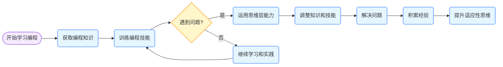

# 未来编程的教育：培养适应性思维

> 关键词：编程教育、适应性思维、未来教育、计算思维、教育创新

> 摘要：本文聚焦于未来编程教育中培养适应性思维的重要性。在科技飞速发展、技术不断迭代的时代背景下，传统编程教育模式已难以满足需求。适应性思维能使学习者在面对不断变化的编程环境和问题时，灵活运用知识和技能。文章深入探讨了适应性思维的核心概念、相关算法原理，结合数学模型进行分析，通过项目实战展示其应用，介绍了实际应用场景、相关工具和资源，最后对未来发展趋势与挑战进行总结，旨在为编程教育的改革和发展提供有益的思路和方向。

## 1. 背景介绍 
### 1.1 目的和范围
随着信息技术的迅猛发展，编程已成为21世纪必备的技能之一。编程教育不仅能传授编程知识和技能，更重要的是培养学习者的思维能力。本文章的目的在于探讨未来编程教育中培养适应性思维的关键作用和有效方法。范围涵盖适应性思维的理论基础、在编程教育中的应用、相关算法和数学模型，以及通过项目实战和实际应用场景的展示，全面剖析适应性思维在编程教育中的重要性和实现途径。

### 1.2 预期读者
本文预期读者包括从事编程教育的教师、教育研究者、对编程教育改革感兴趣的教育从业者、正在学习编程的学生以及关注未来教育发展趋势的各界人士。通过阅读本文，读者能够深入了解适应性思维在编程教育中的价值，获取相关的理论知识和实践经验，为推动编程教育的创新发展提供参考。

### 1.3 文档结构概述
本文共分为十个部分。第一部分为背景介绍，阐述文章的目的、范围、预期读者和文档结构。第二部分介绍核心概念与联系，详细解释适应性思维的原理和架构，并通过Mermaid流程图展示其逻辑关系。第三部分讲解核心算法原理和具体操作步骤，结合Python源代码进行详细阐述。第四部分介绍数学模型和公式，通过详细讲解和举例说明，加深读者对适应性思维的数学理解。第五部分是项目实战，包括开发环境搭建、源代码详细实现和代码解读。第六部分介绍实际应用场景，展示适应性思维在编程教育中的具体应用。第七部分推荐相关的工具和资源，包括学习资源、开发工具框架和相关论文著作。第八部分总结未来发展趋势与挑战。第九部分是附录，解答常见问题。第十部分提供扩展阅读和参考资料，方便读者进一步深入学习。

### 1.4 术语表
#### 1.4.1 核心术语定义
- **适应性思维**：指个体在面对不断变化的环境和问题时，能够灵活调整自己的思维方式和行为策略，以有效解决问题和适应变化的思维能力。
- **编程教育**：是一种通过教授编程知识和技能，培养学习者计算思维、创新能力和问题解决能力的教育活动。
- **计算思维**：运用计算机科学的基础概念进行问题求解、系统设计，以及人类行为理解等涵盖计算机科学之广度的一系列思维活动。

#### 1.4.2 相关概念解释
- **思维迁移**：将在一个情境中获得的思维方式和解决问题的方法应用到其他不同情境中的能力。
- **元认知**：个体对自己认知过程的认知，包括对自己的思维方式、学习策略、问题解决过程的认识和监控。

#### 1.4.3 缩略词列表
- **AI**：Artificial Intelligence，人工智能
- **ML**：Machine Learning，机器学习

## 2. 核心概念与联系 
适应性思维在编程教育中具有核心地位，它与计算思维、问题解决能力等密切相关。其原理在于培养学习者能够快速适应编程环境的变化，灵活运用编程知识和技能解决各种问题。

### 核心概念原理
适应性思维的核心在于灵活性和创新性。在编程教育中，学习者需要面对不同的编程任务和问题，这些问题可能具有不同的难度、类型和背景。适应性思维要求学习者能够根据问题的特点，选择合适的编程方法和策略，并且在遇到困难时能够及时调整自己的思路。

例如，当遇到一个复杂的算法问题时，学习者可能首先尝试使用已有的算法知识进行解决。如果发现原有的方法无法有效解决问题，就需要通过思维迁移，借鉴其他领域的思想或方法，或者创新地设计新的算法。

### 架构的文本示意图
适应性思维的架构可以分为三个层次：知识层、技能层和思维层。

- **知识层**：包括编程的基础知识，如编程语言的语法、数据结构、算法等。这些知识是编程的基础，为解决问题提供了工具和方法。
- **技能层**：是在知识层的基础上，通过实践和训练获得的编程技能，如代码编写、调试、优化等。技能层的提升需要不断的实践和经验积累。
- **思维层**：是适应性思维的核心，包括计算思维、创新思维、批判性思维等。思维层的培养需要通过系统的教育和训练，引导学习者从不同的角度思考问题，提高解决问题的能力。

### Mermaid流程图


## 3. 核心算法原理 & 具体操作步骤 
### 核心算法原理
在编程教育中，培养适应性思维的核心算法可以类比为一种启发式搜索算法。启发式搜索算法通过利用问题的启发信息，引导搜索过程朝着更有希望的方向进行，从而提高搜索效率。

在培养适应性思维的过程中，学习者面对一个问题时，首先会在自己的知识和经验库中搜索可能的解决方案。这个搜索过程就像启发式搜索算法中的节点扩展，学习者会根据问题的特点和自己的经验，选择最有可能解决问题的方法进行尝试。

如果尝试失败，学习者会根据失败的反馈信息，调整自己的搜索策略，继续尝试其他可能的方法。这个过程不断迭代，直到找到问题的解决方案。

### 具体操作步骤及Python源代码阐述
以下是一个简单的示例，模拟在编程教育中培养适应性思维的过程。假设我们要解决一个寻找数组中最大值的问题，并且可以使用不同的算法进行尝试。

```python
# 定义一个数组
array = [3, 7, 1, 9, 4, 6]

# 方法1：使用Python内置函数max
def method1(arr):
    return max(arr)

# 方法2：使用循环遍历数组
def method2(arr):
    max_value = arr[0]
    for num in arr:
        if num > max_value:
            max_value = num
    return max_value

# 尝试解决问题的函数
def solve_problem(arr):
    methods = [method1, method2]
    for method in methods:
        try:
            result = method(arr)
            print(f"使用 {method.__name__} 方法找到最大值: {result}")
            break
        except Exception as e:
            print(f"使用 {method.__name__} 方法失败: {e}")

# 调用解决问题的函数
solve_problem(array)
```

在这个示例中，我们定义了两种不同的方法来寻找数组中的最大值。`solve_problem` 函数会依次尝试这两种方法，直到找到问题的解决方案。如果一种方法失败，会输出失败信息并尝试下一种方法。

## 4. 数学模型和公式 & 详细讲解 & 举例说明 
### 数学模型
在编程教育中，培养适应性思维可以用马尔可夫决策过程（MDP）来建模。马尔可夫决策过程是一种用于描述在不确定环境中进行决策的数学模型，它由状态集合 $S$、动作集合 $A$、状态转移概率 $P(s'|s,a)$、奖励函数 $R(s,a)$ 和折扣因子 $\gamma$ 组成。

在编程教育的情境中，状态 $s$ 可以表示学习者当前的知识和技能水平、面对的问题类型等；动作 $a$ 可以表示学习者选择的编程方法和策略；状态转移概率 $P(s'|s,a)$ 表示在状态 $s$ 下采取动作 $a$ 后转移到状态 $s'$ 的概率；奖励函数 $R(s,a)$ 表示在状态 $s$ 下采取动作 $a$ 所获得的奖励，例如问题解决的成功与否、解决问题的效率等；折扣因子 $\gamma$ 用于平衡短期和长期奖励。

### 数学公式
马尔可夫决策过程的目标是找到一个最优策略 $\pi^*(s)$，使得长期累积奖励最大化。最优策略可以通过贝尔曼方程求解：

$$V^*(s) = \max_{a \in A} \left[ R(s,a) + \gamma \sum_{s' \in S} P(s'|s,a) V^*(s') \right]$$

其中，$V^*(s)$ 表示状态 $s$ 的最优值函数。

### 详细讲解
贝尔曼方程的含义是，在状态 $s$ 下的最优值等于在该状态下采取所有可能动作所获得的奖励加上后续状态的最优值的期望的最大值。通过不断迭代求解贝尔曼方程，可以得到最优策略。

### 举例说明
假设在编程教育中，学习者面对一个排序问题（状态 $s$），有两种排序算法可供选择：冒泡排序（动作 $a_1$）和快速排序（动作 $a_2$）。如果选择冒泡排序，解决问题的效率较低，奖励函数 $R(s,a_1) = 3$；如果选择快速排序，解决问题的效率较高，奖励函数 $R(s,a_2) = 5$。

假设状态转移概率 $P(s'|s,a_1) = 0.8$，$P(s'|s,a_2) = 0.9$，折扣因子 $\gamma = 0.9$。后续状态 $s'$ 的最优值 $V^*(s') = 10$。

根据贝尔曼方程，计算两种动作的价值：

- 对于冒泡排序：
$$V_1 = R(s,a_1) + \gamma \sum_{s' \in S} P(s'|s,a_1) V^*(s') = 3 + 0.9 \times 0.8 \times 10 = 3 + 7.2 = 10.2$$

- 对于快速排序：
$$V_2 = R(s,a_2) + \gamma \sum_{s' \in S} P(s'|s,a_2) V^*(s') = 5 + 0.9 \times 0.9 \times 10 = 5 + 8.1 = 13.1$$

因为 $V_2 > V_1$，所以最优策略是选择快速排序。

## 5. 项目实战：代码实际案例和详细解释说明 
### 5.1  开发环境搭建
本次项目实战以Python语言为例，开发环境的搭建步骤如下：

1. **安装Python**：访问Python官方网站（https://www.python.org/downloads/），根据自己的操作系统选择合适的Python版本进行下载和安装。
2. **安装集成开发环境（IDE）**：推荐使用PyCharm，它是一款功能强大的Python IDE。访问PyCharm官方网站（https://www.jetbrains.com/pycharm/），下载并安装社区版。
3. **配置虚拟环境**：在PyCharm中，打开项目后，可以通过 `File -> Settings -> Project: <project name> -> Python Interpreter` 配置虚拟环境。点击齿轮图标，选择 `Add`，然后选择 `Virtualenv Environment`，按照提示创建虚拟环境。

### 5.2  源代码详细实现和代码解读
我们以一个简单的图书管理系统为例，展示如何在编程项目中培养适应性思维。

```python
# 定义图书类
class Book:
    def __init__(self, title, author, id):
        self.title = title
        self.author = author
        self.id = id

    def __str__(self):
        return f"ID: {self.id}, 书名: {self.title}, 作者: {self.author}"

# 定义图书管理系统类
class LibraryManagementSystem:
    def __init__(self):
        self.books = []

    # 添加图书
    def add_book(self, book):
        self.books.append(book)
        print(f"图书 {book.title} 已添加到图书馆。")

    # 删除图书
    def remove_book(self, book_id):
        for book in self.books:
            if book.id == book_id:
                self.books.remove(book)
                print(f"图书 ID 为 {book_id} 的图书已从图书馆移除。")
                return
        print(f"未找到 ID 为 {book_id} 的图书。")

    # 显示所有图书
    def display_books(self):
        if not self.books:
            print("图书馆中没有图书。")
        else:
            for book in self.books:
                print(book)

# 主程序
if __name__ == "__main__":
    library = LibraryManagementSystem()

    # 添加图书
    book1 = Book("Python编程从入门到实践", "Eric Matthes", 1)
    book2 = Book("算法导论", "Thomas H. Cormen", 2)
    library.add_book(book1)
    library.add_book(book2)

    # 显示所有图书
    library.display_books()

    # 删除图书
    library.remove_book(1)

    # 再次显示所有图书
    library.display_books()
```

### 5.3  代码解读与分析
1. **图书类（Book）**：该类用于表示图书对象，包含图书的标题、作者和ID属性。`__init__` 方法用于初始化图书对象，`__str__` 方法用于返回图书的字符串表示形式，方便打印输出。
2. **图书管理系统类（LibraryManagementSystem）**：该类用于管理图书，包含一个图书列表 `books`。`add_book` 方法用于向图书列表中添加图书，`remove_book` 方法用于根据图书ID从图书列表中移除图书，`display_books` 方法用于显示所有图书。
3. **主程序**：创建一个图书管理系统对象，添加图书，显示所有图书，删除一本图书，然后再次显示所有图书。

在这个项目中，培养适应性思维的体现如下：

- **功能扩展**：如果需要添加新的功能，如借阅图书、归还图书等，可以在 `LibraryManagementSystem` 类中添加相应的方法。
- **错误处理**：在 `remove_book` 方法中，如果未找到指定ID的图书，会输出提示信息，避免程序崩溃。这体现了在面对可能的问题时，能够灵活处理，保证系统的稳定性。

## 6. 实际应用场景 
### 学校编程教育
在学校的编程教育中，培养适应性思维可以帮助学生更好地应对不同难度和类型的编程任务。例如，在编程课程中，教师可以设计不同的项目，让学生在实践中不断调整自己的思维方式和编程策略。当学生遇到难题时，教师可以引导学生从不同的角度思考问题，尝试不同的方法，培养学生的创新能力和问题解决能力。

### 企业编程培训
在企业的编程培训中，适应性思维同样重要。随着技术的不断发展，企业需要员工能够快速适应新的技术和业务需求。通过培养适应性思维，员工可以更好地学习和掌握新的编程知识和技能，提高工作效率和质量。例如，当企业引入新的编程语言或框架时，具有适应性思维的员工能够更快地上手并应用到实际项目中。

### 竞赛和创新活动
在编程竞赛和创新活动中，适应性思维是取得成功的关键。参赛者需要在有限的时间内解决复杂的问题，并且要不断创新和优化解决方案。例如，在国际信息学奥林匹克竞赛（IOI）中，选手需要面对各种类型的算法问题，只有具备适应性思维，才能在竞赛中脱颖而出。

## 7. 工具和资源推荐
### 7.1 学习资源推荐
#### 7.1.1 书籍推荐
- 《Python编程从入门到实践》（Eric Matthes 著）：适合初学者，通过实际项目介绍Python编程的基础知识和应用。
- 《算法导论》（Thomas H. Cormen 等著）：经典的算法教材，深入介绍各种算法的原理和实现。
- 《代码大全》（Steve McConnell 著）：关于软件开发的权威书籍，涵盖代码设计、编码规范、调试等方面的内容。

#### 7.1.2 在线课程
- Coursera 上的“Python for Everybody”：由密歇根大学提供，全面介绍Python编程的基础知识。
- edX 上的“Introduction to Computer Science and Programming Using Python”：麻省理工学院的课程，适合有一定编程基础的学习者。
- 中国大学MOOC上的“计算机程序设计基础（Python）”：国内优秀的Python编程课程。

#### 7.1.3 技术博客和网站
- 博客园（https://www.cnblogs.com/）：国内知名的技术博客平台，有很多编程相关的技术文章。
- Medium（https://medium.com/）：国际上知名的技术博客平台，有很多关于编程、人工智能等领域的优秀文章。
- Stack Overflow（https://stackoverflow.com/）：全球最大的技术问答社区，遇到编程问题可以在这里查找解决方案。

### 7.2 开发工具框架推荐
#### 7.2.1 IDE和编辑器
- PyCharm：功能强大的Python IDE，提供代码编辑、调试、代码分析等功能。
- Visual Studio Code：轻量级的代码编辑器，支持多种编程语言，有丰富的插件扩展。
- Sublime Text：简洁高效的文本编辑器，适合快速编写代码。

#### 7.2.2 调试和性能分析工具
- pdb：Python内置的调试器，可以帮助开发者定位和解决代码中的问题。
- cProfile：Python的性能分析工具，可以分析代码的执行时间和函数调用情况。
- Py-Spy：用于分析Python程序性能的工具，提供可视化的性能分析报告。

#### 7.2.3 相关框架和库
- Django：Python的Web开发框架，适合快速开发功能强大的Web应用。
- Flask：轻量级的Python Web框架，适合小型Web应用的开发。
- NumPy：Python的数值计算库，提供高效的数组操作和数学函数。

### 7.3 相关论文著作推荐
#### 7.3.1 经典论文
- “Computational Thinking”（Jeannette M. Wing 著）：首次提出计算思维的概念，对编程教育和计算机科学的发展产生了深远影响。
- “A Mathematical Theory of Communication”（Claude E. Shannon 著）：信息论的经典论文，为现代通信和计算机科学奠定了理论基础。

#### 7.3.2 最新研究成果
- 关注ACM（Association for Computing Machinery）、IEEE（Institute of Electrical and Electronics Engineers）等学术组织的会议和期刊，了解编程教育和适应性思维领域的最新研究成果。

#### 7.3.3 应用案例分析
- 可以在ACM Digital Library、IEEE Xplore等数据库中查找关于编程教育和适应性思维的应用案例分析，学习其他研究者和实践者的经验。

## 8. 总结：未来发展趋势与挑战
### 未来发展趋势
- **融合多学科知识**：未来的编程教育将不再局限于计算机科学领域，而是会与数学、物理、生物等多学科知识融合。例如，在生物信息学中，需要运用编程知识处理生物数据，分析基因序列等。通过融合多学科知识，培养学习者的综合思维能力和创新能力。
- **强调实践和项目驱动**：实践是培养适应性思维的关键。未来的编程教育将更加注重实践和项目驱动，通过实际项目让学习者在解决问题的过程中不断提升自己的能力。例如，开展创新创业项目，让学习者将编程知识应用到实际场景中，培养他们的创业精神和实践能力。
- **个性化教育**：随着人工智能技术的发展，未来的编程教育将实现个性化教育。通过分析学习者的学习行为、兴趣爱好、知识水平等信息，为学习者提供个性化的学习方案和教学资源。例如，智能辅导系统可以根据学习者的学习进度和问题，提供针对性的辅导和建议。

### 挑战
- **教师能力提升**：培养适应性思维需要教师具备更高的教学能力和专业素养。教师不仅要掌握编程知识和技能，还要了解教育心理学、教学设计等方面的知识。目前，很多教师缺乏相关的培训和经验，需要加强教师培训，提高教师的教学水平。
- **教育资源不均衡**：不同地区、不同学校之间的教育资源存在较大差异。一些地区的学校缺乏先进的教学设备和优质的教学资源，影响了编程教育的开展。需要加大对教育资源薄弱地区的投入，缩小教育资源差距。
- **技术更新换代快**：信息技术发展迅速，编程语言、框架和工具不断更新换代。这给编程教育带来了挑战，如何及时更新教学内容，让学习者掌握最新的技术知识，是编程教育面临的重要问题。

## 9. 附录：常见问题与解答
### 问题1：什么是适应性思维，为什么在编程教育中如此重要？
解答：适应性思维是指个体在面对不断变化的环境和问题时，能够灵活调整自己的思维方式和行为策略，以有效解决问题和适应变化的思维能力。在编程教育中，技术和问题不断变化，学习者需要具备适应性思维才能快速适应新的编程环境和解决各种复杂的问题。例如，当出现新的编程语言或框架时，具有适应性思维的学习者能够更快地学习和掌握。

### 问题2：如何在编程教育中培养适应性思维？
解答：可以通过以下几种方式培养适应性思维：
- 设计多样化的编程项目，让学习者在实践中面对不同类型的问题，锻炼他们的思维灵活性。
- 引导学习者进行反思和总结，让他们了解自己的思维过程和解决问题的方法，提高元认知能力。
- 鼓励学习者进行创新和尝试，不怕失败，从失败中吸取经验教训。

### 问题3：编程教育中培养适应性思维与传统编程教育有什么区别？
解答：传统编程教育注重知识的传授和技能的训练，而培养适应性思维的编程教育更注重学习者的思维能力和创新能力的培养。传统编程教育可能会让学习者按照固定的模式和方法解决问题，而培养适应性思维的编程教育鼓励学习者从不同的角度思考问题，灵活运用知识和技能。例如，在传统编程教育中，学习者可能只是学习如何使用某种算法，而在培养适应性思维的编程教育中，学习者会思考在什么情况下使用该算法，以及如何改进算法。

## 10. 扩展阅读 & 参考资料
### 扩展阅读
- 《思考，快与慢》（Daniel Kahneman 著）：介绍人类思维的两种模式，对理解思维过程和培养适应性思维有一定的帮助。
- 《创新者的窘境》（Clayton M. Christensen 著）：探讨创新和变革的规律，对编程教育的创新发展有一定的启示。

### 参考资料
- ACM（Association for Computing Machinery）官方网站：https://www.acm.org/
- IEEE（Institute of Electrical and Electronics Engineers）官方网站：https://www.ieee.org/
- Python官方文档：https://docs.python.org/3/