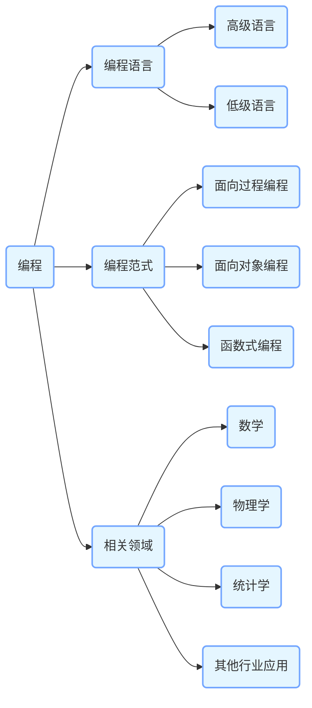

# 未来编程的职业路径与发展方向

> 关键词：编程职业路径、未来发展方向、人工智能编程、区块链编程、量子计算编程

> 摘要：本文深入探讨了未来编程的职业路径与发展方向。首先介绍了编程领域的背景知识，包括目的和范围、预期读者等。接着阐述了编程相关的核心概念及其联系，详细讲解了核心算法原理与具体操作步骤，并给出了相应的数学模型和公式。通过项目实战案例，展示了代码的实际实现与解读。分析了编程在不同实际应用场景中的作用，推荐了学习、开发工具框架以及相关论文著作等资源。最后总结了未来编程的发展趋势与面临的挑战，还提供了常见问题解答和扩展阅读参考资料，旨在为编程从业者和爱好者提供全面且有深度的职业发展指导。

## 1. 背景介绍 
### 1.1 目的和范围
在当今数字化飞速发展的时代，编程已经成为推动科技进步和社会变革的关键力量。本文的目的在于全面剖析未来编程的职业路径与发展方向，为广大编程从业者、相关专业学生以及对编程领域感兴趣的人士提供清晰、准确且具有前瞻性的指导。我们将探讨从基础编程岗位到高级技术专家、管理角色等不同层次的职业发展路径，同时关注新兴技术如人工智能、区块链、量子计算等对编程领域带来的变革和机遇。范围涵盖了编程的各个方面，包括核心技术、应用场景、市场需求以及未来趋势等。

### 1.2 预期读者
本文预期读者主要包括以下几类人群：一是正在学习编程相关专业的学生，他们希望通过了解未来的职业路径和发展方向，更好地规划自己的学习和实践，为未来的职业发展做好准备；二是已经从事编程工作的初级和中级开发者，他们渴望在职业发展中寻求突破，了解新兴技术和行业趋势，以提升自己的竞争力；三是对编程领域有兴趣的非专业人士，他们希望通过本文初步了解编程职业的全貌，评估自己是否适合进入这个领域。

### 1.3 文档结构概述
本文将按照以下结构展开：首先介绍编程领域的背景知识，让读者对本文的目的、预期读者和整体结构有清晰的认识；接着阐述编程的核心概念与联系，通过文本示意图和 Mermaid 流程图帮助读者理解编程的基本原理和架构；然后详细讲解核心算法原理和具体操作步骤，结合 Python 源代码进行说明；之后给出相关的数学模型和公式，并举例说明其在编程中的应用；通过项目实战展示代码的实际实现和详细解读；分析编程在不同实际应用场景中的作用；推荐学习、开发工具框架以及相关论文著作等资源；最后总结未来编程的发展趋势与面临的挑战，提供常见问题解答和扩展阅读参考资料。

### 1.4 术语表
#### 1.4.1 核心术语定义
- **编程范式**：是指编程的基本风格和方法，常见的编程范式包括面向过程编程、面向对象编程、函数式编程等。不同的编程范式强调不同的编程思想和组织方式。
- **算法复杂度**：用于衡量算法执行效率的指标，通常包括时间复杂度和空间复杂度。时间复杂度表示算法执行所需的时间与输入规模之间的关系，空间复杂度表示算法执行所需的存储空间与输入规模之间的关系。
- **软件生命周期**：是指软件从最初的构思开始，经过需求分析、设计、编码、测试、维护等阶段，直到最终被淘汰的整个过程。

#### 1.4.2 相关概念解释
- **开源软件**：是指其源代码可以被公众获取、使用、修改和再分发的软件。开源软件通常由社区开发者共同维护和改进，具有高度的透明度和灵活性。
- **云计算**：是一种基于互联网的计算方式，通过将计算资源（如服务器、存储、软件等）提供给用户，使用户可以按需使用这些资源，而无需自己构建和维护硬件设施。
- **DevOps**：是一种将软件开发（Dev）和信息技术运维（Ops）相结合的文化、理念和实践方法，旨在实现软件的快速、高效、稳定交付。

#### 1.4.3 缩略词列表
- **AI**：Artificial Intelligence，人工智能
- **ML**：Machine Learning，机器学习
- **DL**：Deep Learning，深度学习
- **BC**：Blockchain，区块链
- **QC**：Quantum Computing，量子计算

## 2. 核心概念与联系 

### 编程的基本概念
编程是指使用特定的编程语言，按照一定的规则和逻辑，编写指令序列，让计算机执行特定任务的过程。编程语言是人与计算机进行沟通的工具，不同的编程语言适用于不同的应用场景和任务需求。

### 编程范式的联系
面向过程编程强调将问题分解为一系列的步骤和函数，通过依次调用这些函数来完成任务；面向对象编程则将数据和操作数据的方法封装在对象中，通过对象之间的交互来实现功能；函数式编程则强调将计算视为函数的求值，避免使用共享状态和可变数据。这些编程范式并不是相互排斥的，在实际编程中，往往会根据具体情况结合使用。

### 编程与其他领域的联系
编程与数学、物理学、统计学等学科密切相关。数学为编程提供了算法设计和数据处理的基础，物理学中的模型和理论可以应用于编程中的模拟和优化问题，统计学则在数据分析和机器学习中发挥着重要作用。同时，编程也与各个行业的应用紧密相连，如金融、医疗、交通等领域都离不开编程技术的支持。

### 文本示意图
编程的核心概念及其联系可以用以下文本示意图表示：

编程
|-- 编程语言
|   |-- 高级语言（如 Python、Java、C++ 等）
|   |-- 低级语言（如汇编语言）
|-- 编程范式
|   |-- 面向过程编程
|   |-- 面向对象编程
|   |-- 函数式编程
|-- 相关领域
|   |-- 数学
|   |-- 物理学
|   |-- 统计学
|   |-- 其他行业应用

### Mermaid 流程图


## 3. 核心算法原理 & 具体操作步骤 

### 排序算法 - 冒泡排序
冒泡排序是一种简单的排序算法，它重复地走访过要排序的数列，一次比较两个元素，如果它们的顺序错误就把它们交换过来。走访数列的工作是重复地进行直到没有再需要交换，也就是说该数列已经排序完成。

#### 算法原理
冒泡排序的基本思想是通过相邻元素的比较和交换，将最大（或最小）的元素逐步“冒泡”到数列的末尾。具体步骤如下：
1. 比较相邻的元素。如果第一个比第二个大，就把它们交换过来。
2. 对每一对相邻元素作同样的工作，从开始第一对到结尾的最后一对。这步做完后，最后的元素会是最大的数。
3. 针对所有的元素重复以上的步骤，除了最后一个。
4. 持续每次对越来越少的元素重复上面的步骤，直到没有任何一对数字需要比较。

#### Python 源代码实现
```python
def bubble_sort(arr):
    n = len(arr)
    for i in range(n):
        for j in range(0, n - i - 1):
            if arr[j] > arr[j + 1]:
                arr[j], arr[j + 1] = arr[j + 1], arr[j]
    return arr

# 测试代码
arr = [64, 34, 25, 12, 22, 11, 90]
sorted_arr = bubble_sort(arr)
print("排序后的数组:", sorted_arr)
```

#### 具体操作步骤解释
1. 外层循环 `for i in range(n)` 控制排序的轮数，每一轮都会将当前未排序部分的最大元素放到正确的位置。
2. 内层循环 `for j in range(0, n - i - 1)` 用于比较相邻元素并进行交换。`n - i - 1` 是为了避免对已经排好序的元素进行重复比较。
3. `if arr[j] > arr[j + 1]` 条件判断相邻元素的大小关系，如果前一个元素大于后一个元素，则交换它们的位置。

### 搜索算法 - 二分查找
二分查找是一种高效的搜索算法，它要求被搜索的数组是有序的。二分查找通过不断将搜索区间缩小一半，直到找到目标元素或确定目标元素不存在。

#### 算法原理
二分查找的基本思想是将数组分成两部分，比较目标元素与中间元素的大小关系，然后根据比较结果缩小搜索范围。具体步骤如下：
1. 确定数组的中间位置。
2. 比较中间元素与目标元素的大小关系。
    - 如果中间元素等于目标元素，则返回中间元素的索引。
    - 如果中间元素大于目标元素，则在左半部分继续搜索。
    - 如果中间元素小于目标元素，则在右半部分继续搜索。
3. 重复步骤 1 和 2，直到找到目标元素或搜索区间为空。

#### Python 源代码实现
```python
def binary_search(arr, target):
    left, right = 0, len(arr) - 1
    while left <= right:
        mid = (left + right) // 2
        if arr[mid] == target:
            return mid
        elif arr[mid] < target:
            left = mid + 1
        else:
            right = mid - 1
    return -1

# 测试代码
arr = [1, 2, 3, 4, 5, 6, 7, 8, 9]
target = 5
index = binary_search(arr, target)
if index != -1:
    print(f"目标元素 {target} 的索引是 {index}")
else:
    print(f"目标元素 {target} 不存在于数组中")
```

#### 具体操作步骤解释
1. 初始化左右指针 `left` 和 `right` 分别指向数组的起始和结束位置。
2. 在 `while` 循环中，计算中间位置 `mid`。
3. 根据中间元素与目标元素的大小关系，更新左右指针的位置。
4. 如果找到目标元素，则返回其索引；如果搜索区间为空，则返回 -1 表示目标元素不存在。

## 4. 数学模型和公式 & 详细讲解 & 举例说明 

### 时间复杂度分析
时间复杂度是衡量算法执行效率的重要指标，它表示算法执行所需的时间与输入规模之间的关系。常见的时间复杂度有 $O(1)$、$O(log n)$、$O(n)$、$O(n log n)$、$O(n^2)$ 等。

#### 常数时间复杂度 $O(1)$
如果一个算法的执行时间不随输入规模的增加而增加，即无论输入规模多大，算法的执行时间都是一个常数，则该算法的时间复杂度为 $O(1)$。例如，访问数组中的一个元素：
```python
arr = [1, 2, 3, 4, 5]
element = arr[2]  # 访问数组的第 3 个元素，时间复杂度为 O(1)
```

#### 对数时间复杂度 $O(log n)$
对数时间复杂度通常出现在二分查找等算法中。二分查找每次将搜索区间缩小一半，因此其时间复杂度为 $O(log n)$。以二分查找为例，设数组的长度为 $n$，每次比较后搜索区间缩小一半，经过 $k$ 次比较后，搜索区间的长度变为 1，则有 $n/2^k = 1$，解得 $k = log_2 n$，因此二分查找的时间复杂度为 $O(log n)$。

#### 线性时间复杂度 $O(n)$
线性时间复杂度表示算法的执行时间与输入规模成正比。例如，遍历数组中的所有元素：
```python
arr = [1, 2, 3, 4, 5]
for element in arr:
    print(element)  # 遍历数组，时间复杂度为 O(n)
```

#### 线性对数时间复杂度 $O(n log n)$
线性对数时间复杂度通常出现在快速排序、归并排序等算法中。以归并排序为例，它采用分治法将数组分成两部分，分别对两部分进行排序，然后将排序好的两部分合并。归并排序的时间复杂度可以通过递归树分析得到，其时间复杂度为 $O(n log n)$。

#### 平方时间复杂度 $O(n^2)$
平方时间复杂度通常出现在冒泡排序、插入排序等算法中。以冒泡排序为例，它需要进行 $n$ 轮比较，每轮比较的次数最多为 $n - 1$ 次，因此总的比较次数为 $n(n - 1)/2$，时间复杂度为 $O(n^2)$。

### 空间复杂度分析
空间复杂度是衡量算法执行所需存储空间的指标，它表示算法执行所需的存储空间与输入规模之间的关系。常见的空间复杂度有 $O(1)$、$O(n)$、$O(n^2)$ 等。

#### 常数空间复杂度 $O(1)$
如果一个算法的执行所需的存储空间不随输入规模的增加而增加，即无论输入规模多大，算法的执行所需的存储空间都是一个常数，则该算法的空间复杂度为 $O(1)$。例如，交换两个变量的值：
```python
a = 1
b = 2
a, b = b, a  # 交换两个变量的值，空间复杂度为 O(1)
```

#### 线性空间复杂度 $O(n)$
线性空间复杂度表示算法的执行所需的存储空间与输入规模成正比。例如，创建一个长度为 $n$ 的数组：
```python
n = 10
arr = [0] * n  # 创建一个长度为 n 的数组，空间复杂度为 O(n)
```

### 举例说明
假设我们要对一个长度为 $n$ 的数组进行排序，使用冒泡排序算法的时间复杂度为 $O(n^2)$，空间复杂度为 $O(1)$；使用归并排序算法的时间复杂度为 $O(n log n)$，空间复杂度为 $O(n)$。在实际应用中，如果数组的长度较小，可以选择冒泡排序等简单算法；如果数组的长度较大，则应该选择归并排序等高效算法。

## 5. 项目实战：代码实际案例和详细解释说明 

### 5.1  开发环境搭建
本次项目实战以 Python 语言为例，开发环境的搭建步骤如下：

#### 安装 Python
1. 访问 Python 官方网站（https://www.python.org/downloads/），根据自己的操作系统选择合适的 Python 版本进行下载。
2. 运行安装程序，按照提示完成 Python 的安装。在安装过程中，建议勾选“Add Python to PATH”选项，这样可以在命令行中直接使用 Python 命令。

#### 安装集成开发环境（IDE）
推荐使用 PyCharm 作为开发环境，具体安装步骤如下：
1. 访问 PyCharm 官方网站（https://www.jetbrains.com/pycharm/download/），根据自己的操作系统选择合适的版本进行下载。
2. 运行安装程序，按照提示完成 PyCharm 的安装。

#### 创建虚拟环境
为了避免不同项目之间的依赖冲突，建议使用虚拟环境。在命令行中执行以下命令创建和激活虚拟环境：
```sh
# 创建虚拟环境
python -m venv myenv

# 激活虚拟环境（Windows）
myenv\Scripts\activate

# 激活虚拟环境（Linux/Mac）
source myenv/bin/activate
```

### 5.2  源代码详细实现和代码解读
本次项目实战实现一个简单的图书管理系统，该系统可以实现图书的添加、删除、查询和显示等功能。

```python
class Book:
    def __init__(self, id, title, author):
        self.id = id
        self.title = title
        self.author = author

    def __str__(self):
        return f"ID: {self.id}, 书名: {self.title}, 作者: {self.author}"

class Library:
    def __init__(self):
        self.books = []

    def add_book(self, book):
        self.books.append(book)
        print(f"图书 {book.title} 已添加到图书馆。")

    def remove_book(self, id):
        for book in self.books:
            if book.id == id:
                self.books.remove(book)
                print(f"图书 ID 为 {id} 的图书已从图书馆移除。")
                return
        print(f"未找到 ID 为 {id} 的图书。")

    def search_book(self, id):
        for book in self.books:
            if book.id == id:
                print(book)
                return
        print(f"未找到 ID 为 {id} 的图书。")

    def display_books(self):
        if not self.books:
            print("图书馆中没有图书。")
        else:
            for book in self.books:
                print(book)

# 测试代码
library = Library()

# 添加图书
book1 = Book(1, "Python 编程入门", "张三")
book2 = Book(2, "数据结构与算法", "李四")
library.add_book(book1)
library.add_book(book2)

# 显示图书
library.display_books()

# 搜索图书
library.search_book(1)

# 删除图书
library.remove_book(2)

# 显示图书
library.display_books()
```

### 5.3  代码解读与分析
#### 类的定义
- `Book` 类：表示图书，包含图书的 ID、书名和作者等属性。`__init__` 方法用于初始化图书的属性，`__str__` 方法用于返回图书的字符串表示形式。
- `Library` 类：表示图书馆，包含一个图书列表 `books`。`add_book` 方法用于向图书馆中添加图书，`remove_book` 方法用于从图书馆中移除图书，`search_book` 方法用于根据图书 ID 搜索图书，`display_books` 方法用于显示图书馆中的所有图书。

#### 测试代码
在测试代码中，我们创建了一个图书馆对象 `library`，并添加了两本图书。然后显示了图书馆中的所有图书，搜索了一本图书，删除了一本图书，最后再次显示了图书馆中的所有图书。通过这些操作，我们可以验证图书管理系统的功能是否正常。

## 6. 实际应用场景 
### 互联网行业
在互联网行业，编程广泛应用于网站开发、移动应用开发、大数据处理、人工智能等领域。例如，使用 Python 的 Django 或 Flask 框架可以快速开发 Web 应用；使用 Java 的 Spring 框架可以构建企业级应用；使用 JavaScript 的 React、Vue.js 等框架可以开发交互式的前端页面。

### 金融行业
金融行业对数据的处理和分析要求极高，编程在金融行业中发挥着重要作用。例如，使用 Python 进行量化交易，通过编写算法来分析市场数据，制定交易策略；使用 SQL 进行数据库管理和数据分析，处理大量的金融交易数据。

### 医疗行业
编程在医疗行业中的应用越来越广泛，例如，使用 Python 进行医学图像分析，帮助医生诊断疾病；使用机器学习算法预测疾病的发生风险；开发医疗信息系统，实现患者信息的管理和共享。

### 交通行业
交通行业中，编程用于智能交通系统的开发，例如，使用 Python 进行交通流量预测，优化交通信号灯的控制；开发自动驾驶汽车的控制算法，提高交通安全和效率。

### 教育行业
编程在教育行业中的应用也越来越受到重视，例如，开发在线教育平台，提供编程课程和学习资源；使用编程工具辅助教学，帮助学生更好地理解和掌握知识。

## 7. 工具和资源推荐
### 7.1 学习资源推荐
#### 7.1.1 书籍推荐
- 《Python 编程：从入门到实践》：这本书适合初学者，通过大量的实例和项目，帮助读者快速掌握 Python 编程的基础知识和技能。
- 《算法导论》：经典的算法书籍，详细介绍了各种算法的原理、分析和实现，是算法领域的权威著作。
- 《Effective Java》：Java 领域的经典书籍，介绍了 Java 编程的最佳实践和技巧，帮助读者写出高质量的 Java 代码。

#### 7.1.2 在线课程
- Coursera：提供了丰富的编程课程，包括 Python、Java、机器学习等多个领域，由全球知名大学和机构的教授授课。
- edX：与 Coursera 类似，也是一个在线学习平台，提供了大量的编程课程和专业证书课程。
- 中国大学 MOOC：国内知名的在线学习平台，提供了许多国内高校的编程课程，适合国内学生学习。

#### 7.1.3 技术博客和网站
- 博客园：国内知名的技术博客平台，有许多编程领域的专家和爱好者分享自己的技术经验和心得。
- 开源中国：提供了丰富的开源项目信息和技术文章，是了解开源技术和行业动态的重要平台。
- Stack Overflow：全球最大的技术问答社区，开发者可以在这里提问、回答问题，获取解决问题的思路和方法。

### 7.2 开发工具框架推荐
#### 7.2.1 IDE和编辑器
- PyCharm：专门为 Python 开发设计的集成开发环境，具有强大的代码编辑、调试、自动补全、代码分析等功能。
- IntelliJ IDEA：Java 开发的首选集成开发环境，支持多种编程语言和框架，提供了丰富的插件和工具。
- Visual Studio Code：一款轻量级的代码编辑器，支持多种编程语言，具有丰富的插件生态系统，可以根据需要进行定制。

#### 7.2.2 调试和性能分析工具
- pdb：Python 自带的调试器，可以帮助开发者定位和解决代码中的问题。
- VisualVM：Java 应用的性能分析工具，可以监控 Java 应用的内存使用、线程状态、CPU 使用率等信息，帮助开发者优化应用性能。
- Chrome DevTools：浏览器自带的调试和性能分析工具，适用于前端开发，可以帮助开发者调试 JavaScript 代码、分析页面性能等。

#### 7.2.3 相关框架和库
- Django：Python 的 Web 开发框架，提供了丰富的功能和工具，适合快速开发复杂的 Web 应用。
- Spring Boot：Java 的 Web 开发框架，简化了 Spring 框架的配置和开发过程，提高了开发效率。
- React：JavaScript 的前端开发框架，用于构建用户界面，具有高效、灵活、可复用等特点。

### 7.3 相关论文著作推荐
#### 7.3.1 经典论文
- 《A Mathematical Theory of Communication》：信息论的经典论文，由克劳德·香农（Claude Shannon）于 1948 年发表，奠定了现代通信理论的基础。
- 《The Structure of Scientific Revolutions》：科学哲学领域的经典著作，由托马斯·库恩（Thomas Kuhn）于 1962 年出版，提出了科学范式和科学革命的概念。
- 《The Art of Computer Programming》：计算机科学领域的经典著作，由唐纳德·克努斯（Donald Knuth）撰写，涵盖了算法、数据结构、编程语言等多个方面的内容。

#### 7.3.2 最新研究成果
- 关注顶级学术会议和期刊，如 ACM SIGPLAN、IEEE Transactions on Software Engineering 等，及时了解编程领域的最新研究成果和技术趋势。
- 关注知名研究机构和学者的研究动态，如麻省理工学院（MIT）、斯坦福大学等的计算机科学研究团队，以及图灵奖获得者等知名学者的研究成果。

#### 7.3.3 应用案例分析
- 《Lean Software Development: An Agile Toolkit》：介绍了精益软件开发的理念和方法，通过实际案例分析，帮助读者理解如何在软件开发中应用精益原则，提高开发效率和质量。
- 《Case Studies in Software Engineering》：收集了多个软件工程项目的实际案例，包括项目背景、需求分析、设计、开发、测试等各个阶段的详细信息，为读者提供了宝贵的实践经验和参考。

## 8. 总结：未来发展趋势与挑战
### 未来发展趋势
#### 人工智能与机器学习编程
随着人工智能和机器学习技术的不断发展，对相关编程技能的需求也越来越高。未来，人工智能和机器学习编程将在自然语言处理、计算机视觉、自动驾驶等领域发挥重要作用。开发者需要掌握深度学习框架如 TensorFlow、PyTorch 等，以及相关的算法和数学知识。

#### 区块链编程
区块链技术作为一种分布式账本技术，具有去中心化、不可篡改、安全可靠等特点，在金融、供应链、医疗等领域具有广阔的应用前景。未来，区块链编程将成为一个热门的职业方向，开发者需要掌握区块链平台如以太坊、Hyperledger 等的开发技术。

#### 量子计算编程
量子计算是一种基于量子力学原理的计算方式，具有强大的计算能力。随着量子计算机的不断发展，量子计算编程将成为一个新兴的领域。开发者需要掌握量子算法和量子编程语言，如 Qiskit、Cirq 等。

#### 低代码/无代码编程
低代码/无代码编程平台的出现，使得非专业开发者也能够快速开发应用程序。未来，低代码/无代码编程将越来越普及，提高软件开发的效率和降低开发成本。

### 面临的挑战
#### 技术更新换代快
编程领域的技术更新换代非常快，开发者需要不断学习和掌握新的技术和知识，以适应市场的需求。这对开发者的学习能力和适应能力提出了很高的要求。

#### 数据安全和隐私问题
随着数字化的发展，数据安全和隐私问题越来越受到关注。编程开发者需要在开发过程中充分考虑数据安全和隐私保护，采取有效的措施来防止数据泄露和滥用。

#### 人才竞争激烈
编程领域的人才竞争非常激烈，特别是在人工智能、区块链等新兴领域。开发者需要不断提升自己的技能和竞争力，才能在激烈的竞争中脱颖而出。

## 9. 附录：常见问题与解答
### 编程难学吗？
编程的难度因人而异，对于有一定数学和逻辑基础的人来说，学习编程可能相对容易一些。但无论基础如何，只要有足够的兴趣和耐心，通过不断学习和实践，都可以掌握编程技能。

### 如何选择适合自己的编程语言？
选择适合自己的编程语言需要考虑多个因素，如学习目的、应用场景、个人兴趣等。如果是初学者，建议选择 Python 作为入门语言，因为它语法简单、易于学习，且应用广泛。如果是从事 Web 开发，可以选择 JavaScript、Java、Python 等语言；如果是从事移动应用开发，可以选择 Java、Kotlin、Swift 等语言。

### 如何提高编程水平？
提高编程水平需要不断学习和实践。可以通过阅读优秀的代码、参与开源项目、参加编程竞赛等方式来提高自己的编程能力。同时，要注重基础知识的学习，掌握算法、数据结构、编程语言等方面的知识。

### 编程职业的发展前景如何？
编程职业的发展前景非常广阔，随着数字化的发展，对编程人才的需求将持续增长。特别是在人工智能、区块链、量子计算等新兴领域，对编程人才的需求更为迫切。同时，编程职业的薪资待遇也相对较高，具有较好的发展前景。

## 10. 扩展阅读 & 参考资料
### 扩展阅读
- 《黑客与画家》：这本书探讨了黑客的思维方式和创造力，以及编程与艺术的关系，对于理解编程的本质和魅力有很大的帮助。
- 《编码：隐匿在计算机软硬件背后的语言》：以通俗易懂的方式介绍了计算机的基本原理和工作方式，适合对计算机科学感兴趣的读者阅读。

### 参考资料
- Python 官方文档：https://docs.python.org/
- Java 官方文档：https://docs.oracle.com/en/java/
- MDN Web Docs：https://developer.mozilla.org/
- ACM Digital Library：https://dl.acm.org/
- IEEE Xplore：https://ieeexplore.ieee.org/