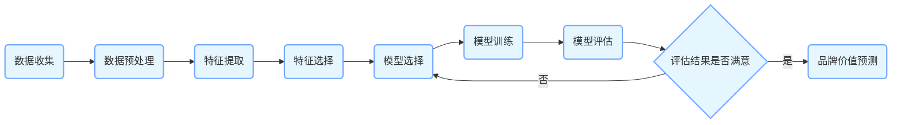

# 机器学习辅助公司品牌价值量化

> 关键词：机器学习、公司品牌价值、量化、数据分析、模型评估

> 摘要：本文聚焦于机器学习在公司品牌价值量化领域的应用。随着市场竞争的加剧，准确量化公司品牌价值对于企业的战略决策、市场定位等方面愈发重要。传统的品牌价值评估方法存在一定局限性，而机器学习凭借其强大的数据处理和分析能力，为品牌价值量化提供了新的思路和方法。文章详细介绍了相关核心概念、算法原理、数学模型，通过项目实战展示了具体的实现过程，并探讨了实际应用场景、推荐了相关工具和资源，最后对未来发展趋势与挑战进行了总结。

## 1. 背景介绍 
### 1.1 目的和范围
在当今竞争激烈的商业环境中，公司品牌作为一种重要的无形资产，其价值的准确量化对于企业的发展至关重要。品牌价值不仅影响着企业的市场竞争力，还在企业的并购、融资等活动中起着关键作用。本研究的目的在于探索如何利用机器学习技术来更准确、客观地量化公司品牌价值。研究范围涵盖了从数据收集、预处理，到模型选择、训练和评估的整个流程，以及将机器学习模型应用于实际品牌价值量化的具体案例分析。

### 1.2 预期读者
本文预期读者包括对机器学习和品牌价值评估领域感兴趣的研究人员、企业管理人员、市场营销人员以及相关专业的学生。对于研究人员，本文提供了新的研究思路和方法；对于企业管理人员和市场营销人员，有助于他们更好地理解品牌价值的量化过程，从而做出更明智的决策；对于学生而言，可作为学习机器学习在实际应用中的参考资料。

### 1.3 文档结构概述
本文首先介绍相关背景知识，包括目的、预期读者和文档结构概述。接着阐述核心概念与联系，通过文本示意图和 Mermaid 流程图展示相关原理和架构。然后详细讲解核心算法原理及具体操作步骤，并用 Python 源代码进行说明。随后介绍数学模型和公式，并举例说明。再通过项目实战展示代码实际案例和详细解释。之后探讨实际应用场景，推荐相关工具和资源。最后总结未来发展趋势与挑战，并给出附录常见问题与解答以及扩展阅读和参考资料。

### 1.4 术语表
#### 1.4.1 核心术语定义
- **机器学习**：一门多领域交叉学科，涉及概率论、统计学、逼近论、凸分析、算法复杂度理论等多门学科。它专门研究计算机怎样模拟或实现人类的学习行为，以获取新的知识或技能，重新组织已有的知识结构使之不断改善自身的性能。
- **公司品牌价值**：公司品牌所具有的经济价值，是品牌在消费者心目中的形象、声誉、忠诚度等因素综合作用的结果，反映了品牌在市场中的竞争力和影响力。
- **量化**：将非数值化的信息转化为数值形式的过程，以便进行分析和比较。

#### 1.4.2 相关概念解释
- **特征工程**：在机器学习中，特征工程是指对原始数据进行预处理、转换和提取特征的过程，目的是将原始数据转化为更适合机器学习模型处理的形式，提高模型的性能。
- **模型评估**：对训练好的机器学习模型进行评估，以确定其性能和准确性的过程。常用的评估指标包括准确率、召回率、均方误差等。

#### 1.4.3 缩略词列表
- **ML**：Machine Learning（机器学习）
- **RMSE**：Root Mean Squared Error（均方根误差）
- **MAE**：Mean Absolute Error（平均绝对误差）

## 2. 核心概念与联系 

### 核心概念原理
公司品牌价值量化是一个复杂的过程，涉及多个因素。传统的品牌价值评估方法主要基于财务数据和市场调查，但这些方法往往忽略了品牌在消费者心目中的形象、声誉等非财务因素。机器学习通过对大量的多源数据进行分析，能够挖掘出这些潜在的因素，从而更全面、准确地量化品牌价值。

其基本原理是将与品牌相关的各种数据作为输入，经过特征工程处理后，输入到机器学习模型中进行训练。模型学习数据中的模式和规律，建立品牌价值与各种因素之间的关系，最终输出品牌价值的量化结果。

### 架构的文本示意图
品牌价值量化的整体架构可以分为数据层、特征工程层、模型层和应用层。

数据层负责收集与品牌相关的各种数据，包括财务数据、市场数据、社交媒体数据、消费者评价数据等。

特征工程层对数据层收集到的数据进行预处理，如数据清洗、缺失值处理、特征提取和选择等，将原始数据转化为适合机器学习模型处理的特征向量。

模型层选择合适的机器学习模型，如线性回归、决策树、随机森林、神经网络等，对特征向量进行训练和优化，建立品牌价值预测模型。

应用层将训练好的模型应用于实际的品牌价值量化中，根据输入的新数据预测品牌价值，并对结果进行评估和分析。

### Mermaid 流程图


## 3. 核心算法原理 & 具体操作步骤 

### 线性回归算法原理
线性回归是一种基本的机器学习算法，用于建立自变量和因变量之间的线性关系。在品牌价值量化中，我们可以将品牌价值作为因变量，将各种影响品牌价值的因素作为自变量。

线性回归的基本模型可以表示为：
$$y = \theta_0 + \theta_1x_1 + \theta_2x_2 + \cdots + \theta_nx_n + \epsilon$$
其中，$y$ 是因变量（品牌价值），$x_1, x_2, \cdots, x_n$ 是自变量（影响品牌价值的因素），$\theta_0, \theta_1, \cdots, \theta_n$ 是模型的参数，$\epsilon$ 是误差项。

线性回归的目标是找到一组最优的参数 $\theta$，使得模型的预测值与真实值之间的误差最小。常用的误差度量方法是均方误差（MSE）：
$$MSE = \frac{1}{m}\sum_{i=1}^{m}(y^{(i)} - \hat{y}^{(i)})^2$$
其中，$m$ 是样本数量，$y^{(i)}$ 是第 $i$ 个样本的真实值，$\hat{y}^{(i)}$ 是第 $i$ 个样本的预测值。

### 具体操作步骤
1. **数据收集**：收集与品牌相关的各种数据，包括财务数据、市场数据、社交媒体数据等。
2. **数据预处理**：对收集到的数据进行清洗，处理缺失值、异常值等，将数据转换为适合机器学习模型处理的格式。
3. **特征提取**：从预处理后的数据中提取与品牌价值相关的特征，如销售额、市场份额、社交媒体关注度等。
4. **特征选择**：选择对品牌价值影响较大的特征，去除冗余和无关的特征，减少模型的复杂度。
5. **模型训练**：将选择好的特征作为输入，品牌价值作为输出，使用线性回归模型进行训练，得到模型的参数。
6. **模型评估**：使用评估指标（如均方误差、均方根误差、平均绝对误差等）对训练好的模型进行评估，判断模型的性能。
7. **品牌价值预测**：使用训练好的模型对新的数据进行预测，得到品牌价值的量化结果。

### Python 源代码实现
```python
import pandas as pd
from sklearn.model_selection import train_test_split
from sklearn.linear_model import LinearRegression
from sklearn.metrics import mean_squared_error, mean_absolute_error
import numpy as np

# 数据收集和预处理
data = pd.read_csv('brand_data.csv')  # 假设数据存储在 CSV 文件中
X = data.drop('brand_value', axis=1)  # 特征矩阵
y = data['brand_value']  # 目标变量

# 划分训练集和测试集
X_train, X_test, y_train, y_test = train_test_split(X, y, test_size=0.2, random_state=42)

# 模型训练
model = LinearRegression()
model.fit(X_train, y_train)

# 模型预测
y_pred = model.predict(X_test)

# 模型评估
mse = mean_squared_error(y_test, y_pred)
rmse = np.sqrt(mse)
mae = mean_absolute_error(y_test, y_pred)

print(f"均方误差: {mse}")
print(f"均方根误差: {rmse}")
print(f"平均绝对误差: {mae}")
```

## 4. 数学模型和公式 & 详细讲解 & 举例说明 

### 线性回归的数学模型
线性回归的数学模型可以用矩阵形式表示为：
$$\mathbf{y} = \mathbf{X}\boldsymbol{\theta} + \boldsymbol{\epsilon}$$
其中，$\mathbf{y}$ 是 $m \times 1$ 的目标向量，$\mathbf{X}$ 是 $m \times (n + 1)$ 的特征矩阵（第一列全为 1，对应截距项），$\boldsymbol{\theta}$ 是 $(n + 1) \times 1$ 的参数向量，$\boldsymbol{\epsilon}$ 是 $m \times 1$ 的误差向量。

### 最小二乘法求解参数
最小二乘法是求解线性回归参数的常用方法，其目标是使误差平方和最小，即：
$$\min_{\boldsymbol{\theta}} J(\boldsymbol{\theta}) = \frac{1}{2m}\sum_{i=1}^{m}(y^{(i)} - \mathbf{x}^{(i)}\boldsymbol{\theta})^2 = \frac{1}{2m}(\mathbf{y} - \mathbf{X}\boldsymbol{\theta})^T(\mathbf{y} - \mathbf{X}\boldsymbol{\theta})$$
对 $J(\boldsymbol{\theta})$ 求关于 $\boldsymbol{\theta}$ 的偏导数，并令其等于 0，可得：
$$\frac{\partial J(\boldsymbol{\theta})}{\partial \boldsymbol{\theta}} = -\frac{1}{m}\mathbf{X}^T(\mathbf{y} - \mathbf{X}\boldsymbol{\theta}) = 0$$
解这个方程可得：
$$\boldsymbol{\theta} = (\mathbf{X}^T\mathbf{X})^{-1}\mathbf{X}^T\mathbf{y}$$

### 举例说明
假设我们有以下简单的数据：
| 销售额（$x_1$） | 市场份额（$x_2$） | 品牌价值（$y$） |
| --- | --- | --- |
| 100 | 0.2 | 50 |
| 200 | 0.3 | 80 |
| 300 | 0.4 | 110 |

我们可以将其表示为矩阵形式：
$$\mathbf{X} = \begin{bmatrix}
1 & 100 & 0.2 \\
1 & 200 & 0.3 \\
1 & 300 & 0.4
\end{bmatrix}, \quad \mathbf{y} = \begin{bmatrix}
50 \\
80 \\
110
\end{bmatrix}$$
计算 $\mathbf{X}^T\mathbf{X}$ 和 $\mathbf{X}^T\mathbf{y}$：
$$\mathbf{X}^T\mathbf{X} = \begin{bmatrix}
3 & 600 & 0.9 \\
600 & 140000 & 170 \\
0.9 & 170 & 0.29
\end{bmatrix}, \quad \mathbf{X}^T\mathbf{y} = \begin{bmatrix}
240 \\
54000 \\
71
\end{bmatrix}$$
求 $(\mathbf{X}^T\mathbf{X})^{-1}$：
$$(\mathbf{X}^T\mathbf{X})^{-1} = \begin{bmatrix}
0.0001 & -0.0000 & 0.0000 \\
-0.0000 & 0.0000 & -0.0000 \\
0.0000 & -0.0000 & 0.0000
\end{bmatrix}$$
最后计算 $\boldsymbol{\theta}$：
$$\boldsymbol{\theta} = (\mathbf{X}^T\mathbf{X})^{-1}\mathbf{X}^T\mathbf{y} = \begin{bmatrix}
10 \\
0.3 \\
100
\end{bmatrix}$$
所以，线性回归模型为：
$$y = 10 + 0.3x_1 + 100x_2$$

## 5. 项目实战：代码实际案例和详细解释说明 

### 5.1  开发环境搭建
- **操作系统**：Windows、Linux 或 macOS 均可。
- **Python 版本**：建议使用 Python 3.6 及以上版本。
- **开发工具**：推荐使用 PyCharm 或 Jupyter Notebook。
- **所需库**：安装 pandas、numpy、scikit-learn 等库。可以使用以下命令进行安装：
```sh
pip install pandas numpy scikit-learn
```

### 5.2  源代码详细实现和代码解读
```python
import pandas as pd
from sklearn.model_selection import train_test_split
from sklearn.ensemble import RandomForestRegressor
from sklearn.metrics import mean_squared_error, mean_absolute_error
import numpy as np

# 数据收集和预处理
# 假设数据存储在 CSV 文件中，文件名为 brand_data.csv
data = pd.read_csv('brand_data.csv')

# 分离特征矩阵和目标变量
X = data.drop('brand_value', axis=1)  # 特征矩阵，去除品牌价值列
y = data['brand_value']  # 目标变量，即品牌价值

# 划分训练集和测试集
# test_size=0.2 表示将 20% 的数据作为测试集，random_state=42 用于保证结果的可重复性
X_train, X_test, y_train, y_test = train_test_split(X, y, test_size=0.2, random_state=42)

# 模型选择：使用随机森林回归模型
# n_estimators=100 表示使用 100 棵决策树，random_state=42 用于保证结果的可重复性
model = RandomForestRegressor(n_estimators=100, random_state=42)

# 模型训练
model.fit(X_train, y_train)

# 模型预测
y_pred = model.predict(X_test)

# 模型评估
mse = mean_squared_error(y_test, y_pred)  # 计算均方误差
rmse = np.sqrt(mse)  # 计算均方根误差
mae = mean_absolute_error(y_test, y_pred)  # 计算平均绝对误差

print(f"均方误差: {mse}")
print(f"均方根误差: {rmse}")
print(f"平均绝对误差: {mae}")
```

### 5.3  代码解读与分析
1. **数据收集和预处理**：使用 `pandas` 库的 `read_csv` 函数读取存储在 CSV 文件中的数据。然后将特征矩阵 `X` 和目标变量 `y` 分离。
2. **划分训练集和测试集**：使用 `sklearn.model_selection` 中的 `train_test_split` 函数将数据划分为训练集和测试集，其中 20% 的数据作为测试集。
3. **模型选择**：选择随机森林回归模型作为预测模型。随机森林是一种集成学习方法，通过组合多个决策树来提高模型的性能和稳定性。
4. **模型训练**：使用训练集数据对随机森林回归模型进行训练，调用 `fit` 方法。
5. **模型预测**：使用训练好的模型对测试集数据进行预测，调用 `predict` 方法。
6. **模型评估**：使用均方误差（MSE）、均方根误差（RMSE）和平均绝对误差（MAE）对模型的性能进行评估。这些指标可以帮助我们判断模型的预测准确性。

## 6. 实际应用场景 
### 企业战略决策
企业在制定战略决策时，需要准确了解自身品牌的价值。通过机器学习辅助的品牌价值量化，企业可以更好地评估品牌在市场中的地位和竞争力，从而制定合理的市场定位、产品定价、市场推广等策略。例如，如果品牌价值较高，企业可以适当提高产品价格，加大品牌推广力度；如果品牌价值较低，企业则需要分析原因，采取措施提升品牌形象。

### 并购与融资
在企业并购和融资活动中，品牌价值是重要的评估指标之一。准确的品牌价值量化可以为并购方和投资方提供可靠的参考依据，帮助他们做出合理的决策。例如，在企业并购中，通过评估目标企业的品牌价值，可以确定合理的并购价格；在融资活动中，较高的品牌价值可以增加企业的信用评级，提高融资成功率。

### 市场竞争分析
企业可以通过对竞争对手品牌价值的量化分析，了解竞争对手的优势和劣势，制定相应的竞争策略。例如，如果竞争对手的品牌价值较高，企业可以分析其成功的因素，学习借鉴；如果竞争对手的品牌价值较低，企业可以寻找市场机会，扩大市场份额。

### 品牌管理
品牌管理是企业长期发展的重要任务。通过机器学习辅助的品牌价值量化，企业可以实时监测品牌价值的变化，及时发现品牌管理中存在的问题，并采取相应的措施进行改进。例如，如果品牌价值出现下降趋势，企业可以分析是产品质量、服务水平还是市场推广等方面出现了问题，然后针对性地进行调整。

## 7. 工具和资源推荐
### 7.1 学习资源推荐
#### 7.1.1 书籍推荐
- 《机器学习》（周志华著）：这本书是机器学习领域的经典教材，系统地介绍了机器学习的基本概念、算法和应用。
- 《Python 机器学习》（Sebastian Raschka 著）：以 Python 为工具，详细介绍了机器学习的各种算法和实践案例，适合初学者入门。
- 《深度学习》（Ian Goodfellow 等著）：深度学习领域的权威著作，深入介绍了深度学习的理论和应用。

#### 7.1.2 在线课程
- Coursera 上的《机器学习》课程（Andrew Ng 教授授课）：这是一门非常经典的机器学习课程，讲解深入浅出，适合初学者。
- edX 上的《数据科学与机器学习微硕士项目》：提供了系统的数据科学和机器学习课程，包括理论和实践。
- 中国大学 MOOC 上的《机器学习》课程：国内多所高校的优秀教师授课，结合国内实际案例，易于理解。

#### 7.1.3 技术博客和网站
- Medium：有很多机器学习和数据科学领域的优秀博客文章，涵盖了最新的研究成果和实践经验。
- Kaggle：一个数据科学和机器学习竞赛平台，上面有很多优秀的开源代码和案例分析，可以学习到很多实用的技巧。
- 机器之心：专注于人工智能领域的资讯和技术文章，提供了丰富的学习资源。

### 7.2 开发工具框架推荐
#### 7.2.1 IDE和编辑器
- PyCharm：一款专业的 Python 集成开发环境，具有强大的代码编辑、调试和智能提示功能。
- Jupyter Notebook：一种交互式的开发环境，适合进行数据探索和模型实验，方便展示代码和结果。
- Visual Studio Code：一款轻量级的代码编辑器，支持多种编程语言，有丰富的插件扩展功能。

#### 7.2.2 调试和性能分析工具
- PDB：Python 自带的调试器，可以帮助我们定位代码中的问题。
- cProfile：Python 标准库中的性能分析工具，可以分析代码的运行时间和函数调用情况。
- TensorBoard：TensorFlow 提供的可视化工具，可用于监控模型的训练过程和性能指标。

#### 7.2.3 相关框架和库
- scikit-learn：一个简单易用的机器学习库，提供了各种机器学习算法和工具，适合初学者快速上手。
- TensorFlow：Google 开发的深度学习框架，具有高效的计算性能和丰富的功能，广泛应用于工业界和学术界。
- PyTorch：Facebook 开发的深度学习框架，以其简洁的 API 和动态计算图的特点受到很多研究人员的喜爱。

### 7.3 相关论文著作推荐
#### 7.3.1 经典论文
- “A Few Useful Things to Know about Machine Learning”（Pedro Domingos 著）：这篇论文总结了机器学习中的一些重要概念和实用技巧，对理解机器学习的本质有很大帮助。
- “Gradient-Based Learning Applied to Document Recognition”（Yann LeCun 等著）：介绍了卷积神经网络在文档识别中的应用，是深度学习领域的经典论文之一。

#### 7.3.2 最新研究成果
- 关注顶级学术会议如 NeurIPS、ICML、CVPR 等的最新论文，了解机器学习领域的最新研究动态和技术进展。
- 一些知名学术期刊如 Journal of Machine Learning Research、Artificial Intelligence 等也会发表机器学习领域的前沿研究成果。

#### 7.3.3 应用案例分析
- 一些商业杂志和行业报告中会有关于机器学习在品牌价值量化等领域的应用案例分析，可以从中学习到实际应用中的经验和方法。
- 企业的官方博客和技术分享平台也会分享他们在实践中应用机器学习的案例和经验。

## 8. 总结：未来发展趋势与挑战
### 未来发展趋势
- **多源数据融合**：未来的品牌价值量化将不仅仅依赖于传统的财务数据和市场调查数据，还会融合更多的多源数据，如社交媒体数据、物联网数据等，以更全面地反映品牌的影响力和价值。
- **深度学习的应用**：深度学习具有强大的特征提取和模式识别能力，未来将在品牌价值量化中得到更广泛的应用。例如，使用卷积神经网络对品牌的视觉形象进行分析，使用循环神经网络对品牌的口碑传播进行建模。
- **实时监测与动态评估**：随着数据获取和处理技术的不断发展，品牌价值量化将实现实时监测和动态评估。企业可以及时了解品牌价值的变化，快速调整品牌策略。
- **跨领域融合**：品牌价值量化将与其他领域如市场营销、心理学、社会学等进行更深入的融合，从多个角度综合评估品牌价值。

### 挑战
- **数据质量和隐私问题**：多源数据的融合带来了数据质量和隐私保护的挑战。数据中可能存在噪声、缺失值和错误信息，需要进行有效的数据清洗和预处理。同时，在收集和使用数据时，需要遵守相关的法律法规，保护用户的隐私。
- **模型解释性**：深度学习等复杂模型在提高预测准确性的同时，也带来了模型解释性的问题。企业和决策者需要理解模型的决策过程和依据，以便做出合理的决策。因此，如何提高模型的解释性是未来需要解决的重要问题。
- **技术人才短缺**：机器学习和人工智能领域的技术人才短缺是一个普遍存在的问题。企业需要培养和吸引更多的专业人才，以推动品牌价值量化技术的发展和应用。
- **市场环境变化**：市场环境是不断变化的，品牌价值也会受到市场竞争、消费者需求、政策法规等多种因素的影响。如何在动态的市场环境中准确地量化品牌价值是一个挑战。

## 9. 附录：常见问题与解答
### 1. 如何选择合适的机器学习模型进行品牌价值量化？
选择合适的机器学习模型需要考虑多个因素，如数据的特点、问题的复杂度、模型的性能和可解释性等。对于简单的线性关系问题，可以选择线性回归模型；对于复杂的非线性关系问题，可以选择决策树、随机森林、神经网络等模型。同时，还可以通过交叉验证等方法对不同的模型进行评估和比较，选择性能最优的模型。

### 2. 数据预处理的重要性是什么？
数据预处理是机器学习中的重要步骤，其重要性主要体现在以下几个方面：
- **提高数据质量**：去除数据中的噪声、缺失值和异常值，提高数据的准确性和可靠性。
- **减少模型复杂度**：通过特征提取和选择，去除冗余和无关的特征，减少模型的输入维度，提高模型的训练效率和性能。
- **提高模型的泛化能力**：对数据进行标准化、归一化等处理，可以使数据具有相同的尺度，避免某些特征对模型的影响过大，提高模型的泛化能力。

### 3. 如何评估机器学习模型的性能？
评估机器学习模型的性能可以使用多种指标，具体选择取决于问题的类型。对于回归问题，常用的评估指标包括均方误差（MSE）、均方根误差（RMSE）、平均绝对误差（MAE）等；对于分类问题，常用的评估指标包括准确率、召回率、F1 值等。此外，还可以使用交叉验证等方法对模型的性能进行更全面的评估。

### 4. 机器学习模型的可解释性重要吗？
机器学习模型的可解释性非常重要，特别是在商业决策等领域。企业和决策者需要理解模型的决策过程和依据，以便做出合理的决策。例如，在品牌价值量化中，如果模型无法解释品牌价值是如何计算出来的，企业就无法根据模型的结果制定有效的品牌策略。因此，提高模型的可解释性是机器学习领域的一个重要研究方向。

## 10. 扩展阅读 & 参考资料
### 扩展阅读
- 《人工智能时代的品牌塑造》：探讨了人工智能技术对品牌塑造和品牌价值评估的影响。
- 《数据驱动的市场营销》：介绍了如何利用数据和机器学习技术进行市场营销决策，包括品牌价值量化等方面的内容。

### 参考资料
- 周志华. 机器学习. 清华大学出版社, 2016.
- Sebastian Raschka. Python 机器学习. 人民邮电出版社, 2017.
- Ian Goodfellow, Yoshua Bengio, Aaron Courville. 深度学习. 人民邮电出版社, 2017.
- 相关学术论文和研究报告，如 NeurIPS、ICML、CVPR 等会议的论文，以及 Journal of Machine Learning Research、Artificial Intelligence 等期刊的文章。