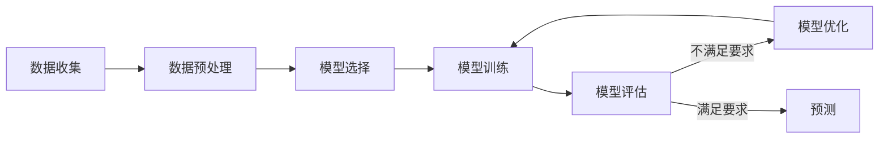

# 机器学习预测公司自由现金流趋势

> 关键词：机器学习、自由现金流、预测模型、时间序列分析、财务数据

> 摘要：本文聚焦于利用机器学习技术预测公司自由现金流趋势这一重要课题。首先介绍了研究的背景、目的、预期读者等基础信息，接着阐述了机器学习和自由现金流的核心概念及其联系。详细讲解了用于预测的核心算法原理，并给出具体操作步骤及Python源代码。通过数学模型和公式对算法进行深入剖析，并举例说明。在项目实战部分，给出了开发环境搭建的步骤，详细实现并解读了预测代码。探讨了该技术在实际中的应用场景，推荐了相关的学习资源、开发工具框架以及论文著作。最后总结了未来发展趋势与挑战，还包含常见问题解答以及扩展阅读与参考资料，旨在为相关从业者和研究者提供全面且深入的技术指导。

## 1. 背景介绍 
### 1.1 目的和范围
自由现金流是评估公司财务健康状况和价值的关键指标之一。准确预测公司自由现金流趋势对于投资者、管理层和其他利益相关者来说至关重要。投资者可以依据预测结果做出更明智的投资决策，管理层则能据此优化公司的财务策略和资源配置。本文的目的在于介绍如何运用机器学习技术来预测公司自由现金流趋势，范围涵盖从数据预处理、模型选择、训练到评估的整个流程，以及实际应用场景和相关工具资源的推荐。

### 1.2 预期读者
本文预期读者包括金融分析师、投资经理、公司财务管理人员、数据科学家、机器学习从业者以及对利用技术手段进行财务预测感兴趣的研究人员。无论您是具备一定编程基础的专业人士，还是希望了解机器学习在财务领域应用的初学者，都能从本文中获取有价值的信息。

### 1.3 文档结构概述
本文首先介绍相关背景信息，包括目的、预期读者等。接着阐述核心概念，包括机器学习和自由现金流的原理及它们之间的联系，并给出相应的文本示意图和Mermaid流程图。然后详细讲解核心算法原理和具体操作步骤，结合Python源代码进行说明。通过数学模型和公式进一步深入分析算法，并举例说明。在项目实战部分，介绍开发环境搭建、源代码实现及代码解读。探讨实际应用场景，推荐相关的工具和资源。最后总结未来发展趋势与挑战，提供常见问题解答以及扩展阅读与参考资料。

### 1.4 术语表
#### 1.4.1 核心术语定义
- **自由现金流（Free Cash Flow, FCF）**：指公司在满足了所有营运成本和资本性支出后剩余的现金流量，它反映了公司实际可用于分配给股东、偿还债务或进行再投资的现金数量。
- **机器学习（Machine Learning, ML）**：是一门多领域交叉学科，涉及概率论、统计学、逼近论、凸分析、算法复杂度理论等多门学科。它专门研究计算机怎样模拟或实现人类的学习行为，以获取新的知识或技能，重新组织已有的知识结构使之不断改善自身的性能。
- **时间序列分析（Time Series Analysis）**：是一种统计分析方法，它基于随机过程理论和数理统计学方法，研究随机数据序列所遵从的统计规律，以用于解决实际问题。

#### 1.4.2 相关概念解释
- **特征工程**：是指从原始数据中提取特征并将其转换为适合机器学习模型的格式的过程。在预测公司自由现金流趋势中，特征工程包括选择与自由现金流相关的财务指标，如营业收入、净利润、固定资产投资等，并对这些指标进行处理和转换。
- **模型评估**：是指使用一定的评估指标来衡量机器学习模型的性能。常见的评估指标包括均方误差（Mean Squared Error, MSE）、均方根误差（Root Mean Squared Error, RMSE）、平均绝对误差（Mean Absolute Error, MAE）等。

#### 1.4.3 缩略词列表
- **FCF**：Free Cash Flow（自由现金流）
- **ML**：Machine Learning（机器学习）
- **MSE**：Mean Squared Error（均方误差）
- **RMSE**：Root Mean Squared Error（均方根误差）
- **MAE**：Mean Absolute Error（平均绝对误差）

## 2. 核心概念与联系 
### 2.1 自由现金流原理
自由现金流的计算通常有两种方法：股权自由现金流（Free Cash Flow to Equity, FCFE）和公司自由现金流（Free Cash Flow to the Firm, FCFF）。

股权自由现金流是公司向债权人支付利息、偿还本金，向优先股股东支付股息后剩余的可分配给普通股股东的现金流量，其计算公式为：

$$FCFE = 净利润 + 折旧与摊销 - 资本性支出 - 营运资本增加 + 债务净增加$$

公司自由现金流是公司所有权利要求者，包括普通股股东、优先股股东和债权人的现金流量总和，其计算公式为：

$$FCFF = 息税前利润 \times (1 - 税率) + 折旧与摊销 - 资本性支出 - 营运资本增加$$

自由现金流反映了公司的盈利能力和财务灵活性。一个公司的自由现金流持续为正且稳定增长，通常意味着该公司具有较强的盈利能力和良好的财务状况；反之，如果自由现金流持续为负，可能表示公司面临财务困境。

### 2.2 机器学习原理
机器学习的基本原理是通过对大量数据的学习，发现数据中的模式和规律，并利用这些模式和规律对新的数据进行预测或分类。机器学习算法可以分为监督学习、无监督学习、半监督学习和强化学习四大类。

在预测公司自由现金流趋势的任务中，我们主要使用监督学习算法。监督学习算法需要有标记的数据，即每个数据样本都有一个对应的目标值。在自由现金流预测中，目标值就是公司的自由现金流，而输入特征可以是各种财务指标。

常见的监督学习算法包括线性回归、决策树、随机森林、支持向量机、神经网络等。不同的算法适用于不同的数据特点和问题场景，需要根据具体情况进行选择。

### 2.3 自由现金流与机器学习的联系
自由现金流的预测是一个复杂的问题，受到多种因素的影响，如公司的经营状况、市场环境、宏观经济因素等。传统的财务分析方法往往难以全面考虑这些因素之间的复杂关系。而机器学习算法可以通过对大量历史数据的学习，自动发现这些因素与自由现金流之间的潜在关系，并建立预测模型。

例如，我们可以收集公司过去多年的财务数据，包括营业收入、净利润、固定资产投资、营运资本等，将这些数据作为输入特征，自由现金流作为目标值，使用机器学习算法进行训练，得到一个能够预测未来自由现金流的模型。通过不断更新和优化模型，可以提高预测的准确性和可靠性。

### 2.4 文本示意图
自由现金流预测的流程可以用以下文本示意图表示：

1. 数据收集：收集公司的历史财务数据，包括各种财务指标和自由现金流数据。
2. 数据预处理：对收集到的数据进行清洗、缺失值处理、特征工程等操作，将数据转换为适合机器学习模型的格式。
3. 模型选择：根据数据特点和问题场景选择合适的机器学习算法。
4. 模型训练：使用预处理后的数据对模型进行训练，调整模型的参数，使模型能够准确地预测自由现金流。
5. 模型评估：使用评估指标对训练好的模型进行评估，判断模型的性能是否满足要求。
6. 模型优化：根据评估结果对模型进行优化，如调整模型参数、选择更合适的特征等。
7. 预测：使用优化后的模型对未来的自由现金流进行预测。

### 2.5 Mermaid流程图


## 3. 核心算法原理 & 具体操作步骤 
### 3.1 线性回归算法原理
线性回归是一种简单而常用的监督学习算法，它的基本思想是通过建立一个线性模型来描述输入特征和目标值之间的关系。在线性回归中，我们假设目标值 $y$ 与输入特征 $x_1, x_2, \cdots, x_n$ 之间存在线性关系，即：

$$y = \beta_0 + \beta_1 x_1 + \beta_2 x_2 + \cdots + \beta_n x_n + \epsilon$$

其中，$\beta_0, \beta_1, \cdots, \beta_n$ 是模型的参数，$\epsilon$ 是误差项，表示模型无法解释的随机因素。

线性回归的目标是找到一组最优的参数 $\beta_0, \beta_1, \cdots, \beta_n$，使得模型的预测值与真实值之间的误差最小。常用的误差度量方法是均方误差（MSE），即：

$$MSE = \frac{1}{m} \sum_{i=1}^{m} (y_i - \hat{y}_i)^2$$

其中，$m$ 是样本数量，$y_i$ 是第 $i$ 个样本的真实值，$\hat{y}_i$ 是第 $i$ 个样本的预测值。

通过最小化均方误差，我们可以得到最优的参数估计值。在实际应用中，通常使用梯度下降法或正规方程法来求解最优参数。

### 3.2 具体操作步骤
#### 3.2.1 数据准备
首先，我们需要收集公司的历史财务数据，包括各种财务指标和自由现金流数据。将数据存储在一个数据集文件中，例如CSV文件。

#### 3.2.2 数据预处理
使用Python的`pandas`库读取数据集文件，并进行数据清洗、缺失值处理、特征工程等操作。以下是一个简单的数据预处理示例代码：

```python
import pandas as pd
from sklearn.preprocessing import StandardScaler

# 读取数据集
data = pd.read_csv('financial_data.csv')

# 处理缺失值
data = data.dropna()

# 分离特征和目标值
X = data.drop('FCF', axis=1)
y = data['FCF']

# 特征标准化
scaler = StandardScaler()
X_scaled = scaler.fit_transform(X)
```

#### 3.2.3 模型训练
使用`sklearn`库中的`LinearRegression`类来训练线性回归模型。以下是训练模型的示例代码：

```python
from sklearn.model_selection import train_test_split
from sklearn.linear_model import LinearRegression

# 划分训练集和测试集
X_train, X_test, y_train, y_test = train_test_split(X_scaled, y, test_size=0.2, random_state=42)

# 创建线性回归模型
model = LinearRegression()

# 训练模型
model.fit(X_train, y_train)
```

#### 3.2.4 模型评估
使用评估指标对训练好的模型进行评估，常用的评估指标包括均方误差（MSE）、均方根误差（RMSE）、平均绝对误差（MAE）等。以下是评估模型的示例代码：

```python
from sklearn.metrics import mean_squared_error, mean_absolute_error
import numpy as np

# 预测测试集
y_pred = model.predict(X_test)

# 计算评估指标
mse = mean_squared_error(y_test, y_pred)
rmse = np.sqrt(mse)
mae = mean_absolute_error(y_test, y_pred)

print(f'MSE: {mse}')
print(f'RMSE: {rmse}')
print(f'MAE: {mae}')
```

#### 3.2.5 预测
使用训练好的模型对未来的自由现金流进行预测。以下是预测的示例代码：

```python
# 假设有新的输入数据
new_data = pd.read_csv('new_financial_data.csv')

# 数据预处理
new_data = new_data.dropna()
new_data_scaled = scaler.transform(new_data)

# 预测
new_pred = model.predict(new_data_scaled)

print(f'预测的自由现金流: {new_pred}')
```

## 4. 数学模型和公式 & 详细讲解 & 举例说明 
### 4.1 线性回归的数学模型
线性回归的数学模型可以用矩阵形式表示：

$$\mathbf{y} = \mathbf{X} \boldsymbol{\beta} + \boldsymbol{\epsilon}$$

其中，$\mathbf{y}$ 是 $m \times 1$ 的目标值向量，$\mathbf{X}$ 是 $m \times (n + 1)$ 的特征矩阵，$\boldsymbol{\beta}$ 是 $(n + 1) \times 1$ 的参数向量，$\boldsymbol{\epsilon}$ 是 $m \times 1$ 的误差向量。

均方误差的矩阵形式为：

$$MSE = \frac{1}{m} (\mathbf{y} - \mathbf{X} \boldsymbol{\beta})^T (\mathbf{y} - \mathbf{X} \boldsymbol{\beta})$$

### 4.2 正规方程法求解最优参数
正规方程法是一种直接求解最优参数的方法，其原理是通过对均方误差求导并令导数为零，得到最优参数的解析解。

对 $MSE$ 关于 $\boldsymbol{\beta}$ 求导并令导数为零，可得：

$$\frac{\partial MSE}{\partial \boldsymbol{\beta}} = -\frac{2}{m} \mathbf{X}^T (\mathbf{y} - \mathbf{X} \boldsymbol{\beta}) = 0$$

化简后得到正规方程：

$$(\mathbf{X}^T \mathbf{X}) \boldsymbol{\beta} = \mathbf{X}^T \mathbf{y}$$

如果 $\mathbf{X}^T \mathbf{X}$ 可逆，则最优参数的解析解为：

$$\boldsymbol{\beta} = (\mathbf{X}^T \mathbf{X})^{-1} \mathbf{X}^T \mathbf{y}$$

### 4.3 举例说明
假设我们有一个简单的数据集，包含两个特征 $x_1$ 和 $x_2$，以及一个目标值 $y$。数据集如下：

| $x_1$ | $x_2$ | $y$ |
|-------|-------|-----|
| 1     | 2     | 5   |
| 2     | 3     | 7   |
| 3     | 4     | 9   |

首先，我们将数据集转换为矩阵形式：

$$\mathbf{X} = \begin{bmatrix} 1 & 1 & 2 \\ 1 & 2 & 3 \\ 1 & 3 & 4 \end{bmatrix}$$

$$\mathbf{y} = \begin{bmatrix} 5 \\ 7 \\ 9 \end{bmatrix}$$

然后，计算 $\mathbf{X}^T \mathbf{X}$ 和 $\mathbf{X}^T \mathbf{y}$：

$$\mathbf{X}^T \mathbf{X} = \begin{bmatrix} 3 & 6 & 9 \\ 6 & 14 & 20 \\ 9 & 20 & 29 \end{bmatrix}$$

$$\mathbf{X}^T \mathbf{y} = \begin{bmatrix} 21 \\ 44 \\ 65 \end{bmatrix}$$

接着，求 $(\mathbf{X}^T \mathbf{X})^{-1}$：

$$(\mathbf{X}^T \mathbf{X})^{-1} = \begin{bmatrix} 3.6667 & -3 & 0.3333 \\ -3 & 2.5 & -0.5 \\ 0.3333 & -0.5 & 0.1667 \end{bmatrix}$$

最后，计算最优参数 $\boldsymbol{\beta}$：

$$\boldsymbol{\beta} = (\mathbf{X}^T \mathbf{X})^{-1} \mathbf{X}^T \mathbf{y} = \begin{bmatrix} 1 \\ 2 \\ 0 \end{bmatrix}$$

因此，线性回归模型的方程为：

$$y = 1 + 2x_1 + 0x_2$$

## 5. 项目实战：代码实际案例和详细解释说明 
### 5.1  开发环境搭建
#### 5.1.1 安装Python
首先，需要安装Python环境。建议使用Python 3.6及以上版本。可以从Python官方网站（https://www.python.org/downloads/）下载并安装适合自己操作系统的Python版本。

#### 5.1.2 安装必要的库
使用`pip`命令安装必要的Python库，包括`pandas`、`numpy`、`scikit-learn`等。以下是安装命令：

```sh
pip install pandas numpy scikit-learn
```

### 5.2  源代码详细实现和代码解读
以下是一个完整的使用线性回归预测公司自由现金流趋势的Python代码示例：

```python
import pandas as pd
import numpy as np
from sklearn.preprocessing import StandardScaler
from sklearn.model_selection import train_test_split
from sklearn.linear_model import LinearRegression
from sklearn.metrics import mean_squared_error, mean_absolute_error

# 读取数据集
data = pd.read_csv('financial_data.csv')

# 处理缺失值
data = data.dropna()

# 分离特征和目标值
X = data.drop('FCF', axis=1)
y = data['FCF']

# 特征标准化
scaler = StandardScaler()
X_scaled = scaler.fit_transform(X)

# 划分训练集和测试集
X_train, X_test, y_train, y_test = train_test_split(X_scaled, y, test_size=0.2, random_state=42)

# 创建线性回归模型
model = LinearRegression()

# 训练模型
model.fit(X_train, y_train)

# 预测测试集
y_pred = model.predict(X_test)

# 计算评估指标
mse = mean_squared_error(y_test, y_pred)
rmse = np.sqrt(mse)
mae = mean_absolute_error(y_test, y_pred)

print(f'MSE: {mse}')
print(f'RMSE: {rmse}')
print(f'MAE: {mae}')

# 假设有新的输入数据
new_data = pd.read_csv('new_financial_data.csv')

# 数据预处理
new_data = new_data.dropna()
new_data_scaled = scaler.transform(new_data)

# 预测
new_pred = model.predict(new_data_scaled)

print(f'预测的自由现金流: {new_pred}')
```

### 5.3  代码解读与分析
#### 5.3.1 数据读取和预处理
```python
data = pd.read_csv('financial_data.csv')
data = data.dropna()
X = data.drop('FCF', axis=1)
y = data['FCF']
scaler = StandardScaler()
X_scaled = scaler.fit_transform(X)
```
这段代码使用`pandas`库读取数据集文件，并处理缺失值。然后分离特征和目标值，使用`StandardScaler`类对特征进行标准化处理。

#### 5.3.2 数据集划分
```python
X_train, X_test, y_train, y_test = train_test_split(X_scaled, y, test_size=0.2, random_state=42)
```
这段代码使用`train_test_split`函数将数据集划分为训练集和测试集，其中测试集占比为20%。

#### 5.3.3 模型训练
```python
model = LinearRegression()
model.fit(X_train, y_train)
```
这段代码创建一个线性回归模型，并使用训练集对模型进行训练。

#### 5.3.4 模型评估
```python
y_pred = model.predict(X_test)
mse = mean_squared_error(y_test, y_pred)
rmse = np.sqrt(mse)
mae = mean_absolute_error(y_test, y_pred)
print(f'MSE: {mse}')
print(f'RMSE: {rmse}')
print(f'MAE: {mae}')
```
这段代码使用测试集对模型进行预测，并计算均方误差（MSE）、均方根误差（RMSE）和平均绝对误差（MAE），以评估模型的性能。

#### 5.3.5 新数据预测
```python
new_data = pd.read_csv('new_financial_data.csv')
new_data = new_data.dropna()
new_data_scaled = scaler.transform(new_data)
new_pred = model.predict(new_data_scaled)
print(f'预测的自由现金流: {new_pred}')
```
这段代码读取新的输入数据，进行数据预处理，然后使用训练好的模型对新数据进行预测。

## 6. 实际应用场景 
### 6.1 投资决策
投资者可以利用机器学习预测的公司自由现金流趋势来评估公司的价值和投资潜力。如果预测结果显示公司的自由现金流将持续增长，那么该公司可能具有较高的投资价值；反之，如果自由现金流呈下降趋势，投资者可能需要谨慎考虑是否投资该公司。

### 6.2 公司财务规划
公司管理层可以根据自由现金流预测结果制定合理的财务规划。例如，如果预测到未来自由现金流充足，公司可以考虑增加投资、扩大生产规模或进行并购活动；如果预测到自由现金流紧张，公司可以采取措施削减成本、优化资本结构或调整经营策略。

### 6.3 风险评估
金融机构和评级机构可以利用自由现金流预测来评估公司的信用风险。如果公司的自由现金流不稳定或持续为负，可能意味着该公司面临较高的信用风险，金融机构在提供贷款或评级机构在进行评级时会更加谨慎。

### 6.4 行业分析
通过对多个公司的自由现金流趋势进行预测和分析，可以了解整个行业的发展状况和趋势。例如，如果某个行业的大部分公司自由现金流都呈现增长趋势，说明该行业处于上升期；反之，如果大部分公司自由现金流下降，可能意味着该行业面临挑战。

## 7. 工具和资源推荐
### 7.1 学习资源推荐
#### 7.1.1 书籍推荐
- 《Python机器学习》（Sebastian Raschka著）：本书详细介绍了Python在机器学习中的应用，包括各种机器学习算法的原理、实现和应用案例。
- 《统计学习方法》（李航著）：这本书系统地介绍了统计学习的主要方法，包括监督学习、无监督学习、强化学习等，是学习机器学习的经典教材。
- 《金融数据分析与挖掘》（Ruppert和Matteson著）：本书介绍了金融数据分析和挖掘的方法和技术，包括时间序列分析、风险评估、投资组合优化等，对于将机器学习应用于金融领域有很大的帮助。

#### 7.1.2 在线课程
- Coursera上的“Machine Learning”（Andrew Ng教授主讲）：这是一门非常经典的机器学习课程，介绍了机器学习的基本概念、算法和应用，适合初学者。
- edX上的“Data Science MicroMasters Program”：该课程涵盖了数据科学的各个方面，包括机器学习、数据分析、数据可视化等，是一个系统学习数据科学的好资源。
- 中国大学MOOC上的“机器学习基础”：这门课程由国内知名高校的教授主讲，内容丰富，讲解详细，适合国内学习者。

#### 7.1.3 技术博客和网站
- Towards Data Science（https://towardsdatascience.com/）：这是一个专注于数据科学和机器学习的博客平台，有很多优秀的技术文章和案例分享。
- Kaggle（https://www.kaggle.com/）：Kaggle是一个数据科学竞赛平台，上面有很多数据集和优秀的解决方案，可以学习到很多实际应用中的技巧和方法。
- Machine Learning Mastery（https://machinelearningmastery.com/）：这个网站提供了很多机器学习的教程和实践指南，适合初学者和有一定基础的开发者。

### 7.2 开发工具框架推荐
#### 7.2.1 IDE和编辑器
- PyCharm：是一款专门为Python开发设计的集成开发环境（IDE），具有强大的代码编辑、调试、自动完成等功能，适合专业开发者。
- Jupyter Notebook：是一个交互式的开发环境，支持Python、R等多种编程语言，非常适合数据探索和模型实验。
- Visual Studio Code：是一款轻量级的代码编辑器，支持多种编程语言和插件，具有丰富的扩展功能，适合快速开发和学习。

#### 7.2.2 调试和性能分析工具
- IPython：是Python的交互式解释器，提供了强大的调试和代码执行功能，可以方便地进行代码调试和测试。
- cProfile：是Python的内置性能分析工具，可以帮助开发者找出代码中的性能瓶颈，优化代码性能。
- TensorBoard：是TensorFlow的可视化工具，可以用于可视化模型训练过程中的各种指标和参数，帮助开发者更好地理解和优化模型。

#### 7.2.3 相关框架和库
- scikit-learn：是一个简单而高效的机器学习库，提供了各种机器学习算法和工具，适合初学者和快速开发。
- TensorFlow：是一个开源的机器学习框架，由Google开发，支持深度学习和大规模分布式计算，适合开发复杂的机器学习模型。
- PyTorch：是另一个开源的深度学习框架，由Facebook开发，具有动态计算图和简洁的API，适合研究和开发深度学习模型。

### 7.3 相关论文著作推荐
#### 7.3.1 经典论文
- “A Decision-Theoretic Generalization of On-Line Learning and an Application to Boosting”（Freund和Schapire著）：这篇论文介绍了AdaBoost算法，是机器学习领域的经典论文之一。
- “Gradient-Based Learning Applied to Document Recognition”（LeCun等著）：这篇论文介绍了卷积神经网络（CNN）的基本原理和应用，是深度学习领域的奠基性论文。
- “Long Short-Term Memory”（Hochreiter和Schmidhuber著）：这篇论文介绍了长短期记忆网络（LSTM），解决了循环神经网络（RNN）中的梯度消失问题，是深度学习领域的重要论文。

#### 7.3.2 最新研究成果
- 可以关注顶级学术会议和期刊上的最新研究成果，如NeurIPS（神经信息处理系统大会）、ICML（国际机器学习会议）、JMLR（机器学习研究杂志）等。这些会议和期刊上的论文通常代表了机器学习领域的最新研究动态和前沿技术。

#### 7.3.3 应用案例分析
- 可以参考一些金融领域的研究报告和案例分析，了解机器学习在金融预测中的实际应用和效果。例如，一些投资银行和咨询公司会发布关于公司财务分析和预测的研究报告，可以从中学习到很多实际应用中的经验和方法。

## 8. 总结：未来发展趋势与挑战
### 8.1 未来发展趋势
#### 8.1.1 多模态数据融合
未来，除了传统的财务数据，还可以融合更多的多模态数据，如文本数据（新闻报道、公司公告等）、图像数据（公司产品图片、财务报表图表等）、音频数据（公司管理层的讲话等），以提高自由现金流预测的准确性和可靠性。

#### 8.1.2 深度学习的应用
深度学习在图像识别、自然语言处理等领域取得了巨大的成功，未来也将在自由现金流预测中得到更广泛的应用。例如，使用循环神经网络（RNN）、长短期记忆网络（LSTM）、门控循环单元（GRU）等模型处理时间序列数据，使用卷积神经网络（CNN）处理多模态数据。

#### 8.1.3 强化学习的引入
强化学习可以根据环境的反馈不断优化决策，未来可以将强化学习引入自由现金流预测中，例如，通过强化学习算法优化公司的财务策略，以实现自由现金流的最大化。

#### 8.1.4 自动化和智能化
随着人工智能技术的发展，自由现金流预测将越来越自动化和智能化。例如，开发自动化的预测系统，能够自动收集数据、预处理数据、选择模型、训练模型和进行预测，减少人工干预，提高预测效率和准确性。

### 8.2 挑战
#### 8.2.1 数据质量问题
数据质量是影响自由现金流预测准确性的关键因素之一。财务数据可能存在缺失值、异常值、错误数据等问题，需要进行有效的数据清洗和预处理。此外，数据的时效性和完整性也需要保证。

#### 8.2.2 模型解释性问题
机器学习模型，尤其是深度学习模型，通常是黑盒模型，难以解释其预测结果。在金融领域，模型的解释性非常重要，因为投资者和管理层需要了解模型的预测依据，以便做出合理的决策。

#### 8.2.3 模型泛化能力问题
模型的泛化能力是指模型在新数据上的表现能力。由于金融市场的复杂性和不确定性，模型可能在训练数据上表现良好，但在新数据上的表现不佳。需要通过合理的模型选择、正则化、交叉验证等方法提高模型的泛化能力。

#### 8.2.4 法律法规和道德问题
在使用机器学习技术进行自由现金流预测时，需要遵守相关的法律法规和道德准则。例如，保护用户的隐私和数据安全，避免数据泄露和滥用；避免使用歧视性的数据和算法，确保预测结果的公平性和公正性。

## 9. 附录：常见问题与解答
### 9.1 如何选择合适的机器学习算法？
选择合适的机器学习算法需要考虑多个因素，如数据特点、问题类型、模型复杂度、计算资源等。对于自由现金流预测问题，如果数据量较小且特征之间的关系较为简单，可以选择线性回归、决策树等简单的算法；如果数据量较大且特征之间的关系较为复杂，可以选择随机森林、支持向量机、神经网络等复杂的算法。

### 9.2 如何处理缺失值和异常值？
处理缺失值的方法包括删除缺失值、填充缺失值（如均值填充、中位数填充、插值填充等）。处理异常值的方法包括删除异常值、替换异常值（如使用均值、中位数替换）、使用稳健的统计方法等。具体的处理方法需要根据数据的特点和问题的要求进行选择。

### 9.3 如何评估模型的性能？
常用的模型评估指标包括均方误差（MSE）、均方根误差（RMSE）、平均绝对误差（MAE）、决定系数（$R^2$）等。这些指标可以衡量模型的预测误差和拟合程度。此外，还可以使用交叉验证、留一法等方法来评估模型的泛化能力。

### 9.4 如何提高模型的预测准确性？
提高模型预测准确性的方法包括：收集更多的数据，以增加模型的训练样本；进行特征工程，选择和提取更有价值的特征；选择合适的机器学习算法，并对模型进行调优；使用集成学习方法，如随机森林、梯度提升树等，将多个模型的预测结果进行融合。

## 10. 扩展阅读 & 参考资料
### 10.1 扩展阅读
- 《人工智能：现代方法》（Stuart Russell和Peter Norvig著）：这本书是人工智能领域的经典教材，介绍了人工智能的基本概念、算法和应用，对于深入理解机器学习和人工智能有很大的帮助。
- 《Python数据科学手册》（Jake VanderPlas著）：本书介绍了Python在数据科学中的应用，包括数据处理、数据分析、数据可视化等方面的知识和技巧。
- 《金融科技：应用与创新》（黄震和邓建鹏主编）：这本书介绍了金融科技的发展现状和应用场景，包括区块链、人工智能、大数据等技术在金融领域的应用，对于了解金融科技的发展趋势和应用有很大的帮助。

### 10.2 参考资料
- Python官方文档（https://docs.python.org/）：提供了Python语言的详细文档和教程。
- scikit-learn官方文档（https://scikit-learn.org/）：提供了scikit-learn库的详细文档和示例代码。
- TensorFlow官方文档（https://www.tensorflow.org/）：提供了TensorFlow框架的详细文档和教程。
- PyTorch官方文档（https://pytorch.org/）：提供了PyTorch框架的详细文档和教程。