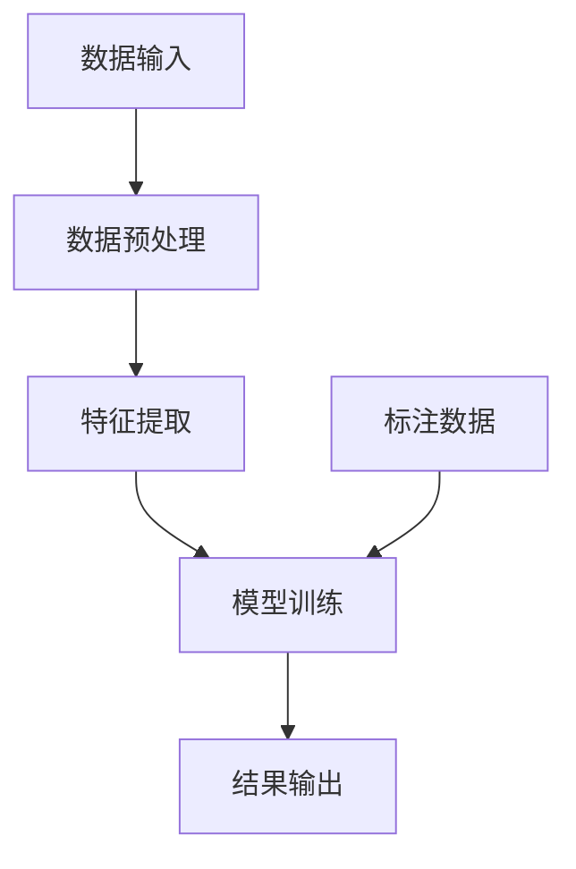

# 构建AI Agent的实时情感分析引擎

> 关键词：AI Agent、实时情感分析引擎、自然语言处理、机器学习、深度学习、情感分类、实时处理

> 摘要：本文旨在深入探讨构建AI Agent的实时情感分析引擎的相关技术与方法。首先介绍了该领域的背景信息，包括目的、预期读者、文档结构和术语表。接着详细阐述了核心概念及其联系，通过文本示意图和Mermaid流程图进行清晰展示。然后讲解了核心算法原理，并用Python源代码进行详细说明，同时给出了相关的数学模型和公式，并举例说明。在项目实战部分，提供了开发环境搭建的步骤、源代码实现及详细解读。还探讨了实际应用场景，推荐了学习资源、开发工具框架和相关论文著作。最后总结了未来发展趋势与挑战，并给出常见问题解答和扩展阅读参考资料，帮助读者全面了解和掌握构建实时情感分析引擎的技术。

## 1. 背景介绍 
### 1.1 目的和范围
随着人工智能技术的飞速发展，AI Agent在各个领域的应用越来越广泛。实时情感分析引擎作为AI Agent的重要组成部分，能够帮助AI Agent更好地理解用户的情感状态，从而提供更加个性化、人性化的交互服务。本文章的目的在于详细介绍构建AI Agent的实时情感分析引擎的完整流程，包括核心概念、算法原理、数学模型、项目实战等方面。范围涵盖了从基础理论到实际应用的各个环节，旨在为读者提供一个全面、系统的学习和实践指南。

### 1.2 预期读者
本文预期读者包括但不限于人工智能领域的开发者、研究人员、数据科学家、软件工程师等。对于对实时情感分析技术感兴趣，希望深入了解其原理和实现方法的初学者，也具有一定的参考价值。同时，对于那些希望将实时情感分析技术应用于实际项目中的企业和开发者，本文提供的项目实战案例和相关建议也能够提供有益的帮助。

### 1.3 文档结构概述
本文将按照以下结构进行组织：首先介绍背景信息，包括目的、预期读者、文档结构和术语表；接着阐述核心概念及其联系，通过文本示意图和Mermaid流程图进行清晰展示；然后讲解核心算法原理，并用Python源代码进行详细说明，同时给出相关的数学模型和公式，并举例说明；在项目实战部分，提供开发环境搭建的步骤、源代码实现及详细解读；之后探讨实际应用场景；推荐学习资源、开发工具框架和相关论文著作；最后总结未来发展趋势与挑战，并给出常见问题解答和扩展阅读参考资料。

### 1.4 术语表
#### 1.4.1 核心术语定义
- **AI Agent**：人工智能代理，是一种能够感知环境、自主决策并采取行动以实现特定目标的软件实体。
- **实时情感分析引擎**：一种能够实时对文本、语音等数据进行情感分析的系统，通过对输入数据的处理和分析，判断其情感倾向，如积极、消极或中性。
- **自然语言处理（NLP）**：是人工智能的一个重要分支，主要研究如何让计算机理解、处理和生成人类语言。
- **机器学习（ML）**：是一门多领域交叉学科，涉及概率论、统计学、逼近论、凸分析、算法复杂度理论等多门学科。它专门研究计算机怎样模拟或实现人类的学习行为，以获取新的知识或技能，重新组织已有的知识结构使之不断改善自身的性能。
- **深度学习（DL）**：是机器学习的一个分支领域，它是一种基于对数据进行表征学习的方法。深度学习通过构建具有很多层的神经网络模型，自动从大量数据中学习特征和模式。
- **情感分类**：是指将文本、语音等数据按照其情感倾向进行分类的任务，常见的分类类别包括积极、消极和中性。

#### 1.4.2 相关概念解释
- **词向量**：是将词语表示为实数向量的一种方法，通过将词语映射到向量空间中，使得语义相近的词语在向量空间中距离较近。词向量可以捕捉词语的语义信息，为后续的文本处理任务提供基础。
- **循环神经网络（RNN）**：是一种专门用于处理序列数据的神经网络模型，它能够记住序列中的历史信息，适用于处理文本、语音等具有序列特征的数据。
- **长短期记忆网络（LSTM）**：是RNN的一种改进版本，通过引入门控机制，解决了传统RNN在处理长序列时容易出现的梯度消失或梯度爆炸问题，能够更好地捕捉序列中的长距离依赖关系。
- **卷积神经网络（CNN）**：是一种专门用于处理具有网格结构数据的神经网络模型，如图像、文本等。CNN通过卷积层、池化层等操作，自动提取数据中的特征。

#### 1.4.3 缩略词列表
- **NLP**：Natural Language Processing（自然语言处理）
- **ML**：Machine Learning（机器学习）
- **DL**：Deep Learning（深度学习）
- **RNN**：Recurrent Neural Network（循环神经网络）
- **LSTM**：Long Short-Term Memory（长短期记忆网络）
- **CNN**：Convolutional Neural Network（卷积神经网络）

## 2. 核心概念与联系 
### 核心概念原理
实时情感分析引擎的核心在于对输入数据进行情感倾向的判断。其基本原理是通过对文本、语音等数据进行处理和分析，提取其中的特征信息，然后利用机器学习或深度学习模型对这些特征进行分类，从而判断数据的情感倾向。

在自然语言处理中，文本数据通常需要进行预处理，包括分词、去除停用词、词干提取等操作，以将文本转换为计算机能够处理的形式。然后，将预处理后的文本转换为词向量表示，以便后续的模型训练和预测。

机器学习和深度学习模型是实时情感分析引擎的关键组成部分。常见的机器学习模型包括朴素贝叶斯分类器、支持向量机等，而深度学习模型则包括RNN、LSTM、CNN等。这些模型通过对大量标注数据的学习，能够自动发现数据中的特征和模式，从而实现对文本情感的准确分类。

### 架构的文本示意图
实时情感分析引擎的架构主要包括数据输入层、数据预处理层、特征提取层、模型训练层和结果输出层。

- **数据输入层**：接收来自不同数据源的文本、语音等数据，如社交媒体评论、客户反馈、语音通话记录等。
- **数据预处理层**：对输入数据进行清洗、分词、去除停用词、词干提取等操作，将文本转换为计算机能够处理的形式。
- **特征提取层**：将预处理后的文本转换为词向量表示，如Word2Vec、GloVe等，同时提取其他特征，如词性、句法结构等。
- **模型训练层**：使用机器学习或深度学习模型对特征进行训练，如朴素贝叶斯分类器、支持向量机、RNN、LSTM、CNN等。
- **结果输出层**：根据训练好的模型对输入数据进行情感分类，输出情感倾向结果，如积极、消极或中性。

### Mermaid流程图


## 3. 核心算法原理 & 具体操作步骤 
### 核心算法原理
在实时情感分析中，我们可以使用多种算法，这里以LSTM为例进行详细介绍。LSTM是一种特殊的RNN，能够有效地处理长序列数据。其核心思想是通过门控机制来控制信息的流动，从而解决传统RNN在处理长序列时容易出现的梯度消失或梯度爆炸问题。

LSTM单元包含三个门：输入门、遗忘门和输出门。输入门决定了当前输入信息的哪些部分需要被添加到单元状态中；遗忘门决定了单元状态中哪些信息需要被遗忘；输出门决定了单元状态的哪些部分需要被输出。

### 具体操作步骤
1. **数据预处理**：对输入的文本数据进行清洗、分词、去除停用词等操作，将文本转换为单词序列。
2. **词向量表示**：使用预训练的词向量模型（如Word2Vec、GloVe）将单词序列转换为词向量序列。
3. **构建LSTM模型**：使用深度学习框架（如TensorFlow、PyTorch）构建LSTM模型，包括输入层、LSTM层、全连接层和输出层。
4. **模型训练**：使用标注好的数据集对LSTM模型进行训练，调整模型的参数以最小化损失函数。
5. **模型评估**：使用测试数据集对训练好的模型进行评估，计算模型的准确率、召回率、F1值等指标。
6. **实时预测**：将实时输入的文本数据经过预处理和词向量表示后，输入到训练好的模型中，得到情感分类结果。

### Python源代码详细阐述
```python
import numpy as np
import tensorflow as tf
from tensorflow.keras.preprocessing.text import Tokenizer
from tensorflow.keras.preprocessing.sequence import pad_sequences
from tensorflow.keras.models import Sequential
from tensorflow.keras.layers import Embedding, LSTM, Dense

# 示例数据
sentences = ["This is a great movie!", "I really dislike this book.", "It's just okay."]
labels = [1, 0, 2]  # 1: 积极, 0: 消极, 2: 中性

# 数据预处理
tokenizer = Tokenizer(num_words=1000)
tokenizer.fit_on_texts(sentences)
sequences = tokenizer.texts_to_sequences(sentences)
max_length = max([len(seq) for seq in sequences])
padded_sequences = pad_sequences(sequences, maxlen=max_length)

# 构建LSTM模型
model = Sequential()
model.add(Embedding(input_dim=1000, output_dim=100, input_length=max_length))
model.add(LSTM(128))
model.add(Dense(3, activation='softmax'))

# 编译模型
model.compile(optimizer='adam', loss='sparse_categorical_crossentropy', metrics=['accuracy'])

# 模型训练
model.fit(padded_sequences, np.array(labels), epochs=10, batch_size=1)

# 实时预测示例
new_sentence = ["This is an amazing experience!"]
new_sequence = tokenizer.texts_to_sequences(new_sentence)
new_padded_sequence = pad_sequences(new_sequence, maxlen=max_length)
prediction = model.predict(new_padded_sequence)
predicted_label = np.argmax(prediction)

print("预测的情感标签:", predicted_label)
```

## 4. 数学模型和公式 & 详细讲解 & 举例说明 
### 数学模型和公式
#### 词向量表示
在自然语言处理中，常用的词向量表示方法是Word2Vec和GloVe。这里以Word2Vec为例进行介绍。Word2Vec通过训练一个神经网络模型来学习词语的向量表示。其基本思想是通过预测一个词语的上下文词语来学习该词语的向量表示。

Word2Vec有两种训练模式：连续词袋模型（CBOW）和跳过-gram模型（Skip-gram）。

- **CBOW模型**：给定上下文词语，预测中心词语。其数学模型可以表示为：
$$
P(w_t|w_{t - c}, \cdots, w_{t - 1}, w_{t + 1}, \cdots, w_{t + c}) = \frac{\exp(\mathbf{v}_{w_t}^T \cdot \mathbf{h})}{\sum_{w = 1}^{V} \exp(\mathbf{v}_{w}^T \cdot \mathbf{h})}
$$
其中，$w_t$ 是中心词语，$w_{t - c}, \cdots, w_{t - 1}, w_{t + 1}, \cdots, w_{t + c}$ 是上下文词语，$\mathbf{v}_{w}$ 是词语 $w$ 的向量表示，$\mathbf{h}$ 是上下文词语向量的平均值。

- **Skip-gram模型**：给定中心词语，预测上下文词语。其数学模型可以表示为：
$$
P(w_{t + j}|w_t) = \frac{\exp(\mathbf{v}_{w_{t + j}}^T \cdot \mathbf{v}_{w_t})}{\sum_{w = 1}^{V} \exp(\mathbf{v}_{w}^T \cdot \mathbf{v}_{w_t})}
$$
其中，$w_t$ 是中心词语，$w_{t + j}$ 是上下文词语，$\mathbf{v}_{w}$ 是词语 $w$ 的向量表示。

#### LSTM模型
LSTM单元的数学模型可以表示为：

- **遗忘门**：
$$
\mathbf{f}_t = \sigma(\mathbf{W}_f \cdot [\mathbf{h}_{t - 1}, \mathbf{x}_t] + \mathbf{b}_f)
$$
其中，$\mathbf{f}_t$ 是遗忘门的输出，$\sigma$ 是sigmoid函数，$\mathbf{W}_f$ 是遗忘门的权重矩阵，$\mathbf{h}_{t - 1}$ 是上一时刻的隐藏状态，$\mathbf{x}_t$ 是当前时刻的输入，$\mathbf{b}_f$ 是遗忘门的偏置向量。

- **输入门**：
$$
\mathbf{i}_t = \sigma(\mathbf{W}_i \cdot [\mathbf{h}_{t - 1}, \mathbf{x}_t] + \mathbf{b}_i)
$$
$$
\tilde{\mathbf{C}}_t = \tanh(\mathbf{W}_C \cdot [\mathbf{h}_{t - 1}, \mathbf{x}_t] + \mathbf{b}_C)
$$
其中，$\mathbf{i}_t$ 是输入门的输出，$\tilde{\mathbf{C}}_t$ 是候选单元状态，$\mathbf{W}_i$ 和 $\mathbf{W}_C$ 是输入门和候选单元状态的权重矩阵，$\mathbf{b}_i$ 和 $\mathbf{b}_C$ 是输入门和候选单元状态的偏置向量。

- **单元状态更新**：
$$
\mathbf{C}_t = \mathbf{f}_t \odot \mathbf{C}_{t - 1} + \mathbf{i}_t \odot \tilde{\mathbf{C}}_t
$$
其中，$\mathbf{C}_t$ 是当前时刻的单元状态，$\odot$ 是元素级乘法。

- **输出门**：
$$
\mathbf{o}_t = \sigma(\mathbf{W}_o \cdot [\mathbf{h}_{t - 1}, \mathbf{x}_t] + \mathbf{b}_o)
$$
$$
\mathbf{h}_t = \mathbf{o}_t \odot \tanh(\mathbf{C}_t)
$$
其中，$\mathbf{o}_t$ 是输出门的输出，$\mathbf{h}_t$ 是当前时刻的隐藏状态，$\mathbf{W}_o$ 是输出门的权重矩阵，$\mathbf{b}_o$ 是输出门的偏置向量。

### 详细讲解
#### 词向量表示
词向量表示的核心思想是将词语映射到一个低维的向量空间中，使得语义相近的词语在向量空间中距离较近。通过训练Word2Vec模型，我们可以学习到每个词语的向量表示。在训练过程中，模型通过最大化预测上下文词语的概率来调整词语的向量表示。

#### LSTM模型
LSTM模型通过门控机制来控制信息的流动。遗忘门决定了单元状态中哪些信息需要被遗忘，输入门决定了当前输入信息的哪些部分需要被添加到单元状态中，输出门决定了单元状态的哪些部分需要被输出。通过这种方式，LSTM能够有效地处理长序列数据，捕捉序列中的长距离依赖关系。

### 举例说明
#### 词向量表示
假设我们有一个文本数据集，包含以下句子：
```
["I love apples", "She likes bananas", "He hates oranges"]
```
使用Word2Vec模型训练后，我们可以得到每个词语的向量表示。例如，“love” 和 “like” 的向量表示在向量空间中可能比较接近，因为它们的语义相近；而 “love” 和 “hate” 的向量表示在向量空间中可能比较远，因为它们的语义相反。

#### LSTM模型
假设我们要对以下句子进行情感分析：
```
"This is a great movie!"
```
首先，将句子进行分词和词向量表示，得到一个词向量序列。然后，将词向量序列输入到LSTM模型中。LSTM模型通过门控机制处理序列数据，最终输出一个情感分类结果，如积极、消极或中性。

## 5. 项目实战：代码实际案例和详细解释说明 
### 5.1  开发环境搭建
#### 安装Python
首先，需要安装Python环境。可以从Python官方网站（https://www.python.org/downloads/）下载适合自己操作系统的Python版本，并按照安装向导进行安装。

#### 安装深度学习框架
我们选择使用TensorFlow作为深度学习框架。可以使用以下命令来安装TensorFlow：
```sh
pip install tensorflow
```

#### 安装其他依赖库
还需要安装一些其他的依赖库，如NumPy、Pandas等。可以使用以下命令来安装：
```sh
pip install numpy pandas
```

### 5.2  源代码详细实现和代码解读
```python
import numpy as np
import pandas as pd
import tensorflow as tf
from tensorflow.keras.preprocessing.text import Tokenizer
from tensorflow.keras.preprocessing.sequence import pad_sequences
from tensorflow.keras.models import Sequential
from tensorflow.keras.layers import Embedding, LSTM, Dense
from sklearn.model_selection import train_test_split

# 加载数据集
data = pd.read_csv('sentiment_data.csv')
sentences = data['text'].values
labels = data['label'].values

# 数据预处理
tokenizer = Tokenizer(num_words=10000)
tokenizer.fit_on_texts(sentences)
sequences = tokenizer.texts_to_sequences(sentences)
max_length = max([len(seq) for seq in sequences])
padded_sequences = pad_sequences(sequences, maxlen=max_length)

# 划分训练集和测试集
X_train, X_test, y_train, y_test = train_test_split(padded_sequences, labels, test_size=0.2, random_state=42)

# 构建LSTM模型
model = Sequential()
model.add(Embedding(input_dim=10000, output_dim=100, input_length=max_length))
model.add(LSTM(128))
model.add(Dense(3, activation='softmax'))

# 编译模型
model.compile(optimizer='adam', loss='sparse_categorical_crossentropy', metrics=['accuracy'])

# 模型训练
model.fit(X_train, y_train, epochs=10, batch_size=32, validation_data=(X_test, y_test))

# 模型评估
loss, accuracy = model.evaluate(X_test, y_test)
print(f"测试集损失: {loss}, 测试集准确率: {accuracy}")

# 实时预测示例
new_sentence = ["This is an amazing experience!"]
new_sequence = tokenizer.texts_to_sequences(new_sentence)
new_padded_sequence = pad_sequences(new_sequence, maxlen=max_length)
prediction = model.predict(new_padded_sequence)
predicted_label = np.argmax(prediction)

print("预测的情感标签:", predicted_label)
```

### 代码解读与分析
#### 数据加载和预处理
- 使用 `pandas` 库加载包含文本和情感标签的数据集。
- 使用 `Tokenizer` 对文本进行分词和编码，将文本转换为数字序列。
- 使用 `pad_sequences` 对数字序列进行填充，使其长度一致。

#### 数据集划分
使用 `train_test_split` 函数将数据集划分为训练集和测试集，比例为8:2。

#### 模型构建
- 使用 `Sequential` 模型构建一个简单的LSTM模型。
- `Embedding` 层将输入的数字序列转换为词向量表示。
- `LSTM` 层对词向量序列进行处理，捕捉序列中的长距离依赖关系。
- `Dense` 层作为输出层，使用 `softmax` 激活函数输出情感分类结果。

#### 模型编译和训练
- 使用 `adam` 优化器和 `sparse_categorical_crossentropy` 损失函数编译模型。
- 使用 `fit` 方法对模型进行训练，指定训练集和验证集，以及训练的轮数和批次大小。

#### 模型评估和预测
- 使用 `evaluate` 方法对模型在测试集上的性能进行评估，计算损失和准确率。
- 对于实时输入的文本，经过预处理后输入到训练好的模型中，使用 `predict` 方法进行预测，得到情感分类结果。

## 6. 实际应用场景 
### 社交媒体监测
在社交媒体平台上，实时情感分析引擎可以帮助企业和品牌了解用户对其产品、服务或活动的看法和态度。通过分析用户的评论、帖子等内容，企业可以及时发现用户的不满和需求，采取相应的措施进行改进和优化。同时，也可以通过分析用户的情感倾向，制定更加有效的营销策略。

### 客户服务
在客户服务领域，实时情感分析引擎可以帮助客服人员更好地理解客户的情感状态，从而提供更加个性化、人性化的服务。例如，当客户情绪激动时，客服人员可以及时采取安抚措施，缓解客户的不满情绪；当客户表达满意时，客服人员可以进一步了解客户的需求，提供更加优质的服务。

### 市场调研
在市场调研中，实时情感分析引擎可以帮助企业快速了解消费者对新产品、新品牌的看法和态度。通过分析消费者的反馈和评价，企业可以及时调整产品策略和市场定位，提高产品的市场竞争力。

### 舆情监测
政府和相关部门可以利用实时情感分析引擎对社会舆情进行监测和分析。通过分析新闻报道、社交媒体等渠道的信息，及时了解公众对重大事件、政策的看法和态度，以便采取相应的措施进行引导和管理。

## 7. 工具和资源推荐
### 7.1 学习资源推荐
#### 7.1.1 书籍推荐
- 《Python自然语言处理实战：核心技术与算法》：本书详细介绍了Python在自然语言处理领域的应用，包括文本预处理、词向量表示、情感分析等方面的内容。
- 《深度学习》：由深度学习领域的三位顶尖专家Ian Goodfellow、Yoshua Bengio和Aaron Courville撰写，是深度学习领域的经典教材，涵盖了深度学习的基本概念、算法和应用。
- 《神经网络与深度学习》：由邱锡鹏教授撰写，系统地介绍了神经网络和深度学习的基本原理、算法和应用，适合初学者和有一定基础的读者阅读。

#### 7.1.2 在线课程
- Coursera上的“Natural Language Processing Specialization”：由深度学习领域的知名专家授课，全面介绍了自然语言处理的基本概念、算法和应用，包括情感分析、机器翻译等方面的内容。
- edX上的“Deep Learning Fundamentals”：该课程由微软提供，介绍了深度学习的基本原理、算法和应用，包括神经网络、卷积神经网络、循环神经网络等方面的内容。
- 中国大学MOOC上的“自然语言处理”：由哈工大的车万翔教授授课，系统地介绍了自然语言处理的基本概念、算法和应用，适合初学者和有一定基础的读者学习。

#### 7.1.3 技术博客和网站
- Medium：是一个知名的技术博客平台，上面有很多关于人工智能、自然语言处理等领域的优秀文章，可以帮助读者了解最新的技术动态和研究成果。
- arXiv：是一个预印本平台，上面有很多关于人工智能、自然语言处理等领域的最新研究论文，可以帮助读者了解最新的研究进展。
- 机器之心：是一个专注于人工智能领域的媒体平台，提供了很多关于人工智能技术、应用和行业动态的资讯和分析文章。

### 7.2 开发工具框架推荐
#### 7.2.1 IDE和编辑器
- PyCharm：是一款专门为Python开发设计的集成开发环境（IDE），具有强大的代码编辑、调试、自动补全、代码分析等功能，适合Python开发者使用。
- Jupyter Notebook：是一个基于Web的交互式计算环境，支持多种编程语言，如Python、R等。它可以方便地进行代码编写、数据可视化和文档撰写，适合数据科学家和研究人员使用。
- Visual Studio Code：是一款轻量级的代码编辑器，支持多种编程语言，具有丰富的插件和扩展功能。它可以方便地进行代码编写、调试和版本控制，适合开发者使用。

#### 7.2.2 调试和性能分析工具
- TensorBoard：是TensorFlow提供的一个可视化工具，可以帮助开发者可视化模型的训练过程、损失函数、准确率等指标，以及模型的结构和参数分布。
- Py-Spy：是一个Python性能分析工具，可以帮助开发者分析Python程序的性能瓶颈，找出耗时较长的函数和代码段。
- cProfile：是Python标准库中提供的一个性能分析工具，可以帮助开发者分析Python程序的性能，找出函数的调用次数、执行时间等信息。

#### 7.2.3 相关框架和库
- TensorFlow：是一个开源的深度学习框架，由Google开发和维护。它提供了丰富的深度学习模型和工具，支持CPU、GPU和TPU等多种计算设备，适合大规模的深度学习开发和研究。
- PyTorch：是一个开源的深度学习框架，由Facebook开发和维护。它具有动态图机制，易于使用和调试，适合快速原型开发和研究。
- NLTK：是一个开源的自然语言处理工具包，提供了丰富的自然语言处理工具和数据集，如分词、词性标注、命名实体识别等，适合初学者和有一定基础的读者使用。

### 7.3 相关论文著作推荐
#### 7.3.1 经典论文
- "Efficient Estimation of Word Representations in Vector Space"：提出了Word2Vec模型，为词向量表示的研究奠定了基础。
- "Long Short-Term Memory"：提出了LSTM模型，解决了传统RNN在处理长序列时容易出现的梯度消失或梯度爆炸问题。
- "Convolutional Neural Networks for Sentence Classification"：将卷积神经网络应用于句子分类任务，取得了很好的效果。

#### 7.3.2 最新研究成果
- 关注arXiv上关于实时情感分析、自然语言处理等领域的最新研究论文，了解最新的研究进展和技术趋势。
- 参加相关的学术会议，如ACL（Association for Computational Linguistics）、EMNLP（Conference on Empirical Methods in Natural Language Processing）等，了解最新的研究成果和应用案例。

#### 7.3.3 应用案例分析
- 可以参考一些知名企业和研究机构的应用案例，了解实时情感分析引擎在实际应用中的效果和挑战。例如，Google、Facebook等公司在社交媒体监测和客户服务方面的应用案例。

## 8. 总结：未来发展趋势与挑战
### 未来发展趋势
#### 多模态情感分析
未来的实时情感分析引擎将不仅仅局限于文本数据，还将结合语音、图像、视频等多模态数据进行情感分析。通过综合分析多种模态的数据，可以更全面、准确地理解用户的情感状态。

#### 个性化情感分析
随着人工智能技术的发展，未来的实时情感分析引擎将能够根据用户的个人特征、历史行为等信息进行个性化的情感分析。例如，针对不同年龄、性别、文化背景的用户，提供更加个性化的情感分析结果和服务。

#### 与其他技术的融合
实时情感分析引擎将与其他人工智能技术，如智能对话系统、计算机视觉、机器人技术等进行深度融合。例如，在智能对话系统中，实时情感分析引擎可以帮助系统更好地理解用户的情感状态，提供更加人性化的交互服务；在机器人技术中，实时情感分析引擎可以帮助机器人更好地理解人类的情感，实现更加自然、友好的人机交互。

### 挑战
#### 数据质量和标注
实时情感分析需要大量的标注数据进行模型训练，但是数据的质量和标注的准确性往往难以保证。例如，不同的人对同一文本的情感理解可能存在差异，导致标注结果不一致。因此，如何提高数据的质量和标注的准确性是一个亟待解决的问题。

#### 语义理解和语境分析
自然语言具有丰富的语义和语境信息，实时情感分析引擎需要准确理解这些信息才能进行准确的情感分析。但是，目前的自然语言处理技术在语义理解和语境分析方面还存在一定的局限性，如何提高语义理解和语境分析的能力是一个挑战。

#### 实时处理能力
实时情感分析需要在短时间内对大量的数据进行处理和分析，对系统的实时处理能力提出了很高的要求。如何提高系统的实时处理能力，确保在高并发情况下能够及时、准确地输出情感分析结果，是一个需要解决的问题。

## 9. 附录：常见问题与解答
### 问题1：如何选择合适的词向量表示方法？
解答：常见的词向量表示方法有Word2Vec、GloVe、FastText等。选择合适的词向量表示方法需要考虑以下因素：
- **数据规模**：如果数据规模较小，可以选择预训练的词向量模型，如Word2Vec、GloVe；如果数据规模较大，可以考虑在自己的数据集上训练词向量模型。
- **任务类型**：不同的任务对词向量的要求可能不同。例如，在文本分类任务中，词向量需要能够捕捉词语的语义信息；在命名实体识别任务中，词向量需要能够捕捉词语的上下文信息。
- **计算资源**：不同的词向量表示方法需要的计算资源不同。例如，训练Word2Vec模型需要较多的计算资源，而使用预训练的词向量模型则相对较少。

### 问题2：如何提高LSTM模型的性能？
解答：可以从以下几个方面提高LSTM模型的性能：
- **数据预处理**：对输入数据进行充分的预处理，如分词、去除停用词、词干提取等，以提高数据的质量。
- **模型结构调整**：可以尝试调整LSTM模型的层数、隐藏单元数等参数，以找到最优的模型结构。
- **正则化方法**：使用正则化方法，如Dropout、L1和L2正则化等，以防止模型过拟合。
- **优化器选择**：选择合适的优化器，如Adam、Adagrad等，以加快模型的收敛速度。
- **数据增强**：使用数据增强方法，如随机替换、插入、删除等，以增加训练数据的多样性。

### 问题3：如何处理实时情感分析中的不平衡数据问题？
解答：不平衡数据问题是指数据集中不同类别的样本数量差异较大。可以采用以下方法处理不平衡数据问题：
- **数据采样**：可以采用过采样（如SMOTE算法）或欠采样的方法，使不同类别的样本数量更加平衡。
- **代价敏感学习**：在模型训练过程中，对不同类别的样本赋予不同的权重，使模型更加关注少数类样本。
- **集成学习**：使用集成学习方法，如Bagging、Boosting等，将多个弱分类器组合成一个强分类器，以提高模型对少数类样本的分类能力。

## 10. 扩展阅读 & 参考资料
### 扩展阅读
- 《自然语言处理入门》：由何晗撰写，系统地介绍了自然语言处理的基本概念、算法和应用，适合初学者阅读。
- 《动手学深度学习》：由李沐等作者撰写，通过大量的代码示例和实践项目，帮助读者深入理解深度学习的原理和应用。
- 《人工智能：现代方法》：由Stuart Russell和Peter Norvig撰写，是人工智能领域的经典教材，涵盖了人工智能的各个方面，包括自然语言处理、机器学习、知识表示等。

### 参考资料
- 相关的学术论文和研究报告，如ACL、EMNLP等会议的论文集。
- 开源项目和代码库，如GitHub上的相关项目。
- 官方文档和教程，如TensorFlow、PyTorch等深度学习框架的官方文档。