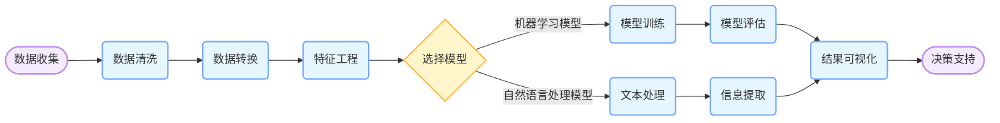

# 构建AI辅助的并购交易分析系统

> 关键词：AI、并购交易分析、数据分析、机器学习、系统构建、交易评估、智能决策

> 摘要：本文聚焦于构建AI辅助的并购交易分析系统。首先阐述了该系统开发的背景、目的、预期读者等内容，深入剖析了核心概念与联系，详细讲解了核心算法原理及具体操作步骤，通过数学模型和公式进行理论支撑并举例说明。接着通过项目实战展示了系统开发环境搭建、源代码实现与解读。探讨了该系统的实际应用场景，推荐了相关的学习资源、开发工具框架以及论文著作。最后总结了系统未来发展趋势与挑战，并提供常见问题解答和扩展阅读参考资料，旨在为构建高效、智能的并购交易分析系统提供全面的技术指导和理论依据。

## 1. 背景介绍 
### 1.1 目的和范围
在当今竞争激烈的商业环境中，并购交易作为企业实现快速扩张、优化资源配置的重要战略手段，其复杂性和风险性也日益增加。传统的并购交易分析主要依赖人工经验和简单的数据分析工具，存在效率低下、主观性强、难以处理海量数据等问题。构建AI辅助的并购交易分析系统的目的在于利用人工智能技术，如机器学习、自然语言处理等，对并购交易涉及的各种数据进行深度挖掘和分析，为决策者提供全面、准确、客观的信息，从而降低并购风险，提高并购成功率。

本系统的范围涵盖了从并购目标筛选、尽职调查、估值分析到交易结构设计等并购交易的全流程。系统将整合企业财务数据、市场数据、行业报告、新闻资讯等多源数据，通过多种分析模型和算法，实现对并购目标的综合评估和交易方案的优化。

### 1.2 预期读者
本文的预期读者包括企业高管、投资银行家、并购顾问、财务分析师、数据科学家以及对人工智能在金融领域应用感兴趣的研究人员。企业高管可以借助该系统更好地制定并购战略，投资银行家和并购顾问可以利用系统提高工作效率和服务质量，财务分析师可以通过系统进行更深入的财务分析，数据科学家可以从中获取构建相关系统的技术思路和方法，研究人员可以将其作为研究人工智能在金融领域应用的参考案例。

### 1.3 文档结构概述
本文将按照以下结构展开：首先介绍系统开发的背景信息，包括目的、预期读者和文档结构概述等；接着阐述核心概念与联系，通过文本示意图和Mermaid流程图展示系统的原理和架构；然后详细讲解核心算法原理及具体操作步骤，给出Python源代码示例；再通过数学模型和公式对系统进行理论支撑并举例说明；之后进行项目实战，包括开发环境搭建、源代码详细实现和代码解读；探讨系统的实际应用场景；推荐相关的学习资源、开发工具框架以及论文著作；最后总结系统未来发展趋势与挑战，提供常见问题解答和扩展阅读参考资料。

### 1.4 术语表
#### 1.4.1 核心术语定义
- **并购交易**：指企业之间通过股权收购、资产收购等方式实现合并或控制的商业行为。
- **AI（人工智能）**：是研究、开发用于模拟、延伸和扩展人的智能的理论、方法、技术及应用系统的一门新的技术科学。
- **机器学习**：是一门多领域交叉学科，涉及概率论、统计学、逼近论、凸分析、算法复杂度理论等多门学科。它专门研究计算机怎样模拟或实现人类的学习行为，以获取新的知识或技能，重新组织已有的知识结构使之不断改善自身的性能。
- **尽职调查**：是在并购交易中，对目标企业的财务、法律、运营等方面进行全面调查的过程，以评估目标企业的价值和风险。
- **估值分析**：是对目标企业的价值进行评估的过程，常用的方法包括收益法、市场法、成本法等。

#### 1.4.2 相关概念解释
- **数据挖掘**：是指从大量的数据中通过算法搜索隐藏于其中信息的过程。在并购交易分析中，数据挖掘可以帮助发现潜在的并购目标、识别风险因素等。
- **自然语言处理**：是计算机科学领域与人工智能领域中的一个重要方向。它研究能实现人与计算机之间用自然语言进行有效通信的各种理论和方法。在并购交易分析中，自然语言处理可以用于处理新闻资讯、行业报告等文本数据。
- **深度学习**：是机器学习的一个分支领域，它是一种基于对数据进行表征学习的方法。深度学习通过构建具有很多层的神经网络模型，自动从数据中学习复杂的模式和特征。

#### 1.4.3 缩略词列表
- **AI**：Artificial Intelligence（人工智能）
- **ML**：Machine Learning（机器学习）
- **NLP**：Natural Language Processing（自然语言处理）
- **ANN**：Artificial Neural Network（人工神经网络）
- **CNN**：Convolutional Neural Network（卷积神经网络）
- **RNN**：Recurrent Neural Network（循环神经网络）

## 2. 核心概念与联系 
### 核心概念原理
AI辅助的并购交易分析系统主要基于以下几个核心概念：

- **数据整合**：将企业财务数据、市场数据、行业报告、新闻资讯等多源数据进行整合，形成统一的数据仓库。这些数据来源广泛，格式多样，需要进行清洗、转换和加载等预处理操作，以确保数据的准确性和一致性。

- **特征工程**：从整合后的数据中提取有价值的特征，这些特征将作为机器学习模型的输入。特征工程包括特征选择、特征提取和特征转换等步骤，其目的是提高模型的性能和泛化能力。

- **机器学习模型**：利用各种机器学习算法，如决策树、支持向量机、神经网络等，对提取的特征进行训练和建模。这些模型可以用于预测并购目标的价值、评估并购风险、判断并购交易的可行性等。

- **自然语言处理**：对新闻资讯、行业报告等文本数据进行处理，提取其中的关键信息和情感倾向。自然语言处理技术可以帮助分析师快速了解市场动态和行业趋势，为并购决策提供参考。

### 架构的文本示意图
AI辅助的并购交易分析系统主要由数据层、处理层、模型层和应用层组成，各层之间的关系如下：

- **数据层**：负责收集、存储和管理多源数据，包括企业内部数据库、外部数据源（如金融数据提供商、新闻网站等）。

- **处理层**：对数据层中的数据进行清洗、转换和特征工程等预处理操作，将原始数据转换为适合机器学习模型输入的格式。

- **模型层**：利用各种机器学习算法和自然语言处理技术，对处理层输出的数据进行训练和建模，构建并购交易分析模型。

- **应用层**：将模型层的分析结果以可视化的方式呈现给用户，为用户提供决策支持。应用层可以包括网页界面、移动应用等。

### Mermaid流程图


## 3. 核心算法原理 & 具体操作步骤 
### 决策树算法原理
决策树是一种基于树结构进行决策的机器学习算法。它通过对数据的属性进行划分，构建一个树状结构，每个内部节点表示一个属性上的测试，每个分支表示一个测试输出，每个叶节点表示一个类别或值。决策树算法的核心是选择最优的划分属性，常用的方法有信息增益、信息增益率、基尼指数等。

### Python源代码实现
```python
import pandas as pd
from sklearn.model_selection import train_test_split
from sklearn.tree import DecisionTreeClassifier
from sklearn.metrics import accuracy_score

# 加载数据
data = pd.read_csv('merger_data.csv')

# 划分特征和标签
X = data.drop('target_variable', axis=1)
y = data['target_variable']

# 划分训练集和测试集
X_train, X_test, y_train, y_test = train_test_split(X, y, test_size=0.2, random_state=42)

# 创建决策树模型
model = DecisionTreeClassifier()

# 训练模型
model.fit(X_train, y_train)

# 预测
y_pred = model.predict(X_test)

# 评估模型
accuracy = accuracy_score(y_test, y_pred)
print(f"模型准确率: {accuracy}")
```

### 具体操作步骤
1. **数据加载**：使用`pandas`库加载并购交易相关的数据。
2. **数据划分**：将数据划分为特征和标签，然后将数据集划分为训练集和测试集。
3. **模型创建**：创建一个决策树分类器模型。
4. **模型训练**：使用训练集对模型进行训练。
5. **模型预测**：使用训练好的模型对测试集进行预测。
6. **模型评估**：使用准确率等指标评估模型的性能。

### 支持向量机算法原理
支持向量机是一种二分类模型，其基本思想是在特征空间中找到一个最优的超平面，使得不同类别的样本能够被最大程度地分开。支持向量机通过引入核函数，可以处理非线性分类问题。常用的核函数有线性核、多项式核、高斯核等。

### Python源代码实现
```python
from sklearn.svm import SVC

# 创建支持向量机模型
model = SVC(kernel='linear')

# 训练模型
model.fit(X_train, y_train)

# 预测
y_pred = model.predict(X_test)

# 评估模型
accuracy = accuracy_score(y_test, y_pred)
print(f"模型准确率: {accuracy}")
```

### 具体操作步骤
1. **模型创建**：创建一个支持向量机分类器模型，选择合适的核函数。
2. **模型训练**：使用训练集对模型进行训练。
3. **模型预测**：使用训练好的模型对测试集进行预测。
4. **模型评估**：使用准确率等指标评估模型的性能。

### 神经网络算法原理
神经网络是一种模仿人类神经系统的机器学习模型，由输入层、隐藏层和输出层组成。神经网络通过不断调整神经元之间的连接权重，来学习数据中的模式和特征。常用的神经网络模型有多层感知机、卷积神经网络、循环神经网络等。

### Python源代码实现
```python
import tensorflow as tf
from tensorflow.keras.models import Sequential
from tensorflow.keras.layers import Dense

# 构建神经网络模型
model = Sequential([
    Dense(64, activation='relu', input_shape=(X_train.shape[1],)),
    Dense(32, activation='relu'),
    Dense(1, activation='sigmoid')
])

# 编译模型
model.compile(optimizer='adam', loss='binary_crossentropy', metrics=['accuracy'])

# 训练模型
model.fit(X_train, y_train, epochs=10, batch_size=32, validation_data=(X_test, y_test))

# 评估模型
loss, accuracy = model.evaluate(X_test, y_test)
print(f"模型准确率: {accuracy}")
```

### 具体操作步骤
1. **模型构建**：使用`TensorFlow`和`Keras`构建一个神经网络模型，定义输入层、隐藏层和输出层的结构。
2. **模型编译**：选择合适的优化器、损失函数和评估指标，对模型进行编译。
3. **模型训练**：使用训练集对模型进行训练，指定训练的轮数和批次大小。
4. **模型评估**：使用测试集对模型进行评估，输出损失值和准确率。

## 4. 数学模型和公式 & 详细讲解 & 举例说明 
### 信息增益公式
信息增益是决策树算法中用于选择最优划分属性的一种方法，其计算公式如下：

$$
\text{Gain}(D, a) = \text{Ent}(D) - \sum_{v = 1}^{V} \frac{|D^v|}{|D|} \text{Ent}(D^v)
$$

其中，$D$ 表示数据集，$a$ 表示属性，$V$ 表示属性 $a$ 的取值个数，$D^v$ 表示属性 $a$ 取值为 $v$ 的样本子集，$\text{Ent}(D)$ 表示数据集 $D$ 的信息熵，其计算公式为：

$$
\text{Ent}(D) = - \sum_{k = 1}^{K} p_k \log_2 p_k
$$

其中，$K$ 表示数据集 $D$ 中类别的个数，$p_k$ 表示第 $k$ 类样本在数据集 $D$ 中所占的比例。

### 详细讲解
信息增益的本质是衡量属性 $a$ 对数据集 $D$ 的分类能力。信息熵 $\text{Ent}(D)$ 表示数据集 $D$ 的不确定性，信息熵越大，数据集的不确定性越高。当使用属性 $a$ 对数据集 $D$ 进行划分后，得到的子集 $D^v$ 的信息熵之和 $\sum_{v = 1}^{V} \frac{|D^v|}{|D|} \text{Ent}(D^v)$ 表示划分后的不确定性。信息增益 $\text{Gain}(D, a)$ 表示使用属性 $a$ 进行划分后，数据集 $D$ 的不确定性减少的程度。信息增益越大，说明属性 $a$ 对数据集 $D$ 的分类能力越强。

### 举例说明
假设有一个数据集 $D$，包含 10 个样本，分为 2 类，其中类别 1 有 6 个样本，类别 2 有 4 个样本。则数据集 $D$ 的信息熵为：

$$
\text{Ent}(D) = - \left( \frac{6}{10} \log_2 \frac{6}{10} + \frac{4}{10} \log_2 \frac{4}{10} \right) \approx 0.971
$$

假设属性 $a$ 有 2 个取值，$a_1$ 和 $a_2$，其中取值为 $a_1$ 的样本有 4 个，类别 1 有 3 个，类别 2 有 1 个；取值为 $a_2$ 的样本有 6 个，类别 1 有 3 个，类别 2 有 3 个。则：

$$
\text{Ent}(D^{a_1}) = - \left( \frac{3}{4} \log_2 \frac{3}{4} + \frac{1}{4} \log_2 \frac{1}{4} \right) \approx 0.811
$$

$$
\text{Ent}(D^{a_2}) = - \left( \frac{3}{6} \log_2 \frac{3}{6} + \frac{3}{6} \log_2 \frac{3}{6} \right) = 1
$$

$$
\sum_{v = 1}^{2} \frac{|D^v|}{|D|} \text{Ent}(D^v) = \frac{4}{10} \times 0.811 + \frac{6}{10} \times 1 \approx 0.924
$$

$$
\text{Gain}(D, a) = 0.971 - 0.924 = 0.047
$$

### 支持向量机的优化目标
支持向量机的优化目标是找到一个最优的超平面，使得不同类别的样本能够被最大程度地分开，同时保证分类误差最小。其优化目标可以表示为：

$$
\min_{\mathbf{w}, b} \frac{1}{2} \|\mathbf{w}\|^2 + C \sum_{i = 1}^{n} \xi_i
$$

$$
\text{s.t. } y_i (\mathbf{w}^T \mathbf{x}_i + b) \geq 1 - \xi_i, \xi_i \geq 0, i = 1, \cdots, n
$$

其中，$\mathbf{w}$ 是超平面的法向量，$b$ 是偏置项，$\xi_i$ 是松弛变量，$C$ 是惩罚参数，$\mathbf{x}_i$ 是样本点，$y_i$ 是样本点的标签。

### 详细讲解
目标函数 $\frac{1}{2} \|\mathbf{w}\|^2$ 表示超平面的间隔的倒数，其目的是最大化间隔。惩罚项 $C \sum_{i = 1}^{n} \xi_i$ 表示对分类误差的惩罚，$C$ 越大，对分类误差的惩罚越严重。约束条件 $y_i (\mathbf{w}^T \mathbf{x}_i + b) \geq 1 - \xi_i$ 表示样本点必须在间隔边界之外或在间隔边界上，$\xi_i \geq 0$ 表示松弛变量非负。

### 神经网络的损失函数
对于二分类问题，常用的损失函数是二元交叉熵损失函数，其计算公式为：

$$
L(y, \hat{y}) = - \frac{1}{n} \sum_{i = 1}^{n} \left[ y_i \log \hat{y}_i + (1 - y_i) \log (1 - \hat{y}_i) \right]
$$

其中，$y_i$ 是真实标签，$\hat{y}_i$ 是预测标签，$n$ 是样本数量。

### 详细讲解
二元交叉熵损失函数衡量了真实标签和预测标签之间的差异。当真实标签为 1 时，损失函数的值为 $-\log \hat{y}_i$，预测标签越接近 1，损失函数的值越小；当真实标签为 0 时，损失函数的值为 $-\log (1 - \hat{y}_i)$，预测标签越接近 0，损失函数的值越小。

### 举例说明
假设有 3 个样本，真实标签分别为 $y = [1, 0, 1]$，预测标签分别为 $\hat{y} = [0.8, 0.2, 0.6]$，则二元交叉熵损失函数的值为：

$$
L(y, \hat{y}) = - \frac{1}{3} \left[ 1 \times \log 0.8 + (1 - 1) \times \log (1 - 0.8) + 0 \times \log 0.2 + (1 - 0) \times \log (1 - 0.2) + 1 \times \log 0.6 + (1 - 1) \times \log (1 - 0.6) \right] \approx 0.324
$$

## 5. 项目实战：代码实际案例和详细解释说明 
### 5.1  开发环境搭建
#### 操作系统
推荐使用 Linux 或 macOS 操作系统，因为它们对开发工具和库的支持更好。如果使用 Windows 操作系统，需要确保安装了必要的开发工具和依赖项。

#### Python 环境
安装 Python 3.7 或以上版本，可以从 Python 官方网站（https://www.python.org/downloads/） 下载安装包进行安装。安装完成后，建议使用虚拟环境来管理项目的依赖项，可以使用`venv`或`conda`来创建虚拟环境。

```bash
# 使用 venv 创建虚拟环境
python3 -m venv myenv

# 激活虚拟环境
source myenv/bin/activate  # Linux/macOS
myenv\Scripts\activate  # Windows
```

#### 安装依赖库
在虚拟环境中安装项目所需的依赖库，主要包括`pandas`、`numpy`、`scikit-learn`、`tensorflow`、`matplotlib`等。

```bash
pip install pandas numpy scikit-learn tensorflow matplotlib
```

### 5.2  源代码详细实现和代码解读
#### 数据加载和预处理
```python
import pandas as pd
from sklearn.preprocessing import StandardScaler

# 加载数据
data = pd.read_csv('merger_data.csv')

# 处理缺失值
data = data.dropna()

# 划分特征和标签
X = data.drop('target_variable', axis=1)
y = data['target_variable']

# 数据标准化
scaler = StandardScaler()
X_scaled = scaler.fit_transform(X)
```
- **代码解读**：首先使用`pandas`库的`read_csv`函数加载并购交易相关的数据。然后使用`dropna`方法处理数据中的缺失值。接着将数据划分为特征和标签，最后使用`StandardScaler`对特征数据进行标准化处理，使得数据具有零均值和单位方差，有助于提高机器学习模型的性能。

#### 模型训练和评估
```python
from sklearn.model_selection import train_test_split
from sklearn.ensemble import RandomForestClassifier
from sklearn.metrics import accuracy_score, classification_report

# 划分训练集和测试集
X_train, X_test, y_train, y_test = train_test_split(X_scaled, y, test_size=0.2, random_state=42)

# 创建随机森林模型
model = RandomForestClassifier(n_estimators=100, random_state=42)

# 训练模型
model.fit(X_train, y_train)

# 预测
y_pred = model.predict(X_test)

# 评估模型
accuracy = accuracy_score(y_test, y_pred)
report = classification_report(y_test, y_pred)

print(f"模型准确率: {accuracy}")
print("分类报告:")
print(report)
```
- **代码解读**：使用`train_test_split`函数将标准化后的特征数据和标签数据划分为训练集和测试集，测试集占比为 20%。然后创建一个随机森林分类器模型，指定树的数量为 100。使用训练集对模型进行训练，训练完成后使用测试集进行预测。最后使用`accuracy_score`和`classification_report`评估模型的性能，输出准确率和分类报告。

#### 特征重要性分析
```python
import matplotlib.pyplot as plt

# 获取特征重要性
importances = model.feature_importances_
feature_names = X.columns

# 绘制特征重要性柱状图
plt.figure(figsize=(10, 6))
plt.bar(feature_names, importances)
plt.xlabel('特征')
plt.ylabel('重要性')
plt.title('特征重要性分析')
plt.xticks(rotation=90)
plt.show()
```
- **代码解读**：使用随机森林模型的`feature_importances_`属性获取每个特征的重要性。然后使用`matplotlib`库绘制特征重要性柱状图，直观地展示每个特征对模型的贡献程度。

### 5.3  代码解读与分析
#### 数据预处理的重要性
数据预处理是机器学习项目中非常重要的一步，它直接影响到模型的性能。在本项目中，处理缺失值可以避免数据不完整对模型训练的影响，数据标准化可以使得不同特征具有相同的尺度，有助于提高模型的收敛速度和稳定性。

#### 模型选择和调优
随机森林是一种集成学习模型，它由多个决策树组成，通过对多个决策树的结果进行综合，提高了模型的泛化能力和稳定性。在实际应用中，可以通过调整随机森林的参数，如树的数量、最大深度等，来进一步优化模型的性能。

#### 特征重要性分析的意义
特征重要性分析可以帮助我们了解哪些特征对模型的预测结果影响最大，从而可以选择最重要的特征进行模型训练，减少数据维度，提高模型的效率和解释性。

## 6. 实际应用场景 
### 并购目标筛选
在并购交易的前期阶段，企业需要从众多潜在的并购目标中筛选出最具潜力和价值的目标。AI辅助的并购交易分析系统可以通过对企业财务数据、市场数据、行业报告等多源数据的分析，利用机器学习模型对潜在并购目标进行评估和排序，帮助企业快速筛选出符合战略需求和投资标准的目标。

### 尽职调查
尽职调查是并购交易中非常重要的环节，它涉及到对目标企业的财务、法律、运营等方面进行全面调查。AI辅助的并购交易分析系统可以通过自然语言处理技术对新闻资讯、法律文件等文本数据进行分析，快速提取关键信息和风险点，为尽职调查提供支持。同时，系统还可以利用机器学习模型对目标企业的财务数据进行分析，识别潜在的财务风险和异常情况。

### 估值分析
估值分析是确定并购交易价格的重要依据。AI辅助的并购交易分析系统可以通过多种估值模型，如收益法、市场法、成本法等，结合机器学习算法对目标企业的价值进行评估。系统可以考虑多种因素，如企业的历史财务数据、市场前景、行业竞争等，提供更准确、客观的估值结果。

### 交易结构设计
在确定并购交易价格后，需要设计合理的交易结构，以降低交易风险和提高交易效率。AI辅助的并购交易分析系统可以通过对不同交易结构的模拟和分析，利用优化算法找到最优的交易结构。系统可以考虑多种因素，如税收、融资成本、股权结构等，为交易结构设计提供决策支持。

### 风险评估和预警
并购交易涉及到多种风险，如市场风险、财务风险、法律风险等。AI辅助的并购交易分析系统可以通过对多源数据的实时监测和分析，利用机器学习模型对并购交易中的风险进行评估和预警。系统可以及时发现潜在的风险因素，为企业提供风险应对建议，降低并购风险。

## 7. 工具和资源推荐
### 7.1 学习资源推荐
#### 7.1.1 书籍推荐
- 《机器学习》（周志华）：这本书是机器学习领域的经典教材，全面介绍了机器学习的基本概念、算法和应用。
- 《深度学习》（Ian Goodfellow、Yoshua Bengio、Aaron Courville）：这本书是深度学习领域的权威著作，深入讲解了深度学习的原理、模型和算法。
- 《Python 数据分析实战》（Sebastian Raschka）：这本书介绍了如何使用 Python 进行数据分析，包括数据处理、可视化、机器学习等方面的内容。

#### 7.1.2 在线课程
- Coursera 上的《机器学习》课程（Andrew Ng 教授）：这是一门非常经典的机器学习课程，适合初学者入门。
- edX 上的《深度学习》课程（由多个知名高校的教授联合授课）：这门课程深入讲解了深度学习的理论和实践。
- Kaggle 上的机器学习和数据分析教程：Kaggle 是一个数据科学竞赛平台，上面有很多优秀的教程和案例，可以帮助学习者提高实践能力。

#### 7.1.3 技术博客和网站
- Medium 上的数据科学和人工智能相关博客：Medium 上有很多数据科学家和人工智能专家分享的技术文章和经验。
- Towards Data Science：这是一个专注于数据科学和机器学习的网站，上面有很多高质量的技术文章和教程。
- AI Stack Exchange：这是一个人工智能领域的问答社区，可以在这里提问和学习。

### 7.2 开发工具框架推荐
#### 7.2.1 IDE和编辑器
- PyCharm：这是一个专业的 Python 集成开发环境，具有代码编辑、调试、版本控制等功能，适合开发大型 Python 项目。
- Jupyter Notebook：这是一个交互式的开发环境，适合进行数据分析和模型训练的实验和演示。
- Visual Studio Code：这是一个轻量级的代码编辑器，支持多种编程语言和插件，具有丰富的扩展功能。

#### 7.2.2 调试和性能分析工具
- PDB：这是 Python 内置的调试器，可以帮助开发者定位和解决代码中的问题。
- TensorBoard：这是 TensorFlow 提供的可视化工具，可以用于可视化模型的训练过程和性能指标。
- Scikit-learn 的性能评估工具：Scikit-learn 提供了多种性能评估工具，如交叉验证、网格搜索等，可以帮助开发者优化模型的性能。

#### 7.2.3 相关框架和库
- Scikit-learn：这是一个简单易用的机器学习库，提供了多种机器学习算法和工具，适合初学者和快速开发。
- TensorFlow：这是一个开源的深度学习框架，具有高效的计算能力和丰富的模型库，适合开发大规模的深度学习模型。
- PyTorch：这是一个另一个流行的深度学习框架，具有动态计算图和简洁的 API，适合研究和实验。

### 7.3 相关论文著作推荐
#### 7.3.1 经典论文
- “A Unified Approach to Interpreting Model Predictions”（Scott Lundberg、Su-In Lee）：这篇论文介绍了一种统一的模型解释方法，有助于理解机器学习模型的决策过程。
- “ImageNet Classification with Deep Convolutional Neural Networks”（Alex Krizhevsky、Ilya Sutskever、Geoffrey Hinton）：这篇论文是深度学习在图像分类领域的经典之作，提出了 AlexNet 模型。
- “Long Short-Term Memory”（Sepp Hochreiter、Jürgen Schmidhuber）：这篇论文介绍了长短期记忆网络（LSTM），解决了循环神经网络中的梯度消失问题。

#### 7.3.2 最新研究成果
- 关注顶级学术会议，如 NeurIPS、ICML、CVPR 等，这些会议上会发布很多最新的人工智能研究成果。
- 关注知名学术期刊，如 Journal of Artificial Intelligence Research（JAIR）、Artificial Intelligence 等，这些期刊上会发表很多高质量的人工智能研究论文。

#### 7.3.3 应用案例分析
- 关注行业报告和案例研究，如麦肯锡、波士顿咨询等公司发布的关于人工智能在金融领域应用的报告和案例。
- 关注企业的技术博客和开源项目，如 Google、Facebook、Microsoft 等公司的技术博客和开源项目，这些项目中会分享很多实际应用案例和技术经验。

## 8. 总结：未来发展趋势与挑战
### 未来发展趋势
#### 多模态数据融合
未来的 AI 辅助的并购交易分析系统将不仅仅局限于结构化的财务数据和市场数据，还将融合图像、音频、视频等多模态数据。例如，通过对企业的产品图片、广告视频等进行分析，更好地了解企业的品牌形象和市场竞争力。

#### 强化学习的应用
强化学习是一种通过智能体与环境进行交互，不断学习最优策略的机器学习方法。在并购交易分析中，强化学习可以用于优化交易策略，根据市场变化实时调整交易决策，提高并购交易的成功率和收益。

#### 可解释人工智能
随着人工智能技术的广泛应用，可解释人工智能变得越来越重要。在并购交易分析中，决策者需要了解模型的决策过程和依据，以便做出更明智的决策。未来的系统将更加注重模型的可解释性，采用可解释的机器学习算法和可视化技术，提高模型的透明度和可信度。

#### 与区块链技术的结合
区块链技术具有去中心化、不可篡改、安全可靠等特点，可以为并购交易提供更安全、透明的环境。未来的 AI 辅助的并购交易分析系统可以与区块链技术结合，实现交易数据的安全存储和共享，提高交易的效率和可信度。

### 挑战
#### 数据质量和隐私问题
AI 辅助的并购交易分析系统需要大量的高质量数据来训练模型。然而，数据的质量和隐私问题一直是困扰人工智能发展的难题。在并购交易中，涉及到企业的敏感信息和商业机密，如何保证数据的质量和隐私是一个亟待解决的问题。

#### 模型的泛化能力
由于并购交易的复杂性和多样性，不同的交易场景可能具有不同的特点和规律。如何提高模型的泛化能力，使其能够在不同的交易场景中都能取得良好的性能，是一个挑战。

#### 技术人才短缺
AI 辅助的并购交易分析系统涉及到人工智能、机器学习、金融等多个领域的知识和技术，需要具备跨学科知识和技能的技术人才。然而，目前这类技术人才相对短缺，如何培养和吸引更多的技术人才是一个挑战。

#### 法律法规和伦理问题
随着人工智能技术的发展，相关的法律法规和伦理问题也日益凸显。在并购交易分析中，如何确保模型的决策符合法律法规和伦理道德的要求，是一个需要关注的问题。

## 9. 附录：常见问题与解答
### 1. 如何确保数据的质量？
- 数据清洗：对收集到的数据进行清洗，去除重复、错误、缺失的数据。
- 数据验证：通过与其他数据源进行对比和验证，确保数据的准确性。
- 数据监控：建立数据监控机制，实时监测数据的质量和变化。

### 2. 如何选择合适的机器学习模型？
- 根据问题的类型：如果是分类问题，可以选择决策树、支持向量机、神经网络等分类模型；如果是回归问题，可以选择线性回归、岭回归、随机森林回归等回归模型。
- 根据数据的特点：如果数据量较小，可以选择简单的模型；如果数据量较大，可以选择复杂的模型。
- 模型评估和比较：使用交叉验证等方法对不同的模型进行评估和比较，选择性能最好的模型。

### 3. 如何提高模型的性能？
- 特征工程：通过选择和提取有价值的特征，提高模型的输入质量。
- 模型调优：通过调整模型的参数，如学习率、树的数量等，优化模型的性能。
- 集成学习：通过将多个模型的结果进行综合，提高模型的泛化能力和稳定性。

### 4. 如何保证系统的安全性？
- 数据加密：对敏感数据进行加密处理，防止数据泄露。
- 访问控制：建立严格的访问控制机制，限制用户的访问权限。
- 安全审计：定期对系统进行安全审计，及时发现和处理安全漏洞。

### 5. 如何解释模型的决策过程？
- 使用可解释的机器学习算法：如决策树、线性回归等，这些算法的决策过程比较直观。
- 特征重要性分析：通过分析特征的重要性，了解哪些特征对模型的决策影响最大。
- 可视化技术：使用可视化技术，如决策树图、特征重要性柱状图等，直观地展示模型的决策过程。

## 10. 扩展阅读 & 参考资料
### 扩展阅读
- 《人工智能：现代方法》（Stuart Russell、Peter Norvig）：这本书是人工智能领域的经典著作，全面介绍了人工智能的基本概念、算法和应用。
- 《数据挖掘：概念与技术》（Jiawei Han、Jian Pei、Jianwen Yin）：这本书是数据挖掘领域的权威著作，深入讲解了数据挖掘的原理、算法和应用。
- 《金融科技：应用与趋势》（黄益平、沈艳）：这本书介绍了金融科技的发展现状和应用趋势，包括人工智能在金融领域的应用。

### 参考资料
- 相关的学术论文和研究报告，如 IEEE Transactions on Neural Networks and Learning Systems、ACM Transactions on Intelligent Systems and Technology 等期刊上的论文。
- 相关的行业标准和规范，如国际财务报告准则（IFRS）、美国公认会计原则（GAAP）等。
- 相关的开源项目和代码库，如 GitHub 上的人工智能和机器学习相关项目。