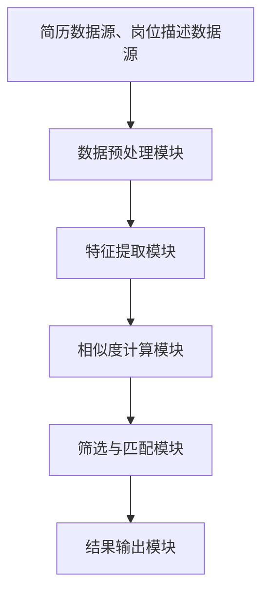

# 构建企业级AI招聘助手：简历筛选与人才匹配

> 关键词：AI招聘助手、简历筛选、人才匹配、企业级应用、自然语言处理、机器学习、深度学习

> 摘要：本文围绕构建企业级AI招聘助手展开，详细阐述了其在简历筛选与人才匹配方面的原理、技术和实现方法。从背景介绍入手，让读者了解该项目的目的、适用人群和文档结构。接着深入探讨核心概念，包括其原理和架构，通过文本示意图和Mermaid流程图直观展示。详细讲解核心算法原理，结合Python源代码进行说明，并给出相关数学模型和公式。通过项目实战，展示开发环境搭建、源代码实现和解读。分析实际应用场景，为企业提供参考。最后推荐相关工具和资源，总结未来发展趋势与挑战，解答常见问题，提供扩展阅读和参考资料，旨在帮助企业更好地利用AI技术提升招聘效率和质量。

## 1. 背景介绍 
### 1.1 目的和范围
在当今竞争激烈的就业市场中，企业面临着海量简历筛选的挑战，传统的人工筛选方式不仅效率低下，而且容易出现主观偏差，导致错过优秀人才。构建企业级AI招聘助手的目的在于利用先进的人工智能技术，实现简历的自动化筛选和精准的人才匹配，提高招聘效率和质量，降低企业的招聘成本。

本项目的范围主要涵盖简历筛选和人才匹配两个核心功能。简历筛选部分能够对大量简历进行快速分类和初步评估，筛选出符合岗位基本要求的候选人；人才匹配部分则根据岗位需求和候选人的特点，进行精准的匹配，为企业推荐最适合的人才。

### 1.2 预期读者
本文的预期读者包括企业的人力资源管理者、招聘专员，他们可以通过了解AI招聘助手的原理和应用，更好地利用这一工具提升招聘效率；也包括对人工智能在招聘领域应用感兴趣的技术人员，如数据科学家、机器学习工程师等，他们可以从中获取技术实现的思路和方法；此外，还适合相关专业的学生和研究人员，为他们的学习和研究提供参考。

### 1.3 文档结构概述
本文将按照以下结构进行阐述：首先介绍背景信息，让读者了解项目的目的、适用人群和文档结构；接着深入探讨核心概念，包括AI招聘助手的原理和架构，通过文本示意图和Mermaid流程图进行直观展示；然后详细讲解核心算法原理，结合Python源代码进行说明，并给出相关数学模型和公式；通过项目实战，展示开发环境搭建、源代码实现和解读；分析实际应用场景，为企业提供参考；最后推荐相关工具和资源，总结未来发展趋势与挑战，解答常见问题，提供扩展阅读和参考资料。

### 1.4 术语表
#### 1.4.1 核心术语定义
- **AI招聘助手**：利用人工智能技术实现简历筛选和人才匹配等招聘相关功能的软件系统。
- **简历筛选**：对收到的大量简历进行分类和评估，筛选出符合岗位基本要求的候选人的过程。
- **人才匹配**：根据岗位需求和候选人的特点，计算两者之间的匹配度，为企业推荐最适合的人才的过程。
- **自然语言处理（NLP）**：让计算机理解、处理和生成人类语言的技术。
- **机器学习（ML）**：让计算机通过数据学习模式和规律，从而进行预测和决策的技术。
- **深度学习（DL）**：机器学习的一个分支，通过构建深度神经网络来学习数据的复杂特征。

#### 1.4.2 相关概念解释
- **特征提取**：从简历和岗位描述中提取出能够反映其关键信息的特征，如技能、工作经验、教育背景等。
- **向量化**：将文本信息转换为计算机能够处理的向量表示，以便进行数学运算和机器学习算法的应用。
- **相似度计算**：计算两个向量之间的相似程度，常用的方法有余弦相似度、欧几里得距离等。

#### 1.4.3 缩略词列表
- **NLP**：自然语言处理（Natural Language Processing）
- **ML**：机器学习（Machine Learning）
- **DL**：深度学习（Deep Learning）
- **TF-IDF**：词频 - 逆文档频率（Term Frequency - Inverse Document Frequency）
- **BERT**：双向编码器表示来自变换器（Bidirectional Encoder Representations from Transformers）

## 2. 核心概念与联系 
### 核心概念原理
AI招聘助手的核心原理是利用自然语言处理和机器学习技术，对简历和岗位描述进行处理和分析，提取关键信息，计算相似度，从而实现简历筛选和人才匹配。

具体来说，首先需要对简历和岗位描述进行预处理，包括去除停用词、词干提取等操作，以减少噪声和冗余信息。然后，使用特征提取方法，如TF-IDF、BERT等，将文本信息转换为向量表示。接着，通过相似度计算方法，如余弦相似度，计算候选人简历与岗位描述之间的相似度，根据相似度得分进行排序和筛选。

### 架构的文本示意图
```plaintext
+-------------------+
|  简历数据源       |
|  岗位描述数据源   |
+-------------------+
          |
          v
+-------------------+
|  数据预处理模块   |
|  - 去除停用词     |
|  - 词干提取       |
+-------------------+
          |
          v
+-------------------+
|  特征提取模块     |
|  - TF-IDF         |
|  - BERT           |
+-------------------+
          |
          v
+-------------------+
|  相似度计算模块   |
|  - 余弦相似度     |
+-------------------+
          |
          v
+-------------------+
|  筛选与匹配模块   |
|  - 设定阈值       |
|  - 排序推荐       |
+-------------------+
          |
          v
+-------------------+
|  结果输出模块     |
|  - 推荐候选人列表 |
+-------------------+
```

### Mermaid流程图


## 3. 核心算法原理 & 具体操作步骤 
### 数据预处理
数据预处理是AI招聘助手的第一步，其目的是去除噪声和冗余信息，提高数据质量。以下是使用Python实现去除停用词和词干提取的示例代码：
```python
import nltk
from nltk.corpus import stopwords
from nltk.stem import PorterStemmer
from nltk.tokenize import word_tokenize

# 下载停用词和词干提取器所需的数据
nltk.download('stopwords')
nltk.download('punkt')

# 定义停用词列表
stop_words = set(stopwords.words('english'))

# 定义词干提取器
stemmer = PorterStemmer()

def preprocess_text(text):
    # 分词
    tokens = word_tokenize(text.lower())
    # 去除停用词
    filtered_tokens = [token for token in tokens if token.isalpha() and token not in stop_words]
    # 词干提取
    stemmed_tokens = [stemmer.stem(token) for token in filtered_tokens]
    # 重新组合成文本
    preprocessed_text = ' '.join(stemmed_tokens)
    return preprocessed_text

# 示例使用
text = "This is an example of text preprocessing."
preprocessed_text = preprocess_text(text)
print(preprocessed_text)
```
### 特征提取
特征提取是将文本信息转换为向量表示的过程，常用的方法有TF-IDF和BERT。以下是使用Python实现TF-IDF特征提取的示例代码：
```python
from sklearn.feature_extraction.text import TfidfVectorizer

# 定义TF-IDF向量器
vectorizer = TfidfVectorizer()

# 示例文本数据
corpus = [
    "This is the first document.",
    "This document is the second document.",
    "And this is the third one.",
    "Is this the first document?"
]

# 进行特征提取
tfidf_matrix = vectorizer.fit_transform(corpus)

# 输出特征向量
print(tfidf_matrix.toarray())
```
### 相似度计算
相似度计算是计算候选人简历与岗位描述之间的相似程度，常用的方法有余弦相似度。以下是使用Python实现余弦相似度计算的示例代码：
```python
from sklearn.metrics.pairwise import cosine_similarity

# 示例特征向量
vector1 = [1, 2, 3]
vector2 = [4, 5, 6]

# 计算余弦相似度
similarity = cosine_similarity([vector1], [vector2])

# 输出相似度得分
print(similarity[0][0])
```
### 筛选与匹配
筛选与匹配是根据相似度得分进行排序和筛选，推荐最适合的候选人。以下是使用Python实现筛选与匹配的示例代码：
```python
import numpy as np

# 示例相似度得分列表
similarity_scores = [0.8, 0.6, 0.7, 0.9]

# 候选人ID列表
candidate_ids = [1, 2, 3, 4]

# 设定阈值
threshold = 0.7

# 筛选出相似度得分大于阈值的候选人
selected_candidates = [candidate_ids[i] for i in range(len(similarity_scores)) if similarity_scores[i] >= threshold]

# 按相似度得分降序排序
sorted_indices = np.argsort(similarity_scores)[::-1]
sorted_candidates = [candidate_ids[i] for i in sorted_indices if similarity_scores[i] >= threshold]

# 输出筛选结果
print("Selected candidates:", selected_candidates)
print("Sorted candidates:", sorted_candidates)
```

## 4. 数学模型和公式 & 详细讲解 & 举例说明 
### TF-IDF
TF-IDF（词频 - 逆文档频率）是一种常用的文本特征提取方法，用于衡量一个词在文档中的重要性。其计算公式如下：
$$TF - IDF(t, d, D) = TF(t, d) \times IDF(t, D)$$
其中，$TF(t, d)$ 表示词 $t$ 在文档 $d$ 中的词频，即词 $t$ 在文档 $d$ 中出现的次数除以文档 $d$ 中的总词数；$IDF(t, D)$ 表示词 $t$ 的逆文档频率，计算公式为：
$$IDF(t, D) = \log\frac{|D|}{|d \in D : t \in d| + 1}$$
其中，$|D|$ 表示文档集合 $D$ 中的文档总数，$|d \in D : t \in d|$ 表示包含词 $t$ 的文档数。

举例说明：假设有一个文档集合 $D$ 包含三个文档：
- $d_1$: "This is the first document."
- $d_2$: "This document is the second document."
- $d_3$: "And this is the third one."

计算词 "document" 在文档 $d_1$ 中的 TF-IDF 值：
- 计算词频 $TF$：词 "document" 在文档 $d_1$ 中出现 1 次，文档 $d_1$ 总词数为 5，所以 $TF = \frac{1}{5} = 0.2$。
- 计算逆文档频率 $IDF$：文档集合 $D$ 中总文档数 $|D| = 3$，包含词 "document" 的文档数 $|d \in D : t \in d| = 2$，所以 $IDF = \log\frac{3}{2 + 1} = \log1 = 0$。
- 计算 TF-IDF 值：$TF - IDF = TF \times IDF = 0.2 \times 0 = 0$。

### 余弦相似度
余弦相似度是一种常用的相似度计算方法，用于计算两个向量之间的夹角余弦值，其计算公式如下：
$$\text{cosine similarity}(A, B) = \frac{A \cdot B}{\|A\| \|B\|}$$
其中，$A$ 和 $B$ 是两个向量，$A \cdot B$ 表示向量 $A$ 和 $B$ 的点积，$\|A\|$ 和 $\|B\|$ 分别表示向量 $A$ 和 $B$ 的模。

举例说明：假设有两个向量 $A = [1, 2, 3]$ 和 $B = [4, 5, 6]$，计算它们的余弦相似度：
- 计算点积 $A \cdot B$：$A \cdot B = 1 \times 4 + 2 \times 5 + 3 \times 6 = 4 + 10 + 18 = 32$。
- 计算向量模 $\|A\|$ 和 $\|B\|$：$\|A\| = \sqrt{1^2 + 2^2 + 3^2} = \sqrt{14}$，$\|B\| = \sqrt{4^2 + 5^2 + 6^2} = \sqrt{77}$。
- 计算余弦相似度：$\text{cosine similarity}(A, B) = \frac{32}{\sqrt{14} \sqrt{77}} \approx 0.9747$。

## 5. 项目实战：代码实际案例和详细解释说明 
### 5.1  开发环境搭建
为了实现企业级AI招聘助手，我们需要搭建相应的开发环境。以下是具体的步骤：
1. **安装Python**：建议安装Python 3.7及以上版本，可以从Python官方网站（https://www.python.org/downloads/）下载安装包进行安装。
2. **安装必要的库**：使用pip命令安装所需的库，包括`nltk`、`sklearn`、`numpy`等。示例命令如下：
```sh
pip install nltk sklearn numpy
```
3. **下载NLTK数据**：在Python中运行以下代码下载NLTK所需的数据：
```python
import nltk
nltk.download('stopwords')
nltk.download('punkt')
```

### 5.2  源代码详细实现和代码解读
以下是一个完整的企业级AI招聘助手的示例代码：
```python
import nltk
from nltk.corpus import stopwords
from nltk.stem import PorterStemmer
from nltk.tokenize import word_tokenize
from sklearn.feature_extraction.text import TfidfVectorizer
from sklearn.metrics.pairwise import cosine_similarity
import numpy as np

# 下载停用词和词干提取器所需的数据
nltk.download('stopwords')
nltk.download('punkt')

# 定义停用词列表
stop_words = set(stopwords.words('english'))

# 定义词干提取器
stemmer = PorterStemmer()

def preprocess_text(text):
    # 分词
    tokens = word_tokenize(text.lower())
    # 去除停用词
    filtered_tokens = [token for token in tokens if token.isalpha() and token not in stop_words]
    # 词干提取
    stemmed_tokens = [stemmer.stem(token) for token in filtered_tokens]
    # 重新组合成文本
    preprocessed_text = ' '.join(stemmed_tokens)
    return preprocessed_text

def extract_features(texts):
    # 定义TF-IDF向量器
    vectorizer = TfidfVectorizer()
    # 进行特征提取
    feature_matrix = vectorizer.fit_transform(texts)
    return feature_matrix

def calculate_similarity(feature_matrix, job_description_index):
    # 获取岗位描述的特征向量
    job_description_vector = feature_matrix[job_description_index]
    # 计算其他简历与岗位描述的相似度
    similarity_scores = cosine_similarity(feature_matrix, job_description_vector)
    return similarity_scores

def select_candidates(similarity_scores, job_description_index, threshold=0.7):
    # 排除岗位描述本身
    candidate_scores = np.delete(similarity_scores, job_description_index)
    # 筛选出相似度得分大于阈值的候选人
    selected_indices = np.where(candidate_scores >= threshold)[0]
    # 按相似度得分降序排序
    sorted_indices = np.argsort(candidate_scores[selected_indices])[::-1]
    sorted_candidates = selected_indices[sorted_indices]
    return sorted_candidates

# 示例数据
resumes = [
    "This is a resume with skills in programming and data analysis.",
    "Another resume with experience in project management and leadership.",
    "A resume highlighting skills in marketing and communication."
]

job_description = "We are looking for a candidate with programming and data analysis skills."

# 合并简历和岗位描述
all_texts = resumes + [job_description]

# 数据预处理
preprocessed_texts = [preprocess_text(text) for text in all_texts]

# 特征提取
feature_matrix = extract_features(preprocessed_texts)

# 计算相似度
job_description_index = len(resumes)
similarity_scores = calculate_similarity(feature_matrix, job_description_index)

# 筛选候选人
selected_candidates = select_candidates(similarity_scores, job_description_index)

# 输出结果
print("Selected candidates:", selected_candidates)
```
### 5.3  代码解读与分析
- **数据预处理**：`preprocess_text` 函数用于对文本进行预处理，包括分词、去除停用词和词干提取，以减少噪声和冗余信息。
- **特征提取**：`extract_features` 函数使用TF-IDF向量器将文本转换为特征向量，方便后续的相似度计算。
- **相似度计算**：`calculate_similarity` 函数计算其他简历与岗位描述的相似度得分，使用余弦相似度作为度量标准。
- **筛选候选人**：`select_candidates` 函数根据相似度得分筛选出大于阈值的候选人，并按得分降序排序。
- **主程序**：将简历和岗位描述合并，进行数据预处理和特征提取，计算相似度，筛选候选人并输出结果。

## 6. 实际应用场景 
### 大规模招聘
在大规模招聘场景下，企业会收到大量的简历，人工筛选效率低下且容易出错。AI招聘助手可以快速对大量简历进行筛选，根据岗位要求自动筛选出符合条件的候选人，大大提高招聘效率。

### 多岗位招聘
当企业同时招聘多个岗位时，AI招聘助手可以同时处理多个岗位的简历筛选和人才匹配任务。通过为每个岗位设置不同的关键词和要求，AI招聘助手可以精准地为每个岗位推荐合适的候选人。

### 高端人才招聘
在高端人才招聘中，对候选人的要求通常比较高，需要更精准的人才匹配。AI招聘助手可以通过对候选人的技能、经验、教育背景等多方面信息进行分析，找到与岗位最匹配的高端人才。

### 校园招聘
校园招聘的候选人通常缺乏工作经验，AI招聘助手可以通过分析候选人的专业、成绩、社团活动等信息，筛选出有潜力的候选人。同时，AI招聘助手还可以根据企业的文化和价值观，匹配出更适合企业的校园人才。

## 7. 工具和资源推荐
### 7.1 学习资源推荐
#### 7.1.1 书籍推荐
- 《Python自然语言处理》：介绍了自然语言处理的基本概念和方法，以及如何使用Python进行自然语言处理任务。
- 《机器学习》：详细讲解了机器学习的基本算法和模型，是学习机器学习的经典教材。
- 《深度学习》：全面介绍了深度学习的原理、算法和应用，适合深入学习深度学习的读者。

#### 7.1.2 在线课程
- Coursera上的“Natural Language Processing Specialization”：由顶尖大学的教授授课，系统地介绍了自然语言处理的各个方面。
- edX上的“Machine Learning Fundamentals”：讲解了机器学习的基本概念和算法，适合初学者。
- Udemy上的“Deep Learning A-Z™: Hands-On Artificial Neural Networks”：通过实际项目，帮助学习者掌握深度学习的应用。

#### 7.1.3 技术博客和网站
- Medium：有很多关于人工智能、自然语言处理和机器学习的技术博客，提供了最新的研究成果和实践经验。
- Towards Data Science：专注于数据科学和机器学习领域，有很多高质量的文章和教程。
- arXiv：提供了大量的学术论文，包括人工智能、自然语言处理等领域的最新研究成果。

### 7.2 开发工具框架推荐
#### 7.2.1 IDE和编辑器
- PyCharm：功能强大的Python集成开发环境，提供了代码编辑、调试、版本控制等功能。
- Jupyter Notebook：交互式的开发环境，适合数据探索和模型训练，方便展示代码和结果。
- Visual Studio Code：轻量级的代码编辑器，支持多种编程语言和插件，具有丰富的扩展功能。

#### 7.2.2 调试和性能分析工具
- Py-Spy：用于分析Python程序的性能，找出性能瓶颈。
- cProfile：Python内置的性能分析工具，可以统计函数调用的时间和次数。
- TensorBoard：用于可视化深度学习模型的训练过程和性能指标。

#### 7.2.3 相关框架和库
- NLTK：自然语言处理的经典库，提供了丰富的工具和数据集，用于文本处理、词性标注、命名实体识别等任务。
- scikit-learn：机器学习的常用库，提供了各种机器学习算法和工具，如分类、回归、聚类等。
- TensorFlow：开源的深度学习框架，广泛应用于图像识别、自然语言处理等领域。
- PyTorch：另一个流行的深度学习框架，具有动态图的优势，易于使用和调试。

### 7.3 相关论文著作推荐
#### 7.3.1 经典论文
- “Attention Is All You Need”：提出了Transformer架构，为自然语言处理领域带来了革命性的变化。
- “BERT: Pre-training of Deep Bidirectional Transformers for Language Understanding”：介绍了BERT模型，在自然语言处理任务中取得了很好的效果。
- “Word2Vec”：提出了词向量表示的方法，将文本转换为向量表示，方便进行机器学习处理。

#### 7.3.2 最新研究成果
- 关注arXiv等学术平台上关于人工智能在招聘领域应用的最新研究论文，了解最新的技术和方法。
- 参加相关的学术会议，如ACL（Association for Computational Linguistics）、ICML（International Conference on Machine Learning）等，获取最新的研究成果和趋势。

#### 7.3.3 应用案例分析
- 研究一些成功的AI招聘助手应用案例，了解其实现方法、应用场景和效果，为自己的项目提供参考。
- 关注一些企业的技术博客，了解他们在AI招聘方面的实践经验和挑战。

## 8. 总结：未来发展趋势与挑战
### 未来发展趋势
- **智能化程度不断提高**：随着人工智能技术的不断发展，AI招聘助手将具备更强的智能分析能力，能够更准确地理解候选人的意图和能力，实现更精准的人才匹配。
- **多模态融合**：未来的AI招聘助手将不仅仅依赖于文本信息，还会融合图像、音频、视频等多模态信息，全面了解候选人的情况，提高招聘的准确性和效率。
- **个性化推荐**：根据企业的文化、价值观和岗位需求，为企业提供个性化的人才推荐，更好地满足企业的需求。
- **与其他系统集成**：AI招聘助手将与企业的人力资源管理系统、办公自动化系统等进行集成，实现数据的共享和流程的自动化，提高企业的整体运营效率。

### 挑战
- **数据质量和隐私问题**：AI招聘助手的性能依赖于大量的高质量数据，但数据的收集、存储和使用过程中可能会涉及到隐私问题。如何保证数据的质量和隐私安全是一个重要的挑战。
- **算法的可解释性**：一些深度学习算法具有很强的预测能力，但缺乏可解释性。在招聘场景中，企业需要了解为什么某个候选人被推荐或筛选掉，因此提高算法的可解释性是一个亟待解决的问题。
- **语言和文化差异**：不同地区和文化背景下的语言和表达方式存在差异，AI招聘助手需要能够适应这些差异，准确理解和处理不同语言和文化的简历和岗位描述。
- **技术更新换代快**：人工智能技术发展迅速，新的算法和模型不断涌现。AI招聘助手需要不断更新和升级，以保持其竞争力和性能。

## 9. 附录：常见问题与解答
### 1. AI招聘助手能否完全替代人工招聘？
不能。虽然AI招聘助手可以提高招聘效率和质量，但在一些关键环节，如面试、沟通等，还需要人工的参与。人工招聘可以更好地了解候选人的个性、价值观等方面的信息，做出更全面的决策。

### 2. 如何保证AI招聘助手的准确性？
可以从以下几个方面保证准确性：
- 收集高质量的数据，包括简历和岗位描述等。
- 选择合适的算法和模型，并进行充分的训练和优化。
- 定期评估和调整AI招聘助手的性能，根据反馈进行改进。

### 3. AI招聘助手是否会存在偏见？
如果数据存在偏见，或者算法设计不合理，AI招聘助手可能会存在偏见。为了避免偏见，可以对数据进行预处理，去除可能存在的偏见信息；在算法设计中，采用公平性约束等方法，确保招聘过程的公平性。

### 4. 如何选择适合的AI招聘助手？
可以从以下几个方面考虑：
- 功能需求：根据企业的招聘需求，选择具备相应功能的AI招聘助手。
- 性能指标：关注AI招聘助手的准确性、效率等性能指标。
- 数据安全和隐私：确保AI招聘助手能够保证数据的安全和隐私。
- 成本效益：综合考虑AI招聘助手的价格和使用成本，选择性价比高的产品。

## 10. 扩展阅读 & 参考资料
### 扩展阅读
- 《人工智能时代的人力资源管理》：探讨了人工智能技术在人力资源管理领域的应用和发展趋势。
- 《大数据与人力资源管理》：介绍了大数据在人力资源管理中的应用，包括招聘、培训、绩效评估等方面。

### 参考资料
- NLTK官方文档：https://www.nltk.org/
- scikit-learn官方文档：https://scikit-learn.org/
- TensorFlow官方文档：https://www.tensorflow.org/
- PyTorch官方文档：https://pytorch.org/